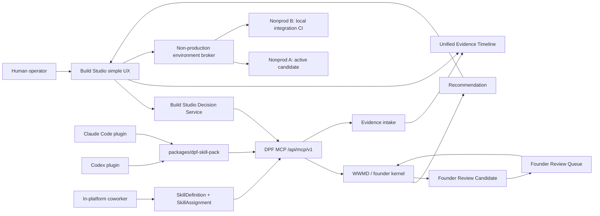

# Build Studio decision skill packs and evidence intake

## TL;DR

Build Studio should become the simple human interface over the same governed decision and skill substrate used by Claude, Codex, and in-platform AI coworkers. PR #1168 established the first dual-surface DPF skill pack: skills authored once under `packages/dpf-skill-pack/skills/<slug>/SKILL.md`, installed into Claude/Codex plugins, and seeded into DPF `SkillDefinition` rows for coworkers. This spec keeps that as the canonical substrate and adds the next layer:

1. A shared decision skill pack around WWMD/founder-kernel consultation.
2. Build Studio decision service calls that use the same pack instead of embedding routing logic in UI or orchestration branches.
3. Specialist capability packs for Build Studio phases and external coding agents.
4. External evidence intake so Claude/Codex work done outside Build Studio returns to the Build Studio timeline.
5. A central Founder Review Queue for questions the kernel cannot yet answer.
6. A shared two-environment non-production discipline so threads stop creating their own long-lived servers.
7. A simplified Build Studio UX that recommends the next action first and keeps raw skill/MCP/evidence machinery behind drill-downs.

The governing rule is: **agents ask; WWMD answers or captures; Build Studio explains the recommendation simply; evidence remains audit-ready.**

## 1. Problem

Build Studio is meant to be the primary governed product-building environment, but current development still often happens in Claude Code and Codex because the Build Studio UX and runtime have been brittle. That creates a product dilemma:

- DPF wants all development to flow through Build Studio eventually.
- The current reliable path is still external agent sessions plus repo tooling.
- Claude and Codex now have plugin and skill substrates that can improve external sessions before Build Studio fully owns the UX.
- The unique DPF advantage is not another generic coding plugin. It is the founder kernel, WWMD, live backlog state, governed evidence, and the platform's ability to turn unresolved decisions into durable learning.

The answer is not to duplicate every Build Studio behavior in every AI client. The answer is to make **DPF-governed skills and MCP decisions the shared substrate**, then let Build Studio, Claude, Codex, and coworkers call that substrate from their own surfaces.

## 2. Current Baseline

### 2.1 PR #1168 is the substrate baseline

PR #1168 added the formal DPF skill pack foundation:

- `packages/dpf-skill-pack/.claude-plugin/plugin.json`
- `packages/dpf-skill-pack/.codex-plugin/plugin.json`
- `packages/dpf-skill-pack/claude.mcp.json`
- `packages/dpf-skill-pack/codex.mcp.json`
- `packages/dpf-skill-pack/README.md`
- `packages/db/src/seed-skills.ts` support for seeding the same skill files into DPF coworker rows.

The key contract is the superset `SKILL.md` frontmatter. It contains the Claude/Codex skill fields and the DPF coworker fields in one authoring source. The loader asserts mirror invariants so external clients and in-platform coworkers do not drift.

The initial v0.1.0 skills are directly relevant to this spec:

| Skill | Reuse in this design |
|---|---|
| `dpf-decision-via-kernel` | Shared WWMD/founder-kernel decision gate |
| `dpf-verify-substrate-first` | Pre-decision grounding for specs, code, DB, and backlog |
| `dpf-file-backlog-item` | Route unresolved implementation work into governed backlog |
| `dpf-promote-to-build-studio` | Bridge backlog work into Build Studio |
| `dpf-worktree-per-session` | Keep external coding sessions isolated and auditable |
| `dpf-pr-with-dco` | Preserve DPF PR and sign-off workflow |
| `dpf-evidence-before-diagnosis` | Prevent speculative debugging and unsupported claims |

This spec extends that pack. It does not introduce a second skill registry.

### 2.2 Repo substrate already exists for most of the data

The current Prisma schema has the durable records needed for this design:

| Model | Current useful fields |
|---|---|
| `FeatureBuild` | `buildId`, phase evidence fields, `uxTestResults`, `uxVerificationStatus`, `deliberationSummary`, `buildExecState`, `phaseHandoffs`, `toolExecutionReceipts`, `decisionInteractions` |
| `PhaseHandoff` | `decisionsMade`, `openIssues`, `userPreferences`, `evidenceFields`, `evidenceDigest`, `gateResult`, `toolsUsed` |
| `TaskRun` | `buildId`, `source`, `authorityScope`, `progressPayload`, `lastHeartbeatAt`, `decisionInteractions` |
| `DecisionInteraction` | `buildId`, `taskRunId`, `routeContext`, `question`, `options`, `evidenceBundle`, `sources`, `rationale`, `confidenceBefore`, `confidenceAfter`, `outcomeType`, `principleConflict`, `outcomePayload`, `humanOutcome` |
| `ImprovementSignal` | `sourceType`, `sourceId`, `status`, `routeContext`, `buildId`, `toolName`, `recurrenceCount`, `suspectedRootCause`, `objectiveImpactHypothesis` |
| `ExternalEvidenceRecord` | `actorUserId`, `routeContext`, `operationType`, `target`, `provider`, `resultSummary`, `details`, `createdAt` |

The main additive data need is a direct optional `buildId` and `taskRunId` link on `ExternalEvidenceRecord` if route context is not enough to join external Claude/Codex work back into a Build Studio run.

### 2.3 Live planning overlap

The live MCP backlog query on 2026-05-26 shows this work intersects existing epics rather than needing a brand-new strategy epic:

- `EP-WWMD-MCP`: WWMD MCP exposure.
- `EP-REDUCTION-GEAR-ARCH`: reduction-gear agent loop substrate.
- `EP-BUILD-STUDIO-UX`: Build Studio UX redesign.
- `EP-BUILD-65837F`: formal deliberation as a platform-wide review pattern.
- `EP-BUILD-9DB5B0`: capability data calibration before tool routing.

The MCP `search_specs_and_plans` query did not find an exact existing spec for the combined "Build Studio + decision skill pack + external evidence intake + founder review queue" scope, so this document becomes the integration design rather than a replacement for those adjacent specs.

The MCP `wiki_query` sweep for the user principle "human interfaces are simple, hiding complexity and making the experience delightful" did not find a matching founder-kernel principle. This spec treats that as a candidate kernel clarification to capture through the Founder Review Queue rather than asserting that the doctrine already exists.

## 3. Research & Benchmarking

### 3.1 Sources reviewed

| Source | What it shows |
|---|---|
| Claude plugin directory, https://claude.com/plugins | Plugins are packaged capability surfaces organized around jobs such as Design, Engineering, Product Management, Operations, Enterprise Search, Finance, Legal, HR, Sales, Support, Small Business, and domain-specific work. |
| Claude plugin overview, https://claude.com/docs/plugins/overview | Plugins combine skills, MCP connectors, and task-specific workflows; the useful unit is a governed capability pack, not a loose prompt collection. |
| Claude Code plugin reference, https://code.claude.com/docs/en/plugins-reference | Claude Code plugins can bundle skills, commands, agents, hooks, MCP servers, and runtime assets. This validates using a plugin as the deployment unit for DPF skills plus MCP wiring. |
| Anthropic `knowledge-work-plugins`, https://github.com/anthropics/knowledge-work-plugins | Open reference packs use small role-scoped skills, router skills, and reference folders. The pattern maps well to DPF specialist packs. |
| DPF PR #1168, https://github.com/OpenDigitalProductFactory/opendigitalproductfactory/pull/1168 | The repo now has a dual-surface DPF skill pack that can carry the same skills to Claude, Codex, and seeded coworkers. |

### 3.2 Patterns adopted

- **Role/capability packs over one giant agent.** Claude's Design, Engineering, PM, and Operations plugin categories point to focused bundles. DPF should mirror that shape with Architecture, Design, Implementation, Verification, Review/Ship, and Recovery packs.
- **Small skills with explicit triggers.** Skills should be narrow enough to invoke reliably and composed by pack metadata or orchestration, not huge general instructions.
- **MCP connectors as the governance boundary.** The external client should not implement WWMD, backlog writes, or evidence storage locally. It should call DPF MCP tools.
- **Router skills where the user intent is fuzzy.** Claude plugin packs often need a router skill. DPF needs a Build Studio capability-pack router, but that router should call the decision service and live state rather than rely on prompt intuition.
- **References live beside skills.** Long examples, scoring rubrics, and Build Studio phase details should live under `packages/dpf-skill-pack` references, not inside every skill body.

### 3.3 Patterns rejected

- **Importing upstream plugin packs wholesale.** External packs are useful learning material, but DPF skills must enforce DPF governance, live state, and evidence contracts.
- **Adding agent-local memory for unanswered decisions.** Unanswered WWMD questions are founder-kernel improvement candidates. Capturing them in one agent's memory would fragment the learning loop.
- **Showing raw skill traces in the default UX.** The human interface should show the recommendation, confidence, blocker, and evidence summary. Full traces remain available behind an audit view.
- **Creating a parallel Build Studio evidence ledger.** `FeatureBuild`, `PhaseHandoff`, `TaskRun`, `ToolExecutionReceipt`, `DecisionInteraction`, `ImprovementSignal`, and `ExternalEvidenceRecord` already cover the domain.

## 4. Design Principles

1. **Simple human interface, governed internals.** The default UI shows the next recommendation, the decision that matters, and the evidence confidence. It does not expose MCP call mechanics, skill routing, retry loops, or trace internals unless the user opens an audit view.
2. **Agents ask; WWMD answers or captures.** A decision that can be answered by the founder kernel should be answered through `principle_decide`. A decision that cannot be answered should create a review candidate with context, options, and evidence.
3. **Build Studio is the convergence surface.** External Claude/Codex work is allowed while Build Studio matures, but the resulting evidence, decisions, commits, and blockers must flow back to Build Studio.
4. **Skill substrate is canonical.** New or updated skills live in `packages/dpf-skill-pack`, seed into coworkers, and travel through Claude/Codex plugin manifests.
5. **Refactor while adding.** Reserve roughly 20 percent of the implementation effort for extracting decision routing, evidence projection, and pack selection out of UI or one-off orchestration branches.
6. **One spec, multiple reviewable slices.** This scope is integrated, but each slice must be independently shippable.
7. **Use shared runtime environments by default.** External agents and Build Studio skills attach to governed non-production environments instead of creating per-thread servers. New servers require an explicit lease, owner, purpose, port, and cleanup path.
8. **Test merged code before publishing.** A branch is not ready to push or PR merely because it passes in isolation. The local integration lane must verify the branch merged with current `origin/main` and any selected sibling branches.

## 5. Architecture

Build Studio owns the user-facing workflow. The decision service owns the phase-level decision contract. The DPF skill pack owns reusable procedures. MCP owns governed side effects and founder-kernel retrieval. The Founder Review Queue owns unresolved decision learning. The evidence timeline owns multi-source provenance.

The non-production environment broker owns local runtime allocation. Most threads should use an existing environment. When a server must be started, it is started by the broker, tagged with owner/session/purpose/TTL, and stopped or recycled by the broker.

## 6. Component Design

### 6.1 Decision Skill Pack Extension

Extend `packages/dpf-skill-pack` with skills that compose around `dpf-decision-via-kernel`:

| Proposed slug | Purpose | Notes |
|---|---|---|
| `dpf-retrieve-decision-context` | Gather relevant specs, backlog items, schema/code references, and kernel principles before a decision. | Uses `dpf-verify-substrate-first` and MCP read tools. |
| `dpf-compare-options` | Normalize 2-4 options with dimensions and trade-offs before calling WWMD. | Keeps option framing consistent across clients. |
| `dpf-record-decision-outcome` | Persist the chosen recommendation, human override, or action taken. | Writes through MCP to `DecisionInteraction` and related evidence. |
| `dpf-capture-kernel-gap` | Capture questions WWMD cannot answer as founder review candidates. | Does not auto-edit the kernel. |
| `dpf-external-evidence-handoff` | Let Claude/Codex sessions submit commits, files, tests, UX checks, blockers, and unresolved questions back to DPF. | Calls the external evidence intake MCP tool/API. |
| `dpf-use-shared-nonprod-environment` | Attach a thread to one of the governed non-production environments instead of starting a new dev server. | Checks environment status, lease/owner, URL, branch/build identity, and cleanup. |
| `dpf-local-merge-ci-before-push` | Verify candidate work in a local merged-code lane before publishing the branch or opening a PR. | Merges `origin/main` plus selected sibling branches, runs gates, records evidence, then permits push only on pass. |

`dpf-decision-via-kernel` remains the central WWMD gate. These new skills should be small, composable, and written in the same superset frontmatter format introduced by PR #1168.

### 6.2 Build Studio Decision Service

Add a service layer, not UI-embedded branching, for Build Studio decisions.

Candidate module:

- `apps/web/lib/build/decision-service.ts`

Input contract:

| Field | Meaning |
|---|---|
| `buildId` | Optional `FeatureBuild.buildId` when the decision belongs to a build. |
| `taskRunId` | Optional `TaskRun.taskRunId` when the decision belongs to a task run. |
| `routeContext` | Route or product context for retrieval and audit. |
| `phase` | Build Studio phase or null for external sessions. |
| `question` | Human-readable decision question. |
| `options` | 2-4 structured options with descriptions and optional feature scores. |
| `evidenceRefs` | Repo, backlog, DB, UX, or external evidence identifiers. |
| `source` | `build-studio`, `claude`, `codex`, or `coworker`. |

Output contract:

| Field | Meaning |
|---|---|
| `status` | `recommended`, `needs-human`, `captured-gap`, or `blocked`. |
| `recommendation` | Winning option when WWMD has enough confidence. |
| `confidence` | Decision confidence and margin from the kernel. |
| `reasonSummary` | One-sentence operator-facing explanation. |
| `ledgerRef` | Pointer to the persisted decision/audit payload. |
| `founderReviewCandidateRef` | Pointer when the decision cannot be answered. |
| `evidenceSummary` | Short list of supporting evidence. |

Failure handling:

- If MCP is unreachable, Build Studio records a degraded decision attempt and asks for human review rather than fabricating a recommendation.
- If WWMD returns low confidence, the service surfaces the top two options and asks for human confirmation.
- If a commandment conflict is flagged, the service blocks the action and explains the governing principle.
- If evidence is missing, the service routes to `dpf-verify-substrate-first` before asking WWMD.

### 6.3 Specialist Capability Packs

Build Studio should select capability packs instead of routing directly to generic agents or long prompt branches.

Initial packs:

| Pack | Role in Build Studio | Starting skills |
|---|---|---|
| Architecture | System boundaries, schema stewardship, platform contracts. | `dpf-verify-substrate-first`, `dpf-decision-via-kernel`, `dpf-compare-options` |
| Design | Human workflow, UI simplification, accessibility, design-system fit. | `dpf-retrieve-decision-context`, `dpf-compare-options`, future design-review skill |
| Implementation | Scoped code changes, worktrees, substrate-safe edits. | `dpf-worktree-per-session`, `dpf-evidence-before-diagnosis` |
| Verification | Tests, production build, UX checks, evidence capture. | `dpf-evidence-before-diagnosis`, `dpf-record-decision-outcome` |
| Review/Ship | PR readiness, DCO, CI, evidence summary, merge readiness. | `dpf-pr-with-dco`, `dpf-record-decision-outcome` |
| Recovery | Stuck run diagnosis, retry/reset/abandon decisions, failure evidence. | `dpf-evidence-before-diagnosis`, `dpf-capture-kernel-gap` |

Pack metadata should live with `packages/dpf-skill-pack`. If the existing `SkillDefinition` schema is enough, seed pack relationships as metadata. If a durable relation becomes necessary later, add the smallest relation needed; do not create a second registry parallel to the skill pack.

### 6.4 Non-Production Environment Discipline

DPF needs two governed non-production environments for local development and verification:

WWMD consultation on 2026-05-26 compared per-thread servers, two shared non-production environments with local CI, and remote-CI-only verification. The kernel recommended `two-shared-nonprod-plus-local-ci` with high confidence; strongest contributors were the PR discipline and mandatory build-gate principles.

| Environment | Purpose | Who uses it | Rules |
|---|---|---|---|
| Nonprod A: active candidate | Fast dynamic verification of the current candidate branch or Build Studio sandbox output. | Build Studio, Claude, Codex, and coworkers during active implementation. | One owner/lease at a time; agents attach to the existing `localhost` URL by default; rebuild/restart only through the environment broker. |
| Nonprod B: local integration CI | Merged-code verification before push/PR. | Review/Ship capability pack, external agents, and local merge coordinator. | Always starts from current `origin/main`, merges candidate branch plus selected sibling branches, runs gates, records evidence, then allows push/PR only if green. |

This replaces the current failure mode where each thread starts its own server and leaves it running. Per-thread servers are allowed only when the broker grants a lease because the shared environments are occupied or the test requires isolation. Every lease needs:

- owner session and provider (`build-studio`, `claude`, `codex`, or coworker),
- purpose,
- worktree/branch/build identity,
- URL and ports,
- start time,
- time-to-live,
- cleanup command,
- evidence record link.

Skills and Build Studio orchestration must prefer attaching to `localhost` environments already managed by the broker. They must not run `pnpm dev`, `next dev`, `docker compose up`, or background server starts directly unless the environment skill has granted a lease and written the evidence. Docker Compose commands should flow through the existing safety wrapper, `node scripts/dpf-compose.mjs`, so `COMPOSE_PROJECT_NAME` guardrails remain active.

Resource hygiene requirements:

- Display active leases and ports in Build Studio or Platform Development.
- Warn before a thread starts a new server when a suitable shared environment is already available.
- Auto-expire stale leases after a bounded TTL.
- Provide a janitor action that stops only broker-owned stale processes, preserving the root install and any actively leased environment.
- Record cleanup evidence so server shutdown is auditable.

### 6.5 Local Integration CI and Concurrent Merge Flow

The Review/Ship pack should include a local integration lane before branch push or PR creation. This lane is CI-like, but it runs locally against merged code so conflicts and cross-branch regressions are found before remote CI burns time.

Flow:

1. Fetch `origin/main`.
2. Create or refresh an integration worktree/branch owned by the local integration environment.
3. Merge the candidate branch into current `origin/main`.
4. Optionally merge selected sibling branches that are expected to land together or share the same Build Studio surface.
5. Run the relevant gates: affected unit tests, typecheck, production build, migrations if present, and UX verification against Nonprod B.
6. Record evidence through DPF MCP.
7. If green, push the candidate branch and proceed toward PR readiness.
8. If red, block push/PR and return the failure evidence to the owning thread.

This preserves concurrent development because individual threads keep their own worktrees and branches, while the integration lane tests the composition of branches. Local merge artifacts are not the product source of truth; the topic branches remain the reviewable change units. The integration lane is the evidence generator that proves the topic branch behaves when merged with current reality.

The lane should support three merge modes:

| Mode | Use |
|---|---|
| `single-branch` | Normal case: candidate branch merged onto `origin/main`. |
| `sibling-set` | Multiple local branches intentionally tested together before any one is pushed. |
| `post-merge-main` | Recently merged remote code is pulled locally and verified before the next branch is based or pushed. |

The DPF skills should make this default behavior for Build Studio and external coding agents. "Passed in my isolated worktree" is useful evidence, but "passed in local integration after merge" is the stronger pre-push gate.

### 6.6 External Evidence Intake

External Claude/Codex sessions need one governed intake path.

The intake should accept:

- Provider/source: `claude`, `codex`, `build-studio`, `coworker`, or a future connector.
- External session identifier.
- Optional `buildId`, `taskRunId`, `backlogItemId`, `epicId`, and `routeContext`.
- Changed files and commit hashes.
- Test, typecheck, build, migration, and UX verification evidence.
- Decisions asked, WWMD responses, and human overrides.
- Unresolved questions and their classification: `principle-gap`, `evidence-gap`, `domain-gap`, `ownership-gap`, or `volunteers-dilemma`.
- Blockers, handoff summary, and recommended next action.
- Skill IDs and capability pack IDs used.
- Non-production environment lease ID, URL, branch/build identity, and local integration gate result when relevant.

Storage:

- Use `ExternalEvidenceRecord` for provider/session evidence.
- Add nullable `buildId` and `taskRunId` to `ExternalEvidenceRecord` if route-context joining is not enough for Build Studio timeline projection.
- Use `DecisionInteraction` for decisions and unresolved questions.
- Use `ImprovementSignal` when an unresolved question should become a reviewable learning signal.
- Use existing `ToolExecutionReceipt` and `PhaseHandoff` when evidence is generated inside a Build Studio run.

Build Studio should project these records into one timeline with source labels: Build Studio, Claude, Codex, coworker. It should not show a separate "external session database" as a first-class product concept.

### 6.7 Founder Review Queue

The Founder Review Queue is the central place where unanswered WWMD questions become platform learning candidates.

It is not a per-agent memory pane and it is not an automatic kernel-edit bot. The founder reviews the Q&A, context, and evidence, then decides whether to clarify a principle, add a new principle, mark the question as case-specific, or defer it.

Projection source:

- `DecisionInteraction` rows where `outcomeType` indicates unresolved, low-confidence, or human-required decision.
- `ImprovementSignal` rows linked to those decisions for recurrence, status, route context, and suspected impact.

Candidate fields:

| Field | Purpose |
|---|---|
| Original question | What the agent could not answer. |
| Options | The alternatives considered. |
| WWMD result | Recommendation, confidence, margin, and flags if available. |
| Unresolved reason | `principle-gap`, `evidence-gap`, `domain-gap`, `ownership-gap`, or `volunteers-dilemma`. |
| Context | Build, task, external session, specs, backlog, files, and evidence links. |
| Human answer | Founder decision and rationale. |
| Promotion result | Principle clarified, skill updated, backlog item filed, no-op, or deferred. |

When the founder answers, the queue should write the result back to the decision record and create the appropriate follow-up:

- A kernel principle edit workflow if doctrine should change.
- A skill improvement if procedure should change.
- A backlog item if product substrate is missing.
- A no-op marker if the decision was intentionally context-specific.

### 6.8 Simple Build Studio UX

The UX should hide complexity without hiding accountability.

Default Build Studio phase surface:

- Current phase and status.
- Recommended next action.
- Blocker or decision, if any.
- Confidence and evidence summary.
- One primary action.
- Secondary "View audit" action.

Audit drill-down:

- WWMD ledger.
- Skill pack and skill IDs used.
- MCP tool calls and receipts.
- External session evidence.
- Non-production environment lease and local integration gate evidence.
- Full decision history.
- Founder review link when applicable.

Founder Review Queue surface:

- Queue list grouped by unresolved reason and recurrence.
- One-card review view with question, options, evidence, and recommended action.
- Small set of outcomes: clarify principle, update skill, file backlog item, case-specific, defer.

The user-facing language should avoid implementation vocabulary unless the operator opens the audit drill-down. "Recommended next action: verify the sandbox build" is preferred over "Capability pack selected Verification and invoked dpf-evidence-before-diagnosis."

## 7. Data Model and Refactoring

### 7.1 Refactoring budget

Reserve roughly 20 percent of the implementation effort for refactoring that makes the new behavior durable:

- Extract decision routing out of React components and phase-specific orchestration branches.
- Create typed DTOs for decision requests, decision results, evidence intake, and capability-pack selection.
- Normalize evidence projection into one library consumed by Build Studio timeline, AI Operations Map, and future founder-review UI.
- Extract environment lookup, lease, and cleanup behavior into a single broker/service instead of allowing skills, UI actions, and tests to start servers independently.
- Extract local integration merge/gate orchestration into one reusable command/service that Build Studio, Claude, Codex, and coworkers can all call.
- Keep skill-pack metadata in one source under `packages/dpf-skill-pack`.
- Add tests for schema/seed invariants rather than relying on manual review.

### 7.2 Additive schema changes only where needed

First implementation should try to reuse the existing records. The likely additive schema changes are:

| Model | Candidate addition | Reason |
|---|---|---|
| `ExternalEvidenceRecord` | `buildId String?`, `taskRunId String?` plus indexes | Direct Build Studio timeline join for external Claude/Codex sessions. |
| `ImprovementSignal` | No required change in first slice | Existing `status`, `sourceType`, `sourceId`, `routeContext`, `buildId`, and recurrence fields are enough for queue projection. |
| `DecisionInteraction` | No required change in first slice | Existing `outcomeType`, `outcomePayload`, and `humanOutcome` can represent unresolved, answered, overridden, and promoted outcomes. |
| Environment lease store | Reuse an existing operational/evidence model if possible; otherwise add the smallest model needed | Required only if process/port leases cannot be represented cleanly in existing evidence records. |

Do not add a `FounderReviewQueue` model unless the projection proves insufficient after the first queue slice. A queue is a workflow over decisions and improvement signals, not a new source of truth.

## 8. Implementation Slices

### Slice 1: Decision Skill Pack Extension

Goal: make the shared DPF plugin skill pack capable of decision context retrieval, option comparison, outcome recording, kernel-gap capture, and external handoff.

Acceptance:

- New/extended skills live under `packages/dpf-skill-pack/skills`.
- Skills use PR #1168 superset frontmatter.
- Mirror invariant tests cover every new skill.
- Skills cite governing kernel principles and call DPF MCP tools instead of local side effects.
- Skill set includes shared non-production environment use and local merge CI before push.

### Slice 2: Build Studio Decision Service

Goal: give Build Studio a typed service for WWMD-backed decisions.

Acceptance:

- Service accepts a decision request and returns a recommendation, human-review state, captured-gap state, or blocker.
- Service persists `DecisionInteraction` evidence.
- Unit tests cover high-confidence recommendation, low-confidence human review, commandment conflict, missing evidence, and MCP unavailable.
- UI and orchestration callers stop embedding decision-routing logic directly.

### Slice 3: Specialist Capability Packs

Goal: make Build Studio choose Architecture, Design, Implementation, Verification, Review/Ship, or Recovery capability packs using shared metadata.

Acceptance:

- Pack definitions live with `packages/dpf-skill-pack`.
- Existing skills compose into packs without duplicating skill bodies.
- Build Studio phase routing can ask for a pack by capability and receive the available skills/tools.
- Tests prove pack metadata seeds consistently for external plugin and coworker surfaces.

### Slice 4: External Evidence Intake

Goal: let Claude/Codex sessions submit governed handoff evidence back into Build Studio, including environment lease and local integration gate evidence.

Acceptance:

- MCP/API intake accepts provider, session ID, optional build/task/backlog links, changed files, commits, verification evidence, decisions, unresolved questions, blockers, environment lease, local integration result, and next action.
- Records are stored using `ExternalEvidenceRecord`, `DecisionInteraction`, and `ImprovementSignal` as appropriate.
- Build Studio timeline displays external evidence with source labels and local integration gate status.
- Tests cover Codex and Claude payloads, missing optional build link, malformed evidence rejection, and local integration failure evidence.

### Slice 5: Non-Production Environment Broker

Goal: stop per-thread server sprawl by making the two shared non-production environments explicit and brokered.

Acceptance:

- Build Studio/Platform Development can list active non-production environments, leases, URLs, ports, owners, TTLs, and branch/build identity.
- Skills default to attaching to Nonprod A or Nonprod B instead of starting servers.
- A new server can start only through the broker with a lease and cleanup command.
- Stale broker-owned servers can be stopped by a janitor action without touching the root install or active leases.
- Tests cover lease creation, lease conflict, TTL expiry, janitor filtering, and forbidden direct-start paths where feasible.

### Slice 6: Local Integration CI

Goal: verify merged code locally before push/PR and support concurrent branch composition.

Acceptance:

- Local integration lane fetches `origin/main`, creates/refreshes an integration worktree, merges candidate branch, optionally merges sibling branches, runs gates, and records evidence.
- Push/PR skills treat local integration failure as a blocker.
- Evidence links from branch/PR readiness back to the local integration run.
- Tests cover single-branch, sibling-set, merge conflict, failed gate, and successful gate flows.

### Slice 7: Founder Review Queue

Goal: centralize unresolved WWMD questions and let founder answers improve future autonomy.

Acceptance:

- Queue lists unresolved decision candidates from `DecisionInteraction` plus `ImprovementSignal`.
- Review view shows question, options, kernel result, unresolved reason, evidence, and links.
- Outcomes write back to the source decision and create the correct follow-up.
- No automatic kernel PR is created without founder action.

### Slice 8: Build Studio UX Simplification

Goal: make the Build Studio surface delightful and simple while preserving audit access.

Acceptance:

- Default phase view shows state, recommendation, blocker/decision, confidence/evidence summary, environment status, and one primary action.
- Technical traces move behind "View audit."
- External evidence appears in the same timeline as internal Build Studio evidence.
- UI uses DPF theme variables only, per AGENTS.md.
- UX verification exercises the affected Build Studio path against the running app.

## 9. Verification Plan

Each implementation slice should run the relevant subset of the DPF build gate:

- Focused Vitest for new services, mappers, seed invariants, environment broker behavior, local integration merge orchestration, and UI projections.
- `pnpm --filter web typecheck` for TypeScript changes.
- `cd apps/web && pnpm exec next build` or the repo-standard production build command for final Build Studio slices.
- Migration apply verification when schema changes are introduced.
- Browser UX verification for Build Studio and Founder Review Queue UI changes.
- MCP integration smoke test against `http://localhost:3000/api/mcp/v1` using `DPF_MCP_BEARER_TOKEN` for decision/evidence flows.
- Nonprod A smoke: prove agents attach to the existing active-candidate environment without starting a new server.
- Nonprod B smoke: prove local integration merges the candidate branch with current `origin/main`, runs the required gates, and blocks push on failure.
- Resource hygiene smoke: prove stale broker-owned leases can be listed and cleaned without touching the root install or active leases.

Doc-only slices should at least run `git diff --check` and staged secret scanning.

## 10. Risks and Mitigations

| Risk | Mitigation |
|---|---|
| Build Studio becomes more complex internally and harder to use. | Keep the UX recommendation-first; move traces behind audit drill-downs; refactor decision routing into a service. |
| External agents become the real product and Build Studio remains bypassed. | Require external evidence intake into Build Studio and show it in the same timeline. |
| Threads keep starting unmanaged servers and consuming resources. | Make shared non-production environment attachment the default skill path; require broker leases for new servers; add TTL and janitor cleanup. |
| Isolated branches pass but fail once merged. | Add the local integration CI lane and make push/PR readiness depend on merged-code evidence. |
| Local integration becomes a hidden mega-branch. | Keep topic branches as the reviewable source of truth; integration branches are ephemeral evidence generators only. |
| WWMD answers are treated as magic instead of advisory. | Persist contribution ledger references, confidence, flags, and human overrides. |
| Unanswered questions disappear into chat history. | Capture unresolved decisions as Founder Review Queue candidates. |
| Skill pack diverges across Claude, Codex, and coworkers. | Keep `packages/dpf-skill-pack` as the single authoring source and enforce mirror invariants. |
| New queue/evidence/environment models duplicate existing records. | Reuse `DecisionInteraction`, `ImprovementSignal`, `ExternalEvidenceRecord`, `TaskRun`, `PhaseHandoff`, and `ToolExecutionReceipt`; add only direct links or a minimal lease model when needed. |

## 11. Decisions Locked By This Spec

- Use PR #1168's `packages/dpf-skill-pack` as the canonical skill substrate.
- Build Studio calls a shared decision service rather than embedding WWMD routing in UI components.
- External Claude/Codex sessions submit governed evidence back into DPF instead of relying on chat summaries.
- DPF uses two governed non-production environments by default: active candidate and local integration CI.
- Per-thread servers are disallowed by default; new servers require a broker lease, TTL, owner, purpose, and cleanup path.
- Push/PR readiness requires merged-code local integration evidence, not only isolated branch evidence.
- Concurrent development remains branch/worktree isolated, while the local integration lane tests selected branch composition.
- The Founder Review Queue is central and projected from decision/improvement records.
- The queue captures candidates; it does not automatically change founder-kernel doctrine.
- The default human interface is recommendation-first and hides raw skill/MCP mechanics behind audit views.
- Implementation proceeds as eight slices, with roughly 20 percent of effort reserved for refactoring.

## 12. Planning Notes

The implementation plan should sequence slices in this order because each slice unlocks the next:

1. Decision skills define the shared client/coworker procedure.
2. Decision service gives Build Studio a stable internal API.
3. Capability packs make phase routing readable and testable.
4. Evidence intake connects external work back to Build Studio.
5. Environment broker stops unmanaged server creation.
6. Local integration CI proves merged-code readiness before push.
7. Founder Review Queue turns unresolved decisions into learning.
8. UX simplification gives users the calm, delightful surface over the machinery.

The first code slice should be intentionally small: extend the skill pack and add tests around the seeded skill metadata, including the non-production environment and local integration skill definitions. That keeps the PR reviewable and proves the dual-surface substrate before touching Build Studio runtime behavior.
