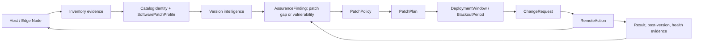

# Estate Patch Management - inventory, intelligence, governed change, verified apply

- **Date:** 2026-06-24
- **Reviewed:** 2026-06-25 by Codex, as enterprise architect and business-development reviewer.
- **Status:** Design, research-first. No code in this pass.
- **Author:** Claude (initial draft), revised by Codex.
- **Epic:** `EP-PATCH-MANAGEMENT` (new; composes `EP-EDGE-NODE`, `EP-EDGE-TOPOLOGY`, `EP-ASSURANCE-LEDGER`, `EP-UPGRADE-LIFECYCLE`, `EP-SCHEDULING-SURFACE`, `EP-MSP-FEDERATION`, `EP-ESTATE-SOVEREIGNTY`, `EP-ATTENTION-SURFACE`).

---

## 1. Executive Decision

DPF should build **estate patch management as a governed control loop**, not as a new RMM clone:

1. **Inventory:** reuse the existing discovery substrate and deepen it with evaluated host tooling.
2. **Version intelligence:** compose public standards and feeds such as OSV, CISA KEV, CPE/PURL coordinates, native package-manager metadata, and DPF's Assurance Ledger.
3. **Scheduling and authority:** reuse `DeploymentWindow`, `BlackoutPeriod`, quiescence, recovery, rollback, `ChangeRequest`, and DPF's kernel/authority model.
4. **Apply:** extend the Edge Node with a tightly scoped, disabled-by-default execution primitive only after machine-bound trust lands.
5. **MSP federation:** never let an MSP-owned DPF execute inside a sovereign customer DPF. MSPs may send proposals; the customer authority core approves and executes.

The first shippable wedge is **read-only patch posture**: "what is installed, what is behind, what is actively exploited, what needs attention, and what is accepted until a date." That gives immediate MSP and compliance value without remote execution risk.

---

## 2. Problem And Business Goal

Patch management is the repeatable loop: **identify installed software -> prioritize risk -> acquire or identify the safer version -> schedule the change -> apply it -> verify the outcome**. NIST SP 800-40 Rev. 4 uses the same shape: enterprise patch management identifies, prioritizes, acquires, installs, and verifies patches, updates, and upgrades across an organization.

DPF must support three host populations:

| Population | Why it matters | First capability |
| --- | --- | --- |
| DPF's own install | Keeps the platform healthy and provides a reference implementation. | DPF self-upgrade is partly built, but it covers DPF image/version updates more than OS and third-party software around the install. |
| The discovered estate | Converts discovery into risk posture and compliance evidence. | Read-only patch posture from `DiscoveredSoftwareEvidence`, `InventoryEntity`, and `AssuranceFinding`. |
| Remote customer networks | Makes the MSP archetype operationally valuable. | Edge Node collection first; governed execution later. |

### 2.1 MSP Business Thesis

For the MSP archetype, patch management is not a side feature. It is a core paid outcome: "keep my machines current, prove it, and do not break my business." DPF's differentiation is not having another patch button; it is **governed patch operations across many customers with sovereignty, evidence, and proposal boundaries**.

Sellable offers:

| Offer | Buyer promise | DPF capability required |
| --- | --- | --- |
| Patch Posture Assessment | "We can show what is exposed before touching anything." | P0 read-only inventory, version intelligence, risk-ranked `AssuranceFinding` rows, exportable report. |
| Governed Patch Operations | "We apply approved patches inside your windows and prove the result." | `PatchPolicy`, `PatchPlan`, `RemoteAction`, change mirror, execution evidence, rollback/health checks. |
| Sovereign MSP Federation | "Your MSP proposes work, but your DPF approves and executes it." | `FederationLink`, proposal-only remote actions, customer-side approval, scoped result projection. |

Commercial metrics should be bottom-up, not guessed from vendor price pages:

- **Coverage:** percentage of endpoints reporting software inventory; percentage with normalized catalog identity; percentage with patch posture computed.
- **Risk reduction:** open critical/high patch gaps, CISA KEV overlaps, accepted-risk expirations, mean age of unpatched critical findings.
- **Operational efficiency:** patches per maintenance window, failed-action rate, rollback rate, manual approvals avoided, customer-visible report generation time.
- **MSP economics:** endpoints per technician, assessments converted to managed-service contracts, per-customer gross margin after tooling and labor.

Public vendor claims and pricing pages are useful benchmark signals only. They must not become DPF sales claims without separate validation.

---

## 3. Standards And Market Research

Research last checked: 2026-06-25.

### 3.1 Standards And Public Feeds

| Source | What it contributes | DPF adoption |
| --- | --- | --- |
| [NIST SP 800-40 Rev. 4](https://csrc.nist.gov/pubs/sp/800/40/r4/final) | Enterprise patching lifecycle and risk-management framing. | Use as the canonical lifecycle vocabulary: identify, prioritize, acquire, install, verify. |
| [CISA Known Exploited Vulnerabilities Catalog](https://www.cisa.gov/known-exploited-vulnerabilities-catalog) | Prioritization signal for vulnerabilities known to be exploited. | Treat KEV overlap as a first-class severity/routing multiplier in patch posture. |
| [OSV-Scanner / OSV.dev](https://google.github.io/osv-scanner/) | Machine-readable affected-version and fixed-version intelligence for open-source ecosystems, lockfiles, SBOMs, containers, and some distro packages. | Generalize the existing DPF npm OSV scan into a reusable `patch-intel` adapter. |
| [Microsoft WinGet](https://learn.microsoft.com/en-us/windows/package-manager/winget/) | Windows package discovery/install/upgrade commands, including `list`, `upgrade`, and `install`. | Use as one Windows application backend after Tool Evaluation approval. |
| [osquery](https://github.com/osquery/osquery) | SQL-backed cross-platform host instrumentation for Linux, macOS, and Windows. | Evaluate as a supervised inventory helper under Edge Node, not as an independent control plane. |

### 3.2 Commercial Benchmarks

| Product family | Public pattern observed | DPF lesson |
| --- | --- | --- |
| [Action1](https://www.action1.com/) | Cloud patch/vulnerability remediation with OS and third-party patching, endpoint scale, and compliance reporting. | Patch posture and compliance reporting are buyer-facing outcomes, not admin afterthoughts. |
| [NinjaOne Patch Management](https://www.ninjaone.com/patch-management/) | RMM-style patching across Windows, macOS, Linux, OS and third-party apps, with policy, scheduling, reboot, and reporting surfaces. | MSP buyers expect patching to sit with endpoint/RMM workflows and not require VPN-only operations. |
| [PDQ](https://www.pdq.com/solutions/patch-management-software/) | Emphasizes centralized policy, inventory, testing, schedules, remote/hybrid reach, and reporting. | The operator mental model is "scan, approve, deploy, verify, report." DPF should mirror this, but use its own authority spine. |
| [Fleet software management](https://fleetdm.com/software-management) | Device-management platform with software inventory, policies, deployment rings, diagnostics, and automated updates. | Deployment rings and clear failure diagnostics are table stakes. Avoid adopting a second Fleet server/control plane unless Tool Evaluation proves it is worth the identity/scheduling duplication. |

Patterns adopted:

- Agent-on-host or supervised host collector.
- Maintenance windows, blackout periods, canary/rolling rings, and reboot policies.
- Compliance/reporting as the primary user-facing surface.
- Security patches eligible for auto-in-window policy; major/feature updates require explicit approval.

Patterns rejected:

- Hand-curating a broad third-party installer repository in P0-P3. That is a staffed supply-chain operation with malware scanning, signing, vendor drift, and support obligations.
- Embedding a full RMM server as DPF's patch-control plane. That duplicates identity, scheduling, audit, policy, and customer-boundary models.
- Treating patch execution as "remote script run with a label." Mutating actions require authority, scheduling, health evidence, and rollback semantics.

### 3.3 Open-Source And Native Backend Position

DPF should **compose standards and native package managers**:

- Windows applications: WinGet first, with Windows Update Agent considered separately for OS/Microsoft updates.
- Linux: `apt`, `dnf`/`yum`, and distribution security metadata.
- macOS: `softwareupdate` for OS updates, Homebrew where present for developer/workstation packages.
- Vulnerability intelligence: OSV where ecosystem coverage exists; CISA KEV and NVD/CPE-style coordinates as prioritization and matching inputs.
- Inventory: existing host collectors first; osquery only after the Tool Evaluation Pipeline approves it.

Every external tool or service named here is a candidate, not an approved dependency. AGENTS.md section 9 still applies: external tools must pass the Tool Evaluation Pipeline and be version-pinned in the approved tools registry before adoption.

---

## 4. DPF Substrate Audit

### 4.1 Inventory - mostly built

| Capability | Where verified | Status |
| --- | --- | --- |
| Host/asset model with versions and customer/site scope | `InventoryEntity` in `packages/db/prisma/schema.prisma` (`observedVersion`, `normalizedVersion`, `supportStatus`, `customerAccountId`, `customerSiteId`) | Built |
| Per-host installed-software evidence | `DiscoveredSoftwareEvidence` (`packageManager`, `rawVendor`, `rawProductName`, `rawVersion`, `installLocation`, `normalizationStatus`, `softwareIdentityId`) | Built, but identity link is dangling |
| Cross-platform software collection | `packages/db/src/discovery-collectors/host.ts` for Windows, macOS, and Linux collectors | Built |
| Software normalization helpers | `packages/db/src/software-normalization.ts` and tests | Built, still using legacy `SoftwareIdentityCandidate` types |
| Multi-tenant/MSP scoping | `CustomerAccount`, `CustomerSite`, and discovery/inventory FKs | Built |
| Edge-node discovery ingestion | `POST /api/v1/edge/discovery-runs` and `DiscoveryRun` | Built |
| SBOM for DPF's own dependencies | `scripts/sbom/generate-platform-sbom.mjs`, `BomDocument`, `BomComponent` | Built for platform dependencies |

### 4.2 Identity Correction - do not create `SoftwareProduct`

The original draft proposed a new `SoftwareProduct` model to resolve `DiscoveredSoftwareEvidence.softwareIdentityId`. That would create a second canonical identity direction.

Prior durable architecture already names the better path: `docs/superpowers/specs/2026-04-18-lifecycle-evidence-specialist-design.md` specifies `CatalogIdentity` + `FingerprintRule` and explicitly calls out the dangling `softwareIdentityId` cleanup. Current schema still has only the loose `softwareIdentityId` string; no `CatalogIdentity` model has landed yet.

Required correction:

1. **Do not add `SoftwareProduct` as a standalone catalog.**
2. Land or compose the lifecycle-evidence identity migration first.
3. Rename `DiscoveredSoftwareEvidence.softwareIdentityId` to `legacySoftwareIdentityId` or drop it with evidence.
4. Add `catalogIdentityId` as the canonical FK once `CatalogIdentity` exists.
5. Add patch-specific metadata beside the canonical identity as `SoftwarePatchProfile`, not as a second identity table.

Post-state invariant:

> No discovery, inventory, or patch-management field points at a nonexistent identity table, and host-facing software, SBOM components, and lifecycle evidence converge through one catalog identity spine.

### 4.3 Scheduling And Governance - built and reusable

| Capability | Existing substrate | Patch-management reuse |
| --- | --- | --- |
| Maintenance windows and blackout periods | `DeploymentWindow`, `BlackoutPeriod`, `windows-eval.ts` | Gate every mutating patch action. |
| Auto-selected low-impact windows | `auto-window.ts`, `maintenance-calendar.ts` | Suggest default patch windows per site/store. |
| Window-gate tool | `check_deployment_windows` | Reuse for patch plans and remote actions. |
| Quiescence/graceful drain | `self-upgrade/quiescence.ts` | Reuse for DPF-managed services and local install patching. |
| Recovery and rollback | `recovery-point.ts`, `rollback.ts` | Reuse where DPF can create a recovery point; otherwise require explicit "no rollback available" evidence. |
| Change governance | `SelfUpgradeRun` mirrors to `ChangeRequest` | `PatchPlan`/`RemoteAction` must mirror to `ChangeRequest` for audit continuity. |
| Scheduling registry/deconfliction | `SCHEDULED_JOB_CATALOG`, scheduling allocator | Add version-intelligence and patch-plan jobs here. |

This is DPF's moat. Commodity RMM tools can push patches; DPF can make patching part of governed business operations with authority, evidence, quiescence, and rollback.

### 4.4 Edge Node - enrolled and trusted, but not an executor

The Edge Node already has enrollment, principal identity, heartbeat/rotation, scoped tokens, discovery submission, and per-capability modes. It does **not** have:

- `action:dispatch` or `action:report` token scopes.
- `patch.apply`, `script.run`, `service.restart`, or `reboot` execution capabilities.
- A dispatch/result/evidence model.
- Machine-bound trust sufficient for mutation.

The Edge Node is the right agent. It needs a governed execution capability after hardening; DPF does not need a second agent identity.

### 4.5 Findings And Remediation - reuse, do not duplicate

`AssuranceFinding` already models affected asset, severity, adapter/source, external identifier, remediation hint, accepted-risk expiry, and linkage to evidence. A patch gap is an assurance finding.

`CorrectiveAction` already models human remediation workflows. It should not be overloaded as a machine execution job.

---

## 5. Architecture Overview



The control loop is deliberately split:

- **Assessment loop:** inventory -> identity -> intelligence -> findings. Read-only.
- **Decision loop:** findings -> policy -> plan -> approval/window. Governed.
- **Execution loop:** approved plan -> remote actions -> result evidence -> verification/rollback. Mutating and gated.

This lets DPF ship useful assessment early while keeping the dangerous part behind explicit prerequisites.

---

## 6. Build Vs Embed Decision

DPF kernel consultation (`principle_decide`, population `external_coding_agent`, ring scope `external-coordination` + `universal-ring`) compared three options:

| Option | Kernel result | Decision |
| --- | --- | --- |
| Compose standards, build governance | Composite 8.365, margin 3.690, high confidence, no commandment conflict | Chosen |
| Build bespoke catalog and agent | Composite 4.660 | Rejected |
| Embed an RMM/control-plane platform | Composite 4.674 | Rejected |

Decision:

> Embed or supervise proven standards for commodity collection/intelligence/apply mechanics, but build the governance, authority, evidence, scheduling, and federation layer natively in DPF.

Why:

- Aligns with "Research and use standards" and "Architecture over shortcuts."
- Avoids a permanent third-party installer-catalog burden.
- Preserves DPF's single source of truth for principals, authority, scheduling, change requests, and audit evidence.
- Keeps MSP federation proposal-only instead of outsourcing sovereignty to another control plane.
- Reduces execution blast radius by keeping P0/P1 read-only.

---

## 7. Target Substrate

### 7.1 `CatalogIdentity` And `SoftwarePatchProfile`

`CatalogIdentity` is the canonical identity from the lifecycle-evidence design. Patch management extends it rather than replacing it.

```prisma
// Conceptual shape. Exact fields belong with the CatalogIdentity migration.
model SoftwarePatchProfile {
  id                String   @id @default(cuid())
  catalogIdentityId String   @unique
  catalogIdentity   CatalogIdentity @relation(fields: [catalogIdentityId], references: [id])

  ecosystem         String   // windows-app | windows-update | deb | rpm | brew | npm | pypi | container | firmware | unknown
  managerCoordinates Json    @default("{}") // winget id, apt package, rpm name, brew formula, purl, cpe23 URIs
  defaultApplyVia    String? // winget | wua | apt | dnf | brew | manual | vendor-adapter
  latestStableVersion String?
  latestSafeVersion   String?
  eolDate            DateTime?
  supportStatus      String   @default("unknown")
  confidence         String   @default("unverified") // unverified | inferred | verified | vendor-confirmed
  lastRefreshedAt    DateTime?
}
```

Stewardship rules:

- `CatalogIdentity` is the identity; `SoftwarePatchProfile` is patch metadata.
- `BomComponent` remains build-time dependency evidence. It should link through PURL/CPE/catalog identity where possible, not be folded into host-installed software.
- Raw vendor/product strings stay raw on evidence. Normalization rules decide canonical identity.
- If statuses become closed sets, define constants and tool schemas together per AGENTS.md enum doctrine.

### 7.2 Version Intelligence Projector

Add a scheduled projector in `SCHEDULED_JOB_CATALOG`:

Inputs:

- `DiscoveredSoftwareEvidence` and `InventoryEntity` rows with customer/site scope.
- `SoftwarePatchProfile` coordinates.
- OSV advisory/version-range results.
- CISA KEV membership for CVE prioritization.
- Native "available update" metadata from WinGet, Windows Update Agent, apt/dnf/yum, Homebrew, or other approved backends.
- Optional EOL feed after Tool Evaluation.

Outputs:

- Update `SoftwarePatchProfile.latestStableVersion`, `latestSafeVersion`, `supportStatus`, `eolDate`, and `lastRefreshedAt` where confidence is sufficient.
- Write or update `AssuranceFinding` rows:

```text
findingKind:      patch-gap | vulnerability | end-of-life
affectedType:     InventoryEntity | DiscoveredSoftwareEvidence | BomComponent
affectedId:       existing row id
adapterKey:       patch-intel | osv | cisa-kev | native-manager
vendorIdentifier: CVE/GHSA/manager advisory id where present
policySeverity:   critical | high | medium | low | info
remediationHint:  { targetVersion, applyVia, rebootLikely, cisaKev, confidence }
acceptedUntil:    existing risk-acceptance expiry
```

The assessment surface is a query over `AssuranceFinding`, not a new findings table.

### 7.3 `RemoteAction` - Governed Execution Primitive

`RemoteAction` is generic on purpose. Patching is the first consumer; future inventory-on-demand, service restart, or controlled script execution can reuse it.

```prisma
model RemoteAction {
  id                   String   @id @default(cuid())
  actionKey            String   @unique
  edgeNodeId           String
  inventoryEntityId    String?
  customerAccountId    String?
  customerSiteId       String?
  actionType           String   // inventory.collect | patch.apply | service.restart | reboot | script.run
  parameters           Json     @default("{}")

  requestedByPrincipalId String
  approvalState          String @default("proposed") // proposed | approved | rejected | cancelled
  approvedByPrincipalId  String?
  changeRequestId        String?
  deploymentWindowId     String?
  patchPlanId            String?

  status               String   @default("queued") // queued | dispatched | running | succeeded | failed | rolled-back | timed-out
  result               Json     @default("{}")
  evidence             Json     @default("{}")
  rollbackOf           String?
  createdAt            DateTime @default(now())
  startedAt            DateTime?
  completedAt          DateTime?
}
```

Guardrails:

- Mutating actions require a `ChangeRequest`.
- `patch.apply`, `service.restart`, `reboot`, and `script.run` require deployment-window approval.
- `script.run` is out of scope until a separate threat model approves it.
- Remote actions are scoped by `customerAccountId`/`customerSiteId` whenever the target belongs to a customer estate.
- Result evidence must include before version, intended target version, post version, backend used, exit status, stderr/stdout summary, and health-check outcome.

### 7.4 `PatchPolicy` And `PatchPlan`

```prisma
model PatchPolicy {
  id                String @id @default(cuid())
  policyKey         String @unique
  customerAccountId String?
  customerSiteId    String?
  scope             Json   @default("{}") // host group, site, role, tag, archetype
  autoApprove       Json   @default("{}") // e.g. critical security in-window; major manual
  rebootPolicy      String @default("in-window") // never | in-window | prompt | manual
  blackoutRefs      Json   @default("[]")
  windowRefs        Json   @default("[]")
  status            String @default("active") // draft | active | disabled | archived
}

model PatchPlan {
  id                String @id @default(cuid())
  planKey           String @unique
  customerAccountId String?
  customerSiteId    String?
  scope             Json   @default("{}")
  target            Json   @default("{}") // catalogIdentityId/profileId, target version, backend
  strategy          String @default("rolling") // canary | rolling | all-at-once | manual
  approvalState     String @default("proposed") // proposed | approved | rejected | cancelled
  status            String @default("draft") // draft | scheduled | running | succeeded | failed | cancelled
  changeRequestId   String?
  deploymentWindowId String?
}
```

Default policy:

- Critical security updates with high confidence and no major-version jump: eligible for auto-approve in window.
- CISA KEV overlap: route to urgent attention and shorter SLA; still respect blackout/window unless an explicit emergency override exists.
- Major versions, driver/firmware, database/runtime upgrades, and reboot-required server patches: manual approval.
- Unknown identity or low-confidence version match: assessment only, no auto-plan.

### 7.5 API And Tool Surface

Candidate internal APIs/MCP tools, subject to normal tool-result budget and permission grants:

- `list_patch_posture`: paginated posture by customer/site/host/product/severity.
- `propose_patch_plan`: creates `PatchPlan` from findings and policy.
- `approve_patch_plan`: authority-gated; writes `ChangeRequest`.
- `dispatch_remote_action`: internal-only dispatcher after approval/window checks.
- `record_remote_action_result`: Edge Node result/evidence ingestion.

Tool outputs must be capped, paginated, and provenance-free in their descriptions per AGENTS.md context-engineering standards.

---

## 8. Edge Node Execution Posture

The brief asks whether DPF needs an agent installed. It already has one: the Edge Node.

Plan:

- Edge Node supervises approved inventory helpers such as osquery.
- Edge Node invokes native package managers only through `RemoteAction`.
- Edge Node reports result evidence back to DPF.
- Edge Node never becomes an independent authority.

Non-negotiable execution prerequisites:

1. `capability.action.execute` is disabled by default.
2. Capabilities are action-type allowlisted per node: for example `inventory.collect` may be enabled while `patch.apply` remains disabled.
3. Token scopes are split: `action:dispatch` for delivery and `action:report` for result reporting.
4. Mutating actions require capability enabled, token scope present, policy approval, `ChangeRequest`, and a valid maintenance window with no blackout conflict.
5. Execution must wait for hardened machine-bound Edge Node trust (mTLS, DPoP, platform-attested key, or equivalent). Bearer-token-only Edge Nodes may collect posture but may not apply patches.
6. Where rollback is impossible, the action must say so before approval and store compensating evidence.
7. Reboot is a first-class action, not a hidden side effect.

Threat-model requirement:

- Before P2 execution work starts, run a focused threat model covering command injection, package-manager abuse, token theft, replay, confused deputy across customer scope, downgrade attacks, rollback failure, and malicious/compromised Edge Node reporting.

---

## 9. MSP Cross-Org Pattern

### 9.1 Topology A - MSP Runs DPF, Customer Is A Scoped Estate

Near-term path. Customer hosts enroll into the MSP's DPF via Edge Nodes and are scoped by `customerAccountId` and `customerSiteId`.

Allowed:

- MSP views posture.
- MSP proposes and approves patch plans within its own DPF if contractually authorized.
- MSP-owned Edge Nodes execute approved actions.

Required:

- Per-customer reporting and audit separation.
- No cross-customer query leaks.
- Customer/site filters in every posture, plan, action, and evidence query.

### 9.2 Topology B - MSP And Customer Both Run DPF

Sovereign path. The MSP does not execute inside the customer boundary.

Allowed:

- MSP DPF sends a patch assessment or plan proposal over the federation link.
- Customer DPF receives it as an attention item.
- Customer authority approves, schedules, and executes through the customer's own Edge Node.
- Customer DPF sends back a scoped result projection.

Not allowed:

- MSP-originated `RemoteAction` moving beyond `proposed` in a customer-owned DPF.
- MSP direct execution using customer Edge Node credentials.
- MSP visibility into raw host evidence beyond the consented projection.

This proposal-not-action rule is the architectural boundary that makes patch management compatible with `EP-MSP-FEDERATION` and `EP-ESTATE-SOVEREIGNTY`.

---

## 10. UX And Information Architecture

Patch management is an operations and compliance surface. It should feel dense, calm, scan-friendly, and evidence-backed.

### 10.1 Placement

Primary route candidate:

- `/ops/patches` for operator workflow, because existing ops routes already cover self-upgrade, health, changes, promotions, and improvements.

Secondary projections:

- Customer detail pages: scoped patch posture for that customer estate.
- `/compliance/posture`: aggregate evidence and audit posture, if the compliance module is active.
- Attention/work surfaces: approvals, expired risk acceptances, failed actions, and urgent KEV overlaps.

Do not add a new global navigation family for patching until the workflow earns it. Start in existing ops/compliance/customer surfaces.

### 10.2 First Screen

The first screen answers four operator questions:

1. **Are we exposed?** Critical/high patch gaps, KEV overlaps, unsupported software.
2. **Where is the exposure?** Customer/site/host/product grouping.
3. **What needs me?** Approval queue, failed actions, expired acceptances, reboot decisions.
4. **What happened?** Recent plans/actions with before/after version and evidence.

Use report-kit primitives:

- `StatCard` for counts and risk posture.
- `StatusBadge` through `statusColors.ts`, not page-local maps.
- `FilterBar` for customer, site, severity, status, ecosystem, reboot required, KEV overlap.
- `DataTable` for patch gaps and plan/action history.
- `ExportButton` for customer-facing CSV/report export.
- `Chart` only for trends that help decisions, such as critical gaps over time or compliance by site.

### 10.3 Interaction Model

Primary actions:

- **Assess only:** default, no mutation.
- **Propose plan:** groups selected findings into a `PatchPlan`.
- **Approve schedule:** authority-gated, writes `ChangeRequest`.
- **Pause/deny:** records rationale.
- **Accept risk until date:** uses existing `acceptedUntil` semantics.
- **View evidence:** shows source, confidence, before/after versions, and action result.

Controls:

- Use segmented controls for posture views: `Gaps`, `Plans`, `History`, `Policies`.
- Use toggles for policy booleans such as "auto-approve critical security patches in window."
- Use date/time controls for maintenance windows and risk-acceptance expiry.
- Use confirmation modals for mutating dispatch, with explicit target count, reboot risk, rollback availability, and customer/site scope.

Empty/failure states:

- Empty posture: "No patch gaps found from the latest assessment" with last assessment time and coverage percentage.
- Low coverage: prioritize the collection gap over a false green posture.
- Unknown identity: show as "Needs identity mapping" and route to catalog/fingerprint contribution, not patch execution.
- Failed action: show likely cause, captured output summary, retry eligibility, rollback status, and evidence link.

Accessibility and design:

- WCAG 2.2 AA.
- Theme tokens only; no raw hex or local Tailwind status palettes.
- Table text must wrap and remain legible on mobile.
- No in-app explanatory copy that documents implementation mechanics; keep operator language outcome-oriented.

### 10.4 UX Fit Decision

This surface passes UX fit only if:

- Patch posture can be scanned by non-technical operators in under one minute.
- The first mutating action is impossible without seeing target scope, window, reboot risk, rollback availability, and approval state.
- The customer/MSP boundary is visible in the UI wherever actions or exports cross accounts.
- Unknown/low-confidence matches cannot be approved for automatic patching.
- Tests verify report-kit usage and status-intent mapping for new domains.

---

## 11. Phasing

| Phase | Deliverable | Risk | Dependencies |
| --- | --- | --- | --- |
| P0 - Read-only posture | Patch intelligence projector writes `AssuranceFinding` rows from existing discovery/SBOM data. Operator can view/export estate patch posture. No execution. | Low | Assurance Ledger, discovery substrate |
| P0.5 - Identity convergence | Land `CatalogIdentity` path or compose the lifecycle-evidence migration; remove/rename dangling `softwareIdentityId`; add `catalogIdentityId`; add `SoftwarePatchProfile`. | Medium schema risk | Lifecycle evidence specialist design |
| P1 - Deep inventory | Tool Evaluation for osquery or equivalent; Edge Node supervises approved collector; improve `DiscoveredSoftwareEvidence` coverage/confidence. | Low/medium | EP-GOVERN-002, Edge Node discovery capability |
| P2 - Governed execution primitive | `RemoteAction`, scopes, capability allowlist, result evidence, change mirror. Start with non-mutating `inventory.collect`. | Medium | Hardened Edge Node trust, threat model |
| P3 - Patch apply backends | WinGet/WUA/apt/dnf/brew adapters, health checks, reboot action, rollback/compensating evidence. | High | P2 plus backend Tool Evaluation |
| P4 - Plans and policy automation | `PatchPlan`, `PatchPolicy`, canary/rolling strategies, auto-approve critical security patches in window. | Medium/high | P3, scheduling surface |
| P5 - MSP federation | Proposal-not-action over federation link; customer-side approve/execute; scoped result projection. | High sovereignty risk | MSP federation, estate sovereignty, attention surface |

Engineering allocation:

- Reserve the first **20% of implementation effort** for refactoring and data-model convergence: identity cleanup, status constants, test fixtures, and migration invariants.
- Do not start execution work while `softwareIdentityId` remains a dangling identity pointer.
- Do not start P3 apply backends before P2 execution evidence is verified with a harmless action.

---

## 12. Acceptance Criteria And Verification

### P0 Acceptance

- Patch posture uses existing `AssuranceFinding`; no duplicate findings table.
- Findings include affected host/evidence, severity, source adapter, target version when known, confidence, and remediation hint.
- CISA KEV overlap changes routing/priority and is visible in UX.
- Coverage percentage is visible so operators do not mistake missing inventory for clean posture.
- Export/report is scoped by customer/site.

### P0.5 Acceptance

- `DiscoveredSoftwareEvidence.softwareIdentityId` is no longer a live pointer to a nonexistent table.
- `CatalogIdentity` is the canonical identity for host software and related lifecycle evidence.
- `SoftwarePatchProfile` hangs from `CatalogIdentity`.
- Migration includes backfill or explicit evidence for safe drop/rename.
- Tests cover legacy identity handling and no dangling FK/string pointer remains.

### P2/P3 Acceptance

- `RemoteAction` cannot dispatch unless capability, token scope, approval, change request, and window gates pass.
- A bearer-token-only Edge Node cannot run mutating actions.
- Action result evidence captures before/after versions and health outcome.
- Reboot is explicit and policy-gated.
- Failed action has retry/rollback/compensating evidence state.
- Cross-customer dispatch attempts are rejected.

### Required Verification Gates

- Targeted unit tests for intelligence projection, identity migration helpers, policy derivation, and remote-action gate checks.
- Production build for affected app/package before PR.
- UX verification for `/ops/patches` or whichever route lands.
- Migration apply/rollback evidence for schema phases.
- Tool Evaluation records before osquery, OSV generalization beyond existing use, WinGet automation, WUA automation, or any new external backend is embedded.
- Threat model before mutating Edge Node execution.

---

## 13. Risks And Open Questions

| Risk | Impact | Mitigation |
| --- | --- | --- |
| Catalog identity drift | False positives or unsafe auto-patching. | P0.5 identity convergence, confidence scoring, no auto-apply for unknown/low-confidence identities. |
| Third-party catalog coverage gaps | Niche apps remain manual. | Native-manager first, vendor adapters later, clear "manual remediation" finding state. |
| Package-manager inconsistency | Different hosts report/apply differently. | Store backend and confidence per finding/action; verify post-version. |
| Reboot disruption | Server/business downtime. | Reboot as explicit action, windows/blackouts, customer/site policy, quiescence where possible. |
| Edge Node token theft | Remote code execution risk. | No mutation until machine-bound trust; least privilege scopes; action allowlists; replay protection in threat model. |
| MSP sovereignty breach | Customer trust and compliance failure. | Proposal-not-action in federated topology; customer-side approval/execution only. |
| Over-automation | Bad patch broadly deployed. | Canary/rolling strategy, health checks, pause/rollback, major versions manual. |
| External tool licensing | Commercial/MSP conflict. | Tool Evaluation Pipeline and approved registry before adoption. |
| False green posture | Missing inventory interpreted as secure. | Coverage metrics beside every posture score. |

Open questions:

1. Which identity migration owner lands `CatalogIdentity`: lifecycle-evidence epic or patch-management epic?
2. Does `AssuranceFinding.findingKind` already have a governed constant registry, or does P0 create one?
3. Which Windows OS update backend is acceptable after Tool Evaluation: WUA COM API, PowerShell module, or another supported mechanism?
4. What is the minimum machine-bound Edge Node trust posture accepted for P2?
5. Should firmware/driver patching be explicitly out of P0-P4 and handled as a later high-risk category?

---

## 14. Backlog Mapping

Create `EP-PATCH-MANAGEMENT` with these initial backlog items:

| BI | Work type | Outcome |
| --- | --- | --- |
| BI-PATCH-001 | doc | Ratify this design and link it to lifecycle-evidence, Edge Node, scheduling, assurance, and MSP federation specs. |
| BI-PATCH-002 | refactor | Converge software identity on `CatalogIdentity`; remove or rename dangling `softwareIdentityId`; add `SoftwarePatchProfile`. |
| BI-PATCH-003 | feature | Build read-only patch-intelligence projector into `AssuranceFinding`. |
| BI-PATCH-004 | feature | Add patch posture UX under ops/compliance/customer projections using report-kit. |
| BI-PATCH-005 | tool | Run Tool Evaluation for osquery/deep inventory. |
| BI-PATCH-006 | security | Threat-model Edge Node remote execution. |
| BI-PATCH-007 | feature | Add `RemoteAction` for non-mutating action dispatch and evidence reporting. |
| BI-PATCH-008 | feature | Add approved native apply backends and reboot policy after P2 evidence. |
| BI-PATCH-009 | feature | Add `PatchPlan`/`PatchPolicy` automation. |
| BI-PATCH-010 | feature | Add MSP federation proposal-not-action flow. |

Backlog creation must use live MCP/backlog state first. If MCP is unavailable, use explicit DB fallback per AGENTS.md.

---

## 15. References

- NIST, [SP 800-40 Rev. 4: Guide to Enterprise Patch Management Planning](https://csrc.nist.gov/pubs/sp/800/40/r4/final).
- CISA, [Known Exploited Vulnerabilities Catalog](https://www.cisa.gov/known-exploited-vulnerabilities-catalog).
- Google/OpenSSF, [OSV-Scanner](https://google.github.io/osv-scanner/).
- Microsoft Learn, [Use WinGet to install and manage applications](https://learn.microsoft.com/en-us/windows/package-manager/winget/).
- osquery, [GitHub repository](https://github.com/osquery/osquery).
- Fleet, [Software management](https://fleetdm.com/software-management).
- Action1, [Unified Cross-Platform Patch Management](https://www.action1.com/).
- NinjaOne, [Patch Management](https://www.ninjaone.com/patch-management/).
- PDQ, [Patch Management Software](https://www.pdq.com/solutions/patch-management-software/).
- DPF, `docs/superpowers/specs/2026-04-18-lifecycle-evidence-specialist-design.md`.
- DPF, `docs/platform-usability-standards.md`.
- DPF, `apps/web/components/ui/report-kit/README.md`.
