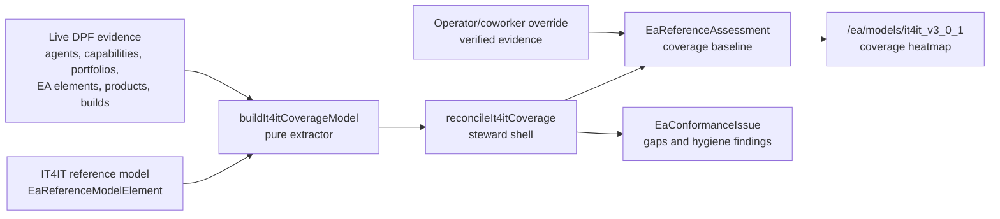

# IT4IT Conformance Coverage Heatmap Design

- **Status:** In progress — Phase 0+1 (projection) shipped in PR #2354 (merged); Phase 2 (heatmap) landing now
- **Date:** 2026-06-24
- **Reviewed:** 2026-06-25
- **Epic:** EP-IT4IT-CONFORMANCE
- **Primary audience:** Founder/operator, enterprise architecture reviewers, business-development partners, and implementation agents
- **Authoring goal:** Measure DPF's current platform against the IT4IT functional criteria, establish a maintainable baseline, keep it current as functionality lands, and present the result as an elegant coverage heatmap using DPF's existing EA and report-kit primitives.
- **Composes:** EP-PARITY-ENGINE, EP-ARCH-GRAPH-LIVE, EP-BOM-WIRING, the EA Reference-Model Assessment Foundation, and `2026-03-26-build-studio-it4it-value-stream-alignment-design.md`.

## Executive Decision

DPF already has the yardstick, the scoring table, the steward cadence, and the UI primitives. The design should therefore activate the existing architecture instead of creating an IT4IT-specific sidecar.

**Decision:** Implement IT4IT coverage as a derived projection over live platform evidence, refreshed by the architecture parity steward, persisted into the existing `EaReferenceAssessment` table, and refined through an operator/coworker verified override layer.

This is the right enterprise architecture shape because it keeps the baseline current without a manual scorecard, preserves human judgment where automated evidence is too coarse, and reuses DPF's existing EA substrate:

- `EaReferenceModelElement` already stores the IT4IT model `it4it_v3_0_1`.
- `EaReferenceAssessment` already stores coverage status, MVP inclusion, confidence, rationale, and evidence summary per assessment scope and model element.
- `reconcile-sysml-projections.ts` already orchestrates drift-proof EA projections.
- `/ea/models/[slug]` already owns reference-model detail, artifacts, element tree, value-stream projection action, and portfolio rollup.
- `CapabilityMapTiles`, `deriveCapabilityOverlayState`, and report-kit `statusColors`, `StatCard`, `DataTable`, and `ExportButton` already provide the theme-aware UI building blocks.

**Kernel decision:** `principle_decide` on 2026-06-25 recommended `derived-projection-with-verified-overrides` with composite `9.709`, margin `2.769`, high confidence, and no commandment conflict. Manual-only scoring failed maintainability and live-state requirements; derived-only scoring failed the honesty and human-verification requirements; a new IT4IT-specific model failed single-source-of-truth and schema-grounding requirements.

## Business Value

This feature is more than an internal architecture dashboard. It gives DPF a boardroom-safe answer to three buyer questions:

- **Enterprise architecture credibility:** "Can you show how the platform maps to an industry operating-model standard?"
- **Delivery assurance:** "Which areas are built, partial, planned, or intentionally out of scope, and what evidence supports that?"
- **Partner and MSP enablement:** "Can a reseller or managed-services partner explain the platform's IT operating-model coverage without reading the whole codebase?"

The output is a **coverage baseline**, not a certification claim. It should be usable in sales engineering, architecture review, implementation planning, and partner enablement, while staying honest enough that it never implies Open Group certification or formal conformance unless that process has actually happened.

## Standards And Licensing Boundary

The Open Group is the authority for IT4IT. Public Open Group pages describe IT4IT as a value-stream-based standard for digital business improvement and publish IT4IT certification paths and licensed downloads, including Version 3.0 and Version 3.0.1 license surfaces. DPF's implementation must treat the local workbook as a licensed/internal reference artifact, not as public marketing copy.

Implementation rules:

- The UI says **"IT4IT coverage baseline"** or **"IT4IT functional-criteria coverage"**, not "certified", "Open Group conformant", or "passed IT4IT".
- Do not expose large excerpts of IT4IT text in public/customer-facing surfaces. Display local element names, section references, short criteria labels where license permits, and internal evidence summaries.
- Before any external packaging, reseller material, public demo, or export that includes IT4IT criteria text, verify the applicable Open Group license and document the permission boundary.
- Store source references and local element identifiers in DPF. Do not create a second public taxonomy file derived from the workbook.
- If a formal conformance/certification claim is desired later, create a separate certification workstream with legal/licensing review and Open Group process evidence.

Sources checked on 2026-06-25:

- The Open Group IT4IT page: https://www.opengroup.org/it4it
- IT4IT certification: https://www.opengroup.org/certifications/it4it
- IT4IT Standard licensed downloads: https://www.opengroup.org/IT4IT/downloads
- IT4IT Reference Architecture Version 3.0.1 evaluation license: https://www.opengroup.org/it4it/ra/license_eval
- IT4IT Version 3.0 commercial license: https://www.opengroup.org/it4it/ra/license_comm

## Verified Current Substrate

Live substrate was checked on 2026-06-25 in the local DPF install and the target worktree.

| Concern | Verified state | Implication |
| --- | --- | --- |
| IT4IT model | `EaReferenceModel` slug `it4it_v3_0_1` exists. | Use this as the canonical yardstick. |
| Criteria tree | Live DB has 604 criteria, 35 components, 9 functions, 5 capability groups, 7 value streams, and 28 value-stream stages. | The standard structure is already queryable. |
| Normativity | Criteria classes: 390 `required`, 34 `recommended`, 94 `optional`, 86 unset. | Rollups can weight required criteria without inventing metadata. |
| Scoring table | `EaReferenceAssessment` has 0 rows live, including 0 IT4IT rows. | The baseline is unmeasured; an upsert/create path is required. |
| Assessment scopes | `EaAssessmentScope` has 4 live rows. | Existing portfolio scopes should be reused; add or seed platform scope only if missing. |
| Existing write path | `updateReferenceAssessment` uses `.update` by `assessmentId`. | Operators cannot initialize assessment rows today. Convert to upsert/create-capable flow. |
| Existing read path | `getReferenceModelPortfolioRollup` reads criterion assessments by portfolio scope. | It will render useful data once assessments exist. |
| EA element stream tags | `EaElement.itValueStream` is 0 of 2,579 populated. | Do not depend on this signal for v0 scoring; backfill as refactoring. |
| Business capabilities | 28 of 28 `BusinessCapability` rows have `it4itValueStreams`. | Strong v0 evidence signal. |
| Agent registry | Live `Agent.valueStream` values include the seven canonical streams, `governance`, `cross-cutting`, legacy labels `Strategy to Portfolio` and `Request to Deploy`, and one null. | Normalize explicitly; do not treat arbitrary strings as standards-aligned streams. |
| UI primitives | `CapabilityMapTiles`, `CapabilityDetailPanel`, report-kit `statusColors`, `StatCard`, `DataTable`, and `ExportButton` exist. | Build an EA-native heatmap without a charting dependency. |

The current baseline is therefore precise:

**Recorded coverage today is 0 of 604 IT4IT criteria and 0 of 35 IT4IT functional components assessed.** DPF has the standard loaded, but no recorded measurement exists yet.

## Gap

The gap is not "we need an IT4IT model." The gap is that DPF has the model but no durable, self-refreshing assessment of the model against platform reality.

Specific gaps:

- No assessment rows are created for the existing IT4IT criteria or components.
- The only assessment action is a manual `.update`, which assumes a row already exists.
- No steward-owned projection turns live evidence into coverage statuses.
- No no-clobber rule protects human-verified assessments from automated overwrites.
- No canonical crosswalk normalizes v3 stream evidence, legacy v2 labels, governance, and cross-cutting values.
- No UI distinguishes derived coverage from verified coverage.
- No license guard prevents a useful internal standard view from becoming an accidental external conformance claim.
- The richest EA signal, `EaElement.itValueStream`, is empty and needs refactoring/backfill before it can carry scoring weight.

## Architecture

### 1. Derived Projection Plus Verified Override



The projection owns derived rows. Operator and coworker reviews promote or correct rows to verified status. The projection must not overwrite verified rows.

Because `EaReferenceAssessment` currently has `assessedById` rather than a projection-source field, implementation should start with a zero-schema convention:

- `confidence = "derived"` for steward-owned rows.
- `rationale` begins with a stable prefix such as `it4it-coverage-projection:` for steward-owned rows.
- `evidenceSummary` stores compact JSON or structured prose listing evidence IDs and rollup method.
- `confidence = "verified"` or `"high"` identifies operator/coworker-confirmed rows.
- The projection updates only rows with the steward prefix or derived confidence.

If implementation proves this convention too brittle, add a tiny provenance field to `EaReferenceAssessment` in the same PR that proves the need. Do not start with a new table.

### 2. Unit Of Measure Honesty

Automated evidence is component-grained, not criterion-grained. The system must avoid pretending that a value-stream tag proves every normative "shall" criterion under a component.

Automated scoring rules:

- **Primary automated unit:** IT4IT functional component.
- **Inherited criterion status:** Criteria inherit the component status at `confidence = "derived"` until reviewed.
- **Verified criterion status:** An operator or coworker can set a specific criterion with higher confidence and evidence.
- **No data:** Render as `not_started` or neutral, never as a failing red or passing green.
- **No certification score:** Rollups are "evidence-derived coverage", not conformance certification.

Existing coverage statuses are:

- `implemented`
- `partial`
- `planned`
- `not_started`
- `out_of_mvp`

Those values already exist in `apps/web/lib/actions/ea.ts`, `apps/web/lib/explore/ea-data.ts`, and `apps/web/components/ea/ReferenceModelPortfolioTable.tsx`. The implementation should centralize them into one shared module if it touches more than one surface, but it should not rename stored values in this feature.

Suggested transparent rollup:

```text
status value:
implemented = 1.00
partial = 0.50
planned = 0.25
not_started = 0.00
out_of_mvp = excluded from denominator

normative weight:
required = 2.00
recommended = 1.00
optional = 0.50
unset = 0.50

score = sum(status_value * normative_weight) / sum(normative_weight)
```

The formula must be shown in the drill-down or export metadata so an enterprise architect can understand and challenge the number.

### 3. Crosswalk And Normalization

DPF has two alignment languages in use:

- IT4IT v3 stream language in UI and capability tags: `evaluate`, `explore`, `integrate`, `deploy`, `release`, `consume`, `operate`.
- Legacy or governance labels in agent registry: `Strategy to Portfolio`, `Request to Deploy`, `governance`, `cross-cutting`, and null.

Create one canonical module, for example `apps/web/lib/ea/it4it-crosswalk.ts`, that exports:

- `IT4IT_V3_STREAMS`
- `IT4IT_REFERENCE_COVERAGE_STATUSES`
- `IT4IT_AGENT_VALUE_STREAM_NORMALIZATION`
- `IT4IT_V3_TO_CAPABILITY_GROUP`
- `normalizeIt4itEvidenceStream(value)`

Initial crosswalk:

| Evidence value | Capability group mapping |
| --- | --- |
| `evaluate`, `explore`, `Strategy to Portfolio` | Strategy to Portfolio |
| `integrate`, `deploy`, `release`, `Request to Deploy` | Requirement to Deploy |
| `consume` | Request to Fulfill |
| `operate` | Detect to Correct |
| `governance`, `cross-cutting`, null | Supporting Functions or cross-cutting evidence only |

The crosswalk is a DPF modeling decision, not a substitute for the IT4IT standard. It must be unit-tested and named in the UI when the user switches from the functional-component view to the value-stream lens.

### 4. Extractor And Reconcile

Add a pure extractor and a thin reconcile shell in the existing EA projection pattern.

Proposed files:

- `apps/web/lib/ea/it4it-coverage-extract.ts`
- `apps/web/lib/ea/it4it-crosswalk.ts`
- `apps/web/lib/ea/reconcile-it4it-coverage.ts`
- Tests beside each file.

`buildIt4itCoverageModel(facts)` is pure and deterministic. It accepts:

- IT4IT model elements for `it4it_v3_0_1`.
- Current `EaAssessmentScope` rows.
- Agent value-stream and IT4IT section tags.
- Business capability IT4IT stream tags and trace links.
- Portfolio IT4IT references.
- Existing assessments, so verified rows are preserved.
- Optional `EaElement.itValueStream` evidence when populated.

It returns:

- Platform-wide component rollups.
- Portfolio-scoped component and criterion rollups.
- Criterion inherited statuses.
- Evidence lists.
- Gap and hygiene findings.
- A no-clobber write plan.

`reconcileIt4itCoverage({ db })` performs IO:

- Ensure a platform assessment scope exists, for example `scopeType = "platform"` and `scopeRef = "dpf"`.
- Read live facts.
- Call the pure builder.
- Upsert assessment rows by existing unique key `[scopeId, modelElementId]`.
- Preserve verified rows.
- File or update `EaConformanceIssue` rows for required coverage gaps and evidence hygiene.
- Return a `SysmlSeedResult`-shaped summary.

Register the reconcile in `apps/web/lib/ea/reconcile-sysml-projections.ts` so it runs with the existing architecture parity steward. Do not create a new scheduler.

### 5. Heatmap UX

Primary home: `/ea/models/it4it_v3_0_1`.

The first viewport should remain an EA reference-model page, not a dashboard or marketing landing page. Add a new section after the reference-model element tree and before the existing portfolio table:

**IT4IT Functional Coverage**

Controls:

- Segmented control: `By component` and `By value stream`.
- Scope selector: `Platform` and existing portfolio scopes.
- Toggle: `Derived` / `Verified` / `All`.
- Export CSV button.

Summary strip:

- `Components assessed`: `n/35`
- `Required criteria covered`: `n/390`
- `Verified assessments`: `n`
- `Open coverage gaps`: `n`

Heatmap:

- Reuse the nested capability-map visual language.
- Band = capability group.
- Tile = functional component.
- Fill/tone = `coverageStatus` mapped through report-kit status intent.
- Intensity = transparent rollup score.
- Badge = `derived` or `verified`.
- No-data tile = neutral with clear copy, not red.

Drill-down:

- Click a component to open a right rail.
- Show criteria with `normativeClass`, status, confidence, source reference, last updated, and evidence summary.
- Include "Promote to verified" / "Correct assessment" action for users with `manage_ea_model`.
- Use report-kit `DataTable` for criteria rows.

Secondary surfaces:

- Add only a compact card on the EA/platform overview after the heatmap exists.
- Do not add a new global nav item.
- Do not place raw IT4IT criteria in the workspace home.

Accessibility and visual design:

- Use `statusColors` only; no raw hex.
- Every tile has visible text and an accessible label.
- Color is never the only signal; status text and confidence badge are always present.
- Stable tile dimensions prevent layout shift.
- Empty state says: "No IT4IT assessments have been generated yet. Run architecture parity refresh to establish the baseline." Authorized users get the refresh action; others get read-only context.

### 6. Business-Development Output

The heatmap should support one export and one narrative view:

- **CSV export:** one row per component or criterion with scope, status, confidence, score, normative class, evidence count, and source references.
- **Architecture review brief:** generated copy block that says what is covered, what is partial, what is planned, and where evidence is missing.

The brief must include this disclaimer:

```text
This is a DPF evidence-derived IT4IT coverage baseline. It is not an Open Group certification or formal conformance claim.
```

This lets business development use the output responsibly in enterprise conversations without overselling it.

## Research And Benchmarking

### Standards

- **The Open Group IT4IT:** Adopt the standard as the reference architecture and use the local seeded model as DPF's canonical internal yardstick. Reject copying or republishing criteria text beyond the license boundary.
- **Open Group certification model:** Adopt the distinction between internal learning/assessment and formal certification. Reject any UI wording that implies certification without process evidence.

### Open-source and open-source-adjacent comparators

- **Backstage community Tech Insights:** Adopts facts plus checks plus scorecards for software catalog health. DPF adopts the "facts drive checks" pattern, but stores evidence on EA assessments rather than adding a second catalog.
- **DataHub Assertions and Data Health Dashboard:** Uses assertions and data-health views to monitor coverage and quality from live metadata. DPF adopts the assertion-style evidence trail and coverage trend idea; rejects a data-platform-specific substrate.
- **OpenMetadata Data Quality:** Uses tests and quality workflows to monitor completeness, freshness, and accuracy. DPF adopts "quality as code" discipline for deterministic extractor tests; rejects a separate quality-tool workflow for IT4IT.

### Commercial comparators

- **SAP LeanIX Business Capability Map:** Strong benchmark for capability maps, three-level capability hierarchy, and technology-to-business alignment. DPF adopts the grouped heatmap idiom and keeps the hierarchy shallow; rejects survey-only maturity as the source of truth.
- **Ardoq Capability Maturity:** Strong benchmark for capability maturity as a business-case and improvement-planning artifact. DPF adopts maturity as a planning conversation, but distinguishes maturity from evidence-derived IT4IT coverage.
- **Atlassian Compass scorecards:** Useful benchmark for weighted criteria and component health. DPF adopts visible weighted criteria, but avoids a generic "health score" headline that would hide standard-specific gaps.
- **Spotify Soundcheck/Tech Insights:** Useful benchmark for leadership-facing, real-time filtering, hierarchy, summary tiles, and drill-down. DPF adopts progressive disclosure from summary to details.

## Refactoring Allocation

Allocate approximately 20 percent of implementation effort to refactoring and substrate hygiene before adding UI breadth. The refactor is not optional polish; it is what keeps the heatmap from becoming a brittle demo.

Refactoring tasks:

- Centralize reference coverage statuses in one shared module.
- Add and test `it4it-crosswalk.ts`.
- Normalize agent value-stream evidence, including legacy labels and null. [done, BI-B431D1D1 — 3 legacy labels in `agent_registry.json` fixed to canonical v3 slugs (`Strategy to Portfolio`->`evaluate` x2, `Request to Deploy`->`integrate`); invariant guard test `agent-registry-value-stream.test.ts` blocks regressions; the crosswalk already normalizes null/unknown to a hygiene finding.]
- Backfill or steward `EaElement.itValueStream` so EA elements can become a real scoring signal. [deferred, BI-B431D1D1 — no non-fabricated source exists today: business capabilities have 0/28 trace links to EA elements, and most EA elements (routes, code, processes) are not value-stream-specific, so a blanket tag would be fabrication. The projection treats it as an optional signal that activates if/when populated; the real near-term refinement is the operator/coworker override (BI-25066DD8), not a synthetic backfill.]
- Convert `updateReferenceAssessment` from update-only to create/upsert-capable behavior.
- Add no-clobber assessment ownership helpers.
- Add license-safe display helpers for IT4IT labels and references.
- Add tests for empty evidence, derived evidence, verified override, status normalization, and export rows.

## Phasing

### Phase 0 - Substrate And Refactor

- Add shared constants for coverage statuses and IT4IT stream normalization.
- Add platform scope seeding/upsert.
- Add create/upsert assessment helper.
- Add no-clobber helper for derived versus verified rows.
- Add license-safe display helpers.
- Tests: constants, normalization, upsert, no-clobber.

### Phase 1 - Projection (shipped, PR #2354)

- Implement `buildIt4itCoverageModel`.
- Implement `reconcileIt4itCoverage`.
- Register in `reconcile-sysml-projections.ts`.
- Persist platform and portfolio assessments.
- File `EaConformanceIssue` for required gaps and hygiene findings.
- Tests: idempotency, first-run baseline creation, verified-row preservation, no-data neutral, crosswalk correctness.

### Phase 2 - Heatmap (landing now)

- Add `it4itCoverage` domain to report-kit `STATUS_INTENT`. [done]
- Add an IT4IT coverage view model for `/ea/models/[slug]` — pure `shapeIt4itCoverageHeatmap` in `lib/explore/it4it-coverage-view.ts` + cached `getIt4itCoverageHeatmap` query. [done]
- Add nested-tile heatmap section for `it4it_v3_0_1` (`components/ea/It4itCoverageHeatmap.tsx`), rendered on the model page only when the model has functional components. [done]
- Summary StatCards, capability-group bands, colour-mix intensity by evidence score, tile drill-down to a criteria DataTable, CSV export, empty state, non-certification disclaimer. [done]
- Tests: pure view-shaping (`it4it-coverage-view.test.ts`) — grouping, ordering, status/score/confidence derivation, weighted rollup, empty state, evidence-score fallback. [done]
- Deferred follow-ups: by-value-stream lens (needs the crosswalk inverse), per-portfolio scope selector, operator override actions (BI-25066DD8). Live UX verification against populated data runs after this deploys and the steward writes the baseline.

### Phase 3 - Override UX

- Add create/correct/promote actions behind `manage_ea_model`.
- Record evidence/rationale and confidence.
- Make projection preserve verified rows.
- Tests: authorization, create new row, promote derived row, preserve verified row after reconcile.

### Phase 4 - Business And Partner Artifact

- Add compact overview card after the heatmap exists. [done, BI-BDA1A04F — `It4itConformanceCard` (server component) on the EA home (`/ea`): honest headline counts (platform coverage %, components with evidence, required criteria covered, verified count) + deep-link to the heatmap; neutral not-generated state; non-certification disclaimer; report-kit `StatCard`, no charting dependency. Defensive fetch so a missing model never breaks `/ea`.]
- Add architecture review brief export with disclaimer. [deferred — the heatmap CSV export + disclaimer already cover the responsible-export need; a prose "brief" generator is a later enhancement.]
- Add product/partner documentation that explains the baseline without reproducing standard text. [deferred — follow-up doc task; the spec + disclaimers define the boundary in the meantime.]

### Optional Phase 5 - Participation Matrix

- Build a reusable report-kit `CoverageGrid` if the nested-tile view does not satisfy value-stream-stage by functional-component analysis.
- Use the workbook participation matrix only inside the license boundary.

## Acceptance Criteria

- A fresh install with the IT4IT model loaded can create a platform assessment baseline without manual seed rows.
- Re-running the steward pass is idempotent.
- Verified operator/coworker assessments are not overwritten by the projection.
- The heatmap renders all 35 functional components with stable dimensions, labels, status, and confidence.
- Empty evidence renders neutral and is never treated as implemented.
- The rollup formula is visible in the UI or export metadata.
- CSV export includes status, confidence, scope, normative class, evidence count, and source reference.
- UI uses report-kit/statusColors and DPF tokens only.
- No public/customer-facing surface claims certification or republishes IT4IT standard text beyond the verified license boundary.
- Tests cover extractor math, status normalization, no-clobber behavior, empty state, populated state, and CSV export.

## Verification Plan

Docs-only review:

- Markdown file has no non-ASCII characters.
- Markdown file has no trailing whitespace.
- The spec references existing substrate paths and live DB counts checked on 2026-06-25.

Implementation PR:

- `pnpm --filter web exec vitest run` for affected unit tests.
- `pnpm --filter web build`.
- UX verification on `/ea/models/it4it_v3_0_1` at desktop and mobile widths.
- Live or shared local-CI steward pass evidence showing assessment rows created and second pass idempotent.
- Manual verification that a verified override survives a subsequent steward pass.
- Accessibility check that color is not the only status signal.

## Risks And Mitigations

| Risk | Mitigation |
| --- | --- |
| Automated evidence overclaims conformance. | Use component-grained derived scoring, confidence labels, and verified overrides. |
| IT4IT licensing is accidentally violated. | Add explicit license-safe display helpers and public wording guardrails. |
| Manual correction gets clobbered by the steward. | Add no-clobber helper and tests before projection write logic. |
| The heatmap becomes a vanity score. | Lead with counts, gaps, confidence, and evidence; avoid a single "maturity percent" hero. |
| Agent value-stream labels pollute scoring. | Normalize through one tested crosswalk; unknown values become hygiene findings. |
| `EaElement.itValueStream` remains empty. | Treat it as refactoring/backfill, not a v0 scoring dependency. |
| The page becomes crowded. | Put summary, heatmap, and drill-down on the IT4IT model page; use progressive disclosure and no new global nav. |

## UX Fit Decision

Owning route: `/ea/models/it4it_v3_0_1`.

Persona fit:

- Enterprise architect: needs traceable criteria, evidence, confidence, and export.
- Founder/operator: needs an honest baseline and gaps without reading the taxonomy.
- Business-development partner: needs a responsible proof artifact and disclaimer.
- Build/EA steward: needs deterministic refresh and explainable gaps.

Surface fit:

- The IT4IT model detail page already owns artifacts, reference elements, and portfolio coverage. The heatmap belongs there.
- The EA overview can get a compact card later, but it should link into the model page.
- Workspace home should not carry raw IT4IT details.

UI fit:

- Report-kit and capability-map primitives are the design system.
- Summary first, heatmap second, criteria drill-down third.
- Derived versus verified confidence is visible on every assessment.
- No raw hex, no decorative chart library, no new dashboard shell.

## Open Questions

- Should platform scope be `scopeType = "platform", scopeRef = "dpf"` or should it reuse an existing organization/install identifier? Default to `platform/dpf` unless implementation finds a canonical scope key.
- Should `confidence` use `derived`, `verified`, and `high`, or should the implementation preserve existing free-text confidence and add a separate provenance field? Default to no schema change first.
- How much IT4IT text can be shown in internal-only UI under the current workbook/license? Implementation must verify before exposing long criteria text outside the internal model detail page.
- Should the first projection initialize all criteria rows or only component rows plus inherited criteria on read? Default to persisted criterion rows for rollup compatibility, but keep inherited confidence explicit.

## Source Notes

External sources checked:

- The Open Group IT4IT: https://www.opengroup.org/it4it
- IT4IT certification: https://www.opengroup.org/certifications/it4it
- IT4IT licensed downloads: https://www.opengroup.org/IT4IT/downloads
- SAP LeanIX business capability map: https://www.leanix.net/en/sap-leanix-business-capability-map
- Roadie Backstage Tech Insights: https://roadie.io/docs/tech-insights/introduction/
- Backstage community Tech Insights search result and backend docs: https://github.com/backstage/community-plugins/tree/main/workspaces/tech-insights
- Spotify Soundcheck Tech Insights: https://backstage.spotify.com/docs/plugins/soundcheck/core-concepts/tech-insights
- Atlassian Compass scorecards: https://support.atlassian.com/compass/docs/what-are-scorecards/
- Ardoq capability maturity: https://help.ardoq.com/en/articles/43921-introduction-to-capability-maturity
- DataHub assertions and data health: https://docs.datahub.com/docs/managed-datahub/observe/assertions and https://docs.datahub.com/docs/managed-datahub/observe/data-health-dashboard
- OpenMetadata data quality: https://docs.open-metadata.org/v1.12.x/how-to-guides/data-quality-observability/quality

Local substrate checked:

- `packages/db/prisma/schema.prisma`
- `packages/db/src/seed-ea-reference-models.ts`
- `apps/web/lib/actions/ea.ts`
- `apps/web/lib/explore/ea-data.ts`
- `apps/web/lib/ea/reconcile-sysml-projections.ts`
- `apps/web/lib/business-capabilities/types.ts`
- `apps/web/lib/business-capabilities/view-model.ts`
- `apps/web/components/portfolio/architecture/CapabilityMapTiles.tsx`
- `apps/web/components/ui/report-kit/statusColors.ts`
- `apps/web/app/(shell)/ea/models/[slug]/page.tsx`
