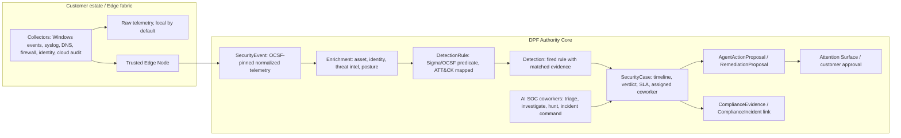

# Sovereign SOC/SIEM - AI-operated security operations on the edge fabric

- **Date:** 2026-06-24
- **Reviewed:** 2026-06-25 by Codex, as enterprise architect and business-development reviewer.
- **Status:** Design-first. No code in this pass.
- **Epic:** `EP-SOVEREIGN-SOC` (new; compose with existing epics before filing duplicate items).
- **Author:** Initial Enterprise Architect draft, revised by Codex.
- **Founder goal:** Improve SIEM capabilities to be fully competitive, leverage AI Coworkers for the human SOC work, and support an IT-service-provider model with about 100 edge nodes across different customers.
- **Composes:** `EP-MSP-FEDERATION`, `EP-EDGE-NODE`, `EP-EDGE-TOPOLOGY`, `EP-FULL-OBS`, `EP-ASSURANCE-LEDGER`, `EP-ATTENTION-SURFACE`, `EP-ESTATE-SOVEREIGNTY`, `EP-PARTNER-CHANNEL`, `EP-DATA-RETENTION`, `EP-PARITY-ENGINE`.

---

## 1. Executive Decision

DPF should not build a generic SIEM clone. It should build a **sovereign, AI-operated SOC layer** on top of the edge fabric, observability stack, assurance ledger, authority kernel, and MSP federation substrate DPF already has.

The architectural spine:

1. **Normalize security telemetry to OCSF.** Adopt the latest stable OCSF schema as the `SecurityEvent` authority, pin the implementation version, and store `ocsfVersion` on events. As of this review, the public OCSF browser exposes stable `v1.8.0` and a `v1.9.0-dev` stream, so the old draft's hardcoded `v1.4.0` is stale.
2. **Keep raw telemetry local by default.** The sovereignty boundary is a minimized detection/case projection, not a raw-log feed.
3. **Use AI Coworkers as the SOC team.** Triage, investigation, hunting, and incident-command coworkers are first-class governed agents, not a chat overlay on a human analyst console.
4. **Govern every action.** Investigation verdicts are evidence conclusions; containment and remediation are kernel-gated action decisions with human-in-the-loop boundaries.
5. **Ship the first wedge as read-only self-monitoring and MSP posture.** Phase 0 should normalize DPF's own audit/tool/authorization telemetry plus edge security events before attempting autonomous response.

The strongest business wedge is not "we store logs." It is: **an MSP can prove coverage, triage alerts with governed AI coworkers, and coordinate customer-safe response without taking unilateral control of a sovereign estate.**

---

## 2. Business Frame

### 2.1 Buyer And Pain

Primary buyer:

- MSP / IT-service-provider owner serving SMB and mid-market customers.
- Internal security/operations leader in a regulated small enterprise.

End users:

- Tier-1/Tier-2 analyst or service-desk operator.
- Customer approver who owns business risk.
- DPF AI Coworkers acting under governed grants.

Core pain:

- Alerts and logs are cheaper to generate than to investigate.
- Ingest-priced SIEM economics punish telemetry growth.
- MSPs need cross-customer visibility, but customers increasingly require data sovereignty and consent before action.
- SMBs want MDR/SIEM outcomes without staffing a 24/7 SOC.

### 2.2 Offer Logic

| Offer | Buyer promise | DPF capability required |
| --- | --- | --- |
| Sovereign SIEM Assessment | "Show which customers, sources, and assets are visible, missing, and risky before we operate response." | OCSF normalization, coverage metrics, source health, read-only detections, exportable reports. |
| AI SOC Operations | "AI coworkers investigate and evidence alerts so humans approve the few decisions that matter." | Detection engine, `SecurityCase`, SOC coworker roster, investigation tools, false-positive tuning loop. |
| Governed Response | "Contain threats inside pre-approved policy and customer consent boundaries." | Response playbooks, `AgentActionProposal`, `runtime-gate`, Attention Surface, Edge Node runner. |
| Sovereign MSP Federation | "The MSP can operate across customers without raw-log exfiltration or unilateral remediation." | `FederationLink`, scoped detection/case projection, customer-side approval and execution. |

### 2.3 Economics And Validation

Do not anchor the business case on unverified vendor pricing. Public pages show the market moving toward predictable per-endpoint, per-source, and managed-SOC pricing, but exact competitor numbers vary by partner, bundle, geography, and contract.

Use bottom-up operating metrics:

- **Coverage:** event sources connected per customer, percentage of endpoints reporting, stale collector count, edge-node health.
- **Signal quality:** detections per source, true-positive rate, false-positive rate, repeated noisy-rule count.
- **Labor leverage:** alerts investigated per coworker-hour, human approvals per customer, analyst-hours avoided using a transparent formula.
- **Response performance:** mean time to detect, mean time to triage, mean time to propose, mean time to contain.
- **MSP economics:** customers per analyst, endpoints/sources per analyst, gross margin after telemetry storage, model cost, and human escalation cost.

Suggested validation formula:

```text
monthly analyst hours avoided =
  investigations completed by AI
  * baseline minutes per manual investigation
  * validated reduction percentage
  / 60
```

The baseline minutes and reduction percentage must be measured during pilots. Vendor claims are benchmark signals, not DPF forecast inputs.

---

## 3. Standards And Market Research

Research last checked: 2026-06-25.

| Source | Current signal | DPF adoption |
| --- | --- | --- |
| [OCSF schema browser](https://schema.ocsf.io/) and [OCSF GitHub](https://github.com/ocsf/ocsf-schema) | OCSF is an open standard for cybersecurity event logging and data normalization. The public browser lists stable `v1.8.0` and `v1.9.0-dev`, with categories for system, findings, identity, network, discovery, application, and remediation activity. | Adopt latest stable OCSF at implementation time, pin the version, store `ocsfVersion`, and add compatibility tests. |
| [NIST SP 800-61 Rev. 3](https://csrc.nist.gov/pubs/sp/800/61/r3/final) | Final April 2025 incident-response guidance aligned to CSF 2.0. It emphasizes integrating incident response across cybersecurity risk-management activities. | Use CSF 2.0 functions as the SOC lifecycle language: Govern, Identify, Protect, Detect, Respond, Recover. |
| [MITRE ATT&CK changelog](https://attack.mitre.org/resources/changelog.html) | ATT&CK content is actively versioned; content version 19.1 was released on 2026-05-12. | Store ATT&CK version used by detection packs; rules must carry technique IDs and pack version. |
| [Sigma specification](https://github.com/SigmaHQ/sigma-specification) | Sigma provides vendor-neutral rule and correlation specifications for SIEM detection logic. | Use Sigma-compatible detection content where it maps cleanly to OCSF; store executable normalized predicates in DPF models. |
| [Microsoft Defender Security Copilot agents](https://learn.microsoft.com/en-us/defender-xdr/security-copilot-agents-defender) | Microsoft documents SOC agents for incident triage, investigation, threat hunting, and threat intelligence inside Defender/Sentinel. | Validates the agentic SOC direction; DPF differentiates with local sovereignty and kernel-governed autonomy. |
| [Dropzone AI company page](https://www.dropzone.ai/company) | Dropzone positions AI agents as operating at machine scale with humans setting direction, and publicly claims 300+ deployments in 2025. | Benchmark for autonomous triage/hunting, but do not reuse unsupported numeric claims as DPF promises. |
| [Huntress Managed SIEM](https://www.huntress.com/platform/siem) | Huntress emphasizes managed monitoring, triage, false-positive tuning, relevant-log filtering, and predictable per-data-source pricing. | Validates the MSP SIEM wedge: predictable billing, smart filtering, compliance reporting, managed response. |

Research conclusions:

- OCSF is the right schema authority, but the version must be pinned per implementation rather than hardcoded in design prose.
- ATT&CK and Sigma are detection-content standards, not storage authorities.
- NIST SP 800-61 Rev. 3 and CSF 2.0 should shape incident/case lifecycle and reporting.
- The AI SOC market validates coworker-led investigation, but DPF must avoid fabricated ROI claims. Pilot metrics should prove labor leverage.
- Ingest economics make data minimization a product feature. Raw-log hoarding is both costly and sovereignty-hostile.

---

## 4. Substrate Audit

### 4.1 Built Substrate

| Capability | Verified location | Reuse |
| --- | --- | --- |
| Edge event ingestion | `apps/web/app/api/v1/edge/events/route.ts` accepts a validated envelope, authenticates `edge:events`, requires trusted Edge Node state, rate-limits per node, and dispatches by `eventType`. | Add `eventType: "security"` to the existing envelope, not a new ungoverned route. |
| Operational alert lifecycle | `EdgeEvent` in `packages/db/prisma/schema.prisma` has dedup, severity, triggered/acknowledged/resolved lifecycle, and edge-node relation. | Keep for operational alerts; bridge security-relevant operational alerts into `SecurityEvent` only when needed. |
| Change-event stream | `ChangeEvent` is a distinct point-in-time model behind the same edge envelope. | Precedent for distinct `SecurityEvent` storage with shared wire auth. |
| Customer and site scoping | `CustomerAccount`, `CustomerSite`, `EdgeNode.customerAccountId`, `customerSiteId`. | Required for MSP tenancy, reporting, and response boundaries. |
| Edge principal and trust | `EdgeNode`, `BootstrapToken`, `EdgeNodeCapability`; auth derives node scope from the server-side Edge Node row. | Security collection and response must inherit this, not trust request JSON. |
| Internal audit telemetry | `AuthorizationDecisionLog`, `ToolExecution`, `AdminActivity`, `ComplianceAuditLog`. | First self-monitoring source for Phase 0. |
| Assurance and vulnerability findings | `AssuranceFinding`, `BomDocument`, `BomComponent`. | Feed risk context into detections and cases; do not duplicate vulnerability state. |
| Incident/compliance record | `ComplianceIncident`, `CorrectiveAction`, `ComplianceEvidence`. | `SecurityCase` composes this when a case becomes regulatory or audit relevant. |
| Proposal-not-action | `AgentActionProposal` and Attention Surface pattern. | Remediation and containment proposals use this rail. |
| Scheduling and jobs | `SCHEDULED_JOB_CATALOG`, Inngest scheduled functions, `log-signature-scanner`, `alert-delivery-bridge`. | Correlation sweeps and detection-pack maintenance should register here. |
| Retention registry | `apps/web/lib/operate/retention/policies.ts` includes `security-audit`, `PURGE_POLICIES`, and `RETAINED_DATASETS`. | Security telemetry joins `security-audit`; cases that become legal/regulated records are retained. |
| Architecture graph projectors | `apps/web/lib/ea/*-extract.ts` and parity tests. | Add security-domain extractor so SOC substrate is visible to EA/parity. |

### 4.2 Verified Gaps

Repo and code-graph sweeps found no committed `OCSF`, `SecurityEvent`, `DetectionRule`, `Detection`, `ThreatIndicator`, `SecurityCase`, `ResponsePlaybook`, `ResponseAction`, or `SIEM` substrate.

Open backlog overlap exists in adjacent epics:

- `EP-MSP-FEDERATION`: federation link, scoped estate projection, cross-deployment remediation consent.
- `EP-EDGE-TOPOLOGY`: edge sovereignty, raw-evidence retention guards, 100/1,000-node load harness.
- `EP-ASSURANCE-LEDGER`: SBOM/OSV scanning and findings queue.
- `EP-ATTENTION-SURFACE`: approvals and "needs you" workflow.
- `EP-ESTATE-SOVEREIGNTY`: sovereignty scoring and governance.

Verdict: `EP-SOVEREIGN-SOC` is justified as an assembly epic, but its BIs must compose those epics rather than refiling their substrate.

---

## 5. Target Architecture



Seven planes:

1. **Collection:** Edge Node and approved collectors gather telemetry. Raw data stays local unless a customer explicitly authorizes a scoped pull.
2. **Normalization:** `SecurityEvent` stores OCSF-normalized facts with DPF scope and schema-version metadata.
3. **Detection:** `DetectionRule` and correlation jobs turn events into `Detection` rows.
4. **AI SOC:** Coworkers investigate detections, gather evidence, and manage cases.
5. **Governed response:** response proposals ride the existing proposal/attention/federation rails.
6. **SOC console:** per-tenant and MSP fleet views surface coverage, detections, cases, SLA, and approvals.
7. **Compliance/reporting:** cases and detections become compliance evidence where appropriate.

---

## 6. Data Model Design

Conceptual shapes only. Exact Prisma fields should be finalized during Phase 0 after migration planning.

### 6.1 `SecurityEvent`

Append-only normalized telemetry. It composes the edge event route but does not replace `EdgeEvent`.

```prisma
model SecurityEvent {
  id                String   @id @default(cuid())
  eventKey          String   @unique
  ocsfVersion       String
  ocsfCategoryUid   Int?
  ocsfClassUid      Int
  ocsfActivityId    Int?
  severityId        Int?
  time              DateTime

  scopeKey          String
  customerAccountId String?
  customerSiteId    String?
  edgeNodeId        String?
  sourceKind        String
  sourceName        String

  actorPrincipalId  String?
  actor             Json     @default("{}")
  device            Json     @default("{}")
  srcEndpoint       Json     @default("{}")
  dstEndpoint       Json     @default("{}")
  observables       Json     @default("[]")
  normalized        Json     @default("{}")
  rawRef            Json     @default("{}")
  confidence        String   @default("source-reported")
  createdAt         DateTime @default(now())

  @@index([scopeKey, time])
  @@index([customerAccountId, severityId, time])
  @@index([edgeNodeId, time])
  @@index([ocsfClassUid, time])
}
```

Rules:

- `customerAccountId`, `customerSiteId`, `edgeNodeId`, and `scopeKey` are denormalized columns for query performance and internal-source support.
- For edge-sourced rows, scope is copied from the authenticated `EdgeNode` row, never from the request body.
- For internal sources such as `ToolExecution` and `AuthorizationDecisionLog`, scope is set at write time from the actor/object context.
- `rawRef` is a pointer or hash, not an implicit blob dump. Pulling raw evidence later requires consent and audit.
- OCSF version is part of the row to make schema evolution explicit.

### 6.2 `DetectionRule`

Executable detection content with tenant overlays.

```prisma
model DetectionRule {
  id              String   @id @default(cuid())
  ruleKey         String   @unique
  rulePackKey     String
  rulePackVersion String
  name            String
  description     String?
  ruleFormat      String   // sigma | ocsf-query | dpf-correlation
  predicate       Json
  mitreTechniques Json     @default("[]")
  severity        String
  scopeKey        String   // kernel | customer:<id> | site:<id>
  enabled         Boolean  @default(true)
  tuning          Json     @default("{}")
  createdAt       DateTime @default(now())
  updatedAt       DateTime @updatedAt

  @@index([scopeKey, enabled])
  @@index([rulePackKey, rulePackVersion])
}
```

Detection rules are not wiki pages. They mirror the kernel/overlay shape, but they are executable content with versioning, enablement, and per-tenant tuning. Wiki-kind content remains for security principles and playbook rationale.

### 6.3 `Detection`

A fired rule with evidence, risk score, and grouped status.

```prisma
model Detection {
  id                String   @id @default(cuid())
  detectionKey      String   @unique
  ruleId            String
  scopeKey          String
  customerAccountId String?
  customerSiteId    String?
  severity          String
  status            String   @default("open") // open | triaged | linked | suppressed | closed
  riskScore         Int?
  matchedEventRefs  Json     @default("[]")
  enrichment        Json     @default("{}")
  firstSeenAt       DateTime
  lastSeenAt        DateTime
  securityCaseId    String?

  @@index([scopeKey, status, lastSeenAt])
  @@index([customerAccountId, severity, status])
  @@index([ruleId, lastSeenAt])
}
```

### 6.4 `SecurityCase`

Operational SOC case. It groups detections and owns the investigation timeline, but it does not duplicate regulated incident fields.

```prisma
model SecurityCase {
  id                   String   @id @default(cuid())
  caseKey              String   @unique
  scopeKey             String
  customerAccountId    String?
  customerSiteId       String?
  title                String
  severity             String
  status               String   @default("new") // new | triaging | investigating | contained | resolved | closed
  verdict              String   @default("unknown") // unknown | false-positive | benign-true-positive | malicious | needs-human
  confidence           String   @default("low")
  assignedAgentId      String?
  assignedUserId       String?
  timeline             Json     @default("[]")
  evidence             Json     @default("{}")
  sla                  Json     @default("{}")
  complianceIncidentId String?
  openedAt             DateTime @default(now())
  resolvedAt           DateTime?
  closedAt             DateTime?

  @@index([scopeKey, status, openedAt])
  @@index([customerAccountId, severity, status])
  @@index([complianceIncidentId])
}
```

`ComplianceIncident` remains the regulated incident record. A `SecurityCase` links to it when the legal/compliance threshold is crossed.

### 6.5 `ThreatIndicator`

Threat-intelligence enrichment source, not an incident.

```prisma
model ThreatIndicator {
  id              String   @id @default(cuid())
  indicatorKey    String   @unique
  indicatorType   String   // ip | domain | url | hash | email | user | process | registry
  value           String
  source          String
  confidence      String
  severity        String?
  validFrom       DateTime?
  validUntil      DateTime?
  tags            Json     @default("[]")
  createdAt       DateTime @default(now())
  updatedAt       DateTime @updatedAt

  @@index([indicatorType, value])
  @@index([source])
  @@index([validUntil])
}
```

### 6.6 Response Models

Use response models only after Phase 2 threat modeling.

- `ResponsePlaybook`: named response strategy, prerequisites, approval tier, reversible flag, blast-radius estimate, supported action types.
- `ResponseAction`: concrete proposed action, linked to `SecurityCase`, `AgentActionProposal`, customer/site scope, Edge Node target, and result evidence.

Response execution must not bypass `AgentActionProposal`, `runtime-gate`, and the customer Attention Surface.

---

## 7. Detection And AI SOC Operating Model

### 7.1 Detection Pipeline

1. Edge and internal sources emit or project telemetry.
2. Normalizers map telemetry into OCSF-pinned `SecurityEvent` rows.
3. Enrichment attaches asset, identity, topology, threat indicator, vulnerability, and recent-change context.
4. `siem/correlation-sweep` evaluates enabled `DetectionRule` rows over bounded windows.
5. Fired rules produce `Detection` rows with matched event refs and evidence.
6. Detections group into `SecurityCase` rows by rule, asset, actor, time window, and shared observables.

Implementation guidance:

- Start with deterministic rules and explainable correlation before ML/anomaly detection.
- Detection packs carry ATT&CK and Sigma/OCSF version metadata.
- Per-tenant tuning must be represented as overlay data, not edits to the shared kernel pack.
- A suppressed rule must retain rationale, owner, expiry, and scope.

### 7.2 AI SOC Coworkers

Initial roster:

| Coworker | Job | Mutating authority |
| --- | --- | --- |
| `AGT-SOC-TRIAGE` | Enrich detections, decide false-positive vs investigate, open/update cases. | Draft/update case only. |
| `AGT-SOC-INVESTIGATOR` | Build timeline, query context, map ATT&CK, recommend verdict. | Draft evidence and proposals only. |
| `AGT-SOC-HUNTER` | Run proactive hunts from indicators, incidents, and rule gaps. | Read and propose new detection content. |
| `AGT-SOC-IR-LEAD` | Coordinate containment/remediation proposals and customer communications. | Propose response actions; no unilateral customer execution. |

New grants should be minimal:

- `siem_read`: query normalized security events, detections, cases.
- `siem_investigate`: write case timeline/evidence, link detections, enrich indicators.
- `siem_tune`: propose rule tuning and suppression with expiry.
- `incident_respond`: propose response actions, never execute directly.

### 7.3 Verdict Vs Action

The kernel should not decide whether an event is malicious. That is an evidence conclusion.

The kernel should govern:

- close vs escalate;
- propose response vs keep investigating;
- auto-approve low-risk reversible action under standing consent vs require human approval;
- whether an MSP-originated action can cross a federation boundary.

This avoids degenerate `principle_decide` use. Evidence tools decide facts; principles decide governed action.

---

## 8. Kernel Decision Record

A formal kernel consultation was run on 2026-06-25 for the schema-authority decision.

Question: choose the schema authority for cross-customer security telemetry and AI SOC investigation.

Options considered:

| Option | Result |
| --- | --- |
| `version-pinned-ocsf` | Recommended. Composite 8.006, margin 3.183, high confidence, no commandment conflict. |
| `custom-dpf-security-schema` | Composite 4.823. |
| `raw-log-first-late-normalization` | Composite 3.001. |

Decision:

> Adopt the latest stable OCSF schema as the canonical `SecurityEvent` authority, store the OCSF schema version on events, and wrap it with DPF scope, consent, retention, and governance fields.

Implementation implications:

- Add OCSF compatibility fixtures and schema-version migration tests.
- Do not centralize raw logs as the primary SIEM data model.
- Do not create a DPF-only event schema that must later be translated back to industry content packs.
- External schema/tool adoption still requires the Tool Evaluation Pipeline where a library, service, package, or executable is introduced.

Security-response principle dimensions:

- Current `PRINCIPLE_DIMENSIONS` includes `blast_radius`, `data_privacy`, `governance_compliance`, `schema_grounding`, `evidence_density`, `vendor_lock_in`, and other useful axes.
- It does **not** currently include `reversibility`, `evidence_confidence`, `customer_consent_state`, or `business_disruption`.
- Before using those as structured kernel features, add them to the closed registry and mark `business_disruption` as a cost axis in `PRINCIPLE_COST_DIMENSIONS`.
- Until then, response decisions should use existing dimensions and explicit rule-based gates for consent/reversibility.

---

## 9. MSP Federation And Sovereignty

### 9.1 Topology A - MSP-Hosted

The MSP runs one DPF. Customer Edge Nodes enroll into the MSP DPF and are scoped by `customerAccountId` and `customerSiteId`.

Allowed:

- Central collection of normalized security events.
- MSP fleet SOC console across customers.
- Customer-scoped detections, cases, reports, and response proposals.
- Execution only where the customer contract and DPF authority grants permit it.

Required:

- Every event, detection, case, response proposal, and export is customer/site scoped.
- No cross-customer query or report leakage.
- Raw evidence access is logged and scoped.

### 9.2 Topology B - Sovereign Peer

Both MSP and customer run DPF. The customer's DPF collects and normalizes locally. The MSP receives only a consented projection.

Default projection:

- `Detection` summary;
- `SecurityCase` summary and timeline entries safe to share;
- affected asset class or pseudonymous asset handle when required;
- recommended response proposal;
- evidence hashes or `rawRef` pointers, not raw telemetry bodies.

Not allowed by default:

- raw security-event payload replication;
- MSP direct execution through customer Edge Node credentials;
- MSP-originated `ResponseAction` moving beyond `proposed` in the customer's DPF;
- unmanaged customer-wide search over raw logs.

The boundary is:

> Raw telemetry stays in the sovereign estate. Detections, cases, and response proposals cross by consent.

This is both a security control and a business differentiator.

---

## 10. UX And Information Architecture

### 10.1 UX Fit Decision

- **Decision:** fits-with-guardrails.
- **Owning area:** Operations, with compliance and customer projections.
- **Canonical route family:** start under `/ops/security` or `/ops/soc` only if route inventory approves the label. Do not add a new global SOC top-level nav in Phase 0.
- **Secondary projections:** `/compliance/incidents`, `/compliance/evidence`, customer account detail pages, Attention Surface.
- **Primary persona:** MSP operator or security/service-desk lead who needs to know what is happening, what needs approval, and whether customers are covered.
- **Navigation layer:** section/local nav inside Ops; contextual actions for case proposals and approvals.
- **AI boundary:** investigation summaries and proposed actions must preview evidence and expected effect before any prompt/action dispatch.

### 10.2 First Screen

The first viewport should answer:

1. **Are we covered?** Connected sources, stale sources, edge-node health, coverage by customer/site.
2. **Are we exposed?** Open critical/high detections, active incidents, KEV/vulnerability context where available.
3. **What needs a decision?** cases awaiting approval, response proposals, suppressions expiring soon.
4. **What did the AI conclude?** triage verdicts with evidence confidence, not raw model prose.
5. **Are we improving?** MTTD, MTTR, false-positive rate, repeated noisy rules.

Use report-kit primitives:

- `StatCard` for coverage/SLA/risk counts.
- `StatusBadge` with status domains in `statusColors.ts`; no page-local status maps.
- `FilterBar` for customer, site, severity, status, source, ATT&CK technique, edge node, and time window.
- `DataTable` for detections/cases/action proposals.
- `Chart` only for trend lines that help decisions, such as case volume, MTTD/MTTR, false-positive rate, and coverage over time.
- `ExportButton` for customer-facing reports.

### 10.3 Case Interaction

Primary case actions:

- Assign to coworker or human.
- Mark false positive with rationale and optional tuning proposal.
- Escalate severity with evidence.
- Link to `ComplianceIncident`.
- Propose containment/remediation.
- Request customer approval.
- Accept risk or suppress with expiry.

Mutating actions require explicit confirmation showing:

- customer/site scope;
- target assets/accounts;
- reversibility;
- blast radius;
- business disruption risk;
- consent state;
- rollback or compensating plan;
- evidence confidence.

### 10.4 Empty And Failure States

- Empty detections with low source coverage is not a green state. Show "coverage incomplete" first.
- Unknown OCSF class or failed normalizer should route to a normalization gap queue.
- No ATT&CK mapping should show "unmapped" with a tuning/contribution action, not blank.
- Missing customer consent should show "proposal only" and disable execution.
- Edge Node offline should degrade to assessment/reporting, not silently hide that customer.

Evidence before merge:

- Route tests for filters, empty states, and permission states.
- Theme/status scan for report-kit usage and no hardcoded colors.
- Browser verification across desktop/mobile for the SOC first screen.
- Fixture coverage for low-coverage, noisy-rule, false-positive, open-critical, and approval-pending cases.

---

## 11. Phased Roadmap

| Phase | Deliverable | Risk | Composes |
| --- | --- | --- | --- |
| P0 - Normalization keystone | `SecurityEvent`, OCSF version pin, edge `eventType: security`, internal-source normalizers for `AuthorizationDecisionLog` and `ToolExecution`, three external reference normalizers, coverage metrics. | Medium schema risk, low execution risk | Edge events, audit logs, OCSF |
| P0.5 - Refactoring and invariants | Status constants, schema-version fixtures, edge envelope tests, retention enrollment, EA extractor stub, route-placement decision. | Low/medium | AGENTS enum doctrine, retention, EA parity |
| P1 - Detection engine | `DetectionRule`, `Detection`, `ThreatIndicator`, scheduled correlation sweep, ATT&CK/Sigma metadata, per-tenant tuning. | Medium | Inngest, scheduled jobs, assurance |
| P2 - AI SOC and case management | SOC coworker roster, `SecurityCase`, MCP tools/grants, investigation timeline, verdict/evidence model. | Medium | Coworker stack, grants, Attention Surface |
| P3 - Governed response | `ResponsePlaybook`, `ResponseAction`, response proposals, consent gates, reversible containment only. | High | AgentActionProposal, runtime-gate, Edge Node hardening |
| P4 - MSP fleet console | `/ops/security` or approved Ops route, per-customer drilldown, SLA/ROI metrics, coverage gaps. | Medium UX/data risk | Report-kit, customer surfaces, Ops nav |
| P5 - Sovereign federation | Detection/case projection over `FederationLink`, customer-side approve/execute, scoped result projection. | High sovereignty risk | EP-MSP-FEDERATION, EP-ESTATE-SOVEREIGNTY |
| P6 - Compliance reporting | Case-to-incident bridge, continuous evidence, framework reporting, retention/archive. | Medium compliance risk | EP-ASSURANCE-LEDGER, EP-DATA-RETENTION |

Engineering allocation:

- Reserve the first **20% of implementation effort** for refactoring and architecture convergence before feature work: schema-version fixtures, enum/status constants, retention registry, edge envelope tests, EA extractor stub, and migration invariants.
- Do not start autonomous response before Phase 0 and Phase 1 evidence is stable.
- Do not build broad collector coverage inside this epic. Collector breadth belongs to `EP-EDGE-TOPOLOGY`/`EP-EDGE-NODE`; this epic consumes approved collectors.

---

## 12. Acceptance Criteria

### P0 Acceptance

- `SecurityEvent` stores OCSF-pinned normalized events with `ocsfVersion`.
- `eventType: security` is accepted through the existing governed edge events route.
- Edge-sourced scope is derived from authenticated `EdgeNode`; request body scope is ignored.
- Internal DPF audit sources produce security events without an Edge Node.
- Raw telemetry is represented by `rawRef`, not copied by default.
- Retention registration exists under `security-audit`.
- Coverage metrics distinguish "no detections" from "no sources."

### P1 Acceptance

- `DetectionRule` content is versioned and per-tenant tunable.
- `Detection` rows carry matched event refs, risk/severity, status, and ATT&CK metadata when available.
- Correlation sweep is registered in `SCHEDULED_JOB_CATALOG` and covered by catalog parity tests.
- Suppression/tuning requires rationale, owner, expiry, and scope.
- False-positive rate can be computed from case verdicts.

### P2 Acceptance

- SOC coworker grants are scoped to read/investigate/tune/respond proposal capabilities.
- Coworkers cannot directly execute customer response.
- Case timeline entries show actor, evidence, decision, and source references.
- Verdicts are evidence conclusions; action decisions are governed separately.
- Case-to-`ComplianceIncident` link exists for notifiable/regulatory paths.

### P3 And Federation Acceptance

- Response actions cannot execute without consent, policy, scope, and runtime-gate approval.
- Cross-org proposals remain `proposed` until the customer's authority approves them.
- Raw event projection over federation is opt-in, scoped, and audited.
- Customer-side runner executes approved customer actions; MSP projection receives result summary only.

---

## 13. Risks And Open Questions

| Risk | Impact | Mitigation |
| --- | --- | --- |
| Collector breadth becomes the schedule driver | "Competitive SIEM" expectations outrun edge-node collectors. | Show coverage gaps explicitly; keep collectors in Edge epics; start with internal audit and a few high-value sources. |
| OCSF version drift | Normalizers and detection content break across versions. | Pin version, store `ocsfVersion`, add compatibility fixtures and migration policy. |
| False positives flood operators | AI SOC becomes another noisy inbox. | Track FP rate, suppression expiry, noisy-rule leaderboard, and tuning proposals. |
| Raw-log sovereignty breach | Customer trust and compliance failure. | Raw local by default, projection-only federation, consented raw pull with audit. |
| AI overreach | Autonomous response causes business disruption. | Evidence verdicts separate from action gates; reversible-only auto path; customer consent state required. |
| Detection content becomes a hidden product burden | Rules decay and coverage claims become stale. | Rule pack versioning, ATT&CK version storage, content ownership, recurring review. |
| Cost grows with telemetry volume | MSP margin erodes. | Smart filtering, local raw retention, bounded normalized projection, storage tiers. |
| Case/incident duplication | Compliance data splits across models. | `SecurityCase` for SOC operations; link to `ComplianceIncident` for regulated path. |
| Tool/license risk | External parsers/collectors introduce unsupported dependencies. | Tool Evaluation Pipeline and approved registry before adoption. |

Open questions:

1. Does Phase 0 pin OCSF `v1.8.0`, or wait for implementation to confirm the latest stable release?
2. Which three external normalizers should be first: Windows Event Log, syslog/CEF, CloudTrail, Entra, DNS, or firewall?
3. Does `EP-SOVEREIGN-SOC` become a new epic in the live backlog, or are early items distributed under `EP-EDGE-TOPOLOGY`, `EP-MSP-FEDERATION`, and `EP-ASSURANCE-LEDGER` first?
4. What is the minimum Edge Node hardening posture required before any containment response is allowed?
5. Should the first SOC console route label be `Security`, `SOC`, or `Incidents` inside Ops?

---

## 14. Backlog Mapping

Before creating `EP-SOVEREIGN-SOC`, query live backlog for overlap. The current read-only sweep found adjacent open work but no open `EP-SOVEREIGN-SOC` epic.

Proposed initial BIs:

| BI | Work type | Outcome |
| --- | --- | --- |
| BI-SOC-001 | doc | Ratify this design and link it to Edge, MSP federation, assurance, retention, and attention specs. |
| BI-SOC-002 | refactor | Add status constants, schema-version fixtures, retention policy entries, and EA extractor stub. |
| BI-SOC-003 | feature | Add `SecurityEvent` and OCSF-pinned normalizer framework. |
| BI-SOC-004 | feature | Add `eventType: security` to the governed edge event envelope and tests. |
| BI-SOC-005 | feature | Project internal audit/tool/authorization logs into `SecurityEvent` for self-monitoring. |
| BI-SOC-006 | feature | Add `DetectionRule`, `Detection`, and first scheduled correlation sweep. |
| BI-SOC-007 | feature | Add `ThreatIndicator` enrichment and ATT&CK/Sigma metadata. |
| BI-SOC-008 | feature | Add `SecurityCase` and SOC coworker MCP read/investigate tools. |
| BI-SOC-009 | feature | Add Ops SOC console using report-kit primitives. |
| BI-SOC-010 | security | Threat-model response actions and Edge Node containment before P3. |
| BI-SOC-011 | feature | Add response proposals on `AgentActionProposal`/Attention Surface. |
| BI-SOC-012 | feature | Add sovereign federation projection for detections/cases. |

Refactor budget:

- `BI-SOC-002` is not optional polish. It is the 20% architecture/refactoring allocation that prevents schema, route, retention, and EA drift before feature slices multiply.

---

## 15. Architecture Review Delta - 2026-06-25

Alignment summary: aligned with concerns. The compose-not-rebuild thesis is sound, but the spec needed standards freshness, safer market claims, and clearer boundaries between SOC operations, compliance incidents, raw telemetry, and governed response.

Findings folded into this revision:

| Severity | Concern | Edit made |
| --- | --- | --- |
| Important | OCSF `v1.4.0` was stale. | Updated to latest-stable-at-implementation, with current research noting stable `v1.8.0` and `v1.9.0-dev`; added `ocsfVersion` field and compatibility tests. |
| Important | Market/pricing claims were too precise for a durable spec. | Replaced hard-coded competitor pricing claims with benchmark framing and bottom-up MSP metrics. |
| Important | The draft's "100% competitive" framing risked feature-list sprawl. | Reframed around three sellable offers and phased wedge: assessment, AI SOC operations, governed response, sovereign federation. |
| Critical | Raw logs crossing org boundaries would violate the sovereignty thesis. | Made projection-only federation the default and raw pulls opt-in, scoped, and audited. |
| Important | SOC console needed UX/IA guardrails. | Added route placement, report-kit component requirements, empty/failure states, and evidence-before-merge. |
| Important | Kernel response dimensions are not all in the registry today. | Added explicit registry caveat and interim use of existing dimensions plus rule gates. |
| Minor | Retention and EA parity were present but buried. | Promoted retention and EA extractor requirements into roadmap and acceptance criteria. |

Reference-doc feedback:

- If this epic proceeds, add an OCSF/security-domain reference to `apps/web/lib/integrate/build-reviewers.ts` so future architecture reviews inherit the standard without rediscovering it.

---

## 16. References

- OCSF, [Schema browser](https://schema.ocsf.io/) and [GitHub repository](https://github.com/ocsf/ocsf-schema).
- NIST, [SP 800-61 Rev. 3: Incident Response Recommendations and Considerations for Cybersecurity Risk Management](https://csrc.nist.gov/pubs/sp/800/61/r3/final).
- NIST, [Cybersecurity Framework 2.0](https://www.nist.gov/cyberframework).
- MITRE, [ATT&CK changelog](https://attack.mitre.org/resources/changelog.html).
- SigmaHQ, [Sigma specification](https://github.com/SigmaHQ/sigma-specification).
- Microsoft Learn, [Deploy AI agents in Microsoft Defender](https://learn.microsoft.com/en-us/defender-xdr/security-copilot-agents-defender).
- Dropzone AI, [Company page](https://www.dropzone.ai/company).
- Huntress, [Managed SIEM](https://www.huntress.com/platform/siem).
- DPF, `AGENTS.md`.
- DPF, `docs/platform-usability-standards.md`.
- DPF, `apps/web/components/ui/report-kit/README.md`.
