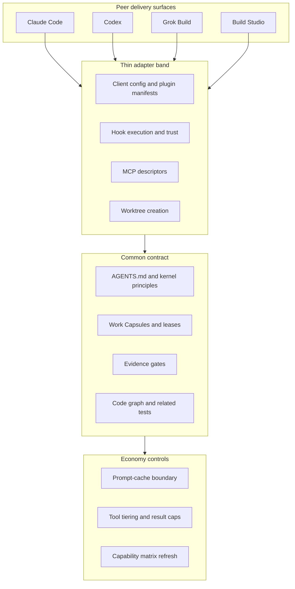

# Delivery-Surface Optimization Study

## Executive summary

DPF's delivery doctrine remains correct: Claude Code, Codex, Grok Build, and Build Studio are peer delivery surfaces coordinated through the MCP plane, Work Capsules, leases, shared hooks, and evidence gates. The work is not to force all development through Build Studio or to create another umbrella epic. The work is to close the thin-adapter gaps that make peer surfaces behave differently in practice.

This review updated the original draft against current local source, live DPF knowledge, and official vendor documentation. The main corrections are:

- Codex hook support is no longer a speculative gap. OpenAI now documents Codex hooks, plugin-bundled hooks, and managed hook trust. DPF also has local plugin manifest tests that wire `hooks/hooks.json` into Claude, Codex, and Grok manifests. The remaining gap is functional proof on each client, especially root-variable compatibility and hook trust behavior.
- The active MCP token standard is `DPF_MCP_BEARER_TOKEN`, not `DPF_MCP_TOKEN`. Older docs and examples still contain drift, but the active setup snippets and skill-pack descriptors use the bearer-token env var.
- Prompt caching differs by provider. Anthropic requires cache control and offers 5-minute default / 1-hour TTL behavior; OpenAI and xAI perform prompt caching automatically, with provider-specific routing and retention rules. DPF's actionable missing feature is Anthropic cache-control emission and cache-hit verification, not a generic "all providers need explicit cache controls" change.
- The safe worktree readiness path is a managed dependency bootstrap with readiness probes, not a default root `node_modules` junction. A root junction is high blast radius and conflicts with the junction-safety concerns already captured in worktree hygiene.
- The durable output should extend the existing living tracker at `docs/architecture/agent-client-capability-parity.md`, backed by a scheduled refresh loop. A one-time study will decay too quickly.

Kernel decision evidence:

- `principle_decide` recommended the living client-capability matrix option with high confidence over a static study, a Build-Studio-only mandate, or a new umbrella epic.
- `principle_decide` recommended a managed dependency bootstrap with high confidence over a root `node_modules` junction or accepting source-only worktrees forever.

## Scope and non-goals

In scope:

- Current-state parity across Claude Code, Codex, Grok Build, and Build Studio.
- DPF-owned leverage gaps: code graph usage, hook parity, Work Capsule discipline, worktree readiness, and prompt-cache economy.
- Backlog disposition into existing epics and backlog items.
- Business value, architecture risk, and verification obligations for the follow-up plan.

Out of scope:

- Replacing the accepted four-surface doctrine.
- Mandating Build Studio as the only development path.
- Creating a new overlapping epic when existing epics own the substrate.
- Adding outbound webhook infrastructure without a specific product or operations consumer.

## Architecture thesis

The doctrine is strong. The leaks are in the adapter band.

The stable contract should remain:

- One operating contract: `AGENTS.md`, kernel principles, MCP coordination, Work Capsules, and evidence gates.
- One shared enablement bundle: `packages/dpf-skill-pack`, including skills, hook definitions, and per-client MCP descriptors.
- One durable client-capability truth: `docs/architecture/agent-client-capability-parity.md`.
- Multiple delivery surfaces: each surface may have different native affordances, but DPF must prove equivalent governance outcomes.

The optimization target is not feature maximalism. It is reducing repeated session friction, token waste, and verification ambiguity while preserving surface choice.

## Verified current state

The table below distinguishes structural wiring from functional proof. Structural wiring means the files or manifests exist. Functional proof means the surface actually ran the guard or used the capability in a live or simulated client path.

| Dimension | Claude Code | Codex | Grok Build | Build Studio | DPF finding |
|---|---|---|---|---|---|
| Instruction file | `AGENTS.md` plus Claude pointers | `AGENTS.md` | `AGENTS.md` plus Claude-compatible conventions | seeded prompts and skills | Single source of truth is sound. |
| Plugin skills | `packages/dpf-skill-pack` | skill-pack plugin | skill-pack plugin | seeded into DB | Structural parity exists. |
| Hook manifest | `.claude-plugin` -> `hooks/hooks.json` | `.codex-plugin` -> `hooks/hooks.json` | `.grok-plugin` -> shared hooks path | in-container preludes and gates | Local tests prove manifest wiring; client execution still needs proof outside Claude. |
| Hook semantics | Claude Code documents `PreToolUse` decision control | Codex documents plugin hooks, trust review, and managed hooks | xAI Build docs are newer and less detailed publicly | Build Studio gates are native | Gap is functional portability, not absence of Codex hook support. |
| MCP | `.mcp.json` and token env | `config.toml` / `bearer_token_env_var` | `grok.mcp.json` | native attach | Active token var is `DPF_MCP_BEARER_TOKEN`; old `DPF_MCP_TOKEN` references should be cleaned. |
| Work Capsules | manual/external claim | manual/external claim | manual/external claim | native build tracking | Correct coordination plane; direct external sessions must keep claiming capsules. |
| Code graph | MCP tools available | MCP tools available | MCP tools available | prompt-wired at plan/review/ship | Build Studio uses it by default; direct sessions need an AGENTS rule and possibly a hook nudge. |
| Worktree readiness | source-control isolation | source-control isolation | source-control isolation | sandbox isolation | Scripts mark `source-only` when deps are missing; they do not converge dependencies. |
| Prompt caching | Anthropic requires cache control | OpenAI automatic | xAI automatic plus routing hints | DPF metering available | Anthropic cache-control emission is missing; metrics exist to verify impact. |
| Tool economy | hook precheck plus MCP caps | hook precheck plus MCP caps | hook precheck plus MCP caps | phase/grant tool scoping | Existing standards are good; direct MCP full-surface discovery still needs pressure toward core tiering. |

Local verification references:

- `apps/web/lib/tak/prompt-assembler.ts` exports `SYSTEM_PROMPT_DYNAMIC_BOUNDARY` and inserts it between stable and dynamic prompt blocks.
- `rg -n "cache_control" apps/web/lib` found no app-layer Anthropic cache-control emission.
- `apps/web/lib/routing/chat-adapter.ts` extracts cache creation/read token fields from provider usage.
- `apps/web/lib/integrate/build-agent-prompts.ts` tells Build Studio agents to call `get_code_graph_freshness`, use `search_code_graph` / `trace_code_surface`, and confirm with source reads.
- `apps/web/lib/mcp-tools.ts` exposes `get_code_graph_freshness`, `search_code_graph`, `trace_code_surface`, and `find_related_tests`.
- `packages/dpf-skill-pack/hooks/plugin-hooks-wired.test.mjs` asserts Claude, Codex, and Grok plugin manifests declare hook paths.
- `packages/dpf-skill-pack/codex.mcp.json`, `claude.mcp.json`, and `grok.mcp.json` use `DPF_MCP_BEARER_TOKEN`.
- `scripts/seed-worktree-mcp.*` and `scripts/sync-mcp-worktrees.*` classify readiness but do not install or share dependencies.

## Research and benchmarking

The benchmark is intentionally mixed: open-source or open-format leaders show portable patterns; commercial first-party clients show the current governance and cache capabilities DPF must track.

### Open-source and open-format comparators

| Comparator | Source | Pattern adopted | Pattern rejected or deferred |
|---|---|---|---|
| AGENTS.md | https://agents.md/ | Keep a predictable, cross-agent instruction file as the durable operating contract. | Do not copy all agent-specific details into many proprietary files. |
| Aider | https://aider.chat/docs/usage/caching.html | Organize stable system prompt, repository map, read-only files, and editable files for cache reuse. | Do not rely on a provider-specific streaming limitation as a DPF-wide design assumption. |
| Gemini CLI | https://github.com/google-gemini/gemini-cli and https://google-gemini.github.io/gemini-cli/docs/tools/mcp-server.html | Treat MCP discovery and trust as a first-class client capability; keep settings explicit. | Do not add Gemini as a DPF delivery surface in this study; track it in the capability matrix. |
| OpenCode | https://opencode.ai/ | LSP awareness, multi-session operation, privacy posture, and many-provider support are useful benchmark signals. | Do not broaden this plan to OpenCode adoption before tool evaluation and backlog placement. |

### Commercial and first-party comparators

| Comparator | Source | Pattern adopted | Pattern rejected or deferred |
|---|---|---|---|
| Anthropic Claude / Claude Code | https://platform.claude.com/docs/en/build-with-claude/prompt-caching and https://code.claude.com/docs/en/hooks | Explicit or automatic cache-control support; deterministic hook decision control. | Do not assume the 1-hour cache TTL is default; the default is 5 minutes unless configured. |
| OpenAI Codex | https://developers.openai.com/codex/hooks, https://developers.openai.com/codex/config-basic, https://developers.openai.com/codex/mcp, https://developers.openai.com/codex/concepts/sandboxing | Hooks, managed trust, config layering, MCP, and sandbox controls are now official surfaces to verify against. | Do not keep stale "Codex command-only hooks" language without live proof. |
| OpenAI API prompt caching | https://developers.openai.com/api/docs/guides/prompt-caching | Automatic prefix caching, usage fields, and 5-10 minute typical in-memory retention. | Do not add OpenAI-specific manual cache controls when no code changes are required for the cache itself. |
| xAI prompt caching and Grok Build | https://docs.x.ai/developers/advanced-api-usage/prompt-caching, https://docs.x.ai/developers/advanced-api-usage/prompt-caching/maximizing-cache-hits, https://x.ai/news/grok-build-cli | Automatic prompt caching, `x-grok-conv-id` / `prompt_cache_key` hints, and parallel worktree subagents. | Do not infer complete Grok hook behavior from Claude compatibility without a functional run. |

## Findings

### F1 - Anthropic prompt-cache breakpoint is defined but not emitted

Severity: P0.

DPF already orders prompts for cacheability with `SYSTEM_PROMPT_DYNAMIC_BOUNDARY`, and telemetry can record cache creation/read tokens. The app layer does not currently emit Anthropic `cache_control`, so sessions pay repeated full input cost for stable prompt prefixes when routed through Anthropic.

Backlog: `BI-79A5C00F`.

Expected fix:

- Split the provider request at `SYSTEM_PROMPT_DYNAMIC_BOUNDARY` where the Anthropic request is assembled.
- Prefer the simplest safe Anthropic cache-control mode that preserves the stable/dynamic split. Use explicit block-level caching only if the request shape needs exact breakpoint placement.
- Keep dynamic task content, recent user text, and volatile tool outputs outside the cached prefix.
- Verify with `cache_creation_input_tokens` on turn 1 and `cache_read_input_tokens > 0` on turn 2.

### F2 - Direct external sessions underuse the code graph

Severity: P0.

Build Studio prompts already require code graph freshness checks and graph-backed discovery. Direct external sessions can call the same MCP tools, but `AGENTS.md` does not currently make code-graph-first blast-radius analysis a standing rule.

Backlog: `BI-0FD9E685`.

Expected fix:

- Extend `AGENTS.md` to require `get_code_graph_freshness` before broad source search when code blast radius matters.
- If the graph is ready, prefer `search_code_graph` / `trace_code_surface`, then confirm exact files with source reads.
- Use `find_related_tests` before test planning.
- Keep the rule concise enough to avoid bloating every session.

### F3 - Worktrees are born governed, not necessarily compile-ready

Severity: P1.

The worktree seed scripts set MCP config, Compose isolation, and readiness markers. They do not converge dependencies. When `node_modules` is absent, the worktree is marked `source-only`, and cheap local tests are unproven. The original "junction a sibling `node_modules`" proposal is risky because junction deletion and root clone coupling have already caused worktree hygiene issues.

Backlog: `BI-3047C122`.

Expected fix:

- Implement a managed dependency bootstrap using pinned package-manager behavior and the shared package-store model where possible.
- Mark `compile-ready` only after readiness probes prove local dependency resolution and at least one cheap source-local gate.
- Treat root `node_modules` junctioning as a spike-only option. It must prove cleanup safety, root clone safety, lockfile compatibility, and janitor behavior before adoption.
- Preserve source-only fallback. Worktree creation must not fail merely because compile readiness cannot be converged.

### F4 - Codex/Grok hook parity is structurally wired but functionally unproven

Severity: P1.

Local tests prove plugin manifests declare hook paths. Official Codex docs now support plugin-bundled hooks and managed hooks. DPF still needs surface-level runs that prove the actual guard commands fire and can block unsafe actions under Codex and Grok.

Backlog: `BI-14E9F7CE`.

Expected fix:

- Run a functional hook matrix across Claude Code, Codex, and Grok Build for the DPF guard hooks.
- Verify environment variables and plugin-root paths on each surface.
- Update wrappers or hook manifests only where proof shows a portability defect.
- Preserve Claude behavior while adding portable fallbacks.

### F5 - The client capability matrix exists, but this study must feed the living loop

Severity: P1.

`docs/architecture/agent-client-capability-parity.md` is already the right single source of truth. It was last fully refreshed on 2026-06-20, and the client landscape has already moved since then. This study should update and operationalize that tracker rather than creating a duplicate matrix.

Backlog: `BI-4B8EABF8`.

Expected fix:

- Extend the tracker with the corrected 2026-06-26 findings.
- Add a scheduled monthly steward that reads official docs, diffs the tracker, files backlog items for material drift, and records sources.
- Track staleness and adoption gaps as evidence, not memory.

### F6 - Old MCP token references remain in docs

Severity: P2.

Active setup snippets and descriptors use `DPF_MCP_BEARER_TOKEN`. Older docs still reference `DPF_MCP_TOKEN`, including historical plan text. This is not an active runtime blocker, but it is a confusion source for external agents and should be cleaned during related doc work.

Disposition: fold into `BI-14E9F7CE` or the capability refresh loop.

### F7 - Outbound webhooks are optional, not a core parity blocker

Severity: P3.

Inbound webhook paths exist for specific integrations. There is no generalized outbound delivery-event webhook layer. This is not required to make the four delivery surfaces equivalent for development governance. Build it only when a concrete consumer exists.

Disposition: defer unless a product or operations workflow needs it.

## Business and platform-development impact

The value of this work is operational leverage.

- Fewer repeated setup hours: worktree readiness reduces manual dependency and test friction in every external session.
- Lower AI spend: Anthropic prompt-cache emission and external MCP core-tier defaults reduce repeated stable-prefix and tool-definition cost.
- Higher review confidence: code graph and related-test usage make blast-radius claims less guessy.
- Stronger enterprise story: DPF can credibly say it governs multiple external AI delivery surfaces with one process, one audit spine, and deterministic guardrails.
- Better partner extensibility: the capability matrix becomes a due-diligence artifact for deciding whether to add or support new clients.

Suggested operating metrics:

- Percent of external sessions with a Work Capsule claim.
- Percent of code-review or implementation sessions that use code graph before broad source search.
- Percent of new worktrees marked `compile-ready` after bootstrap.
- Prompt-cache read tokens divided by cacheable input tokens for Anthropic-routed long sessions.
- Hook functional-pass matrix by client and guard.
- Age of last client-capability refresh and number of material drift items filed.

## UX and operator fit

No new dashboard is required for this slice. The right near-term UX is quiet operator leverage:

- Put durable facts in `docs/architecture/agent-client-capability-parity.md`.
- Keep Work Capsule and evidence records in the existing MCP/Build Studio coordination plane.
- Surface any later visual view inside the existing platform architecture or operator surfaces, not as a separate marketing-style page.
- If a UI view is eventually added, it should be dense, scannable, and operational: client rows, capability columns, verification age, drift findings, and owning backlog items.

## Disposition

Do not create `EP-DELIVERY-SURFACE-OPTIMIZATION`.

Routed backlog:

| BI | Gap | Home |
|---|---|---|
| `BI-79A5C00F` | Anthropic prompt-cache breakpoint and cache-hit verification | Cost / context economy |
| `BI-3047C122` | Managed worktree compile readiness | Worktree hygiene |
| `BI-14E9F7CE` | Codex/Grok hook functional verification and portability fixes | Client hook plane |
| `BI-0FD9E685` | Code graph standing rule for direct external sessions | Unified tracking / code intelligence |
| `BI-4B8EABF8` | Living client capability refresh loop | Scheduling / architecture stewardship |

Do not file now:

- WWMD consolidation: valid concern, but separate from delivery-surface optimization. File under the WWMD/kernel epic if live backlog confirms no active item.
- Outbound webhooks: valid future platform feature, but needs a concrete consumer.
- New client adoption: Gemini CLI, OpenCode, and Aider are benchmark inputs, not approved DPF delivery surfaces.

## Verification evidence captured during review

- Claimed Work Capsule `WC-9E77B289` and edit scope for this spec and plan.
- Queried DPF knowledge for overlapping epics and backlog items before disposition.
- Checked code graph freshness; graph was available but trust was medium because the worktree was dirty.
- Inspected current git state; target docs were untracked and the worktree branch was behind origin/main.
- Read the active capability tracker and context-engineering standard.
- Searched source for cache boundary, cache-control emission, cache telemetry, code graph tool wiring, plugin hook wiring, MCP token env vars, and worktree readiness markers.
- Browsed official vendor docs on 2026-06-26 for Anthropic prompt caching and hooks, OpenAI Codex config/MCP/hooks/sandboxing and API prompt caching, xAI prompt caching and Grok Build, plus open-source/open-format comparators.

## Sources

- Anthropic prompt caching: https://platform.claude.com/docs/en/build-with-claude/prompt-caching
- Anthropic pricing: https://platform.claude.com/docs/en/about-claude/pricing
- Claude Code hooks: https://code.claude.com/docs/en/hooks
- OpenAI API prompt caching: https://developers.openai.com/api/docs/guides/prompt-caching
- OpenAI Codex config: https://developers.openai.com/codex/config-basic
- OpenAI Codex MCP: https://developers.openai.com/codex/mcp
- OpenAI Codex hooks: https://developers.openai.com/codex/hooks
- OpenAI Codex sandboxing: https://developers.openai.com/codex/concepts/sandboxing
- xAI prompt caching: https://docs.x.ai/developers/advanced-api-usage/prompt-caching
- xAI cache-hit maximization: https://docs.x.ai/developers/advanced-api-usage/prompt-caching/maximizing-cache-hits
- xAI cache usage and pricing: https://docs.x.ai/developers/advanced-api-usage/prompt-caching/usage-and-pricing
- xAI Grok Build: https://x.ai/news/grok-build-cli
- AGENTS.md open format: https://agents.md/
- Aider prompt caching: https://aider.chat/docs/usage/caching.html
- Gemini CLI: https://github.com/google-gemini/gemini-cli
- Gemini CLI MCP docs: https://google-gemini.github.io/gemini-cli/docs/tools/mcp-server.html
- OpenCode: https://opencode.ai/
- Implementation plan: ../plans/2026-06-26-delivery-surface-optimization-plan.md
