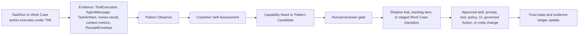

# Governed Adaptive Playbooks - Translating Ornith-Style Self-Improving Work into DPF

> **2026-07-25 continuation:** The proposal, review, Work Case staging, receipt, and resolution
> foundation described here has shipped. Executable method variants, controlled baseline/candidate
> trials, evidence-scope promotion, and the fully autonomous Build Studio consumer are specified in
> [`2026-07-25-governed-playbook-experimentation-autonomous-build-studio-design.md`](2026-07-25-governed-playbook-experimentation-autonomous-build-studio-design.md).
>
> **2026-07-27 implementation status:** The Delivery 3 consumer is implemented under
> `BI-356E69B1`: one consolidated eligibility projection/read seam, phase-by-phase rechecks,
> versioned bounded recovery, exact-head PR/merge-queue custody, governed-release/deployed-SHA
> closure, execution-profile attribution, and the operator custody band. Rollout remains
> default-off and proceeds through shadow and a contained `dpf_dogfood` canary.
>
> **2026-08-30 competence-assurance continuation:** WikiSkill and Anthropic's automated-researcher
> results do not change the Living Playbook ownership model. They add requirements at its evaluation
> and qualification seams: evidence/knowledge/method separation, held-out evaluator isolation,
> capability floors, anti-gaming controls, target-profile transfer evidence, and TAK-JSI
> revalidation before activation. The canonical extension is
> [`2026-08-30-paaw-competence-evolution-workroom-design.md`](2026-08-30-paaw-competence-evolution-workroom-design.md).

- **Status:** Design analysis
- **Date:** 2026-06-27
- **Author:** Codex, operator-directed
- **Primary audience:** DPF platform architecture, AI workforce, TAK runtime, Build Studio
- **Operator prompt:** Review the Ornith video transcript and product/model, then identify how to incorporate the main ideas into DPF without using the raw "scaffold" analogy.
- **Source transcript:** Operator-provided local transcript at `C:/Users/Mark Bodman/OneDrive/Desktop/ornithOverview.txt` (not committed).
- **Related DPF epics from live backlog:** `EP-8AF1C996` Progressive Autonomy & Trust Graduation, `EP-2984B02B` Work Case / Company Work Management, `EP-MODEL-TIER-ROUTING`, `EP-COWORKER-INTERACTIVITY`, `EP-AI-OPSMAP`, `EP-ATTENTION-SURFACE`, `EP-UNIFIED-TRACKING`.
- **Composes with:** `docs/architecture/trusted-ai-kernel.md`, `docs/architecture/ai-agent-meta-model.md`, `docs/architecture/local-llm-build-engine.md`, `docs/architecture/context-engineering-standards.md`, `docs/superpowers/specs/2026-05-11-autonomous-coworker-runtime-design.md`, `docs/superpowers/specs/2026-06-22-build-studio-model-tier-routing-design.md`, and the parallel Work Case design at `docs/superpowers/specs/2026-06-27-work-management-architecture-design.md` plus `docs/superpowers/plans/2026-06-27-work-case-wave-0.md`.

## 1. Executive Decision

DPF should not copy Ornith's "self-scaffolding" language or make models self-authorize new operating procedures. The DPF-native version is:

> Agents propose improvements to their own working methods as **governed adaptive playbooks**. TAK observes the evidence, stores proposals as reviewable platform work, runs them in shadow where appropriate, and promotes only approved, versioned changes into skills, prompts, policies, tools, or procedural code.

The product language should be **Living Playbooks** when shown to operators and **Governed Work Patterns** in architecture and code. The word "scaffold" is useful only when discussing Ornith research.

Ornith itself should enter DPF through the existing local-model and opencode evaluation lane, not as a prerequisite for this capability. Its most important lesson is conceptual: high-performing agentic systems improve the method of work, not only the final answer.

## 2. Why This Matters

The current DPF learning loop exists, but it is too narrow for the operator's intent. Today the most concrete runtime path is reactive:

- `apps/web/lib/tak/reflection-triggers.ts` inspects `PlatformIssueReport(type="agent_stuck")` rows and emits a proactive reflection `TaskRun`.
- That reflection creates a `CoworkerSelfAssessment`, a `CoworkerCapabilityNeed(kind="skill")`, and a deduped `ImprovementSignal`.
- `apps/web/lib/coworker-self-assessment/assessment-service.ts` immediately projects submitted needs into backlog items through the shared intake front door.

That is good, but it is not systemic. It mainly notices one failure shape: repeated tool use after getting stuck. The stronger DPF loop should also learn from:

- repeated successful workflows that should become playbooks or code,
- recurring human approvals that could safely move down the HITL ladder,
- context pressure and tool-surface overload,
- model-tier mismatches,
- missing grants, data, memory, UI affordances, or policy boundaries,
- review failures that recur by phase or coworker,
- manual operator corrections that expose a broken working method.

The target behavior is every agent having a structured, governed way to say: "Here is what I need to perform this class of work better, here is the evidence, here is the safest proposed change, and here is how to evaluate it."

## 3. Research and Benchmarking

### 3.1 Ornith reference

Official DeepReinforce material describes Ornith-1.0 as an open-source coding model family trained with a self-improving loop that learns both task solutions and the task-specific harness/process that guides those solutions. DeepReinforce says the "scaffold" co-evolves with the model policy, with reward flowing to both the method and the answer. Source: [DeepReinforce Ornith-1.0 blog](https://deep-reinforce.com/ornith_1_0.html).

Hugging Face model cards list 9B, 31B, 35B, and 397B variants, MIT licensing, OpenAI-compatible serving recipes through vLLM/SGLang, and Docker Model Runner examples for the 9B and 397B variants. The 9B card also shows usage through agent harnesses and coding CLIs, including opencode. Sources: [Ornith-1.0-9B](https://huggingface.co/deepreinforce-ai/Ornith-1.0-9B), [Ornith-1.0-397B-FP8](https://huggingface.co/deepreinforce-ai/Ornith-1.0-397B-FP8).

DeepReinforce publishes strong benchmark tables for 9B, 35B, and 397B. Treat those as vendor-reported evaluation data until reproduced inside DPF's own build and task harnesses.

### 3.2 Open-source comparables

| Project | Operating model readout | DPF lesson |
|---|---|---|
| Ornith | Training objects are roughly task, generated method, solution rollout, monitor/judge signal, reward. The method is not fixed; it is learned. | DPF should make the working method a first-class, evidence-bearing object, but promotion stays governed. |
| OpenHands | Public SDK/docs expose agent, runtime, LLM, conversation, and OpenAI-compatible endpoint concepts. It separates an agent harness from the model endpoint. Sources: [OpenHands repository](https://github.com/OpenHands/openhands), [OpenHands SDK docs](https://docs.openhands.dev/sdk). | Keep DPF's agent identity, tool surface, runtime, and model-routing policy separate. Model capability alone is not agency. |
| opencode | Open-source terminal coding agent with configurable providers, shell/tool execution, and OpenAI-compatible provider support. DPF already uses it as the local build engine. Sources: [opencode docs](https://opencode.ai/docs/config/), [opencode providers](https://opencode.ai/docs/providers/), `docs/architecture/local-llm-build-engine.md`. | Evaluate Ornith through the existing opencode lane. Do not create a second coding-agent substrate just to test a model. |

### 3.3 Commercial comparables

| Product | Public operating signal | DPF lesson |
|---|---|---|
| Claude Code | Anthropic describes a coding agent that works in terminal/IDE, runs commands, edits files, and has hooks, subagents, checkpoints, and permission frameworks. Sources: [Claude Code product page](https://claude.com/product/claude-code), [Anthropic autonomy update](https://www.anthropic.com/news/enabling-claude-code-to-work-more-autonomously). | Strong autonomy still needs permissions, checkpoints, hooks, and visible control planes. |
| Cursor | Cursor exposes persistent rules at project, team, and user scopes, plus `AGENTS.md`. Source: [Cursor Rules docs](https://cursor.com/docs/rules). | Persistent working instructions matter, but DPF should make them evidence-backed and reviewable, not just editable text. |
| Devin | Devin presents autonomous planning, coding, testing, ticket work, and learning codebase/tribal knowledge. Sources: [Devin site](https://devin.ai/), [Devin intro docs](https://docs.devin.ai/get-started/devin-intro). | The attractive product promise is a self-improving coworker. DPF's differentiator is that improvement is inspectable, local-first, and governed. |

### 3.4 Patterns Adopted and Rejected

Adopt:

- Treat the method of work as improvable.
- Separate model endpoint, harness, memory, tools, permissions, and evidence.
- Prefer local/open model evaluation where it fits DPF's sovereignty posture.
- Use benchmarks as an input, then reproduce on DPF work.
- Make improvement proposals easy for operators to inspect and accept.

Reject:

- Letting a model directly rewrite its own prompts, skills, grants, or policies.
- Turning "scaffold" into DPF product language.
- Bypassing TAK because a model benchmark looks strong.
- Treating a prompt-only playbook as durable platform learning.
- Making Ornith adoption a dependency for the playbook capability.

## 4. DPF Translation

| Ornith concept | DPF-native translation |
|---|---|
| Learned scaffold | Governed Work Pattern / Living Playbook |
| Solution rollout | TaskRun, ToolExecution, AgentMessage, TaskArtifact evidence |
| Reward | Evidence-weighted outcome score, review result, trust-state movement |
| RL mutation | Candidate playbook revision, never live self-modification |
| Fixed outer boundary | TAK directives, approved operating profile, grants, HITL tiers |
| Deterministic monitor | governed tool execution, tool grants, runtime hooks, build gates |
| Frozen judge | reviewer/eval gate, principle decision, phase review, shadow ledger |
| Model family | ModelProfile and provider routing, possibly via opencode |

DPF already has most of the runtime substrate:

- `TaskRun` has `a2aMetadata` and `repeatedPatternKey`, which can stamp work-pattern identity without a new table in Slice 1.
- `ToolExecution` already links agent, user, thread, route, task run, skill, cost, tokens, and result.
- `TaskRun.progressPayload` and `a2aMetadata` already persist per-loop plan/progress state that survives compaction. There is no separate `ExecutionPlan` Prisma model today, so durable plan state should ride on `TaskRun` metadata until query pressure justifies promoting it to a model.
- `CoworkerSelfAssessment`, `CoworkerCapabilityNeed`, and `ImprovementSignal` already form a reviewable need-to-backlog path.
- The parallel Work Case architecture defines the company-facing work object, policy envelope, handoff grammar, governed Action write path, and `ReceiptEnvelope`. Adaptive playbooks must attach to that object for company/business work instead of creating another work manager.
- The AI Agent Meta-Model already says an agent is governed identity plus model routing, tools, prompts, skills, authority, lifecycle, and audit.
- TAK already says model capability does not create trustworthy agency.
- Context engineering metrics already measure tool-surface and context pressure.
- opencode already gives DPF a local OpenAI-compatible coding-agent lane.

The missing object is not another model. The missing object is a reusable, governed method record.

## 5. Proposed Concept Model

### 5.1 Work Pattern

A **Work Pattern** is the reusable method for a class of work. It is not the same as a skill, prompt, plan, tool, or route, though it can influence each of them after approval.

Conceptual shape:

```ts
type WorkPattern = {
  patternKey: string;
  ownerAgentId: string;
  scope:
    | "agent"
    | "route"
    | "skill"
    | "build-phase"
    | "activity"
    | "risk-class"
    | "case-type"
    | "case-transition";
  version: number;
  status: "observed" | "candidate" | "approved" | "active" | "retired";
  objectiveShape: string;
  planTemplate: unknown;
  toolPolicyHints: unknown;
  memoryInputs: unknown;
  evidenceContract: unknown;
  retryPolicy: unknown;
  escalationPolicy: unknown;
  riskProfile: unknown;
  workCaseBinding?: {
    caseType?: string;
    transitionKey?: string;
    governedActionKey?: string;
    authorityMode?: "autonomous" | "on-behalf-of" | "authenticated-inbound";
    sponsorPrincipalId?: string;
    receiptPolicy?: "governed-action" | "observed-event";
  };
  sourceEvidence: Array<{
    taskRunId?: string;
    toolExecutionId?: string;
    improvementSignalId?: string;
    backlogItemId?: string;
    workCaseRef?: string;
    receiptId?: string;
    decisionInteractionId?: string;
  }>;
};
```

Slice 1 should avoid adding this as a heavy new Prisma model. Start with a typed projection in `TaskRun.a2aMetadata.workPattern` plus `repeatedPatternKey`, then promote to a model only when the review UI and query paths prove the required indexes.

### 5.2 Pattern Candidate

A **Pattern Candidate** is a proposed new or revised playbook. It is created from evidence, not from model preference.

Candidate examples:

- "When the Build Studio planner fails security review twice for feature builds, inject the design-review failure into forced regeneration instead of re-reviewing the same artifact."
- "When an AI Ops coworker sees context-pressure overload, first load only the routing-health and provider-status tool pack."
- "When a support coworker repeatedly asks for the same customer-site fields, add a UI affordance or data prefetch."
- "When a local model overflows during opencode on medium tasks, route only mechanical subtasks to local and keep architecture/review on robust tier."

### 5.3 Capability Need Categories

Existing kinds are `tool`, `skill`, `grant`, `model`, `memory`, `data`, `ui_surface`, `boundary`, `prompt`, `convention`, `code`, and `other`. These are a closed string set defined in `apps/web/lib/coworker-self-assessment/types.ts`, not a Prisma enum, so refinement is a TypeScript-level change with no migration.

For systemic playbooks, use the existing kinds first. Later, consider splitting `boundary` into closed subtypes in evidence JSON rather than widening the set prematurely. The key improvement is not more kind values; it is better triggers and evidence.

### 5.4 Relationship To Work Case

The Work Case effort and this playbook effort are adjacent but not interchangeable:

- **Work Case / Work Packet** is the durable company-facing coordination object for business work. It owns case identity, policy envelope, handoff grammar, source projection, governed Actions, receipts, sponsors, authority mode, and A2A-aligned lifecycle vocabulary.
- **Governed Adaptive Playbook / Work Pattern** is the reusable method by which an agent handles a task class, route, case type, or transition. It can propose changes to skills, prompts, tool surfaces, data prefetch, model routes, or procedural code.

When a playbook applies to company/business work, it must bind to the Work Case substrate:

- A case-bound playbook references `caseType`, transition key, policy envelope, sponsor/authority mode, and expected receipt.
- A proposal to change a case state is not a free-form update; it becomes a candidate governed Action or staged-before-commit transition in the Work Case grammar.
- The playbook's evidence must include Work Case source references, `ReceiptEnvelope` references where available, and related `DecisionInteraction` records.
- A playbook can suggest how to assemble a compact Work Packet for a delegate, but the packet remains a Work Case artifact, not a separate playbook-owned object.
- Agent capability advertisement should converge with the Work Case `AgentCard`-equivalent descriptor: the playbook describes method; the capability card describes what the actor can accept and under what security/authority conditions.

This prevents duplicate surfaces: Work Case is where company work lives; adaptive playbooks are how agents improve the method for doing that work.

### 5.5 Architecture Grounding (SysML v2 / EA Substrate)

Playbooks describe and improve *methods of work*, which is exactly what DPF's existing SysML v2 / ArchiMate EA substrate already models. This effort grounds in and communicates through that substrate (`EaElement`/`EaRelationship`/`EaView`, notations `archimate4`/`sysml2`, per the [ai-cockpit SysML note](../../architecture/2026-06-14-ai-cockpit-sysml-architecture-note.md), [SysML v2 reference](../../Reference/sysml-v2.md), and [AI agent meta-model](../../architecture/ai-agent-meta-model.md)) rather than inventing a separate way to describe methods, processes, or agent authority. It must not add a parallel architecture/process-modeling mechanism — that is already on the "not allowed under this budget" list in §8.

Concept-to-element mapping (with stable SysML keys, allocated to code via the seeded SysML2 `allocates` relationship):

- **Work Pattern** → a SysML `action`/activity definition (`ACT-GAP-<patternKey>`) that allocates to the skills, prompts, tool packs, data prefetch, model routes, or procedural code it influences after approval. This makes "what a playbook changes" a traceable allocation, and lets `run_traversal_pattern blast_radius` show the impact of a candidate before activation.
- **Promotion ladder** (observed → candidate → … → proceduralized) → in the foundation slice, a SysML `part_definition` containing `state` elements for `observed`, `candidate`, `approved`, `active`, and `retired`; no candidate changes runtime behavior until it reaches `active`.
- **Pattern Candidate** → a proposed change carried as a `CoworkerActionEnvelope` (proposed → resolved) plus a `DecisionInteraction` at the approval gate (per §9), never a free-form mutation. Case-bound candidates additionally bind to the Work Case governed Action and `ReceiptEnvelope`.
- **Evidence contract** → `verification_case` elements (`VC-GAP-*`) that cite the `TaskRun`/`ToolExecution`/receipt evidence proving a pattern's effect.
- **Agent + governed authority** → the agent `part_definition` and `AgentGovernanceProfile` already in the substrate; the playbook proposes method changes within that authority, with the chain auditable via `run_traversal_pattern ai_oversight`.

Keep it honest the same way Work Case does: derive current-state pattern/method elements from code and runtime evidence via the Design-Implementation Parity Engine, hand-author only target-state, surface drift as `EaConformanceIssue`, and anchor to IT4IT value streams. Communicate proposals through the existing EA tools (`query_ontology_graph`, `describe_ea_view`, `run_traversal_pattern`, `export_archimate`) so an operator sees a proposed method change grounded in the platform model, not just as a row in a review queue.

## 6. Systemic Proposal Loop

The loop should run both event-triggered and periodic reviews.



### 6.1 Event Triggers

Add pattern-observer triggers for:

- repeated tool failure or repeated identical arguments,
- tool denied by grant or missing capability,
- tool-surface pressure in the `caution` or `overload` zone (`ToolSurfaceZone` in `apps/web/lib/tak/context-economy-metrics.ts`), including overload beyond the local 15-tool selection cliff (`LOCAL_TOOL_SELECTION_CLIFF`),
- model-tier mismatch or fallback,
- repeated phase-review failure,
- repeated human correction in the same route/activity,
- repeated successful workflow with high manual ceremony,
- repeated approval of the same action envelope,
- unresolved missing data field,
- recurring UI handoff to another page,
- recurring Work Case transition friction, including `input-required`, `auth-required`, sponsor/accountability gaps, missing receipt coverage, or policy-envelope failures,
- build/review/ship gate failures with the same suspected root cause.

### 6.2 Periodic Agent Reviews

Each agent should also have a periodic profile review after either:

- N completed TaskRuns, or
- seven days since the last profile review, whichever comes first.

The periodic review runs as a proactive job. Its `TaskRun` ownership must resolve to `userId` = the install superuser and `executor` = the reviewing Agent — never a synthetic "system" actor — so the review's own evidence, costs, and any emitted needs are attributable under the same accountability rules as all other agent work.

The review inspects recent `TaskRun`, `ToolExecution`, `CoworkerCapabilityNeed`, `ImprovementSignal`, token/context metrics, and review results. It must output:

- top work patterns observed,
- capability needs with evidence,
- candidate playbook revisions,
- candidates that should be proceduralized,
- candidates that should not be automated due to risk or policy.

This is the operator's requested systemic layer: not just "I got stuck," but "after looking at my own work, here are the changes I need."

### 6.3 Promotion Ladder

No candidate changes runtime behavior immediately.

1. **Observed:** stamp `TaskRun.repeatedPatternKey` and pattern metadata.
2. **Proposed:** create `CoworkerSelfAssessment` plus `CoworkerCapabilityNeed` or a pattern-candidate evidence record.
3. **Filed:** project accepted needs into backlog through the existing intake path.
4. **Shadowed:** where relevant, run the candidate as a suggestion only and compare with current behavior.
5. **Case-staged:** if the candidate affects company work, express it as a staged Work Case proposal or governed Action candidate. It must carry sponsor/authority-mode context and expected receipt coverage before it can affect a case.
6. **Approved:** human/reviewer gate accepts the skill, prompt, grant, model-route, UI, policy, governed Action, or code change.
7. **Activated:** versioned change becomes active for a scoped agent/activity/risk/case class.
8. **Proceduralized:** repeated high-confidence behavior moves from prompt/skill to code and invariant guard.

This composes directly with `EP-8AF1C996`: trust is earned per coworker x activity x risk, and regulatory/compliance ceilings still cap autonomy independent of success rates.

## 7. Architecture Slices

### Slice 1: Systemic Capability-Needs Observer

Goal: broaden the existing reflection trigger without adding a large schema surface.

Work:

- Extract a `pattern-observer` module from the narrow runtime-issue reflection path.
- Read recent `TaskRun`, `ToolExecution`, context metrics, review outcomes, and existing needs.
- Emit `CoworkerSelfAssessment` with richer `rawPayload`.
- Emit needs using existing kinds.
- Deduplicate by agent, route, kind, normalized need, and evidence fingerprint.
- Keep the current backlog projection path.

Acceptance:

- A repeated grant denial creates a `grant` need, not a generic `skill` need.
- A repeated context-overload run creates a `prompt`, `tool`, or `data` need with token evidence.
- A repeated successful manual workflow creates a `code` or `convention` need for proceduralization.
- Reflection loop guards still prevent self-trigger cascades.

### Slice 2: Work Pattern Metadata and Candidate Projection

Goal: make playbooks visible without committing to a premature table.

Work:

- Define a TypeScript schema for `TaskRun.a2aMetadata.workPattern`.
- Stamp `patternKey`, `patternVersion`, and `patternSource` on runs that match a known or candidate pattern.
- Use `TaskRun.repeatedPatternKey` for queryability.
- Add a read model that groups runs by pattern key, agent, route, outcome, and risk.
- Store candidate diffs in evidence JSON on the need or improvement signal first.
- When Work Case Wave 0 is available, include optional case references from the Work Case source registry/status projection rather than inventing playbook-owned case classification.

Acceptance:

- Operators can see repeated patterns by agent and route.
- Candidate evidence links back to TaskRuns and ToolExecutions.
- Case-bound candidates link to Work Case source references and receipt/decision evidence when present.
- No new table is introduced until UI/query pressure justifies it.

### Slice 3: Shadow and Trust Integration

Goal: evaluate candidates without changing live autonomy.

Work:

- Connect candidate evaluation to the Decision-Shadow Ledger work in `BI-DE4BF92F`.
- Compare current playbook vs candidate recommendation for bounded scenarios.
- Record whether the candidate would have reduced tool calls, failures, manual touches, context load, or review failures.
- Feed approved evidence into trust graduation only within the regulatory ceiling from `BI-40CD8ACD`.

Acceptance:

- A candidate can be rejected with evidence.
- A candidate can be approved for a smaller scope before broad activation.
- Trust-state movement is per coworker x activity x risk, not global.

### Slice 4: Operator UI - Needs and Playbooks

Goal: make the capability feel useful, calm, and operational.

Recommended placement:

- Add a **Needs and Playbooks** tab to the AI Workforce agent detail.
- Add a summarized lane to AI Operations Map for active agent-level playbook proposals and blocked needs.
- For company/business work, surface case-bound proposals inside the Work Case detail or Workspace attention lens once that substrate exists. Do not create a separate case-work dashboard here.
- Keep backlog as the product work record and Work Case as the company work record; this UI is an evidence/review surface, not a third state manager.

Layout:

- Left rail: agents and routes with counts for open needs, candidate playbooks, shadow trials, accepted changes.
- Center pane: selected playbook timeline, evidence list, before/after diff, and Work Case/receipt links when case-bound.
- Right inspector: action buttons for "run shadow trial", "file backlog item", "approve as skill update", "approve as code candidate", "defer", "mark duplicate", "retire".

Design rules:

- Use dense operational layout, not a marketing hero.
- Avoid nested cards; use full-width bands and tables for scan-heavy review.
- Use status tokens and existing report-kit primitives.
- Use icons for actions and text only where commands need clarity.
- Never show "scaffold" in the UI. Use "playbook", "working method", "pattern", and "proposal".
- Show risk/autonomy ceiling beside every approval affordance.
- Do not expose `WorkCapsule`, `DecisionInteraction`, or `ReceiptEnvelope` as primary product terms outside admin/audit context; show them as evidence drill-downs.
- Do not ship case-bound playbook controls before the Work Case governed write path and receipt-coverage guard are available. Agent-level review can ship earlier, but case state changes must wait for enforcement.

### Slice 5: Ornith Model Evaluation Lane

Goal: decide whether Ornith is useful for DPF without entangling model adoption with playbook architecture.

Work:

- Run DPF's tool/provider evaluation pipeline for Ornith as an `ai_provider` and, where applicable, as a `docker_image` before any install-wide routing change.
- Register Ornith candidates as `ModelProfile` rows only through the provider/model evaluation path.
- For 9B/GGUF or DMR-compatible variants, test via Docker Model Runner or an OpenAI-compatible local endpoint.
- For 35B/397B variants, treat as robust-tier or lab-only candidates unless local hardware supports them.
- Run through opencode first for coding tasks, because DPF already gates local code-writing through opencode.
- Measure DPF tasks: plan quality, tool fidelity, review pass rate, context behavior, cost/latency, and failure modes.

Acceptance:

- No routing change uses vendor benchmarks alone.
- Evaluation writes to `ModelProfile`/routing evidence, not provider-level folklore.
- Ornith can be recommended for local, robust, lab, or rejected status based on DPF evidence.

## 8. Refactoring Budget

The implementation should reserve **20 percent of the effort for refactoring**. Spend it on structural consolidation that makes this capability cleaner, not unrelated cleanup.

Allowed refactoring:

- Extract shared pattern-observer primitives from `reflection-triggers.ts` instead of growing a second reflection subsystem.
- Centralize capability-need fingerprinting and dedupe so runtime reflections, periodic reviews, and manual assessments converge.
- Define typed helpers for `TaskRun.a2aMetadata.workPattern` and `repeatedPatternKey`.
- Align case-bound pattern metadata with the Work Case source registry, status projection, and receipt envelope once `EP-2984B02B` Wave 0/1 lands.
- Separate UI projection from persistence; do not make the Operations Map own playbook state.
- Reuse existing `CoworkerSelfAssessment`, `CoworkerCapabilityNeed`, `ImprovementSignal`, `TaskRun`, and `ToolExecution` before adding tables.
- Align evidence contracts with context-economy metrics and model-routing evidence.
- Reuse Work Case `ReceiptEnvelope` and governed Action concepts for case-bound proposals; do not introduce a playbook-specific receipt or action ledger.
- Register Work Pattern/promotion/evidence as elements in the existing EA/SysML substrate (`ACT-GAP-*`, `SM-GAP-PROMOTION`, `VC-GAP-*`) with allocations to code, reusing the parity engine and conformance tooling.

Not allowed under this budget:

- Rewriting AI Workforce navigation.
- Replacing the coworker runtime.
- Adding a parallel audit/event ledger.
- Adding a parallel Work Case, Work Packet, receipt, handoff, or case-state model.
- Making a second edit to the Work Case governed-execution receipt seam — the `mcp-governed-execute.ts` `context.workCase` / `work-case-governed-action` receipt derivation is owned by Work Case Wave 1 (`BI-D633F7AF`). Case-bound playbook proposals consume that seam; they do not re-implement it.
- Adding a parallel architecture-, process-, or method-modeling mechanism instead of using the existing SysML v2 / ArchiMate EA substrate and IT4IT value streams.
- Expanding model routing beyond the existing model-tier routing epic.
- Creating prompt-only shortcuts that cannot be audited.

## 9. Governance and Safety

Hard constraints:

- Models may propose playbook changes; they may not activate them.
- Every promotion-ladder approval gate is recorded as a `DecisionInteraction`, so playbook promotion shares the one governed decision ledger with Work Case Actions and WWMD/WWWD/WSID rather than inventing a separate approval log. The decision scope (platform / company / job-activity) follows the playbook's scope: a build-phase or skill playbook is a platform (WWMD) decision; a case-type playbook for company work is a company (WWWD) decision.
- Tool grants, HITL tiers, prompt templates, skills, and model routes remain governed platform resources.
- Every proposal must include evidence and a suggested evaluation method.
- Case-bound proposals must include Work Case source references, sponsor/authority-mode context, and expected `ReceiptEnvelope` coverage before they can affect state.
- Consequential case transitions must execute only through Work Case governed Actions. A playbook may propose an Action candidate; it may not write directly to the backing `WorkItem`, `WorkCapsule`, source record, or case projection.
- A rejected candidate must remain visible enough to prevent the same proposal from resurfacing endlessly.
- Regulatory/compliance autonomy ceilings override trust graduation.
- Work Case terminal-state sealing applies to case-bound playbooks: follow-on work creates a linked case/context rather than reopening a closed case in place.
- Context/tool-surface improvements must honor `docs/architecture/context-engineering-standards.md`.
- Durable learnings route to the shared commons per AGENTS.md; local-only learning is a staging state, not the destination.

## 10. Implementation Plan Summary

1. **Spec and backlog alignment:** this document, then link it to the relevant epic/backlog items or create a focused item under the best existing epic. Foundation plan: [`docs/superpowers/plans/2026-06-27-governed-adaptive-playbooks-foundation.md`](../plans/2026-06-27-governed-adaptive-playbooks-foundation.md).
2. **Work Case alignment:** keep agent-level observers independent, but sequence case-bound proposals behind Work Case Wave 0 source/status projection and Work Case Wave 1 governed Action/receipt coverage.
3. **Observer foundation:** extract pattern observation and emit richer needs through existing assessment/backlog flow.
4. **Metadata stamping:** add typed work-pattern metadata on TaskRuns and pattern grouping read models, with optional Work Case references when available.
5. **Review UI:** add the Needs and Playbooks operator surface for agent-level proposals; case-bound proposal controls land in Work Case/Workspace after enforcement.
6. **Shadow evaluation:** integrate with Decision-Shadow Ledger, Work Case staged transitions where relevant, and trust graduation.
7. **Model lane:** evaluate Ornith as a provider/model candidate through opencode and ModelProfile scoring.
8. **Proceduralization:** turn repeated approved playbooks into code and invariant guards.

Foundation implementation note: the first slice keeps playbooks as proposal metadata on existing substrates. `TaskRun.a2aMetadata.workPattern`, `TaskRun.repeatedPatternKey`, `CoworkerCapabilityNeed.readinessJson`, `CoworkerTurnMetric` context/tool telemetry, and the EA parity domain `workPatternArchitecture` carry the foundation without adding a WorkPattern table. `readinessJson` records `readyForReview`, `readyForCaseActivation`, and blockers; case-bound activation remains false unless source evidence, `governedActionKey`, `receiptPolicy`, and an approved/active pattern status are all present. The observer never emits activation commands or prompt, skill, grant, model-route, or Work Case mutation payloads.

## 11. Test and Verification Strategy

Unit tests:

- pattern fingerprint normalization,
- duplicate suppression,
- trigger classification to capability-need kind,
- work-pattern metadata parsing,
- reflection loop guard preservation,
- context/tool-surface signal extraction.

Integration tests:

- ToolExecution and TaskRun evidence link to submitted needs.
- Submitted needs still project into backlog.
- Candidate proposals do not mutate SkillDefinition, prompts, grants, or routing.
- Case-bound candidates do not mutate WorkItem, WorkCapsule, source records, or case state outside the Work Case governed Action path.
- Case-bound candidate evidence references ReceiptEnvelope/DecisionInteraction records when present and distinguishes governed-Action evidence from observed-event evidence.
- Shadow comparison records evidence without changing live behavior.

UX verification:

- AI Workforce agent detail shows open needs and candidate playbooks.
- AI Operations Map summarizes active proposals without hiding existing failures.
- Work Case/Workspace surfaces, when implemented, show case-bound playbook proposals as evidence/actions on the case rather than a separate dashboard.
- Long playbook names, evidence lists, and action labels fit on mobile and desktop.
- Approval actions show HITL/risk ceiling context.

Model evaluation:

- Ornith 9B through opencode on small DPF coding tasks.
- Compare against current local qwen3-coder and robust-tier candidates.
- Record plan quality, review pass/fail, tool fidelity, context overflow, latency, and cost.

## 12. Open Decisions

1. **Where should the first operator UI live?** Recommendation: AI Workforce agent detail first, Operations Map summary second.
2. **Which agents should pilot systemic reviews?** Recommendation: Build specialist first because evidence density is high; AI Ops engineer second because model/tool/context needs are visible.
3. **When should a WorkPattern table be added?** Recommendation: after Slice 2 proves query shapes; use TaskRun metadata first.
4. **Should capability need kinds expand?** Recommendation: not initially. Use existing kinds plus structured evidence JSON.
5. **Should Ornith be a Build Studio default candidate?** Recommendation: no. Evaluate first, then route by ModelProfile evidence and model-tier policy.
6. **Should case-bound playbook proposals wait for Work Case enforcement?** Recommendation: yes for any consequential transition. Agent-level observation can ship earlier, but case state, handoff, authority, or external side-effect changes must wait for governed Actions and receipt coverage.
7. **Should a Pattern Candidate's promotion itself be tracked as a (meta) Work Case?** The promotion ladder (observed → … → proceduralized) is governed work with its own evidence, decisions, and accountable approver — i.e. exactly what Work Case models. Recommendation: keep promotion as `TaskRun` metadata plus `CoworkerSelfAssessment`/`CoworkerCapabilityNeed` for Slices 1–2 (no premature object), but treat "promotion-as-Work-Case" as the convergence endpoint once Work Case enforcement and the attention surface exist, so playbook review gets uniform receipts and "needs you" attention instead of a bespoke review queue. Revisit at Slice 4.

## 13. Success Criteria

- Every major coworker can produce evidence-backed needs from both failures and successful repetition.
- Operators can review an agent's proposed needs and playbook changes without reading raw logs.
- Case-bound proposals appear on Work Case/Workspace evidence surfaces and produce or reference receipts; they do not create a parallel work surface.
- Approved playbook changes are versioned, scoped, and auditable.
- Consequential case changes flow through governed Actions with sponsor/authority-mode and receipt evidence.
- Rejected proposals do not churn forever.
- Repeated successful prompt/skill behavior can graduate to code with invariant guards.
- Model candidates such as Ornith are evaluated through DPF evidence before routing changes.
- The platform has a product-friendly analogy: living playbooks, not scaffolds.
