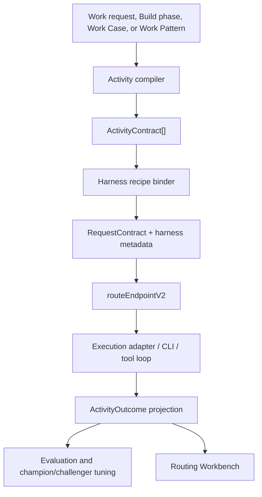

# Activity-Level AI Routing Harness Design

| Field | Value |
| --- | --- |
| Status | Draft design |
| Date | 2026-06-28 |
| Backlog item | BI-BC0A0EB2 |
| Plan | [2026-06-28-activity-level-ai-routing-harness.md](../plans/2026-06-28-activity-level-ai-routing-harness.md) |
| Owner surface | Platform routing / AI Operations |

## 1. Executive Summary

The GLM/task-routing transcript reframes DPF's model strategy. The leverage is not a cheaper global default model. The leverage is an owned activity harness that can break larger work into smaller activities, select the right model plus execution harness for each activity, and continuously tune those choices from outcome evidence.

DPF should add an activity layer above the existing routing spine:

1. `ActivityContract` describes the unit of work, risk, distribution shape, context policy, token envelope, and success shape.
2. `HarnessRecipe` describes the provider/model-family execution system: prompt strategy, memory/context packing, tool policy, response policy, adapter family, and evaluator.
3. `ActivityOutcome` projects the result of one activity from `TaskRun`, `RouteDecisionLog`, `AdapterRunTelemetry`, route outcomes, review/evaluator results, and human corrections.
4. A Routing Workbench makes the activity plan, model choice, exclusions, cost, quality signal, and tuning state inspectable.

This is not a replacement for `routeEndpointV2`. The existing router remains the endpoint selector. The activity layer compiles work into richer `RequestContract` inputs and harness metadata before the router ranks endpoints.

2026-07-19 refinement: the activity layer must generalize beyond Build Studio. Build Studio remains the first consumer because it is where DPF encodes software-delivery expertise, but the contract describes reusable activity shapes that also apply to marketing, finance, operations, customer work, and COO-style orchestration. The same distinction also separates **reasoning effort** from **workflow intensity**: a high-effort model call is not the same as a bounded multi-agent workflow, and a recursive "use more subagents" toggle must never be hidden behind an effort slider.

## 2. Transcript Distillation

Salient message:

- GLM-5.2-style models are strong on center-of-distribution work: routine synthesis, extraction, first-pass copy, familiar UI/code patterns, and outputs a human can inspect quickly.
- Frontier models still matter for edge-of-distribution work: ambiguous architecture, novel debugging, security-sensitive judgment, high-risk autonomy, and work where a wrong answer is costly or hard to detect.
- Companies struggle to switch because a model call is not the work system. The harness includes prompts, tool-call protocol, memory, context retrieval, token policy, review loops, and team ergonomics.
- Provider-owned team harnesses are sticky because they absorb company context. If DPF does not own the routing/context/harness layer, customers risk renting their own company brain back from model providers.
- The strategic opportunity is activity-level routing: recognize the activity shape, run the cheapest adequate model/harness for safe center work, escalate edge work, and keep evaluating because the model landscape changes.

DPF already has pieces of this. The gap is the activity/harness contract between large work and model selection.

### 2.1 Additional transcript and operator-thread distillation (2026-07-19)

The follow-up model-routing transcripts add five design constraints:

- Multiple providers are valuable in a single-owner install for cost spreading, capacity spreading, and fit-to-work selection. The design does not rely on a multi-tenant boundary; the routing concern is owner-operated efficiency and outcome quality.
- Current routing is too coarse when it only sees broad task type, model tier, budget class, and provider health. It needs a reusable activity shape before endpoint selection: tiny/mechanical, routine/center, expansive/orchestrated, design/taste-heavy, review/simplification, system operation, and so on.
- Some models and clients are better **orchestrators** while others are better **workers**. COO, Build Studio, and multi-step marketing or operations jobs need decomposition, bounded delegation, progress synthesis, and escalation judgment; they should not route exactly like single-pass implementation or extraction.
- "Ultra" style modes are not just reasoning effort. They are workflow/subagent intensity. Treating them as effort can recursively set every child agent to the most expensive setting, share too much thread history, pollute context, and burn capacity without a proportional quality gain.
- Bounded workflow recipes are safer than open-ended recursive subagent tools. A workflow should declare phases, typed outputs, context packets, child effort, max parallel slots, max depth, terminal conditions, and evidence requirements. The model may help draft the workflow, but code/policy owns when it stops.

This preserves the earlier activity-harness thesis and sharpens it: DPF should route by **activity shape + domain overlay + work size + posture + workflow intensity**, then let the existing router select the endpoint that satisfies that demand.

### 2.2 Codex CLI source inspection and WWMD recommendation (2026-07-19)

The Codex CLI V2 subagent source is useful research input, not a platform shape to copy. Source inspection found these relevant mechanics:

- `spawn_agent` accepts a task message plus optional agent type, model, reasoning effort, service tier, and `fork_turns`. V2 defaults to full conversation forking unless changed, while `fork_context` is rejected in favor of `fork_turns`.
- `send_message` is queue-only; `followup_task` queues and triggers a child turn. `wait_agent` waits for mailbox activity or steering signals, not a typed DPF completion artifact.
- Agent identity is path-like (`/root/...`) inside Codex. That works for a CLI-local tree, but DPF already has durable `TaskRun`, `TaskNode`, `DelegationChain`, Work Case, attention, and approval identities.
- Codex "Ultra" mode can proactively use multiple agents, with documented capacity risk. That confirms DPF's distinction between single-call reasoning effort and workflow/subagent intensity.

WWMD was consulted after the operator flagged the decision-routing requirement. Ledger `DI-2CEFCF353211` recommended **DPF-native call-chain workflow runtime** with high confidence (composite `10.062`, margin `4.879`, no commandment conflict) over copying Codex path trees, adding routing metadata only, or limiting the lessons to Build Studio.

DPF adopts the useful lessons:

| Codex lesson | DPF adoption | Rejected shortcut |
| --- | --- | --- |
| Queue-only versus trigger-turn messages | Durable `WorkflowMessage` kinds distinguish mailbox delivery from execution-triggering follow-up. | Treat every message as permission to run, or hide execution triggers in chat prose. |
| Per-child model and effort settings | Workflow phases declare parent effort, child effort, and capability demand. | Let child agents inherit maximum effort recursively. |
| Agent mailbox/status stream | Project workflow messages, task activity, and decision requests through existing `TaskRun`, Work Case, attention, and approval surfaces. | Make raw subagent chatter the durable record. |
| Context forking is easy but expensive | Default to bounded `ContextPacket` inputs from customer records, WWMD, WWWD, WSID, Work Cases, artifacts, and evidence summaries. | Fork full conversation history to every child by default. |
| CLI-local path identity is convenient | Use `CallChainRef` over existing DPF identities: `workflowRunId`, `TaskRun`, `TaskNode`, `DelegationChain`, phase, and node ids. | Copy slash-path agent identity as a platform primary key. |
| Proactive subagents can help | Allow bounded workflow recipes with caps, terminal conditions, and capacity receipts. | Expose recursive team mode as a generic effort toggle. |

References: [OpenAI subagents docs](https://learn.chatgpt.com/docs/agent-configuration/subagents), Codex source files [`spawn.rs`](https://github.com/openai/codex/blob/main/codex-rs/core/src/tools/handlers/multi_agents_v2/spawn.rs), [`message_tool.rs`](https://github.com/openai/codex/blob/main/codex-rs/core/src/tools/handlers/multi_agents_v2/message_tool.rs), and [`multi_agents.rs`](https://github.com/openai/codex/blob/main/codex-rs/core/src/session/multi_agents.rs).

## 3. Existing Substrate

Use these existing integration points:

| Area | Existing files | Design implication |
| --- | --- | --- |
| Request contract | `apps/web/lib/routing/request-contract.ts` | `ActivityContract` compiles into `routeContext` and `RequestContract`, especially `reasoningDepth`, `budgetClass`, `residencyPolicy`, `minimumTier`, and `minimumDimensions`. |
| Endpoint selector | `apps/web/lib/routing/pipeline-v2.ts` | Keep `routeEndpointV2` as the only model selector. Do not introduce a second endpoint ranking engine. |
| Execution recipe | `apps/web/lib/routing/recipe-types.ts`, `apps/web/lib/routing/execution-plan.ts` | `HarnessRecipe` should extend execution planning without overloading provider adapter selection. |
| Build phase preview | `apps/web/lib/inference/phase-model-resolution.ts` | Phase routing already does deterministic dry-run prediction. Refactor its phase contract hints into a shared compiler. |
| Routing visibility | `apps/web/lib/ai-operations-map/types.ts`, `apps/web/lib/ai-operations-map/project-routing-topology.ts`, `apps/web/components/platform/AiOperationsMap.tsx` | Extend the Operations Map with activity-routing projection DTOs rather than building another disconnected visualizer. |
| Work patterns | `apps/web/lib/tak/work-pattern-read-model.ts`, `apps/web/lib/tak/work-pattern-types.ts` | Work patterns can seed repeatable activity plans and later accumulate activity outcomes. |
| Provider/model scoring | `docs/superpowers/specs/2026-06-19-provider-model-scoring-convergence-design.md` | Activity performance updates model profiles and recipe performance; provider scores stay derived. |
| GLM provider | `docs/superpowers/specs/2026-06-28-zai-glm-provider-design.md`, `packages/db/data/providers-registry.json`, `apps/web/lib/routing/known-provider-models.ts` | GLM lands as model capability and provider/account-readiness state. Activity confidence stays provisional until evaluated per activity. |
| Coworker subagent fanout | `docs/superpowers/plans/2026-07-08-coworker-subagent-fanout-plan.md`, `apps/web/lib/tak/subagent-fanout.ts` | Reuse `TaskRun.parentTaskRunId`, fanout metadata, and width/depth discipline as the implementation starting point for call-chain workflow nodes. |
| Coworker collaboration and delegation | `apps/web/lib/tak/coworker-collaboration.ts`, `apps/web/lib/tak/coworker-task-goal.ts`, `docs/superpowers/specs/2026-04-23-a2a-aligned-coworker-runtime-design.md` | Workflow messages should compose with the existing coworker request/summon/thread and goal/stop-condition substrate instead of adding another agent-to-agent channel. |
| Async coworker messaging | `docs/superpowers/specs/2026-04-03-async-coworker-messaging-design.md` | Queue-only versus trigger-turn semantics extend the existing asynchronous messaging direction; they should not become hidden synchronous chat side effects. |
| Governed memory and professional corpus | `apps/web/lib/tak/governed-memory.ts`, `docs/superpowers/specs/2026-06-09-wsid-coworker-professional-corpus-design.md`, `docs/founder-kernel/wiki/principles/selective-memory-not-total-recall.md` | `ContextPacket` assembly should pull bounded, cited organizational, customer, WWMD, WWWD, and WSID context rather than dumping whole transcripts into every child worker. |
| Human attention and phase gates | `docs/superpowers/specs/2026-06-23-human-attention-surface-design.md`, `docs/founder-kernel/wiki/principles/human-in-the-loop-at-phase-boundaries.md`, `docs/superpowers/plans/2026-05-13-paused-ai-work-approval-surface.md` | `HumanDecisionNode` should project into existing attention/approval patterns, carry evidence, and resume the right workflow node after the human call. |
| Control-plane and human takeover | `BI-CTRL-2B7F31` ("Design a unified control-plane model for local runs, remote sessions, and human takeover") | Workflow pause/resume, interrupt, cancel, and human takeover semantics should align with the broader control-plane model rather than hardcoding activity-router-only behavior. |
| Tool-model routing policy | `BI-INST-009` ("Router preference: pick strongest tool model, not smallest") | Activity routing must distinguish worker-fit, orchestrator-fit, tool-loop quality, and cost-per-success so tool-heavy coworkers do not choose a merely adequate model when stronger tool reasoning is warranted. |

### 3.1 Parallel Work Impact

Current coordination state checked 2026-06-28 after rebasing this branch onto `origin/main`:

| Parallel work | Current state | Activity-routing contract |
| --- | --- | --- |
| Z.ai / GLM-5.2 provider | The provider spec, registry entries, known model profiles, OpenCode dispatch support, and Z.ai adapter registration are now on `origin/main`. Live GLM verification remains account-gated by the missing operator Z.ai API key / GLM Coding entitlement. | Treat GLM-5.2 as an installed provider capability but keep every GLM harness recipe `provisional` until DPF collects activity-level outcomes. Do not promote GLM globally from catalog metadata. |
| Governed playbook Work Case resolution rail | The Work Case resolution/staging line is now on `origin/main`: `work-pattern-case-staging`, `work-pattern-case-resolution`, portal case drilldown, and receipt-backed approve/defer/reject semantics are available as source contracts. | Treat work-pattern and Work Case steps as first-class activity-plan sources. The rail should consume activity outcomes in product language, not raw provider logs. |
| Recent Build Studio submission `FB-01F80EEF` ("Routing brain truck") | Live BuildActivity on 2026-07-18 shows repeated plan-review passes followed by intake/gate and build-start blockers, not completion of the call-chain/context/HITL runtime. | Treat it as adjacent evidence about Build Studio intake/resume fragility and model-routing pressure, not as an implementation of this spec's Phase 2A runtime. The Phase 2A BIs remain separate work. |

These are not side quests. They are the first two proof lines for the transcript thesis:

- GLM proves whether a cheap/open model can win center-of-distribution activity classes once the harness and evidence exist.
- Governed playbooks prove whether repeatable company work can carry its own portable context, receipts, route decisions, and improvement loop without renting that context from one provider's team harness.

## 4. Architectural Decision

Add an `activity-router` module that acts as a compiler, not a competing router.



Key rule: activity classification determines the demand side; the router still decides which endpoint satisfies the demand side at the best expected cost-per-success.

### 4.1 Activity Package Boundary

The new technical unit is an **Activity Package**: the smallest inspectable and evaluable work unit DPF can route, run, and tune. It is not a Prisma table in Phase 1. It is a typed envelope assembled at runtime and audited through existing route and task evidence.

An Activity Package contains:

1. `ActivityContract`: what the activity needs.
2. `HarnessRecipe`: how a provider/model family should execute it.
3. `RequestContract`: the demand-side router input compiled from the activity.
4. `ActivityOutcome`: what happened, including cost, quality, retry/escalation, and review signal.
5. `WorkbenchProjection`: the operator-readable explanation of the route, harness, alternatives, and tuning state.

This boundary matters because DPF has iterated the router many times. The mistake to avoid is another endpoint-ranking rewrite. The refined approach is:

- First decompose and normalize work into activity packages.
- Then let `routeEndpointV2()` rank eligible endpoints.
- Then evaluate the result at activity-package granularity.
- Then govern confidence changes through existing approval/action proposal rails.

The platform can later persist Activity Packages if query pressure requires it, but the design starts source-compatible with existing `TaskRun`, `RouteDecisionLog`, `AdapterRunTelemetry`, `AgentActionProposal`, and Operations Map projections.

Implementation note: `apps/web/lib/routing/activity-package.ts` is the first typed Activity Package boundary. It exposes source-local pilot builders for GLM/Z.ai center-distribution evaluation and governed Work Case routing so both proof lines reuse the same activity + harness + route-context shape. The GLM pilot carries provider readiness as `credential-gated` while Z.ai credentials / entitlement are missing; the Work Case pilot carries transition and receipt policy from work-pattern metadata. `projectActivityPackagesRouting()` in `apps/web/lib/ai-operations-map/project-activity-routing.ts` projects those packages into the existing Operations Map Activity Workbench DTO, so pilots use the same visual grammar as Build Studio phase routing. `loadOperationsMapData()` now creates live pilot packages from installed `zai`/`zai-coding` provider rows and parsed `TaskRun.a2aMetadata.workPattern` Work Case metadata, then merges those rows with Build Studio phase activity routing when both are present.

## 5. Core Types

### 5.1 ActivityContract

`ActivityContract` is the platform-owned shape of one activity.

```ts
export type ActivityClass =
  | "classify"
  | "summarize"
  | "extract"
  | "synthesize"
  | "critique"
  | "plan"
  | "code-edit"
  | "tool-act"
  | "verify"
  | "handoff";

export type ActivityShape =
  | "orchestrate"
  | "explore"
  | "design"
  | "implement"
  | "review"
  | "simplify"
  | "operate"
  | "communicate"
  | "analyze";

export type ActivityDomain =
  | "software"
  | "marketing"
  | "finance"
  | "operations"
  | "customer"
  | "hr"
  | "platform"
  | "general";

export type WorkSize = "minute" | "small" | "medium" | "expansive" | "long-running";

export type WorkflowIntensity = "single-call" | "bounded-workflow" | "parallel-review" | "recursive-team";

export type EffortLevel = "low" | "medium" | "high" | "max";

export type VerificationDepth = "none" | "shallow" | "standard" | "deep";

export type WorkflowOrchestrationPolicy =
  | {
      intensity: "single-call";
      parentEffort?: EffortLevel;
      contextSharing: "minimal-packet" | "retrieval-packet";
      terminalCondition: "schema-complete" | "manual-stop";
      verificationDepth: VerificationDepth;
    }
  | {
      intensity: "bounded-workflow";
      parentEffort: EffortLevel;
      childEffort: EffortLevel;
      maxParallelSlots: number;
      maxDepth: 1;
      maxPhases: number;
      contextSharing: "minimal-packet" | "retrieval-packet" | "recent-turns";
      terminalCondition: "fixed-phases" | "schema-complete" | "approval-required";
      verificationDepth: VerificationDepth;
    }
  | {
      intensity: "parallel-review";
      parentEffort: EffortLevel;
      childEffort: EffortLevel;
      maxParallelSlots: number;
      maxDepth: 1;
      maxPhases: number;
      contextSharing: "minimal-packet" | "retrieval-packet";
      terminalCondition: "fixed-phases" | "schema-complete" | "approval-required";
      verificationDepth: VerificationDepth;
    }
  | {
      intensity: "recursive-team";
      policyReason: string;
      parentEffort: EffortLevel;
      childEffort: EffortLevel;
      maxParallelSlots: number;
      maxDepth: number;
      maxPhases: number;
      contextSharing: "minimal-packet" | "retrieval-packet" | "recent-turns" | "full-thread";
      terminalCondition: "fixed-phases" | "schema-complete" | "approval-required";
      verificationDepth: VerificationDepth;
      capacityRiskReceiptRef: string;
    };

export type ActivityRouteContextHints = {
  taskType?: string;
  budgetClass?: "minimize_cost" | "balanced" | "quality_first";
  reasoningDepth?: "minimal" | "low" | "medium" | "high";
  minimumTier?: string;
  minimumDimensions?: Record<string, number>;
  residencyPolicy?: "local_only" | "approved_cloud" | "any_enabled";
  requiresTools?: boolean;
  requiresStrictSchema?: boolean;
  requiresCodeExecution?: boolean;
  requiresWebSearch?: boolean;
  requiresComputerUse?: boolean;
};

export type InvocationSurfacePreference =
  | "platform-api"
  | "provider-sdk"
  | "subscription-client"
  | "external-harness";

export type ActivityCapabilityDimension =
  | "orchestrator-fit"
  | "worker-fit"
  | "design-taste"
  | "critique-reliability"
  | "tool-loop-efficiency"
  | "schema-discipline"
  | "long-run-persistence"
  | "simplification"
  | "computer-use-quality"
  | "source-access-quality";

export type RoutedAlternativeRecommendation = {
  providerId: string | null;
  modelId: string | null;
  clientHarnessId: string | null;
  invocationSurface: InvocationSurfacePreference;
  reasonCategory:
    | "better-fit"
    | "lower-cost"
    | "higher-quality"
    | "faster"
    | "better-tooling"
    | "better-workflow";
  blocker:
    | "none"
    | "missing-entitlement"
    | "missing-credential"
    | "sdk-only-capability"
    | "api-audit-required"
    | "cost-cap"
    | "residency"
    | "tool-grant"
    | "human-subscription-workflow";
  explanation: string;
};

export type OrchestrationBudgetInput = {
  source: "task-default" | "golden-triangle" | "operator-override";
  preset?: "fast" | "frugal" | "balanced" | "assured" | "custom";
  parentEffort?: "low" | "medium" | "high" | "max";
  childEffort?: "low" | "medium" | "high" | "max";
  maxParallelSlots?: number;
  maxDepth?: number;
  maxPhases?: number;
  verificationDepth?: VerificationDepth;
};

export type ActivityContract = {
  activityId: string;
  parentRef: {
    taskRunId?: string;
    taskNodeId?: string;
    workCaseId?: string;
    buildId?: string;
    patternKey?: string;
  };
  activityClass: ActivityClass;
  activityShape: ActivityShape;
  domain: ActivityDomain;
  workSize: WorkSize;
  title: string;
  distributionShape: "center" | "mixed" | "edge";
  riskClass: "low" | "medium" | "high" | "critical";
  successShape: "text" | "json" | "patch" | "decision" | "tool-result" | "evidence";
  contextPolicy: "minimal" | "retrieval" | "full-thread" | "work-case-packet";
  tokenEnvelope: {
    maxInputTokens: number;
    maxOutputTokens: number;
    compression: "none" | "summarize" | "cite-sources" | "strict-packet";
  };
  orchestrationPolicy: WorkflowOrchestrationPolicy;
  evaluationPolicy: {
    evaluator: "schema" | "tool-success" | "review" | "golden" | "human-acceptance";
    minimumSignal: "valid-output" | "accepted" | "review-passed" | "no-regression";
  };
  requestContractHints: ActivityRouteContextHints;
  invocationSurfacePreference?: InvocationSurfacePreference;
};
```

### 5.1.1 WorkflowRecipe, messages, and context packets

`WorkflowRecipe` is the activity-level call-chain contract. It generalizes Build Studio's software-delivery phases to other portfolios without forcing every domain into coding vocabulary. A recipe may describe a Build Studio implementation chain, a marketing creative chain, a finance analysis chain, an operations remediation chain, a customer onboarding chain, or a COO coordination chain.

```ts
export type WorkflowMessageKind =
  | "queue-only"
  | "trigger-turn"
  | "result"
  | "human-decision-request"
  | "interrupt"
  | "cancel"
  | "escalate";

export type ContextPacketMode =
  | "minimal"
  | "recent-turns"
  | "retrieval"
  | "work-case"
  | "customer-record"
  | "wwmd"
  | "wwwd"
  | "wsid"
  | "evidence-only";

export type ContextSourceRef = {
  kind: "customer-table" | "wiki" | "memory" | "work-case" | "artifact" | "decision";
  ref: string;
};

export type ContextPacket = {
  packetId: string;
  mode: ContextPacketMode;
  maxRecentTurns?: number;
  sourceRefs: ContextSourceRef[];
  summary: string;
  tokenBudget: number;
  fullThreadPolicyReason?: string;
};

export type CallChainRef = {
  workflowRunId: string;
  parentTaskRunId: string | null;
  taskRunId: string;
  phaseId: string;
  nodeId: string;
  delegationChainId?: string | null;
  depth: number;
  ordinalPath: number[];
};

export type HumanDecisionNode = {
  decisionId: string;
  requiredByAgentId: string;
  authorityTarget: "current-user" | "role-owner" | "manager" | "approval-authority";
  question: string;
  options: Array<{ id: string; label: string; consequence: string }>;
  evidencePacketRef: string;
  timeoutPolicy: "none" | "remind" | "escalate" | "defer-workflow";
  resumeTarget: CallChainRef;
};

export type WorkflowMessage = {
  messageId: string;
  kind: WorkflowMessageKind;
  from: CallChainRef;
  to: CallChainRef | HumanDecisionNode;
  payload: string;
  contextPacketRef?: string;
  triggerTurn: boolean;
  createdAt: string;
};

export type WorkflowRecipe = {
  recipeKey: string;
  archetypeKey: string;
  activityShapes: ActivityShape[];
  phases: Array<{
    phaseId: string;
    activityShape: ActivityShape;
    outputSchemaKey: string;
    modelPolicy: {
      parentEffort: EffortLevel;
      childEffort?: EffortLevel;
      preferredCapabilityDimensions: ActivityCapabilityDimension[];
    };
    contextPacketPolicy: {
      allowedModes: ContextPacketMode[];
      defaultMode: ContextPacketMode;
      maxInputTokens: number;
      allowFullThread: false | { requiresPolicyReason: true; capacityRiskReceipt: true };
    };
    humanDecisionPolicy?: {
      requiredWhen: string[];
      decisionSurface: "attention-inbox" | "approval-card" | "workbench";
    };
  }>;
};
```

The context rule is strict: no child agent receives the full thread by default. Full-thread context is a policy exception with a reason and capacity-risk receipt. The normal path is a bounded packet assembled from the relevant sources: the active customer records/tables, Work Case, artifact, recent turns when truly useful, WWMD platform doctrine, WWWD organization stance, WSID craft guidance, and evidence summaries. This follows DPF's selective-memory rule: preserve decisions, rationale, constraints, and cited evidence; do not preserve every conversational token as if it were equally valuable.

The call-chain identity rule is equally strict: DPF does not copy Codex slash paths. Child work is addressed through DPF's existing task and delegation lineage so a human decision, approval, interrupt, resume, or audit record can find the exact workflow node it belongs to.

Human decision nodes are first-class because non-code workflows routinely need human judgment below the top-level request. A tertiary agent may discover that a campaign claim needs brand approval, a finance variance needs a manager call, or a customer communication needs a relationship owner. That decision becomes a durable node with options, consequence text, an evidence packet, timeout behavior, and a resume target. The UI projection belongs in the attention inbox, approval cards, and Workbench, not in hidden child-agent chat.

### 5.2 HarnessRecipe

`HarnessRecipe` is not just provider settings. It is the model-family-specific work system.

```ts
export type HarnessRecipe = {
  recipeKey: string;
  activityClass: ActivityClass;
  distributionShape: ActivityContract["distributionShape"];
  providerFamily?: string;
  modelFamily?: string;
  executionAdapterHint?: string;
  promptStrategy: string;
  contextAssembler: string;
  memoryPolicy: "none" | "thread-summary" | "work-case-packet" | "retrieval-packet";
  toolPolicy: RoutedExecutionPlan["toolPolicy"];
  responsePolicy: RoutedExecutionPlan["responsePolicy"];
  tokenPolicy: {
    inputPacking: "minimal" | "ranked-evidence" | "full-context" | "compressed";
    outputBudget: "tight" | "standard" | "expansive";
  };
  orchestrationPolicy: WorkflowOrchestrationPolicy;
  harnessDemand?: {
    needsOrchestration?: boolean;
    needsDesignTaste?: boolean;
    needsEfficientToolLoop?: boolean;
    needsLongRunPersistence?: boolean;
    needsSimplification?: boolean;
    needsComputerUse?: boolean;
  };
  evaluator: ActivityContract["evaluationPolicy"]["evaluator"];
  activityConfidence: "provisional" | "calibrating" | "trusted" | "degraded";
};
```

Storage strategy:

- Phase 1: keep recipe definitions as typed code/fixtures and attach selected recipe metadata to the route/execution envelope as JSON.
- The first persistence slice stores selected harness evidence on the selected `RouteDecisionLog.candidateTrace` item via `ActivityHarnessAudit`, because the decision trace is already the durable route audit envelope.
- Phase 2: if recipe management needs operator controls or high-cardinality performance queries, promote recipes to a table after schema audit.
- Never store provider-level capability truth here. Capability truth belongs to model profiles; recipe performance is about model plus harness plus activity.

`HarnessRecipe.harnessDemand` is a demand-side declaration, not a per-model score. It says what the activity recipe needs from whichever model/harness wins. Per-model truth such as design taste, orchestrator fit, tool-loop efficiency, or computer-use quality must live in `ModelProfile` / evaluated activity outcomes and provider rollups must remain derived. Provider-doc priors can seed or annotate model profiles through the profiling/evaluation path; they do not become recipe-local capability scores.

The model/client profile contract needs explicit positive and negative fit. `ModelProfile` remains the model source of truth and should expose scored `ActivityCapabilityDimension` values plus human-readable strengths, weaknesses, and contraindications such as "strong orchestrator, weak schema discipline" or "excellent worker for bounded code edits, not recommended for COO synthesis." Subscription clients and external harnesses use a parallel client-harness profile keyed by `clientHarnessId` and `InvocationSurfacePreference`, because a subscribed Claude Code-style workflow may be recommended for its harness even when the underlying model is not selected through DPF's API route.

Invocation surface is also separate from model identity. `platform-api` remains the default for auditable DPF automation, and today that means OpenAI-compatible chat/completions adapters unless a provider integration explicitly supports another contract. `provider-sdk` is appropriate when the SDK exposes a real capability the generic API path cannot represent cleanly. `subscription-client` / `external-harness` is a declared recommendation path, not hidden automation: the router may say a subscribed Claude Code-style workflow harness is a better fit for a human-in-the-loop activity, but receipts must show that DPF did not execute the work through the same auditable API envelope.

Implementation note: the first harness slice adds `apps/web/lib/routing/harness-recipe.ts`, with `bindHarnessRecipeForActivity()` returning typed recipes from activity shape plus optional provider/model hints. GLM/Z.ai recipes are intentionally `provisional` until outcome samples exist. `RoutedExecutionPlan.harness` now carries the selected harness metadata when `routeEndpointV2()` receives an `ActivityContract`, `persistRouteDecision()` serializes it into the selected candidate trace, and the Operations Map Workbench/topology markers surface the harness key and confidence for operators.

### 5.3 ActivityOutcome

Start with a derived read model.

```ts
export type ActivityOutcome = {
  activityId: string;
  parentRef: ActivityContract["parentRef"];
  activityClass: ActivityClass;
  harnessRecipeKey: string;
  providerId: string | null;
  modelId: string | null;
  selectedInvocationSurface: InvocationSurfacePreference | null;
  actualInvocationSurface: InvocationSurfacePreference | null;
  clientHarnessId: string | null;
  recommendedAlternative: RoutedAlternativeRecommendation | null;
  routeDecisionId: string | null;
  adapterTelemetryId: string | null;
  tokens: {
    input: number | null;
    output: number | null;
    total: number | null;
  };
  costUsd: number | null;
  latencyMs: number | null;
  successSignal: "unknown" | "valid" | "accepted" | "review-passed" | "failed" | "retried";
  qualitySignal: number | null;
  tuningImpact: "none" | "sampled" | "challenger-promoted" | "recipe-degraded";
};
```

Persist only after the read model proves query pressure or retention needs that cannot be served by joins over existing telemetry.

Implementation note: `apps/web/lib/ai-operations-map/project-activity-outcomes.ts` now derives activity outcomes from persisted route decisions with harness evidence, token usage, route outcomes, and generic evaluation signals. It marks evidence as `route-only` when only the route/harness audit is available and `linked` when token, outcome, review, evaluator, or human-acceptance evidence joins within the conservative provider/model/task/agent/time window. The Operations Map activity workbench consumes these outcomes to fill route decision id, token total, cost, quality score, evaluator source, and success signal.

Calibration note: `apps/web/lib/routing/activity-harness-calibration.ts` is the first continuous-tuning primitive. It groups outcome samples by `(activityClass, harnessRecipeKey, actualInvocationSurface, providerId, modelId, clientHarnessId)`, keeps low-sample combinations in observation, recommends trust graduation only after enough linked high-success samples, requires average evaluator quality to clear a trust floor when quality evidence exists, and recommends degradation when failure/retry rates spike. It is intentionally pure and advisory; promotion/demotion writes require the later governed champion/challenger integration.

Governance note: `apps/web/lib/routing/activity-harness-governance.ts` turns `promote` / `degrade` calibration recommendations into approval-required action proposals with deterministic ids and evidence summaries. Approved proposal decisions reduce into scoped confidence overrides for `(activityClass, harnessRecipeKey, actualInvocationSurface, providerId, modelId, clientHarnessId)`, which the Operations Map can apply and display. `routeEndpointV2()` can also consume those approved overrides when a live caller supplies them, so the execution plan's harness confidence can reflect governed tuning without adding a second router. Durable approval storage reuses existing `AgentActionProposal` rows with `actionType="activity_harness_confidence_override"`; `activity-harness-approval-source.ts` parses approved/executed rows into confidence overrides, `loadOperationsMapData()` feeds those overrides into the Activity Workbench, and live `routeAndCall()` loads the same source whenever an `ActivityContract` is present. `previewRoute()` intentionally does not query approved overrides, preserving deterministic model-selection previews. Operators can now queue the governed proposal from the Activity Workbench through `proposeActivityHarnessOverrideAction()`, which writes the existing `AgentThread` / `AgentMessage` / `AgentActionProposal` envelope instead of introducing a new approval table. `action-proposal-presentation.ts` projects the same proposal into routing-specific labels for attention, Agent Cards, and the governance approvals API, and `executeTool("activity_harness_confidence_override")` acknowledges approved proposals so coworker-thread approval paths do not mark routing-tuning decisions as failed.

## 6. Activity Compiler Rules

The first compiler must be deterministic for known platform work.

Implementation note: the first source-local slice introduces pure routing modules at `apps/web/lib/routing/activity-contract.ts` and `apps/web/lib/routing/activity-compiler.ts`. They compile Build Studio phases and compound transcript/review/refinement requests into `ActivityContract` objects and derive route-context hints without calling providers, Prisma, or `routeEndpointV2`.

| Source | Compiler behavior |
| --- | --- |
| Build Studio phase | Compile each phase into one or more activities. Ideate and plan are `synthesize`/`plan`; reviews are `critique`; build is `code-edit`; verification is `verify`. |
| Work pattern | Use `TaskRun.a2aMetadata.workPattern` and `repeatedPatternKey` to replay the observed activity plan. |
| Work Case | Compile case steps into governed activities, preserving receipt policy and risk class. |
| Coworker chat | Use deterministic shortcuts for obvious asks; use an LLM decomposer only for ambiguous compound work. |
| Provider evaluation | Compile eval packs into activity contracts so GLM and future providers are measured per activity class. |

Cross-domain shape mapping:

| Activity shape | Software example | Non-development example | Routing implication |
| --- | --- | --- | --- |
| `orchestrate` | Decompose a Build Studio feature into phases and sub-tasks. | COO coordinates several coworkers across finance, marketing, and operations. | Prefer models/clients with high orchestrator fit, context discipline, and synthesis quality; workers can use cheaper lanes. |
| `design` | Create UI directions or critique visual polish. | Create ad creative, campaign angles, or brand expression. | Prefer taste-heavy models, visual verification, and multi-option workflows; do not judge by codegen score alone. |
| `implement` | Modify code, docs, data, or configuration. | Assemble a campaign artifact, policy draft, spreadsheet, or customer-facing document. | Select by artifact type, tool fidelity, context needs, and work size. |
| `review` | Code review, UX-fit review, migration safety review. | Campaign review, finance review, policy compliance review. | Prefer critique/reliability fit, evidence grounding, and separation of author/reviewer where risk warrants it. |
| `simplify` | Refactor or reduce PR scope after implementation. | Tighten campaign copy, summarize an executive brief, reduce process steps. | Prefer models that remove unnecessary complexity and preserve intent. |
| `operate` | Computer-use or live system remediation. | Execute a portal workflow, update records, or operate a connected tool. | Require tool/computer-use fit, explicit authority, and bounded action envelopes. |

Default distribution/risk posture:

| Activity shape | Default route posture |
| --- | --- |
| Center + low risk + inspectable output | `budgetClass: minimize_cost`, `reasoningDepth: low`, adequate/strong tier floor. |
| Mixed + medium risk | `budgetClass: balanced`, `reasoningDepth: medium`, strong tier floor. |
| Edge + high/critical risk | `budgetClass: quality_first`, `reasoningDepth: high`, frontier tier floor and stricter review/evaluator. |
| Local/private context | `residencyPolicy: local_only` or `approved_cloud` according to policy. |
| Structured extraction | `requiresStrictSchema: true`, strict response policy. |
| Tool action | `requiresTools: true`, tool-fidelity floors where available. |

Workflow-intensity rules:

| Requested shape | Allowed orchestration | Default policy |
| --- | --- | --- |
| Minute/small center work | Single call or one bounded helper. | `single-call`, low/medium effort, minimal context packet. |
| Medium implementation or review | Bounded workflow with fixed phases. | `bounded-workflow`, parent medium/high, child low/medium, max depth 1. |
| Expansive orchestration | Parallel review or bounded workflow. | `parallel-review`, explicit phase count, max slots, no full-thread child context by default. |
| Recursive/team mode | Exceptional only. | Requires an explicit policy reason, max depth, slot cap, phase cap, terminal condition, child effort lower than or equal to parent, and a receipt explaining the capacity risk. |

The UI and API must not present workflow intensity as a reasoning-effort value. Effort controls how hard one model call thinks. Workflow intensity controls whether the system fans out, how many child workers can run, what context they receive, what effort they use, and when the workflow must stop.

DPF-owned workflow intensity should prefer explicit workflow recipes over model-improvised team loops. Tool-call delegation is still useful, but a high-value activity should compile to named phases, typed phase outputs, bounded context packets, slot/depth/phase caps, and a terminal condition before execution. Subagents may exchange structured evidence only through the recipe's allowed packet shape; full thread sharing and open-ended child spawning are policy exceptions, not defaults.

### 6.1 Golden Triangle composition

The Golden Triangle remains the user-facing Cost / Quality / Time posture control. Activity routing must not create a second work-effort control plane. Instead:

1. Activity classification provides the baseline demand: shape, domain, size, risk, distribution, context, and evaluator needs.
2. The Golden Triangle compiler supplies posture defaults and the existing orchestration-budget object described in `docs/design/golden-triangle-design.md`.
3. The activity compiler merges those inputs into two outputs:
   - `ActivityRouteContextHints` for `inferContract()` / `RequestContract` (`budgetClass`, `reasoningDepth`, `minimumDimensions`, residency and capability gates).
   - `WorkflowOrchestrationPolicy` for the harness/workflow layer (`parentEffort`, `childEffort`, slots, depth, phase cap, context sharing, terminal condition, verification depth where wired).
4. The receipt records requested posture, decoded route hints, decoded workflow policy, actual provider/model/effort/workflow intensity, and any hard-policy adjustments.
5. If the selected model/client is not the best fit, the router records `recommendedAlternative` with the stronger model/client/harness, invocation surface, reason category, and the blocker that prevented using it, such as cost, entitlement, missing SDK/API access, residency, tool grants, or a human-owned subscription workflow.

Examples:

| Posture | Activity effect |
| --- | --- |
| Fast | Prefer `single-call` or short `bounded-workflow`, lower parent/child effort when risk allows, tight phase and retry caps. |
| Frugal | Prefer cheapest capable endpoint, minimal context packets, low child effort, no recursive-team unless explicitly approved. |
| Balanced | Use task defaults; no extra fan-out unless the activity shape requires review or decomposition. |
| Assured | Raise model floor/effort and verification/review depth; bounded or parallel workflows may be warranted, but recursive-team still requires explicit caps and a capacity-risk receipt. |

Hard constraints still win over posture: residency, authority, tool grants, high-risk reviews, and explicit operator pins cannot be weakened by a cost/time preference.

## 7. GLM-5.2 Integration Policy

GLM should be eligible by activity, not globally pinned.

Initial GLM posture:

- `activityConfidence: provisional`.
- Prefer GLM challengers for center-distribution `summarize`, `extract`, `synthesize`, routine `code-edit`, UI copy, and documentation synthesis.
- Keep frontier models favored for edge architecture, security-sensitive review, production incident debugging, hard refactors, and governed authority decisions.
- Require activity outcome samples before GLM can become a trusted champion for production activities.

The Z.ai provider work should land provider/model metadata and OpenCode dispatch capability. This design consumes that work by adding GLM-specific harness recipes and eval packs after the provider is testable.

## 8. Routing Workbench UX

The current map is too provider-topology oriented for activity routing. The Routing Workbench should extend AI Operations Map with a task/activity lens.

### 8.1 Information Architecture

Default view:

1. Activity strip: the decomposed steps for the selected task, work case, build, or pattern.
2. Selected activity panel: human-readable activity class, risk, distribution shape, and outcome.
3. Model decision summary: selected provider/model, why it won, what was excluded.
4. Harness summary: context policy, tool policy, response policy, token envelope.
5. Workflow summary: effort, child effort, context-sharing mode, context-packet mode, slots, depth, phase cap, and stop condition when orchestration is active.
6. Outcome evidence: cost, tokens, latency, success signal, evaluator/review result.
7. Tuning state: provisional/calibrating/trusted/degraded, active challenger if any.
8. Human decision state: any blocked node, decision owner, options, evidence packet, timeout policy, and resume target.

Progressive disclosure:

- Default copy uses product language: "Routine extraction", "High-risk review", "Used cheap model because output is easy to inspect."
- Workflow copy keeps effort and fan-out separate: "High effort single call" is different from "bounded three-phase review workflow."
- Operator drawer exposes raw route ids, route decision id, adapter telemetry id, recipe key, and model profile dimensions.
- Failure state explains whether the issue is provider setup, model eligibility, harness degradation, context too large, or evaluator failure.

### 8.2 UI Principles

- Dense operational layout; no marketing hero.
- Tabs or segmented control for `Task`, `Model`, `Evidence`, `Tuning`.
- Use icons for route state, locality, warning, retry, and tuning confidence.
- Use existing theme tokens; no hard-coded colors.
- Preserve the map as topology and add activity inspection as a side panel/drawer, not nested cards.
- Mobile view collapses to an activity list plus a single decision drawer.

### 8.3 Visibility Acceptance Model

The visual routing tool is useful only if an operator can answer six questions without reading logs:

1. **What work did DPF split this into?** Show the activity plan as a sequence, including parallel branches when the parent task has independent follow-ups.
2. **Why is this step center, mixed, or edge?** Show the distribution and risk reason in human language.
3. **Why this model and harness?** Show selected provider/model, invocation surface, client harness when relevant, harness recipe, token/context policy, excluded alternatives, and recommended-but-unavailable alternatives.
4. **What happened?** Show tokens, cost, latency, route decision id, telemetry id, success/evaluator signal, and retry/escalation state.
5. **How much orchestration was allowed?** Show effort, child effort, slots, depth, context sharing, context-packet mode, phase cap, terminal condition, and verification depth.
6. **Is anything waiting on a human?** Show pending human decision nodes with owner, options, evidence, timeout behavior, and the workflow node that will resume after resolution.
7. **What will change next time?** Show confidence state, active challenger, proposed promotion/degradation, and approval state.

The topology map remains useful for provider health and traffic. The Workbench is the task/activity debugger. The default surface should be a dense activity rail plus one selected decision drawer; raw ids live in the drawer, not in the primary labels.

Empty state is part of the contract: when no activity evidence exists yet, the Workbench must still render and say that ActivityContract-backed route decisions with harness evidence will appear after routed activity requests execute. A missing Workbench reads as a broken feature.

### 8.4 Projection Types

Add DTOs under `apps/web/lib/ai-operations-map/types.ts` rather than coupling the component to Prisma rows:

Implementation note: the first visibility slice adds `OperationsMapActivityRouting`, `OperationsMapActivityStep`, and a pure `projectBuildStudioActivityRouting()` projector in `apps/web/lib/ai-operations-map/project-activity-routing.ts`. `loadOperationsMapData()` now projects Build Studio phase model selection into `routingTopology.activityRouting`, and `AiOperationsMap` renders the activity routing workbench before the provider/A2A topology.

Owner-first cutover (2026-08-02): the route now starts with a concise health lead and one supported next action, followed by one ordered activity list and one selected decision inspector. The earlier horizontal rail plus six duplicate detail cards was retired because it repeated the same activities, overflowed the viewport, and separated failures from their recovery actions. Provider enablement candidates and exclusion remediation now survive projection into the workbench; the selected inspector groups route rationale, evidence, exclusions, approval state, provider recovery, and a privacy-minimized coworker-assistance handoff. Architecture conformance, technical topology, and operational evidence remain available under labeled disclosures. Raw route ids remain in `Technical details`, not primary labels. This preserves the spec's single-selection intent while making owner action the default hierarchy.

```ts
export type OperationsMapActivityRouting = {
  taskRef: ActivityContract["parentRef"];
  activities: OperationsMapActivityStep[];
  generatedAt: string;
};

export type OperationsMapActivityStep = {
  activityId: string;
  label: string;
  activityClass: ActivityClass;
  activityShape: ActivityShape;
  domain: ActivityDomain;
  workSize: WorkSize;
  distributionShape: ActivityContract["distributionShape"];
  riskClass: ActivityContract["riskClass"];
  workflowPolicy: {
    intensity: WorkflowIntensity;
    parentEffort: EffortLevel | null;
    childEffort: EffortLevel | null;
    maxParallelSlots: number | null;
    maxDepth: number | null;
    maxPhases: number | null;
    contextSharing: WorkflowOrchestrationPolicy["contextSharing"];
    terminalCondition: WorkflowOrchestrationPolicy["terminalCondition"];
    verificationDepth: VerificationDepth;
    capacityRiskReceiptRef: string | null;
  };
  selectedProviderId: string | null;
  selectedModelId: string | null;
  selectedInvocationSurface: InvocationSurfacePreference | null;
  actualInvocationSurface: InvocationSurfacePreference | null;
  clientHarnessId: string | null;
  harnessRecipeKey: string | null;
  confidence: HarnessRecipe["activityConfidence"] | null;
  successSignal: ActivityOutcome["successSignal"];
  costUsd: number | null;
  tokenTotal: number | null;
  routeDecisionId: string | null;
  adapterTelemetryId: string | null;
  exclusions: Array<{ providerId: string; modelId: string | null; reason: string }>;
  recommendedAlternative: RoutedAlternativeRecommendation | null;
  tuning: {
    calibrationRecommendation: "observe" | "keep" | "promote" | "degrade" | null;
    calibrationRationale: string | null;
    approvalState: "none" | "proposed" | "approved" | "executed" | "rejected" | null;
    approvedOverrideId: string | null;
    activeChallenger: {
      providerId: string | null;
      modelId: string | null;
      harnessRecipeKey: string | null;
      invocationSurface: InvocationSurfacePreference | null;
      clientHarnessId: string | null;
    } | null;
  };
};
```

## 9. Continuous Evaluation

Evaluation should run at `(activityClass, harnessRecipeKey, actualInvocationSurface, providerId, modelId, clientHarnessId)` granularity. `clientHarnessId` is usually `null` for DPF-owned API execution, but it is required when a subscription client or external harness is being evaluated or recommended so DPF does not conflate model quality with harness quality.

Signals:

- Schema validity.
- Tool-call success and retry count.
- Human acceptance or correction.
- Reviewer/evaluator verdict.
- Build/test pass for code activities.
- Cost, latency, input compression ratio, output token ratio.
- Escalation frequency from cheap/open model to frontier model.

Promotion rules:

- `provisional` -> `calibrating`: enough successful dry-run or shadow samples.
- `calibrating` -> `trusted`: enough real outcome samples with bounded failure rate and no critical incidents.
- Any state -> `degraded`: evaluator failure spike, retry spike, provider regression, entitlement issue, or operator disable.
- Challenger can win automatic traffic only inside its activity/risk envelope.

This mirrors NIST AI RMF's govern/map/measure/manage loop: governance policy sets allowed use, activity contracts map work, outcomes measure, and recipe promotion/demotion manages the system.

## 10. Research, Benchmarking, and Standards

### 10.1 Standards

- A2A task lifecycle treats tasks as stateful units with statuses, artifacts, refinements, and parallel follow-ups. DPF activity contracts should align to task/run identities rather than anonymous model calls: <https://a2a-protocol.org/latest/topics/life-of-a-task/>
- OpenTelemetry GenAI semantic conventions cover GenAI spans, metrics, events, MCP, and provider-specific telemetry. Activity outcomes should use compatible naming where possible so DPF telemetry is not bespoke. The GenAI conventions have moved to the dedicated repository: <https://github.com/open-telemetry/semantic-conventions-genai>
- NIST AI RMF Core frames trustworthy AI work as Govern, Map, Measure, Manage. This design maps routing policy to Govern, activity classification to Map, evaluator telemetry to Measure, and recipe tuning to Manage: <https://airc.nist.gov/airmf-resources/airmf/5-sec-core/>

### 10.2 Benchmarking

| Reference | Pattern to adopt | Pattern to reject |
| --- | --- | --- |
| Z.ai GLM-5.2 + OpenCode docs | Provider-specific coding harnesses matter; GLM should enter DPF through provider setup, OpenAI-compatible adapters, and OpenCode target configuration. | Treating a cheap model as a global drop-in replacement before account entitlement, tool behavior, and activity outcomes are tested. |
| A2A task lifecycle | Model work as stateful tasks, refinements, artifacts, and parallel follow-ups. | Anonymous one-shot model calls with no artifact/task identity. |
| OpenTelemetry GenAI | Use standard-ish telemetry concepts for model request/response, token, provider, and tool/MCP evidence. | A bespoke route trace that cannot map to external observability patterns. |
| NIST AI RMF | Make routing governance explicit: govern allowed use, map activity/risk, measure outcomes, manage promotion/degradation. | Let model choice drift through hidden heuristics with no reviewable policy loop. |
| Provider-owned team harnesses described in the transcript | Make DPF's own workbench and context packet ergonomic enough that company context stays portable. | Let one model provider become the default memory/harness because it is more convenient than DPF's native workflow. |
| Rant3 workflow-intensity critique | Separate reasoning effort from orchestration/fan-out; use bounded workflows with typed outputs, child effort, context policy, phase caps, and terminal conditions. | Label recursive multi-agent mode as "effort", share full thread history to every child by default, or let child agents inherit maximum effort recursively. |
| Codex CLI V2 subagent source | Adopt queue-only vs trigger-turn messaging, per-child model/effort settings, mailbox/status projection, and capacity-risk awareness for proactive subagents. | Copy slash-path identity, default full-history forks, or raw child-agent chatter as DPF's durable workflow substrate. |
| Agent-readable web access / monitoring tools | Treat web extraction/search/monitoring as a source-access capability for research and market-monitoring activities, ideally returning markdown/JSON/screenshot evidence through API/MCP. | Let ad-hoc browser scraping become an untracked substitute for cited research evidence or a provider-specific memory moat. |

## 11. Migration and Refactoring Strategy

No DB migration in the first slice.

Refactoring budget is mandatory in each implementation phase:

1. Activity compiler: extract Build Studio phase route hints from `phase-model-resolution.ts` into a shared compiler.
2. Harness binding: separate provider adapter selection from prompt/context/tool harness policy in execution planning.
3. Workflow intensity: extract effort/fan-out/context/depth/slot policy into a typed orchestration policy so adapters and UI stop overloading "effort".
4. Workflow messages/context packets: converge child-task metadata around `CallChainRef` and extract reusable packet assembly from individual agent prompts.
5. Outcome projection: consolidate route-decision and adapter-telemetry joins used by route logs, Operations Map, and diagnostics.
6. Workbench UI: split the large `AiOperationsMap.tsx` route topology rendering into projection helpers and smaller view components before adding the activity drawer.
7. Evaluation loop: converge recipe performance, route outcome, and model-profile scoring paths so activity tuning has one evidence source.

## 12. Rollback

Each phase is additive and can be disabled independently:

- Activity compiler off: callers continue sending direct `RequestContract` / `routeAndCall` options.
- Harness recipes off: execution plan falls back to existing `ModelRecipe` or default plan behavior.
- Outcome projection off: Operations Map keeps current routing topology only.
- Workbench UI off: hide the activity lens and keep existing map.
- Evaluation off: recipe confidence remains static and no promotion/demotion writes occur.

Do not remove existing route logs, recipe performance, or model-profile scoring during this work.

## 13. Verification

Source-local tests:

- `pnpm --filter web exec vitest run apps/web/lib/routing/activity-contract.test.ts`
- `pnpm --filter web exec vitest run apps/web/lib/routing/activity-compiler.test.ts`
- `pnpm --filter web exec vitest run apps/web/lib/inference/phase-model-resolution.test.ts`
- `pnpm --filter web exec vitest run apps/web/lib/ai-operations-map`
- `pnpm --filter web exec vitest run apps/web/components/platform/AiOperationsMap.test.tsx`

Runtime-bound gates:

- Production build through canonical local install or shared local-CI convergence sandbox.
- Browser verification of `/platform/ai/operations-map` and `/platform/ai/runtime-health`.
- At least one activity trace showing selected model, excluded alternatives, token/cost outcome, and tuning state.
- At least one bounded workflow trace showing effort and workflow-intensity as separate fields, with child context not set to full-thread by default.
- Context-packet tests showing default child context is bounded and full-thread context requires a policy reason plus capacity-risk receipt.
- Workflow-message tests showing queue-only delivery does not execute child work and trigger-turn delivery does.
- Human-decision-node tests showing a child or tertiary agent can pause a workflow node, project a decision into attention/approval UI, and resume at the stored `CallChainRef`.
- After Z.ai provider lands and account access exists, one GLM center-distribution activity in challenger mode and one frontier-escalated edge activity.

## 14. Open Questions

1. Should activity plans be persisted on `TaskRun.progressPayload`/`a2aMetadata` first, or is a small `TaskActivity` table justified once Work Case activation needs queryable per-step state?
2. Should `HarnessRecipe` graduate from code/JSON fixture to DB table at the same time as operator controls, or only after performance queries require it?
3. Which pilot should ship first after the Build Studio baseline: marketing creative routing, governed playbook execution, or transcript/doc synthesis?
4. What minimum sample count should move a recipe from `provisional` to `calibrating` for low-risk work?
5. Should the Workbench be a new tab inside AI Operations Map or a linked detail page from map/task/work-case surfaces?
6. Which workflow-intensity levels should be operator-visible presets versus internal policy outputs?
7. Should recursive/team workflows require explicit human approval even when the activity is low risk, because capacity burn can be high?
8. Which existing attention/approval projection should own the first `HumanDecisionNode` UI?
9. Which customer-table references can be passed by reference in a `ContextPacket`, and which must be summarized through governed memory first?
