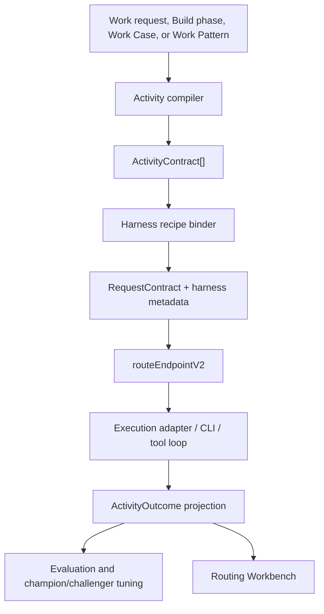

# Activity-Level AI Routing Harness Design

| Field | Value |
| --- | --- |
| Status | Draft design |
| Date | 2026-06-28 |
| Backlog item | BI-BC0A0EB2 |
| Plan | [2026-06-28-activity-level-ai-routing-harness.md](../plans/2026-06-28-activity-level-ai-routing-harness.md) |
| Owner surface | Platform routing / AI Operations |

## 1. Executive Summary

The GLM/task-routing transcript reframes DPF's model strategy. The leverage is not a cheaper global default model. The leverage is an owned activity harness that can break larger work into smaller activities, select the right model plus execution harness for each activity, and continuously tune those choices from outcome evidence.

DPF should add an activity layer above the existing routing spine:

1. `ActivityContract` describes the unit of work, risk, distribution shape, context policy, token envelope, and success shape.
2. `HarnessRecipe` describes the provider/model-family execution system: prompt strategy, memory/context packing, tool policy, response policy, adapter family, and evaluator.
3. `ActivityOutcome` projects the result of one activity from `TaskRun`, `RouteDecisionLog`, `AdapterRunTelemetry`, route outcomes, review/evaluator results, and human corrections.
4. A Routing Workbench makes the activity plan, model choice, exclusions, cost, quality signal, and tuning state inspectable.

This is not a replacement for `routeEndpointV2`. The existing router remains the endpoint selector. The activity layer compiles work into richer `RequestContract` inputs and harness metadata before the router ranks endpoints.

## 2. Transcript Distillation

Salient message:

- GLM-5.2-style models are strong on center-of-distribution work: routine synthesis, extraction, first-pass copy, familiar UI/code patterns, and outputs a human can inspect quickly.
- Frontier models still matter for edge-of-distribution work: ambiguous architecture, novel debugging, security-sensitive judgment, high-risk autonomy, and work where a wrong answer is costly or hard to detect.
- Companies struggle to switch because a model call is not the work system. The harness includes prompts, tool-call protocol, memory, context retrieval, token policy, review loops, and team ergonomics.
- Provider-owned team harnesses are sticky because they absorb company context. If DPF does not own the routing/context/harness layer, customers risk renting their own company brain back from model providers.
- The strategic opportunity is activity-level routing: recognize the activity shape, run the cheapest adequate model/harness for safe center work, escalate edge work, and keep evaluating because the model landscape changes.

DPF already has pieces of this. The gap is the activity/harness contract between large work and model selection.

## 3. Existing Substrate

Use these existing integration points:

| Area | Existing files | Design implication |
| --- | --- | --- |
| Request contract | `apps/web/lib/routing/request-contract.ts` | `ActivityContract` compiles into `routeContext` and `RequestContract`, especially `reasoningDepth`, `budgetClass`, `residencyPolicy`, `minimumTier`, and `minimumDimensions`. |
| Endpoint selector | `apps/web/lib/routing/pipeline-v2.ts` | Keep `routeEndpointV2` as the only model selector. Do not introduce a second endpoint ranking engine. |
| Execution recipe | `apps/web/lib/routing/recipe-types.ts`, `apps/web/lib/routing/execution-plan.ts` | `HarnessRecipe` should extend execution planning without overloading provider adapter selection. |
| Build phase preview | `apps/web/lib/inference/phase-model-resolution.ts` | Phase routing already does deterministic dry-run prediction. Refactor its phase contract hints into a shared compiler. |
| Routing visibility | `apps/web/lib/ai-operations-map/types.ts`, `apps/web/lib/ai-operations-map/project-routing-topology.ts`, `apps/web/components/platform/AiOperationsMap.tsx` | Extend the Operations Map with activity-routing projection DTOs rather than building another disconnected visualizer. |
| Work patterns | `apps/web/lib/tak/work-pattern-read-model.ts`, `apps/web/lib/tak/work-pattern-types.ts` | Work patterns can seed repeatable activity plans and later accumulate activity outcomes. |
| Provider/model scoring | `docs/superpowers/specs/2026-06-19-provider-model-scoring-convergence-design.md` | Activity performance updates model profiles and recipe performance; provider scores stay derived. |
| GLM provider | `docs/superpowers/specs/2026-06-28-zai-glm-provider-design.md`, `packages/db/data/providers-registry.json`, `apps/web/lib/routing/known-provider-models.ts` | GLM lands as model capability and provider/account-readiness state. Activity confidence stays provisional until evaluated per activity. |

### 3.1 Parallel Work Impact

Current coordination state checked 2026-06-28 after rebasing this branch onto `origin/main`:

| Parallel work | Current state | Activity-routing contract |
| --- | --- | --- |
| Z.ai / GLM-5.2 provider | The provider spec, registry entries, known model profiles, OpenCode dispatch support, and Z.ai adapter registration are now on `origin/main`. Live GLM verification remains account-gated by the missing operator Z.ai API key / GLM Coding entitlement. | Treat GLM-5.2 as an installed provider capability but keep every GLM harness recipe `provisional` until DPF collects activity-level outcomes. Do not promote GLM globally from catalog metadata. |
| Governed playbook Work Case resolution rail | The Work Case resolution/staging line is now on `origin/main`: `work-pattern-case-staging`, `work-pattern-case-resolution`, portal case drilldown, and receipt-backed approve/defer/reject semantics are available as source contracts. | Treat work-pattern and Work Case steps as first-class activity-plan sources. The rail should consume activity outcomes in product language, not raw provider logs. |

These are not side quests. They are the first two proof lines for the transcript thesis:

- GLM proves whether a cheap/open model can win center-of-distribution activity classes once the harness and evidence exist.
- Governed playbooks prove whether repeatable company work can carry its own portable context, receipts, route decisions, and improvement loop without renting that context from one provider's team harness.

## 4. Architectural Decision

Add an `activity-router` module that acts as a compiler, not a competing router.



Key rule: activity classification determines the demand side; the router still decides which endpoint satisfies the demand side at the best expected cost-per-success.

### 4.1 Activity Package Boundary

The new technical unit is an **Activity Package**: the smallest inspectable and evaluable work unit DPF can route, run, and tune. It is not a Prisma table in Phase 1. It is a typed envelope assembled at runtime and audited through existing route and task evidence.

An Activity Package contains:

1. `ActivityContract`: what the activity needs.
2. `HarnessRecipe`: how a provider/model family should execute it.
3. `RequestContract`: the demand-side router input compiled from the activity.
4. `ActivityOutcome`: what happened, including cost, quality, retry/escalation, and review signal.
5. `WorkbenchProjection`: the operator-readable explanation of the route, harness, alternatives, and tuning state.

This boundary matters because DPF has iterated the router many times. The mistake to avoid is another endpoint-ranking rewrite. The refined approach is:

- First decompose and normalize work into activity packages.
- Then let `routeEndpointV2()` rank eligible endpoints.
- Then evaluate the result at activity-package granularity.
- Then govern confidence changes through existing approval/action proposal rails.

The platform can later persist Activity Packages if query pressure requires it, but the design starts source-compatible with existing `TaskRun`, `RouteDecisionLog`, `AdapterRunTelemetry`, `AgentActionProposal`, and Operations Map projections.

Implementation note: `apps/web/lib/routing/activity-package.ts` is the first typed Activity Package boundary. It exposes source-local pilot builders for GLM/Z.ai center-distribution evaluation and governed Work Case routing so both proof lines reuse the same activity + harness + route-context shape. The GLM pilot carries provider readiness as `credential-gated` while Z.ai credentials / entitlement are missing; the Work Case pilot carries transition and receipt policy from work-pattern metadata. `projectActivityPackagesRouting()` in `apps/web/lib/ai-operations-map/project-activity-routing.ts` projects those packages into the existing Operations Map Activity Workbench DTO, so pilots use the same visual grammar as Build Studio phase routing. `loadOperationsMapData()` now creates live pilot packages from installed `zai`/`zai-coding` provider rows and parsed `TaskRun.a2aMetadata.workPattern` Work Case metadata, then merges those rows with Build Studio phase activity routing when both are present.

## 5. Core Types

### 5.1 ActivityContract

`ActivityContract` is the platform-owned shape of one activity.

```ts
export type ActivityClass =
  | "classify"
  | "summarize"
  | "extract"
  | "synthesize"
  | "critique"
  | "plan"
  | "code-edit"
  | "tool-act"
  | "verify"
  | "handoff";

export type ActivityContract = {
  activityId: string;
  parentRef: {
    taskRunId?: string;
    taskNodeId?: string;
    workCaseId?: string;
    buildId?: string;
    patternKey?: string;
  };
  activityClass: ActivityClass;
  title: string;
  distributionShape: "center" | "mixed" | "edge";
  riskClass: "low" | "medium" | "high" | "critical";
  successShape: "text" | "json" | "patch" | "decision" | "tool-result" | "evidence";
  contextPolicy: "minimal" | "retrieval" | "full-thread" | "work-case-packet";
  tokenEnvelope: {
    maxInputTokens: number;
    maxOutputTokens: number;
    compression: "none" | "summarize" | "cite-sources" | "strict-packet";
  };
  evaluationPolicy: {
    evaluator: "schema" | "tool-success" | "review" | "golden" | "human-acceptance";
    minimumSignal: "valid-output" | "accepted" | "review-passed" | "no-regression";
  };
  requestContractHints: {
    taskType?: string;
    budgetClass?: "minimize_cost" | "balanced" | "quality_first";
    reasoningDepth?: "minimal" | "low" | "medium" | "high";
    minimumTier?: string;
    minimumDimensions?: Record<string, number>;
    residencyPolicy?: "local_only" | "approved_cloud" | "any_enabled";
    requiresCodeExecution?: boolean;
    requiresWebSearch?: boolean;
    requiresComputerUse?: boolean;
  };
};
```

### 5.2 HarnessRecipe

`HarnessRecipe` is not just provider settings. It is the model-family-specific work system.

```ts
export type HarnessRecipe = {
  recipeKey: string;
  activityClass: ActivityClass;
  distributionShape: ActivityContract["distributionShape"];
  providerFamily?: string;
  modelFamily?: string;
  executionAdapterHint?: string;
  promptStrategy: string;
  contextAssembler: string;
  memoryPolicy: "none" | "thread-summary" | "work-case-packet" | "retrieval-packet";
  toolPolicy: RoutedExecutionPlan["toolPolicy"];
  responsePolicy: RoutedExecutionPlan["responsePolicy"];
  tokenPolicy: {
    inputPacking: "minimal" | "ranked-evidence" | "full-context" | "compressed";
    outputBudget: "tight" | "standard" | "expansive";
  };
  evaluator: ActivityContract["evaluationPolicy"]["evaluator"];
  activityConfidence: "provisional" | "calibrating" | "trusted" | "degraded";
};
```

Storage strategy:

- Phase 1: keep recipe definitions as typed code/fixtures and attach selected recipe metadata to the route/execution envelope as JSON.
- The first persistence slice stores selected harness evidence on the selected `RouteDecisionLog.candidateTrace` item via `ActivityHarnessAudit`, because the decision trace is already the durable route audit envelope.
- Phase 2: if recipe management needs operator controls or high-cardinality performance queries, promote recipes to a table after schema audit.
- Never store provider-level capability truth here. Capability truth belongs to model profiles; recipe performance is about model plus harness plus activity.

Implementation note: the first harness slice adds `apps/web/lib/routing/harness-recipe.ts`, with `bindHarnessRecipeForActivity()` returning typed recipes from activity shape plus optional provider/model hints. GLM/Z.ai recipes are intentionally `provisional` until outcome samples exist. `RoutedExecutionPlan.harness` now carries the selected harness metadata when `routeEndpointV2()` receives an `ActivityContract`, `persistRouteDecision()` serializes it into the selected candidate trace, and the Operations Map Workbench/topology markers surface the harness key and confidence for operators.

### 5.3 ActivityOutcome

Start with a derived read model.

```ts
export type ActivityOutcome = {
  activityId: string;
  parentRef: ActivityContract["parentRef"];
  activityClass: ActivityClass;
  harnessRecipeKey: string;
  providerId: string | null;
  modelId: string | null;
  routeDecisionId: string | null;
  adapterTelemetryId: string | null;
  tokens: {
    input: number | null;
    output: number | null;
    total: number | null;
  };
  costUsd: number | null;
  latencyMs: number | null;
  successSignal: "unknown" | "valid" | "accepted" | "review-passed" | "failed" | "retried";
  qualitySignal: number | null;
  tuningImpact: "none" | "sampled" | "challenger-promoted" | "recipe-degraded";
};
```

Persist only after the read model proves query pressure or retention needs that cannot be served by joins over existing telemetry.

Implementation note: `apps/web/lib/ai-operations-map/project-activity-outcomes.ts` now derives activity outcomes from persisted route decisions with harness evidence, token usage, route outcomes, and generic evaluation signals. It marks evidence as `route-only` when only the route/harness audit is available and `linked` when token, outcome, review, evaluator, or human-acceptance evidence joins within the conservative provider/model/task/agent/time window. The Operations Map activity workbench consumes these outcomes to fill route decision id, token total, cost, quality score, evaluator source, and success signal.

Calibration note: `apps/web/lib/routing/activity-harness-calibration.ts` is the first continuous-tuning primitive. It groups outcome samples by `(activityClass, harnessRecipeKey, providerId, modelId)`, keeps low-sample combinations in observation, recommends trust graduation only after enough linked high-success samples, requires average evaluator quality to clear a trust floor when quality evidence exists, and recommends degradation when failure/retry rates spike. It is intentionally pure and advisory; promotion/demotion writes require the later governed champion/challenger integration.

Governance note: `apps/web/lib/routing/activity-harness-governance.ts` turns `promote` / `degrade` calibration recommendations into approval-required action proposals with deterministic ids and evidence summaries. Approved proposal decisions reduce into scoped confidence overrides for `(activityClass, harnessRecipeKey, providerId, modelId)`, which the Operations Map can apply and display. `routeEndpointV2()` can also consume those approved overrides when a live caller supplies them, so the execution plan's harness confidence can reflect governed tuning without adding a second router. Durable approval storage reuses existing `AgentActionProposal` rows with `actionType="activity_harness_confidence_override"`; `activity-harness-approval-source.ts` parses approved/executed rows into confidence overrides, `loadOperationsMapData()` feeds those overrides into the Activity Workbench, and live `routeAndCall()` loads the same source whenever an `ActivityContract` is present. `previewRoute()` intentionally does not query approved overrides, preserving deterministic model-selection previews. Operators can now queue the governed proposal from the Activity Workbench through `proposeActivityHarnessOverrideAction()`, which writes the existing `AgentThread` / `AgentMessage` / `AgentActionProposal` envelope instead of introducing a new approval table. `action-proposal-presentation.ts` projects the same proposal into routing-specific labels for attention, Agent Cards, and the governance approvals API, and `executeTool("activity_harness_confidence_override")` acknowledges approved proposals so coworker-thread approval paths do not mark routing-tuning decisions as failed.

## 6. Activity Compiler Rules

The first compiler must be deterministic for known platform work.

Implementation note: the first source-local slice introduces pure routing modules at `apps/web/lib/routing/activity-contract.ts` and `apps/web/lib/routing/activity-compiler.ts`. They compile Build Studio phases and compound transcript/review/refinement requests into `ActivityContract` objects and derive route-context hints without calling providers, Prisma, or `routeEndpointV2`.

| Source | Compiler behavior |
| --- | --- |
| Build Studio phase | Compile each phase into one or more activities. Ideate and plan are `synthesize`/`plan`; reviews are `critique`; build is `code-edit`; verification is `verify`. |
| Work pattern | Use `TaskRun.a2aMetadata.workPattern` and `repeatedPatternKey` to replay the observed activity plan. |
| Work Case | Compile case steps into governed activities, preserving receipt policy and risk class. |
| Coworker chat | Use deterministic shortcuts for obvious asks; use an LLM decomposer only for ambiguous compound work. |
| Provider evaluation | Compile eval packs into activity contracts so GLM and future providers are measured per activity class. |

Default distribution/risk posture:

| Activity shape | Default route posture |
| --- | --- |
| Center + low risk + inspectable output | `budgetClass: minimize_cost`, `reasoningDepth: low`, adequate/strong tier floor. |
| Mixed + medium risk | `budgetClass: balanced`, `reasoningDepth: medium`, strong tier floor. |
| Edge + high/critical risk | `budgetClass: quality_first`, `reasoningDepth: high`, frontier tier floor and stricter review/evaluator. |
| Local/private context | `residencyPolicy: local_only` or `approved_cloud` according to policy. |
| Structured extraction | `requiresStrictSchema: true`, strict response policy. |
| Tool action | `requiresTools: true`, tool-fidelity floors where available. |

## 7. GLM-5.2 Integration Policy

GLM should be eligible by activity, not globally pinned.

Initial GLM posture:

- `activityConfidence: provisional`.
- Prefer GLM challengers for center-distribution `summarize`, `extract`, `synthesize`, routine `code-edit`, UI copy, and documentation synthesis.
- Keep frontier models favored for edge architecture, security-sensitive review, production incident debugging, hard refactors, and governed authority decisions.
- Require activity outcome samples before GLM can become a trusted champion for production activities.

The Z.ai provider work should land provider/model metadata and OpenCode dispatch capability. This design consumes that work by adding GLM-specific harness recipes and eval packs after the provider is testable.

## 8. Routing Workbench UX

The current map is too provider-topology oriented for activity routing. The Routing Workbench should extend AI Operations Map with a task/activity lens.

### 8.1 Information Architecture

Default view:

1. Activity strip: the decomposed steps for the selected task, work case, build, or pattern.
2. Selected activity panel: human-readable activity class, risk, distribution shape, and outcome.
3. Model decision summary: selected provider/model, why it won, what was excluded.
4. Harness summary: context policy, tool policy, response policy, token envelope.
5. Outcome evidence: cost, tokens, latency, success signal, evaluator/review result.
6. Tuning state: provisional/calibrating/trusted/degraded, active challenger if any.

Progressive disclosure:

- Default copy uses product language: "Routine extraction", "High-risk review", "Used cheap model because output is easy to inspect."
- Operator drawer exposes raw route ids, route decision id, adapter telemetry id, recipe key, and model profile dimensions.
- Failure state explains whether the issue is provider setup, model eligibility, harness degradation, context too large, or evaluator failure.

### 8.2 UI Principles

- Dense operational layout; no marketing hero.
- Tabs or segmented control for `Task`, `Model`, `Evidence`, `Tuning`.
- Use icons for route state, locality, warning, retry, and tuning confidence.
- Use existing theme tokens; no hard-coded colors.
- Preserve the map as topology and add activity inspection as a side panel/drawer, not nested cards.
- Mobile view collapses to an activity list plus a single decision drawer.

### 8.3 Visibility Acceptance Model

The visual routing tool is useful only if an operator can answer five questions without reading logs:

1. **What work did DPF split this into?** Show the activity plan as a sequence, including parallel branches when the parent task has independent follow-ups.
2. **Why is this step center, mixed, or edge?** Show the distribution and risk reason in human language.
3. **Why this model and harness?** Show selected provider/model, harness recipe, token/context policy, and excluded alternatives.
4. **What happened?** Show tokens, cost, latency, route decision id, telemetry id, success/evaluator signal, and retry/escalation state.
5. **What will change next time?** Show confidence state, active challenger, proposed promotion/degradation, and approval state.

The topology map remains useful for provider health and traffic. The Workbench is the task/activity debugger. The default surface should be a dense activity rail plus one selected decision drawer; raw ids live in the drawer, not in the primary labels.

Empty state is part of the contract: when no activity evidence exists yet, the Workbench must still render and say that ActivityContract-backed route decisions with harness evidence will appear after routed activity requests execute. A missing Workbench reads as a broken feature.

### 8.4 Projection Types

Add DTOs under `apps/web/lib/ai-operations-map/types.ts` rather than coupling the component to Prisma rows:

Implementation note: the first visibility slice adds `OperationsMapActivityRouting`, `OperationsMapActivityStep`, and a pure `projectBuildStudioActivityRouting()` projector in `apps/web/lib/ai-operations-map/project-activity-routing.ts`. `loadOperationsMapData()` now projects Build Studio phase model selection into `routingTopology.activityRouting`, and `AiOperationsMap` renders a compact activity routing workbench above the existing provider/A2A panels. The workbench includes a dense activity flow rail before the detail cards so the decomposed model path, confidence, risk, provider/model choice, and harness are visible at scan speed. Selecting a rail node drives a single decision drawer that concentrates route rationale, outcome evidence, telemetry ids, tuning state, and excluded alternatives for the active activity. The workbench is isolated in `components/platform/ActivityRoutingWorkbench.tsx`, keeping the activity-level approval/action UI separate from the provider/A2A topology map.

```ts
export type OperationsMapActivityRouting = {
  taskRef: ActivityContract["parentRef"];
  activities: OperationsMapActivityStep[];
  generatedAt: string;
};

export type OperationsMapActivityStep = {
  activityId: string;
  label: string;
  activityClass: ActivityClass;
  distributionShape: ActivityContract["distributionShape"];
  riskClass: ActivityContract["riskClass"];
  selectedProviderId: string | null;
  selectedModelId: string | null;
  harnessRecipeKey: string | null;
  confidence: HarnessRecipe["activityConfidence"] | null;
  successSignal: ActivityOutcome["successSignal"];
  costUsd: number | null;
  tokenTotal: number | null;
  routeDecisionId: string | null;
  adapterTelemetryId: string | null;
  exclusions: Array<{ providerId: string; modelId: string | null; reason: string }>;
};
```

## 9. Continuous Evaluation

Evaluation should run at `(activityClass, harnessRecipeKey, providerId, modelId)` granularity.

Signals:

- Schema validity.
- Tool-call success and retry count.
- Human acceptance or correction.
- Reviewer/evaluator verdict.
- Build/test pass for code activities.
- Cost, latency, input compression ratio, output token ratio.
- Escalation frequency from cheap/open model to frontier model.

Promotion rules:

- `provisional` -> `calibrating`: enough successful dry-run or shadow samples.
- `calibrating` -> `trusted`: enough real outcome samples with bounded failure rate and no critical incidents.
- Any state -> `degraded`: evaluator failure spike, retry spike, provider regression, entitlement issue, or operator disable.
- Challenger can win automatic traffic only inside its activity/risk envelope.

This mirrors NIST AI RMF's govern/map/measure/manage loop: governance policy sets allowed use, activity contracts map work, outcomes measure, and recipe promotion/demotion manages the system.

## 10. Research, Benchmarking, and Standards

### 10.1 Standards

- A2A task lifecycle treats tasks as stateful units with statuses, artifacts, refinements, and parallel follow-ups. DPF activity contracts should align to task/run identities rather than anonymous model calls: <https://a2a-protocol.org/latest/topics/life-of-a-task/>
- OpenTelemetry GenAI semantic conventions cover GenAI spans, metrics, events, MCP, and provider-specific telemetry. Activity outcomes should use compatible naming where possible so DPF telemetry is not bespoke: <https://github.com/open-telemetry/semantic-conventions/tree/main/docs/gen-ai>
- NIST AI RMF Core frames trustworthy AI work as Govern, Map, Measure, Manage. This design maps routing policy to Govern, activity classification to Map, evaluator telemetry to Measure, and recipe tuning to Manage: <https://airc.nist.gov/airmf-resources/airmf/5-sec-core/>

### 10.2 Benchmarking

| Reference | Pattern to adopt | Pattern to reject |
| --- | --- | --- |
| Z.ai GLM-5.2 + OpenCode docs | Provider-specific coding harnesses matter; GLM should enter DPF through provider setup, OpenAI-compatible adapters, and OpenCode target configuration. | Treating a cheap model as a global drop-in replacement before account entitlement, tool behavior, and activity outcomes are tested. |
| A2A task lifecycle | Model work as stateful tasks, refinements, artifacts, and parallel follow-ups. | Anonymous one-shot model calls with no artifact/task identity. |
| OpenTelemetry GenAI | Use standard-ish telemetry concepts for model request/response, token, provider, and tool/MCP evidence. | A bespoke route trace that cannot map to external observability patterns. |
| NIST AI RMF | Make routing governance explicit: govern allowed use, map activity/risk, measure outcomes, manage promotion/degradation. | Let model choice drift through hidden heuristics with no reviewable policy loop. |
| Provider-owned team harnesses described in the transcript | Make DPF's own workbench and context packet ergonomic enough that company context stays portable. | Let one model provider become the default memory/harness because it is more convenient than DPF's native workflow. |

## 11. Migration and Refactoring Strategy

No DB migration in the first slice.

Refactoring budget is mandatory in each implementation phase:

1. Activity compiler: extract Build Studio phase route hints from `phase-model-resolution.ts` into a shared compiler.
2. Harness binding: separate provider adapter selection from prompt/context/tool harness policy in execution planning.
3. Outcome projection: consolidate route-decision and adapter-telemetry joins used by route logs, Operations Map, and diagnostics.
4. Workbench UI: split the large `AiOperationsMap.tsx` route topology rendering into projection helpers and smaller view components before adding the activity drawer.
5. Evaluation loop: converge recipe performance, route outcome, and model-profile scoring paths so activity tuning has one evidence source.

## 12. Rollback

Each phase is additive and can be disabled independently:

- Activity compiler off: callers continue sending direct `RequestContract` / `routeAndCall` options.
- Harness recipes off: execution plan falls back to existing `ModelRecipe` or default plan behavior.
- Outcome projection off: Operations Map keeps current routing topology only.
- Workbench UI off: hide the activity lens and keep existing map.
- Evaluation off: recipe confidence remains static and no promotion/demotion writes occur.

Do not remove existing route logs, recipe performance, or model-profile scoring during this work.

## 13. Verification

Source-local tests:

- `pnpm --filter web exec vitest run apps/web/lib/routing/activity-contract.test.ts`
- `pnpm --filter web exec vitest run apps/web/lib/routing/activity-compiler.test.ts`
- `pnpm --filter web exec vitest run apps/web/lib/inference/phase-model-resolution.test.ts`
- `pnpm --filter web exec vitest run apps/web/lib/ai-operations-map`
- `pnpm --filter web exec vitest run apps/web/components/platform/AiOperationsMap.test.tsx`

Runtime-bound gates:

- Production build through canonical local install or shared local-CI convergence sandbox.
- Browser verification of `/platform/ai/operations-map` and `/platform/ai/runtime-health`.
- At least one activity trace showing selected model, excluded alternatives, token/cost outcome, and tuning state.
- After Z.ai provider lands and account access exists, one GLM center-distribution activity in challenger mode and one frontier-escalated edge activity.

## 14. Open Questions

1. Should activity plans be persisted on `TaskRun.progressPayload`/`a2aMetadata` first, or is a small `TaskActivity` table justified once Work Case activation needs queryable per-step state?
2. Should `HarnessRecipe` graduate from code/JSON fixture to DB table at the same time as operator controls, or only after performance queries require it?
3. Which pilot should ship first: Build Studio phases, governed playbook execution, or transcript/doc synthesis?
4. What minimum sample count should move a recipe from `provisional` to `calibrating` for low-risk work?
5. Should the Workbench be a new tab inside AI Operations Map or a linked detail page from map/task/work-case surfaces?
