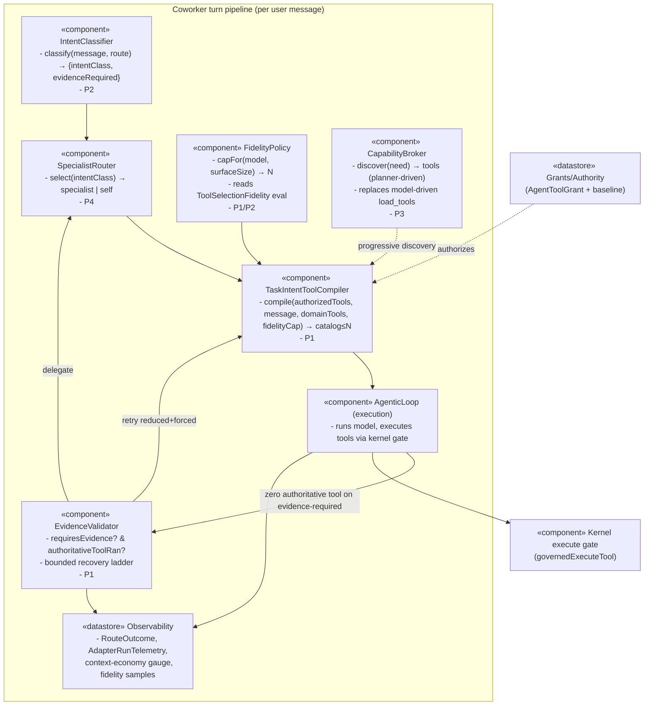
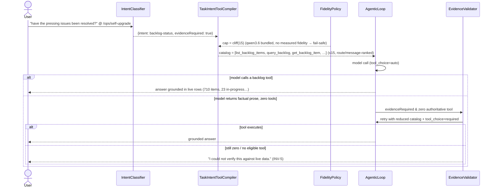

# Coworker Capability Routing & Evidence Integrity — Design

**Status:** Active — architecture review folded; phased delivery in progress
**Epic:** EP-E431FC8A
**Lead BI (Phase 1):** BI-B5C358B1
**Kernel decision:** `principle_decide` DI-2A6C75048353 → **D (hybrid-hierarchical)**, composite 10.59, margin 2.15, high confidence, no commandment conflict.
**Date:** 2026-07-17
**Author:** Claude Code (platform operator)
**Surface:** `apps/web` coworker chat + agentic loop + routing; `apps/web/lib/actions/coworker-tool-budget.ts`; `apps/web/lib/tak/*`.
**Related substrate (extend, do not duplicate):**
- `docs/architecture/context-engineering-standards.md` (the 15-tool cliff, P1–P13)
- `docs/superpowers/specs/2026-06-20-context-engineering-tool-efficiency-design.md` (rationale of record, EP-27FD96BC — **done**)
- `docs/specs/routing-resilience-and-failure-observability-spec.md` (RouteOutcome / AdapterRunTelemetry / circuit-breaker discipline)
- EP-B9DD37C7 (Coworker chat: runtime truthfulness) — the truthfulness lineage this extends

> **Substrate note.** All code references below are verified against `origin/main`. The working branch `feat/decision-gov-adjust-surfaces` is 609 commits behind `origin/main` and is **missing** the accuracy-cliff mechanism entirely; the live install runs `origin/main`. Implementation must happen in a fresh worktree cut from `origin/main`.

---

## 1. Evidence-grounded incident diagnosis

### 1.1 Observed facts (verified 2026-07-17)

| # | Observed fact | Source of truth |
|---|---|---|
| F1 | Agent `ops-coordinator` (displayed "Scrum Master"), route `/ops/self-upgrade`, thread `cmr1xnlzs018901lv753sifqw`, user asked "have the pressing issues been resolved?" | Incident report |
| F2 | Selected model = local `docker.io/ai/qwen3.6:latest`, served context **131072** tokens | `resolve_model_selection` dry-run (this session): plan/design/plan-review phases route to local qwen3.6, `contextTokens: 131072`, "1 endpoint(s) excluded" |
| F3 | ChatGPT subscription endpoint excluded because its profile declares `toolUse: false` | `seed.ts` `seedChatGPTModels()` sets `gpt-5.4` `supportsToolUse:false`; `pipeline-v2.ts:103` hard-filters `contract.requiresTools && !supportsToolUse` |
| F4 | 49 tools attached (cap 48 + `load_tools`) | `coworker-tool-budget.ts` `MAX_COWORKER_ATTACHED_TOOLS=48`; `agent-coworker.ts:1264` prepends `load_tools` when anything was deferred |
| F5 | Model produced **zero** tool calls and a 1,257-char factual answer | Incident report; loop's zero-tool branch `agentic-loop.ts:1582–2075` |
| F6 | Answer claimed 59/60 items done/deferred, 1 in-progress | Incident report |
| F7 | Live DB truth = **710** items: done 342, deferred 194, open 142, in-progress 23, triaging 5, blocked 4 | `psql` count against `dpf-postgres-1` (this session, read-only) |
| F8 | ops-coordinator grants = `[backlog_read, backlog_write, backlog_triage, registry_read, portfolio_read]` (+ read baseline); `delegates_to: []` | `workforce-seed.ts:248`; `agent_registry.json` |

The answer in F6 is fabricated: it is not a rounding of F7, it is unrelated to live state. This is the failure to prevent.

### 1.2 Root-cause chain (three independent, compounding defects)

**RC1 — The cliff cap keys on context *capacity*, not tool-selection *fidelity*.**
`deriveCoworkerToolCap(servedContextTokens)` (`coworker-tool-budget.ts`, origin/main) applies the ~15-tool selection-cliff ceiling **only** when `servedContextTokens <= ACCURACY_CLIFF_PRONE_MAX_CONTEXT (32_768)`. qwen3.6 serves 131072 > 32768 → ceiling = 48. The documented cliff (`context-engineering-standards.md` line 15: "Tool-selection accuracy collapses past ~15 tools on small local models") is a *count/selection-quality* constraint, but the code treats a large context window as evidence the model can select from 48 tools. The Phase-1 mitigation PR #2945 (`51b1a38cb`, "cap 32k local tool surface") only extended the cap to the exact-32768 case; the recurring capability-need BI-CAP-CBDB9A24 was then closed "no additional code required" on 2026-07-16 — one day before this incident disproved it.

**RC2 — Tool attachment has a relevance *recall* gap; the relevant tools were deferred.**
*(Corrected in architecture review — the earlier reading came from the stale working branch.)* On `origin/main` `selectCoworkerToolBudget` **does** rank by relevance: it takes an `intentQuery`, scores tools within tier via `scoreToolIntentRelevance`/`tokenizeIntent`, and the caller passes `intentQuery: trimmedContent` (`agent-coworker.ts:~1332`, EP-27FD96BC/BI-ACE1EBA4). The defect is that this signal is **shallow lexical token-overlap**: the tokens of "have the **pressing issues** been **resolved**?" (`pressing`, `issues`, `resolved`) do not appear in the backlog tools' names/descriptions (`list_backlog_items`, `query_backlog`), so those tools score **0** and lose the stable-index tiebreak → deferred, despite a backlog question. ops-coordinator's 5 grants + `COWORKER_READ_BASELINE_GRANTS` expand to ~106 authorized tools; tier-1 alone is 68 > cap 48, so with a 0-score the backlog tools fall out of the cap. Compounding it: the route `/ops/self-upgrade` resolves (longest-prefix) to `/ops`, whose `domainTools:[query_backlog, …]` is injected as **prompt prose only** (`agent-coworker.ts:~778`) and **never wired into attachment** — the model is *told about* `query_backlog` but its schema isn't attached. ops-coordinator also holds no `thread_write`, so it **cannot delegate** to a backlog specialist — its only lever is `load_tools`, which grows its *own* surface. So the fix is not "add a relevance rank" (it exists) but **close the recall gap** (route-anchored boosting, capability-tag/synonym matching) and **force route `domainTools` into tier-0**.

**RC3 — No evidence-integrity gate; unsupported factual prose is accepted.**
`agentic-loop.ts` has **no classifier** for "this question needs authoritative tool evidence." `tool_choice` is only ever `"auto"` (`"required"` is a defined-but-never-assigned type). The zero-tool guards — `detectFabrication` and `shouldNudge` — key only on **completion-claim verbs** (`COMPLETION_CLAIM_PATTERN`: built/deployed/saved/…). A ≥100-char factual answer with none of those verbs is classified `isSubstantiveReply` and returned verbatim (`agentic-loop.ts:2062–2074`). The only caveat the loop can inject is the *unsaved-workspace* note, gated on a hard persistence claim, which would not fire here. **There is no forced-tool recovery and no evidence validation.**

### 1.3 Hypotheses (explicitly not asserted as fact)

- **H1** — The "unverified" caveat the incident describes is *model-authored prose*, not a loop guard (the loop has no fact-verification caveat). *Confidence: high* (the only loop caveat generator requires a persistence-claim pattern the answer lacks). Worth confirming against the stored assistant message.
- **H2** — qwen3.6's family prior (`toolFidelity: 80`, "F1 0.93+") was measured at small tool counts; it does not predict fidelity at a 49-tool surface. *Confidence: high but unmeasured* — the eval harness (§6) exists to replace this prior with per-surface-size measurement.

---

## 2. Map of existing mechanisms and why they failed together

| Mechanism | File (origin/main) | Intended job | Why it did not save the turn |
|---|---|---|---|
| Authority vs Attachment split | `coworker-tool-budget.ts:1–18` | Keep full authority, send fewer schemas | Worked — but attachment sizing/ordering are wrong (RC1/RC2) |
| `deriveCoworkerToolCap` | `coworker-tool-budget.ts` | Cap surface below cliff | Cliff cap gated on `<=32k`; 131072 bypasses → 48 (RC1) |
| `selectCoworkerToolBudget` (+`intentQuery` ranker) | `coworker-tool-budget.ts`, `agent-coworker.ts:~1332` | Rank tools by message relevance within tier | Ranker exists but uses shallow lexical overlap → low recall; backlog tools score 0 and are deferred (RC2) |
| Route `domainTools` | `route-context-map.ts:545`, `agent-coworker.ts:~778` | Name the route's relevant tools | Prose-only; never wired to attachment (RC2) |
| `LOCAL_TOOL_SELECTION_CLIFF=15` | `context-economy-metrics.ts:26` | The cliff constant | Used for observability zoning + the ≤32k cap only; not a fidelity policy (RC1) |
| `LOCAL_FALLBACK_MAX_TOOLS=15` | `fallback.ts:217` | Skip cloud→local fallback above 15 tools | A *separate* 15 gate; inconsistent with the 48 attach cap |
| `load_tools` meta-tool | `coworker-tool-budget.ts:76`, `agentic-loop.ts:2118` | On-demand deferred-tool loading | Model-driven; never called (model made zero tool calls) |
| Delegation tools | `mcp-tools.ts:4283–4362` | Hand off to a specialist | Gated on `thread_write`; ops-coordinator lacks it (RC2) |
| `detectFabrication` / `shouldNudge` | `agentic-loop.ts:375, 620` | Catch fabricated completion + nudge | Key on completion verbs only; factual answer passes (RC3) |
| Model capability floor | `pipeline-v2.ts:103`, `agent-capability-types.ts` | Route only to tool-capable models | Worked — but only checks a boolean `toolUse`, not fidelity-at-surface-size (RC1) |
| Observability gauge | `context-economy-metrics.ts` (`surfaceZone=overload`) | Signal the cliff | Signals but does not *act* — no closed loop to the cap or the answer |

**The systemic failure:** every mechanism defends one axis (authority, context-fit, fallback, completion-fabrication) and none defends the axis that broke — *a large-context but low-fidelity local model, asked a live-data question, handed a message-irrelevant oversized surface, with no gate that requires evidence before a factual answer.* The pieces exist; they are not composed into a policy.

---

## 3. Architecture options and kernel-backed recommendation

Four architecturally distinct options were scored by the kernel (`principle_decide` DI-2A6C75048353). All four additionally carry the non-negotiable evidence-integrity invariant (§4) — it is a guard, not a differentiator.

| Option | Essence | Composite | Notes |
|---|---|---|---|
| **A — Task-intent tool compiler** | Single-agent; message-aware, fidelity-bounded per-turn catalog | 8.27 | Lowest migration; doesn't scale to thousands of tools alone |
| **B — Capability broker / tool-search** | Two-stage: select capabilities over descriptors, then expose only chosen tools | 8.44 | Scales; adds a selection round-trip + new component |
| **C — Specialist delegation / MoE** | Route intent to a narrow-surface specialist coworker | 7.90 | Best long-run org-fit; delegation overhead + handoff |
| **D — Hybrid hierarchical (phased)** | Intent → specialist (C) else compiled catalog (A), broker (B) as progressive discovery, evidence gate wrapping all | **10.59** ✅ | Highest capability/scalability; phased so each layer ships independently |

**Recommendation: D**, delivered in phases so the fail-safe ships first and each later layer is evaluation-gated. D wins decisively on the load-bearing commandments: *Never Fabricate* (0.59 vs A 0.28), *Every defect needs reproduction* (0.82), *Architecture Over Shortcuts* (0.60), *Least privilege* (0.66), *Never Assume — Verify* (0.69).

**Per-evaluation-axis comparison:**

| Axis | A | B | C | D |
|---|---|---|---|---|
| Correctness / evidence integrity | gate bolted on | gate bolted on | gate per specialist | **gate structural, wraps all** |
| Local-model reliability | good (fidelity cap) | good (small surface) | best (stable narrow set) | **best (compiled + narrow)** |
| Scalability (100s–1000s tools) | weak alone | strong | strong | **strong** |
| Latency | best (no extra call) | +1 selection call | +delegation hop | **tiered: fast path stays A** |
| Token/context cost | low | lowest surface | low per specialist | **low (compiled)** |
| Delegation overhead | none | none | high | **only when it pays** |
| Authorization / governance | reuses grants | reuses grants | needs delegation grants | **keeps 5 concerns separate** |
| Observability | per-turn gauge | +broker decisions | +delegation traces | **full pipeline traces** |
| Failure recovery | forced-tool retry | broker re-select | specialist re-route | **all three, ordered** |
| Compat (grants/load_tools/routing/MCP) | high | medium | medium | **high (composes)** |
| Migration complexity | low | medium | high | **phased (low→high)** |

---

## 4. Invariants and failure-state behavior

**INV-1 (Evidence integrity — non-negotiable).** For a turn whose answer depends on live operational state, **zero successful authoritative tool executions MUST NOT produce a factual operational answer.** The runtime must either obtain evidence via a bounded recovery path or explicitly state it could not verify.

**INV-2 (Fidelity, not capacity).** The attached-tool cap is a function of the running model's **measured tool-selection fidelity at the candidate surface size**, defaulting fail-safe (cliff-prone) for any bundled/low-confidence local profile lacking measured evidence — regardless of context-window size. **Non-regression clauses:** (a) cloud / non-local turns (`localServedContext = null`) are unaffected → 48; (b) a **seed allow-list of already-validated local profiles** keeps the window-fit ceiling so Phase 1 does not cap currently-working local setups down to 15 before the Phase-2 eval exists; (c) in Phase 1 the policy consumes the same `localServedContext` proxy the current cap uses, upgrading to true model-keyed fidelity lookup in Phase 2 once endpoint resolution is hoisted ahead of attachment (see INV-3 data-flow note).

**INV-3 (Authority ≠ attachment ≠ discoverability ≠ delegation ≠ execution).** These five remain distinct: a coworker keeps full grant authority; attachment is the per-turn schema payload; discoverability is what the model can find on demand; delegation is handoff to a specialist; execution is the governed kernel gate. No change may collapse two of them.
> **Data-flow note (INV-2/INV-3).** `FidelityPolicy.capFor(model, …)` is keyed on the *running* model, but today the cap is derived up front (`agent-coworker.ts:~1323`, `resolveLocalServedContextTokens()`) **before** the routing pipeline resolves the actual endpoint. Phase 1 therefore keeps the `localServedContext` proxy as input (no model-identity dependency); Phase 2 hoists primary-candidate resolution ahead of attachment (or threads the resolved endpoint identity into the compile step) so the policy becomes a true fidelity lookup rather than a context proxy. This is a sequencing constraint, not a concern-collapse.

**INV-3a (Discovery recompiles; it never appends past the resolved ceiling).** The initial attached count is the ceiling-bound surface for that run. Every compatibility `load_tools` call and direct deferred-tool promotion MUST recompile that same surface: newly requested, already-authorized tools become pinned attachments; the lowest-ranked unpinned attachments return to the deferred pool; and the next inference turn remains at or below the initial resolved ceiling. Grants, provider suitability, and the execution gate are unchanged. Diagnostics record the initial count, requested/loaded names, displaced names, unattached names with reason, final count, and ceiling. This closes live TaskRun `TR-SCHED-FEB9C7ED`, where three deferred tools were appended to 15 and produced an ineligible 18-tool local surface.

**INV-6 (Single source for tool-count policy).** `FidelityPolicy` is the **single source** from which the tool-count constants derive; `LOCAL_TOOL_SELECTION_CLIFF` (`context-economy-metrics.ts:26`), `LOCAL_FALLBACK_MAX_TOOLS` (`fallback.ts:218`), and `MAX_COWORKER_ATTACHED_TOOLS` must reference it, not restate it. No fourth copy of "15"/"48".

**INV-4 (Bounded recovery, no hidden escalation).** Zero-tool on an evidence-required turn triggers a *bounded* recovery ladder (fixed max attempts, budgeted latency); it must not loop, and must not silently fall back to a paid provider. Every recovery step is logged. **Explicit reconciliation with the fallback chain:** the reduced-catalog retry is ≤15 tools, which would re-enable `callWithFallbackChain`'s local path (`fallback.ts:218` skips local fallback *above* 15) and could escalate a failed forced call to a paid cloud endpoint — exactly what this invariant forbids. The recovery retry therefore **pins the same (local) endpoint and disables the fallback chain** (local-only recovery); a test asserts the recovery path performs zero paid-provider calls.

**INV-5 (Fail loud, not false).** When recovery cannot obtain evidence, the user gets an explicit "I could not verify this against live data" — never a confident fabricated answer.

**INV-7 (Scheduled terminal truth follows required governed work).** A scheduled prompt that explicitly names an authorized side-effecting tool establishes a terminal obligation for that run. `lastStatus="ok"` and `TaskRun.status="completed"` require at least one successful execution of every such explicitly required tool. Zero execution, a failed execution, or an attachment refusal is `error`/`failed` with the missing tool named in internal evidence; prose claiming completion is not evidence. Advisory and read-only schedules remain eligible for truthful zero-tool completion. This closes live TaskRun `TR-SCHED-7841123E`, which requested `promote_to_build_studio`, executed zero governed tools, and recorded `ok`.

**Failure-state ladder for an evidence-required turn returning zero authoritative tool calls:**
1. **Retry with a reduced, task-compiled catalog** (top-K route/message-relevant tools only) and `tool_choice = "required"`. Bounded to 1 attempt.
2. If still zero (or no eligible tool): **delegate** to a specialist whose stable surface covers the intent (Phase 4), if one exists and delegation is authorized.
3. If neither yields a successful authoritative execution: **return the explicit unverified failure message** (INV-5) and record a `RouteOutcome`/audit row. Never emit the model's factual prose.

---

## 5. SysML-style component / interaction model

### 5.1 Block definition (components)

### 5.2 Interaction (happy path + recovery) — the incident turn, fixed

### 5.3 Allocations (requirements → components)

| Requirement | Allocated to | Phase |
|---|---|---|
| INV-1 evidence integrity | EvidenceValidator | P1 |
| INV-2 fidelity cap | FidelityPolicy + TaskIntentToolCompiler | P1 (fail-safe default), P2 (measured) |
| INV-3 concern separation | Grants (authority) / Compiler (attach) / Broker (discover) / Router (delegate) / Kernel (execute) | P1–P4 |
| INV-4 bounded recovery | EvidenceValidator | P1 |
| Message-aware attachment | TaskIntentToolCompiler | P1 |
| Intent classification | IntentClassifier | P2 |
| Specialist routing | SpecialistRouter | P4 |
| Progressive discovery | CapabilityBroker | P3 |

---

## 6. Evaluation strategy

**Goal:** replace the static family prior (H2) with a *measured* `ToolSelectionFidelity(model, taskClass, surfaceSize)` signal, and make the cap a function of it.

- **Metric:** tool-selection accuracy = did the model call the correct authoritative tool for a labeled task, given a surface of size S? Plus task success (did it obtain the right answer). Reuse the `context-economy-metrics` gauge (`toolSurface/surfaceZone/toolAccuracy`) as the per-turn sample source. **Schema audit first:** confirm the sample cannot be columns/a view on the existing `AdapterRunTelemetry` (`schema.prisma:3351`) or `RouteOutcome` (`schema.prisma:3267`) before minting a new `ToolSelectionFidelitySample` table; if a distinct grain/retention justifies a new table, state why. Keyed by `(providerId, modelId, taskClass, surfaceBucket)`.
- **Harness:** a golden set of evidence-required prompts per task class (backlog-status, provider-health, capsule-status, …) with the known-correct tool. Run each candidate model at surface sizes {8, 15, 24, 32, 48} and record accuracy. This is the empirical curve that locates *this* model's cliff — not an assumed 15.
- **Policy derivation:** `FidelityPolicy.capFor(model, surfaceSize)` returns the largest S at which measured accuracy ≥ threshold (e.g. 0.9); default **cliff-prone (≤15)** when no sample exists. Re-evaluated by the existing activation-eval runner (`eval-runner.ts`), promoting `profileConfidence` from `low`→`high` as samples accrue (reuse the existing `low`/`medium`/`high` vocabulary — do **not** introduce an `"evaluated"` value; if distinct provenance is truly needed, add it to the confidence type and audit all compare sites).
- **Continuous:** sample every live coworker turn (zero added cost — the gauge already computes it); roll up per `(model, coworker, taskClass, surfaceBucket)` (the R8 Phase-2 rollup already staged in the standards doc). Alert when a model's measured fidelity diverges from its profile.
- **Scale:** the harness is per-model and per-task-class, not per-tool, so it stays O(models × task-classes), independent of the tool-count (hundreds/thousands).

---

## 7. Migration plan (reuse existing substrate)

Each phase is independently shippable, CI-green, DCO-signed, and lands via PR against `main` from a fresh worktree.

**Phase 1 — Fail-safe (BI-B5C358B1, this incident).** *No new tables.*
1. `FidelityPolicy` as a pure module and the **single source** (INV-6) of the tool-count policy: `capFor(profileContext, surfaceSize)`; default cliff-prone for bundled/low-confidence local profiles at **any** context window (fixes RC1), **but** honor the seed allow-list of already-validated local profiles and leave cloud (`null` served context) at 48 (INV-2 non-regression). In P1 it consumes the `localServedContext` proxy (no model-identity dependency — INV-3 data-flow note). Route `deriveCoworkerToolCap` and the `fallback.ts` threshold through it so the 15/48 constants have one home.
2. Close the intent-ranker **recall gap** (the ranker already exists): add route-anchored boosting + capability-tag/synonym matching to `scoreToolIntentRelevance` so backlog tools score > 0 for a backlog question, and **force route `domainTools` into tier-0** in `agent-coworker.ts` attachment (not just prompt prose) (fixes RC2). Do **not** add a second ranker.
3. `EvidenceValidator` in the agentic loop: classify evidence-required turns — P1 bootstrap from route/intent, but derive it from **tool metadata** where possible (tag authoritative/live-state tools, or reuse the route's `domainTools` set) rather than a hand-maintained route list, naming the fully data-driven form as the P2 `IntentClassifier` target. On zero authoritative tool call → bounded recovery ladder (§4): one retry with reduced task-compiled catalog + `tool_choice="required"` (**transport already exists** — `chat-adapter.ts:~342` applies `plan.toolPolicy.toolChoice`), **pinned to the local endpoint with the fallback chain disabled** (INV-4); else INV-5 message (fixes RC3). Reuse `RouteOutcome` for audit.
4. Tests reproducing the exact incident (qwen3.6 @131072 + backlog question); a test asserting the recovery path makes **zero paid-provider calls**; a non-regression test that an allow-listed local model keeps cap 48; + functional verification on the live install.

**Phase 2 — Intent classification + eval harness.** Add `IntentClassifier` (cheap: route + keyword/embedding, no full-schema call); stand up the `ToolSelectionFidelitySample` projection and golden-set harness (§6); promote the cap from fail-safe default to measured.

**Phase 3 — Capability broker / progressive discovery.** Replace model-driven `load_tools` with a planner/broker-driven `discover(need)` over capability descriptors; keep `load_tools` as a compatibility shim. Extends the existing `tool-tier`/`load_tools` substrate.

**Phase 3 integrity patch — BI-4738F64B (ordered fix sequence).** This is a proportional correction inside the existing Phase-3 home, not a second broker or ranking system.
1. Preserve the initial compiled surface count as the run's resolved attachment ceiling whenever a deferred pool exists.
2. Add a pure post-discovery compiler that pins newly requested authorized tools, displaces the lowest-ranked unpinned active tools back into the same deferred pool, reports any request that cannot fit, and never changes grants or provider eligibility.
3. Route both compatibility `load_tools` and direct deferred-tool promotion through that compiler; emit one diagnostic containing initial, loaded, displaced, unattached, final, and ceiling fields.
4. Extend scheduled terminal classification so an explicitly named authorized side-effecting tool is a required governed mutation and cannot yield `ok` after zero successful executions.
5. Prove the two live shapes red then green: `TR-SCHED-FEB9C7ED` (15→18 becomes bounded replacement at 15) and `TR-SCHED-7841123E` (zero required executions becomes failed), then run affected tests, exact-tree pregate, merge-queue health, and canonical-install reproduction.

**Fix research receipt input (2026-09-01).** On named ref `787700918778f5db56ca6c9c2701baa176650949`, `apps/web/lib/tak/agentic-loop.ts` appends `toolsToOpenAIFormat(toLoad)` to `routeOptions.tools` without reapplying a ceiling, while `apps/web/lib/actions/agent-task-scheduler.ts` only rejects zero-tool provider-failure prose before writing `lastStatus="ok"`. Focused red tests observed 18 rather than 15 and `null` rather than the required-tool failure. Candidate grant loss was ruled out because selection operates on the already-authorized deferred pool; candidate provider-suitability drift was ruled out because the 18 schemas are assembled before the next routing decision; candidate generic inference failure was ruled out because the second reproduction returns ordinary completion prose and therefore bypasses the existing provider-failure classifier.

**Phase 4 — Specialist delegation (MoE).** Give coordinators an intent→specialist router and the `thread_write`/delegation grant where governance allows; specialists keep narrow, evaluable, stable surfaces. Reuse `summon_coworker`/`request_coworker`/`spawn_work_thread` and the `delegates_to` registry field. Reconcile the DB-vs-JSON grant divergence (`agent-grants.ts:80`) as a prerequisite.

**Rollback:** each phase is attachment/loop-policy only (no authority change, no destructive migration); revert the module + its wiring. Phase 1 rollback restores the size-only cap.

---

## 8. Backlog records

- **Epic:** EP-E431FC8A (created 2026-07-17).
- **Phase 1 BI:** BI-B5C358B1 (bug, product, large, triaged build).
- **Supersedes:** the premature "no additional code required" closure of BI-CAP-CBDB9A24 (done 2026-07-16). Its recurring capability-need signal is re-owned by this epic.
- **Extends:** EP-27FD96BC (Reasoning Economy, done — BI-2B2F59EB introduced the cliff constant), EP-B9DD37C7 (runtime truthfulness).
- **To file after arch review:** Phase 2/3/4 BIs (intent+eval, broker, specialist delegation).

---

## 9. Test / verification plan (Phase 1)

- **Regression (red first):** unit test — `deriveCoworkerToolCap`/`FidelityPolicy` returns the cliff cap for a bundled local profile at `servedContext=131072`; `selectCoworkerToolBudget` attaches `list_backlog_items`/`query_backlog` for a backlog-intent message on `/ops/self-upgrade`.
- **Evidence gate:** unit test — an evidence-required turn that returns factual prose with zero authoritative tool executions is rejected → recovery → INV-5 message; a turn that calls a backlog tool passes through.
- **Functional (live install):** drive the exact incident — ops-coordinator, `/ops/self-upgrade`, "have the pressing issues been resolved?" with a local model — and prove it answers from live rows (or fails safe with INV-5), never fabricates. Follow `dpf-verify-on-live-install` preflight.
- **Non-negotiable:** do not stop at warning copy; the guard must change *behavior* (attach the right tools, force a tool, or refuse), not just prepend text.

---

## 10. Architecture review disposition

Reviewed against `origin/main` (chief-architect lens, `dpf-architecture-review`). Overall verdict: **architecture sound, proceed once the five majors are folded in** — all now incorporated above.

| Finding | Severity | Disposition |
|---|---|---|
| RC2 mischaracterised — intent ranker already exists; real defect is lexical-recall gap | major | **Folded** — §1.2 RC2, §2 table, §7 P1-step-2 rewritten around recall + `domainTools`→tier-0 |
| Fail-safe regresses currently-working unmeasured local models in the P1→P2 window | major | **Folded** — INV-2 non-regression allow-list; §7 P1-step-1 + test |
| `FidelityPolicy` needs running-model identity, but attachment precedes endpoint resolution | major | **Folded** — INV-3 data-flow note; P1 uses `localServedContext` proxy, P2 hoists resolution |
| Recovery retry (≤15) re-enables fallback chain → possible paid escalation (violates INV-4) | major | **Folded** — INV-4 pins local endpoint / disables chain; zero-paid-call test |
| Adds a fourth tool-count policy beside the 15/15/48 constants | major | **Folded** — INV-6 single-source; P1-step-1 routes constants through `FidelityPolicy` |
| Evidence classifier as hardcoded route allow-list is a brittle branch | minor | **Folded** — §7 P1-step-3 derives from tool metadata; data-driven form is P2 target |
| `profileConfidence:"evaluated"` is not a real enum value | minor | **Folded** — §6 reuses `low`/`medium`/`high` |
| Audit `AdapterRunTelemetry` before minting `ToolSelectionFidelitySample` | minor | **Folded** — §6 schema-audit line |
| Stale citation `prompt-assembler.ts:215` → `agent-coworker.ts:~778` | nit | **Folded** — §1.2 RC2 |

**Verified-correct by review:** RC1 (`deriveCoworkerToolCap` gates the cliff cap on ≤32,768 only; 131072→48), RC3 (`COMPLETION_CLAIM_PATTERN`/`isSubstantiveReply` return factual prose verbatim), the `pipeline-v2` capability filter, `LOCAL_FALLBACK_MAX_TOOLS=15`, delegation-tool existence, and the RouteOutcome/AdapterRunTelemetry/eval-runner reuse targets. No kernel-principle conflict; no escalated option trade-off (choice already kernel-decided, DI-2A6C75048353).
