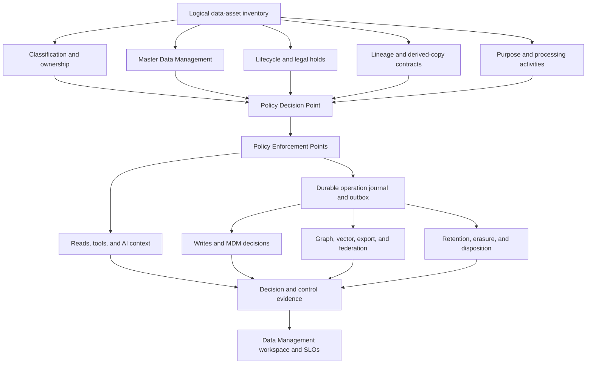

# Data Management Governance — Design

- **Date:** 2026-07-17
- **Status:** Revised design (rev. 2) — founder-reviewed; substrate references validated against `origin/main` `5834e7548`; backlog reconciled 2026-07-17 (BI-DG-014..016, BI-MDM-201..203 assigned)
- **Plan:** `docs/superpowers/plans/2026-07-17-data-management-governance-plan.md`
- **Epics:** EP-DATA-GOVERNANCE, EP-DATA-RETENTION, and EP-MDM; composes with EP-ESTATE-SOVEREIGNTY, EP-GRC-001, and EP-PLATFORM-SUBSTRATE-CONVERGENCE
- **Capsule:** WC-450D7558
- **Research baseline:** live MCP backlog on 2026-07-17 plus `origin/main` at `5834e7548` (PR #3182), containing 495 Prisma models. The local topic worktree is older, so implementation must rebase and repeat the inventory before changing code.

## 1. Executive decision

DPF will implement a **composed data-control spine**: one stable logical identity for each governed data asset, with separate typed registries for classification, lifecycle, processing purpose, projection, protection, ownership, and Master Data Management (MDM). Runtime records hold organization-specific approvals, exceptions, legal holds, steward work, and evidence. They do not replace source-controlled platform defaults.

MDM is a first-class plane of this design. DPF already has a strong MDM substrate — domain ownership, identity and non-identity crosswalks, write-time duplicate prevention, match configuration, steward tasks, reversible merge/unmerge, attribute history, TrustAssessment publishing, enrichment proposals, and an autonomous Data Steward. This design governs those capabilities and connects them to data classification, purpose, retention, privacy, projection, and policy enforcement. It does not build a second golden-record database.

The operator experience will be an attention-first **Data Management** workspace. A non-specialist should be able to answer five questions without knowing a regulation or database name:

1. What data do we have, and who is accountable for it?
2. Which records are trusted master data, and which need steward review?
3. What are we allowed to do with the data for this purpose?
4. How long must we keep it, and when must we delete it?
5. Where are its copies, and did the required control actually run?

## 2. Problem

DPF has effective controls in isolated domains but no end-to-end control system:

1. **No governed asset identity or field classification.** The route and agent sensitivity taxonomy (`public | internal | confidential | restricted`) does not classify Prisma models or fields. Downstream masking, encryption, projection, purpose, retention, and subject-rights controls therefore lack a shared anchor.
2. **Lifecycle coverage is incomplete.** The retention engine covers a small minority of the 495-model research baseline. High-growth events, activity logs, receipts, observations, MDM history, steward tasks, revisions, and vectors can grow indefinitely. There is no complete disposition matrix or growth SLO.
3. **Derived copies are governed independently.** Neo4j, Qdrant, EA mirrors, discovery projections, SysML parity, federation, and code-graph pipelines use different scope, deletion, and staleness conventions. Raw conversation content can reach semantic memory without a storage-time field policy, and a source deletion does not reliably remove every derived copy.
4. **Purpose and retention are conflated with access.** A principal may be allowed to use a field for one purpose but not another, while a record may need to be retained even when nobody may use it operationally. DPF cannot express that distinction consistently today.
5. **Protection is narrow.** Credential secrets are encrypted, but high-risk personal and customer content is generally plaintext. Masking is not enforced before AI context assembly. There is no complete data-subject access/erasure workflow or cryptographic tamper-evidence check.
6. **Compliance knowledge is duplicated and inferred.** Archetype and business-context strings drive some applicability logic, but there is no governed processing-activity inventory connecting purpose, data categories, subjects, legal basis, recipients, location, lifecycle, and accountable owner.
7. **Existing MDM decisions are not connected to wider governance.** Crosswalks, survivorship, merge history, trust scores, and published master views do not yet carry a complete classification, lifecycle, purpose, policy-version, and evidence contract. Autonomous merges need risk-tiered authority rather than a single global posture.
8. **The product surface is fragmented.** `/admin/data-stewardship`, `/admin/reference-data`, `/ea/data-model`, retention jobs, backups, and compliance evidence are separate destinations. The current stewardship view also predates report-kit conventions.
9. **The next feature can repeat the debt.** A new persistent model or projection can ship without an explicit owner, classification, master-data role, lifecycle, subject locator, purpose, or copy-cleanup decision.

## 3. Goals and non-goals

### Goals

- **G1 — Complete, stable asset inventory.** Every persistent model and governed field maps to a stable logical `DataAssetId`, independent of physical table renames.
- **G2 — Separated control axes.** Sensitivity, semantic category, criticality, master-data domain, subject relationship, purpose, lifecycle, residency, and quality remain independent and composable.
- **G3 — Accountable governance.** Every governed domain has an accountable owner, a steward, a custodian, decision rights, review cadence, and measurable control SLOs.
- **G4 — MDM as a governed plane.** Master-data identity, source crosswalk, match, merge, survivorship, quality, publish, hierarchy/reference-data, and stewardship decisions share the same policy and evidence contracts.
- **G5 — Correct lifecycle decisions.** Retention minima, deletion maxima, legal holds, erasure requests, archival, anonymization, and exceptions are distinct concepts with explicit conflict handling.
- **G6 — Governed copies.** Every graph, vector, cache, export, federation, or other derived copy has a contract for purpose, permitted fields, transformation, classification inheritance, retention, deletion, reconciliation, and staleness.
- **G7 — Enforceable policy.** One in-process Policy Decision Point (PDP) produces versioned, explainable decisions; Policy Enforcement Points (PEPs) apply obligations at reads, writes, AI context, projections, MDM operations, and disposition.
- **G8 — Proportionate protection and privacy operations.** High-risk fields receive encryption or tokenization at an audited access seam; masking precedes AI context; subject access and erasure enumerate authoritative and derived copies.
- **G9 — Prevent regression.** CI and runtime stewardship make missing governance decisions visible and, for new persistent surfaces, merge-blocking.
- **G10 — Usable product experience.** An attention-first workspace lets non-specialists discover risk, act safely, simulate policy, review MDM exceptions, and retrieve evidence.

### Non-goals

- Replacing OpenMetadata, DataHub, or a general enterprise catalog. DPF needs an embedded control plane for its own schema and stores.
- Replacing domain tables with a separate MDM hub. The domain table remains canonical; MDM governs identity, quality, provenance, resolution, and publishing around it.
- Replacing the existing retention engine, compliance engine, trust vector, identity model, MDM services, or federation `ProjectionContract`. This design composes and refactors them.
- Claiming legal certification. The platform supplies controls and evidence; organization-specific legal interpretation and formal regulatory assessments remain governed human decisions.
- Universal encryption of every field. Protection is selected by risk, access pattern, search requirements, and key-recovery design.
- Multi-region storage topology in this epic. The model records residency and transfer constraints that future deployment substrates enforce.

## 4. Research and benchmarking

### 4.1 Standards and governance frameworks

- [ISO/IEC 38505-1](https://www.iso.org/standard/56639.html) and [ISO/IEC TR 38505-2](https://www.iso.org/standard/70911.html) frame data as an organizational governance concern and use an accountability map. Adopted: explicit decision rights and accountable data owners, not an IT-only catalog.
- [ISO 8000-51:2023](https://www.iso.org/standard/78708.html) covers exchangeable data-governance policy statements and automated conformance testing. Adopted: stable policy identifiers, versions, referenced specifications, and executable test vectors.
- [ISO 8000-61:2016](https://www.iso.org/standard/63086.html) defines a data-quality management process reference model. Adopted: quality rules, measurement, remediation, and process maturity are separate from a one-time score.
- [ISO 8000-110:2021](https://www.iso.org/standard/78501.html) covers machine-checkable exchange of characteristic master data and explicitly notes that provenance and accuracy require an overall quality strategy. Adopted: master publishing contracts must carry formal semantics, conformance, provenance, and quality — not only a payload.
- [NIST SP 800-162](https://csrc.nist.gov/pubs/sp/800/162/upd2/final) models attribute-based access control with subject, object, action, and environment attributes. Adopted: purpose and destination join principal and asset attributes in the decision input.
- [NIST SP 800-57 Part 1 Rev. 5](https://csrc.nist.gov/pubs/sp/800/57/pt1/r5/final) treats key generation, distribution, storage, use, recovery, revocation, compromise, and destruction as a lifecycle. Adopted: tenant-isolated key scope, availability/recovery objectives, compromise response, versioning, rotation, and destruction evidence are designed before encrypted field rollout.
- [NIST CSF 2.0](https://nvlpubs.nist.gov/nistpubs/CSWP/NIST.CSWP.29.pdf) elevates Govern alongside Identify, Protect, Detect, Respond, and Recover. Adopted: roles, policy, oversight, and evidence are product capabilities, not documentation afterthoughts.
- [DCAM v3](https://edmcouncil.org/frameworks/dcam/) treats data strategy, architecture, quality, governance, control, privacy, security, AI, and measurable capability maturity as a connected program. Adopted: one scorecard with leading and lagging indicators. DPF does not claim DCAM certification.

### 4.2 Open-source product patterns

- [OpenMetadata classifications](https://docs.open-metadata.org/v1.13.x-SNAPSHOT/how-to-guides/data-governance/classification/classification) distinguish mutually exclusive classification from multi-label categorization. Its [TagLabel model](https://docs.open-metadata.org/v1.6.x/main-concepts/metadata-standard/schemas/type/taglabel) also separates suggested, confirmed, manual, and propagated labels. Adopted: separate axes, provenance, and machine-suggest/human-confirm. Rejected: descriptive retention with no executor.
- [DataHub's entity/aspect model](https://github.com/datahub-project/datahub/blob/master/docs/what-is-datahub/datahub-concepts.md) attaches independently evolving metadata aspects to stable entity identifiers. Adopted: a stable logical asset key with composed typed aspects. Rejected: its operational stack; DPF already has Postgres, Neo4j, and Qdrant.
- [Apache Atlas](https://atlas.apache.org/2.0.0/index.html) propagates classifications over lineage, while its [classification model](https://atlas.apache.org/api/v2/json_AtlasClassification.html) records validity and propagation behavior. Adopted: derived copies inherit relevant restrictions, with explicit transform/declassification evidence instead of arbitrary opt-out.
- [Open Policy Agent deployment guidance](https://www.openpolicyagent.org/docs/deploy) separates policy decisions from enforcement. Adopted: a single evaluator and many PEPs. DPF will implement the small in-process contract first rather than adopt an external service before the Tool Evaluation Pipeline.

Open-source MDM/reconciliation models were reviewed separately from catalogs:

- [Pimcore Data Objects](https://docs.pimcore.com/platform/Pimcore/Objects/) use typed classes, relations, inheritance, variants, and classification stores, while [workflow management](https://docs.pimcore.com/platform/Pimcore/Workflow_Management/) supplies stateful stewardship transitions. Adopted: typed multi-domain master objects and explicit stewardship state. Rejected: runtime visual schema definition as authority; DPF's platform schema remains source-controlled.
- [OpenRefine's reconciliation API](https://openrefine.org/docs/technical-reference/reconciliation-api) returns ranked candidates in an identifier space, and its [review model](https://openrefine.org/docs/manual/reconciling) preserves judgment and candidate history. Adopted: candidate generation is not a match decision, strong identifiers scope resolution, and bulk judgments remain reversible. Rejected: spreadsheet/project state as the master system of record.
- [Apache Unomi's profile and alias model](https://unomi.apache.org/manual/latest/) demonstrates identity continuity through aliases and pluggable property-merge strategies, while warning that merging on an unauthenticated identifier is a security risk. Adopted: authenticated identity evidence, alias continuity, and property-specific resolution. Rejected: deleting merged profiles before DPF has proven downstream compensation and retraction.

### 4.3 Commercial product patterns

- [Microsoft Purview Data Governance](https://learn.microsoft.com/en-us/purview/data-governance-overview) separates governance-office, owner, steward, and consumer roles and connects catalog, quality, lineage, policy, and health. Its [lifecycle guidance](https://learn.microsoft.com/en-us/purview/manage-data-governance) treats disposition evidence as part of control operation. Adopted: role-specific workspaces, attention queues, lifecycle labels, and proof. Rejected: separate taxonomies that can drift between catalog and compliance products.
- [Reltio survivorship](https://docs.reltio.com/en/objectives/resolve-potential-matches/potential-matching-at-a-glance/potential-matching-navigation/design-survivorship-rules) explicitly separates the value-selection rule from the merge operation, and [crosswalks](https://docs.reltio.com/en/objectives/model-data/data-modeling-at-a-glance/data-modeling-operation/define-crosswalks-for-data-sources/crosswalks) preserve contributing source identity. Adopted: value-level provenance, pinned human values, source/recency/quality strategies, and survivorship version independent of merge version.
- Informatica's [Data Steward Guide](https://docs.informatica.com/content/dam/source/GUID-6/GUID-671C5A40-BDC0-40DE-A0D0-256E9162966D/11/en/MDM_102_DataStewardGuide_en.pdf) centers review tasks, match evidence, merge preview, and controlled resolution. Adopted: one explainable work queue and reversible actions. Rejected: requiring a heavyweight stewardship organization for ordinary low-risk exact matches.
- [Immuta purpose-based controls](https://documentation.immuta.com/2026.1/governance/author-policies-for-data-access-control/projects-and-purpose-based-access-control/projects-and-purpose-controls/getting-started) make declared purpose part of authorization. Adopted: purpose-bound decisions and obligations. Rejected: table-specific policy proliferation.

Commercial failure-mode research changed the MDM contract: dependency vetoes, stale previews, cross-domain conflicts, null/delete semantics, pinned values, publish-version rollout, retraction, and unmerge limitations are modeled explicitly. “Merge succeeded” is not complete until downstream consumers reconcile or a visible partial-completion case remains.

### 4.4 Regulatory corrections and design implications

| Regime | Verified implication | Design response |
|---|---|---|
| [GDPR Articles 5, 17, 24 and 25](https://eur-lex.europa.eu/eli/reg/2016/679/) | Storage limitation, erasure rights and exceptions, accountability, and data protection by design/default. Pseudonymized data can remain personal data. | Model deletion maxima and exceptions; enumerate derived copies; do not call pseudonymization or key destruction universal legal erasure. |
| [HIPAA Security Rule audit protocol](https://www.hhs.gov/hipaa/for-professionals/compliance-enforcement/audit/protocol/index.html) | The six-year federal period applies to required Security Rule documentation under 45 CFR 164.316; HIPAA does not create one universal medical-record retention period. | Keep security documentation and evidence floors distinct from state/contract clinical-record floors. |
| [SEC 17a-4 electronic recordkeeping amendments](https://www.sec.gov/investment/amendments-electronic-recordkeeping-requirements-broker-dealers) | A broker-dealer may use WORM or a complete time-stamped audit-trail alternative with record recreation and production capabilities. | Hash chaining is tamper evidence only; a separate control assessment must prove the full audit-trail or WORM posture. |
| [PCI SSC FAQ 1154](https://www.pcisecuritystandards.org/faqs/1154/) and [PCI DSS v4 SAQ C](https://www.pcisecuritystandards.org/documents/PCI-DSS-v4-0-SAQ-C.pdf) | Sensitive authentication data must not be stored after authorization even if encrypted; audit history is retained for at least 12 months with recent history immediately available. | A deletion prohibition outranks ordinary retention configuration; validation blocks storage of prohibited fields. |

The key correction is that there is no safe universal slogan such as “retention always wins.” DPF evaluates applicable minima, maxima, holds, and exceptions. When authorities conflict, it creates a governed conflict requiring an accountable decision; it does not silently retain or delete.

## 5. Existing substrate — extend, do not duplicate

| Existing capability on `origin/main` | Design relationship |
|---|---|
| Retention registries and batched, dry-run, kill-switched sweep under `apps/web/lib/operate/retention/` | Extend with total disposition coverage, event triggers, holds, evidence, archive, revision caps, and measured partition thresholds. |
| Route/agent sensitivity and local-only inference gates | Reuse the vocabulary but classify assets and fields separately from routes. |
| EA data-model mirror, data-architecture steward, code-graph staleness escalation | Feed asset metadata to the ERD and generalize drift/staleness controls. Do not create a second ERD. |
| `ProjectionContract` for federation egress | Keep its federation boundary. Introduce a typed in-process `DerivedDataContract` for all derived copies, with an adapter to federation contracts. |
| `Policy`, `PolicyRequirement`, and generic `PolicyRule` models | Keep human policy documents and generic business rules separate from typed executable data policies; connect them by stable policy IDs. |
| `Principal`/`PrincipalAlias` | Use for canonical identity and alias resolution. Add protected source-observation provenance where MDM needs observation history; an authentication alias is not the whole crosswalk record. |
| MDM domain registry, `MasterDataSourceRef`, match config, steward queue, merge/unmerge paths, attribute history, TrustAssessment publishing, enrichment, batch scan, and autonomous steward | Govern and extend, but do not assume uniform maturity. Current reversibility and publishing are domain-limited; supplier remains the open domain pilot at the research baseline. |
| Credential AES-256-GCM helper | Refactor into a reviewed key service; do not copy its development plaintext fallback into personal-data paths. |
| Compliance obligations, controls, evidence, jurisdiction, and archetype applicability | Consume processing activities and executable policy results instead of duplicating regulation logic in prompts. |
| `AuthorizationDecisionLog`, `ToolExecutionReceipt`, and other evidence envelopes | Reuse where their semantics fit; add a typed data-policy envelope before adding another generic log table. |

## 6. Architecture



### 6.1 Logical asset inventory and separated axes

The source-controlled registry is the platform default and CI contract. It is composed from focused modules rather than one unmaintainable file:

```ts
type DataAssetId = `data:${string}`;
type DataFieldId = `${DataAssetId}#${string}`;

type DataFieldDefinition = {
  id: DataFieldId;
  physicalName: string;
  resolution: "inherited" | "governed" | "not-applicable";
  resolutionReason: string;
  categories?: DataCategory[];
  sensitivity?: DataSensitivity;
  subjectRoles?: SubjectLocator[];
  collectionRule?: "allowed" | "minimize" | "prohibited";
  protection?: ProtectionProfileKey;
  purposeCapabilities?: ProcessingPurposeKey[];
  lifecycleOverride?: LifecycleClassKey;
  projectionOverride?: ProjectionClass;
  provenance: ClassificationProvenance;
};

type DataAssetDefinition = {
  id: DataAssetId;
  physical: { prismaModel: string };
  fields: DataFieldDefinition[];
  domain: string;
  ownerRole: string;
  stewardRole: string;
  categories: DataCategory[];
  sensitivity: DataSensitivity;
  criticality: DataCriticality;
  subjectLocators: SubjectLocator[];
  masterDataDomain?: MasterDataDomainKey;
  lifecycleClass: LifecycleClassKey;
  purposeCapabilities: ProcessingPurposeKey[];
  residencyClass: ResidencyClassKey;
  projectionClass: ProjectionClass;
  classification: {
    state: "suggested" | "confirmed";
    source: "manual" | "inferred" | "propagated";
    effectiveFrom: string;
  };
};
```

Design rules:

- Policies bind to logical asset IDs, categories, fields, domains, purposes, and subject types — never only to physical table names.
- `sensitivity`, `category`, `criticality`, `masterDataDomain`, and `quality` are independent axes. “Customer master” is not a sensitivity and “restricted” is not a retention class.
- `subjectLocators` is plural and executable. A row can relate to an account, contact, employee, or other subject through different paths.
- Field facts are generated independently from Prisma; governance annotations are curated. Every Prisma field must resolve to `inherited`, `governed`, or `not-applicable` with a reason and provenance. The coverage test detects new/renamed physical fields while stable logical field IDs preserve policy history.
- Field-level overrides are required for sensitive, prohibited, encrypted, masked, subject-identifying, and projected fields. Model defaults cover ordinary inherited fields; `not-applicable` is an explicit reviewed decision, never absence.
- `purposeCapabilities` means purposes the platform implementation can technically support. It is not legal applicability or organization authorization. Active organization-specific purposes come only from confirmed `DataProcessingActivity` records and executable policy.
- Runtime organization overrides can only narrow use, lengthen an applicable minimum, shorten an optional maximum, or add controls unless an approved, expiring exception authorizes otherwise.

Proposed module boundary:

```text
apps/web/lib/govern/data/
  taxonomy.ts                 # closed types and precedence vocabulary
  assets.ts                   # logical asset registry and lookup
  processing-activities.ts    # platform defaults and archetype templates
  lifecycle-classes.ts        # lifecycle declarations, not executors
  derived-data-contracts.ts   # graph/vector/cache/export/federation contracts
  executable-policies.ts      # versioned policy-as-data definitions
  policy-decision.ts          # pure evaluator
  policy-enforcement.ts       # reusable PEP adapters
  control-operation.ts        # durable intent, outbox, checkpoints, recovery
  coverage.ts                 # schema/registry/contract conformance
```

### 6.2 Governance operating model

Each data domain has an accountability map:

| Role | Accountable decisions | Cannot do alone |
|---|---|---|
| Organization data executive / platform administrator | Approves policy classes, risk appetite, high-impact exceptions, and domain ownership | Cannot erase or release holds without recorded authority and preview |
| Data owner | Accepts quality/lifecycle SLOs, intended purposes, master-data publish contract, and residual risk for a domain | Cannot approve an exception they requested when separation is required |
| Data Steward coworker | Proposes classifications, resolves ordinary quality tasks, runs safe deterministic remediation, and explains policy | Cannot self-approve high-risk merge, policy exception, identity conflict, or hold release |
| Data custodian | Implements storage, keys, backups, indexes, projection cleanup, and restoration | Cannot define business purpose or legal basis |
| Privacy/compliance authority | Approves regulated processing, erasure conflicts, transfers, holds, and exceptions | Cannot silently mutate technical policy without versioned change evidence |
| Consumer/coworker | Uses data for a declared purpose within policy obligations | Cannot choose its own clearance or bypass the PDP/PEP |

Governance cadence:

- **On change:** impact analysis, policy simulation, owner/steward approval when risk requires it, versioned effective date, and conformance tests.
- **Daily:** stale projection, overdue deletion, expiring exception, unowned asset, and critical MDM task detection.
- **Monthly:** domain quality/lifecycle review and exception burn-down.
- **Quarterly:** access/purpose, policy, retention, key rotation, and high-risk MDM autonomy review.
- **Annually or on material change:** processing-activity, regulatory applicability, transfer, and control design review.

Every exception is scoped, justified, approved, time-bounded, tied to compensating controls, and automatically returns to review before expiry. An attestation without owner, expiry, and evidence is not an exception.

### 6.3 Durable control operations and crash consistency

Every multi-step or consequential data action uses one durable `DataControlOperation` journal. This closes the failure window between mutation and evidence and gives Postgres, Neo4j, Qdrant, archives, exports, backups, and downstream master-data consumers one recovery contract.

An operation persists **intent before mutation** with organization, actor/authority, action, logical assets/fields, purpose, canonical input hash, asset/classification/policy versions, hold-scope revisions, approvals, risk, idempotency key, and requested targets. It then advances through explicit states:

```text
planned -> authorized -> executing -> reconciled
                    \-> partially-complete -> executing | compensating
                    \-> failed
compensating -> compensated | partially-complete
```

Each target has a durable step/checkpoint (`pending | executing | applied | verified | failed | compensated`) with attempt, cursor, target receipt, error class, and retry time. A source-row mutation and its outbox/checkpoint are written in the same Postgres transaction. External effects are idempotent by operation/step key. Verification, not a successful API response alone, moves a step to `verified`.

Rules:

- A side-effecting PEP accepts a one-time authorization bound to the operation, actor authority, action, exact input hash, policy versions, and target PEP. It revalidates current authority and active hold scope immediately before mutation.
- A crash or timeout resumes from durable checkpoints. It never fabricates a receipt from intended work.
- Compensation is operation-specific. If a target cannot be compensated or retracted, the operation remains `partially-complete`, blocks a false-success state, and opens a governed case.
- Terminal evidence is emitted only after target reconciliation. Evidence creation itself is an operation step, so “mutation succeeded but receipt failed” remains recoverable and visible.
- MDM merge/unmerge, survivorship publish/retract, legal-hold issue/release, archive, disposition, projection cleanup, and subject access/erasure all use this contract.

Existing `AuthorizationDecisionLog`, `ToolExecutionReceipt`, queue functions, and domain audit rows remain evidence/adapters; they do not replace the operation journal because they lack a shared cross-store checkpoint state machine.

### 6.4 Master Data Management plane

The MDM plane owns **identity, provenance, conformance, quality, resolution, survivorship, and trusted publication** for shared business entities.

Maturity is never inferred from the existence of a domain-registry row. Every domain publishes a capability/readiness matrix with `absent | pilot | supported | enforced` for identity, source observation, candidate generation, merge, survivorship, quality, publish, lifecycle, autonomy, and downstream reconciliation. It also declares `reversibilityClass: none | source-only | full`. The matrix is produced from conformance tests and live evidence; supplier remains visibly pilot until its existing rollout BI passes. UI and policy cannot describe a pilot capability as enforced.

1. **Canonical ownership:** domain tables remain the system of record. `MASTER_DATA_DOMAINS` declares the canonical model, stable business identifier, owner, steward, match policy, publish contract, quality SLO, and lifecycle class.
2. **Crosswalks:** identity-bearing aliases use `PrincipalAlias`, but protected source-observation records carry issuer, observed/last-seen times, evidence/trust, and lifecycle. Non-identity external source links use `MasterDataSourceRef`. A crosswalk is not a second canonical record, and an authentication alias is not sufficient provenance by itself.
3. **Match and merge are separate decisions:** candidate generation, match classification, merge, and publish each emit their own policy/version/evidence. “Possible duplicate” never means “same entity.” Candidate sets are invalidated or rescored when a contributing source, normalization rule, match config, or canonical version changes. A merge preview binds exact source/canonical versions and fails stale under concurrent change.
4. **Survivorship is separate from merge:** each mastered attribute selects a strategy such as pinned-human, source-priority, verified-value, recency, completeness, or keep-survivor. Rules explicitly distinguish missing, null, cleared/deleted, invalid, and intentionally blank values. The protected winner receipt records minimized candidate evidence, source crosswalks, rule version, actor, confidence, and time. A human-pinned value cannot be overwritten by a lower-authority automated run.
5. **Quality is operational:** accuracy/validation, completeness, consistency, uniqueness, freshness, and provenance feed the shared `TrustAssessment`. Threshold failures open or refresh a steward task; they do not merely lower a dashboard score.
6. **Publishing is a contract:** the published read model carries domain/version, canonical ID, attribute provenance summary, trust assessment, classification, permitted purpose, policy obligations, and `asOf`. Contract rollout declares compatibility window, consumer acknowledgments, reindex/backfill, and cutover. Merge reversal, invalidated source, or policy change can emit a retraction/correction; completion waits for downstream reconciliation.
7. **Reference data and hierarchies:** codes, replacements, parent-child relationships, source transcodes, effective dates, and deprecations are mastered. Referential changes are versioned and impact-simulated before publish.
8. **Lifecycle:** source observations, crosswalks, match evidence, steward tasks, tombstones, merge lineage, attribute history, and published copies each have an explicit lifecycle. Legal hold and erasure follow the canonical subject/entity across aliases and source refs.
9. **Graduated autonomy:** deterministic, low-impact exact matches may auto-link or auto-merge within a per-run cap only when `reversibilityClass` and downstream reconciliation are proven for that domain/action. Fuzzy, conflicting, identity-bearing, regulated, high-value, cross-domain, stale-preview, or limited-reversibility cases require review. Confidence is necessary but never the only risk signal.
10. **Conformance:** every MDM domain must map to a governed asset, lifecycle class, quality SLO, publish contract, and protection policy. Every MDM write path must use the dedup coverage registry.

This resolves the tension between the earlier “never auto-merge” posture and the current autonomous steward: automation is allowed only by risk-tiered executable policy, is capped, uses the durable operation journal, and is limited to domains where compensation and downstream reconciliation are demonstrated.

### 6.5 Processing activities and executable policy

A `DataProcessingActivity` is the organization-specific record of why data is processed. Archetypes may propose templates, but an accountable owner confirms applicability. Minimum fields:

- stable ID, name, purpose, owner, status, effective/review dates;
- data asset/category/field scope and subject types;
- legal/contractual basis references and controller/processor posture where applicable;
- recipients, destinations, residency/transfer constraints, and derived-copy contracts;
- lifecycle classes, erasure exceptions, high-risk/DPIA flags, and linked controls/evidence.

Executable data policies are typed, versioned, testable platform rules. Existing `Policy` records remain the human-readable policy documents; a stable link connects the executable rule to its authority and requirement.

```ts
type DataPolicyInput = {
  organizationId: string;
  principal: PrincipalAttributes;
  action: DataAction;
  asset: DataAssetId;
  fields?: DataFieldId[];
  purpose: ProcessingPurposeKey;
  environment: EnvironmentAttributes;
  destination?: DestinationAttributes;
};

type DataObligation =
  | { kind: "mask"; fields: DataFieldId[]; profileId: string }
  | { kind: "encrypt"; fields: DataFieldId[]; protectionProfileId: string }
  | { kind: "destination"; allowedClasses: DestinationClass[] }
  | { kind: "log-use"; evidenceClass: string; minimumRetentionClass: string }
  | { kind: "human-approval"; authorityRole: string; separationOfDuties: boolean }
  | { kind: "delete-derived-copy"; contractIds: string[]; deadlineSeconds: number }
  | { kind: "disposition-evidence"; evidenceProfileId: string };

type DataPolicyDecision = {
  decisionId: string;
  organizationId: string;
  inputHash: string;
  pepKind: DataPepKind;
  effect: "allow" | "allow-with-obligations" | "review" | "deny";
  obligations: DataObligation[];
  matchedPolicyVersions: string[];
  assetVersion: string;
  classificationVersion: string;
  authorityVersion: string;
  explanationCode: string;
  issuedAt: string;
  expiresAt: string;
  replay: "single-use" | "read-cacheable";
  cacheKey?: string;
};
```

The PDP is a pure in-process evaluator. MCP tools such as `get_data_policy` and `check_data_action` explain and simulate the same evaluator; they are not the security boundary. PEPs enforce decisions at:

- API/server-action writes and high-risk reads;
- MDM candidate, merge, survivorship, unmerge, and publish actions;
- coworker context assembly, memory storage, retrieval, and tool-result shaping;
- Neo4j, Qdrant, cache, export, backup, and federation projections;
- retention, archival, legal-hold, DSAR, anonymization, and erasure executors.

Unknown or invalid policy context fails closed for restricted data, external destinations, destructive actions, prohibited storage, and identity/regulated MDM cases. Lower-risk ambiguity routes to review; it never silently becomes allow.

Each PEP declares a capability matrix of obligation kinds and profiles it can enforce. CI rejects a policy/PEP combination whose obligations exceed that matrix. A side-effecting decision is single-use, bound to the durable operation and exact input hash, and cannot be replayed for a different actor, target, purpose, destination, or organization. Immediately before mutation the PEP revalidates authority, active holds, policy/classification versions, and operation state to close time-of-check/time-of-use gaps.

Read caching is allowed only with an exact cache key containing organization, principal/authority epoch, action, asset/field/classification versions, purpose, destination, environment class, and policy bundle version. Hold, role, exception, policy, classification, or processing-activity changes advance an invalidation epoch. Destructive and MDM decisions are never served from a reusable cache.

The precedence lattice is explicit and non-waivable: prohibited collection/storage and active preservation constraints are hard constraints; conflict between hard constraints produces `review` and no mutation. Confirmed applicable mandatory authority is evaluated next, followed by consent/contract where applicable, organization policy, and then an approved exception only where the governing authority permits exception. Within the same level, deny/review outranks allow, narrower scope outranks broad scope, and effective-date/version rules are deterministic. Array order never decides policy.

### 6.6 Lifecycle algebra and evidence

Each lifecycle class declares:

- trigger event (`created`, `closed`, `last-active`, `contract-ended`, `subject-request`, or domain event);
- zero or more retention minima and deletion maxima with authority and scope;
- operational/archive phases and permitted transformations;
- disposition action (`delete`, `anonymize`, `aggregate`, `archive`, `partition-drop`, or `review`);
- hold applicability, exception paths, and evidence requirements.

Evaluation produces dates and conflicts, not one overloaded duration:

```text
retainUntil       = latest applicable minimum date
deleteNoLaterThan = earliest applicable maximum date
eligible          = now >= retainUntil AND no active hold
conflict          = active obligation cannot satisfy both dates or requested action
```

An active legal hold blocks routine deletion and anonymization for every matching scope revision. A hold uses append-only revisions and `draft -> issued -> released` state. An authorized urgent issuance becomes effective atomically with its durable operation intent; preview is useful for planned holds but cannot delay preservation. This supports the reasonable-preservation expectation in [Federal Rule of Civil Procedure 37(e)](https://www.law.cornell.edu/rules/frcp/rule_37).

After issuance, scope resolution continues: new aliases, late-arriving records, new derived-copy contracts, and restored data are evaluated against every active revision. Each custodian/store records propagation acknowledgment, matched count/digest, checkpoint, failure, and retry. Overlapping holds are evaluated independently; releasing one cannot release data still matched by another. Release requires the configured authority, a fresh overlap evaluation, downstream acknowledgments, and a durable receipt. Backup restore replays active holds and disposition tombstones before ordinary processing resumes.

If `retainUntil > deleteNoLaterThan`, or an erasure request conflicts with a hold or exemption, the executor does nothing destructive and creates a policy-conflict case. The responsible authority resolves it through a versioned decision.

Every destructive or irreversible action runs through the durable operation journal and writes a disposition receipt containing asset and policy versions, trigger/cutoff, matched hold revisions, target stores, candidate and affected counts, a keyed canonical identifier digest rather than raw sensitive values, archive checksum where relevant, executor, approvals, start/end, per-target failures, and reconciliation result.

Growth observability determines partitioning. Partition migration is allowed only after measured write rate/size, retention-aligned partition key, FK impact, restore procedure, and rehearsal evidence justify its operational cost.

### 6.7 Derived-data and lineage contracts

Every derived copy has a stable `DerivedDataContractId` with:

- source assets/fields and target store/collection;
- business purpose, owner, processor, destination, and residency;
- payload class (`structure | metadata | masked-content | content`);
- transformation/masking and classification propagation rules;
- trigger, delivery SLO, recovery point, and staleness threshold;
- lifecycle, source-delete propagation, subject/entity locator, and orphan-reconciliation method;
- policy versions, schema/contract version, health state, and evidence sink.

The strictest relevant source restriction propagates unless a recorded transform produces a less-identifying output and the PDP authorizes the resulting class. A projection cannot self-declassify. Source deletion emits cleanup work; reconciliation detects missed events. Fire-and-forget availability remains acceptable only when darkness and orphans become visible within the contract SLO.

The first remediation remains semantic memory: restricted turns do not store raw content; confidential content is masked according to field policy; message/thread/lifecycle deletion removes matching vectors; reconciliation proves no orphan remains.

### 6.8 Protection and privacy operations

- **Data minimization first:** prohibit collection/storage where a rule requires it (for example, post-authorization sensitive authentication data). Encryption does not make prohibited storage acceptable.
- **Envelope encryption by risk:** keys remain outside Postgres and its backups. A key-encryption key wraps data-encryption keys. Scope may be tenant, domain, record, or subject depending cardinality and shared-subject semantics; per-subject keys are used only where one subject boundary is real and recoverable. Tenant separation is cryptographic as well as logical.
- **Key operations are a lifecycle:** each protection profile defines KEK/DEK owner, availability and recovery objectives, escrow/recovery authority, rotation and retirement, compromise blast radius, revocation, tenant isolation, backup/restore, and destruction evidence. A field family cannot enable enforcement until loss and compromise drills pass.
- **Migration-safe format:** ciphertext records include algorithm, key ID/version, nonce/tag, and format version. Read-old/write-new, backfill, rotation, restore, and loss drills are designed before field rollout.
- **Tokenization/search indexes:** deterministic lookup requirements use reviewed tokens or keyed indexes, never raw values or deterministic encryption by default.
- **Crypto-shredding is defense in depth:** destroying a key can render remaining ciphertext inaccessible, but the erasure receipt must still account for plaintext copies, caches, exports, keys, legal exceptions, and backups.
- **Mask before context:** typed values are masked before coworker prompts, memory, tool results, previews, logs, and exports according to principal, purpose, field policy, and destination. Prompt instructions are not enforcement.
- **Evidence is governed data:** history, merge snapshots, candidate evidence, receipts, exports, logs, and disposition records inherit the source field policy. Existing stringified MDM old/new values must migrate to omitted, redacted, tokenized, or separately encrypted representations. Predictable identifiers use canonicalized keyed digests with key ID/rotation, never unsalted hashes presented as privacy.
- **Subject operations:** DSAR discovery resolves identity through `Principal`/`PrincipalAlias` and relevant MDM crosswalks, queries executable subject locators, follows derived-data contracts, and records completeness. Erasure selects delete, anonymize, detach, restrict, or conflict per asset.
- **Tamper evidence:** append-only receipts are hash-linked or Merkle-batched and periodically verified, with roots stored in an independent evidence location. This detects mutation; it does not by itself certify SEC 17a-4 compliance.

### 6.9 Forward process and conformance gates

The Data-Impact Gate is content-based, not a “file touched” check.

Rollout uses a **non-growing ratchet**. From the first gate PR, every new or changed persistent surface must satisfy the full contract. Pre-existing gaps are captured once in an immutable generated baseline; each entry names the independently discovered object, owner, risk, remediation BI, and deadline. A baseline gap cannot hide a changed object, cannot be copied to a new object, and cannot grow. Domain waves burn it down to zero. This prevents both a flag-day block on enabling infrastructure and meaningless blanket defaults.

Denominators are generated without consulting the registry being measured: Prisma supplies models/fields, the producer inventory supplies projections, the PEP entry-point registry supplies enforcement points, the destructive-handler registry supplies hold/evidence coverage, and `MASTER_DATA_DOMAINS` supplies MDM domains. A registry cannot declare itself complete.

For any added/changed persistent model, field, migration, projection, AI context source, MDM domain, or lifecycle executor, the PR must include a generated `DataImpactManifest` describing affected logical assets and decisions. CI validates that:

- every changed Prisma model has a stable asset and lifecycle disposition, and every field resolves to inherited/governed/not-applicable with reason/provenance;
- sensitive/subject/prohibited fields have governed field policy;
- new master-data domains have ownership, crosswalk, match, quality, lifecycle, and publish contracts;
- new projections have derived-data contracts and cleanup/reconciliation tests;
- destructive paths check holds and write disposition evidence;
- processing purposes and PEP coverage exist where required;
- executable policies have positive, denial, obligation, unknown-context, precedence, and exception-expiry test vectors.

A structured exception may cover a genuinely temporary gap, but must name scope, accountable approver, rationale, compensating control, expiry, and remediation item. It cannot waive asset/lifecycle coverage for a new persistent model or permit prohibited storage. The Data Steward continuously detects runtime drift after merge.

## 7. Product and information architecture

Create a stable `/admin/data` operational workspace under a top-level Admin → Data Management destination, not under Configuration. The primary persona for the first viewport is the **Data Steward** responsible for daily exceptions and control health. Data owners, custodians, privacy/compliance authorities, and platform administrators receive role-filtered queues and shortcuts to their corresponding view. Keep five peer destinations:

1. **Overview** — attention queue, control health, domain scorecards, expiring exceptions, overdue deletion, stale copies, unowned assets, and MDM work aging.
2. **Catalog** — searchable logical assets and fields; plain-language classification, owner/steward, purposes, lifecycle, subject links, copies, and an advanced metadata drawer. Deep-link to `/ea/data-model` for ERD/lineage rather than duplicate it.
3. **Stewardship** — evolve `/admin/data-stewardship`; duplicate/match tasks, survivorship comparison, source crosswalks, value provenance, reference data/hierarchy work, publish preview, and reversible merge/unmerge.
4. **Lifecycle** — retention and deletion matrix, growth trends, holds, archive, dry-run preview, conflicts, disposition history, and copy cleanup.
5. **Policy & Privacy** — local subviews for policy simulation, processing activities, protection coverage, exceptions, subject requests, and data-control evidence. Link to `/compliance` for broader obligation/control assurance instead of copying that workspace.

Route migration keeps redirects from `/admin/data-stewardship` and `/admin/reference-data` after equivalent subroutes exist. Existing bookmarks remain valid during transition.

First-viewport UI uses report-kit primitives and no more than five summary cards. Preferred labels are “Needs attention,” “Protected,” “Kept until,” “Copies,” “Owner,” and “Why this decision.” Advanced policy IDs and JSON stay behind progressive disclosure.

Attention queues are role-filtered and never imply a hidden capability is healthy: missing measurement, stale policy, unavailable key service, partial operation, permission denial, and unsupported MDM domain each have an honest degraded state. “Ask Data Steward” opens a preview showing scope, proposed tools/actions, decision authority, and confirmation boundary; it does not silently launch remediation.

Key flows:

- **Confirm classification:** suggested changes → affected-policy preview → confirm/reject → effective version and receipt.
- **Resolve master record:** compare candidates and source values → see rule/confidence/risk → preview downstream impact → merge/link/distinct → undo path and receipt.
- **Simulate a data action:** choose principal/action/asset/purpose/destination → see allow/review/deny and obligations → inspect matching policy versions.
- **Create/release hold:** resolve scope → preview records/copies → approve → verify executor checks; release requires separate authority where configured.
- **Run lifecycle:** dry-run → conflicts/holds → approve capped batch → reconcile all stores → download evidence.
- **Subject request:** verify identity → discover canonical and derived copies → review exceptions → export/erase/anonymize → completeness receipt.

All irreversible actions use an in-app dialog, clear scope and consequence, explicit confirmation, and result evidence. Tables and charts include text alternatives, keyboard operation, accessible status text, export, filters, and theme-aware tokens.

UX acceptance uses a fixed safe fixture and the six task scripts above at 1280×720 and 390×844. At least three representative operators who are unfamiliar with the schema attempt the scripts: at least 90% of tasks complete without assistance, zero critical errors trigger or authorize the wrong destructive action, and the median task time is at most three minutes excluding queued execution. All tasks must be keyboard-completable with visible focus, programmatic names/status, chart/table text alternatives, and automated WCAG 2.2 AA checks. Permission, empty, loading, stale, unknown, partial-operation, and failure fixtures are reviewed separately; they cannot masquerade as zero/healthy.

## 8. Metrics and service levels

Hard conformance targets at program exit:

- 100% of Prisma models have a logical asset and lifecycle disposition.
- 100% of governed sensitive/subject/prohibited fields have field policy.
- 100% of MDM domains have ownership, quality, lifecycle, dedup coverage, and publish contracts.
- 100% of destructive lifecycle actions perform a hold check and emit disposition evidence.
- 100% of content-bearing derived copies have deletion propagation and reconciliation tests.
- 100% of restricted/external/destructive policy decisions fail closed when required context is unknown.

From the first enabling PR, new/changed-surface coverage is 100% and the legacy gap baseline may only decrease. The workspace reports both numbers separately; it never presents ratchet compliance as whole-estate completion.

Operational SLOs are organization-configurable but must be visible by domain:

- unowned assets, unconfirmed high-risk classifications, and expired exceptions;
- MDM duplicate rate, task age, auto-decision reversal rate, pinned-value violations, quality dimensions, and publish freshness;
- table growth, overdue disposition, hold conflicts, archive/restore success, and disposition reconciliation;
- projection staleness, orphan count, cleanup latency, and failed destination obligations;
- protected-field/key-version coverage, rotation age, masking failures, and plaintext-detection findings;
- DSAR discovery completeness, response age, unresolved exceptions, and derived-copy cleanup completion;
- PDP allow/review/deny/obligation counts and PEP coverage — never raw sensitive values in metrics.

The initial release establishes baselines before setting numeric alert thresholds. CI coverage targets above are immediate, not aspirational.

## 9. Safety properties

1. No destructive lifecycle or subject-rights action runs without dry-run, cap, hold check, authorization, and evidence.
2. Unknown regulated, restricted, external, prohibited-storage, or destructive policy context never silently allows.
3. MDM auto-decisions are policy-scoped, reversible, capped, and excluded for high-risk classes.
4. A source deletion is incomplete until contracted copies reconcile or the failure is visible.
5. Encryption keys are isolated from the protected data and backups; key loss and recovery are tested before rollout.
6. Classification changes are versioned and impact-simulated before they alter access, retention, projection, or MDM behavior.
7. Policy exceptions expire and cannot erase their own audit trail.
8. Hash chaining is described as tamper evidence, not legal certification.
9. No agent prompt is the source of regulatory truth or an enforcement point.
10. Data values never appear in control-health metrics, gate output, hashes-to-display, or ordinary decision explanations.
11. Consequential cross-store actions cannot report success until their durable operation reaches `reconciled`; partial completion remains visible and retryable.
12. Governance history and evidence inherit field protection and lifecycle; an audit table is not a license to duplicate plaintext.

## 10. Delivery boundaries and refactoring allocation

This is a program design, not one PR. Each live BI remains independently reviewable; affected acceptance criteria are reconciled through MCP after this revised design is approved.

Approximately **20% of delivery capacity is reserved for architectural refactoring**, primarily:

- replacing a proposed monolithic `data-classes.ts` with the focused module boundary in §6.1;
- consolidating policy evaluation so MCP, UI, retention, projections, and MDM do not implement separate rule engines;
- adapting existing MDM domain, trust, crosswalk, and steward services rather than adding parallel concepts;
- refactoring `/admin/data-stewardship` hand-built status UI into report-kit and the stable `/admin/data` information architecture;
- introducing common derived-copy health/cleanup adapters rather than one monitor per store;
- reusing evidence envelopes and existing policy documents where semantics fit, after a schema-overlap audit.

The implementation sequence and exact verification gates are in the companion plan.

## 11. Verification strategy

- **Static conformance:** independently generated Prisma model/field denominators, field-resolution/policy coverage, lifecycle totality, MDM capability matrix, derived-copy contracts, PEP capability matrix, destructive-handler inventory, policy/authority links, ratchet baseline, and gate fixtures.
- **Decision vectors:** allow, deny, review, parameterized obligations, unsupported obligation/PEP, strict-source propagation, policy/authority/hold invalidation, single-use replay denial, exception expiry, unknown context, conflicting minima/maxima, and active hold.
- **Durable operations:** crash before/after each mutation/checkpoint/evidence step, duplicate delivery, retry, compensation, non-compensable partial state, stale authorization, and recovery to reconciled without double effect.
- **MDM:** exact and fuzzy candidates, source-change invalidation, stale/concurrent preview, cross-domain conflict, missing/null/cleared value semantics, pinned survivorship, protected source/value provenance, reversibility classes, publish rollout/retraction/freshness, lifecycle, and high-risk autonomy denial.
- **Protection:** encryption round trip and rotation, old/new format migration, missing-key fail-loud, mask-before-context, plaintext scanning, and key-loss/restore rehearsal.
- **Lifecycle:** event dates, minima/maxima conflict, urgent hold issue, append-only scope revision, late-arriving match, overlapping release, propagation failure/retry, restore reapplication, erasure exception, dry-run equivalence, capped batch, archive checksum/restore, partition rehearsal, and disposition reconciliation.
- **Derived copies:** source delete to Neo4j/Qdrant cleanup, missed-event orphan reconciliation, staleness escalation/recovery, and classification/purpose propagation.
- **Product UX:** primary tasks at `/admin/data`, accessible dialogs/tables/charts, plain-language comprehension, empty/loading/error/permission states, and deep-link/redirect continuity.
- **Mutation tests:** remove an asset entry, MDM publish contract, PEP, cleanup handler, hold check, or exception expiry and prove the gate/test fails.
- **Runtime evidence:** production build, migration application, worker execution, live UX, and cross-store cleanup run only through the canonical install or the leased local-integration CI environment per `AGENTS.md`.

## 12. Decisions and deferred questions

### Decided

- Use a composed logical control spine, not one large registry and not a mutable catalog-first rewrite.
- Give every Prisma field a stable governed resolution and measure coverage from independently generated source facts.
- Use a durable intent/outbox/checkpoint journal for consequential cross-store operations.
- MDM is part of data governance, while canonical business rows remain in domain tables.
- Use graduated MDM autonomy with human-pinned survivorship protection.
- Separate PDP decisions from PEP enforcement; MCP tools explain the same evaluator.
- Treat retention minima, deletion maxima, holds, requests, and exceptions separately; conflicts become cases.
- Use risk-scoped envelope encryption; do not promise universal per-subject crypto-shredding.
- Consolidate the operational experience under top-level Admin → Data Management (`/admin/data`) without duplicating EA or compliance workspaces.

### Deferred until measured or legally reviewed

- Which event streams justify physical partition conversion after growth baselines.
- Exact organization/industry retention durations beyond already verified platform defaults.
- Which fields need encryption versus tokenization, masking, minimization, or access-only protection.
- Whether any deployment needs an external PDP or enterprise catalog after the embedded contracts are proven.
- Formal SEC 17a-4, HIPAA, PCI, GDPR, or other certification/attestation scope for a particular customer.

## 13. Project references

- `docs/superpowers/specs/2026-05-31-master-data-management-alignment-design.md`
- `docs/superpowers/specs/2026-07-04-mdm-write-time-dedup-and-lifecycle-design.md`
- `docs/superpowers/plans/2026-06-06-master-data-management-foundation.md`
- `docs/superpowers/specs/2026-06-14-data-retention-lifecycle-governance-design.md`
- `docs/superpowers/specs/2026-06-06-data-architecture-self-maintenance-design.md`
- `docs/superpowers/specs/2026-05-26-graph-data-trust-vector-design.md`
- `docs/superpowers/specs/2026-06-19-estate-sovereignty-governance-design.md`
- `docs/superpowers/specs/2026-03-17-compliance-engine-core-design.md`
- `docs/architecture/context-engineering-standards.md`
- `apps/web/components/ui/report-kit/README.md`
