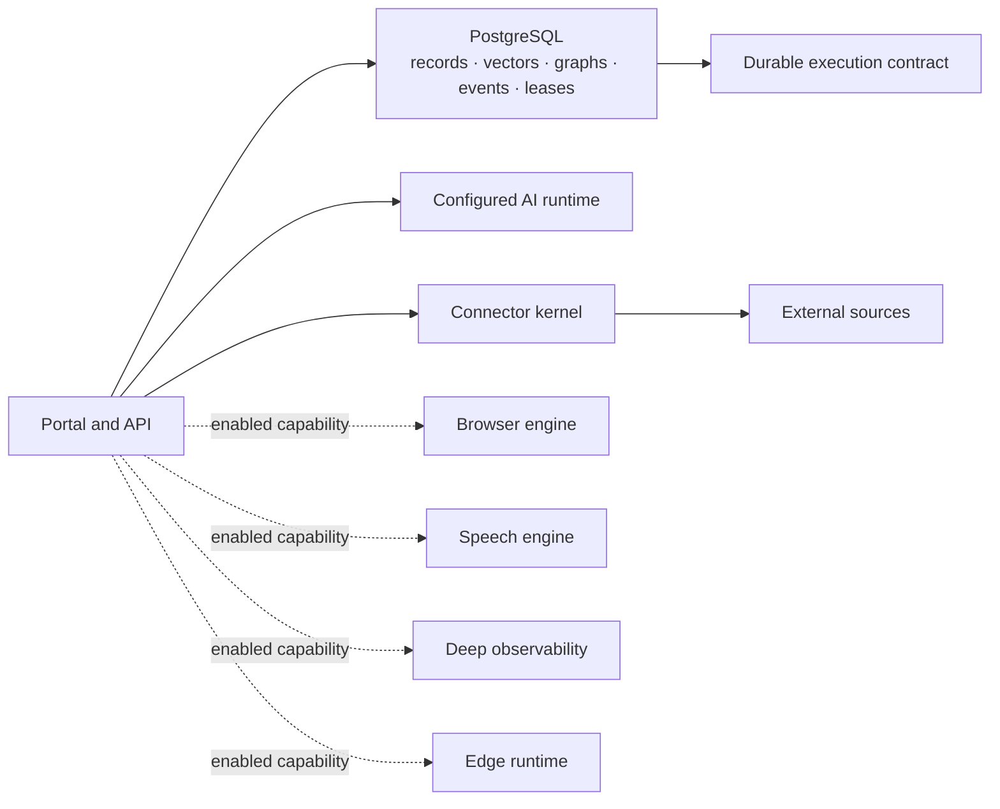

# Platform Substrate Convergence Design

**Date:** 2026-07-17  
**Status:** Review — implementation limited to BI-PSC-001 evidence foundation until the architecture gates below are satisfied  
**Epic:** EP-PLATFORM-SUBSTRATE-CONVERGENCE  
**Backlog:** BI-PSC-001 through BI-PSC-011  

## 1. Goal

Converge DPF around one universal platform substrate while preserving specialist engines only where workload, isolation, hardware, protocol, distribution, or scale requirements justify a separate runtime. Reduce default moving parts, duplicated source-integration plumbing, vendor leakage, oversized orchestration modules, and data-model/seed fragmentation without weakening durability, observability, or rollback.

## 2. Context and evidence

The prior Platform Consolidation Spine completed portable contracts, scoped MCP tool packs, Delivery IA, Build Studio namespace convergence, shared section navigation, and package-boundary rules. Neo4j and Qdrant were subsequently removed in favor of PostgreSQL-native graph and vector capabilities.

The remaining evidence on `origin/main` is different in kind:

- The Prisma schema owns 494 models in one file.
- Direct Inngest terminology appears across 221 files, coupling domain code to an executor.
- Connection state, credential lookup, authentication, callback, health, audit, sync, and setup behavior repeat across provider integrations.
- The default Compose surface includes universal services and capability-specific engines in the same operational contract.
- Large orchestration hotspots remain, including the agentic loop, coworker actions, MCP composition, Build Studio, and build orchestration.
- The live optimization epic still contains BI-OPT-FAT-ACTIONS, which is complementary work and must not be duplicated here.

## 3. Governing decisions

### 3.1 One canonical data plane

PostgreSQL is authoritative for canonical records, relationships, embeddings, execution state, leases, schedules, durable events, receipts, and core operational truth. Specialist engines may compute or execute, but they do not become a second authority for shared entities.

### 3.2 Capabilities are logical; processes are physical

DPF may expose graph, memory, scheduling, connector, speech, browser, observability, and edge capabilities without requiring one permanent process per capability. A separate service needs an explicit boundary reason.

### 3.3 Default infrastructure serves universal contracts

Universal install substrate is limited to PostgreSQL, the portal, and lifecycle initialization. Build sandboxes, browser automation, durable-automation executors, local speech, deep telemetry, development runtimes, and integration harnesses are capability-activated, test-only, or separately deployed.

### 3.4 Contain before replacing

Vendor-specific APIs are first moved behind platform contracts. Removal happens only after behavioral, failure-mode, performance, migration, and rollback parity is proven.

### 3.5 Collapse accidental seams, preserve real boundaries

Runtime, trust, hardware, distribution, protocol, and independent-scaling boundaries remain. Package, service, route, or model seams without one of those reasons are candidates for convergence.

### 3.6 Existing architecture remains authoritative until explicitly amended

This spec is a convergence overlay, not a silent reset. Existing execution and integration contracts remain authoritative as mapped below.

| Existing artifact | Current authority | This epic's relationship |
| --- | --- | --- |
| `2026-04-29-coworker-execution-adapter-substrate-design.md` | Inngest is the durable outer shell; adapters isolate execution mechanics. | Adopt the adapter boundary. BI-PSC-004 generalizes it across domains. No executor replacement occurs unless BI-PSC-005 produces a separately approved supersession decision. |
| `2026-06-09-build-studio-durable-execution-migration.md` | Build Studio durable execution and evidence already migrated toward Inngest. | Preserve completed migrations. Replace direct imports with the common adapter only when behavior remains identical; do not reverse completed workflow decomposition. |
| `2026-04-12-unified-capability-and-integration-lifecycle-design.md` | `PlatformCapability`, Integration, Adapter, stable identifiers, lifecycle, and health are canonical. | Extend, do not duplicate. `ConnectorDefinition` is a typed projection/adapter registration keyed to the existing canonical Integration/Capability records. |
| `docs/architecture/mcp-tool-packs.md` | Domain-owned tool packs are the AI capability boundary. | Connector operations may project into tool packs; connector definitions do not become a second tool registry. |
| `docs/superpowers/specs/2026-05-09-deployment-contracts.md` | Cross-platform deployment doctrine and ownership. | Capability/service projections must conform; changes amend the owning deployment specs and watchlist. |

Any later decision that contradicts these artifacts must name the exact superseded sections, migrate active records/workflows, and update backlinks in the same PR.

## 4. Target architecture



## 5. Runtime classification

| Component | Classification | Direction |
| --- | --- | --- |
| PostgreSQL + pgvector | Universal core | Keep and expand as the canonical hybrid substrate. |
| Portal | Universal core | Keep as the domain and synchronous orchestration host. |
| portal-init | Ephemeral lifecycle job | Keep initially; converge install-target migration and seed contracts. |
| Redis + Inngest | Replaceable execution implementation | Contain behind one contract; benchmark PostgreSQL and hybrid alternatives. |
| Sandbox DB/runtime | Build capability | Activate only for installs that build or verify software. |
| Browser engine | Browser capability | Preserve isolation; lazy-start behind one execution contract. |
| STT/TTS | Speech capability | Local containers activate only when selected. |
| Prometheus/Loki/Alloy/exporters/Grafana | Deep-observability capability | Keep optional; core health remains available without them. |
| ADP service | Optional connector adapter | Share connector lifecycle; preserve process boundary only if justified. |
| Integration harness | Test-only | Exclude from production topology. |
| Edge runtimes | Separate distribution/trust boundary | Preserve. |

BI-PSC-001 must replace this directional table with an exhaustive checked-in inventory before BI-PSC-003 edits topology. The inventory covers every Compose service and external AI runtime, including profiles, ports, volumes, canonical data ownership, backup inclusion, health semantics, dependencies, supported host platforms, and target classification. An unclassified service is a failing guard.

## 6. Workstreams

### 6.1 Measurement and ratchets — BI-PSC-001

Create a versioned substrate manifest and reproducible measurement script covering service classification, default service count, execution-vendor import surface, connector boilerplate, schema/model size, seed size, and large production modules. CI ratchets prevent regression. Runtime measurements that require a canonical install are recorded separately from static source measurements.

Deterministic definition of done:

- 100% of Compose services are classified; zero missing and zero duplicate service keys.
- Every non-core service has one boundary reason and capability key.
- Static measurements are reproducible byte-for-byte except timestamp/SHA provenance.
- Every static and discrete-runtime non-increasing metric fails on `baseline + 1`, passes unchanged, and reports an improvement below baseline in fixtures. Runtime RSS metrics use the documented five-percent sampling/noise envelope: values at the boundary pass and values above it fail.
- Evidence lives in `scripts/platform-substrate-baseline.json`; architecture semantics live in `docs/architecture/platform-substrate-boundaries.md`.

### 6.2 Unified connector kernel — BI-PSC-002

Introduce a narrow `ConnectorDefinition` and shared lifecycle for credential storage, authentication, refresh, callbacks, capability declaration, health, audit, retry, sync, and setup-state projection. Provider adapters own vendor semantics and source-to-canonical mapping only. Migrate two representative providers before wider rollout.

Named proof providers are Microsoft 365 Communications (OAuth authorization code/refresh and communication capabilities) and Postmark email (API credential plus inbound webhook). Definition of done: both use the shared connection projection, health contract, audit envelope, and error taxonomy; their existing connect/callback/webhook happy and degraded paths pass; and a guard rejects new provider-local OAuth refresh or connection-state mapping outside adapters.

### 6.3 Capability-driven runtime profiles — BI-PSC-003

Make service requirements derive from enabled capabilities. Install, upgrade, health, backup, and diagnostics consume the same manifest. Optional services do not make an install unhealthy when their capability is disabled.

Definition of done: five fixtures (`core`, `build`, `local-speech`, `deep-observability`, `external-ai`) resolve deterministically; dependency cycles fail; disabling a capability with queued/running work returns `drain_required`; and `/platform/ai/runtime-health` plus the system-health surface distinguish Required, Optional inactive, Optional degraded, and External without color-only meaning.

### 6.4 Durable execution convergence — BI-PSC-004 and BI-PSC-005

Define a vendor-neutral contract for event publication, schedules, idempotency, leases, retries, cancellation, progress, receipts, recovery, and upgrade quiescence. Remove direct executor imports from domain modules. Benchmark existing Inngest+Redis, PostgreSQL execution using durable attempts with locking, and a hybrid model. Delete infrastructure only if the alternative passes crash, concurrency, schedule, observability, and rollback gates.

BI-PSC-004 is complete when every domain publisher uses the contract, direct `inngest` imports remain only in the adapter/composition allowlist, and the existing Build Studio/coworker acceptance suite passes without semantic changes. BI-PSC-005 produces an architecture decision; it does not delete infrastructure.

### 6.5 Data-model and seed decomposition — BI-PSC-006 and BI-PSC-007

Keep one PostgreSQL authority while adding bounded-context schema ownership, cross-domain relation governance, ordered idempotent seed packs, checksums, and capability-aware optional corpora. Migration history remains immutable.

Schema ownership is organized by bounded-context files plus an explicit `shared-kernel` file. A relation crossing contexts requires an ownership-registry entry naming the authoritative side and lifecycle rule. Multi-file conversion must produce no SQL migration, no generated-client API diff, and no migration checksum change.

Seed packs form a directed acyclic graph. Cycles fail validation. A pack runs in one transaction unless its manifest explicitly declares checkpointed batches and compensating recovery. Checksums version pack content; changed checksums rerun only packs declaring `reconcile` compatibility. Mixed-release fleets use expand → dual-read/write where required → backfill → contract, never destructive same-release assumptions. Verification includes clean install, upgrade from the previous release fixture, interrupted pack restart, rollback to the pre-upgrade recovery point, reseed/no-wipe, and archetype swap.

### 6.6 Observability hybridization — BI-PSC-008

Core operational truth includes health, execution state, errors, alerts, receipts, and upgrade evidence in the platform data plane. Deep high-volume telemetry remains an optional specialist profile. PostgreSQL does not become a high-cardinality log store.

Binary proof fixtures:

- Core-only healthy: portal/PostgreSQL health, job/execution state, latest upgrade evidence, actionable alerts, and receipts remain visible; deep telemetry is `optional_inactive`, not degraded.
- Core-only incident: portal and PostgreSQL failures create visible actionable state without Prometheus/Loki/Alloy.
- Deep enabled healthy: Prometheus scrape, Loki log ingest, Alloy forwarding, exporter targets, and Grafana links are healthy.
- Deep telemetry loss: core health remains reachable and labels deep telemetry `optional_degraded`; no false “platform healthy” claim for the missing deep capability.
- Retention: core operational records follow existing platform retention; raw telemetry follows the deep-profile retention configuration and is never copied into PostgreSQL.
- Soak: 24 hours for core-only and deep-enabled profiles with zero lost core alerts/receipts and no unbounded PostgreSQL growth attributable to raw telemetry.

### 6.7 Specialist provider contracts — BI-PSC-009

Unify local and external browser/speech implementations around readiness, capability metadata, invocation receipts, fallback semantics, activation, and resource accounting while preserving isolation.

Named proof providers are local `dpf-stt` and the configured external STT provider, plus local `browser-use` and the existing external/browser-session adapter. Required assertions: disabled returns `capability_not_enabled` without starting a process; enabled local cold-start reaches ready within 30 seconds on the reference host or returns typed degraded state; idle capability stops within 60 seconds when no lease/work remains; degraded local falls back only when policy and grants allow it; every attempt emits provider, duration, success/error class, and CPU/GPU/memory accounting when observable; secrets and browser profile data are absent from receipts. Run 500 invocations per provider path with zero missing receipts and zero unauthorized fallbacks.

### 6.8 Archetype contribution convergence — BI-PSC-010

Define a typed internal contribution contract for templates, capabilities, seed packs, navigation contributions, applicability rules, and acceptance tests. Retain separate packages only for independent distribution.

The named proof archetype is `professional-services`. Before implementation, a generated golden fixture records exact sorted keys for activated capabilities, seed-pack ids/checksums, navigation route ids, applicability rule ids/results for the canonical demo business context, and acceptance-test ids. Definition of done is byte-for-byte parity of those sorted keys/results before and after migration, zero duplicate contribution keys, and the existing professional-services acceptance suite passing. Intentional changes require a separately reviewed golden-fixture update and are not counted as parity.

### 6.9 Evidence-approved deletion — BI-PSC-011

Apply removals only after parity. Update install and deployment doctrine, platform-support watchlist, backups, rollback, health, and operator UX. Record before/after complexity and runtime evidence.

## 7. Connector contract

```ts
export type ConnectorDefinition = {
  key: string;
  displayName: string;
  capabilities: readonly string[];
  auth: ConnectorAuthStrategy;
  operations: readonly ConnectorOperation[];
  health: ConnectorHealthPolicy;
  sync?: ConnectorSyncPolicy;
  authorities: readonly DataAuthorityPolicy[];
};
```

The definition is declarative. Secrets, tokens, provider clients, and executable functions are never stored in it. The shared kernel resolves implementations by canonical key and emits existing integration audit records. `ConnectorDefinition.key` maps to the canonical Integration stable key from the unified capability/integration lifecycle; it does not create another persisted registry.

## 7.1 Authoritative artifact map

| Artifact | Owner/storage | Versioning | Consumers |
| --- | --- | --- | --- |
| `PlatformSubstrateManifest` | Source JSON under `scripts/`; Architecture/Deployment | Explicit schema version; PR-reviewed | Measurement guard and BI-PSC-003 generator only |
| `PlatformCapability.manifest` | Existing PostgreSQL capability model | Existing lifecycle/version semantics | Product capability resolution |
| `ConnectorDefinition` | Source TypeScript definitions keyed to canonical Integration records | Code release version plus stable connector key | Connector adapters, setup projection, tool-pack projection |
| `CapabilityServiceProjection` | Generated from substrate + capability manifests | Generated artifact; no hand edits | Install, upgrade, health, backup, diagnostics |
| `ArchetypeContribution` | Existing template/archetype source packages | Archetype schema version | Activation, seed, navigation, applicability, acceptance tests |

“Single source” means one authority per concern, not one universal manifest. Install, upgrade, health, backup, and diagnostics consume `CapabilityServiceProjection`; they never independently maintain service lists.

## 8. Durable execution contract

The platform contract must support:

- enqueue and publish with idempotency;
- one-time and recurring schedules;
- claim/lease/heartbeat;
- bounded retry and backoff;
- cancellation and quiescence;
- progress and operator-visible receipts;
- crash recovery and dead-letter handling;
- per-organization and resource-lane limits;
- executor-independent correlation identifiers.

Domain modules cannot import the concrete executor client after migration. The composition root selects an implementation.

Correctness semantics:

- Delivery is at-least-once at the attempt boundary; externally visible side effects require idempotency or compensation.
- Idempotency keys are scoped by organization, operation kind, and logical execution id and retained for at least the longest retry/redrive window plus 24 hours.
- Lease claims carry monotonically increasing fencing tokens; a stale holder cannot commit after reassignment.
- Lease acquisition and attempt-state transition are atomic in the authoritative store.
- Side-effect publication uses a transactional outbox when canonical state and event intent must commit together; consumers use an inbox/deduplication record where effects are not naturally idempotent.
- Schedule ownership is singular per schedule id; UTC database time is authoritative and workers may not use host wall clocks for eligibility.
- Failover arbitration is authority-store based; two executors cannot both own an active fenced lease.
- Cancellation prevents new steps and marks in-flight work for cooperative cancellation; compensation is explicit per operation.

These semantics apply to the existing Inngest adapter and any benchmark adapter. An implementation that cannot satisfy them is ineligible rather than “close enough.”

## 8.1 Capability operational state

```text
disabled -> enabling -> enabled
enabled -> draining -> disabled
enabled -> degraded -> enabled
enabled|degraded -> draining -> disabled
enabling -> failed -> disabled
```

The canonical capability lifecycle service owns transitions. Dependency resolution occurs before `enabling`; missing or cyclic dependencies fail closed. `draining` blocks new work, waits for or cancels existing work according to operation policy, and records quiescence evidence. Upgrade preserves the prior enabled set and recomputes projections before service swaps. Health is a projection of desired state plus observed runtime state, never the transition authority.

## 9. UI and operator experience

Excellent UI means infrastructure is explained as capabilities, not container trivia.

- Setup presents optional capabilities with benefit, footprint, requirements, and fallback.
- Health shows Required, Optional inactive, Optional degraded, and External states.
- Disabled capabilities do not render false red status.
- Connector setup uses a shared wizard shell with provider-specific fields through progressive disclosure.
- Removal decisions and benchmark evidence are visible in the Optimization/Architecture surface.
- All styling uses DPF theme variables and shared operational primitives.

## 10. Error handling and degradation

- Missing optional engines return typed `capability_not_enabled`, not generic connection errors.
- Enabled but unavailable engines return `capability_degraded` with last evidence and governed recovery action.
- Connector failures preserve source, operation, retryability, credential state, and audit reference without leaking secrets.
- Executor failover never runs the same logical operation twice unless its idempotency contract permits it.
- PostgreSQL remains available during optional-engine recovery; optional-engine failure cannot corrupt canonical state.

## 11. Removal gates

A service or package may be removed only when:

1. Its canonical data already lives elsewhere.
2. Its differentiated capability has disappeared or become optional.
3. Functional and failure-mode parity passes.
4. Migration and rollback are proven.
5. Operator health and diagnostics become simpler.
6. Source and runtime measurements show net complexity reduction.
7. Cross-platform install contracts and the support watchlist are updated.

## 11.1 Numeric durable-execution parity gate

The BI-PSC-005 corpus contains short idempotent tasks, checkpointed multi-step workflows, waits, schedules, per-org concurrency, cancellation, retryable and terminal failures, and Build Studio/coworker production exemplars.

| Gate | Required threshold |
| --- | --- |
| Corpus completion | 100% of required scenarios pass on existing and candidate adapters |
| Concurrency | 1,000 queued executions, 50 active workers, per-org limits of 1/5/10; zero limit violations |
| Duplicate committed effects | 0 across 100,000 logical executions with injected worker death; duplicate attempts are allowed only when deduplicated before commit |
| Lost executions | 0 across the corpus and soak |
| Schedule drift | p99 ≤ 2 seconds for schedules ≥10 seconds; zero skipped schedules during restart tests |
| Lease recovery | p99 reassignment ≤ 2 × configured lease TTL; stale fencing token commits = 0 |
| Crash matrix | Kill before claim, after claim, before effect, after effect/before ack, during checkpoint, during drain; all recover to specified terminal state |
| Performance | p95 enqueue-to-start and completion throughput no worse than 15% below current Inngest baseline on the same host profile |
| Resource goal | Candidate must remove at least one default process or reduce measured idle RSS by ≥15% without increasing portal RSS by >10% |
| Soak | 24 hours, ≥250,000 executions, zero lost effects, zero unfenced duplicate commits, no unbounded table/queue growth |
| Backup/restore | Restore at three points (idle, queued, in-flight); 100% of durable states reconcile |
| Upgrade/rollback | Forward migration and rollback succeed from pre-migration and 50%-migrated dual-run states; rollback RTO ≤15 minutes on reference install |

Failure of any correctness, backup, or rollback gate forces `keep` or `hybrid`; performance/resource misses may be accepted only by a new operator-approved decision with quantified rationale. Redis/Inngest deletion is forbidden in BI-PSC-005 and requires BI-PSC-011 plus a separately reviewed removal decision.

## 11.2 Gate template for every other runtime removal

Observability, browser, speech, ADP, sandbox, lifecycle, and any newly discovered runtime each require a separate removal ADR. The ADR must define its domain-specific workload corpus and meet these minimums before BI-PSC-011 may remove or merge it:

| Gate | Minimum requirement |
| --- | --- |
| Dependency inventory | 100% of code, Compose, install, upgrade, backup, health, monitoring, documentation, and external consumers enumerated with owners |
| Functional parity | 100% of named required scenarios pass on incumbent and target |
| Failure injection | Process kill, dependency outage, network timeout, credential expiry where relevant, host restart, and upgrade interruption all produce specified typed states with no canonical-data corruption |
| Receipt/data integrity | Zero missing required receipts and zero unauthorized fallback across at least 10,000 operations, or 500 operations for hardware-bound speech/browser workloads |
| Soak | 24 hours on the reference install; zero unbounded canonical-store growth, lost required events, or unrecovered degradation |
| Performance | p95 latency/throughput no worse than 15% from incumbent unless the ADR records an operator-approved user-value tradeoff |
| Resource improvement | Remove at least one default process or reduce idle RSS by ≥15%; portal RSS may not increase by >10% |
| Backup/restore | Restore before migration and after 50% dual-run/migration; all retained canonical state reconciles |
| Cross-platform | Windows plus macOS/Linux contract or an explicit profile exclusion recorded in the platform-support watchlist |
| Rollback | Automated or runbook-proven rollback RTO ≤15 minutes on the reference install; cutoff criteria defined before rollout |
| Retained data | Owner, retention, export/migration, and secure deletion disposition documented for every removed volume/table/file |

Any failed correctness, data, backup, cross-platform, or rollback gate means keep/hybrid. A generic checklist cannot authorize deletion.

## 12. Research and benchmarking

### 12.1 Open-source leaders

| Product | Data/runtime model inspected | Adopt | Reject / gap DPF fills |
| --- | --- | --- | --- |
| [Inngest self-hosting](https://www.inngest.com/docs/self-hosting), [concurrency](https://www.inngest.com/docs/guides/concurrency), and [retries](https://www.inngest.com/docs/guides/error-handling) | Event API → stream → runner → multitenant queue → executor; state store persists step/run state and Redis supplies queue/state behavior. Steps checkpoint results and retries resume from failed work. | Treat current step checkpointing, flow control, retries, and wait semantics as the incumbent parity floor. | Reject executor concepts leaking through 221 source files and a permanently enabled stack where durable automation is not enabled. DPF adds one governed authority/evidence contract across executor choices. |
| [Trigger.dev self-hosting](https://trigger.dev/docs/self-hosting/overview) and [queue concurrency](https://trigger.dev/docs/queue-concurrency) | Webapp and worker scale independently; self-hosted webapp includes PostgreSQL and Redis. Runs move through queued/executing/waiting states and checkpointed waits release concurrency. | Adopt explicit queued/executing/waiting semantics, shared queue limits, and separation of control plane from workers. | Reject adopting another multi-container orchestration product merely to reduce Inngest containers. DPF needs a smaller adapter seam, not a platform swap. |
| [Airbyte Connector Builder/CDK documentation](https://docs.airbyte.com/platform/connector-development/connector-builder-ui/overview) | Declarative connector manifests define streams, requesters, pagination, schemas, and incremental state; execution is separated from connection configuration. | Adopt declarative metadata for common connector lifecycle and explicit source-state/cursor handling. | Reject forcing every DPF integration into ELT streams. DPF connectors also expose governed actions, webhooks, and coworker tools. |

### 12.2 Commercial leaders

| Product | Data/runtime model inspected | Adopt | Reject / gap DPF fills |
| --- | --- | --- | --- |
| [AWS Step Functions error handling](https://docs.aws.amazon.com/step-functions/latest/dg/concepts-error-handling.html) and [redrive](https://docs.aws.amazon.com/step-functions/latest/dg/redrive-executions.html) | Immutable execution history with state-level retry/catch; redrive preserves successful state results and resumes failed states under the original definition/version. | Adopt explicit retry ownership, preserved successful checkpoints, version-pinned redrive, and operator-visible history. | Reject a cloud-only authority because DPF must remain sovereign/offline-capable. |
| [Workato connector model](https://docs.workato.com/en/connectors.html), [connections](https://docs.workato.com/en/connections.html), and [SDK structure](https://docs.workato.com/developing-connectors/sdk/sdk-reference.html) | Reusable connections authorize multiple recipes; connectors separate connection/test, actions, triggers, object definitions, pick lists, and reusable methods. | Adopt reusable connection records, standard test/health, and a crisp actions/triggers split. | Reject recipe/platform lock-in and a second automation model. DPF maps operations to existing capabilities, tools, and work governance. |
| [MuleSoft connection framework](https://docs.mulesoft.com/mule-sdk/latest/connections), [operations](https://docs.mulesoft.com/mule-sdk/latest/operations), and [provider guidance](https://docs.mulesoft.com/mule-sdk/latest/define-configurations-and-connection-providers) | Typed connection providers own connect/disconnect/validation; operations are separate classes and should not expose the underlying client. | Adopt connection-provider/operation separation and hide vendor clients from the public contract. | Reject heavyweight SDK/runtime adoption and connector-local lifecycle sprawl. DPF uses TypeScript adapters inside its existing integration authority. |

### 12.3 Decisions from research

Adopt one authority, ports/adapters, checkpointed execution, explicit operational states, reusable connections, capability activation, and measured deletion. Reject container-count-only optimization, executor replacement without incumbent parity, a universal plugin framework, PostgreSQL as a high-volume telemetry substitute, or a second integration database/registry.

## 13. Verification

Every slice follows the DPF build gate and TDD:

- targeted unit tests;
- typecheck for affected packages;
- production build through the canonical install or leased local-CI sandbox for runtime-bound changes;
- UX verification for setup, health, connector, or operational UI changes;
- migration validation and apply evidence when schema changes occur;
- before/after substrate measurements;
- live backlog and execution-evidence updates.

## 14. Refactoring allocation

At least 20% of each implementation slice is reserved for removing adjacent duplication and strengthening boundaries. Refactoring must serve the slice: shared connector lifecycle instead of new provider wrappers, composition roots instead of vendor imports, domain-owned seed packs instead of a new mega-registry, and shared UI primitives instead of page-local infrastructure UI.

## 15. Sequencing

1. BI-PSC-001 establishes evidence and ratchets.
2. BI-PSC-002 and BI-PSC-003 create connector and capability seams.
3. BI-PSC-004 contains durable execution; BI-PSC-005 decides implementation removal.
4. BI-PSC-006 and BI-PSC-007 decompose the data and seed substrate.
5. BI-PSC-008 and BI-PSC-009 make specialist engines optional and coherent.
6. BI-PSC-010 converges archetype contributions.
7. BI-PSC-011 performs evidence-approved deletions and closeout.

BI-OPT-FAT-ACTIONS remains owned by EP-PLATFORM-OPTIMIZATION and proceeds as a prerequisite/parallel dependency; this epic does not duplicate it.

## 15.1 Backlog traceability

Live backlog attestation: queried through the governed DPF MCP on 2026-07-17 after creation. Epic `EP-PLATFORM-SUBSTRATE-CONVERGENCE` is `in-progress`, priority 1, owner unassigned. Items `BI-PSC-001` through `BI-PSC-011` are live semantic identifiers, each `open`, triage outcome `build`, source `user-request`, owner unassigned. Implementation claims must re-query live state; this dated attestation is planning evidence, not a substitute for current status.

| BI | Deliverable | Depends on | Deterministic acceptance evidence |
| --- | --- | --- | --- |
| BI-PSC-001 | Substrate inventory, baseline, measurement CLI, ratchets | None | Checked-in baseline; guard fixture suite; 100% service classification |
| BI-PSC-002 | Connector definition/kernel and two migrations | 001; existing unified integration lifecycle | Microsoft 365 + Postmark connection/health/audit tests and UI evidence |
| BI-PSC-003 | Capability service projection and operational states | 001 | Five profile fixtures, drain/cycle tests, health UX evidence |
| BI-PSC-004 | Durable execution contract + Inngest adapter containment | 001; preserve existing execution designs | Direct-import guard; current workflow acceptance suite |
| BI-PSC-005 | PostgreSQL/hybrid benchmark decision | 004 | Numeric gate report and separately approved ADR |
| BI-PSC-006 | Schema ownership/multi-file decomposition | 001 | Zero migration SQL/checksum/client diff; ownership guard |
| BI-PSC-007 | Idempotent seed pack DAG | 006 | Clean/upgrade/interruption/rollback/no-wipe/archetype tests |
| BI-PSC-008 | Core/deep observability split | 003 | Core-only and deep-profile runtime/UX evidence |
| BI-PSC-009 | Speech/browser provider contracts | 003 | Disabled/degraded/local/external fixtures and invocation receipts |
| BI-PSC-010 | Archetype contribution contract | 002, 007 | Professional-services before/after parity report |
| BI-PSC-011 | Approved removals and closeout | 005, 008, 009, 010 | Removal gates, rollback, cross-platform, before/after report |

BI-OPT-FAT-ACTIONS is a parallel prerequisite for modules touched by BI-PSC work: a PSC PR may extend a domain core already extracted there, but may not re-own or close that BI. Epic ownership remains unchanged.

## 16. Acceptance criteria

- `PlatformSubstrateManifest` classifies all universal and capability-activated substrate; each other concern retains the distinct authority named in section 7.1.
- Source and runtime complexity budgets are reproducible and ratcheted.
- External sources share one connector lifecycle with representative migrations.
- Domain code depends on a durable execution contract, not Inngest.
- The PostgreSQL/hybrid execution decision is evidence-backed.
- Schema and seed ownership are bounded without creating additional databases.
- Core health works without deep telemetry.
- Speech and browser engines share provider contracts and activate lazily.
- Archetype contributions have one typed contract.
- Any removed service passes the removal gates and has rollback evidence.
- All backlog items are done or deliberately deferred with operator-approved rationale.

Acceptance is evaluated from the BI matrix and numeric gates above. Terms such as “representative,” “works,” “bounded,” or “evidence-backed” do not independently satisfy review.
