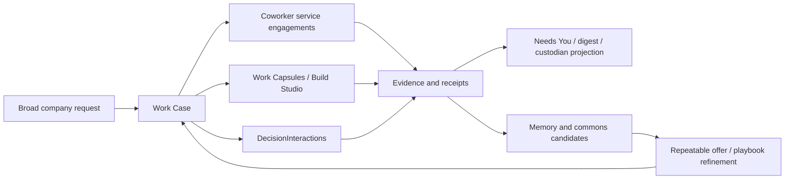

# Town-Informed Company Work Loop

| Field | Value |
| --- | --- |
| Status | Design approved; implementation resumed 2026-09-06 under live BI-0EA09322 |
| Date | 2026-07-24 |
| Trigger | Founder asked to research Town.com-style assistant/workflow lessons and land the useful parts in DPF company scope, not as a standalone prototype. |
| Governing epic | EP-2984B02B - Work Case / Company Work Management |
| Primary backlog | BI-0EA09322 - Project coworker service engagements into Work Case company work |
| Related surfaces | Workspace, Needs You inbox, Work Case, Work Capsule, Coworker Service Catalog, coworker memory, Authority/Audit |
| Extends | 2026-06-27-work-management-architecture-design.md; 2026-06-23-human-attention-surface-design.md; 2026-06-29-layer-scoped-work-capsules-design.md; 2026-06-30-coworker-service-offer-catalog-design.md; 2026-07-21-memory-trust-and-evidence-currency-design.md |


> **Rescue note (2026-08-16).** Recovered from a branch that was pushed and never proposed as a PR, found in the 2026-08-15 never-proposed-branch sweep. **The design landed here; the implementation did not.**
>
> - Tracked by `BI-3B01B725` (recovered tail designs). Read it before acting on this document.
> - Preserved implementation: `doc/town-company-work-loop` @ `d903bac20cad8297e68ae5e54f010805c68719d5`, pinned at `refs/salvage/2026-08-15/doc/town-company-work-loop` and listed in `~/dpf-deleted-remote-branch-tips-2026-08-15.txt`. Restore with `git push origin d903bac20cad8297e68ae5e54f010805c68719d5:refs/heads/doc/town-company-work-loop`.
> - Backlog labels cited below that do **not** resolve in this install: `historic-F309BB95`. Treat them as historic labels, not links.
> - Live implementation item for the DPF-native projection gap: `BI-0EA09322` (Project coworker service engagements into Work Case company work).
> - Current exercise evidence: `docs/superpowers/evidence/2026-09-06-town-informed-company-work-loop-exercise.md`.
> - No coverage receipt is recorded and none should be until a thread actually starts — a receipt bound to unstarted work would be fiction. This document is deliberately outside the plan-backlog-coverage gate (it carries no bolded backlog-item metadata line).

## 1. Thesis

The useful Town.com lesson for DPF is not "build a personal assistant." It is:

> Repeated knowledge-work loops should become governed, observable company work that the AI coworker can prepare, run, pause, ask about, and improve without making the human maintain the system's awareness by hand.

In DPF, the landing object is the **Work Case**. A Town-style routine becomes either:

1. A **repeatable coworker service offer** when it is requestable work.
2. A **scheduled/proactive attention producer** when it watches for operational state.
3. A **Work Case playbook/exercise pattern** when it coordinates multiple coworkers toward one company outcome.

The human-facing surface remains `/workspace`: one "What needs you now" inbox for decisions, with the digital team handling ordinary recovery, status gathering, and weekly digest material. The system-facing substrate remains Work Case over `WorkItem`, `WorkCapsule`, `DecisionInteraction`, `Principal`, `AuthorityBinding`, evidence, receipts, coworker service engagements, and memory notes.

This spec therefore lands Town.com-style lessons as a **Company Work Loop**:

```
Company outcome -> Work Case -> coworker services/routines -> evidence/receipts -> Needs You decisions -> memory/commons -> improved repeatable offer
```

## 2. Why This Is DPF-Relevant

The previous standalone prototype was correctly rejected because it created a separate product grammar. DPF already has the primitives this work needs:

- `Work Case` is the company-facing projection and policy envelope for outcomes.
- `Work Capsule` is the execution segment for scoped work, including AI and external coding-agent work.
- `DecisionInteraction` is the WWMD/WWWD/WSID and human-decision ledger.
- `AuthorityBinding`, `Principal`, and tool grants define who can act and under what approval posture.
- `CoworkerService`, `CoworkerOffer`, and `CoworkerEngagement` define requestable coworker capabilities.
- The Attention Surface owns "what needs the human now" and must not become a second backlog.
- Coworker memory and memory trust work are already moving toward experience-derived, evidence-scoped learning.

The right question is not "Where do we put a Townie?" It is "Can one DPF company outcome stay coherent while multiple coworkers, routines, approvals, memory notes, and build work all contribute?"

The historic-F309BB95 exercise label is the right proof point because it already asks for a multi-coworker municipal services launch-readiness exercise with strategy, architecture, compliance, storefront, finance, operations, Build Studio, and QA coworkers. That is a company setting, not a personal productivity setting.

## 3. Non-Goals

- Do not create a new assistant app, dashboard, task manager, or "Town clone."
- Do not create a new persisted Work Case table.
- Do not add a second attention inbox, second backlog, or second coworker catalog.
- Do not let email/chat/message channels become the durable work model.
- Do not grant autonomous action because Town markets autonomy. Consequential writes still go through governed actions, approvals, and receipts.
- Do not store broad personal-style memory as authority. Reusable learnings route to WWWD/WSID/commons; install/user facts stay scoped and reviewable.
- Do not file follow-on backlog items from vibes. File them only when the exercise proves a missing affordance.

## 4. Research And Benchmarking

### 4.1 Town.com Pattern

Town positions its assistant around learning how the user works, then handling repeated work quietly in the background. Its public site and routine library emphasize:

- prebuilt and user-described routines for inbox, calendar, meeting prep, relationships, operations, and status updates;
- proactive briefings such as morning briefings, meeting briefings, contact research, competitive-intel briefings, and schedule optimization;
- team/company artifacts such as team routines, skills, integrations, and members;
- broad integrations across communication, calendar, docs, CRM, file storage, project management, data/analytics, development, and finance;
- safety posture that the assistant only touches needed data and requires approval for consequential email/calendar action.

Sources: [Town](https://www.town.com/), [Town Routines](https://www.town.com/routines), [Town Safety](https://www.town.com/docs/safety), [Town Product Hunt](https://www.producthunt.com/products/town).

Adopt:

- routines as a first-class packaging shape;
- proactive "need to know" briefings;
- assistant/coworker memory that improves repeated work;
- integration breadth, but only through DPF's tool evaluation, grants, and authority model;
- approval-before-action as a visible product affordance.

Reject:

- individual-first assistant identity as the system-of-record;
- email-native forwarding as the main work intake;
- broad learned preferences becoming hidden authority;
- opaque autonomous execution outside governed DPF receipts.

### 4.2 Open-Source / Protocol Benchmarks

| Benchmark | Adopt | Reject |
| --- | --- | --- |
| [LangGraph human-in-the-loop](https://docs.langchain.com/oss/python/langchain/human-in-the-loop) | Durable pause/resume, explicit approve/edit/reject/respond decisions, persisted state before sensitive action. | Treating HITL as generic chat feedback rather than a source-owned governed action. |
| [Agent Inbox](https://github.com/langchain-ai/agent-inbox) | Small human response grammar for interrupted work; one inbox for action-needed agent interrupts. | A generic external inbox that duplicates DPF's Attention Surface. |
| [A2A task specification](https://github.com/a2aproject/A2A/blob/main/docs/specification.md) | Task lifecycle alignment: submitted, working, input-required, auth-required, completed, failed/canceled/rejected; context grouping. | Replacing Work Case with a foreign task table. DPF maps to A2A rather than surrendering its source truth. |

### 4.3 Commercial Benchmarks

| Benchmark | Adopt | Reject |
| --- | --- | --- |
| [Linear agent interaction](https://linear.app/developers/agent-interaction) | Agents emit semantic activities to an AgentSession; humans see work progress inside the existing issue/work object. | One surface per agent or exposing executor plumbing as the default experience. |
| [Asana AI Teammates](https://asana.com/resources/ai-teammates-overview) | Agents operate inside team workflows, coordinate work, and take context-aware action with visible collaboration. | Personal-assistant framing when the problem is team/company coordination. |
| [ServiceNow AI Control Tower](https://www.servicenow.com/products/ai-control-tower.html) and [Microsoft Entra Agent ID](https://learn.microsoft.com/en-us/entra/agent-id/what-are-agent-identities) | Enterprise visibility, identity, lifecycle, risk, compliance, runtime monitoring, and sponsors for AI agents. | A dashboard-only governance surface that is not tied to governed work transitions. |

### 4.4 Internal DPF Benchmarks

| DPF substrate | Relevant lesson |
| --- | --- |
| Work Management Architecture | Work Case is the company-facing object and governed write envelope. |
| Attention Surface | "Needs You" is decisions now, not scheduled work or backlog. |
| Layer-Scoped Work Capsules | Work Capsules can attach to company outcomes beyond platform backlog items. |
| Coworker Service Offer Catalog | Repeated work belongs in service offers and engagements, then process refinement. |
| Memory Trust and Evidence Currency | Learned context must carry provenance, freshness, and authority limits. |
| Collaborative Work Management Convergence Memo | Durable unit, named workers, plain status, approval/revise loop, no last-mile cliff. |

## 5. DPF Landing Decision

Land Town.com-style lessons as **an exercise-backed Work Case addendum** under EP-2984B02B and BI-0EA09322.

The municipal services launch-readiness exercise becomes the proving run:

1. Start from AI Readiness with one broad business request: "Prepare a launch-readiness package for a small municipal services portal."
2. Capture the request as a Work Case, not a platform backlog item by default.
3. Decompose into strategy, architecture, compliance, storefront, finance, operations, Build Studio, and QA coworker contributions.
4. Route each contribution through coworker service offers or scoped Work Capsules where appropriate.
5. Keep all decisions, blockers, evidence, receipts, memory notes, and Needs You escalations attached to the same Work Case.
6. Record the exercise transcript and summary.
7. File follow-on backlog items only for gaps proven by the exercise.

This is "Town for company work" in DPF language: not a chatbot that learns a person, but a governed company-work loop that learns from completed work and turns repeatable patterns into safer, more useful coworker services.

## 6. Concept Mapping

| Town.com concept | DPF-native concept | Landing rule |
| --- | --- | --- |
| Townie assistant | AI Coworker / named Agent Principal | Coworker identity stays in the AI Workforce; sponsors and grants govern action. |
| Routine library | CoworkerOffer / process-refinement candidate / scheduled source | Repeated work is packaged only after evidence shows recurrence and usefulness. |
| Morning or meeting briefing | Attention weekly digest / Work Case packet / coworker briefing | Briefings summarize source-owned state; they do not become source truth. |
| Need-to-know surface | Needs You inbox | Only real human decisions count; technical recovery stays with the digital team. |
| Inbox/calendar/doc/CRM integrations | DPF connectors and MCP tools | Tool evaluation, grants, data boundary, and ToolExecution receipts apply. |
| Approval mode | AuthorityBinding / AgentActionProposal / governed Work Case Action | Approval is per transition/action, not a marketing toggle. |
| Learns voice and preferences | Coworker memory, UserFact, WWWD/WSID/commons | Memory is scoped, reviewable, and promoted only with evidence. |
| Team routines | Work Case playbooks and aggregate coworker offers | Team/company work attaches to an outcome and evidence trail. |

## 7. Exercise Design

### 7.1 Scenario

Small municipal services portal launch-readiness.

The company outcome:

> Prepare a launch-readiness package that lets a small municipality accept resident service requests, route them to the right operational team, expose status safely, and know what needs human approval before public launch.

### 7.2 Coworker Roles

| Role | Expected contribution | Work Case attachment |
| --- | --- | --- |
| Strategy / COO | Define launch goal, stakeholders, success criteria, and operating risks. | Work Case business brief and decision scope. |
| Enterprise Architect | Validate architecture, data boundaries, and reuse of existing DPF primitives. | DecisionInteraction and architecture evidence. |
| Compliance / Legal | Identify public-sector, privacy, retention, accessibility, and approval constraints. | Governed decision and compliance packet. |
| Storefront / Product | Define resident-facing portal flow and service request lifecycle. | Outcome anchor and candidate Build Studio brief. |
| Finance | Identify fees, refunds, payments, procurement, and accounting implications. | Approval/risk notes and potential finance service offer. |
| Operations / Dispatcher | Define routing, assignment, SLA, field-work, and exception handling. | Work Case source registry and field-dispatch source mapping. |
| Build Studio | Scope implementation work only after readiness gates are clear. | Work Capsule and FeatureBuild links. |
| QA / Assurance | Define launch checklist, evidence requirements, and acceptance tests. | Verification receipts and timeline evidence. |

### 7.3 Required Exercise Artifact

Create a human-readable exercise summary at:

`docs/superpowers/evidence/2026-07-24-town-informed-company-work-loop-exercise.md`

The summary should include:

- initial broad request;
- decomposition transcript or compact turn-by-turn summary;
- coworker responsibilities;
- Work Case identity/source references used;
- decisions and blockers;
- at least one Needs You item created by a human approval, blocker, or consequential decision in the scenario;
- evidence and receipt links;
- repeated-work/routine candidates;
- memory/commons candidates;
- gaps found;
- follow-on backlog items filed.

The summary should also record explicit "none found" entries for follow-on backlog items, repeated-work/routine candidates, memory/commons candidates, and implementation gaps when the exercise does not prove one. Absence should be an observed result, not an omitted section.

Each coworker contribution should name:

- the source reference it is acting from;
- the expected output packet;
- the approval trigger, if any;
- the evidence or receipt required before the contribution can be treated as complete.

If live runtime readiness remains blocked, the first exercise can be a source-grounded dry run using current Work Case/Coworker Service Catalog code and live backlog records, with the limitation explicitly recorded. A dry run is sufficient for implementation planning only when it proves a documentable model, schema, read-model, or UI composition gap from current source code and specs. A dry run is not sufficient to claim live integration across Work Case, Coworker Service Catalog, or Needs You; if the selected implementation plan depends on live event routing, live service engagement projection, or live attention delivery, a runtime exercise is mandatory before code work starts.

## 8. Gap Hypotheses To Prove Or Disprove

These are not backlog items yet. They are hypotheses the exercise must test.

### 8.1 CoworkerEngagement As Work Case Source

The Work Case source registry includes `engagement` for CRM/customer engagement, but the coworker service catalog has `CoworkerEngagement` as a separate request/execution object. The exercise may prove that coworker engagements need a first-class Work Case source entry or a projection adapter so requested coworker services attach cleanly to the company outcome.

Evidence required: a coworker service engagement cannot be displayed, linked, or reasoned about from the Work Case without ad hoc metadata or source confusion.

### 8.2 Multi-Coworker Session Rollup

The exercise may involve several coworkers. DPF should avoid "N coworkers = N surfaces." The Work Case needs one coherent timeline and a small set of human-legible activity types.

Evidence required: the exercise produces useful work but the owner cannot tell which coworker is doing what, what is waiting, or which decision blocks the outcome.

### 8.3 Routine Promotion Edge

DPF has process-refinement analysis for coworker engagements. The exercise may show a repeated municipal-launch pattern that should become an aggregate offer or playbook.

Evidence required: the same request shape recurs or is likely to recur across archetypes, and the required inputs/outputs/approval rails can be named.

### 8.4 Needs You Source Coherence

The Attention Surface should show only real owner decisions. The exercise may show that Work Case blockers, coworker proposals, approvals, and memory notes do not all route consistently into `needs-you-now`, `weekly-digest`, or `custodian`.

Evidence required: an item that should interrupt the owner is missing, or a technical/digest item incorrectly inflates the daily decision count.

### 8.5 Memory And Commons Boundary

The exercise should produce local memory candidates and durable learning candidates. These must not collapse into one store.

Evidence required: a useful learning cannot be routed to coworker memory, WWWD, WSID, or commons with enough provenance and review state.

### 8.6 Work Case Read-Model Coverage

The workspace Work Case loader currently gives the operator a useful lens over work items. The exercise may show that Work Capsules, DecisionInteractions, coworker engagements, and verification evidence are present in source truth but too weakly projected in the case detail.

Evidence required: a source-owned record exists and matters to the company outcome, but the Work Case detail cannot surface it without manual prose.

## 9. Product Requirements

### 9.1 Owner Experience

The operator should be able to answer:

- What outcome are we trying to achieve?
- Who or what is working on it?
- What is blocked?
- What needs me now?
- What did the digital team already handle?
- What evidence exists?
- What repeated work should become easier next time?

The default UI language must stay business-facing. Internal IDs, branch names, provider names, raw logs, raw diffs, and queue mechanics stay behind technical disclosure.

### 9.2 Coworker Experience

Coworkers should receive a Work Case packet with:

- objective;
- allowed context;
- decision scope;
- authority mode;
- expected output;
- stop conditions;
- approval triggers;
- evidence/receipt requirements;
- memory/commons routing guidance.

### 9.3 Governance

Every consequential transition must:

- use a named governed action;
- evaluate current authority at invocation;
- preserve sponsor/accountable principal where required;
- emit or reference a receipt;
- route human decisions through Attention when action cannot proceed safely.

### 9.4 Learning

Completed work should produce:

- local coworker memory candidates for preference/context/caution when scoped to future coworker behavior;
- WWWD/WSID/commons candidates when reusable beyond one case;
- repeated-work candidates for coworker service offer or playbook refinement.

No learning is trusted by default. Freshness, source, review state, and scope determine how it is used.

## 10. Architecture And Data Flow



Implementation should prefer existing functions and read models:

- Work Case source registry and read model for source projection.
- Coworker Service Catalog for requestable service packaging.
- Attention aggregate/projection for owner-facing decisions.
- Work Capsules for scoped execution segments.
- DecisionInteraction for governed decisions.
- ToolExecution / receipt envelope / evidence records for audit.
- Coworker memory acquisition for evidence-scoped working notes.

## 11. UI And Refactoring Budget

The user requested strong UI design, architecture, and roughly 20% refactoring budget. For this arc, the refactoring budget should be spent only where it improves the approved landing:

- make Work Case source registry/read-model boundaries clearer if the exercise needs new source types;
- prefer `report-kit` primitives for tables, status badges, notices, and metrics;
- keep `/workspace` as one attention surface and avoid dashboard sprawl;
- avoid hardcoded colors or route-local status maps;
- reduce repeated mapping code only when a new Work Case source or coworker engagement adapter requires it.

Out-of-scope refactors:

- redesigning all Workspace pages;
- replacing Work Case, Attention, or Coworker Service Catalog;
- changing memory acquisition code unless the exercise proves a boundary bug.

## 12. Implementation Posture

This spec produces a small, evidence-first implementation plan, not a broad rewrite.

Recommended sequence:

1. Write this design spec.
2. Review it against Work Case, Attention, Coworker Service Catalog, and memory specs.
3. Create the municipal launch-readiness exercise artifact.
4. Run a source-grounded dry exercise if live runtime readiness is unavailable; record the limitation.
5. File follow-on backlog items only for proven gaps.
6. Implement the smallest missing adapter/refactor required by a proven gap.
7. Verify with focused tests and, for UI changes, desktop/mobile UX evidence.

No implementation should begin until the exercise has converted "possible gaps" into evidenced gaps. The exercise must include at least one owner-facing Needs You decision so the attention-surface path is actually tested rather than inferred.

## 13. Acceptance Criteria

The design is successful when:

1. Town.com research is captured as lessons mapped to DPF primitives, not as a standalone assistant.
2. BI-0EA09322 has a concrete exercise path grounded in the Work Case architecture.
3. The municipal services scenario can be described as one Work Case with multiple coworker contributions.
4. Needs You remains the only owner decision surface.
5. Repeat work is routed toward coworker service offers/playbooks, not new dashboard widgets.
6. Memory learnings are scoped and routed to coworker memory or commons with evidence.
7. Follow-on backlog creation is evidence-gated.
8. Any implementation plan has a bounded refactoring slice tied to source registry/read-model/report-kit consistency.

## 14. Open Questions For The Exercise

1. Should `CoworkerEngagement` become its own Work Case source type, or should it project through the existing `manual-task`, `scheduled`, or `engagement` source entries?
   - Answered by exercise artifact; blocks implementation if the chosen plan needs a new source adapter.
2. What is the smallest packet schema that lets each coworker contribute without full-case transcript replay?
   - Answered by exercise artifact; blocks implementation if no existing packet/evidence shape can represent the scenario.
3. Which decisions in the municipal launch scenario are WWWD, which are WSID, and which are WWMD because they change DPF itself?
   - Answered by exercise artifact; blocks implementation if decision tier cannot be mapped to existing `DecisionInteraction` semantics.
4. How should repeated municipal launch-readiness work become an aggregate coworker offer without becoming too generic?
   - Answered by exercise artifact; does not block the first implementation unless routine promotion is the proven gap.
5. What live-runtime path should replace the source-grounded dry run if the current live readiness blocker remains?
   - Blocks implementation only when the selected plan requires proving live routing rather than source-level model/read-model gaps.

## 15. References

- Town: https://www.town.com/
- Town Routines: https://www.town.com/routines
- Town Safety: https://www.town.com/docs/safety
- Product Hunt - Town: https://www.producthunt.com/products/town
- LangGraph human-in-the-loop: https://docs.langchain.com/oss/python/langchain/human-in-the-loop
- Agent Inbox: https://github.com/langchain-ai/agent-inbox
- A2A specification: https://github.com/a2aproject/A2A/blob/main/docs/specification.md
- Linear Agent Interaction: https://linear.app/developers/agent-interaction
- Asana AI Teammates: https://asana.com/resources/ai-teammates-overview
- ServiceNow AI Control Tower: https://www.servicenow.com/products/ai-control-tower.html
- Microsoft Entra Agent ID: https://learn.microsoft.com/en-us/entra/agent-id/what-are-agent-identities
- DPF Work Management Architecture: docs/superpowers/specs/2026-06-27-work-management-architecture-design.md
- DPF Attention Surface: docs/superpowers/specs/2026-06-23-human-attention-surface-design.md
- DPF Layer-Scoped Work Capsules: docs/superpowers/specs/2026-06-29-layer-scoped-work-capsules-design.md
- DPF Coworker Service Offer Catalog: docs/superpowers/specs/2026-06-30-coworker-service-offer-catalog-design.md
- DPF Memory Trust and Evidence Currency: docs/superpowers/specs/2026-07-21-memory-trust-and-evidence-currency-design.md
- DPF Collaborative Work Management Convergence Memo: docs/superpowers/specs/2026-07-11-collaborative-work-management-convergence-memo.md
