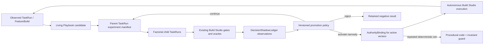

# Governed Playbook Experimentation and Autonomous Build Studio

> **2026-08-30 assurance extension:** WikiSkill and Anthropic's automated-researcher results expose
> evaluation-integrity and qualification-revalidation requirements beyond the shipped factorial
> runtime. The canonical extension is the [PAAW competence-evolution Workroom
> profile](2026-08-30-paaw-competence-evolution-workroom-design.md). This document remains the
> experiment and activation authority; the extension adds evaluator isolation, anti-gaming,
> target-profile transfer evidence, and a TAK-JSI revalidation interlock without a second runtime.

- **Status:** proposed
- **Date:** 2026-07-25
- **Primary BIs:** `BI-0A636528`, `BI-356E69B1`, `BI-522E754E`
- **Epic anchors:** `EP-COMPETENCE-FLYWHEEL`, `EP-BUILD-STUDIO`
- **Extends:** [`2026-06-27-governed-adaptive-playbooks-design.md`](2026-06-27-governed-adaptive-playbooks-design.md)
- **Autonomy contract:** [`2026-07-12-dpf-development-model-and-frontier-harness-positioning-design.md`](2026-07-12-dpf-development-model-and-frontier-harness-positioning-design.md) and [`2026-07-12-graduated-gate-autonomy-design.md`](2026-07-12-graduated-gate-autonomy-design.md)
- **Evidence-scope boundary:** [`../../architecture/customer-zero-and-use-case-zero.md`](../../architecture/customer-zero-and-use-case-zero.md)
- **Research reference:** [DeepReinforce Ornith-1](https://github.com/deepreinforce-ai/Ornith-1)

## 1. Executive decision

DPF should implement the useful lesson from Ornith as a governed runtime capability:

> Improve the method of work alongside the worker, prove the improvement through controlled evidence, and let Build Studio apply proven methods autonomously inside its existing risk and verification envelope.

The resulting capability is a **Governed Playbook Experimentation Loop**. It turns a Living
Playbook candidate from reviewed prose into an executable, versioned method variant; compares that
variant against the current method; records exactly which model, tools, context policy, recovery
policy, task corpus, install scope, and gates produced each result; and promotes only the scope the
evidence supports.

Build Studio is the first full consumer. For work eligible under the sister one-shot and
graduated-autonomy specs, it proceeds without human clicks through:

```text
governed intake
  -> ideate
  -> plan
  -> build
  -> review
  -> ship
  -> PR
  -> merge queue
  -> governed release/self-upgrade
  -> deployed completion
```

It may research, retry, repair, decompose, change execution provider, and select a proven playbook
variant within bounded policies. It may not bypass a build gate, invent evidence, silently raise
its authority, force-push queued work, mutate live customer state during an experiment, or cross a
regulatory or high-risk autonomy ceiling.

**Full autonomy means no routine human operation inside an authorized lane. It does not mean
unbounded authority.** When a high/critical-risk gate escalates, evidence is missing, or bounded
recovery is exhausted, asking the accountable human is the correct autonomous outcome.

## 2. What Ornith contributes - and what it does not

DeepReinforce describes Ornith as learning both a task solution and the method or scaffold used to
produce that solution. The published repository provides model documentation, benchmark claims,
serving recipes, and an MIT license; it does not currently publish the training implementation.
DPF should therefore adopt the architectural lesson, not pretend to copy an unreleased algorithm.

The useful translation is:

| Ornith concept | DPF-native contract |
| --- | --- |
| Generated scaffold | Versioned Living Playbook method variant |
| Solution rollout | `TaskRun` / `BuildPhaseRun` / `FeatureBuild` execution |
| Monitor and judge | Existing build gates, verified findings, phase reviews, and deployment evidence |
| Reward | Multi-dimensional outcome evidence; never one opaque score |
| Joint model + scaffold learning | Model x method experiment matrix |
| Improved policy | Governed, scoped playbook promotion |
| Training boundary | TAK authority, grants, risk floors, regulatory ceilings, PR gates, and self-upgrade |

Ornith the model remains a participant in the model-evaluation lane. It is not a dependency for
this architecture. Qwen, Ornith, frontier providers, or future models all enter the same experiment
contract.

### 2.1 Later research applied to the shipped loop

[WikiSkill](https://arxiv.org/html/2608.27454) supports separating immutable execution evidence,
curated knowledge, and executable methods. It also reports negative cross-model skill transfer, so
DPF cannot treat a winning method as portable beyond its assessed operating profile.

[Anthropic's automated alignment
researchers](https://alignment.anthropic.com/2026/automated-alignment-researchers/) and [automated
weak-to-strong researcher](https://alignment.anthropic.com/2026/automated-w2s-researcher/) support a
flexible research loop inside hard external controls. Their reported evaluator gaming, seed
selection, dataset shortcuts, and label leakage make evaluator isolation, precommitted decision
rules, capability floors, and write-protected held-out material promotion requirements rather than
optional research hygiene.

## 3. Verified current substrate

DPF already has more of this capability than the original June design anticipated.

### 3.1 Living Playbooks already shipped

- `apps/web/lib/tak/work-pattern-types.ts` defines typed status, scope, source, decision scope,
  evidence references, case binding, and readiness.
- `TaskRun.repeatedPatternKey` plus `TaskRun.a2aMetadata.workPattern` identify observed methods.
- `pattern-observer.ts` and `work-pattern-profile-review.ts` convert repeated evidence into
  reviewable needs.
- `work-pattern-review.ts` and the AI Workforce `NeedsAndPlaybooksPanel` support
  approve/defer/reject.
- Case-bound proposals reuse Work Case staging, decisions, receipts, and resolution rather than
  creating a parallel action path.
- `work-pattern-shadow-evaluation.ts` parses shadow trials and derives a trust recommendation.

### 3.2 Build Studio autonomy already shipped in pieces

- `FeatureBuild` remains the canonical lifecycle object.
- `BuildPhaseRun` records phase attempts and provider attribution.
- `TaskRun` is the durable execution identity and heartbeat surface.
- Task-scoped dispatch isolates specialist context.
- Build review, verification, acceptance, PR contribution, and completion have existing gates.
- `autoAcceptBuildOnEvidence` can record acceptance from green evidence.
- `ship-on-review-approval.ts` can advance verified work, resolve ship forks, push the upstream PR,
  register product/promotion state, and complete when the merged SHA is live.
- `reconcileDeployedShipBuilds` closes builds after governed self-upgrade.
- `graduated-autonomy.ts` already defines sensitivity x transition risk and the
  recommend/arbitrate versus escalate/defer outcome.

### 3.3 The actual gap

The current shadow layer is a **calculator over supplied JSON**, not an experimentation system:

- Shadow trials are arrays duplicated across `CoworkerCapabilityNeed.evidenceJson` and
  `readinessJson`.
- No runtime assigns a baseline and candidate method to comparable executions.
- A trial records candidate/actual decision agreement and five deltas, but not the complete
  method/model configuration that caused the outcome.
- It cannot distinguish a model improvement from a playbook improvement.
- It has no task-corpus identity, install scope, customer-zero marker, oracle version, or
  reproducibility contract.
- `activationAllowed` is deliberately always `false`; approval and Work Case staging exist, but
  evidence cannot activate an execution variant.
- Build autonomy is controlled by multiple default-off seams and reconciler paths, with no single
  eligibility projection explaining whether a build can run unattended end to end.
- The autonomous ship path can push a PR, but the complete eligible-lane contract must explicitly
  include merge-queue enrollment and governed release completion rather than stopping at
  "PR exists."

The next work is not another proposal queue. It is the empirical execution layer between a
candidate and a scoped promotion.

## 4. Approaches considered

### A. Keep appending richer JSON to capability needs

This is the smallest code change. It preserves the current no-table foundation but makes
high-volume trials, joins, deduplication, paired comparisons, and retention increasingly fragile.
The same trial can already appear in two JSON documents. This is acceptable for the observed and
candidate stages, not for an experimentation ledger.

### B. Build a separate experiment platform

A general experimentation service could support every DPF domain. It would create a new scheduler,
event stream, metric model, and UI before the Build Studio use case proves those abstractions. That
duplicates `TaskRun`, `BuildPhaseRun`, Work Case, the Decision Shadow Ledger, and existing build
gates.

### C. Promote only the proven query seam and pilot it in Build Studio - recommended

Keep Living Playbook definitions and readiness in the existing metadata/read model. First
consolidate shadow-trial parsing and outcome normalization. Represent an experiment as a parent
`TaskRun`, its cells as child `TaskRun` records, and immutable observations in the existing
`DecisionShadowLedger`. Use the existing `AuthorityBinding` substrate as the one authoritative
active-version record. Build Studio consumes those records through its existing lifecycle and
sandbox; no second orchestrator, phase graph, trial table, or approval queue is introduced.

This follows the kernel's **substrate cleanup before substrate addition** and **mirror, don't
migrate** principles: experiment metadata mirrors execution evidence, while `FeatureBuild`,
`TaskRun`, `BuildPhaseRun`, `DecisionShadowLedger`, `AuthorityBinding`, and the existing gates
remain authoritative.

## 5. Architecture



The loop has four bounded responsibilities:

1. **Attribute** the exact execution configuration.
2. **Compare** a baseline and candidate under a declared oracle.
3. **Promote** only the activity, risk, corpus, model, and install scope supported by evidence.
4. **Execute autonomously** through the existing Build Studio lifecycle when the active method and
   graduated gates authorize it.

## 6. Execution attribution contract

Every experiment-eligible run gets an immutable execution-profile snapshot. The snapshot is stored
with the trial, while a compact reference is stamped into `TaskRun.a2aMetadata.workPattern`.

```ts
type WorkPatternExecutionProfile = {
  patternKey: string;
  patternVersion: number;
  variantKey: string;
  activityKey: string;
  riskClass:
    | "read-only"
    | "internal-reversible"
    | "internal-irreversible"
    | "outbound-or-floor";

  providerId: string;
  modelId: string;
  modelProfileId?: string;
  toolPackDigest: string;
  promptOrSkillDigest: string;
  contextPolicyKey: string;
  recoveryPolicyKey: string;

  installScope: "canonical" | "dpf_dogfood" | "customer_overlay";
  organizationId?: string;
  taskCorpusKey: string;
  taskCorpusVersion: string;
  environmentKey: string;
  sourceCommitSha: string;
};
```

Rules:

- Reuse `CAPABILITY_INSTALL_SCOPES`; do not add a second dogfood vocabulary.
- Store digests and stable keys, not entire prompts or secret-bearing provider configuration.
- Snapshot provider/model selection after routing, not the requested provider before fallback.
- Stamp recovery-policy identity because a method that succeeds only through five expensive
  retries is not equivalent to a first-pass success.
- Treat the oracle and corpus version as part of reproducibility.
- Keep organization identity private; fleet contribution uses classified and minimized evidence.

## 7. Experiment manifest, cells, and evidence

The first implementation does **not** add experiment or trial tables. There is not yet measured
volume that justifies another durable lifecycle. It composes the queryable substrate already in
production:

| Concern | Authoritative record |
| --- | --- |
| Experiment manifest and lifecycle | Parent `TaskRun` |
| Factorial cell execution and retry | Child `TaskRun` linked by `parentTaskRunId` |
| Build/phase attribution | `TaskRun.buildId`, `FeatureBuild`, and `BuildPhaseRun` |
| Immutable assignment and outcome observation | `DecisionShadowLedger` |
| Candidate definition and review | `CoworkerCapabilityNeed` Living Playbook metadata |
| Runtime activation | `AuthorityBinding` |
| Human-required exception | Existing `DecisionInteraction` / Work Case path |

### 7.1 Typed experiment metadata

The parent `TaskRun.a2aMetadata.workPatternExperiment` carries a versioned manifest:

```ts
type WorkPatternExperimentMetadataV1 = {
  schemaVersion: 1;
  experimentDefinitionKey: string;
  experimentRunId: string;
  replicate: number;
  patternKey: string;
  activityKey: string;
  riskClass: RiskClass;
  methodVariants: Array<{ methodVariantKey: string; patternVersion: number }>;
  modelVariants: Array<{ modelVariantKey: string; modelProfileId: string }>;
  requiredCellKeys: string[];
  taskCorpusKey: string;
  taskCorpusVersion: string;
  oracleKey: string;
  oracleVersion: string;
  promotionPolicyKey: string;
  promotionPolicyVersion: number;
  installScope: CapabilityInstallScope;
  lifecycle:
    | "planned"
    | "running"
    | "analyzing"
    | "completed"
    | "cancelled";
};
```

A cell is identified independently by `methodVariantKey`, `modelVariantKey`, `pairKey`, and
`attempt`. There is no two-arm enum: the same contract represents the full model x method matrix
and preserves the interaction effect.

### 7.2 Identity, pairing, and lifecycle invariants

- `experimentDefinitionKey` is a canonical hash of pattern, corpus, oracle, factor set, install
  scope, and promotion-policy version. It groups comparable runs but is not a run identity.
- `experimentRunId` is derived from the definition key plus an allocated monotonic `replicate`.
  Allocation occurs once under a definition-key lock. The parent `taskRunId` is deterministically
  derived from `experimentRunId`, so a resumed run converges while a deliberate fresh replicate can
  add samples, refresh stale evidence, or reopen negative knowledge without rewriting history.
- A child `taskRunId` is derived from experiment run, cell, pair, and attempt. Create is
  idempotent; retry increments `attempt` and never overwrites a prior run.
- A `ledgerId` is derived from experiment run, child run, observation kind, and sequence.
  Duplicate writes converge on the existing unique key.
- A valid pair has every `requiredCellKey`, the same pair fixture, source SHA, corpus/oracle
  versions, resource policy, and terminal evidence. Missing, blocked, cancelled, or budget-skewed
  cells invalidate that pair for promotion; they remain operational evidence.
- Legal lifecycle transitions are `planned -> running -> analyzing -> completed`,
  `planned|running|analyzing -> cancelled`, and idempotent self-transitions during resume.
  `completed` and `cancelled` are terminal.
- A resumed worker reads the parent and children, schedules only missing cells, and reconciles
  already-terminal evidence before doing new work.
- Experiment reads use existing indexes on `TaskRun.parentTaskRunId`,
  `DecisionShadowLedger.taskRunId`, and ledger activity/risk/time. Add a narrow
  `TaskRun(buildId,status)` index only if query plans measured during Slice 1 require it.

### 7.3 Append-only correction and retention

`DecisionShadowLedger` observations are immutable evidence. A correction writes a new ledger row
whose typed metadata names `supersedesLedgerId` and `invalidationReason`; the read model follows
the supersession chain and rejects cycles. No historical row is mutated to become "invalid."

The durable record keeps manifests, compact execution profiles, normalized outcomes, digests, and
evidence references. Bulky logs, generated code, screenshots, and prompts remain in the existing
task/build artifact stores and follow their retention policies. Secrets and customer content are
never copied into experiment metadata.

Legacy `shadowTrials` JSON remains readable through one canonical compatibility adapter. New
experiments write only `TaskRun` plus `DecisionShadowLedger`. No importer is required for runtime
correctness. If measured product queries later require normalized legacy history, a separately
planned idempotent importer may mirror it; JSON remains authoritative for those legacy records
until fleet convergence permits a later contract phase.

## 8. Outcome evidence and decision rule

Build Studio is also an evidence producer for the cross-surface
[agent-client governance contract](../../architecture/agent-client-governance.md).
Its canonical `FeatureBuild` verification may satisfy a consequential backlog
completion policy through a read adapter; the completion gate must not copy
Build Studio results into a parallel evidence ledger or grant Build Studio a
privileged bypass.

Do not collapse quality into a single reward number. Store the dimensions, then apply a versioned
decision rule appropriate to the activity and risk.

```ts
type WorkPatternOutcomeEvidence = {
  completed: boolean;
  buildGate: {
    unitTests: "pass" | "fail" | "not-applicable";
    productionBuild: "pass" | "fail" | "not-run";
    uxVerification: "pass" | "fail" | "not-applicable" | "blocked";
    migration: "pass" | "fail" | "not-applicable" | "blocked";
  };
  review: {
    decision: "pass" | "fail";
    reproducedBlockingFindings: number;
    nonBlockingFindings: number;
    reviewRounds: number;
  };
  execution: {
    toolCalls: number;
    toolFailures: number;
    retryCount: number;
    recoveryActions: string[];
    manualTouches: number;
    inputTokens?: number;
    outputTokens?: number;
    durationMs: number;
    costUsd?: number;
  };
  delivery: {
    prCreated: boolean;
    mergeQueued: boolean;
    merged: boolean;
    deployed: boolean;
    rolledBack: boolean;
  };
  failureClass?: string;
};
```

Promotion is computed by a repo-owned,
versioned `WorkPatternPromotionPolicy` contract. Each policy names its accountable owner, supported
activity/risk classes, minimum valid pairs, required cells, objective deltas, non-regression
tolerances, freshness window, allowed evidence-scope transitions, and rollback requirements.
Changing a threshold creates a new policy version; it never changes the interpretation of old
evidence.

Promotion requires:

- no regression on commandment-level gates;
- no new reproduced critical finding;
- a declared minimum sample size;
- a paired comparison wherever the same task can be replayed safely;
- improvement on at least one declared objective;
- no material regression outside the experiment's tolerance bands;
- a regulatory-policy result that permits the target autonomy level;
- evidence freshness;
- a rollback target;
- claim scope no broader than evidence scope.
- held-out fixtures, labels, expected results, and evaluator credentials outside the candidate's
  writable environment;
- precommitted endpoints, capability floors, seed/retry/submission budgets, and invalidation rules;
- no evaluator leakage, unauthorized test inspection, or unaccounted seed/cohort selection;
- direct target-profile evidence or a governed equivalence decision for cross-model/provider,
  harness, tool, corpus, memory, job, or data/risk transfer; and
- completed TAK-JSI material-change impact analysis before activation.

Cost and speed can break a tie but cannot compensate for a security, correctness, migration, or
customer-impact regression.

The promotion service is deterministic: manifest + effective ledger observations + promotion
policy + regulatory policy produce one of `continue`, `activate`, `reject`, `rollback`, or
`escalate`. A regulatory rule requiring human control yields `escalate`; it does not make a routine
approval click part of the otherwise autonomous lane.

### 8.1 Authoritative activation binding

An active playbook is not inferred from capability-need JSON. It is an `AuthorityBinding` with:

- `resourceType = "work-pattern"` and `resourceRef = "<patternKey>@<patternVersion>"`;
- a deterministic `bindingId` derived from activity, risk, install/organization, corpus, model
  scope, and pattern version;
- `authorityScope` containing the exact activity, risk, install, organization, corpus/model
  constraints, promotion-policy version, source experiment `TaskRun`, corroboration references,
  and prior safe binding;
- grants no broader than the applicable regulatory ceiling; and
- status `active`, `superseded`, `rolled-back`, or `retired`.

Activation runs in one serializable transaction under a scope-keyed database advisory lock. It
re-derives the maximum allowed scope, verifies referenced evidence, supersedes the previous active
binding, and activates exactly one binding. Concurrent retries converge by `bindingId`; a
conflicting second active binding aborts. Build Studio dispatch reads only this binding. The
Living Playbook read model projects it for humans but is not an authorization source.

Activation must not leave an affected JSI qualification silently active. Before committing a new
binding, the activation transaction (or one serialized prerequisite decision) resolves the changed
operating-profile inputs against affected qualification records. Affected records move to
`pending-revalidation`, `restricted`, or `suspended` before the changed method can execute beyond
its safe continuity envelope. A restored WorkPattern version still requires freshness and profile
compatibility checks; file rollback alone does not restore qualification.

## 9. Model x method experiment design

The first useful matrix is:

| | Current playbook | Candidate playbook |
| --- | --- | --- |
| Current model | control | method effect |
| Candidate model | model effect | interaction effect |

This avoids attributing a better harness to Ornith or a better model to a playbook.

For a two-by-two run, all four cells are required for an interaction claim. The analyzer reports
the current-model/current-method control, method main effect, model main effect, and interaction
effect separately with sample counts and uncertainty. A missing cell may still support a narrower
pairwise observation, but it cannot be labeled a model x method conclusion.

Execution order:

1. **Deterministic replay** for tasks with hermetic fixtures and no external side effects.
2. **Shadow evaluation** when the candidate can produce decisions/artifacts without controlling
   live state.
3. **Contained canary** on low-risk, reversible Build Studio work after replay clears.
4. **Active narrow scope** only after the promotion gate.

Experiments must never run both arms against the same mutable workspace. Each arm gets an isolated
branch/workspace and the same source SHA, fixture, acceptance contract, oracle version, and declared
resource budget.

For non-replayable brownfield builds, use matched cohorts rather than pretending two different
features are identical. Record the matching dimensions and reduce the strength of the resulting
claim.

## 10. Autonomous Build Studio contract

### 10.1 One lifecycle, not an experimental fork

Experiments call the existing Build Studio orchestration and gate functions. They do not introduce
an "experiment build pipeline." `FeatureBuild` remains the build authority; trials reference it.

### 10.2 Eligibility projection

Add a pure `deriveAutonomousBuildEligibility()` projection that answers:

```ts
type AutonomousBuildEligibility = {
  eligible: boolean;
  lane: "standard" | "one-shot";
  sensitivity: "low" | "elevated" | "high";
  activePatternVersion?: number;
  blockers: string[];
  nextGovernedAction:
    | "auto-start"
    | "continue"
    | "repair"
    | "decompose"
    | "ship"
    | "merge-queue"
    | "await-release"
    | "escalate";
};
```

The projection consumes current build evidence, graduated-gate outcomes, regulatory ceilings,
active playbook scope, recovery budget, provider health, and release state. It does not own state.

An eligible one-shot build:

- is in the small/medium lane defined by the sister strategy;
- is low sensitivity or otherwise below the applicable autonomy ceiling;
- has an active playbook version covering its activity and risk;
- has complete execution attribution;
- has a healthy isolated execution substrate;
- can obtain the required verification oracles;
- has an available provider meeting capability and sensitivity requirements.

### 10.3 Fully autonomous phase behavior

- **Intake / ideate start:** governed backlog selection and the ideate-start decision gate may
  start an eligible build without an operator click.
- **Ideate / plan:** research, design, and plan artifacts remain first-class. The agent can revise
  them within bounded review rounds.
- **Plan advance:** the existing WWMD/WWWD/WSID decision ladder decides whether to proceed.
- **Build:** task-scoped dispatch runs the selected playbook version. Recovery is bounded and
  recorded.
- **Review:** generate and verify are separated. A blocking AI finding must be reproduced or
  supported by deterministic evidence before it blocks autonomous delivery.
- **Ship:** the graduated ship gate plus green machine oracles replaces the routine human click for
  eligible work.
- **PR / merge:** create the ready PR, enroll it in the merge queue, and wait for all terminal green
  checks and zero unresolved review threads. Never use admin bypass.
- **Release:** the build joins the normal governed release/self-upgrade path. It does not directly
  rebuild the live portal.
- **Completion:** only mark complete when the merged SHA is live and all delivery forks are
  terminal.

### 10.4 Recovery policy

Recovery is a playbook component and part of the evidence:

| Failure class | Autonomous response | Default bound |
| --- | --- | --- |
| Transient provider/rate limit | backoff, then healthy equivalent provider | 2 provider attempts |
| Tool protocol mismatch | normalize once or route to known-compatible provider | 1 repair + 1 fallback |
| Context overflow | compact at task boundary, narrow tool/context pack | 1 compacted replay |
| Test/type/build failure | diagnose, write regression test, repair | 2 repair rounds |
| Review blocking finding | reproduce, repair, re-review | 2 converging review rounds |
| Plan oscillation | decompose or return to design with retained findings | 1 decomposition |
| Sandbox drift | classify `blocked_sandbox_drift`, converge through governed sandbox path | no product-failure charge |
| Post-push CI failure | inspect failing check evidence, classify, repair on the same branch, rerun local gate, push a new SHA | 2 repair rounds |
| Merge conflict / queue rejection | leave the queue, fetch fresh `origin/main`, replay only owned commits from the recorded branch point, verify, and re-enroll | 1 safe rebase |
| Unresolved review thread | reproduce and address, request re-review, and wait for resolution; never self-resolve unsupported feedback | 2 converging rounds |
| PR closed or replaced | honor human closure; follow an explicit machine replacement link or escalate | no automatic reopen |
| Remote branch race | compare expected and remote SHA; reconcile before any push | 1 reconciliation |
| Release/self-upgrade failure | let the governed runner retry/rollback, retain its recovery point, and classify an external blocker | governed runner policy |
| Deployed-SHA reconciliation timeout | park in `awaiting-attention` with last observed release state | 1 bounded wait window |
| High-risk or regulatory ceiling | escalate with evidence and one recommended decision | no autonomous override |
| Recovery budget exhausted | park safely and escalate | terminal for this run |

Bounds are defaults, not hidden constants. The active recovery policy is versioned and stamped into
the execution profile.

Every autonomous transition carries an idempotency key and expected prior state in the existing
durable build/task records. Resume begins by reconciling remote PR, queue, release, and deployed
state; it does not repeat a completed side effect. Once a branch enters the merge queue, the worker
never force-pushes it. A repair that requires new bytes first exits the queue and follows the
normal verified update path. Human-closed PRs, ambiguous review feedback, and unrelated release
blockers are attention states, not invitations to invent authority. Direct Compose rebuilds are
never a recovery action for an ordinary build.

## 11. Evidence scope and promotion

PR #3582's customer-zero boundary changes what the loop may claim.

### 11.1 Scope rules

- `dpf_dogfood` evidence may activate a method for the Customer 0 install.
- DPF-repository evidence can support a claim about the shared Build Studio mechanism and about
  performance on the DPF task corpus.
- It cannot support "this method is best for every customer codebase, profession, or archetype."
- Promotion to `canonical`, archetype default, or fleet default requires either:
  - corroboration from at least one non-dogfood install with a materially different operator/task
    corpus; or
  - a declared portable canonical replay corpus whose fixtures genuinely cover the target claim.
- Results must retain model tier and method version. A playbook proven with a frontier model does
  not silently become the default for a 9B local model.
- Cross-install evidence is aggregated only after data classification and egress policy approve
  the fields. Source code, prompts, customer content, identities, and secrets never enter the hive
  result.

These are write invariants, not UI guidance. Callers do not supply an unconstrained
`promotionTarget`. `deriveMaximumActivationScope()` computes the ceiling from the source
`installScope`, corpus classification, model/corpus coverage, and verified corroboration
references. The activation transaction rejects a broader `AuthorityBinding.authorityScope`.
`dpf_dogfood` without portable-corpus or customer-overlay corroboration is mechanically capped at
the same install. Each corroboration reference resolves to a terminal parent `TaskRun` and its
effective `DecisionShadowLedger` observations; dangling, superseded, stale, or scope-incompatible
references do not count.

### 11.2 Promotion ladder

```text
observed
  -> candidate
  -> replay-proven
  -> shadow-proven
  -> active-same-install
  -> active-canonical-corpus
  -> corroborated-archetype/fleet
  -> proceduralized
  -> retired
```

The existing public Work Pattern status vocabulary remains
`observed | candidate | approved | active | retired`. The finer ladder is experiment/promotion
evidence, not a replacement status enum. This avoids breaking existing consumers.

### 11.3 Negative knowledge and rollback

- Rejected candidates remain queryable with failure classes and the evidence that rejected them.
- A materially identical candidate is deduped against prior negative knowledge unless new evidence
  or a changed model/corpus/oracle justifies reopening it.
- Every active version names the previous safe version.
- Runtime health regression can automatically recommend or execute rollback within the same
  authorized scope; it cannot delete the failed evidence.
- Rollback is a new binding transition: the failed binding becomes `rolled-back`, the prior safe
  binding is reactivated under the same serializable scope lock, and a ledger observation records
  the trigger and policy version.

### 11.4 Proceduralization

When a method repeatedly wins and its useful steps are deterministic, Build Studio should propose
a code change plus invariant guard. Examples include:

- deterministic context-pack selection;
- retry classification;
- phase transition checks;
- evidence normalization;
- known tool-call parsing;
- build-gate preflights.

Proceduralization goes through Build Studio and the same PR/merge/release gates. It is not a direct
self-modification path.

## 12. Operator experience

Do not create an experiment-control dashboard as the first UI.

### AI Workforce - Living Playbooks

Extend the existing `NeedsAndPlaybooksPanel` with:

- current active version and scope;
- "Testing a better method" state;
- baseline versus candidate plain-language result;
- where the evidence came from;
- promotion scope and corroboration blockers;
- retained rejection/rollback explanation behind disclosure.

### Build Studio - overseer view

Use the existing overseer-grade Build Studio surface:

- show the method name/version in Engineer view, not as default jargon;
- show "Running autonomously" with the reason it is safe;
- show bounded recovery as plain activity, for example "The first model could not use the tool, so
  the AI Coworker switched to the approved fallback";
- show one human action only when a real gate escalates;
- show whether the PR is checking, merge-queued, awaiting governed release, or deployed;
- never animate stale work as active.

The default surface remains outcome-first. Experiment details, model IDs, digests, trial IDs, and
raw gate evidence belong behind progressive disclosure.

## 13. Refactoring budget - 20 percent

Reserve exactly 20 percent of the estimated implementation effort for structural consolidation
required by this design. Planning uses the same coarse effort unit for feature and refactor work
and records the allocation per slice:

| Slice | Total units | Refactor units | Refactor cap |
| --- | ---: | ---: | --- |
| 0 - contracts and compatibility | 10 | 2 | canonical legacy parser |
| 1 - factorial execution evidence | 15 | 3 | execution/evidence modules |
| 2 - activation and scope | 10 | 2 | one binding/policy read seam |
| 3 - autonomous consumer | 20 | 4 | eligibility + touched recovery seams |
| **Total** | **55** | **11** | **20%** |

The allocation is a cap as well as a reservation. If delivery estimates change, maintain the
one-in-five ratio in the implementation plan rather than expanding the cleanup opportunistically.

1. Extract one shadow-trial normalization path from the duplicated `evidenceJson` /
   `readinessJson` readers.
2. Centralize execution-profile and outcome-evidence parsing in focused modules.
3. Replace scattered autonomous-feature flags at call sites with one read-only eligibility
   projection while preserving the existing flags during rollout.
4. Extract the shared recovery classifier/budget contract used by build dispatch, review repair,
   provider fallback, and ship reconciliation as those paths are touched. The watchdog remains a
   separate consumer; consolidating all watchdog/reconciler architecture is out of scope.
5. Remove stale comments and operator copy that claim a human ship click always remains once the
   graduated ship gate is the source of truth.

Not allowed:

- rewriting the Build Studio lifecycle;
- creating a second scheduler, work manager, audit ledger, or decision queue;
- replacing `FeatureBuild`, `TaskRun`, `BuildPhaseRun`, Work Case, or the Decision Shadow Ledger;
- UI-wide Build Studio redesign;
- unrelated cleanup;
- direct live-portal deployment from a feature build.

## 14. Delivery slices

### Slice 0 - consolidation and compatibility

Owned by `BI-0A636528`.

- Budget: 10 effort units, including 2 refactor units.
- Centralize legacy shadow-trial reads and outcome normalization.
- Add typed execution-profile and evidence contracts.
- Stamp compact profile references on eligible `TaskRun` / `BuildPhaseRun` records.
- Keep all current behavior unchanged.

Exit: one canonical parser, exact attribution on new runs, legacy JSON still readable.

### Slice 1 - factorial execution evidence

Owned by `BI-0A636528`.

- Budget: 15 effort units, including 3 refactor units.
- Add the parent/child `TaskRun` experiment manifest and lifecycle.
- Implement deterministic paired replay for hermetic Build Studio fixtures.
- Persist model x method cell observations in `DecisionShadowLedger`.
- Implement idempotent resume, supersession, invalid-pair rejection, and measured query-plan checks.

Exit: a repeatable experiment can be rerun from its corpus/oracle/profile versions and produce a
queryable comparison.

### Slice 2 - activation, promotion, and evidence scope

Owned by `BI-522E754E`.

- Budget: 10 effort units, including 2 refactor units.
- Implement the versioned deterministic promotion policy.
- Activate exactly one scoped version through `AuthorityBinding`.
- Enforce install/task/model/risk ceilings and corroboration references in the write transaction.
- Persist rejection, dedupe, rollback, and supersession evidence.
- Surface plain-language evidence scope and blockers.

Exit: dogfood evidence can activate locally and be consumed through one authoritative binding, but
cannot promote fleet-wide without qualifying corroboration.

### Slice 3 - autonomous Build Studio consumer

Owned by `BI-356E69B1`.

- Budget: 20 effort units, including 4 refactor units.
- Add the eligibility projection.
- Bind active playbook versions to Build Studio task/phase dispatch.
- Implement bounded recovery policy and honest terminal escalation.
- Wire ideate-start and ship graduated gates.
- Close PR creation -> merge queue -> governed release -> deployed completion for eligible work.
- Add durable resume/reconciliation tests for post-push, queue, review, release, and deployed-SHA
  states.

Exit: a low-risk eligible BI completes without routine human clicks, while a forced high-risk
fixture escalates before ship.

### Slice 4 - proceduralization pilot

Owned by a follow-on BI only after Slices 1-3 produce evidence. Its estimate and 20 percent
refactor allocation are planned independently when the evidence selects a concrete behavior.

- Select one repeatedly winning deterministic Build Studio behavior.
- Generate a normal code+test+invariant-guard change through Build Studio.
- Compare pre/post playbook and procedural outcomes.

Exit: one learning graduates from runtime method metadata into maintained code without bypassing
the delivery pipeline.

### Slice 5 - evaluation integrity and TAK-JSI revalidation

Owned by umbrella `BI-41460872` and implemented as two independently shippable deliveries:
evaluation integrity and transfer validity (`BI-1B7BB954`), then qualification revalidation and
activation (`BI-6DB95601`).

- Add a versioned evaluation-integrity policy covering held-out isolation, capability floors,
  seed/retry/submission budgets, evaluator leakage, invalidation, and target-profile transfer.
- Extend effective-ledger and promotion decisions with integrity evidence and hard invalidation
  reasons.
- Resolve affected qualification records from material operating-profile changes before activation.
- Restrict or suspend affected profiles until the applicable JSI assessment clears.
- Project integrity and qualification impact into the existing Needs and Playbooks surface.
- Reserve 20 percent of each delivery for consolidating experiment invalidation, material-change,
  and qualification/binding transition seams.

Exit: a gamed or unsupported-transfer experiment cannot promote, and an affected active
qualification cannot survive a material playbook change without an explicit impact decision.

## 15. Verification strategy

### Unit

- execution-profile parsing and secret minimization;
- legacy shadow-trial compatibility and dedupe;
- paired assignment and invalid-pair rejection;
- experiment lifecycle, idempotent resume, and supersession-chain resolution;
- outcome normalization;
- multi-dimensional promotion rule;
- install/task/model/risk scope bounding;
- activation-binding conflict and rollback transitions;
- autonomy eligibility;
- recovery-budget transitions;
- rollback target selection;
- negative-knowledge dedupe.
- evaluation-integrity policy parsing and versioning;
- held-out leakage, submission-budget, seed-attribution, and capability-floor invalidation;
- target-profile transfer refusal without direct or approved-equivalence evidence;
- material-change impact resolution across active qualifications and bindings.

### Integration

- child cells link to real `TaskRun`, `BuildPhaseRun`, and `FeatureBuild` records;
- factorial cells never share a mutable workspace;
- provider fallback updates the recorded resolved model/provider;
- high-risk ship always escalates;
- green low-risk ship auto-proceeds only with complete evidence;
- PR is merge-queued only after all gates pass;
- completion waits for the merged SHA to be live;
- dogfood-only evidence cannot produce fleet/archetype promotion;
- concurrent activation retries result in exactly one active binding;
- interrupted runs resume without duplicate PR, queue, release, or ledger side effects;
- human-closed PRs and unresolved review ambiguity escalate rather than self-authorize;
- replay/shadow runs cannot mutate live customer state.
- evaluator fixtures and expected results are absent from candidate-writable workspaces;
- a forced evaluator-leak or cherry-picked-seed fixture invalidates the evidence;
- a promoted skill change moves affected qualification state before a new binding becomes active;
- rollback cannot reactivate stale qualification evidence.

### Runtime / UX

- lease the shared local-CI convergence sandbox;
- run sandbox freshness preflight;
- execute one hermetic paired experiment;
- execute one contained low-risk autonomous build end to end;
- execute forced provider-failure recovery;
- execute forced review-finding repair;
- execute forced high-risk escalation;
- verify Living Playbooks and Build Studio overseer surfaces at mobile/desktop and light/dark;
- verify no raw IDs or experiment jargon appear at default altitude.

### Schema and fleet compatibility

- verify an install containing existing JSON shadow trials still reads them through the canonical
  adapter;
- verify new experiments require no backfill and write no duplicate trial JSON;
- if measured query plans require the optional `TaskRun(buildId,status)` index, add it in an
  additive fleet-safe migration with no constraint tightening;
- do not remove legacy reads or tighten activation contracts until fleet convergence evidence
  supports a separately planned contract phase.

## 16. Success criteria

- Every experiment result identifies the exact model and method that produced it.
- DPF can distinguish model effect, method effect, and interaction effect.
- Candidate playbooks are tested by execution, not approved from prose alone.
- Build Studio completes an eligible low-risk feature without routine human clicks.
- The autonomous lane retains every existing code, security, UX, migration, PR, merge, and release
  gate.
- High/critical risk and regulatory ceilings still escalate.
- Recovery is bounded, attributable, and visible.
- Customer 0 evidence never silently becomes a fleet-general claim.
- Rejected candidates stop recurring without new evidence.
- A proven deterministic method can graduate into code plus an invariant guard.
- The operator sees what is happening, why it is safe, and only the decisions that genuinely need
  them.

## 17. Explicit non-goals

- Reproducing Ornith training.
- Making Ornith the default model.
- Reinforcement-learning model weight updates inside DPF.
- Autonomous high-risk approval.
- Direct commits to `main`.
- Bypassing the merge queue.
- Direct per-build mutation of the live portal.
- A general-purpose experimentation product for customer marketing or operations.
- Cross-install sharing of private code, prompts, customer content, or identities.

## 18. Documentation impact

Implementation must update:

- `docs/user-guide/build-studio/` for the operator-visible autonomous lane;
- `docs/operations/autonomous-build-completion.md` for the consolidated eligibility and recovery
  behavior;
- `docs/architecture/local-llm-build-engine.md` only when model x method routing becomes active;
- the original governed adaptive playbooks design with status/pointers, not duplicated rules;
- `docs/architecture/job-specific-intelligence.md` and
  `docs/architecture/four-portfolio-archetype-ai-workforce-operating-standard.md` for the evaluation
  integrity, transfer, Workroom trace, and revalidation contracts;
- `docs/architecture/customer-zero-and-use-case-zero.md` when the JSI and playbook promotion paths
  mechanically enforce its evidence boundary.
