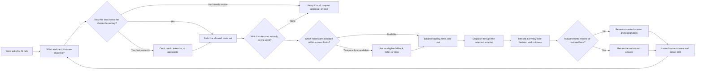
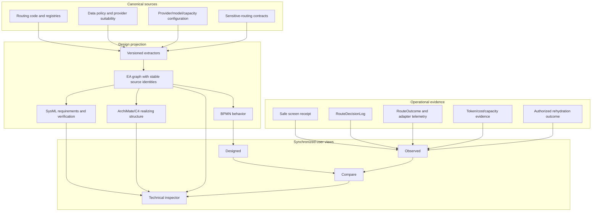

# AI Routing Architecture & Explainability — Design

| Field | Value |
| --- | --- |
| Status | Proposed — architecture audit and backlog decomposition complete; implementation not started |
| Date | 2026-07-26 |
| Epic | `EP-CFACFA9F` — AI Routing Architecture & Explainability |
| Umbrella BI | `BI-3FA17F95` |
| Plan | `docs/superpowers/plans/2026-07-26-ai-routing-architecture-explainability.md` |
| Primary surface | Existing `/platform/ai/operations-map` |
| Architecture surface | Existing `/ea` |
| Upstream security contract | `BI-3D210AF8`; PR #3602; `docs/superpowers/plans/2026-07-26-pre-dispatch-sensitive-llm-routing.md` |
| Composes with | `EP-AI-OPSMAP`, `EP-PARITY-ENGINE`, `EP-ROUTING-11`, `EP-DATA-GOVERNANCE` |

## 1. Executive decision

DPF will present AI routing through **one canonical architecture model with three
synchronized projections**:

1. **Designed** — how a request is supposed to move through screening, policy,
   eligibility, selection, fallback, dispatch, and response handling.
2. **Observed** — privacy-safe operational evidence over the same stations and
   edges for a selected time window.
3. **Compare** — conformance between the designed path and observed evidence,
   including missing evidence, unexpected paths, stale design, and attribution
   gaps.

The owner-facing projection is a plain-language subway map informed by BPMN. The
technical projection uses BPMN for behavior, SysML for requirements and
verification, and ArchiMate/C4 for realizing structure. These are viewpoints over
the existing DPF substrate, not separately maintained diagrams.

The pre-dispatch sensitive-routing plan is authoritative for screening, PDP/PEP,
masking/tokenization, fallback enforcement, safe receipts, and authorized
rehydration. This design consumes those contracts and does not redefine them.

## 2. Problem

DPF has substantial routing capability but no single governed picture that answers,
at a glance:

- How is an AI request supposed to be routed?
- Is protected data allowed to cross the chosen boundary?
- Why did this provider and model win?
- Which alternatives were excluded, and why?
- What happens when the selected route is unavailable or reaches a time/usage limit?
- Did fallback preserve the original policy obligations?
- How is the system actually behaving now?
- Where does operational evidence disagree with the design?
- What can an operator safely adjust?

Today those answers are distributed across routing code, data-governance policy,
provider suitability, provider/model configuration, EA views, several design
documents, route receipts, outcomes, token usage, capacity state, and the AI
Operations Map.

The fragmentation has produced concrete ambiguity:

- `docs/superpowers/specs/2026-04-20-routing-architecture-current.md` says provider
  and model pins are deliberately unused.
- `docs/user-guide/ai-workforce/model-routing-lifecycle.md` describes a seeded pin
  and a pin-preference routing stage.
- `docs/superpowers/specs/2026-04-27-routing-control-data-plane-design.md` describes
  a target RIB/FIB separation whose primary backlog item is deferred.
- The unified Operations Map canvas remains a preview above legacy authoritative
  panels.
- The EA substrate defines cross-notation relationships, but the live install has
  no instantiated cross-notation relationship edges.

This makes it possible for individual documents to be locally correct while the
whole system remains difficult to explain or verify.

## 3. Goals

1. Give a nontechnical owner one picture that explains routing in business language.
2. Let a technical operator drill into rules, source versions, evidence, and
   remediation without leaving the shared context.
3. Keep design and operational evidence visibly separate but geometrically aligned.
4. Project current-state architecture from source registries and implementation
   contracts through the Parity Engine.
5. Consume privacy-safe routing receipts without exposing prompts, detected values,
   token maps, credentials, evidence documents, or vendor account identifiers.
6. Reuse the existing EA, Operations Map, routing, governance, and telemetry
   substrate.
7. Make documentation authority and supersession explicit.
8. Preserve the 20 percent refactoring budget for shared projection/evidence seams
   and deletion of superseded panels.

## 4. Non-goals

- Do not create another router, PDP, PEP, classification taxonomy, provider
  suitability compiler, operations route, or architecture database.
- Do not copy routing policy into diagram data.
- Do not store one EA element or conformance issue per inference transaction.
- Do not expose raw sensitive payloads in diagrams, inspectors, exports, logs, or
  receipts.
- Do not make SysML the normal-user experience.
- Do not adopt a full DMN substrate until the design proves that a governed
  decision inspector over existing rule sources is insufficient.
- Do not present the deferred RIB/FIB design as current implementation.
- Do not cut over from legacy Operations Map panels until functional, accessibility,
  responsive, and replay parity are proven.

## 5. Primary picture 1 — owner-readable routing subway

This is the default Designed view. Labels are phrased as owner questions. Technical
terms appear only in the inspector.



### 5.1 Station semantics

| Owner-facing station | Technical contract | Canonical source |
| --- | --- | --- |
| Work asks for AI help | Inference/coworker entry point | Governed routed-inference entry points |
| What work and data are involved? | Activity context, purpose, actor, governed data classification | Data-governance registry plus activity contract |
| May this data cross the boundary? | Data PDP decision and destination class | `policy-decision.ts` and sensitive-routing plan |
| Protect it | Mask-before-context/tokenization obligations | `mask-for-context` contract from `BI-DG-009` |
| Build the allowed route set | `RequestContract` provider/residency/sensitivity constraints | Request-contract compiler and provider-suitability policy |
| Can do the work | Capabilities, context, modality, tool and contract-family floors | Routing loader and `routeEndpointV2` hard filters |
| Available within limits | Lifecycle state, runtime capacity, cooldown, short/long quota windows | Provider capacity/circuit-breaker sources |
| Balance quality, time, and cost | Ranking inside the eligible set | Routing scorer and Golden Triangle posture |
| Eligible fallback | Same transformed payload and hard constraints | Governed fallback contract |
| Dispatch | Adapter/transport invocation | Inference adapter registry |
| Safe decision and outcome | Screen, route, adapter, outcome and token evidence | Existing ledgers plus sensitive-screen receipt |
| Restore protected values | Fresh PDP decision plus actor/surface/action authorization | Rehydration authorization contract |
| Learn and detect drift | Evaluation, telemetry aggregation and parity | Parity Engine and conformance steward |

## 6. Primary picture 2 — design and evidence projection architecture

This picture explains how DPF keeps one model while serving different audiences and
time windows.



## 7. Viewpoint contract

### 7.1 Designed

Designed is the versioned architecture projection. It shows:

- expected stations, gates, paths and fallback boundaries;
- which rules are hard constraints versus ranking preferences;
- the source and version of each deterministic fact;
- which facts are implemented, proposed target-state, historical, or unresolved;
- requirements and verification cases.

Designed never derives truth from recent traffic. Zero traffic does not remove a
designed path.

### 7.2 Observed

Observed decorates the Designed geometry for a selected time window. It shows:

- request/decision volume;
- allowed, transformed, reviewed, denied and blocked outcomes;
- candidate exclusion reasons;
- selected providers/models/adapters;
- fallback depth and failure classes;
- p50/p95 latency and total elapsed time;
- input/output tokens and cost or subscription-window posture;
- capacity/cooldown state;
- evidence freshness;
- attribution and correlation coverage.

Observed never changes the designed topology. Unexpected observed routes appear as
temporary evidence edges and conformance candidates.

### 7.3 Compare

Compare uses explicit visual states:

| State | Meaning |
| --- | --- |
| Solid neutral | Designed and observed |
| Gray | Designed but not observed in the selected window |
| Colored | Observed volume/status over a designed edge |
| Dashed warning | Observed path not represented in the design |
| Broken evidence marker | Designed station has missing or stale operational evidence |
| Unattributed marker | Evidence cannot be assigned to a coworker/actor |
| Uncorrelated marker | Screen, route, outcome, or rehydration evidence cannot be joined |
| Proposed badge | Target-state design, not current implementation |

Conformance is aggregated by stable architecture identity and time window. The
system must not create a conformance row for every inference transaction.

### 7.4 Technical inspector

The inspector progressively discloses:

1. **Owner answer:** what happened, why, and the safest next action.
2. **Routing explanation:** selected route, excluded alternatives, fallback and
   obligations.
3. **Evidence:** timestamps, freshness, safe receipt identifiers, metrics and
   correlation coverage.
4. **Architecture:** BPMN/SysML/ArchiMate relationships, source keys, rule/policy
   versions and verification cases.
5. **Raw engineering identifiers:** available only to authorized technical users
   and still excluding protected payload content.

## 8. Notation decision

| Concern | DPF notation/presentation |
| --- | --- |
| Owner-readable end-to-end route | Subway rendering of the BPMN process |
| Process sequence, fallback and actors | BPMN 2.0 |
| Requirements, constraints, allocations and verification | SysML v2 |
| Enterprise/component realization | ArchiMate; C4 as a lightweight human view |
| Routing rule details | Governed decision inspector over canonical rule sources |
| Full decision requirements/tables | DMN only after the inspector is proven insufficient |

The current EA substrate already supports BPMN, SysML, ArchiMate, viewpoints,
snapshots, conformance issues and cross-notation relationship definitions. The first
implementation must instantiate and navigate those relationships rather than add a
parallel diagram store.

## 9. Data authority and safe evidence

### 9.1 Design authority

| Fact | Authority | Projection behavior |
| --- | --- | --- |
| Routing stages and order | Implemented routing modules/registries | Deterministic BPMN extraction |
| Data sensitivity/purpose rules | Data-governance sources | Linked rule source; do not copy policy |
| Provider suitability obligations | Suitability compiler and evidence registry | Linked constraints/requirements |
| Model/provider capabilities | ModelProfile/ModelProvider plus loaders | Derived eligible-route facts |
| Runtime capacity/cooldown | Capacity/circuit-breaker state | Observed overlay only |
| Target RIB/FIB design | Control/data-plane design spec | Proposed badge until implemented |
| Architect interpretation | Approved design artifact | Explicit architect provenance |

### 9.2 Operational authority

The evidence projection should reuse:

- sensitive-screen receipt from `BI-3D210AF8`;
- `RouteDecisionLog`;
- `RouteOutcome`;
- `AdapterRunTelemetry`;
- `TokenUsage`;
- `ProviderCapacityStatus`;
- provider suitability receipts/evidence;
- authorized rehydration result.

The correlation envelope must support:

```text
design revision + screen decision
  -> route decision
  -> route/fallback attempt(s)
  -> adapter outcome
  -> token/cost/capacity evidence
  -> authorized rehydration outcome
```

Safe evidence may contain identifiers, hashes, versions, enumerated classes,
obligations, transformation type, explanation codes, provider/model identity,
timing, token/cost counts and outcome status.

Every Compare result must name the **design revision it compared against**—for
example the applicable EA snapshot/projection revision plus implementation source
revision. A current design silently overlaid on older traffic is not valid
conformance evidence. This revision should reuse existing snapshot/source identity
before any new persistence is considered.

Safe evidence must not contain raw messages, system prompts, tool arguments/results,
detected sensitive values, credentials, token maps, evidence documents, vendor
account identifiers, organization identifiers or free-text policy explanations that
could reproduce protected content.

## 10. Current evidence baseline

The 2026-07-26 live audit found:

- 21,979 route decisions;
- 35,860 route outcomes;
- 32,527 token-usage records;
- 20,740 route decisions with multi-step fallback chains;
- 1,054 route decisions with coworker attribution (about 4.8 percent);
- zero populated suitability receipts on route decisions;
- zero live `PolicyRule` rows;
- zero live `TaskRequirement` rows;
- six seeded cross-notation relationship types and zero instantiated
  cross-notation relationship edges;
- 18 SysML views and one BPMN view, all draft.

These numbers are an audit baseline, not a permanent contract. The product should
query and label the current time window, sample size, coverage and freshness.

## 11. Architecture feature gaps

### 11.1 Projection gaps

- No routing-process BPMN extractor exists.
- Sensitive-routing stages are not represented in the EA graph.
- Cross-notation relationships are defined but not materialized.
- No design/runtime conformance projection exists for routing.

### 11.2 Evidence gaps

- Screen, decision, outcome and rehydration correlation is not yet one explicit
  envelope.
- Coworker attribution covers only a minority of historic route decisions.
- Suitability/sensitive-screen receipts are absent from the audited historic rows.
- Important design policy may live in code defaults while policy/task tables are
  empty.

### 11.3 Authoring/navigation gaps

- New View currently offers ArchiMate and BPMN, not SysML.
- The editor palette is scoped to one notation.
- No deterministic related-view drill-through convention exists.
- Full DMN decision modeling is absent.

### 11.4 Operations UX gaps

- The unified topology canvas is still a temporary preview.
- Legacy panels remain authoritative.
- The current surface does not align designed and observed routing.
- `BI-7E2A1DD0` reports that the deployed interactive diagram does not render.

## 12. Product and interaction design

### 12.1 Default owner experience

- Default to **Designed** on first visit, using plain language.
- Provide a visible time-window control when switching to Observed or Compare.
- Keep the same station positions across modes so the operator does not relearn the
  map.
- Show one short outcome, one reason, and one next action before technical detail.
- Use labels such as “May this data leave this computer/account boundary?” instead
  of PDP/PEP terminology.
- Explain unknown evidence honestly; never turn unknown into allowed.

### 12.2 Technical adjustment

Authorized technical users can:

- open provider/model configuration;
- inspect evidence freshness and account posture;
- inspect rule/policy source and version;
- see candidate exclusion traces;
- view capacity/cooldown and quota windows;
- navigate to linked EA viewpoints and implementation sources;
- simulate a route with payload-free contract inputs;
- propose a design or policy change through the owning governed workflow.

The map itself does not become an ungoverned policy editor.

### 12.3 Accessibility and responsive behavior

- Every station and edge is keyboard reachable.
- Color is never the only status signal.
- A list/table representation provides equivalent content.
- Dense technical labels collapse behind the inspector.
- Mobile uses a vertical station sequence with the same stable identities.
- Exported views include mode, time window, freshness and evidence coverage.

## 13. Documentation authority

The completed design BI must establish the following hierarchy:

1. This design, once approved, is the architecture authority for routing
   explainability and viewpoint ownership.
2. The implementation plan for `BI-3D210AF8` remains authoritative for
   pre-dispatch sensitive routing.
3. Provider-suitability design remains authoritative for provider trust/evidence
   compilation.
4. The current-state routing document must either be updated to the verified current
   pipeline or marked as a dated snapshot.
5. The control/data-plane design remains target-state while its implementation is
   deferred.
6. The user guide must describe verified current behavior and link to the
   owner-readable map.

The pinning contradiction must be resolved from implementation and live configuration
evidence before either document is edited to claim one behavior.

## 14. SysML architecture note

- **Scope:** AI inference and AI coworker routing from payload assembly through
  authorized response delivery.
- **Requirements/constraints:** sensitive data must be screened before external
  dispatch; provider suitability may narrow but not loosen data policy; fallback
  preserves the transformed payload and constraints; operational evidence excludes
  raw protected content; diagrams derive from canonical sources.
- **Interfaces/ports:** routed inference entry points, data PDP/PEP, RequestContract,
  route selector, fallback, adapters, route/outcome ledgers, Operations Map loader,
  EA projection reconciler.
- **Allocations:** data governance owns classification/purpose; provider suitability
  owns provider evidence compilation; routing owns eligible-set selection; adapters
  own transport; EA/Parity owns design projection; Operations Map owns presentation.
- **Verification cases:** sensitive blocked route, maskable route, exact-sensitive
  local/eligible route, governed fallback, unavailable-provider path, short/long
  limit path, authorized/unauthorized rehydration, missing-evidence conformance,
  unexpected observed path, accessibility and responsive parity.
- **Data authority:** canonical registries/code/policy remain authoritative;
  EA/BPMN/SysML and Operations Map are derived projections; telemetry ledgers remain
  operational authority.
- **EA/current-state catch-up:** add the AI routing process domain and materialize
  cross-notation relationships.
- **Parity impact:** add versioned extractors and conformance aggregation; do not
  hand-maintain current-state routing nodes.
- **Open risk:** current receipt, correlation and attribution coverage is
  insufficient for complete historic observed views.

## 15. Delivery boundaries

| BI | Independently shippable outcome |
| --- | --- |
| `BI-CC9BCFC8` | Canonical design artifact and documentation reconciliation |
| `BI-AA314BF4` | BPMN routing process and linked EA projection |
| `BI-758722A7` | Privacy-safe evidence correlation and conformance projection |
| `BI-52C015D8` | Cross-view drill-through and routing-decision inspector |
| `BI-7378E34C` | Designed/Observed/Compare Operations Map UX |

Existing defect `BI-7E2A1DD0` is coordinated, not duplicated.

## 16. Refactoring budget

Reserve approximately 20 percent of implementation capacity:

| Refactor | Budget |
| --- | ---: |
| Extract shared routing-stage and stable-identity projection builders | 5% |
| Standardize safe correlation/receipt projection across existing ledgers | 5% |
| Centralize designed/observed/compare view-model construction | 4% |
| Consolidate architecture drill-through and inspector primitives | 2% |
| Delete retired Operations Map panels/toggles after parity | 4% |

## 17. Risks and mitigations

| Risk | Mitigation |
| --- | --- |
| Diagram becomes another source of truth | Extract current-state facts; keep architect judgment explicit |
| Sensitive content leaks through observability | Safe-field allowlist, canary fixtures and no raw-payload persistence tests |
| Target design is mistaken for current behavior | Required Current/Proposed/Historical badges |
| Historic evidence cannot be correlated | Surface coverage honestly; do not fabricate joins |
| One enormous canvas recreates overload | Stable owner map plus progressive disclosure and alternate list view |
| Full DMN adoption adds premature substrate | Start with governed decision inspector; evaluate DMN after evidence |
| Cross-notation links remain theoretical | Live acceptance requires instantiated, navigable edges |
| Operations Map cutover regresses working behavior | Additive parity stages; delete legacy only after proof |

## 18. Architecture review

- **Decision:** aligned with important guardrails.
- **Single source of truth:** the design reuses routing/governance registries, the EA
  graph, telemetry ledgers and Operations Map; it does not create a diagram or
  evidence authority.
- **Data model:** no new Prisma model is approved. Each implementing BI must prove
  existing snapshot, evidence and relationship substrate insufficient before a
  schema proposal.
- **Parallel-work boundary:** PR #3602 owns sensitive-routing enforcement; this epic
  consumes its merged contracts and must re-sweep them before implementation.
- **Current/target separation:** RIB/FIB and other target-state concepts require a
  Proposed badge until implementation evidence exists.
- **Evidence integrity:** Compare must bind observed traffic to the applicable design
  revision; comparing historical evidence only to today's design would create false
  drift.
- **Operational safety:** receipts and observability are safe-field projections, not
  prompt archives.
- **Recommended next step:** land the canonical design/document-authority BI first,
  then allow the projection, evidence and drill-through BIs to proceed independently.

## 19. Standards

- ISO/IEC/IEEE 42010:2022 — stakeholder concerns, viewpoints and model kinds.
- OMG BPMN 2.0.2 — process behavior and gateways.
- OMG DMN 1.5 — benchmark for decision requirements and tables; adoption deferred
  pending fit proof.
- OMG SysML 2.0 — requirements, constraints, allocations and verification.
- C4 dynamic diagrams — supporting technical interaction stories, used sparingly.
- OpenTelemetry semantic conventions for GenAI — common safe attribute vocabulary
  where compatible with DPF privacy constraints.

## 20. UX fit review

- **Decision:** fits-with-guardrails.
- **Owning area:** Platform.
- **Route family:** `/platform/ai/operations-map` is canonical; `/ea` is the
  authorized architecture drill-through.
- **Primary persona:** founder/operator asking how AI work is routed and whether it
  is safe and healthy. The contributor/platform operator is the secondary
  progressive-disclosure persona.
- **Navigation layer:** local page mode/filter controls only. No new global or
  section navigation.
- **Reuse/convergence:** reuse the existing Operations Map canvas/projections,
  report-kit status/table/filter primitives, `statusColors`, `LocalTime`, EA canvas
  and existing saved-view/replay behavior.
- **Source truth:** the design and operational authorities are named in §9; the UI
  may not invent a second status or metric calculation.
- **Empty/failure behavior:** no recent traffic still renders Designed with “No
  observed routes in this window”; unavailable telemetry preserves the last known
  design and shows evidence freshness/recovery; missing permission offers no raw
  technical detail.
- **AI boundary:** viewing, filtering and inspecting never sends a prompt. A future
  simulation or coworker action requires a context preview, expected next step and
  explicit confirmation.
- **First viewport guardrail:** answer three questions before any dense diagnostics:
  “How should work route?”, “Is anything unsafe or blocked?”, and “Is observed
  behavior different?” Avoid a generic KPI-card wall.
- **Disclosure guardrail:** mode and time-window controls remain reachable; only
  professional detail collapses. Do not hide the primary comparison control inside
  Advanced.
- **Evidence before merge:** route/source tests, served-DOM UX budget sweep, theme
  and style-drift checks, desktop/mobile browser exercise, keyboard/list
  equivalence, failure/permission fixtures and privacy canaries.
- **Captured in:** this section plus implementation plan Phases 4–5.

## 21. Open implementation decisions

1. Which stable correlation identifier is canonical across screen, route, fallback,
   outcome and rehydration without creating a parallel trace ledger?
2. Can the current EA relationship/viewpoint validators render mixed-notation
   related-view navigation entirely through shared element identity, or is a narrow
   renderer change required?
3. Does the implemented routing pipeline use any provider/model pin preference
   today, and under what constraints?
4. Which existing encrypted runtime artifact can hold short-lived token maps?
5. Should the first Compare conformance cadence be request-time aggregation,
   scheduled reconciliation, or both through one pure projector?

These decisions must be resolved against implementation and live evidence during
their owning BI. They do not justify parallel substrate in advance.
