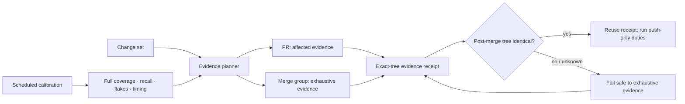

# CI evidence efficiency

## Decision

Adopt a **lifecycle-tiered evidence architecture**:

1. Pull requests get fast, fail-safe affected checks and changed-surface UX evidence.
2. The merge queue remains the exhaustive pre-`main` proof point.
3. A post-merge push reuses successful evidence for the exact tested tree instead of repeating it.
4. Scheduled runs measure full code coverage, selection recall, flakes, and performance drift.

The design changes **when and where evidence runs**, not the quality contract. No change reaches `main` without the four DPF build gates applicable to it. If impact classification, graph freshness, evidence identity, or selection confidence is unknown, the system expands to the full suite.

This architecture was preferred by the founder kernel decision interaction `DI-907601218462` with a 4.5146 composite score, 1.0121 margin, and high confidence. The strongest contributors were *Ship Real Functionality* and *Research and Use Standards*. No commandment conflict was detected.

## Why now

DPF's CI is comprehensive but spends evidence repeatedly and unevenly:

- A representative PR update consumed **65.7 GitHub runner-minutes** across 63 jobs and took **10.7 minutes** on its critical path.
- The critical path was the UX Route Budget Sweep, not the test suite.
- Full CI runs on pull requests, merge groups, and post-merge pushes. The latter two often evaluate the same resulting source tree.
- TypeScript checking takes about two minutes in its own job and runs again inside `next build`.
- Four web unit-test shards each repeat package setup, Prisma generation, and database preparation.
- Roughly 40 small policy jobs provide useful checks but pay separate runner startup and setup costs.
- The current change classifier is coarse: almost every platform or web change becomes a full run.
- DPF reports about 19,338 passing tests in a full local-CI run, but the primary web and database suites do not publish statement, branch, function, or changed-line coverage. Current behavioral coverage is therefore broad but **not quantified**.

The largest opportunity is not deleting tests. It is eliminating redundant lifecycle executions, selecting affected evidence safely, stabilizing and parallelizing the route sweep, and making actual coverage measurable.

## Measured baseline

Measurements were taken from recent GitHub Actions runs available on 2026-07-26. Durations are elapsed wall time unless noted.

### Representative pull-request update

Head SHA `55e0e9f...`, PR #3615:

| Workflow | Wall time | Runner-minutes | Jobs |
|---|---:|---:|---:|
| CI | 7.3 min | 35.6 | 49 |
| UX Route Budget Sweep | 10.7 min | 10.6 | 1 |
| CodeQL Advanced | 7.0 min | 9.8 | 4 |
| GitHub-managed code quality | 4.7 min | 6.6 | 3 |
| Routing audit | 1.8 min | 1.8 | 1 |
| Remaining security/self-upgrade checks | <1 min each | 1.3 | 5 |
| **Total / critical path** | **10.7 min** | **65.7** | **63** |

Representative run evidence:

- [CI run 30221182166](https://github.com/OpenDigitalProductFactory/opendigitalproductfactory/actions/runs/30221182166)
- [UX sweep run 30221182164](https://github.com/OpenDigitalProductFactory/opendigitalproductfactory/actions/runs/30221182164)
- [CodeQL Advanced run 30221182178](https://github.com/OpenDigitalProductFactory/opendigitalproductfactory/actions/runs/30221182178)

### Recent-run distribution

| Workflow/event | Sample | p50 | p90 | Observation |
|---|---:|---:|---:|---|
| CI / pull request | 42 | 6.8 min | 7.4 min | Stable when not cancelled |
| CI / merge group | 34 | 6.9 min | 7.8 min | Exhaustive integration proof is valuable |
| UX / pull request | 61 | 10.0 min | 11.3 min | Current PR critical path |
| UX / merge group | 5 | 12.2 min | 12.8 min | Longest pre-merge proof |
| CodeQL Advanced / pull request | 67 | 6.8 min | 7.2 min | JavaScript dominates |

### Where time goes

Representative step timings:

| Step | Elapsed | Finding |
|---|---:|---|
| Production build | 401 s | `next build` 280 s, including about 117 s TypeScript |
| Standalone typecheck | 187 s | About 120 s `tsc`; materially duplicates the build's TS phase |
| Web unit shard | 176–191 s | About 94 s tests plus about 65 s repeated setup/DB work |
| UX build | 220–226 s | A second production build in a separate workflow |
| UX route crawl | 271–295 s | About 200 routes are visited sequentially |
| Turbopack cache upload | about 45 s | About 1.95 GB, exact-source key, low expected cross-commit reuse |

The exact-key Turbopack cache exists because broad stale-cache restore previously created false build failures. This design does not reintroduce unsafe restore keys.

## Coverage posture

Coverage has four distinct meanings and must not be collapsed into one number:

| Coverage dimension | Current evidence | Gap |
|---|---|---|
| Test inventory | About 19,338 full-suite tests; 2,229 web test files; 223 DB test files | Count does not show which behavior or changed lines are exercised |
| Code coverage | No primary web/DB Vitest coverage threshold or published baseline | Statements, branches, functions, and uncovered files are unknown |
| Route coverage | 200 routes in the checked-in UX baseline | Baseline is `bootstrapped: false`; budget regression ratchet is reporting-only |
| Change coverage | Agent-selected targeted tests plus broad full suites | No measured selection recall or test-to-source execution map |

Static repository ratios are directional only: approximately 2,229 test files / 3,813 web source files and 223 / 263 DB source files. They are not substitutes for runtime coverage.

Vitest requires an explicit `coverage.include` to count files that tests never load. Any new baseline must include owned production code explicitly; otherwise the first report would overstate coverage.

## Existing work this design coordinates

This is an architecture umbrella, not a competing implementation:

| Backlog | Reused responsibility |
|---|---|
| `BI-E5A0C9A7` | Xlarge architecture parent and lifecycle-level acceptance |
| `BI-2F60FDCE` | Timing, coverage, selection-recall, flake, and cache-economics observation |
| `BI-9585E580` | Exact-tree evidence receipts and safe post-merge reuse |
| `BI-4DB73C5E` | Build/typecheck/policy-job/CodeQL deduplication after parity proof |
| `BI-A4EC0EA6` | Code-graph-backed impacted-test recommendations |
| `BI-C22152E7` | Local-CI preflight, evidence resilience, concise failure summaries, delivery-loop waste |
| `BI-EA221325` | Deterministic, stable route sweep and honest ratchet arming |
| `BI-72AEDE8B` | Windows local-CI timeout/harness stabilization |

The code graph is currently low-trust for CI selection: its live index is stale/dirty and exposes no trustworthy structural relationships. It may recommend tests after it meets freshness and recall requirements, but it must not yet be a sole blocking selector. Planner advice is therefore a versioned optional envelope bound to the exact immutable head tree. Commit SHAs remain provenance but do not change the digest because local-CI retries synthesize different merge commits for byte-identical trees. Missing, dirty, stale, schema-incompatible, or structurally incomplete advice is an exhaustive-evidence signal, never an empty selection. The plan digest also excludes volatile timestamps, host paths, and logs so local-CI and GitHub can compare the same semantic recommendation.

## Prior-design reconciliation

This design changes execution scheduling, not DPF's existing quality or merge-authority contracts.

| Prior design | Reconciliation and retained owner |
|---|---|
| Build Disciplines (`2026-03-17`) | Test-first task execution and Build Studio's full verification gate remain unchanged. Affected PR selection is remote feedback optimization; it never authorizes production code without a test or replaces Build Studio phase evidence. |
| Artifact Provenance Receipts (`2026-04-27`) | `ToolExecution` / `ToolExecutionReceipt` remain the canonical internal execution-provenance substrate. GitHub-hosted CI does not fabricate those rows or reuse a Build Studio receipt across builds. GitHub evidence uses the transport contract in “Exact-tree evidence” below. |
| AI Routing and UX Verification (`2026-05-11`) | Route-budget measurement is not functional UX coverage. Changed-route PR evidence and the full route sweep complement—not replace—route-family Playwright journeys, static route/coworker contracts, `tests/e2e/platform-qa-plan.md`, model probes, or normalized failure evidence. |
| Code Intelligence Graph Adoption (`2026-05-13`) | The evidence planner consumes `findRelatedTests` / `TESTED_BY` facts only when graph snapshot, confidence, and freshness contracts pass. Graph advice is one input; Vitest static relationships and fail-safe expansion remain independent. |
| Tiered Dev-Loop Isolation (`2026-05-31`) and Local-CI Mechanical Enforcement (`2026-07-06`) | `pnpm pregate`, exact branch/SHA gate records, docs-only exemptions, `pr:health`, the `local-integration-ci` lease, and the shared convergence sandbox remain authoritative. The planner is shared logic inside that lifecycle, not a replacement pre-push path or a per-worktree runtime. |
| Merge Readiness Integrity (`2026-07-26`) | The versioned merge-policy manifest, `Merge Readiness` aggregate, separate `UX Route Budget Sweep` context, DCO, `merge_group` triggers, legitimate skip semantics, and branch-protection drift audit remain the merge-authority source of truth. Lifecycle optimization occurs behind those stable contexts. |

Normative consequences:

- Pull-request selection does not weaken TDD, Build Studio phase gates, or the exhaustive merge-group proof.
- The evidence planner must emit results through the existing `Merge Readiness` aggregate; it does not create a competing required-check list.
- Functional UX journeys continue to be selected from the canonical QA inventory by route family and risk. A successful route-budget crawl alone is never functional acceptance evidence.
- Local and GitHub planners must agree on impact classification, while each surface retains its existing evidence and authority mechanism.

## Standards and market benchmark

### Open-source / primary guidance

| System | Relevant practice | DPF adoption |
|---|---|---|
| [Vitest CLI](https://vitest.dev/guide/cli) | `vitest related` and `--changed` select tests from static imports; `--coverage.changed` scopes changed coverage | First-party affected-test seed, guarded by fail-open-to-full rules |
| [Vitest coverage](https://vitest.dev/guide/coverage) | V8 coverage is the recommended fast provider; explicit includes and thresholds are supported | Scheduled full baseline plus PR changed-code visibility |
| [Nx affected](https://nx.dev/docs/features/ci-features/affected) | Git diff plus a project graph runs the minimum affected projects | Model DPF's package/surface impact classifier on the same principle |
| [Playwright parallelism](https://playwright.dev/docs/test-parallel) and [sharding](https://playwright.dev/docs/test-sharding) | Independent browser work is distributed across workers/shards | Bounded route-sweep workers after isolation/determinism is proven |
| [GitHub merge groups](https://docs.github.com/en/actions/reference/workflows-and-actions/events-that-trigger-workflows) | Required checks must run for `merge_group` | Keep merge queue as the exhaustive integration proof point |
| [GitHub dependency caching](https://docs.github.com/en/actions/reference/workflows-and-actions/dependency-caching) | Cache reusable dependencies; use artifacts for outputs passed between jobs | Share exact-SHA build output as an artifact; measure caches before retaining them |

### Commercial practice

| System | Relevant practice | DPF adoption |
|---|---|---|
| [Buildkite Test Engine](https://buildkite.com/docs/pipelines/configure/tests) | Timing-aware test splitting and explicit flaky-test management | Store per-test timing and balance shards; never hide flaky results |
| [CircleCI timing-based splitting](https://circleci.com/docs/guides/optimize/parallelism-faster-jobs/) | Historical duration balances parallel executors | Replace equal file-count shards with measured-duration shards |
| [Launchable predictive selection](https://help.launchableinc.com/features/predictive-test-selection/how-launchable-selects-tests/) | Learn from changes and history; observation mode validates subsets before skipping | Mandatory shadow phase and measured selection recall |
| [Gradle Develocity predictive selection](https://docs.gradle.com/develocity/predictive-test-selection) | Relevant and recently flaky tests run early; full runs remain the coverage source | Always include recent failures/flakes and keep scheduled/full pre-merge proof |

The common pattern is **selection plus an exhaustive safety net**, not permanent deletion of the safety net.

## Options considered

| Option | Strength | Weakness | Kernel score |
|---|---|---|---:|
| Tune in place | Lowest conceptual change | Preserves lifecycle duplication; limited ceiling | 3.5025 |
| **Lifecycle-tiered evidence** | Fast PR feedback with exhaustive pre-main proof and measurable recall | Requires evidence identity and a trustworthy classifier | **4.5146** |
| Managed predictive selection | Strong statistical selection and analytics | Vendor/data dependency before DPF has measured its baseline | 3.1656 |
| Larger or persistent runners | Speeds unchanged workflow | Pays to preserve duplication and increases infrastructure coupling | 2.8411 |

Commercial predictive selection remains a future option if DPF's first-party observation data shows that static/graph selection cannot meet the recall SLO economically.

## Target architecture

### 1. One evidence planner

A checked-in planner produces a machine-readable plan before workflows fan out. Inputs:

- base and head tree identities;
- changed paths and generated/lock/config changes;
- package dependency graph;
- Vitest static related-test results;
- code graph recommendations only when its freshness contract passes;
- route ownership/changed-route mapping;
- migration, security, install, and shared-substrate risk rules;
- recent failures, quarantined flakes, and historically slow tests.

Outputs:

- affected packages and test files;
- affected routes and required UX mode;
- mandatory global guards;
- full-suite escalation reasons;
- a versioned planner digest.

The planner is the single source of truth for GitHub CI, local-CI, and future Build Studio recommendations. Workflow YAML consumes the plan; it does not reimplement impact rules.

### 2. Fail-safe expansion rules

Run the exhaustive tier when any of these holds:

- graph or planner inputs are stale, missing, dirty, or version-incompatible;
- lockfiles, test configuration, CI workflows, shared setup, generated contracts, Prisma schema, seed/install paths, auth, routing shell, or platform-wide primitives change;
- a test or source file cannot be mapped confidently;
- the affected set exceeds a tunable percentage of the full suite;
- evidence receipt identity cannot be proven;
- selection-recall observation finds a missed failure.

“Unknown” means “full,” never “skip.”

These rules also preserve the existing local-CI contract: a runtime-code push still requires a passing `pnpm pregate` record for the exact branch and SHA (or an explicit governed override), while the checked-in docs-only exemption remains intact. Planner output is additional structured evidence consumed by that gate.

### 3. Lifecycle matrix

| Evidence | Pull request | Merge group | Push to `main` | Scheduled |
|---|---|---|---|---|
| Secrets and critical policy | Always | Reuse or rerun cheap checks | Push-only checks | Audit |
| Unit/integration tests | Affected + new + recent failed/flaky | **Full** | Reuse exact-tree receipt | **Full** |
| TypeScript | Affected package where independently sound; otherwise once in build | **Full, once** | Reuse | Full |
| Production build | Once when build-affecting | **Full** | Reuse | Full |
| UX | Changed-route smoke/budget after stable mapping | **Full route sweep** | Reuse | Full + drift report |
| Migration apply | When schema/migration affected | **Full applicable gate** | Reuse | Upgrade matrix |
| CodeQL | One authoritative configuration | As required by chosen configuration | Default-branch duties only | Scheduled as configured |
| Code coverage | Changed-code report, initially non-blocking | Optional summary from full suite | Reuse | **Authoritative full baseline and ratchet** |

The merge queue is deliberately exhaustive because it tests the integration result against the current target branch. Recent merge-group-only prose failures demonstrate that integration-sensitive ratchets catch real issues.

The stable required contexts remain those owned by the merge-readiness design: `Merge Readiness`, `UX Route Budget Sweep`, and DCO. Internal jobs may be selected, combined, or reused only if the aggregate still evaluates every planned dependency and fails on failed or cancelled work; legitimate scope-driven skips remain allowed.

### 4. Exact-tree evidence

There are two provenance domains and they must not be conflated:

1. **DPF-governed internal execution** continues to use canonical `ToolExecution` → `ToolExecutionReceipt` → immutable artifact revision / receipt usage contracts. Existing cross-build consumption restrictions remain unchanged.
2. **GitHub-hosted CI execution** produces a checksummed, versioned `ci-evidence.json` workflow artifact plus GitHub CheckRun/CheckSuite identity. A workflow cannot mint a DPF `ToolExecutionReceipt` unless it actually executes through the governed DPF tool path.

The GitHub evidence artifact must include:

- repository and immutable Git tree SHA;
- event and merge-group identity;
- planner version/digest;
- executed suites and applicable gate results;
- environment/toolchain identity;
- coverage/route counts and exclusions;
- artifact checksums;
- creation and expiry times.

Post-merge reuse is allowed only when the resulting `main` **tree** equals the tested merge-group tree, the workflow artifact checksum is valid, and the artifact includes every gate required by the versioned merge-policy manifest. A commit SHA comparison alone is insufficient because GitHub may materialize different commits for queue and merge events. Missing or mismatched evidence triggers a full run.

The successful result may later be linked into `ExternalEvidenceRecord`, `RuntimeVerification`, or Work Capsule evidence for operator visibility. That import is a projection of GitHub's evidence, not a fabricated `ToolExecution` audit root and not a prerequisite for GitHub's merge authority.

### 5. Route sweep

`BI-EA221325` remains the repair authority. Sequencing:

1. Prove two consecutive same-commit runs with complete, stable route measurement.
2. Remove navigation races through per-route/page isolation and bounded ownership.
3. Arm the checked-in ratchet only after determinism is proven.
4. Introduce bounded parallel workers and measure 1/2/4-worker reliability and duration.
5. Keep the same route inventory; optimize execution, not coverage.

The initial target is to reduce the 271–295 second crawl materially without increasing skipped routes, navigation races, or budget variance. The worker count is selected by evidence, not assumed to be four.

The sweep remains a structural/budget measurement. Functional UX evidence continues to use route-family Playwright projects and journeys from `tests/e2e/platform-qa-plan.md`, with login/redirect assertions, persisted workflow outcomes, and failure-only traces/screenshots. Changed-route selection may choose which journeys run early on a PR; the exhaustive/risk-mandated functional set remains governed separately.

### 6. Build and setup reuse

- Produce the production bundle once per exact source/toolchain identity and pass it to UX jobs as a checksummed GitHub artifact.
- Do not run standalone full `tsc` and the same `next build` TypeScript phase unless they prove distinct failure coverage. Preserve the stronger check and add a parity observation before removal.
- Record per-test timing and rebalance web shards by duration rather than test-file count.
- Consolidate tiny policy checks into a small number of aggregate jobs with stable check names and per-guard sub-results.
- Measure pnpm/Turbopack cache hit rate, bytes, restore time, save time, and downstream time saved. Retire caches with negative expected value.
- Never restore a non-matching Turbopack cache without content validation; prior stale-cache safety remains binding.

### 7. Code scanning

Recent PRs execute both the checked-in CodeQL Advanced workflow and a separate GitHub-managed code-quality workflow. DPF must choose **one authoritative CodeQL setup** after confirming repository/organization policy, as GitHub's guidance distinguishes default and advanced setup. The chosen configuration must retain current language and required-check coverage. Duplicate execution is removed only after equivalence is proven.

## Coverage and selection rollout

### Observation phase

For at least two representative weeks:

- compute affected tests/routes but continue running the full suite;
- compare targeted failures with full-suite failures;
- publish selection recall, selected percentage, and avoided-time estimates;
- establish V8 statement/branch/function/line coverage with explicit production-code includes;
- record untested files without setting an arbitrary blocking threshold;
- identify flaky tests through repeated failure/pass history, not one rerun.

### Activation gates

PR selection may block and skip non-affected tests only when:

- observed failure recall is 100% for the agreed window;
- every unknown classification expanded to full;
- merge-group exhaustive checks are required and healthy;
- changed files have a test/coverage disposition;
- recent failed/flaky tests are forced into the selected set;
- rollback is a single configuration change.

Coverage thresholds start as a ratchet from a measured baseline: no regression in global coverage and no unjustified reduction on changed production code. Threshold exceptions must be explicit, time-bounded, and owner-visible.

## Service-level objectives

Initial targets, to be validated during observation:

| Metric | Baseline | Target |
|---|---:|---:|
| PR feedback p90 | CI 7.4 min; overall 11.3 min | <= 5 min for safely classifiable changes |
| Merge-group exhaustive p90 | UX 12.8 min | <= 8 min |
| Runner-minutes per representative PR update | 65.7 | >= 40% reduction |
| Affected-selection failure recall | Unknown | 100% before activation and continuously observed |
| Full-suite pre-`main` proof | Repeated across events | 100% retained at merge group |
| UX measured-route completion | Unstable in recent failures | 100% of eligible inventory, zero harness skips |
| Coverage visibility | No authoritative web/DB baseline | Statements, branches, functions, lines, and uncovered owned files published |
| Flake rate | Not centrally trended | Published per suite; no silent retry masking |

If the speed SLO conflicts with selection recall or exhaustive merge evidence, confidence wins and the planner expands.

## Refactoring allocation

Allocate **20% of implementation capacity** to simplifying the test substrate:

- one evidence planner shared by GitHub and local-CI;
- one typed plan/receipt contract;
- deletion of duplicated change-scope logic;
- consolidation of policy-job boilerplate;
- removal of duplicate CodeQL/build/typecheck paths after parity proof;
- tests for planner fail-safe behavior and workflow/guard parity.

This allocation is not a separate cleanup phase. Each implementation slice reserves one-fifth of capacity for removing the duplication it supersedes.

## Delivery sequence

1. **Measure and observe** — timing reporter, explicit V8 coverage baseline, selection shadow report, cache economics, exact workflow inventory.
2. **Stabilize confidence gates** — complete `BI-EA221325` and `BI-72AEDE8B`; no optimization is credited while the harness is flaky.
3. **Create the evidence planner** — extend `BI-A4EC0EA6`; fail-safe impact classes; local/GitHub parity.
4. **Reduce repeated work inside a PR** — timing-balanced shards, aggregate policy jobs, exact-SHA build artifact reuse, CodeQL reconciliation.
5. **Activate affected PR evidence** — only after observation acceptance; merge group remains exhaustive.
6. **Activate exact-tree post-merge reuse** — only after receipt identity and mismatch fallback tests pass.
7. **Ratchet and continuously calibrate** — coverage, UX, recall, flake, and duration dashboards.

Each step is independently reversible and must show its own before/after wall time, runner cost, and confidence evidence.

## Acceptance criteria

- A machine-readable evidence plan is identical across local-CI and GitHub for the same change.
- Planner unknown/stale/mismatch cases are tested and expand to exhaustive evidence.
- No change reaches `main` without all applicable DPF build gates on the exact integration tree.
- A safely classified PR reaches required feedback in <=5 minutes p90 during the evaluation window.
- Merge-group exhaustive evidence reaches <=8 minutes p90 or documents the remaining measured bottleneck.
- Representative runner-minutes fall at least 40% without a selection-recall miss.
- Full web/DB V8 coverage includes unloaded owned source files and publishes statement, branch, function, and line baselines.
- UX sweep determinism and completion satisfy `BI-EA221325` before parallelism or ratchet enforcement is credited.
- Exactly one authoritative CodeQL configuration remains, with language and required-check parity proved.
- Post-merge reuse rejects a different tree, incomplete receipt, stale planner, expired evidence, or mismatched toolchain.
- GitHub evidence reuse does not create or consume a cross-build `ToolExecutionReceipt`; internal receipt policy remains owned by the artifact-provenance design.
- The versioned merge-policy manifest and stable `Merge Readiness` / UX / DCO contexts remain authoritative.
- Affected PR selection leaves Build Studio TDD/full-verification and route-family functional UX contracts intact.
- Flaky tests remain visible and forced into selected sets; retries never convert a red result into silent green evidence.
- The implementation reports documentation impact and updates operator/contributor guidance with each lifecycle change.

## Risks and mitigations

| Risk | Mitigation |
|---|---|
| Affected selector misses an indirect dependency | Shadow mode, 100% recall gate, shared-core expansion rules, exhaustive merge group |
| Merge-group queue becomes the only slow feedback point | Keep PR build/UX evidence for affected surfaces; optimize the exhaustive tier itself |
| Receipt reuse accepts a semantically different build | Compare immutable Git tree plus planner/toolchain/artifact identities; fail full |
| Parallel route workers create new nondeterminism | Stabilize first, bounded experiment, complete-route and variance invariants |
| Coverage metric gaming | Explicit includes, changed-code view plus global ratchet, exception ledger |
| Cache optimization reintroduces stale builds | Exact content identity and cache-economics instrumentation; preserve freshness preflight |
| Consolidated guards reduce diagnosability | Stable aggregate check contexts with named per-guard results and artifacts |
| Commercial tooling becomes premature substrate | First-party observation first; vendor evaluation only if measured recall/cost warrants it |

## Documentation impact

Implementation will affect contributor workflow and external-agent behavior. Each activation slice must update:

- `AGENTS.md` for durable event/gate doctrine only;
- `docs/testing/pr-health.md` for required-check and evidence-reuse semantics;
- contributor/local-CI documentation for planner output and failure classifications;
- Work Capsule and backlog evidence with the measured before/after result.

No operator-facing portal workflow changes are proposed by this architecture itself.
