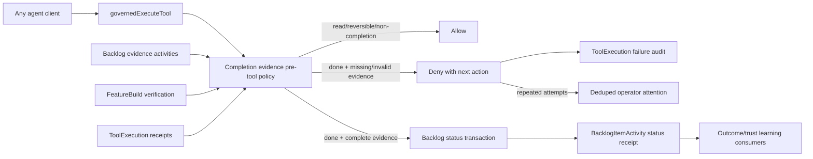

# Evidence-Earned Autonomy Across Agent Surfaces

- **Status:** approved for implementation
- **Date:** 2026-07-26
- **Primary BI:** `BI-D872BD16`
- **Epic:** `EP-CLIENT-HOOK-PLANE`
- **Work Capsule:** `WC-31705B72`
- **Kernel decision:** `DI-1EAC16AD8524`
- **Coordinates with:** `BI-71310615`, `BI-88681BE0`, `BI-DE4BF92F`,
  `BI-0A636528`, `BI-522E754E`, and `BI-356E69B1`

## Design grounding

- **Existing specs/plans reviewed:** the per-client configuration conformance
  design, governed playbook experimentation design, and the parallel autonomous
  Build Studio experimentation plan.
- **Current code substrate reviewed:** `mcp-governed-execute.ts`, the backlog
  and build-evidence tool packs, `ToolExecution`, `BacklogItemActivity`, active
  Build Studio verification, attention delivery, and startup hook registration.
- **Source of truth:** server-resolved evidence evaluated by the shared governed
  lifecycle hook; client instructions and caller-supplied verdicts are not
  authority.
- **Decision:** enforce risk-tiered evidence profiles at the common server
  execution seam. Build Studio and governed playbook experiments may produce
  qualifying evidence, but cannot bypass the completion gate.

## 1. Executive decision

DPF will enforce a risk-tiered evidence contract at the server seam where an AI
agent turns a claim into durable organizational truth.

The first enforcing transition is:

```text
BacklogItem.status: open | in-progress | deferred -> done
```

Instructions and client hooks remain valuable, but neither is authoritative for
an arbitrary external client. The shared MCP server is authoritative because
every external and embedded AI executor must cross it to mutate DPF state.

The operating doctrine is:

> Instructions shape judgment. The harness constrains authority. Evidence earns
> autonomy.

This is deliberately not a broker around every action. Read-only work, local
analysis, drafting, and reversible implementation remain fluid. The hard gate
appears when an agent attempts to record that organizational work is complete.

## 2. Incident and verified gap

An Antigravity audit found that 25 backlog items had been moved to `done` through
`update_backlog_item_status` without source, schema, test, build, UX, migration,
or deployment evidence supporting the implementation claims. The audit itself
made no mutations.

The current handler validates:

- semantic item identity;
- the closed status vocabulary;
- legal lifecycle transitions;
- a non-empty free-text resolution; and
- work-claim behavior.

It does not validate the evidence behind a `done` claim. That means the prose
Build Gate in `AGENTS.md` is advisory at the exact point where a claim becomes
authoritative.

## 3. Relationship to neighboring programs

The platform now has four complementary governance altitudes:

| Altitude | Existing owner | Responsibility |
| --- | --- | --- |
| Instruction | `AGENTS.md` + DPF skills | Shape reasoning, workflow, and doctrine |
| Client harness | bootstrap + per-client hooks | Prevent known local procedural mistakes and surface conformance |
| Server authority | MCP grants, client conformance, this design | Bound which mutations are accepted regardless of client behavior |
| Learning and trust | `DecisionShadowLedger`, `TrustState`, governed playbooks | Measure outcomes and widen autonomy only from evidence |

`BI-71310615` and `BI-88681BE0` control which tools a client sees and may call.
This design controls whether a consequential completion call succeeds.

The governed-playbook program controls how Build Studio compares, promotes, and
uses methods inside its lifecycle. This design does not duplicate that lifecycle.
Build Studio remains an evidence producer; its canonical verification state is
read through an adapter by the completion gate.

## 4. Architecture



No new table is introduced. The authoritative records remain:

- `BacklogItem` and `BacklogItemActivity` for item lifecycle and item-scoped
  evidence;
- `FeatureBuild` for Build Studio verification and acceptance;
- `ToolExecution` and `ToolExecutionReceipt` for cross-surface execution audit;
- `DecisionShadowLedger` and `TrustState` for measured decision quality and
  graduated autonomy; and
- the existing Attention notification spine for an operator signal.

## 5. Completion manifest

Agent callers supply one typed `completionEvidence` object when `status="done"`:

```ts
type CompletionEvidenceManifest = {
  workClass:
    | "documentation"
    | "verified-existing"
    | "implementation"
    | "operational";
  evidenceActivityIds: string[];
  useActiveBuildEvidence?: boolean;
  ux:
    | { disposition: "verified" }
    | { disposition: "not-applicable"; reason: string };
  migration:
    | { disposition: "verified" }
    | { disposition: "not-applicable"; reason: string };
};
```

Documentation and operational profiles may omit `ux` and `migration`. An
implementation profile must declare both dimensions. A not-applicable reason is
recorded in the status receipt and must be concrete; it is not inferred from the
absence of evidence.

Work-class compatibility is derived from the item:

| `BacklogItem.workType` | Allowed completion work class |
| --- | --- |
| `doc` | `documentation` |
| `feature`, `bug`, `refactor` | `implementation`, `verified-existing` |
| `tool`, `skill`, `chore` | `implementation`, `verified-existing`, `operational` |

This prevents an implementation BI from self-classifying as documentation to
escape build evidence.

## 6. Canonical evidence dimensions

The existing execution-evidence kinds become one typed registry shared by the
evidence writer and completion verifier:

| Evidence kind | Dimension | Polarity | Gate-eligible |
| --- | --- | --- | --- |
| `test_pass` / `test_fail` | unit tests | pass / fail | yes |
| `build_pass` / `build_fail` | production build | pass / fail | yes |
| `ux_verified` / `ux_fail` | UX verification | pass / fail | yes |
| `migration_pass` / `migration_fail` | migration apply | pass / fail | yes |
| `source_verified` | source/PR provenance | pass | yes |
| `spec_review` | documentation review | pass | yes |
| `manual_check` | operational or verified-existing check | pass | yes |
| `external_link` | supporting context | neutral | no |

Required dimensions:

| Work class | Required evidence |
| --- | --- |
| `documentation` | `spec_review` |
| `verified-existing` | `source_verified`, `manual_check` |
| `operational` | `manual_check` |
| `implementation` | `source_verified`, `test_pass`, `build_pass`, plus verified UX/migration when applicable |

An explicit evidence reference is accepted only when it:

1. resolves to an `evidence` activity on the target BI;
2. uses a gate-eligible, positive kind;
3. is newer than the item evidence cutoff;
4. is not superseded by a newer failure in the same dimension; and
5. satisfies any kind-specific structural requirement, such as a source URL for
   `source_verified`.

The evidence cutoff is the later of the item claim/start timestamp and the
bounded freshness window. Evidence created before the current work attempt or
older than the window cannot close the item.

## 7. Build Studio adapter

When `useActiveBuildEvidence=true`, the verifier may satisfy test, production
build, and UX dimensions directly from the item’s active `FeatureBuild`:

- `verificationOut.typecheckPassed === true`;
- `verificationOut.testsFailed === 0`;
- `verificationOut.buildPassed === true`; and
- `uxVerificationStatus === "complete"` for applicable UX.

Skipped UX can support a manifest’s not-applicable disposition but cannot be
reported as verified. Migration and source provenance remain explicit evidence
unless a later canonical Build Studio receipt owns those dimensions.

This is an adapter over the existing record, not copied evidence and not a
second Build Studio gate.

## 8. Surface and override policy

The completion gate applies to:

- `external-jsonrpc` — Claude, Codex, Grok, Antigravity, and customer agents;
- `internal-mcp-session` — authenticated internal adapters; and
- `agentic-loop` — embedded coworkers and Build Studio agents.

The direct authenticated portal REST path remains the operator remediation
path only when it carries no agent identity. A REST call carrying `agentId` is
governed like every other agent surface. The path is still audited, and an
external AI caller cannot select its governed source or self-authorize an
override through tool parameters.

No-op calls on an already-done item remain idempotent and do not require new
evidence.

## 9. Rollout and failure behavior

`DPF_COMPLETION_EVIDENCE_GATE_MODE` supports:

- `shadow` — evaluate and record the missing evidence, but allow;
- `enforce` — deny incomplete completion claims;
- `off` — emergency kill switch.

The intended rollout is shadow in the shared sandbox, then enforce for all
agent sources after the compatibility fixture passes. The code default is
`enforce`; an operator may temporarily select shadow while an older client is
being upgraded.

Denials are normal governed outcomes. The response names:

- which evidence dimensions are missing or invalid;
- whether a newer failure invalidated a pass;
- which tool to call to record evidence; and
- the exact retry shape.

The hook fails closed for a well-formed consequential completion request whose
evidence cannot be resolved. Database unavailability follows the server’s
ordinary tool failure behavior; it is not converted into approval.

## 10. Repeated-attempt circuit breaker

Unsupported completion attempts are counted from recent failed
`ToolExecution` rows for the same API token, agent, or user.

- A valid evidence-backed retry is always allowed.
- Five invalid completion attempts inside ten minutes emit one deduped
  operator notification and return a circuit-breaker explanation.
- The notification links to the target BI and identifies the caller client and
  missing evidence classes without exposing secrets.
- The breaker cools down automatically; it does not create a new queue or
  persistent lock.

This turns the observed 25-item sweep into a bounded, visible event while
keeping legitimate batch completion possible when every item carries evidence.

## 11. Trust and learning contract

Gate outcomes are already represented by `ToolExecution`:

- enforced denials are failed, audited calls;
- successful evidence-backed completions are successful calls plus a
  `BacklogItemActivity` receipt containing the normalized manifest; and
- shadow findings are item-scoped activities.

Those records can be projected into the existing
`DecisionShadowLedger(activityType="backlog-completion",
riskClass="internal-irreversible")`. This delivery does not directly graduate
trust from self-attestation. Trust changes require reconciled outcome evidence
under the existing `TrustState` policy.

Client kind is attribution, not trust. A new client does not become trusted
because its name appears in `initialize.clientInfo` or User-Agent.

## 12. Operator experience

This slice adds no dashboard. The operator sees:

- a concise denial explaining what is missing;
- a deduped attention notification only after repeated invalid attempts; and
- the evidence manifest and not-applicable rationales in the BI timeline.

Raw activity IDs remain an engineer-level retry detail. The default message is
outcome-first: “This item is not complete yet because production-build evidence
is missing.”

## 13. Standards alignment

The design adopts the useful shape of current standards without claiming
compliance:

- [NIST AI RMF](https://www.nist.gov/itl/ai-risk-management-framework)’s
  Govern, Map, Measure, and Manage structure supports
  risk-proportional controls and ongoing monitoring of AI-enabled activity.
- [SLSA 1.2](https://slsa.dev/spec/v1.2/) separates provenance claims from verification against
  producer-defined expectations. DPF similarly resolves evidence server-side
  against a completion policy instead of trusting an agent’s prose claim.
- [SLSA Verification Summary Attestations](https://slsa.dev/spec/v1.2/verification_summary)
  reinforce the architectural value of
  reusing a trusted verifier’s result; the Build Studio adapter follows that
  pattern without inventing a new attestation store.

DPF does not claim SLSA provenance or NIST conformance from this feature.

## 14. Refactoring budget

Implementation budget: **10 effort units**, exactly **2 refactor units (20%)**.

| Work | Feature units | Refactor units |
| --- | ---: | ---: |
| Completion policy and manifest | 3 | 0 |
| Runtime evidence resolver and Build Studio adapter | 2 | 0 |
| Governed-execution hook, circuit breaker, attention | 2 | 0 |
| MCP wiring, receipts, rollout, docs, verification | 1 | 0 |
| Canonical execution-evidence kind registry | 0 | 1 |
| Shared evidence parsing/projection seam | 0 | 1 |
| **Total** | **8** | **2** |

The refactor is a cap as well as a reservation. It does not include a general
MCP pack rewrite, audit-ledger redesign, or Build Studio lifecycle cleanup.

## 15. Non-goals

- Brokering every tool call.
- Replacing MCP grants or per-client conformance.
- Creating a new evidence, trust, attention, or approval table.
- Automatically reopening the 25 audited items.
- Treating client identity as authority.
- Letting an agent override the gate.
- Duplicating governed-playbook experimentation or Build Studio acceptance.
- Requiring UX or migration evidence when the dimension is genuinely
  inapplicable and a concrete rationale is recorded.

## 16. Success criteria

- A newly installed agent client cannot close an implementation BI from prose
  alone.
- Documentation and operational work remain proportionate and low friction.
- Existing, verified implementation can be closed without pretending it was
  newly built.
- A newer failure invalidates an older pass.
- Build Studio evidence is consumed from its canonical record.
- Repeated unsupported attempts become visible before they become a sweep.
- Every outcome is attributable to human, client, token/session, and agent where
  those identities are available.
- No second authority or evidence rail exists.
