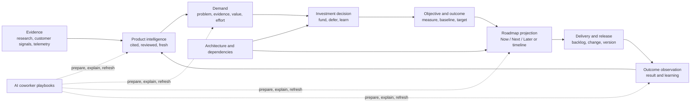
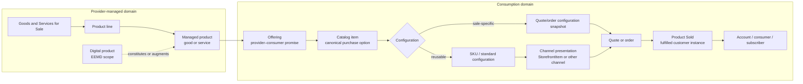

# Product Management Operating Loop

**Date:** 2026-07-27

**Status:** Proposed

**Epic:** `EP-ED496EB0`

**Umbrella backlog item:** `BI-5C5FA641`

**Decision ledger:** `DI-8B3E5799CA59`, `DI-26D56D03E6BD`

**Implementation plan:** `docs/superpowers/plans/2026-07-27-product-management-operating-loop.md`

## 1. Executive summary

DPF already contains much of the substrate a product manager needs: four portfolios, digital products, archetype-derived market offers, product-linked backlog, market research, competitive battlecards, knowledge with revisions and staleness, demand scoring, funding decisions, architecture, releases, storefronts, sales/quotes, scheduling, and AI coworkers. The original design treated `DigitalProduct` as the universal product-management anchor. That is correct for EEMD and DPF's platform-scoped digital-product decisioning, but it is too narrow for the organization-specific goods, services, experiences, access products, and mixed product lines that WWWD must understand.

This amended design keeps EEMD digital-product focused and introduces a connected business-product perspective in the organization's **Goods and Services for Sale** portfolio (stable internal slug: `products_and_services_sold`). A top-down product-line hierarchy describes what the organization creates and manages over time. A separate consumption chain describes how those products are packaged and purchased:

`Product Line → Product → Offering → Catalog Item → optional reusable SKU or order-specific configuration → channel presentation → purchase/consumption`

`CatalogItem` is canonical; `StorefrontItem` becomes a storefront channel projection. The architecture preserves the complete model but automatically collapses the common 1:1 Product ↔ default Offering ↔ Catalog Item case in user experience. Configuration, SKU, bundle, pricing, quote, and Product Sold layers appear only when the business model or actual divergence requires them.

The design converges the existing capabilities behind typed organization, product-line, and product operating-context projections. Product managers and owner-operators receive role-adaptive, action-oriented **Direction** experiences that connect:

1. cited market and customer intelligence;
2. evidence-linked demand and investment decisions;
3. objectives and measurable outcomes;
4. derived, audience-appropriate roadmaps;
5. delivery and release state; and
6. recurring coworker-assisted review workflows;
7. product-line comparisons and rollups;
8. offering, catalog, bundle, configuration, and consumption evidence; and
9. WWWD-grounded proactive business advice.

Roadmaps remain projections of canonical demand, objective, architecture, and delivery state. Catalogs remain consumption projections over managed products, not product-definition authorities. Research remains approval-gated and reviewable. AI actions preview their inputs and proposed mutations. Products remains the canonical management area; no second global PM cockpit is introduced.

## 2. Problem

The current platform has capable but fragmented product-management ingredients:

- product navigation emphasizes delivery, operation, architecture, commercial, and team concerns, but not direction, intelligence, or outcomes;
- market research and battlecards are organization-scoped rather than product-scoped;
- the legacy competitive-analysis skill is guided work rather than a persistent, cited learning loop;
- demand stages and scores exist, but live data showed `3,772` backlog items with no staged or scored items, including `1,345` product-linked items;
- roadmap assembly is described in prompts, but a durable roadmap workflow is not honored by the current substrate;
- there is no canonical product objective/outcome model connecting a bet, its measure, delivered work, and observed learning;
- reusable scheduling exists, but the core PM cadences are not packaged as discoverable product-scoped playbooks.
- the Goods and Services for Sale portfolio does not yet provide a canonical product-line → product hierarchy for non-digital goods and services;
- setup establishes one primary archetype and a seeded market offer but does not confirm common adjacent lines such as salon retail goods, hotel conferences, or restaurant events;
- `StorefrontItem` combines channel presentation and price but has no structural trace to a managed business Product, Offering, or canonical CatalogItem;
- `QuoteLineItem` points directly to `DigitalProduct`, conflating the managed product with the exact sellable configuration;
- the existing `ServiceOffering` is operational-commitment oriented and is not a complete commercial Product Offering;
- DPF has no general Product Sold trace from the purchased offering/catalog item/configuration to account, consumer, subscriber, or installed/provisioned instance; and
- the platform cannot yet roll commercial and operational evidence from product → product line → organization for proactive WWWD advice.

The result is a platform that can store and execute many parts of product work without yet making the product manager's loop feel continuous.

## 3. Lessons being absorbed

The Product Talk article about Claude Code highlights six durable properties: persistent context, reusable systems, parallel work, automatic regeneration, portable artifacts, and accessibility to nontechnical practitioners. DPF is already past the article's tool-centric framing; the useful lesson is to turn these properties into product behavior rather than asking managers to operate a coding agent.

| Lesson | DPF interpretation |
| --- | --- |
| Persistent context | Assemble a durable, product-scoped operating context from canonical platform records with provenance and freshness. |
| Reusable systems | Package recurring PM work as governed playbooks, not one-off chats or hardcoded route prompts. |
| Parallel work | Let approved coworker tasks research, synthesize, score, and prepare views independently while preserving one auditable product context. |
| Automatic regeneration | Recompute derived briefs and roadmap views when canonical evidence, funding, architecture, or delivery state changes. |
| Portable artifacts | Export timestamped, source-linked briefs and roadmap snapshots while retaining the live platform view as canonical. |
| Nontechnical accessibility | Put the workflow in the existing Product UI with plain language, useful defaults, previews, and guided empty states. |

## 4. Research and benchmarking

| Source | Lesson adopted | Boundary |
| --- | --- | --- |
| [Product Talk: Claude Code—What It Is and How It's Different](https://www.producttalk.org/claude-code-what-it-is-and-how-its-different/) | Persistent context, reusable workflows, regeneration, and portable outputs make AI work compound. | DPF exposes these as governed platform behavior, not terminal workflows. |
| [Productboard product roadmaps](https://www.productboard.com/product-roadmap/) and [roadmapping use case](https://www.productboard.com/use-cases/product-roadmapping/) | Trace customer/market insight through prioritization to an always-current roadmap. | Do not copy a separate feature/roadmap source of truth. |
| [Jira Product Discovery overview](https://support.atlassian.com/jira-product-discovery/docs/what-is-jira-product-discovery/) and [views guide](https://www.atlassian.com/software/jira/product-discovery/guides/views/overview) | Flexible list, matrix, board, timeline, and Now/Next/Later views serve different audiences from shared records. | Views are projections; view configuration must not become a second planning ontology. |
| [Plane Cycles](https://plane.so/cycles) and [Operating Manual](https://plane.so/operating-manual) | Recurring cycles and progressive disclosure help teams turn a backlog into a repeatable rhythm. | DPF uses existing schedules and product lifecycle state rather than importing sprint semantics. |
| [OpenProject work packages](https://www.openproject.org/docs/user-guide/work-packages/) | Typed work, hierarchy, timelines, and exports are valuable when they share one work graph. | DPF retains `Epic` and `BacklogItem` as the delivery graph. |
| [Leantime strategy management](https://support.leantime.io/en/article/how-to-use-leantimes-strategy-management-software-16wm52a/) | Strategy becomes useful when goals roll up from ongoing project work. | DPF adds a minimal outcome contract, not a general-purpose strategy-document suite. |
| [The Open Group IT4IT](https://www.opengroup.org/it4it) | Preserve the distinction between managing digital products and offering/consuming them; retain Product, Offering, and Subscriber alignment for digital-product operations. | IT4IT remains the EEMD/digital-product architecture. It does not become the authority for every business-product or commerce concept. |
| [ServiceNow CSDM foundation domain](https://www.servicenow.com/docs/r/servicenow-platform/common-service-data-model-csdm/foundation-domain.html) and current CRM/CSM product data | Product models carry lifecycle/ownership context; current CRM/CSM documentation also includes Sold Product, installed-product/install-base, party, and entitlement concepts. | DPF's generalized Product Sold contract is a cross-archetype commercial-ledger extension informed by these adjacent concepts, not a claim that ServiceNow lacks Sold Product or that the exact DPF contract is a CSDM entity. |
| [ServiceNow Service Catalog use case](https://www.servicenow.com/docs/r/xanadu/servicenow-platform/common-service-data-model-csdm/request-cat-use-case-example.html) | A catalog item is the selectable/requestable consumption surface and may appear through portal and other channels. | DPF generalizes CatalogItem beyond the current storefront; StorefrontItem becomes a channel projection. |
| [ServiceNow product offerings](https://www.servicenow.com/docs/bundle/xanadu-order-management/page/product/tmt-order-mgt/task/som-create-product-offering.html) | Product offerings are orderable commercial forms, may be standalone or bundle-only, and can participate in leads, quotes, and orders. | ServiceNow Sales/Order Management and CSM adjacency is research input, not a claim that these objects are already in CSDM. |

## 5. Governing architecture decision

Three options were compared through the founder kernel:

1. **Surface stitch** — assemble existing data in a new dashboard without changing workflow contracts.
2. **Projected operating loop** — converge existing substrates behind a typed product projection, add only missing product associations and outcome contracts, and derive views.
3. **Parallel PM module** — introduce new idea, insight, roadmap, and objective models with synchronization to existing records.

The kernel selected **projected operating loop** with high confidence, composite score `15.5794`, and a `6.8520` margin. The strongest contributors were Research and Use Standards and Ship Real Functionality. The decision is recorded as `DI-8B3E5799CA59`.

The surface stitch is too passive: it would make fragmentation more visible without activating the workflow. The parallel module violates single-source-of-truth and would require permanent synchronization with demand, delivery, architecture, and knowledge.

### 5.1 Complete model versus user exposure

The operator subsequently ratified a second architecture decision after extending the scope to business products and consumption:

1. **Flat simple model** — combine product, catalog, storefront, and sale concepts.
2. **Complete exposed model** — normalize every layer and expose every layer to every user.
3. **Complete progressive model** — preserve the normalized model, auto-provision/collapse common 1:1 relationships, and reveal complexity only when the archetype, capability profile, or actual commercial divergence requires it.

Kernel consultation `DI-26D56D03E6BD` recommended **complete progressive** with usable, strongly structured signal (`6.6121` composite), no commandment conflict, and a close `0.1684` margin over complete-exposed. Research and Use Standards, Never Assume — Verify, Ground New Work in Existing Platform, Architecture Over Shortcuts, and Single Source of Truth pulled toward the complete model. Human cognitive load pulled against exposing it universally. Because the margin was below the kernel tie threshold, the operator's explicit preference ratifies the decision.

The resulting tradeoff rule is:

> Require every architectural distinction to justify its complexity through lifecycle, ownership, traceability, reuse, or control. When a sound design still introduces substantial complexity, treat usability as part of that design: derive defaults, guide creation, provide contextual navigation, and progressively disclose advanced layers.

## 6. Design principles

1. **Two connected product perspectives.** EEMD `DigitalProduct` remains the digital-product architecture. The organization's Goods and Services for Sale portfolio owns its business Product Lines and Products. Explicit links show when a business Product is constituted or augmented by one or more DigitalProducts.
2. **Preserve the provider–consumer boundary at every scale.** Product lines/products describe what the provider creates and manages. Offerings, CatalogItems, SKUs/configurations, channels, quotes, purchases, and Product Sold describe how a consuming party obtains and uses it. A small business may default the provider to the organization and derive the consumer from ordinary customer records; a large organization may disclose business units, product teams, subscriber types, and delegated ownership. Scale changes the projection, not the boundary or its reporting trace.
3. **Necessary complexity carries a UX obligation.** Do not flatten justified architectural boundaries, but do count their operator and cognitive cost. Offset that cost with derived defaults, guided creation, contextual navigation, and progressive disclosure.
4. **CatalogItem is canonical.** Storefront, mobile, sales-desk, partner, and quote surfaces project the same catalog definition instead of copying it.
5. **Configuration is not automatic catalog growth.** Reusable standard configurations may become SKUs. One-off car/home configurations remain immutable quote/order/Product Sold snapshots unless deliberately promoted.
6. **Evidence before prioritization.** A score or recommendation is explainable through inputs, evidence, estimates, constraints, and provenance.
7. **Derived artifacts stay derived.** Briefs, roadmaps, storefront listings, and channel views do not become duplicate authorities.
8. **AI proposes; governed workflows decide.** Research, commercial changes, investment, and publishing preserve preview, approval, and audit boundaries.
9. **Freshness is visible.** Every evidence-based conclusion exposes source, observed/retrieved time, review state, and staleness.
10. **The first viewport is for action.** It leads with changed evidence, decisions needed, current bets, risks, and outcome posture—not a wall of counts.
11. **Common substrate, archetype vocabulary.** The loop works across products while defaults, labels, sources, and playbooks are archetype-configured.
12. **Refactor before expansion.** Roughly 20% of implementation capacity is reserved for canonical boundaries, compatibility adapters, and invariant coverage.

## 7. Substrate verification ledger

| Proposed concept | Existing substrate | Verdict |
| --- | --- | --- |
| Product context | `DigitalProduct`, `digital-product-view-model.ts`, product relations | Extend into typed organization/product-line/product operating projections; do not persist another context-summary record. |
| Product intelligence | `ResearchProposal`, cited `market-research.ts`, research schedule/execution, `KnowledgeArticle` | Reuse. Add optional product scope to a proposal and propagate it to resulting knowledge. |
| Competitive learning | `MarketingBattlecard`, marketing MCP pack, matrix builder | Reuse. Add optional product scope because positioning differs by product. |
| Demand and investment | `BacklogItem.demandStage`, value inputs, score, investment bucket, estimate provenance, demand UI, funding decision tool | Activate and guard. Do not create an Idea model. |
| Product roadmap | `Epic`, `BacklogItem`, dependencies, architecture, versions, changes | Add a projection contract and views. Do not add a canonical `Roadmap` table in the first release. |
| Product outcome | No product objective, measure, target, observation, and review lifecycle exists. `RouteOutcome` and `DeliberationOutcome` serve unrelated domains. | Add a minimal `ProductObjective` plus append-only `ProductOutcomeObservation`. |
| Persistent artifact | `KnowledgeArticle`, product links, revisions, review and staleness | Reuse for reviewed narrative briefs and exported snapshots when durable storage is required. |
| Recurring workflow | `ScheduledAgentTask`, research schedule, skills/prompts | Reuse and package product-scoped PM playbooks. |
| Audit/signoff | decision interactions, backlog activities, tool execution | Reuse for funding and stakeholder review; do not add a roadmap-approval ledger. |
| Product-line hierarchy | Four-portfolio registry, `DigitalProduct.portfolioId`, taxonomy, archetype market-offer seeding | Existing substrate is insufficient: add a general business ProductLine/Product contract in Goods and Services for Sale; do not broaden EEMD semantics or use taxonomy as mutable organization data. |
| Mixed business lines at setup | `StorefrontArchetypeComposition`, composition views/actions, archetype activation profiles | Extend. Capture business-language product lines during initial setup and derive primary/secondary archetype composition internally. |
| Offering | `ServiceOffering` with availability/MTTR/RTO/support commitments | Reconcile rather than silently repurpose. Define the commercial Offering contract and its relationship to operational service commitments. |
| Canonical catalog item | `StorefrontItem`, archetype item templates, storefront sections | Existing channel-specific substrate is insufficient. Establish CatalogItem as canonical and make StorefrontItem a compatibility projection. |
| SKU and configuration | Price fields on `StorefrontItem`; archetype-specific inventory SKU strings | Add optional reusable SKU/configuration contracts. Keep one-off configurations order-scoped unless deliberately promoted. |
| Catalog packaging | Storefront setup/editing, Quote, QuoteLineItem, SalesOrder, Subscription | Extend behind Catalog Builder. Quote is an optional route, not a requirement. |
| Product Sold | No general DPF purchase-to-product/offering/catalog/configuration/consumer trace exists; `Subscription` is DPF-support specific | A DPF commercial-ledger extension is justified. Current CRM/CSM Sold Product and install-base concepts are standards input; the exact DPF cross-archetype snapshot/evidence contract is not claimed as CSDM. |
| Product-line intelligence | Finance, CRM, storefront, booking, demand, delivery/capacity, outcome records | Add a bounded rollup projection with explicit measure availability and anti-double-counting rules; do not persist a second analytics ledger. |

## 8. Target operating loop



### 8.1 Producer-to-consumer domain contract



The boundaries are normative:

- **Provider–consumer** is a required semantic boundary, not an enterprise-only workflow. The provider is the accountable organization by default and may resolve to explicit business units, teams, or owners when that distinction exists. The consuming party is resolved from actual account, contact, order, subscription, booking, or fulfillment evidence; the platform does not fabricate a generic consumer merely to complete the model.
- **ProductLine** organizes what the business creates and manages, supports nested rollups, and does not change when sales packaging changes.
- **Product** is the managed good or service. A `DigitalProduct` may constitute or augment it, but EEMD remains digital-product focused.
- **Offering** is a sellable commercial promise for a product, including the terms under which it is available.
- **CatalogItem** is the canonical purchase option. `StorefrontItem` becomes a channel-specific projection, not a second product definition.
- **SKU/configuration** is optional. A reusable standard configuration may have a SKU; a one-off configured sale is stored as an immutable quote/order snapshot unless someone deliberately promotes it into the reusable catalog.
- **Quote** is an optional commercial route. A price-list item may proceed directly to order.
- **Product Sold** is the immutable commercial trace from a real transaction line or booking/rental event back to provider, product, offering, catalog item, configuration, pricing, and any evidence-backed party, entitlement, or fulfillment instance. It is a DPF extension informed by current CRM/CSM Sold Product and install-base concepts, not a claim that the exact DPF contract is part of CSDM.

A bundle such as car + financing + insurance, a full dinner experience, or a haircut-and-shave special is a consumption package. It may link catalog items from multiple product lines, but it does not rewrite the product hierarchy. Rollups must distinguish product performance from package sales so a bundle does not double count revenue or volume.

### 8.2 Progressive exposure contract

The complete model is internal. The user sees the smallest truthful projection:

| Business situation | Default experience | Advanced concept disclosed |
| --- | --- | --- |
| Owner-operated business with no internal product organization | The business is the provider; ordinary customers, bookings, or orders establish the consuming party | No product-team, subscriber-type, or delegated-governance setup |
| Multi-team or multi-business-unit enterprise | Provider ownership and consuming populations are explicit where they affect accountability, access, funding, or service levels | Business unit, product team, consumer type, subscription, entitlement, delegated ownership |
| One fixed product sold one way | One “what you sell” record; default offering and catalog item are derived | None |
| Same product with channel, price, or term variants | “Ways customers can buy it” | Offering and catalog-item variants |
| Standard configurable product | Product plus reusable options/configurations | SKU or standard configuration |
| One-off configured sale | Configuration captured in the quote/order | Sale-specific snapshot, not a new SKU |
| Off-the-lot sale | Select a standard SKU and, where relevant, a physical unit | Inventory/serialized-instance details |
| Bundle, promotion, or seasonal package | Catalog Builder composes existing catalog items | Bundle membership, price, validity, channel |
| Negotiated sale | Quote workflow appears only when required | Quote, revision, approval, acceptance |

There is no global “simple mode” and “advanced mode.” Disclosure follows the selected archetype and product lines, enabled capabilities, observed data, and the task the user is performing. Authorized users retain drill-down and audit access without being required to maintain every layer manually.

### 8.3 Initial product-line setup

Initial setup asks **“What does your business sell?”** in business language. The user selects a primary line and any adjacent lines common to the archetype, then adds or removes products and services. Examples include:

- hotel rooms plus conferences and events;
- restaurant dining plus catered or booked events;
- salon services plus hair-care goods;
- vehicle sales plus financing and insurance;
- construction services plus standard and configured homes.

The platform derives the organization’s archetype composition, product-line hierarchy, starter products, default one-to-one offerings/catalog items, provider identity, and WWWD context. For a simple business, the organization is the provider and no separate product-team or subscriber model is requested. Consumer relationships arise from real customer, booking, order, subscription, or fulfillment evidence. Technical constructs stay behind the setup projection unless the selections or observed operating model require them. Product-line changes after setup remain a future lifecycle concern, but setup records provenance and effective state so later change management can be added without redefining the model.

### 8.4 Product operating context

`ProductOperatingContext` is a server-side TypeScript read model, assembled through explicit query adapters:

- organization, product-line, and product identity, lifecycle, ownership, and architecture constraints;
- constituting or augmenting digital products and manufacturing/delivery enablers where relevant;
- offering, catalog, sales, and consumption posture without treating those records as product definitions;
- new or changed intelligence with source and review metadata;
- demand funnel counts plus top explainable items;
- pending decisions and funding posture;
- active objectives and overdue reviews;
- roadmap projection and dependency confidence;
- delivery/release changes;
- configured PM playbooks and next runs.

The context returns source IDs and `asOf` timestamps. It does not store generated prose. Narrative summaries are generated from this bounded context and can be promoted to a product-linked `KnowledgeArticle` revision when a manager chooses to retain one.

### 8.5 Data-model sequencing

The child backlog items own final Prisma and API shapes after code-graph and live-schema verification. Do not rename or repurpose `StorefrontItem`, `ServiceOffering`, or `QuoteLineItem` in a one-step migration. Use expand → backfill → switch reads/writes → contract, with compatibility projections during the transition.

The first implementation increments remain additive:

Add nullable `digitalProductId` relations to:

- `ResearchProposal`: a proposal is either organization-wide or for one product. Product scope is copied into resulting knowledge links.
- `MarketingBattlecard`: a card is either organization-wide or product-specific. Product-specific positioning may coexist with an organization-wide card.

Add:

```text
ProductObjective
  objectiveId, digitalProductId, title, problemStatement, outcomeHypothesis
  ownerPrincipalId?, measureKind, measureDefinition, baseline?, target?
  status, reviewCadence?, reviewAt?, createdAt, updatedAt

ProductObjectiveWork
  objectiveId, backlogItemId, contributionKind

ProductOutcomeObservation
  observationId, objectiveId, observedAt, value?, narrative?
  sourceKind, sourceRef?, confidence?, recordedByPrincipalId?, createdAt
```

Fixed string values are canonical enums in one TypeScript module and mirrored exactly in MCP schemas. Observations are append-only; corrections supersede rather than overwrite. Qualitative outcomes remain first-class through `narrative` plus evidence references.

The migration is expand-first:

- new tables are additive;
- product foreign keys on existing models are nullable;
- no existing organization-wide research or battlecard is guessed into a product;
- no existing storefront or quote line is guessed into a product, offering, catalog item, or configuration without deterministic evidence;
- any later tightening or uniqueness rule is a separate fleet-safe contract step.

### 8.6 Demand activation

The current demand fields become an explicit product workflow:

1. capture or link the problem and evidence;
2. select a demand stage;
3. capture value inputs and their confidence;
4. use known estimate provenance or mark it unknown;
5. calculate and explain the demand score;
6. assign an investment bucket;
7. route funding through the existing governed approval;
8. link funded work to an objective before it appears as a committed roadmap bet.

Legacy rows are classified, not silently invented. An idempotent migration or governed backfill may assign a neutral intake stage only when a deterministic rule exists; otherwise the UI presents an explicit “not yet classified” queue. New product demand cannot silently omit its stage after the activation release.

### 8.7 Roadmap projections

The roadmap query takes canonical inputs and produces:

- **Now / Next / Later** for broad alignment;
- **timeline** where dates are supported by release/change evidence;
- **outcome view** grouped by objective;
- **dependency view** for architecture and delivery coordination.

Every card explains:

- the source demand and objective;
- funding/commitment state;
- timing confidence;
- dependencies or blockers;
- the evidence change that last moved it.

Managers may filter and save audience preferences. They cannot directly drag a funded item into a contradictory state; the interaction opens the canonical funding, dependency, or delivery control. A portable export records filters, source IDs, `asOf`, and confidence.

### 8.8 Reusable playbooks

Initial product-scoped recipes:

- weekly intelligence review;
- demand triage and score-readiness review;
- investment decision preparation;
- roadmap refresh and stakeholder brief;
- monthly/quarterly outcome review.

Each recipe declares inputs, read tools, proposed writes, approval requirements, schedule, output contract, and failure/staleness behavior. The product manager can preview, schedule, pause, rerun, and inspect the evidence used.

## 9. UX and information architecture

### 9.1 Owning area

The Products home at `/portfolio` remains the canonical place to browse Goods and Services for Sale. It gains a top-down product-line hierarchy and rollups without adding a new global destination. The existing product route remains `/portfolio/product/[id]`. Add a **Direction** family to `ProductTabNav`, with:

- Brief (`/direction`);
- Intelligence (`/direction/intelligence`);
- Roadmap (`/direction/roadmap`);
- Outcomes (`/direction/outcomes`).

`ProductTabNav` already has a **Commercial** family whose **Offerings** subroute
(`/portfolio/product/[id]/offerings`) renders `ServiceOffering` rows directly today
(`apps/web/app/(shell)/portfolio/product/[id]/offerings/page.tsx`). This is the existing
front-end home for exactly the record §7 already flags for reconciliation. The canonical
commercial Offering/CatalogItem contract extends this existing Commercial > Offerings tab; it does
not stand up Catalog Builder, or any other surface, as a second product-level commercial home.
Reconciling `ServiceOffering` without naming this route risks the operational-commitment view and
the new commercial-Offering view drifting into two competing "what does this product sell"
surfaces — the exact failure mode the design's other guardrails prevent everywhere else.

The product Overview remains a concise identity/posture page and may show a single “Direction needs attention” handoff. Demand stays structurally backed by the existing backlog; the Direction brief projects the relevant demand state rather than moving or duplicating it. Catalog Builder remains an internal Storefront capability reached contextually from the product or the Storefront; it does not become a competing product-management home. Any new subroute is subject to the navigation audit in its child item.

### 9.2 First viewport

The Direction brief shows, in order:

1. **Needs your decision** — funding, review, stale evidence, and blocked outcome reviews;
2. **What changed** — source-linked deltas since the manager's last review;
3. **Current bets** — funded work grouped by outcome with confidence;
4. **Are outcomes moving?** — latest observation against baseline/target;
5. **Next coworker runs** — scheduled PM playbooks and clear pause/preview controls.

Counts and trend charts are secondary. Empty states teach the next useful action: run or approve research, classify product demand, define the first outcome, or connect delivery work.

### 9.3 Interaction and accessibility contract

- Use business language first: “what you sell,” “ways customers can buy it,” “options,” and “customer purchases.” Canonical entity names remain available in help, audit, and advanced detail.
- Collapse derived one-to-one Product → Offering → CatalogItem relationships into one workflow. Reveal the layers when prices, channels, terms, configurations, bundles, or quote requirements diverge.
- When users must work with necessary complexity, provide a guided creation flow, sensible defaults, breadcrumbs/related-record navigation, and an explanation of why the additional layer exists.
- Do not require a global advanced mode. Disclosure follows the current task and the record’s actual capabilities.
- Reuse `SectionNav`, report-kit components, shared filters, knowledge cards, and staleness indicators.
- One primary action per page; secondary actions use menus or contextual links.
- AI write actions show the context window, proposed records, sources, and approval boundary before execution.
- Derived content is labeled with source and `asOf`; stale or incomplete content never looks authoritative.
- Keyboard order, visible focus, semantic headings, text alternatives, contrast, touch targets, 200% zoom, and narrow-width behavior meet the platform usability standard.
- Loading, partial-data, empty, stale, unauthorized, and failed-run states are designed explicitly.

## 10. Permissions, trust, and provenance

- Product visibility and mutations use existing product, backlog, knowledge, and decision authorization.
- Research execution remains approval-gated; generated corpus entries remain drafts until reviewed.
- Outcome observations identify source kind and optional source reference.
- Roadmap exports carry provenance and are never accepted back as authoritative imports.
- AI summaries separate sourced facts, calculated values, and inferences.
- Cross-product and organization-wide evidence is visible only when the caller is authorized for both the evidence and target product.

## 11. Success measures

Measure the loop without turning activity into a vanity score:

- percentage of active products with reviewed intelligence in the freshness window;
- percentage of product-linked demand classified and explainably scored;
- median time from new evidence to a recorded investment decision;
- percentage of funded roadmap bets linked to an active objective;
- percentage of due objective reviews completed on time;
- percentage of released bets with a subsequent outcome observation;
- percentage of active business products assigned to a product line;
- product-line contribution and trend coverage, with bundled sales reconciled against component attribution;
- rate at which one-off configurations are deliberately promoted to reusable catalog configurations;
- roadmap exports generated from current state rather than manually maintained artifacts;
- manager correction/override rate for AI-prepared summaries and scores.

Guardrails:

- no decrease in source/provenance completeness;
- no automatic publishing of research;
- no growth in duplicate roadmap or idea authorities;
- no uncontrolled SKU/catalog growth from one-off configured sales;
- no double counting of bundle sales in product-line rollups;
- no AI mutation without its declared approval contract.

## 12. Rollout

1. Establish product-line setup and the Product → Offering → CatalogItem compatibility contract behind feature flags.
2. Add Catalog Builder packaging, reusable configuration, and one-off configuration snapshot behavior.
3. Add Product Sold traceability without making it a current-CSDM claim or blocking simple price-list sales.
4. Establish the organization/product-line/product operating projection.
5. Add outcome contracts and API/MCP surfaces.
6. Activate demand for a small set of products with an explicit unclassified queue.
7. Introduce role-adaptive Direction views and roadmap projections.
8. Add product-line advice, scheduled playbooks, and exports.
9. Expand defaults after adoption, correction, navigation, and outcome-review evidence is healthy.

The rollout is product-selective before becoming an organization default. Existing organization-wide research, battlecards, backlog, and product pages continue to function throughout.

## 13. Architecture review (advisory)

- **Alignment summary:** Well aligned with guardrails after separating the business-product hierarchy from EEMD, the producer lifecycle from the consumption lifecycle, and the complete architecture from its task-specific presentation.
- **Data model:** The design extends `DigitalProduct`, storefront, quote/order, research, battlecard, knowledge, and backlog substrate. New ProductLine, commercial Offering/CatalogItem, optional reusable configuration, Product Sold traceability, and objective/outcome contracts are justified gaps, but their final shapes require child-level schema/code-graph verification. Objective ownership resolves through `Principal`; it does not introduce another identity string.
- **Single source of truth:** Product/ProductLine owns what the organization manages; CatalogItem owns the canonical purchase option; StorefrontItem is a channel projection; quote/order owns sale-specific configuration snapshots; Product Sold owns fulfilled-customer traceability; demand remains the idea/investment authority; knowledge remains the reviewed narrative authority; roadmap and brief content remain projections.
- **Substrate fit:** The management experience stays in Products, Catalog Builder stays in internal Storefront management, the scheduler and research executor are reused, reporting UI composes report-kit, and organization/product-line/product query logic converges behind one read model.
- **Provider–consumer invariant:** Organizational scale changes the projection, not the semantic boundary. `Organization` is the default provider identity; subordinate provider/team structure is disclosed only when real accountability requires it, and consuming parties resolve from canonical customer/transaction evidence rather than placeholder records.
- **Important (added on re-review):** the existing `ProductTabNav` "Commercial" family already has an
  "Offerings" tab (`/portfolio/product/[id]/offerings`) that renders `ServiceOffering` rows today —
  the exact record §7 flags for reconciliation. §9.1 named this route and its resolution (the
  canonical Offering/CatalogItem contract extends this tab; it is not a second commercial-product
  surface) so Delivery does not have to discover the collision mid-implementation.
- **Enums and contracts:** New fixed strings must have one canonical TypeScript registry and exact MCP mirrors. Hyphens are required. No new value may be used in data before both contracts land.
- **Blast radius:** Prisma schema/migrations, setup/archetype composition, product/storefront/quote/order relations, research execution, battlecard services and MCP pack, backlog demand rules, product navigation/routes, Catalog Builder, report components, skills/prompts, scheduled tasks, exports, telemetry, user guide, and tests.
- **Standards researched:** Product Talk, Productboard, Jira Product Discovery, Plane, OpenProject, Leantime, IT4IT, and official ServiceNow CSDM, CRM/CSM product-data, catalog, product-offering, Sold Product, and install-base guidance informed traceability, producer/consumer separation, derived audience views, recurring rhythms, progressive disclosure, and outcome roll-up. DPF does not claim that its exact cross-archetype Product Sold ledger is a CSDM contract.
- **Escalated decisions:** `DI-8B3E5799CA59` selected the projected operating loop. `DI-26D56D03E6BD` selected a complete model with progressive exposure; the operator refined this into a tradeoff rule that requires necessary architectural complexity to carry compensating creation and navigation aids.
- **Reference-doc feedback:** None. The current architecture, usability, schema-audit, and single-source-of-truth references cover the durable rules found in this review.
- **Recommended next step:** Proceed through the decomposed child items, beginning with product-line/setup and catalog-contract foundations before the operating-context refactor, and re-run substrate and UX-fit verification in each implementation branch.

## 14. UX fit review

- **Decision:** `fits-with-guardrails`; the complete model is appropriate only with the progressive exposure, guided creation, and contextual navigation contract in Sections 8.2, 8.3, and 9.
- **Owning area:** Products for creation/management; internal Storefront/Catalog Builder for packaging and consumption.
- **Route family:** `/portfolio`, `/portfolio/product/[id]/direction` and its Intelligence, Roadmap, and Outcomes sibling views; Catalog Builder placement must reuse the verified Storefront route family.
- **Primary personas:** A professional product manager and a small-business owner/solopreneur need the same underlying insight. Vocabulary, density, and guided defaults adapt without creating separate data models.
- **Navigation layer touched:** Product hierarchy/section navigation plus contextual transitions into Catalog Builder and consumption traceability; no global navigation.
- **Reuse/convergence:** Existing portfolio navigation, `ProductTabNav`, `SectionNav`, internal Storefront management, report-kit, knowledge cards, staleness indicators, shared filters, and scheduled-task controls. New components express product-specific composition, not a new visual dialect.
- **Source truth:** `ProductOperatingContext` projects canonical organization, product-line, product, digital-product, offering/catalog, consumption, research, knowledge, demand, objective, decision, architecture, release, change, and schedule sources.
- **Empty/failure behavior:** Every page provides an honest next action for fresh, partial, stale, unavailable-provider, failed-run, and unauthorized states. Empty pages do not render zero-filled dashboards.
- **AI boundary:** Informational cards and navigation never send prompts. Research, scoring, scheduling, mutation, and publishing actions require a context/write preview and the existing confirmation or approval boundary.
- **Design-intelligence checks:** Adopt helpful empty states, URL-addressable view/filter state, visible active/disabled states, clear focus, readable type, and minimal/direct composition. Reject decorative dashboard density, alert animation, and hardcoded style/color recommendations.
- **Evidence before merge:** Route and component tests; source-ID/provenance assertions; theme-token scan; browser verification at desktop and narrow widths, 200% zoom, keyboard-only operation, and populated/empty/stale/unauthorized fixtures; AI preview/cancel/approve exercises.
- **Captured in:** this design and `docs/superpowers/plans/2026-07-27-product-management-operating-loop.md`.

## 15. Non-goals

- replacing the canonical backlog, epic, architecture, change, release, knowledge, or decision models;
- introducing a free-standing Idea database;
- adding a second global dashboard or command center;
- making AI-generated research or scores authoritative without review;
- promising dates where delivery evidence only supports sequence or confidence;
- building a general OKR suite unrelated to product bets and learning;
- auto-associating legacy organization records to products using guesses.
- broadening EEMD beyond digital products or treating a business product line as an EEMD portfolio;
- claiming CatalogItem or Product Sold is already part of current CSDM;
- exposing every canonical layer to every user or requiring formal quotes for price-list purchases;
- auto-materializing a reusable SKU for every one-off configured sale;
- changing the product hierarchy when a bundle, promotion, or sales package changes.

## 16. Open implementation questions

These are bounded implementation decisions, not architecture forks:

- whether the first outcome measure supports a small typed family (`number`, `percentage`, `currency`, `duration`, `qualitative`) or uses a unit-plus-value contract;
- whether saved roadmap audience preferences belong in the existing user preference substrate or a small product-view configuration record;
- the deterministic eligibility rule, if any, for initially assigning legacy product-linked backlog to the intake stage;
- which existing decision interaction type best records stakeholder roadmap review without expanding its enum;
- the lifecycle and approval rule for promoting a successful one-off configuration into a reusable catalog configuration/SKU;
- how mixed-line bundle revenue and volume are attributed without double counting;
- the exact compatibility projection and migration sequence from `StorefrontItem` and operational `ServiceOffering` to the canonical commercial contract.

Each question must be resolved against the verified substrate and recorded in the implementing child backlog item before migration or UI work begins.
