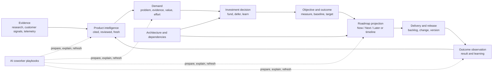

# Product Management Operating Loop

**Date:** 2026-07-27

**Status:** Proposed

**Epic:** `EP-ED496EB0`

**Umbrella backlog item:** `BI-5C5FA641`

**Decision ledger:** `DI-8B3E5799CA59`

**Implementation plan:** `docs/superpowers/plans/2026-07-27-product-management-operating-loop.md`

## 1. Executive summary

DPF already contains much of the substrate a product manager needs: digital products, product-linked backlog, market research, competitive battlecards, knowledge with revisions and staleness, demand scoring, funding decisions, architecture, releases, scheduling, and AI coworkers. The gap is not another product-management database. The gap is a coherent operating loop that keeps those capabilities product-scoped, evidence-backed, current, explainable, and easy to use.

This design converges the existing capabilities behind a typed `ProductOperatingContext` projection and adds only the missing canonical outcome-learning contract. Product managers receive an action-oriented **Direction** area inside the existing Product workspace. It connects:

1. cited market and customer intelligence;
2. evidence-linked demand and investment decisions;
3. objectives and measurable outcomes;
4. derived, audience-appropriate roadmaps;
5. delivery and release state; and
6. recurring coworker-assisted review workflows.

Roadmaps remain projections of canonical demand, objective, architecture, and delivery state. Research remains approval-gated and reviewable. AI actions preview their inputs and proposed mutations. The product workspace remains the owner; no second global PM cockpit is introduced.

## 2. Problem

The current platform has capable but fragmented product-management ingredients:

- product navigation emphasizes delivery, operation, architecture, commercial, and team concerns, but not direction, intelligence, or outcomes;
- market research and battlecards are organization-scoped rather than product-scoped;
- the legacy competitive-analysis skill is guided work rather than a persistent, cited learning loop;
- demand stages and scores exist, but live data showed `3,772` backlog items with no staged or scored items, including `1,345` product-linked items;
- roadmap assembly is described in prompts, but a durable roadmap workflow is not honored by the current substrate;
- there is no canonical product objective/outcome model connecting a bet, its measure, delivered work, and observed learning;
- reusable scheduling exists, but the core PM cadences are not packaged as discoverable product-scoped playbooks.

The result is a platform that can store and execute many parts of product work without yet making the product manager's loop feel continuous.

## 3. Lessons being absorbed

The Product Talk article about Claude Code highlights six durable properties: persistent context, reusable systems, parallel work, automatic regeneration, portable artifacts, and accessibility to nontechnical practitioners. DPF is already past the article's tool-centric framing; the useful lesson is to turn these properties into product behavior rather than asking managers to operate a coding agent.

| Lesson | DPF interpretation |
| --- | --- |
| Persistent context | Assemble a durable, product-scoped operating context from canonical platform records with provenance and freshness. |
| Reusable systems | Package recurring PM work as governed playbooks, not one-off chats or hardcoded route prompts. |
| Parallel work | Let approved coworker tasks research, synthesize, score, and prepare views independently while preserving one auditable product context. |
| Automatic regeneration | Recompute derived briefs and roadmap views when canonical evidence, funding, architecture, or delivery state changes. |
| Portable artifacts | Export timestamped, source-linked briefs and roadmap snapshots while retaining the live platform view as canonical. |
| Nontechnical accessibility | Put the workflow in the existing Product UI with plain language, useful defaults, previews, and guided empty states. |

## 4. Research and benchmarking

| Source | Lesson adopted | Boundary |
| --- | --- | --- |
| [Product Talk: Claude Code—What It Is and How It's Different](https://www.producttalk.org/claude-code-what-it-is-and-how-its-different/) | Persistent context, reusable workflows, regeneration, and portable outputs make AI work compound. | DPF exposes these as governed platform behavior, not terminal workflows. |
| [Productboard product roadmaps](https://www.productboard.com/product-roadmap/) and [roadmapping use case](https://www.productboard.com/use-cases/product-roadmapping/) | Trace customer/market insight through prioritization to an always-current roadmap. | Do not copy a separate feature/roadmap source of truth. |
| [Jira Product Discovery overview](https://support.atlassian.com/jira-product-discovery/docs/what-is-jira-product-discovery/) and [views guide](https://www.atlassian.com/software/jira/product-discovery/guides/views/overview) | Flexible list, matrix, board, timeline, and Now/Next/Later views serve different audiences from shared records. | Views are projections; view configuration must not become a second planning ontology. |
| [Plane Cycles](https://plane.so/cycles) and [Operating Manual](https://plane.so/operating-manual) | Recurring cycles and progressive disclosure help teams turn a backlog into a repeatable rhythm. | DPF uses existing schedules and product lifecycle state rather than importing sprint semantics. |
| [OpenProject work packages](https://www.openproject.org/docs/user-guide/work-packages/) | Typed work, hierarchy, timelines, and exports are valuable when they share one work graph. | DPF retains `Epic` and `BacklogItem` as the delivery graph. |
| [Leantime strategy management](https://support.leantime.io/en/article/how-to-use-leantimes-strategy-management-software-16wm52a/) | Strategy becomes useful when goals roll up from ongoing project work. | DPF adds a minimal outcome contract, not a general-purpose strategy-document suite. |

## 5. Governing architecture decision

Three options were compared through the founder kernel:

1. **Surface stitch** — assemble existing data in a new dashboard without changing workflow contracts.
2. **Projected operating loop** — converge existing substrates behind a typed product projection, add only missing product associations and outcome contracts, and derive views.
3. **Parallel PM module** — introduce new idea, insight, roadmap, and objective models with synchronization to existing records.

The kernel selected **projected operating loop** with high confidence, composite score `15.5794`, and a `6.8520` margin. The strongest contributors were Research and Use Standards and Ship Real Functionality. The decision is recorded as `DI-8B3E5799CA59`.

The surface stitch is too passive: it would make fragmentation more visible without activating the workflow. The parallel module violates single-source-of-truth and would require permanent synchronization with demand, delivery, architecture, and knowledge.

## 6. Design principles

1. **One product graph.** Evidence, demand, objectives, roadmap projections, delivery, and outcomes must resolve to a `DigitalProduct`.
2. **Evidence before prioritization.** A score is explainable through inputs, evidence, estimates, and provenance.
3. **Derived artifacts stay derived.** Briefs and roadmaps are read models. Exported snapshots are records of communication, not new planning authorities.
4. **AI proposes; governed workflows decide.** Research execution, demand mutation, funding, and publishing preserve preview, approval, and audit boundaries.
5. **Freshness is visible.** Every evidence-based conclusion exposes source, observed/retrieved time, review state, and staleness.
6. **The first viewport is for action.** It leads with changed evidence, decisions needed, current bets, risks, and outcome posture—not a wall of counts.
7. **Common substrate, archetype vocabulary.** The loop works across products while labels, sources, and playbooks can be configured for an archetype.
8. **Refactor before expansion.** Roughly 20% of implementation capacity is reserved for the operating-context boundary and invariant coverage.

## 7. Substrate verification ledger

| Proposed concept | Existing substrate | Verdict |
| --- | --- | --- |
| Product context | `DigitalProduct`, `digital-product-view-model.ts`, product relations | Extend as a typed read-only `ProductOperatingContext`; do not persist another context record. |
| Product intelligence | `ResearchProposal`, cited `market-research.ts`, research schedule/execution, `KnowledgeArticle` | Reuse. Add optional product scope to a proposal and propagate it to resulting knowledge. |
| Competitive learning | `MarketingBattlecard`, marketing MCP pack, matrix builder | Reuse. Add optional product scope because positioning differs by product. |
| Demand and investment | `BacklogItem.demandStage`, value inputs, score, investment bucket, estimate provenance, demand UI, funding decision tool | Activate and guard. Do not create an Idea model. |
| Product roadmap | `Epic`, `BacklogItem`, dependencies, architecture, versions, changes | Add a projection contract and views. Do not add a canonical `Roadmap` table in the first release. |
| Product outcome | No product objective, measure, target, observation, and review lifecycle exists. `RouteOutcome` and `DeliberationOutcome` serve unrelated domains. | Add a minimal `ProductObjective` plus append-only `ProductOutcomeObservation`. |
| Persistent artifact | `KnowledgeArticle`, product links, revisions, review and staleness | Reuse for reviewed narrative briefs and exported snapshots when durable storage is required. |
| Recurring workflow | `ScheduledAgentTask`, research schedule, skills/prompts | Reuse and package product-scoped PM playbooks. |
| Audit/signoff | decision interactions, backlog activities, tool execution | Reuse for funding and stakeholder review; do not add a roadmap-approval ledger. |

## 8. Target operating loop



### 8.1 Product operating context

`ProductOperatingContext` is a server-side TypeScript read model, assembled through explicit query adapters:

- product identity, lifecycle, ownership, and architecture constraints;
- new or changed intelligence with source and review metadata;
- demand funnel counts plus top explainable items;
- pending decisions and funding posture;
- active objectives and overdue reviews;
- roadmap projection and dependency confidence;
- delivery/release changes;
- configured PM playbooks and next runs.

The context returns source IDs and `asOf` timestamps. It does not store generated prose. Narrative summaries are generated from this bounded context and can be promoted to a product-linked `KnowledgeArticle` revision when a manager chooses to retain one.

### 8.2 Minimal data changes

Add nullable `digitalProductId` relations to:

- `ResearchProposal`: a proposal is either organization-wide or for one product. Product scope is copied into resulting knowledge links.
- `MarketingBattlecard`: a card is either organization-wide or product-specific. Product-specific positioning may coexist with an organization-wide card.

Add:

```text
ProductObjective
  objectiveId, digitalProductId, title, problemStatement, outcomeHypothesis
  ownerPrincipalId?, measureKind, measureDefinition, baseline?, target?
  status, reviewCadence?, reviewAt?, createdAt, updatedAt

ProductObjectiveWork
  objectiveId, backlogItemId, contributionKind

ProductOutcomeObservation
  observationId, objectiveId, observedAt, value?, narrative?
  sourceKind, sourceRef?, confidence?, recordedByPrincipalId?, createdAt
```

Fixed string values are canonical enums in one TypeScript module and mirrored exactly in MCP schemas. Observations are append-only; corrections supersede rather than overwrite. Qualitative outcomes remain first-class through `narrative` plus evidence references.

The migration is expand-first:

- new tables are additive;
- product foreign keys on existing models are nullable;
- no existing organization-wide research or battlecard is guessed into a product;
- any later tightening or uniqueness rule is a separate fleet-safe contract step.

### 8.3 Demand activation

The current demand fields become an explicit product workflow:

1. capture or link the problem and evidence;
2. select a demand stage;
3. capture value inputs and their confidence;
4. use known estimate provenance or mark it unknown;
5. calculate and explain the demand score;
6. assign an investment bucket;
7. route funding through the existing governed approval;
8. link funded work to an objective before it appears as a committed roadmap bet.

Legacy rows are classified, not silently invented. An idempotent migration or governed backfill may assign a neutral intake stage only when a deterministic rule exists; otherwise the UI presents an explicit “not yet classified” queue. New product demand cannot silently omit its stage after the activation release.

### 8.4 Roadmap projections

The roadmap query takes canonical inputs and produces:

- **Now / Next / Later** for broad alignment;
- **timeline** where dates are supported by release/change evidence;
- **outcome view** grouped by objective;
- **dependency view** for architecture and delivery coordination.

Every card explains:

- the source demand and objective;
- funding/commitment state;
- timing confidence;
- dependencies or blockers;
- the evidence change that last moved it.

Managers may filter and save audience preferences. They cannot directly drag a funded item into a contradictory state; the interaction opens the canonical funding, dependency, or delivery control. A portable export records filters, source IDs, `asOf`, and confidence.

### 8.5 Reusable playbooks

Initial product-scoped recipes:

- weekly intelligence review;
- demand triage and score-readiness review;
- investment decision preparation;
- roadmap refresh and stakeholder brief;
- monthly/quarterly outcome review.

Each recipe declares inputs, read tools, proposed writes, approval requirements, schedule, output contract, and failure/staleness behavior. The product manager can preview, schedule, pause, rerun, and inspect the evidence used.

## 9. UX and information architecture

### 9.1 Owning area

The canonical route remains `/portfolio/product/[id]`. Add a **Direction** family to `ProductTabNav`, with:

- Brief (`/direction`);
- Intelligence (`/direction/intelligence`);
- Roadmap (`/direction/roadmap`);
- Outcomes (`/direction/outcomes`).

The product Overview remains a concise identity/posture page and may show a single “Direction needs attention” handoff. Demand stays structurally backed by the existing backlog; the Direction brief projects the relevant demand state rather than moving or duplicating it. No new top-level navigation item is added.

### 9.2 First viewport

The Direction brief shows, in order:

1. **Needs your decision** — funding, review, stale evidence, and blocked outcome reviews;
2. **What changed** — source-linked deltas since the manager's last review;
3. **Current bets** — funded work grouped by outcome with confidence;
4. **Are outcomes moving?** — latest observation against baseline/target;
5. **Next coworker runs** — scheduled PM playbooks and clear pause/preview controls.

Counts and trend charts are secondary. Empty states teach the next useful action: run or approve research, classify product demand, define the first outcome, or connect delivery work.

### 9.3 Interaction and accessibility contract

- Reuse `SectionNav`, report-kit components, shared filters, knowledge cards, and staleness indicators.
- One primary action per page; secondary actions use menus or contextual links.
- AI write actions show the context window, proposed records, sources, and approval boundary before execution.
- Derived content is labeled with source and `asOf`; stale or incomplete content never looks authoritative.
- Keyboard order, visible focus, semantic headings, text alternatives, contrast, touch targets, 200% zoom, and narrow-width behavior meet the platform usability standard.
- Loading, partial-data, empty, stale, unauthorized, and failed-run states are designed explicitly.

## 10. Permissions, trust, and provenance

- Product visibility and mutations use existing product, backlog, knowledge, and decision authorization.
- Research execution remains approval-gated; generated corpus entries remain drafts until reviewed.
- Outcome observations identify source kind and optional source reference.
- Roadmap exports carry provenance and are never accepted back as authoritative imports.
- AI summaries separate sourced facts, calculated values, and inferences.
- Cross-product and organization-wide evidence is visible only when the caller is authorized for both the evidence and target product.

## 11. Success measures

Measure the loop without turning activity into a vanity score:

- percentage of active products with reviewed intelligence in the freshness window;
- percentage of product-linked demand classified and explainably scored;
- median time from new evidence to a recorded investment decision;
- percentage of funded roadmap bets linked to an active objective;
- percentage of due objective reviews completed on time;
- percentage of released bets with a subsequent outcome observation;
- roadmap exports generated from current state rather than manually maintained artifacts;
- manager correction/override rate for AI-prepared summaries and scores.

Guardrails:

- no decrease in source/provenance completeness;
- no automatic publishing of research;
- no growth in duplicate roadmap or idea authorities;
- no AI mutation without its declared approval contract.

## 12. Rollout

1. Establish the projection and associations behind feature flags.
2. Add outcome contracts and API/MCP surfaces.
3. Activate demand for a small set of products with an explicit unclassified queue.
4. Introduce Direction views and roadmap projections.
5. Add scheduled playbooks and exports.
6. Expand defaults after adoption, correction, and outcome-review evidence is healthy.

The rollout is product-selective before becoming an organization default. Existing organization-wide research, battlecards, backlog, and product pages continue to function throughout.

## 13. Architecture review (advisory)

- **Alignment summary:** Well aligned after folding the convergence, principal, enum, projection, and fleet-safe migration guardrails into this design.
- **Data model:** The design extends `DigitalProduct`, `ResearchProposal`, `MarketingBattlecard`, `KnowledgeArticle`, and `BacklogItem`. The only new canonical entity is the outcome contract proven absent by schema audit. Objective ownership resolves through `Principal`; it does not introduce another identity string.
- **Single source of truth:** Demand remains the idea/investment authority; knowledge remains the reviewed narrative authority; roadmap and brief content remain projections; decision interactions remain the approval/audit authority.
- **Substrate fit:** The route stays in Products, the scheduler and research executor are reused, reporting UI composes report-kit, and product query logic converges behind one read model.
- **Enums and contracts:** New fixed strings must have one canonical TypeScript registry and exact MCP mirrors. Hyphens are required. No new value may be used in data before both contracts land.
- **Blast radius:** Prisma schema/migration, product inverse relations, research execution, battlecard services and MCP pack, backlog demand rules, product navigation/routes, report components, skills/prompts, scheduled tasks, exports, telemetry, user guide, and tests.
- **Standards researched:** Product Talk, Productboard, Jira Product Discovery, Plane, OpenProject, and Leantime informed traceability, derived audience views, recurring rhythms, progressive disclosure, and outcome roll-up. Their separate idea/roadmap authorities were explicitly rejected because DPF already has canonical demand and delivery records.
- **Escalated decision:** Surface stitch vs projected operating loop vs parallel PM module was governed through the kernel; `DI-8B3E5799CA59` selected the projected loop.
- **Reference-doc feedback:** None. The current architecture, usability, schema-audit, and single-source-of-truth references cover the durable rules found in this review.
- **Recommended next step:** Proceed through the decomposed child items, beginning with the operating-context refactor and re-running substrate verification in each implementation branch.

## 14. UX fit review

- **Decision:** `fits-with-guardrails`; the required guardrails are already folded into Sections 8.3, 8.4, 9, and the implementation plan.
- **Owning area:** Products.
- **Route family:** `/portfolio/product/[id]/direction` and its Intelligence, Roadmap, and Outcomes sibling views.
- **Primary persona:** Digital product manager deciding what to learn, fund, communicate, and review without remembering which platform subsystem owns each record.
- **Navigation layer touched:** Product section navigation plus contextual actions; no global navigation.
- **Reuse/convergence:** `ProductTabNav`, `SectionNav`, report-kit, knowledge cards, staleness indicators, shared filters, and scheduled-task controls. New components express product-specific composition, not a new visual dialect.
- **Source truth:** `ProductOperatingContext` projects canonical product, research, knowledge, demand, objective, decision, architecture, release, change, and schedule sources.
- **Empty/failure behavior:** Every page provides an honest next action for fresh, partial, stale, unavailable-provider, failed-run, and unauthorized states. Empty pages do not render zero-filled dashboards.
- **AI boundary:** Informational cards and navigation never send prompts. Research, scoring, scheduling, mutation, and publishing actions require a context/write preview and the existing confirmation or approval boundary.
- **Design-intelligence checks:** Adopt helpful empty states, URL-addressable view/filter state, visible active/disabled states, clear focus, readable type, and minimal/direct composition. Reject decorative dashboard density, alert animation, and hardcoded style/color recommendations.
- **Evidence before merge:** Route and component tests; source-ID/provenance assertions; theme-token scan; browser verification at desktop and narrow widths, 200% zoom, keyboard-only operation, and populated/empty/stale/unauthorized fixtures; AI preview/cancel/approve exercises.
- **Captured in:** this design and `docs/superpowers/plans/2026-07-27-product-management-operating-loop.md`.

## 15. Non-goals

- replacing the canonical backlog, epic, architecture, change, release, knowledge, or decision models;
- introducing a free-standing Idea database;
- adding a second global dashboard or command center;
- making AI-generated research or scores authoritative without review;
- promising dates where delivery evidence only supports sequence or confidence;
- building a general OKR suite unrelated to product bets and learning;
- auto-associating legacy organization records to products using guesses.

## 16. Open implementation questions

These are bounded implementation decisions, not architecture forks:

- whether the first outcome measure supports a small typed family (`number`, `percentage`, `currency`, `duration`, `qualitative`) or uses a unit-plus-value contract;
- whether saved roadmap audience preferences belong in the existing user preference substrate or a small product-view configuration record;
- the deterministic eligibility rule, if any, for initially assigning legacy product-linked backlog to the intake stage;
- which existing decision interaction type best records stakeholder roadmap review without expanding its enum.

Each question must be resolved against the verified substrate and recorded in the implementing child backlog item before migration or UI work begins.
