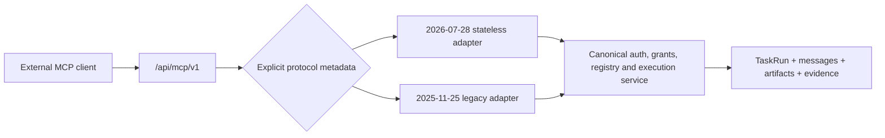

# MCP 2026-07-28 stateless core and Tasks extension convergence design

| Field | Value |
|-------|-------|
| **Status** | **REVISED FOR FINAL MCP 2026-07-28.** PR #4119 / remote-install BI-06B66FFD shipped a useful `TaskRun` projection for the older 2025-11-25 experimental Tasks contract. It is now explicitly a legacy compatibility increment, not current-standard completion. |
| **Dates** | Original 2026-08-06 · standards correction 2026-08-08 |
| **Backlog** | Umbrella `BI-AF9F9729`; core `BI-214CB18D`; official Tasks `BI-B6F8BFF4`; ADP `BI-A712B61F`; retirement `BI-106E1DEC` under live epic `EP-HEADLESS-EMPLOYEE` |
| **Decision** | `DI-1C305D329ECE` — **dual wire, one route**; high confidence; no commandment conflict |
| **Plan** | [MCP 2026-07-28 stateless and Tasks migration](../plans/2026-08-08-mcp-2026-07-28-stateless-tasks-migration.md) |
| **Blast radius** | **HIGH** — this changes the external coordination protocol and long-running execution semantics while preserving the route, authorization pipeline, and durable task substrate. |

## 1. Correction and verified current state

The final MCP 2026-07-28 release was published on 2026-07-28. PR #4119 merged on 2026-08-08 but intentionally conformed to 2025-11-25. That implementation is therefore not the latest MCP protocol.

The code is still valuable substrate:

- `apps/web/app/api/mcp/v1/route.ts` negotiates `2025-11-25`, `2025-03-26`, and `2024-11-05`, requires `initialize`/`notifications/initialized`, and advertises the legacy `tasks` capability.
- `apps/web/lib/mcp/tasks-lifecycle.ts` projects `tasks/get|result|list|cancel` onto `TaskRun` but explicitly does not implement task-augmented execution or submission convergence.
- `apps/web/lib/mcp-task-submit.ts` normally awaits `executeAutonomousAgenticLoop`; only approval-required work returns before execution. It is not a general asynchronous task-creation path.
- `services/adp/src/server.ts` also implements the stateful initialize handshake.
- `TaskRun`, auth-context binding, state mapping, idempotency support, cancellation hooks, messages, artifacts, and audit evidence already exist. They remain the canonical application substrate.

The correction is a wire-protocol and execution convergence, not a new task system.

## 2. Research & benchmarking

### 2.1 Final MCP 2026-07-28

The [final release announcement](https://blog.modelcontextprotocol.io/posts/2026-07-28/) makes the core protocol stateless:

- no `initialize` or `notifications/initialized` lifecycle;
- no protocol session identifier;
- protocol version, client identity, and capabilities travel per request;
- `server/discover` is the standard discovery door;
- Streamable HTTP requests carry `MCP-Protocol-Version` plus `Mcp-Method`, and `Mcp-Name` where the method defines a name/URI/task routing key; mirrored values must match body `_meta`/params;
- tool parameters annotated with `x-mcp-header` are mirrored as validated `Mcp-Param-*` headers for gateway routing and policy;
- server identity moves to response `_meta`;
- list responses publish `ttlMs` and `cacheScope` cache directives;
- multi-round-trip tool responses use the standard input-required mechanism.

Streamable HTTP remains one POST endpoint. Standalone GET/DELETE session endpoints and resumable streams are gone; a POST may return request-scoped SSE, and optional long-lived change notifications use `subscriptions/listen`.

Normative detail is in the official [Discovery](https://modelcontextprotocol.io/specification/draft/server/discover), [Caching](https://modelcontextprotocol.io/specification/draft/server/utilities/caching), and [Streamable HTTP](https://modelcontextprotocol.io/specification/draft/basic/transports/streamable-http) sections.

DPF adopts these semantics at its existing external MCP route. Stateless means there is no connection-scoped protocol authority; it does **not** mean durable application work disappears.

### 2.2 Official Tasks extension

Long-running work moved from the 2025 core experiment into the separately negotiated [`io.modelcontextprotocol/tasks` extension](https://modelcontextprotocol.io/extensions/tasks/overview), standardized by [SEP-2663](https://modelcontextprotocol.io/seps/2663-tasks-extension). The current [Tasks specification](https://tasks.extensions.modelcontextprotocol.io/specification/draft/tasks) is server-directed:

- an eligible request may return `resultType: "task"`;
- the durable task must exist before its handle is returned;
- clients poll with `tasks/get`, supply requested input with `tasks/update`, and request cooperative cancellation with `tasks/cancel`;
- the terminal result or error is part of terminal task state;
- there is no standard `tasks/list` or `tasks/result` method in this extension.

DPF adopts that wire lifecycle and maps it to `TaskRun`. It does not copy the extension into another table.

### 2.3 Adjacent standards and implementation guidance

- The official [TypeScript SDK migration guide](https://ts.sdk.modelcontextprotocol.io/v2/migration/support-2026-07-28) is an implementation reference for per-response server metadata, client metadata, and multi-round-trip responses. DPF adopts the contract, not an SDK-owned governance pipeline.
- A2A remains the sovereign peer-to-peer task protocol over the existing federation trust envelope. Its receiver-owned task lifecycle maps to the same `TaskRun`, but A2A is not tunneled through MCP and MCP is not used as federation transport.
- The 2025-11-25 task methods remain a bounded compatibility benchmark only. They do not define the target architecture.

| Candidate | Verdict | Reason |
|-----------|---------|--------|
| Hard cut from 2025 to 2026 | Reject for first release | Correct end state, but unnecessarily disrupts existing clients before readiness is measured. |
| Dual wire adapters on `/api/mcp/v1` | **Adopt** | One route and one governed service, with explicit version dispatch and observable retirement. |
| Parallel `/api/mcp/v2` stack | Reject | Creates a second route, duplicated governance risk, and an avoidable long-lived migration surface. |
| New MCP task store | Reject | `TaskRun` already owns durable execution, messages, artifacts, identity binding, and audit. |

## 3. Decision record: how to migrate the wire contract

`principle_decide` selected **dual wire, one route** in `DI-1C305D329ECE` (composite `7.0710`, margin `1.7375`, high confidence, strong structured coverage, no commandment conflict). The strongest contributors were Never Assume—Verify and Research and Use Standards. A hard cut lost on business disruption; a parallel route lost on single-source-of-truth and maintainability.

Consequences:

1. `/api/mcp/v1` remains the canonical external MCP endpoint.
2. A narrow protocol-envelope adapter selects 2026-07-28 or legacy 2025-11-25 behavior from explicit request metadata.
3. Both adapters call the same authentication, Principal and GAID resolution, capability intersection, tool registry, governed execution, audit, and `TaskRun` services.
4. No `/api/mcp/v2`, second registry, second authorization path, or second task state is permitted.
5. 2026-07-28 is preferred for capable clients. Legacy support is retired only through the evidence gate in §8.

## 4. Target architecture

### 4.1 Stateless request envelope

For every 2026 request:

- authenticate the bearer token anew;
- resolve the human/service Principal, authorized agent Principal, GAID, delegation, organization, environment, tool grants, and policy context anew;
- reject caller-supplied GAID as authority; it may be a request assertion only and must match canonical resolution;
- require `MCP-Protocol-Version` and validate it against body `_meta`; validate `Mcp-Method` on every Streamable HTTP request and `Mcp-Name` for the methods that define it, including task methods where the name is `taskId`;
- validate any schema-declared `Mcp-Param-*` headers against the corresponding tool arguments, including the standard safe/base64 encoding rules, before dispatch;
- consume protocol version, client identity, and client capabilities from request metadata;
- return server identity and negotiated extension metadata in response `_meta`;
- never infer identity, authority, GAID, or organization from a connection or former session.

Legacy initialize/session state remains inside the legacy adapter and cannot become an authorization source for the 2026 path.

### 4.2 Discovery, caching, and multi-round trips

- `server/discover` returns supported protocol versions, authorized capability declarations, server identity, and optional usage instructions. It does not become another catalog implementation; clients use the existing list methods for actual tool/resource/prompt entries.
- `server/discover`, `tools/list`, `prompts/list`, `resources/list`, `resources/templates/list`, and `resources/read` complete results carry explicit `ttlMs` and `cacheScope`; private and authority-sensitive results must never be marked publicly shareable.
- input-required tool interactions use the 2026 multi-round-trip result contract. Durable input-required tasks use `tasks/update`; neither path relies on a protocol session.
- request-scoped SSE is permitted only as the response to its originating POST. Optional change/task notifications use `subscriptions/listen`; no standalone GET stream, `Last-Event-ID` resume, or server-initiated JSON-RPC request is reintroduced.

### 4.3 Official Tasks over `TaskRun`

- `taskId = TaskRun.taskRunId`, receiver-generated and durable before the task handle is returned.
- Eligible requests opt into or are directed to task execution according to official extension negotiation and server policy.
- `tasks/get` reads only a task authorized for the current request's Principal/GAID/link context.
- `tasks/update` appends validated input through the canonical task-message owner and resumes eligible work.
- `tasks/cancel` is cooperative, capability-gated, and records the actor and outcome. Its acknowledgement records cancellation intent; it does not falsely promise that work stopped or that the terminal state will be `cancelled`.
- Terminal success or failure is shaped from canonical task result/artifact evidence and returned with terminal state.
- TTL controls external serviceability and cleanup of extension projections, not deletion of governed `TaskRun` audit history.
- DPF↔MCP state spelling remains a boundary adapter; the internal enum is not rewritten merely to match a wire spelling.

The legacy `tasks/get|result|list|cancel` and bespoke `tasks/submit` methods may call these same services during migration. They are not independent execution paths.

For `tasks/get|update|cancel`, Streamable HTTP sets `Mcp-Name` to `taskId`. Requests without the negotiated Tasks extension capability fail with the standard missing-capability error. Task status notifications are optional in the first migration slice; if adopted, they use `notifications/tasks` only through `subscriptions/listen`.

### 4.4 Asynchronous execution

Returning a task handle requires real asynchronous execution:

1. validate and authorize the initiating request;
2. create and commit the canonical `TaskRun` plus idempotency and actor bindings;
3. enqueue through the verified shared executor;
4. return the handle without awaiting the autonomous loop;
5. persist heartbeats, requested input, cancellation observation, artifacts, result, and terminal error through the same task service.

The build must verify the existing queue/executor ownership before choosing wiring. It must not create a route-local worker.

## 5. Surface contract

| Surface | Required behavior |
|---------|-------------------|
| External MCP client | 2026 stateless request metadata, per-request authority, official Tasks extension; legacy adapter only while measured. |
| Build Studio | Calls the same governed application service and attaches `TaskRun`/receipt evidence to its existing build/capsule record; no direct MCP loop or task model. |
| In-platform AI coworker | Calls the same service with canonical agent Principal/GAID or explicit delegation; local work stays local unless the federation adapter is selected. |
| Federated A2A | Uses A2A over the trusted federation route and maps lifecycle to the same `TaskRun`; MCP is an entry adapter, not cross-install transport. |
| ADP | Uses shared envelope/discovery primitives where genuinely common, with its domain adapter preserved and no duplicate protocol stack. |

## 6. Enterprise identity and privacy

The 2026 stateless model strengthens the existing rule: authority is a property of each authenticated request, not a connection. Internal call-chain participation remains source-side protected evidence. When a response crosses an organization boundary, the boundary projection exposes only authorized global GAIDs and approved public agent-card data; private/internal aliases, local topology, delegation detail, hidden participants, prompts, and policy internals remain screened. The same projection applies regardless of MCP, Build Studio, coworker, or A2A entry surface.

This is analogous to network address translation only as a privacy-boundary metaphor. GAIDs are not translated identifiers: a public GAID stays globally stable, while private participation detail is withheld or represented by an authorized aggregate commitment.

DPF's current external MCP authority remains its governed bearer-token issuance and grant intersection; this migration does not invent an OAuth flow. If a client-facing OAuth authorization-code path is added, it must adopt the 2026 authorization hardening (RFC 9207 issuer validation, credential-to-issuer binding, and Client ID Metadata Documents rather than new Dynamic Client Registration dependence) through a separately governed security slice.

## 7. Data-model stewardship

- `TaskRun` remains the sole durable task aggregate; `TaskMessage`, `TaskArtifact`, task graph/evidence, Principal/GAID, and existing audit records retain their owners.
- No MCP session, MCP task, discovery, or A2A task table is introduced by default.
- Protocol metadata and telemetry use existing structured audit/metadata owners unless implementation evidence proves query or integrity requirements need a typed field.
- Any new closed state, capability, cache scope, or protocol-version axis must use the canonical typed contract and migration path rather than free-form strings.
- Retention expires an external projection; it does not erase canonical evidence needed for governance.

## 8. Compatibility, telemetry, and retirement

The legacy adapter records, without secrets or private payloads:

- selected protocol version and client identity/version;
- initialize/session use;
- legacy task-method use;
- discovery and header-validation failures;
- successful 2026 requests and official Tasks lifecycles;
- rollback and compatibility-test evidence.

Legacy support may be removed only when all are true:

1. every known DPF MCP client and adapter has a passing 2026 conformance receipt;
2. legacy traffic is zero for an operator-approved observation window;
3. the retirement and rollback drill has passed on the canonical nonproduction runtime;
4. MCP, Build Studio, AI coworker, ADP, and A2A entry adapters remain green;
5. the operator explicitly approves the cutover.

Rollback disables preferred 2026 task creation or restores legacy selection at the adapter boundary. It never swaps routes or data stores.

## 9. Verification contract

- Contract tests pin protocol/method/name/parameter header-body matching and `-32020` failures, per-request metadata, response `_meta`, discovery semantics, all cacheable result directives, POST/SSE behavior, and absence of initialize/session dependence.
- Security tests prove every request reauthenticates, GAID cannot be spoofed, token scope and grants intersect, cross-user/cross-org task lookup is denied, and cache scope cannot leak private discovery.
- Lifecycle tests prove durable-before-handle, non-blocking creation, idempotent replay, polling, input-required/update, cooperative cancel, terminal result/error, expiry projection, and recovery after process restart.
- Compatibility tests run the same governed tool through the 2026 and legacy adapters and prove one `TaskRun`, one receipt contract, and equivalent authorized outcomes.
- Surface-parity tests cover external MCP, Build Studio, in-platform coworker, ADP where applicable, and the A2A MCP entry adapter.
- Runtime claims require the canonical shared nonproduction lease and exact-image evidence; source-local unit/build checks alone do not prove asynchronous behavior.

## 10. Non-goals

- A new agent identity, task store, tool registry, governance pipeline, MCP route, or federation transport.
- Treating protocol statelessness as application state deletion.
- Exposing internal participant topology or private GAIDs to an external organization.
- Implementing A2A as an MCP extension or proxy.
- Removing 2025 compatibility before the evidence gate.
- Shipping implementation code in this design thread.
