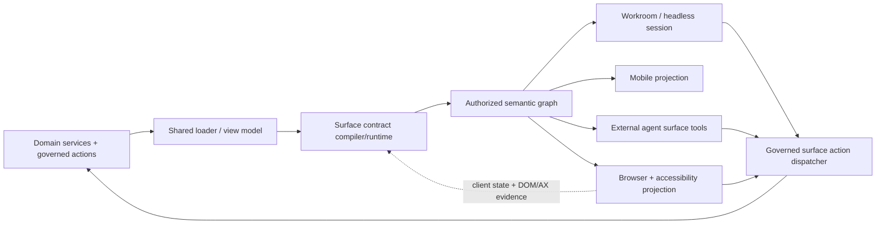

# Authorized Surface Contract — Render-Independent Human-Equivalent UX for AI Coworkers

**Status:** Approved direction; implementation decomposed and planned

**Date:** 2026-08-08

**Umbrella:** BI-3E872DFB · EP-F7E35344

**Kernel decision:** `live-semantic-page-graph`, high confidence, composite 12.276, margin 1.509, ledger DI-204400DDA2A5

**Incident:** the Discovery-page coworker guessed at SMTP setup because it neither received the rendered workflow nor possessed a governed way to inspect or operate it.

**2026-08-12 implementation correction:** ASC semantic state is prehydrated at the shared coworker inference seam for browser, workroom, scheduled, background, mobile, and external modes. This is required in addition to the generic `surface_*` tools: a local or otherwise tool-incapable model must still receive the current authorized UX contract for read-only guidance. Prehydration uses the already-filtered tool authority, creates a principal-bound session, omits write-only/secret values, is bounded to 8,000 prompt characters, and fails open on uncovered surfaces. A read-only surface question sheds tool schemas and the default `toolUse` routing floor; any request to enter data or execute an action keeps governed tools and confirmation.

**2026-08-13 routing correction:** A prehydrated, read-only ASC guidance turn is a bounded factual lookup over authoritative surface state, even when the generic utterance classifier labels wording such as “how should I set up...” as reasoning. At the shared inference seam, that turn routes through the existing `status-query` task contract with the existing `adequate` quality floor. This permits a residency-required local model to answer from the supplied contract instead of being rejected by a coworker's static frontier reasoning floor. The relaxation is turn-scoped: action-capable, non-prehydrated, image, and other turns retain the coworker's configured task, quality floor, tools, grants, and confirmation policy.

**2026-08-13 evidence correction:** Successfully prehydrated, authorization-filtered ASC state is authoritative evidence for that bounded read-only guidance turn. The generic evidence-integrity gate therefore accepts an answer grounded in the injected surface snapshot without demanding a redundant tool call. The exception is not available when prehydration failed or the request is action-capable; those turns retain normal tool evidence, authorization, confirmation, and refusal behavior.

## 1. Executive decision

DPF will establish an **Authorized Surface Contract (ASC)** as a platform primitive. It is a versioned, render-independent semantic description of what a principal can perceive and do on a product surface. Browser DOM, accessibility tree, mobile UI, workroom, background session, external agent, and future renderers are projections or consumers of this contract—not its source of truth.

The contract is generated from the same loaders, view models, action registries, and authorization decisions that produce the human UX. An AI coworker opens a principal-bound surface session and receives a revisioned semantic graph plus governed actions. It never has to infer product semantics from route names, prompts, screenshots, or raw HTML. Persistent actions execute through existing MCP/domain boundaries with dual-principal authority and audit.

This is the durable correction to two existing designs:

- The page-perception design correctly moved ownership toward the page, but remains browser/page centered and permits a second context description to drift from the rendered feature.
- The headless-employee design correctly derives an authorized interface, but treats `ScreenManifest` as that interface even though manifests are browser-shaped, empty in the current registry, and their state tools remain stubs.

ASC makes both designs projections of one canonical substrate. Existing `PageContext`, `ScreenManifest`, and `screen_*` APIs migrate through compatibility adapters; they do not become parallel authorities.

## 2. Product contract

When a human can see or operate a feature, an authorized coworker must be able to discover the same business meaning and invoke the same permitted outcome, subject to the coworker's narrower authority and the action's risk controls. This guarantee applies whether or not a browser is open.

The guarantee is semantic, not pixel-identical:

- The coworker receives labels, explanations, current values, status, relationships, validation, available choices, and actions that carry the meaning presented to the human.
- Presentation-only details such as exact pixel position, animation, and decorative content need not be exposed unless they change meaning.
- Accessibility names and alternative descriptions are part of the contract, including chart/table equivalents and error/help text.
- The surface never expands authority. If the human-facing renderer accidentally displays an unauthorized control, server authorization still refuses it; ASC records that parity failure.

## 3. Goals and non-goals

### Goals

1. One source generates human UX semantics and coworker semantics.
2. Every new or changed governed surface is coworker-perceivable and actable by construction, without authoring a coworker-specific page prompt.
3. The same contract operates co-present in a browser and silently in workroom, scheduled, background, mobile, and external-agent contexts.
4. Perception is principal-, organization-, workspace-, row-, field-, clearance-, and locale-aware.
5. Persistent actions use governed execution, current-state checks, confirmations, idempotency, and dual-principal audit.
6. Context remains economical through summaries, queries, cursors, and deltas instead of full-page dumps.
7. Automated conformance detects drift before a surface ships.

### Non-goals

- Giving a model arbitrary browser automation or raw DOM control as the primary integration.
- Creating one MCP tool per widget or attaching hundreds of surface tools to every prompt.
- Persisting a second authorization, audit, or application-state model.
- Requiring every page to use one visual component library or rigid floorplan.
- Treating an accessibility tree alone as complete product semantics.
- Replacing MCP, `AuthorityBinding`, the pseudo-user contract, or domain services.

## 4. Existing substrate and gaps

| Concern | Existing source | Reuse | Gap ASC closes |
|---|---|---|---|
| Delegated identity | Pseudo-User Contract; MCP human `userId` + acting `agentId` | Dual principal, never impersonation | Bind every surface session and action to both principals |
| Applied policy | `AuthorityBinding`; `resolve-coworker-tool-authority.ts` | Route/workspace posture and grant intersection | Make resolved authority part of surface projection and action availability |
| Page perception | `route-context.ts`, `route-context-map.ts`, route providers | Compatibility input during migration | Handwritten/refetched context, prefix mislabeling, browser-only route assumption |
| Browser control | `screen-manifest-types.ts`, `screen-pack.ts` | Generic interaction vocabulary and temporary aliases | Empty manifest registry; stubbed state; browser-shaped canonical model |
| Product actions | MCP packs and domain actions | Governed execution and tool annotations | No binding from every UX action to its governed operation |
| Workrooms/headless | Headless Employee and lifecycle specs; runtime-mode/session code | Principal context and external execution modes | No render-independent surface catalog/state projection |
| Coverage enforcement | BI-F9204A97 | Matching governed read/act tool guard | Needs semantic/control parity, stable IDs, and multi-renderer tests |

No new database model is justified in this design. Static definitions belong in source/generated artifacts; sessions, snapshots, and deltas are ephemeral/cacheable; durable actions and evidence use existing tool-execution, envelope, and audit stores. `AuthorityBinding` remains the applied-policy source. A schema addition requires later evidence that those stores cannot carry a required durable fact.

## 5. Canonical model

### 5.1 `SurfaceDefinition`

A source-authored or compiler-generated, render-neutral contract:

```ts
type SurfaceDefinition = {
  contractVersion: string;
  surfaceId: string;                 // stable product identity, not a pathname
  purpose: string;
  entryPoints: SurfaceEntryPoint[];  // route, mobile view, workroom type, task intent
  loader: SurfaceLoaderRef;
  nodes: SurfaceNodeDefinition[];
  actions: SurfaceActionDefinition[];
  presentation?: PresentationHints;  // non-authoritative renderer guidance
};
```

Definitions are composed from shared primitives close to the feature. The compiler validates stable IDs, referenced loaders/actions, accessible names, sensitivity metadata, and compatibility. Routes are entry points, not identities; one semantic surface may have browser, mobile, workroom, and headless entry points.

### 5.2 `SurfaceSession`

A short-lived binding of a surface to execution context:

```ts
type SurfaceSession = {
  sessionId: string;
  surfaceId: string;
  organizationId: string;
  delegatingUserId: string;
  actingAgentId: string;
  workContext?: { workspaceId?: string; workroomId?: string; resourceIds?: string[] };
  locale: string;
  timezone: string;
  authorityDigest: string;
  revision: string;
  expiresAt: string;
};
```

Opening a session resolves the same loader/read model used by the renderer, under the delegating principal. It does not require a browser tab. Co-present sessions may additionally bind a browser instance and client-state channel.

### 5.3 `SemanticSurfaceGraph`

The authorized, current-state projection returned to a consumer:

```ts
type SemanticSurfaceGraph = {
  contractVersion: string;
  surfaceId: string;
  revision: string;
  generatedAt: string;
  summary: SurfaceSummary;
  nodes: SurfaceNode[];
  actions: AvailableSurfaceAction[];
  continuations: SurfaceCursor[];
  provenance: SurfaceProvenance;
};
```

Node kinds include `surface`, `workspace`, `section`, `text`, `metric`, `alert`, `status`, `table`, `record`, `chart`, `form`, `field`, `choice`, `action`, `navigation`, `panel`, `media`, and `relationship`. Each node has a stable ID, semantic role, accessible name, value/state, help/error/validation where applicable, sensitivity/provenance, relationships, and child/cursor references.

The graph is not raw HTML, React props, or a prompt. It is typed application data. Hidden decorative nodes and implementation metadata are excluded. Passwords, credentials, tokens, and non-readable fields are never projected.

### 5.4 `SurfaceActionBinding`

Every actable semantic node identifies one of two action classes:

1. **UI-local:** reversible navigation, selection, panel open/close, draft field changes, focus, and pagination. A co-present adapter may operate client state. Headless mode maintains equivalent virtual UI state.
2. **Domain:** creates, changes, sends, approves, deletes, executes, or otherwise persists/causes an external effect. It binds to a registered MCP/domain operation and executes through the governed envelope.

Bindings carry input/output schemas, argument mapping, annotations, risk band, confirmation policy, idempotency behavior, freshness requirements, and result-to-state mapping. A domain mutation may not be implemented as an ungoverned DOM click.

### 5.5 `SurfaceCatalogEntry`

The catalog advertises only surfaces available in the current principal/work context. Entries contain stable identity, purpose, supported modes, current relevance, required context, and a compact summary. This lets a workroom coworker discover a silent surface without inventing a route or knowing that a page exists.

## 6. Runtime architecture



The shared loader/view model is the convergence seam. A feature must not separately fetch data for its React page and coworker context. The React renderer and graph projector consume the same typed result. UI-only state is reported as a bounded delta from the client; business state remains server-derived.

### 6.1 Execution modes

- **Co-present browser:** server graph plus client deltas for expanded panels, draft fields, selection, viewport/virtualization, and live updates. DOM/accessibility observation verifies and enriches legacy or client-only state.
- **Headless:** server resolves the graph and maintains virtual UI-local state. Domain actions behave identically without rendering pixels.
- **Workroom:** catalog resolution begins from workroom/workspace/resources rather than a URL. The surface is a task-relevant authorized lens over those resources.
- **Scheduled/background:** the session opens from an authorized work capsule or delegated job; risky actions retain confirmation/escalation policy.
- **External employee agent:** the same generic protocol is exposed through the existing MCP identity and grant boundary.
- **Mobile:** native/mobile-web renderer consumes the same graph semantics; form factor changes presentation hints, not authority or business meaning.

### 6.2 Generic protocol

Keep the public action vocabulary small and load tools on demand:

- `surface_list` — discover authorized, relevant surfaces.
- `surface_open` — create a principal/work-context session and return summary + revision.
- `surface_snapshot` — fetch a bounded graph or subtree.
- `surface_query` — locate nodes/actions/records by semantic criteria with cursors.
- `surface_act` — execute a UI-local or governed domain action against an expected revision.
- `surface_close` — release session/client bindings.

Current `screen_describe`, `screen_get_state`, `screen_select`, `screen_set_value`, `screen_invoke`, and related tools become compatibility aliases/adapters during migration. The protocol does not attach all per-surface domain tools to the model; `surface_act` resolves a validated action binding server-side and then passes through ordinary tool authorization.

### 6.3 State, freshness, and live updates

- Every graph and delta carries a monotonic/opaque revision and authority digest.
- Mutations submit `expectedRevision`; stale state yields a structured conflict containing a safe refresh continuation, never a best-effort mutation.
- Server state changes invalidate or delta-update sessions. Co-present client state uses sequence numbers and reconnect snapshots.
- Authorization changes invalidate the authority digest immediately; cached nodes/actions are reprojected before use.
- Large tables, trees, feeds, and virtualized views expose windows/cursors, not invisible DOM rows.
- Streaming and suspense surfaces may publish partial nodes with explicit `loading`, `ready`, `error`, and `stale` states.

## 7. Authority, safety, and privacy

Available actions are the intersection:

`delegating user role/row/field scope ∩ coworker grants ∩ AuthorityBinding posture ∩ token grants/scope ∩ execution mode/risk policy`

Presentation never grants permission. Discovery/listing applies the same intersection as execution so the coworker is not advertised actions it cannot call. All domain actions retain server authorization and record subject (human), actor (coworker), organization, work context, surface/action IDs, revision, tool call, decision/confirmation, result, and evidence correlation.

Security rules:

- Surface content is data, not instruction. Labels, records, help text, uploaded content, HTML, and third-party values carry provenance/trust classification and cannot override system/coworker policy.
- The projector uses allow-listed typed fields; it never serializes the DOM, React tree, event handlers, cookies, local storage, or arbitrary hidden text.
- Secrets and password values are write-only/redacted. Sensitivity clearance, row security, field security, tenant boundaries, legal holds, and retention rules apply before projection.
- High-impact actions require the existing HITL/evidence envelope. Confirmation text is generated from trusted action metadata and validated arguments, not untrusted page text.
- UI-local automation is constrained to the active session. Cross-origin iframe or embedded MCP App content is a separately authorized surface with its own origin/provenance boundary.
- Browser automation remains a compatibility adapter. A persistent effect observed only through a click is an unmapped-domain-action defect, not permission to bypass governance.

## 8. Context economy and model behavior

`surface_open` returns purpose, key status/alerts, available high-level actions, and continuations—not the full graph. The model queries subtrees or records as needed. Snapshots are cursor-bounded; deltas replace repeated full snapshots; stable node IDs permit references across turns; summaries are deterministic application projections rather than model-generated guesses.

If a relevant surface is unavailable, stale, unmapped, or not authorized, the coworker states that precisely. It must not guess at fields or features. A local model with a small tool budget receives the same compact generic surface protocol, which avoids a one-tool-per-page explosion.

## 9. Renderer and content edge cases

- **Accessibility:** semantic HTML and ARIA remain the human accessibility baseline. ASC uses the same accessible names, descriptions, roles, state, validation, and keyboard-equivalent outcomes. The accessibility tree is a conformance projection, not the only source.
- **Charts/canvas/media:** provide typed series/summary, units, time range, legend, notable annotations, and text alternative. Pixels alone fail conformance.
- **Forms:** expose field purpose, current/draft value, format, required/read-only state, choices, dependencies, validation, help, and submit/cancel effects. Browser autofill and password managers do not expose secrets.
- **Virtualized data:** server cursors expose all authorized rows independent of what is mounted in DOM; viewport is presentation state.
- **Internationalization:** labels/help are localized; canonical IDs and action schemas remain stable; locale, currency, units, calendars, and timezone are session inputs.
- **RSC/SSR/client-only:** server projections derive from shared loaders; client-only state registers typed deltas through the adapter. Hydration cannot redefine domain authority.
- **Third-party/iframe:** represented as a child surface only with an evaluated adapter/contract; otherwise the parent reports a bounded opaque embed.
- **Offline/mobile:** cached graphs are explicitly stale/read-only unless the action has an approved offline idempotent synchronization contract.

## 10. Automated authoring and enforcement

The solution is automated at the feature primitive/compiler level, not by asking teams to hand-author coworker prose:

1. Shared UI/domain primitives emit semantic definitions and action bindings as they are composed.
2. Feature-specific semantics are declared once alongside the shared view model when inference would be ambiguous (purpose, chart meaning, trusted confirmation text). This is product metadata used by every renderer, not coworker-only duplication.
3. A build compiler produces the surface manifest/catalog, schemas, graph fixtures, compatibility map, and coverage report.
4. CI fails new/changed governed UX when an interactive control lacks a stable semantic/action binding, a data view lacks an authorized read projection, accessibility meaning is absent, or browser/headless parity differs.
5. A legacy observer inventories DOM/accessibility controls and telemetry to locate migration gaps. It is not a permanent source of authority.

The conformance equation for the same principal, data fixture, locale, and surface revision is:

`semantic(browser projection) == semantic(headless projection)`

The comparison ignores declared presentation-only properties and verifies nodes, values, validation, available actions, redaction, authority, and post-action state. Golden journeys also ask comprehension questions and execute safe operations against the canonical runtime.

## 11. Observability and failure semantics

Emit structured signals for surface opened/closed, graph size/query depth, snapshot/delta latency, stale-revision conflicts, unmapped controls, missing domain bindings, redacted fields, authority-filtered actions, action outcome/evidence, compatibility fallback usage, browser/headless parity, and coworker statements made without a surface lookup.

Failures are loud and typed: `surface_not_found`, `surface_context_required`, `surface_not_authorized`, `surface_revision_stale`, `surface_action_unmapped`, `surface_action_not_authorized`, `surface_projection_incomplete`, and `surface_adapter_unavailable`. No error path substitutes route-prefix data or generic product guesses.

## 12. Versioning and compatibility

- `contractVersion` follows explicit schema compatibility rules; stable surface/node/action IDs survive route and layout changes.
- Generated artifacts identify source commit/contract digest. A runtime rejects incompatible artifacts rather than silently degrading.
- Additive optional semantics are backward compatible; changed meaning, removed action, or schema changes require a compatibility record and migration.
- `PageContext` providers and `ScreenManifest` compile/adapt into ASC during transition. New surfaces may not introduce those as independent sources.
- Existing `screen_*` tools remain until telemetry shows supported consumers have migrated; they delegate to surface sessions.

## 13. Deployment and operations

ASC is part of the canonical application runtime and must wrap every supported deployment contract. The first implementation adds no hosted browser fleet, external SaaS dependency, install-local host path, fixed port, or parallel service. It runs with the existing web/MCP/domain stack in connected and self-hosted deployments; headless sessions call shared server loaders and therefore do not require Chromium. Mobile and external clients negotiate supported contract versions through the same API boundary.

Compiled artifacts carry the identity of their source bytes and deploy with the application image. A runtime refuses a missing or incompatible artifact instead of rebuilding an untracked contract from live DOM. Cache loss degrades to a fresh server projection, not to guessed context. Operational sizing must bound session count, graph bytes, delta rate, and loader cost; install health exposes compiler/runtime compatibility and legacy-fallback coverage. Any later browser sidecar, event broker, protocol library, or external renderer requires the platform-support watchlist and tool/dependency evaluation before adoption.

## 14. Research and benchmarking

| Precedent | What it proves | Adopt | Do not adopt as-is |
|---|---|---|---|
| [WebMCP](https://developer.chrome.com/docs/ai/webmcp) | A page can register typed, discoverable tools from declarative forms or JavaScript, sharing live page state and confirmation UI | Structured capability discovery; JSON Schema; declarative and imperative registration | Browser/tab requirement and browser-owned canonical state; official docs explicitly say headless is unsupported |
| [AG-UI](https://docs.ag-ui.com/introduction) and [event model](https://docs.ag-ui.com/sdk/js/core/events) | Agent/front-end collaboration benefits from typed events, state snapshots/deltas, tool lifecycles, interrupts, tracing, and cancellation | Revisioned snapshot/delta sessions and explicit action lifecycle | Wholesale protocol dependency before DPF tool evaluation; ASC is an application contract, not only an agent transport |
| [SAP Fiori Elements / OData annotations](https://learning.sap.com/courses/getting-started-with-creating-an-sap-fiori-elements-app-based-on-an-odata-v4-rap-service/getting-started-with-sap-fiori-elements-understanding-odata-and-annotations) | One metadata model can generate consistent web/mobile UI and behavior across floorplans | Metadata/view-model-driven multi-renderer semantics and extension points | OData/CDS coupling and rigid floorplan constraints |
| [Salesforce UI API](https://developer.salesforce.com/docs/platform/lwc/guide/data-ui-api) and [layout GraphQL](https://developer.salesforce.com/docs/platform/graphql/guide/query-record-layouts.html) | Data plus UI metadata can serve web and mobile while enforcing CRUD, field, sharing, and layout policy | Authorization-scoped data+metadata projection, shared cache/freshness | Object/layout-centric model as the sole abstraction |
| [A2UI](https://github.com/a2ui-project/a2ui) | Declarative JSON and a trusted component catalog can render safely across platforms | Framework-neutral typed projection and trusted component vocabulary | Agent-generated UI as canonical product truth; DPF definitions remain application/domain owned |
| [MCP Apps](https://modelcontextprotocol.io/extensions/apps/overview) | Tools and sandboxed UI resources can share a typed protocol with permission/CSP boundaries | Shared tool/UI contract and explicit embedded-origin security | Repackaging every internal surface as an MCP App |
| [WAI-ARIA](https://www.w3.org/TR/wai-aria/) and [Accessible Name](https://www.w3.org/TR/accname-1.1/) | Browsers already derive semantic roles, names, properties, and accessible state from UI | Accessibility semantics as a mandatory parity baseline | Depending on runtime accessibility introspection alone; the [AOM computed-tree API](https://wicg.github.io/aom/explainer.html) is not a dependable cross-browser product contract |
| [OWASP LLM Top 10](https://owasp.org/www-project-top-10-for-large-language-model-applications/) | Untrusted content, excessive agency, over-broad permissions, and missing HITL are predictable agent risks | Provenance, least privilege, trusted action metadata, constrained functions, HITL and audit | Treating visible page text as trusted instructions or deriving authority from UI presence |

The precedent is strong: metadata-driven multi-renderer UI, structured browser tools, evented shared state, and authorization-scoped UI APIs all exist. DPF's distinct requirement is their intersection: the same semantic contract must drive both rendered and non-rendered employee surfaces under delegated authority.

## 15. Alternatives considered

1. **DOM/accessibility scrape as truth.** Automatic and visually faithful, but misses unmounted/headless state, conflates presentation with authority, leaks data, and is brittle. Retain only for legacy inventory and conformance evidence.
2. **Handwritten page context/manifests.** Governable but recreates the exact treadmill that caused the incident; definitions drift from features and the long tail remains blind.
3. **Server-only generated page contract.** Strong for headless data but blind to drafts, selection, live client state, and renderer parity. It is one input to ASC, not the full answer.
4. **Authorized live semantic contract (chosen).** Shared application semantics plus principal-bound runtime state; browser and headless are peers. This implements kernel choice DI-204400DDA2A5 and extends it beyond the browser.

## 16. Impact inventory and ownership

Primary code seams expected to change:

- `apps/web/lib/coworker/screen-manifest-types.ts`, `apps/web/lib/coworker/manifests/index.ts`, `apps/web/lib/mcp/packs/screen-pack.ts`
- `apps/web/lib/tak/route-context/types.ts`, `route-context.ts`, `route-context-map.ts`, and route-specific context providers
- `apps/web/lib/govern/authority/resolve-coworker-tool-authority.ts` and existing action/evidence envelopes
- shared page loaders/view models, route manifest/build tooling, UI primitives, MCP registry/tool annotations, and coworker prompt/context arbitration
- browser panel/session adapters, external access/runtime-mode code, workroom/work-context resolution, mobile renderer boundaries, and canonical-runtime golden journeys

Designs to amend or mark as superseded-in-part:

- `2026-05-31-pseudo-user-contract-design.md` — retain delegation/envelope; replace ScreenManifest as canonical interface.
- `2026-08-05-coworker-page-perception-context-contract-design.md` — retain incident evidence; replace page-owned duplicate context with shared semantic projection.
- `2026-08-05-headless-employee-external-agent-wwwd-exposure-design.md` — retain identity/context; derive ASC rather than generating browser manifests from routes.
- coworker lifecycle and authority-binding designs — add surface session/work-context integration without changing their ownership.

Backlog ownership:

- Umbrella BI-3E872DFB under EP-F7E35344.
- Core BI-3A70F86B; projections BI-8B15C210; headless/workroom BI-1BEF3F52; security BI-E9018F3B; conformance BI-008E7969.
- Existing BI-F9204A97 owns the governed read/act parity guard and is an explicit prerequisite.
- BI-56E9CEC2 and EP-31815F97 retain capability-grant/authority ownership; EP-E1F1DB58 retains MCP/A2A transport concerns; EP-WORK-CONVERGENCE retains workroom product behavior.

## 17. Rollout and acceptance

1. **Foundation:** land schemas/compiler/session/query runtime and one read-only reference surface.
2. **Security:** bind governed actions and prove authority/provenance/redaction on the reference surface.
3. **Renderer parity:** project the same surface into browser/accessibility/mobile-compatible adapters; convert `screen_*` to compatibility.
4. **Headless/workroom:** open and operate the reference surface without a DOM, then bind workroom/background context.
5. **Migration:** convert high-value/incident surfaces first, including Discovery SMTP setup; inventory and migrate the long tail.
6. **Enforcement:** warn on legacy gaps, measure parity, then fail new/changed UX and finally retire handwritten sources after coverage thresholds.

The design is accepted when all of the following are demonstrable in the canonical runtime:

- On Discovery, the coworker corrects an employee's “SMTP discovery” wording to SNMP, explains setup from current semantic state, identifies exact missing fields/connections, populates permitted values, tests/saves through governed actions, and reports evidence—without asking the user to transcribe the UI.
- The same journey succeeds headlessly with no rendered page.
- Browser and headless graph digests match for semantic content under the same principal/fixture.
- A different role, tenant, clearance, or AuthorityBinding sees the correct narrower graph/actions.
- Injected record/page content cannot add instructions or actions.
- A stale action is refused and refreshable; a confirmed persistent action is idempotent and dual-principal audited.
- A newly added unbound control or inaccessible semantic fails CI.
- Local-model execution stays within its tool/context budget via the compact generic protocol.

## 18. Decisions and deferred questions

The architecture choice is settled by DI-204400DDA2A5 and this founder-requested scope. Implementation may tune schema field names, wire protocol encoding, cache technology, and rollout thresholds through ordinary ADR/WWMD review, but may not reintroduce DOM-, route-, or manifest-owned truth.

No external dependency is selected by this design. AG-UI, A2UI, WebMCP, or another library requires the DPF tool-evaluation process before adoption. The initial implementation should use existing TypeScript, MCP, loader, authority, and test substrate unless that evaluation proves a dependency materially better.
