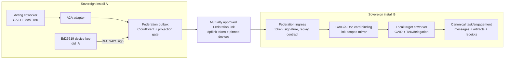

# Federated A2A Coordination with GAID — Design Specification

**Date:** 2026-08-08  
**Status:** Architecture-reviewed; ready for implementation planning  
**Decision:** `DI-B726A1900E7C` — link-bound signed GAID claim  
**Delivery shape:** one same-organization product slice; no implementation in this document branch  
**Backlog:** `BI-BE0E14E0`, filed under `EP-MSP-FEDERATION` (live, in progress)
**Design WorkCapsule:** `WC-647895E9`

## 1. Executive decision

Two sovereign DPF installations coordinate through one composed identity and trust model:

- `FederationLink`, `inst_…`, and the paired Ed25519 `did_…` device identity answer **which installation may talk, and through which governed relationship**.
- GAID and AIDoc answer **which enduring agent is speaking**.
- canonical organization identity and an installation environment classification answer **for which organization and environment the agent is acting**.
- TAK grants, coworker delegation rules, service-offer policy, and the link's projection/authority contracts answer **what that agent may do here**.

The selected design carries a typed GAID claim and standard A2A data model inside the existing federation CloudEvent path. The receiver first authenticates the mutual `dpflink_…` token, then verifies an RFC 9421 HTTP Message Signature and `Content-Digest` with the peer Ed25519 key pinned to the same `FederationLink`. It accepts the GAID only when the claim matches a signed, link-scoped Agent Card/AIDoc projection previously received through that link. The receiving install resolves the local target by GAID and applies its own TAK/delegation and data-boundary policy. No peer can confer authority on itself.

This extends the federation substrate. It does not introduce a second transport, a new agent-identity scheme, a remote-agent table, or per-agent credentials.

## 2. Problem and first slice

Arcamanus production and the Arcamanus+DPF development system already exchange federated demand as sovereign peers. The next layer is a coworker on one installation delegating a task to a coworker on the other while an operator can prove:

1. which trusted installation sent the request;
2. which GAID claimed the acting and delegating roles;
3. which organization and environment originated the work;
4. which verified Agent Card/AIDoc authorized that claim;
5. which local policy allowed the target coworker to accept it; and
6. which task, messages, artifacts, decisions, and receipts belong to that chain of custody.

The first product slice is same-organization, two-install coordination over an already trusted `FederationLink`. Cross-organization A2A remains deny-by-default and is not enabled by this slice.

### 2.1 In scope

- link-scoped discovery of eligible remote coworkers using A2A v1.0 Agent Cards;
- authenticated A2A task initiation, status retrieval, additional input, cancellation, and artifact return;
- device-signed binding of acting/delegating GAIDs to the existing federation request;
- receiver-side target resolution, TAK authority checks, projection minimization, replay protection, task ownership, and audit receipts;
- an operator-facing A2A readiness and provenance view on the existing federation-link and engagement surfaces;
- a compatibility path from the current DPF A2A-shaped service-offer/task implementation to the standard A2A data model.

### 2.2 Out of scope

- public anonymous A2A discovery;
- a public GAID registry, new GAID syntax, or an alternate agent identifier;
- independent per-agent keypairs or OAuth clients;
- cross-organization execution authority;
- arbitrary remote MCP proxying;
- changing the canonical federation transport or replacing `FederationLink`;
- copying private prompt, memory, tool configuration, or unrestricted agent metadata across the link;
- implementation code in this design thread.

## 3. Backlog integrity correction

Live backlog queries on 2026-08-08 returned `epic_not_found` for `EP-E1F1DB58` and `not_found` for `BI-1F4A4861`. The ten slice IDs asserted by the earlier adoption plan were also absent. Those identifiers are therefore not authoritative and this specification does not cite them as live coverage.

Relevant verified live programs are:

| Program | Live status | Relevance | Disposition |
| --- | --- | --- | --- |
| `EP-MSP-FEDERATION` | in progress | owns `FederationLink`, projection contracts, federated record mirrors, sovereign-peer identity, and governed cross-boundary sharing | **Parent for this slice** |
| `EP-A2A` | done | owns earlier internal handoff/summon design work; contains one unrelated open WWMD surface and one deferred deliberation item | referenced precedent, not reopened |
| `EP-TAK-3F9A21` | done | delivered GAID-Private/AIDoc projection and TAK/MCP alignment | dependency, not reopened |
| `EP-COWORKER-IDENTITY-360` | open | owns the unified coworker read model and whole-coworker Agent Card | dependency/coordination seam |

`EP-MSP-FEDERATION` is the closest verified in-progress parent because the increment changes how a sovereign peer proves an agent claim at the federation boundary. Filing it there preserves the requested slice-not-epic shape. The slice body must cross-reference `BI-COWORKER-360-AGENTCARD` so that Agent Card projection has one source of truth.

## 4. Verified substrate ledger

### 4.1 GAID, AIDoc, and principal identity

The canonical standard is [`docs/architecture/GAID.md`](../../architecture/GAID.md):

- GAID syntax is `gaid:<scope>:<issuer-prefix>:<agent-local-id>`.
- GAID is the enduring interoperable agent identifier and resolves to an AIDoc.
- an A2A Agent Card should carry or reference GAID; task and artifact events preserve chain of custody;
- an HTTP carrier should bind the GAID claim to the request signature;
- GAID-Federated requires signed AIDoc publication, receipt integrity, and status checking.

The canonical runtime projection is not an `Agent.gaid` column. [`apps/web/lib/identity/principal-linking.ts`](../../../apps/web/lib/identity/principal-linking.ts) creates one `Principal(kind="agent")` and joins its local `agent` alias to a `gaid` alias. [`apps/web/lib/identity/aidoc-resolver.ts`](../../../apps/web/lib/identity/aidoc-resolver.ts) resolves the AIDoc from that principal. This design keeps that spine and uses `PrincipalAlias` for every local lookup.

#### Conformance gap discovered

`buildPrivateAgentGaid` currently emits `gaid:priv:dpf.internal:<agent-id>`. The GAID standard requires a private issuer prefix to include a stable installation, domain, or equivalent namespace discriminator. `dpf.internal` alone cannot guarantee uniqueness across sovereign installations. Therefore, a current private GAID string must not be promoted to “globally verified” merely because it parses.

The build slice must first converge issuer configuration and alias continuity using the existing GAID/PrincipalAlias model:

- use a stable, governed issuer namespace shared by the administrative authority for an enduring agent subject;
- preserve an existing canonical GAID when a governed identity-continuity record says two installations host the same enduring subject;
- mint distinct GAIDs when the coworkers are distinct subjects, even if their configuration is cloned;
- retain legacy private aliases for local resolution during migration, but never advertise them as federation assurance;
- use GAID-Public when an agent crosses its original administrative boundary, as the GAID standard requires.

This is GAID conformance work, not a new identity scheme.

For the same-organization slice, the link's approved `AuthorityBinding` names the GAID issuer namespace(s) that the peer device may attest. The peer cannot self-authorize a new issuer in a request. A device-signed card proves what the installation asserted; the AIDoc/issuer binding proves that the installation is entitled to assert that GAID namespace. Both checks are required.

### 4.2 Coworker authority and receipts

- [`apps/web/lib/tak/collaboration-authority.ts`](../../../apps/web/lib/tak/collaboration-authority.ts) already denies a handoff unless the source coworker's `delegatesTo` or `escalatesTo` policy names the target.
- [`apps/web/lib/tak/coworker-collaboration.ts`](../../../apps/web/lib/tak/coworker-collaboration.ts) already creates local delegation chains through the canonical work-thread path.
- [`apps/web/lib/tak/agent-card-service.ts`](../../../apps/web/lib/tak/agent-card-service.ts) projects `dpf.agent-card.v1` with GAID/AIDoc and effective tool authority.
- [`apps/web/lib/coworker-service-catalog/a2a-tasks.ts`](../../../apps/web/lib/coworker-service-catalog/a2a-tasks.ts) already persists A2A-shaped task status, messages, artifacts, GAIDs, call chains, and receipts.

The current cross-boundary service-offer POST requires `actingAgentGaid` and `delegatingAgentGaid`, but accepts them as caller-supplied strings. The current delegation receipt is a local HMAC. Neither proves to another sovereign installation that the authenticated peer device vouched for those GAIDs. That is the gap this design closes.

### 4.3 Federation transport and trust

- [`apps/web/lib/federation/instance-identity.ts`](../../../apps/web/lib/federation/instance-identity.ts) generates an Ed25519 keypair and derives stable `did_…` from the public key.
- [`apps/web/lib/federation/demand-identity.ts`](../../../apps/web/lib/federation/demand-identity.ts) persists `inst_…`, device ID, public key, and encrypted private key in the canonical federation identity configuration.
- [`apps/web/lib/federation/sas-pairing.ts`](../../../apps/web/lib/federation/sas-pairing.ts) defines the device-ID SAS transcript.
- [`apps/web/lib/federation/enrollment.ts`](../../../apps/web/lib/federation/enrollment.ts) creates the peer `Principal` and `FederationLink`, requires dual approval, and manages mutual hashed/encrypted `dpflink_…` tokens.
- [`apps/web/lib/auth/federation-link-token.ts`](../../../apps/web/lib/auth/federation-link-token.ts) rejects links that are not trusted or are quarantined/revoked.
- [`apps/web/lib/federation/cloud-event-guard.ts`](../../../apps/web/lib/federation/cloud-event-guard.ts) validates CloudEvents 1.0 shape and replay time. Its own comment accurately says the bearer token is currently the sole authenticator.
- [`packages/db/src/federated-demand-contract.ts`](../../../packages/db/src/federated-demand-contract.ts) and the federation routes already implement typed, minimized, routed cross-install envelopes.
- `ProjectionContract` is the per-link allowlist and `FederatedRecordMirror` is the generic link-scoped mirror/crosswalk substrate.

The missing trust material is explicit peer device pinning: `FederationLink` stores the peer installation ID but does not yet store the peer `did_…` or Ed25519 public key. The first build phase extends that existing row and enrollment handshake. It does not create a device or credential table.

### 4.4 Existing A2A route gap

The current `/api/a2a/coworkers/{agentId}/offers/{offerId}` and `/api/a2a/tasks/{taskId}` surfaces are useful internal projections, but they are not a safe sovereign-peer ingress:

- partner/external submission is not authenticated through `FederationLink`;
- a task can be retrieved by task ID without link ownership enforcement;
- the operation and object shapes are A2A-inspired rather than a complete standard binding;
- cross-boundary GAID strings are not cryptographically linked to the peer device or a signed card.

The implementation must keep internal consumers working, but all cross-install traffic moves behind `/api/v1/federation/*`. The existing `/api/a2a/*` code becomes an internal adapter to the canonical task service, not a second external trust path.

## 5. Research and benchmarking

### 5.1 Standards adopted

#### A2A Protocol v1.0

The [A2A v1.0 specification](https://a2a-protocol.org/latest/specification/) defines Agent Cards, messages, tasks, artifacts, discovery, and three standard bindings. DPF adopts:

- the canonical Agent Card and Agent Skill fields;
- `/.well-known/agent-card.json` semantics, but exposes a minimal link card and authenticated link-scoped extended cards rather than a public coworker inventory;
- the A2A Task, Message, Part, Artifact, status, history, context, cancellation, and idempotency semantics;
- HTTP+JSON/REST as the adapter-level operation vocabulary;
- `A2A-Version` and negotiated extension identifiers;
- JWS-signed Agent Cards using RFC 8785 canonicalization;
- the standard rule that every incoming request is authenticated and authorized by the receiving server.

A2A explicitly leaves identity at the protocol layer. DPF therefore adds a GAID extension profile and uses the federation trust envelope as that protocol-layer identity mechanism. This is an extension, not a competing A2A identity proposal.

DPF does **not** declare the CloudEvent carrier itself to be an A2A-compliant custom binding in the first slice. A2A requires a custom binding to implement every core operation and preserve the complete data model and semantics. Instead, DPF treats the CloudEvent as its authenticated federation delivery envelope; the typed payload and adapter implement the A2A operation/data semantics. Public custom-binding conformance is a later standards decision.

#### MCP

The [A2A/MCP comparison](https://a2a-protocol.org/latest/topics/a2a-and-mcp/) separates agent-to-agent collaboration from agent-to-tool/resource access. DPF keeps that boundary:

- A2A coordinates sovereign agents and their shared task lifecycle.
- MCP remains the local tool plane used by each agent under its own install's grants.
- an A2A peer never acquires raw MCP credentials or direct access to another install's MCP server.

MCP 2025-11-25 Tasks are useful precedent for receiver-owned task IDs, explicit authorization-context binding, polling, cancellation, TTLs, and audit. They remain experimental in that version, and the [2026-07-28 release candidate](https://blog.modelcontextprotocol.io/posts/2026-07-28-release-candidate/) moves long-running Tasks to an extension while making the core stateless. Therefore, this design does not make DPF A2A task state depend on MCP Tasks or copy a version-specific MCP state machine. It preserves a mapping adapter only.

#### CloudEvents and HTTP signing

DPF retains CloudEvents 1.0 for existing federation routing and event metadata. It adopts [RFC 9421 HTTP Message Signatures](https://www.rfc-editor.org/rfc/rfc9421.html) with Ed25519 and the [RFC 9530 `Content-Digest` field](https://www.rfc-editor.org/rfc/rfc9530.html) to bind method, target, selected federation headers, digest, creation/expiry, nonce, and device key ID. It adopts [RFC 8785 JCS](https://www.rfc-editor.org/rfc/rfc8785.html) for A2A Agent Card JWS canonicalization.

### 5.2 Open-source implementation benchmarks

| Benchmark | What DPF adopts | What DPF rejects |
| --- | --- | --- |
| [Official A2A SDKs](https://github.com/a2aproject) | generated/protocol-owned types, standard cards, operation semantics, version negotiation, card signing helpers | exposing a standalone public A2A server that bypasses DPF federation policy |
| [Google Agent Development Kit](https://github.com/google/adk-python) | thin A2A adapter around an opaque agent and explicit task/event translation | making framework runtime identity authoritative instead of GAID/Principal |
| [Microsoft AutoGen](https://github.com/microsoft/autogen) | explicit handoff/team events and observable coordination history | importing an in-process team topology as DPF's cross-install authority or transport |

Adoption of a runtime SDK is not approved by this specification. The build must evaluate dependency, license, server-runtime fit, version pinning, and generated-type blast radius before adding one. Implementing the small adapter against published protocol types may be preferable to importing an agent framework.

## 6. Core decision: how GAID binds to federation trust

### 6.1 Options scored

The decision used the closed principle dimensions as magnitudes. `blast_radius` is a cost axis: higher is worse.

| Option | Schema grounding | Maintainability | Governance compliance | Evidence density | Blast radius |
| --- | ---: | ---: | ---: | ---: | ---: |
| A — link-bound signed GAID claim in existing federation envelope | 0.98 | 0.92 | 0.98 | 0.95 | 0.32 |
| B — separate A2A route/channel keyed by GAID, using link token | 0.58 | 0.48 | 0.55 | 0.68 | 0.72 |
| C — per-agent credential mapped to GAID | 0.30 | 0.34 | 0.62 | 0.90 | 0.90 |

### 6.2 Kernel result

`principle_decide` recorded `DI-B726A1900E7C` against the platform profile:

- recommendation: **A — link-bound signed GAID claim**;
- composite: `10.4771`;
- margin over runner-up: `5.4119`;
- confidence: high;
- signal: usable, strong structured coverage, no retrieval degradation;
- commandment conflict: none.

The largest positive pulls were Ship Real Functionality, Never Assume — Verify, Architecture Over Shortcuts, Research and Use Standards, Single Source of Truth, and Ground New Work in Existing Platform. The decision is advisory; this specification adopts it.

### 6.3 Rejected options

**Separate A2A channel.** Rejected because a second ingress/replay/projection/authentication path would make the same peer relationship mean different things depending on route. A standard A2A adapter remains allowed only behind the federation boundary.

**Per-agent credential.** Rejected for this layer because it creates a second credential lifecycle, turns every coworker into a remote security principal at transport level, and duplicates the install trust already established by `FederationLink`. A future high-assurance profile may add agent-held proof as an additional factor, but it cannot replace or bypass the link.

## 7. Target architecture



The proof is intentionally layered:

| Layer | Canonical value | Question answered | Does not answer |
| --- | --- | --- | --- |
| Link | `FederationLink.linkId` + mutual token | is this a trusted, active relationship? | which agent is speaking |
| Device | `did_…` + pinned Ed25519 public key | did the enrolled peer device sign this request? | whether the claimed agent is allowed |
| Installation | `inst_…` | which sovereign installation originated and routed it? | agent identity or environment |
| Agent | GAID + signed AIDoc/card digest | which enduring coworker does the peer attest is acting/delegating? | local authorization |
| Organization | canonical Organization reference | for whose administrative/business boundary? | environment |
| Environment | closed installation classification | production, development, staging, or other governed class | identity |
| Authority | local TAK, delegation, offer, projection, and consent rules | may this action occur here? | transport authenticity |

## 8. Canonical contracts

### 8.1 Federation link identity extension

Extend `FederationLink` with typed peer-device trust fields rather than burying security-critical state in unvalidated JSON:

- `peerDeviceId` — `did_…` derived from the pinned public key;
- `peerSigningPublicKey` — Ed25519 SPKI public key representation;
- `peerSigningKeyPinnedAt` and `peerSigningKeyRotatedAt`;
- `environmentClass` using the existing closed `FOUNDER_DEMAND_ENVIRONMENTS` vocabulary (`production`, `development`, `test`).

Enrollment/pairing must validate `deriveDeviceId(peerSigningPublicKey) === peerDeviceId`, include both device IDs and installation IDs in the SAS transcript, and require explicit dual approval for first pin or rotation. A legacy trusted link without a pinned key is `demand-ready` but `a2a-not-ready`; it must never silently downgrade A2A to token-only authentication.

`environmentClass` already lives in `FederationLink.metadata` and is consumed by federated demand. This slice promotes it to a typed Prisma enum column on `FederationLink`, backfills from metadata with the existing safe `development` fallback, dual-reads only during migration, and then removes the metadata write path. A2A imports the generated union; it does not create a second environment vocabulary.

### 8.2 DPF federation A2A extension profile

Define one versioned extension URI owned by the GAID standard, for example a repository-controlled HTTPS URI ending in `/gaid-a2a/v1`. The exact public URI is an implementation-time standards/namespace decision, not invented in this spec.

The extension metadata carried with each A2A request is:

```ts
type DpfFederatedAgentContextV1 = {
  actingAgentGaid: string;
  delegatingAgentGaid: string;
  targetAgentGaid: string;
  gaidIssuerPrefix: string;
  gaidIssuerBindingRef: string;
  aidocDigest: string;
  agentCardDigest: string;
  delegationChainRef?: string;
  organizationRef: string;
  installationId: string;
  environmentClass: "production" | "development" | "test";
  traceparent?: string;
};
```

The final field names must be generated from or directly mapped to the A2A extension contract. `organizationRef` resolves to canonical Organization identity; no organization name, logo, or contact duplicate is stored here. Environment remains alongside GAID and never becomes part of GAID.

### 8.3 CloudEvent carrier

The existing CloudEvents 1.0 envelope adds closed, versioned A2A event types. The minimum set is:

- task/message submission;
- task snapshot/status;
- task input request/additional message;
- task cancel request/result;
- artifact availability or minimized artifact payload;
- Agent Card/AIDoc projection or withdrawal.

Every event includes the A2A request/data object plus `DpfFederatedAgentContextV1`. `source` identifies the originating installation, not the agent. GAID remains in the signed data so the device signature covers it. Event ID is the idempotency key within a link; the receiver-assigned A2A task ID remains authoritative for task state.

### 8.4 Agent Card and AIDoc projection

The `CoworkerIdentity`/Agent Card work under `BI-COWORKER-360-AGENTCARD` is the source projection. Federation adds selection and delivery, not another card builder.

- a link advertises only agents explicitly included by its `ProjectionContract`;
- public/minimal link card does not enumerate internal coworkers;
- authenticated extended cards are projected through the trusted link;
- card `extensions` carry GAID and AIDoc reference/digest;
- card is JWS-signed with the enrolled device key using RFC 8785 canonicalization;
- the AIDoc is signed or otherwise verifiable under the approved GAID issuer binding; a device signature alone is not elevated into issuer authority;
- the receiver verifies the JWS `kid` against the link's pinned device, verifies the AIDoc issuer binding, and stores the minimized card as `FederatedRecordMirror(recordType="agent-card")`;
- withdrawal, GAID status change, card expiry, link quarantine, or key rotation invalidates the binding until refreshed.

No `RemoteAgent`, `PeerAgent`, or `AgentCredential` table is added.

`agent-card` and any device-key/card-withdrawal record types extend the existing `FEDERATED_RECORD_TYPES` registry in `packages/db/src/federated-record-sync.ts`; no route or feature keeps a private string union.

### 8.5 Task persistence and the refactor seam

The existing implementation currently treats `CoworkerEngagement.engagementId` as the A2A task and synthesizes one message/artifact from JSON. The schema already has the richer canonical execution substrate: `TaskRun` has A2A-aligned states and owns `TaskMessage` and `TaskArtifact`. The build therefore consolidates rather than adding a fourth task representation:

- `CoworkerEngagement` remains the accepted service offer, contract, funding, approval, and provider relationship.
- `TaskRun` becomes the canonical A2A task lifecycle and receiver-generated A2A task ID.
- `TaskMessage` and `TaskArtifact` remain the canonical history and result records.
- `CoworkerEngagement` gains a nullable unique relation to its `TaskRun`; the existing adapter continues to accept engagement IDs during migration but returns the canonical task ID.
- `TaskRun` gains typed/indexed federation ownership, origin event/idempotency, GAID, installation/environment, card/AIDoc digest, and receipt-reference fields. Security and uniqueness do not depend on querying `a2aMetadata` JSON.

`TaskRun.userId` is currently mandatory, which would tempt a remote GAID to be represented as a fabricated local user. The sound refactor is principal convergence: add `initiatingPrincipalId`, backfill it from each existing user's canonical Principal, make `userId` nullable only after the dual-read/backfill gate, and use the `FederationLink` peer Principal as the transport initiator for federated tasks. The verified acting GAID stays a separate typed claim; the peer-install principal and speaking agent are never collapsed.

At minimum, the receiver can query and index:

- owning `FederationLink` and initiating peer Principal;
- origin event/idempotency key;
- source and target GAIDs;
- source installation/environment;
- current A2A task state and context ID;
- card/AIDoc digest used at acceptance;
- delegation/authority receipt reference.

Task reads, cancellation, and additional messages authorize against this stored link ownership and GAID context, never against possession of a task ID alone. This consolidation is the planned refactoring allocation for the slice; no cosmetic refactor displaces it.

## 9. Ingress verification and authorization

The receiver processes every cross-install A2A request in this fixed order:

1. Require HTTPS and resolve the bearer token to one trusted, non-quarantined, non-revoked `FederationLink`.
2. Require the link to be A2A-ready with a pinned peer device key.
3. Verify RFC 9421 signature parameters, algorithm, key ID, covered method/target/authority/content digest/federation headers, creation/expiry, and nonce.
4. Verify `Content-Digest` before parsing the CloudEvent body.
5. Validate CloudEvents 1.0, time window, event ID uniqueness, event type, payload size, and closed contract version.
6. Derive the authoritative organization/environment from the link and its explicit `organization-crosswalk`; require body claims to match, never use them as authority.
7. Require the event's installation ID and device key ID to match the link's approved peer projection.
8. Validate each GAID syntactically; verify its issuer prefix against the link's approved AuthorityBinding; then require the acting/delegating GAIDs to match a current, non-withdrawn, device-signed Agent Card and issuer-verifiable AIDoc mirror on this link.
9. Resolve the target GAID locally through `PrincipalAlias`; reject unknown, disabled, revoked, or non-federation-eligible targets.
10. Evaluate source delegation, target service offer, effective TAK grants, authority band, projection contract, relationship preset, data classification, rate/size/concurrency limits, and any human consent gate.
11. Create or idempotently return the receiver-owned task and persist a verification receipt containing link, device, installation, GAIDs, organization/environment, card/AIDoc digests, event ID, decision, and trace context.

Any failure is deny-by-default. Error responses reveal the minimum necessary category and correlation ID, not internal agent existence, policies, prompts, or grant details.

### 9.1 Sender authority is an attestation, not a grant

The peer device signature means “this enrolled installation attests that GAID X sent this request.” It does not mean the receiving install trusts every action by X. The receiver is sovereign and always applies its own local authority. A remote Agent Card is discoverability/evidence, not executable permission.

### 9.2 Delegation semantics

- `actingAgentGaid` is the agent presently issuing the request.
- `delegatingAgentGaid` is the accountable upstream agent that delegated this hop; it equals acting GAID when there is no upstream delegation.
- `targetAgentGaid` is the intended receiver and must resolve locally.
- multi-hop chains preserve every hop's installation, device, GAID, and receipt; a peer may not collapse the chain to the last speaker.
- a link may forward only if its projection/authority contract allows forwarding and loop/hop guards pass.

## 10. A2A operation and lifecycle mapping

DPF adopts the A2A v1.0 task lifecycle as the cross-install contract and maps it to canonical local task/engagement state. The adapter, not the database enum, owns wire-version translation.

| A2A concept | DPF canonical behavior |
| --- | --- |
| Agent Card | projection from canonical CoworkerIdentity/AIDoc, minimized per link, JWS-signed by peer device, with separately verified issuer-bound AIDoc |
| Send Message | create/idempotently continue a receiver-owned engagement/task after all trust and authority checks |
| Task ID | `TaskRun.taskRunId`, generated by receiver; opaque to sender; stored with owning link |
| `submitted` / `working` | accepted / active local work; exact local statuses remain canonical |
| `input-required` | local attention/elicitation boundary; no implied authorization |
| `auth-required` | request for a separate, explicit authorization decision; never an implicit grant |
| `completed` / `failed` / `canceled` / `rejected` | terminal state mapped without reopening terminal tasks |
| Message | canonical `TaskMessage`; conversational or instructional input/status, not final output |
| Artifact | canonical `TaskArtifact`; minimized task output with classification, digest, media type, and custody receipt |
| Get/List/Cancel | always scoped to the authenticated link and agent context; cursor pagination for list |
| Streaming/push | deferred from first slice; durable polling and federated status events are sufficient |

The first slice must implement the standard core operations needed for a non-streaming HTTP+JSON collaboration path. If any core operation is intentionally not implemented, the surface must be labeled “A2A-shaped DPF federation profile,” not “A2A compliant.”

## 11. Privacy and relationship policy

### 11.1 Same organization — first target

Same-organization does not mean unrestricted. The link may project:

- GAID, display name, concise role/description, AIDoc status/digest;
- explicitly federatable skills and service offers;
- endpoint/interface metadata for the federation adapter;
- task messages and artifacts allowed by the task's data boundary;
- organization reference, installation ID, and environment class.

It must not project raw prompts, private memory, hidden instructions, unrestricted tool manifests, secrets, internal model routing, unrelated customer data, or full authority configuration.

Production-to-development traffic is visually and programmatically distinct. A development agent cannot act in production merely because both installations share an organization. The production receiver's local policy is authoritative, and consequential or irreversible actions retain their existing human-approval boundaries.

### 11.2 Cross organization — deny by default

Cross-org A2A remains disabled unless a future slice adds all of:

- explicit A2A capability in the `ProjectionContract`;
- named GAID/service-offer allowlists;
- approved cross-org authority band and data-processing/retention terms;
- public or otherwise boundary-conformant GAID/AIDoc assurance;
- authenticated extended-card disclosure policy;
- artifact classification and egress tests;
- local human approval for every consequential action unless a narrower standing authority is explicitly granted.

The existing demand cross-org rules are the floor, not an alternate policy. Confidential/restricted and customer-domain material does not cross simply because the A2A task requests it.

## 12. Operator experience

The design adds evidence to existing surfaces; it does not create an A2A administration island.

### 12.1 Federation link detail

Show one compact “Agent coordination” section:

- readiness: Off / Needs device confirmation / Ready / Quarantined;
- peer install name, `inst_…`, short `did_…`, organization, and environment as separate fields;
- last successful signed request and last verification failure;
- count of projected eligible agents and card-expiry/withdrawal state;
- projection contract and authority band links;
- explicit action to approve initial device pin or key rotation.

Never display GAID as a substitute for install or environment. The hierarchy in every provenance treatment is `organization → environment/install → agent GAID`.

### 12.2 Coworker discovery and task initiation

Remote coworkers appear in the existing coworker/service catalog with a peer badge, organization, environment, verified-card state, last refresh, offered outcome, and data boundary. The primary action states its consequence, for example “Ask Arcamanus Dev / Research coworker,” not an opaque “Connect” button.

Before dispatch, the confirmation summarizes:

- source and target agents;
- source and target installations/environments;
- requested outcome and data classes crossing;
- whether the task can make changes or only advise;
- the approval boundary and retention policy.

### 12.3 Task timeline

The existing engagement/task surface shows messages, state changes, artifacts, and receipts in one timeline. Each cross-install event carries a readable provenance chip with accessible text, not color alone. Technical identifiers sit behind disclosure. Verification failure states explain the next safe operator action without exposing secrets.

All implementation uses shared UI primitives and `--dpf-*` theme tokens. Keyboard access, semantic headings, focus order, text alternatives, narrow layouts, light/dark themes, and reduced-motion behavior are acceptance criteria.

## 13. Failure, threat, and recovery model

| Failure or abuse | Required response |
| --- | --- |
| stolen link token without device key | reject signature; audit and rate-limit; offer link quarantine |
| valid device signature claims unprojected GAID | reject as `agent-binding-unverified` |
| stale/revoked Agent Card or AIDoc | reject new work; preserve old receipts; require refresh |
| replayed event/signature | reject nonce/event ID/time; return idempotent prior result only for exact accepted duplicate |
| source installation/device mismatch | quarantine-worthy verification failure; never fallback to token-only |
| guessed task ID from another link | return non-enumerating not-found/forbidden result; do not leak state |
| link revoked/quarantined mid-task | reject new messages; freeze remote authority; local owner decides cancel/finish |
| device key rotation | dual-approved re-pin; invalidate old signature key at cutover; each immutable receipt snapshots the verified key/fingerprint so historic evidence remains independently checkable |
| GAID continuity/mint collision | block federation advertisement; resolve through canonical issuer/alias migration |
| cross-org payload exceeds projection | reject before task creation; log minimized violation metadata |
| peer asks for consequential action | route through local authority/consent gate; remote assertion cannot approve it |
| task/status delivery outage | durable outbox retry with backoff/dead-letter; polling recovers current task snapshot |

## 14. Observability and evidence

Metrics and logs are keyed by non-secret identifiers and bounded labels:

- A2A requests accepted/rejected by link and reason category;
- signature/card/AIDoc verification latency and failures;
- task counts and terminal outcomes by relationship/environment, not unbounded GAID label values;
- outbox attempts, dead letters, replay rejects, rate-limit events;
- card projection age and withdrawal/key-rotation lag.

Distributed traces preserve W3C `traceparent` across federation while each install controls its own detailed spans. Audit receipts persist exact GAIDs and digests in governed records, not metric labels. Logs never contain bearer tokens, private keys, raw prompts, or unminimized artifacts.

## 15. Migration and compatibility

1. Add peer device fields and nullable task ownership fields with forward-only migrations and backfills that tolerate every existing state.
2. Promote the existing federation environment class from link metadata to the canonical typed link field and migrate all readers/writers.
3. Principal-converge `TaskRun` initiation, link it to `CoworkerEngagement`, and dual-read the legacy engagement-backed task shape until backfill is proven.
4. Existing links remain demand-capable but are A2A-disabled until their device key and GAID issuer binding are confirmed.
5. Backfill/replace nonconformant `gaid:priv:dpf.internal:*` advertisements through the canonical alias migration; do not silently rename task history.
6. Produce standard Agent Cards from the canonical coworker identity projection and mirror them per link.
7. Put cross-install submission/retrieval behind federation ingress; preserve internal `/api/a2a/*` callers through the shared service layer.
8. Never share or reuse the current local HMAC receipt secret across installations. Federated receipts use device-verifiable evidence; historic local receipts remain locally valid.
9. Rollout is capability-negotiated per link and can be disabled without affecting federated demand.

## 16. Acceptance criteria

### 16.1 Trust and identity

- A trusted link without a pinned device key cannot accept A2A.
- A valid link token plus invalid/missing signature is rejected.
- A valid device signature plus unprojected, expired, withdrawn, malformed, or wrong-link GAID is rejected.
- the receiver can prove link, device, installation, organization, environment, acting/delegating/target GAIDs, card/AIDoc digests, and decision receipt for every accepted task.
- no new agent identity or credential store exists.

### 16.2 Authority and privacy

- only an explicitly projected service offer can be invoked;
- all task operations bind to the same authenticated link/agent context;
- local TAK/delegation and data boundary decide acceptance;
- same-org prod/dev is the only enabled relationship preset;
- cross-org A2A is negative-tested and denied;
- forbidden fields and classified artifacts cannot escape through messages, artifacts, errors, or cards.

### 16.3 Protocol behavior

- Agent Cards validate against the pinned A2A version and signatures verify after RFC 8785 canonicalization;
- task creation is idempotent, receiver-owned, and lifecycle transitions are valid;
- get/list/cancel/additional-message operations cannot cross link ownership;
- adapter mappings preserve standard messages versus artifacts and terminal semantics;
- unsupported A2A versions/extensions fail explicitly.

### 16.4 UX and operations

- an operator can distinguish organization, environment/install, device trust, and GAID without opening raw JSON;
- readiness, rotation, quarantine, and verification failure have clear safe next actions;
- the dispatch confirmation states outcome, data boundary, and authority consequence;
- task provenance is accessible, theme-aware, responsive, and keyboard operable;
- demand federation continues to work when A2A is disabled or fails.

## 17. Documentation impact

The build must update:

- GAID implementation/conformance notes for issuer namespace and federation binding;
- federation architecture and operator pairing/key-rotation guidance;
- A2A endpoint and extension-profile documentation;
- coworker/service-catalog help for remote-agent provenance;
- platform support watchlist if any host-specific crypto/key-store behavior is discovered;
- the generated route map if federation endpoints change.

## 18. Architectural invariants for review

1. `Principal` + `PrincipalAlias` remains the only canonical agent identity spine.
2. `FederationLink` remains the only sovereign-peer trust relationship.
3. Ed25519 device identity authenticates the install; it does not become a second GAID issuer.
4. GAID identifies the agent; it does not encode organization, installation, or environment.
5. `ProjectionContract` and `FederatedRecordMirror` remain the only cross-link disclosure/mirror substrate.
6. TAK and local delegation remain the final authority; cards and signatures are evidence, not grants.
7. A2A supplies interoperable discovery/task semantics; MCP remains the tool plane.
8. Cross-install A2A has no public or unauthenticated shortcut.
9. Cross-org is deny-by-default and cannot inherit same-org readiness.
10. No claim of A2A conformance is made unless the exposed binding implements the standard's required operations and semantics.

## 19. Architecture review (advisory)

**Alignment summary:** aligned after concrete substrate-convergence edits; no critical concern remains.

The `dpf-architecture-review` pass produced four important findings, all folded into this specification:

1. **Environment had an existing source.** The draft proposed a new five-value environment union while federation demand already owns `production | development | test` in `FOUNDER_DEMAND_ENVIRONMENTS` and persists it in link metadata. The spec now reuses that vocabulary and promotes the security-relevant value to a typed `FederationLink` field rather than adding another registry.
2. **Device attestation is not GAID issuer authority.** The draft could be read as treating a device-signed Agent Card as sufficient GAID proof. The spec now requires both the pinned device signature and a link-approved GAID issuer/AIDoc binding.
3. **The task substrate was ambiguous.** `CoworkerEngagement`, `TaskRun`, `TaskMessage`, and `TaskArtifact` already divide service acceptance from execution history. The spec now names that split and refactors the partial engagement-only A2A adapter onto it instead of creating A2A task/message tables.
4. **Organization claims cannot be self-asserted.** The spec now derives organization/environment from `FederationLink` and the explicit `organization-crosswalk`, treating matching body fields as signed evidence but never as authority.

Standards checked: A2A v1.0, MCP 2025-11-25 Tasks and 2026-07-28 release-candidate direction, CloudEvents 1.0, RFC 9421, and RFC 8785. No reference-doc improvement is filed: GAID already contains the missing A2A/HTTP binding doctrine, and the gap is implementation conformance rather than absent doctrine.

The reviewed recommendation is to file the single same-org slice under the verified in-progress `EP-MSP-FEDERATION`, then execute the phased plan. Cross-org enablement remains a separate future slice.
