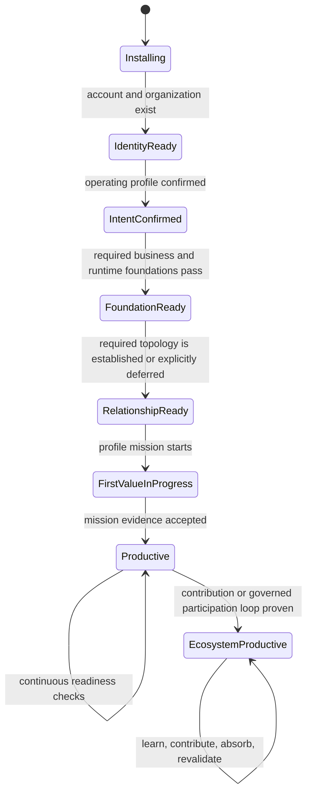
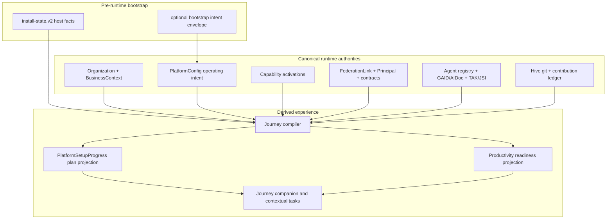

# Purpose-Aware Installation to Ecosystem Productivity

> **Superseded (2026-09-01).** This 2026-08-08 umbrella design was decomposed
> into the more specific, currently-authoritative specs it spawned — the
> installation-identity, installation-estate-identity, external-agent-operating-contract,
> consumer-install-rulebook, and zero-touch-federation designs under
> `docs/superpowers/specs/`. Consult those for current design. Its coordination
> anchors (`EP-1FABA22D` and its BIs) are no longer in the live backlog;
> recovery is tracked by `BI-99250643`. Kept for history — original wording
> below is unchanged.

- **Status:** proposed architecture and product design
- **Date:** 2026-08-08
- **Epic:** `EP-1FABA22D` — Purpose-Aware Installation and Ecosystem Productivity
- **Umbrella item:** `BI-34667080`
- **WorkCapsule:** `WC-8362186F`
- **WWMD decision:** `DI-8707CE39FDD2` — a new lifecycle umbrella owns orchestration; existing epics remain capability owners
- **Scope:** first installation input through evidence-proven participation in the DPF ecosystem

## 1. Executive decision

DPF will replace its one-size-fits-all setup tour with a **purpose-aware installation-to-productivity lifecycle**.

The lifecycle begins with a plain-language question about what this installation will help the organization do. DPF derives a recommendation from installer and organization evidence, asks the human to confirm or correct it, and compiles a resumable journey from existing setup, onboarding, federation, partner, coworker, standards, and Hive capabilities. The user sees outcomes and next actions, not a catalogue of DPF subsystems.

The design makes five facts explicit and keeps them orthogonal:

1. **Environment class** — production, development, or test.
2. **Operating purpose** — operate the organization, evolve DPF for another installation, deliver managed services, grow a regional/channel network, or participate as a community peer.
3. **Relationship intent** — same organization, service provider, channel, or community peer, reusing the existing federation presets.
4. **Geographic scope** — the organization and market geography already owned by business context and organization identity.
5. **Contribution posture** — private/local, review-before-sharing, or an existing governed Hive contribution mode.

One installation can therefore be a production managed-services hub, a development companion for a production business installation, or a regional channel hub with its own development companion. No overloaded `installationRole` enum is introduced.

The durable rule is:

> An installation operating profile expresses intent and compiles work. It never grants identity, trust, authority, qualification, or permission.

Federation trust still requires the existing `FederationLink` lifecycle and dual approval. Agent identity remains GAID/AIDoc. Runtime permission remains TAK and the authority substrate. Job fitness remains TAK-JSI. Cross-agent work remains the existing DPF task/delegation substrate with an A2A projection. Hive participation remains the governed git-and-ledger contribution path.

## 2. Why the current journey is not cohesive

The current platform has strong pieces, but the human must assemble their meaning.

- `SETUP_STEPS` is a fixed eleven-route tour for every installation: account, business context, AI providers, branding, decision stance, operating hours, storefront, platform development, Build Studio, COO introduction, and workspace.
- `PlatformSetupProgress` can persist steps and context, but today its behavior is shaped by the static list rather than by an installation's intended operating role.
- `install-state.v2` records host/runtime lifecycle facts and a loosely typed `installMode`, but it does not record the organization's purpose for the installation.
- Federation setup knows relationship presets and link-local environment class only after the user reaches federation surfaces.
- Partner/channel activation, onboarding intake, WWWD, A2A, GAID, TAK, JSI, and Hive contribution each have their own entry points and vocabulary.
- Completion means finishing a route sequence, not demonstrating that the installation can perform the job for which it was installed.

The result is avoidable cognitive load: people must know which DPF concepts apply, in what order, and how one choice affects later federation and ecosystem work.

## 3. Portfolio boundary

This epic owns the **journey contract, orchestration, readiness projection, profile compiler, and human experience**. It does not absorb the capability epics it composes.

| Existing owner | Capability retained there | This epic's dependency |
|---|---|---|
| `EP-ONBOARDING-INTAKE` | Derive → Ingest → Confirm → Ask intake and business-context enrichment | Use its derivation and confirmation gates as inputs to the profile compiler |
| `EP-MSP-FEDERATION` | sovereign peer links, scoped projections, operator presence, crosswalks, and the link-bound same-organization A2A/GAID slice in `BI-BE0E14E0` | Recommend and guide a topology; consume link/A2A readiness evidence; never create a second trust or remote-task mechanism |
| `EP-PARTNER-CHANNEL` | partner activation, agreements, entitlements, regional/channel operations | Compile channel-specific milestones and first-value proof |
| `EP-EDGE-TOPOLOGY` | edge/node topology and deployment relationships | Reuse topology facts and readiness checks |
| `EP-53A259C6` | organization-owned WWWD onboarding | Require a confirmed decision perspective where the profile needs business autonomy |
| `EP-A2A` | completed A2A-compatible coworker collaboration precedent | Reuse its local contract through the federation-owned adapter; do not reopen it or add a parallel task bus |
| `EP-TAK-3F9A21` | trusted runtime governance | Treat TAK receipts and authority as readiness evidence |
| GAID architecture | governed agent identity and AIDoc; `BI-BE0E14E0` owns same-organization issuer/card conformance at the federation boundary | Report current private readiness and consume verified federated readiness only after that slice lands |
| TAK-JSI architecture | job-profile qualification and runtime ceiling | Report actual qualification status; do not fabricate qualification records |
| `EP-LEARNING-COMMONS` and Hive designs | governed knowledge/contribution lifecycle | Guide a first safe contribution or an explicit local-only posture |
| upgrade/install hardening epics | canonical runtime, lifecycle, backup, upgrade | Production readiness consumes their evidence |
| `BI-B14D6CF6` / workspace-home activation orchestrator | declaration walker, canonical-data and signal registries, slot activation projection | Extend this package into the wider purpose-aware plan; do not create a second activation engine |

Open capability-owner items such as `BI-0610AD49`, `BI-BE0E14E0`, `BI-E2398997`, `BI-9A0B8B70`, and `BI-66CF1AA4` remain dependencies. The new epic must not re-file their implementation under different names.

The architecture and implementation sequence for `BI-BE0E14E0` are authoritative in [`2026-08-08-federated-a2a-gaid-coordination-design.md`](2026-08-08-federated-a2a-gaid-coordination-design.md) and [`2026-08-08-federated-a2a-gaid-coordination.md`](../plans/2026-08-08-federated-a2a-gaid-coordination.md). This lifecycle epic may compile their link/device/issuer/card/task/receipt states into milestones, but it does not own device pinning, GAID issuer convergence, Agent Card projection, federation A2A ingress, `TaskRun` convergence, or the federation-link “Agent coordination” controls.

## 4. Vocabulary and canonical authorities

### 4.1 “Archetype” is not an installation role

DPF already uses **archetype** for the business/industry template taxonomy. A reseller or regional hub is a channel capability and federation relationship, not a new business archetype. The UI may say “regional DPF partner” or “channel hub”; persisted contracts must preserve the distinction.

### 4.2 Stored intent and derived operating profile

The semantic intent is a typed, versioned record. It does not copy host environment or organization facts from their canonical authorities. The proposed stored shape is:

```ts
export const INSTALLATION_OPERATING_PURPOSES = [
  "operate-organization",
  "evolve-dpf",
  "deliver-managed-services",
  "grow-channel",
  "participate-community",
] as const;

export type InstallationOperatingIntentV1 = {
  schemaVersion: 1;
  primaryPurpose: InstallationOperatingPurpose;
  secondaryPurposes: InstallationOperatingPurpose[];
  relationshipIntents: FederationRelationshipPreset[];
  pairedProductionInstallationRef?: string;
  evidence: Array<{
    source: "installer" | "organization" | "business-context" | "capability" | "federation" | "human";
    claim: string;
    sourceRef?: string;
    valueFingerprint?: string;
    observedAt: string;
  }>;
  confidence: "high" | "medium" | "low";
  confirmation: {
    status: "suggested" | "confirmed" | "needs-review";
    confirmedAt?: string;
    confirmedByPrincipalId?: string;
  };
};
```

At read time, the compiler constructs an `InstallationOperatingProfileSnapshot` from this intent plus the canonical environment class, organization/business context, capability activation, and contribution posture. The snapshot is derived and fingerprinted; it is not another writable record.

The exact UI labels can evolve without widening the contract. Closed sets use a shared TypeScript constant/union. The environment vocabulary must converge with the existing federation `production | development | test` contract rather than create a second spelling. Evidence stores safe claims and references, not copied values, secrets, or business documents.

### 4.3 Authority matrix

| Fact | Canonical authority | Not authoritative |
|---|---|---|
| Host path, image, compose/runtime mode, environment class | `install-state.v2` and canonical runtime lifecycle | portal setup context or `FederationLink` metadata |
| Installation purpose and confirmed relationship intent | typed `PlatformConfig` value at `installation.operating-intent.v1` | a `FederationLink` metadata blob |
| Organization name, identity, contact | `Organization` | operating profile |
| Mission, operating model, market/jurisdiction context, WWWD inputs | `BusinessContext` and organization doctrine | installer state |
| Setup journey plan and resume state | `PlatformSetupProgress` projection | `BusinessContext` |
| Capability opt-in | `OrganizationCapabilityActivation` | purpose inference alone |
| Local cryptographic installation identity | `PlatformConfig` key `federation.identity` | hostname or organization slug |
| Peer relationship and trust | `FederationLink`, `Principal`, approval timestamps, projection/authority bindings | operating profile |
| Peer installation environment on a relationship | typed `FederationLink.environmentClass` after `BI-BE0E14E0`; its legacy metadata value during that slice's migration | the local installation's host environment or an A2A body claim |
| Agent identity and advertised claims | GAID + derived AIDoc | installation profile |
| Runtime tool/action authority | TAK/governed execution, grants, delegation, approvals | proactivity or profile |
| Job qualification | TAK-JSI qualification record when implemented | setup completion |
| Hive contribution and provenance | existing git + contribution ledger | local setup history |

### 4.4 Persistence without a new table

No new database table is justified for the first release.

- Add the typed semantic intent as a sibling `PlatformConfig` entry, separate from the cryptographic `federation.identity` value.
- Add a closed, optional `environmentClass` host fact to `install-state.v2`, importing the same closed vocabulary used by federation while preserving distinct authority: installer state owns the local host fact, and `FederationLink.environmentClass` owns the peer environment recorded for that relationship. The runtime may expose a read-only database projection for portal access, but Contract 12 precedence remains process override → installer state → derived projection → default, and local drift is repaired from installer state.
- Extend `install-state.v2` only with a small **bootstrap intent envelope** when the installer must capture semantic intent before the database is available. It carries provenance and an `absorbedAt` marker; after runtime ingestion, `PlatformConfig` is canonical for semantic intent and install-state remains canonical for host/runtime facts.
- Store the compiled journey, plan version, explanations, and evidence references in the existing `PlatformSetupProgress.steps` and `.context` JSON projection.
- Derive productivity readiness from canonical source records. Do not persist a second mutable truth for federation, qualification, or contribution state.

## 5. Profile derivation and confirmation

### 5.1 The first human question

Immediately after account/organization bootstrap, DPF asks:

> **What will this DPF help your organization do first?**

It presents at most four plain-language cards plus a concise “something else” path:

- **Run our organization** — this will hold real operational work.
- **Safely improve another DPF** — use this installation to build and test before proposing a change to production.
- **Operate DPF for customers** — deliver managed services while keeping each customer's authority and data boundaries clear.
- **Grow DPF in a market or region** — provision, support, and improve a partner/channel network.

“Participate in the community” is normally a secondary intent inferred or enabled later, not a fifth compulsory choice. Test installations are derived from environment class, not presented as a business purpose.

The selected card is a confirmation of a recommendation, not a blank questionnaire. DPF explains the evidence in one sentence: for example, “We recommend a development companion because this installer created a writable development workspace alongside a separate canonical runtime.”

### 5.2 Derive → Ingest → Confirm → Ask

The existing onboarding intake spine governs the interaction:

1. **Derive** from installer topology, organization capability applicability, existing federation links, partner records, and business context.
2. **Ingest** optional structured evidence such as an invitation, deployment manifest, partner agreement reference, or production-pairing code.
3. **Confirm** every consequential inference in plain language. No derived intent may silently enable a capability or relationship.
4. **Ask** only for facts that remain necessary to compile the next milestone.

Confidence affects presentation, never authority:

- high: preselect and explain;
- medium: recommend and show the alternative that most changes the journey;
- low: ask one discriminating question and defer nonessential branches.

### 5.3 Change and drift

The profile is editable because an installation can change purpose. A material change recompiles future milestones and marks affected evidence stale. It does not undo completed business data, revoke trust automatically, or widen authority. A production → development change, a new channel purpose, or a changed production pairing requires an impact preview and explicit confirmation.

## 6. The journey compiler

The compiler is a pure, deterministic service over canonical facts. Its implementation home is the existing `apps/web/lib/workspace-home/activation-orchestrator/` package. The current `ActivationPlan`, canonical-data registry, signal registry, and walker become inputs/subplans of the broader installation journey; the new epic generalizes and composes them rather than adding a sibling setup engine.

```ts
compileInstallationJourney({
  operatingIntent,
  environmentClass,
  organization,
  businessContext,
  capabilityActivations,
  federationLinks,
  platformReadiness,
  coworkerReadiness,
  contributionPosture,
}): InstallationJourneyPlan
```

The function first builds the immutable profile snapshot from those authorities. Its `profileFingerprint` uses canonical serialization of authority versions and safe references; timestamps, raw secrets, and mutable display copy are excluded so equal evidence produces equal output.

Its output is a projection, not authority:

```ts
type InstallationJourneyPlan = {
  planVersion: string;
  profileFingerprint: string;
  milestones: JourneyMilestone[];
  deferredCapabilities: DeferredCapability[];
  blockers: JourneyBlocker[];
  firstValueMission: FirstValueMission;
  explanation: string[];
};
```

Each milestone has a stable key, outcome-oriented title, owning capability, evidence descriptor, route/action, prerequisites, whether a human decision is required, and a reason it appears. Existing setup route keys can be retained as action adapters while the static `SETUP_STEPS` ordering is retired.

The existing activation orchestrator's deferred setup-task, empty-state, and reconciliation seams are reused where they fit. One generated-action/evidence path serves both archetype-declared workspace needs and purpose-profile milestones. A milestone may reference the existing archetype `ActivationPlan`; it must not copy its canonical-data counts or signal-binding status into a competing registry.

### 6.1 Lifecycle state

The lifecycle is a state projection over evidence:



`blocked` and `needs-attention` are orthogonal conditions with a plain-language remedy; they are not terminal lifecycle states.

### 6.2 Milestones, not pages

The user sees a compact plan such as:

1. **Know this organization**
2. **Prepare safe AI coworkers**
3. **Connect the right DPF relationship**
4. **Complete the first real outcome**
5. **Join the learning loop**

A milestone can reuse several routes. A route can satisfy more than one milestone. Completed canonical evidence automatically satisfies the milestone on existing installs; users are not asked to re-enter data merely because the journey shell changed.

## 7. Profile blueprints

### 7.1 Business production installation

**Intent:** operate the organization's real work.

Required journey emphasis:

- confirmed organization and business context;
- WWWD stance confirmation appropriate to the intended autonomy;
- governed AI provider/readiness path;
- operating hours/storefront only when applicable to the archetype and enabled capabilities;
- backup, upgrade, identity, authority, audit, and runtime health evidence;
- a first real business workflow completed at the actual privilege level.

**First-value proof:** a profile-selected business outcome reaches its canonical done state and produces the expected operational/audit evidence. Opening the workspace does not count.

### 7.2 Development companion

**Intent:** evolve and test DPF separately from a production authority core.

Required journey emphasis:

- explicit production counterpart or an explainable “not paired yet” state;
- source-control isolation and canonical-runtime distinction;
- governed coordination through WorkCapsules and evidence, not direct production mutation;
- test data and secret separation;
- promotion/contribution route and review expectations;
- federation only when it is required for scoped evidence exchange, using `same-organization` relationship intent and normal trust approval.

**First-value proof:** a bounded change is built/tested in the development context, its evidence is attached to a WorkCapsule, and it reaches the approved promotion or contribution boundary without writing directly to production.

The profile must not imply that every developer worktree is a separate installation or federation peer. Worktrees remain source-control isolation inside one development installation.

### 7.3 Managed-services hub

**Intent:** deliver DPF-enabled services to customer estates.

The journey first resolves which existing topology applies:

- **managed estate:** customer/site scopes live inside the provider's organization; or
- **sovereign peer:** the customer runs DPF and connects through a dual-approved `service-provider` link.

Required journey emphasis:

- partner/service-provider capability activation;
- customer/site or sovereign-peer identity;
- projection contract and data-minimization review;
- proposal-versus-execute authority boundary;
- link health, support route, service obligation, and audit visibility;
- a consented first service loop.

**First-value proof:** a scoped signal becomes a correlated service outcome or remediation proposal, the correct party approves/executes it, and both sides can inspect the evidence. Standing provider control over a sovereign customer is never accepted as proof.

### 7.4 Regional/channel hub

**Intent:** promote, provision, support, and learn across a market or region.

Required journey emphasis:

- `partner-program` capability activation and existing `PartnerAccount`/agreement/entitlement posture;
- market and jurisdiction context from existing organization/business sources;
- `channel` relationship intent and hub-mediated discovery/pairing where appropriate;
- governed customer-install provisioning;
- support and escalation routes;
- contribution attribution and recognition;
- regional learning that can be separated from customer-confidential data.

**First-value proof:** one downstream installation or qualified demand relationship completes a governed provision/pair/support loop, with consent, attribution, and an auditable handoff.

### 7.5 Community peer

**Intent:** exchange learning without a service-provider or channel hierarchy.

Required journey emphasis:

- `community-peer` relationship intent where an actual peer link is needed;
- private-by-default contribution classification;
- contribution review, provenance, and absorption readiness;
- no assumption that community participation requires a trusted runtime link.

**First-value proof:** a safe, reviewed contribution enters the existing Hive git/ledger path, or the installation records an explicit local-only posture with a justified data boundary.

## 8. Federation is shaped early, established later

The profile compiler can recommend a federation shape as soon as intent is known. It may create a draft relationship plan or pairing task, but not a trusted link.

```mermaid
flowchart LR
    I["Installer and organization evidence"] --> P["Suggested operating profile"]
    P --> C["Human confirms intent"]
    C --> J["Journey compiler"]
    J --> R["Relationship plan"]
    R --> D["Discovery or invitation candidate"]
    D --> A["Both sides approve"]
    A --> F["FederationLink becomes trusted"]
    F --> E["Scoped exchange and evidence"]
```



Guardrails:

- Discovery proves reachability/candidacy, not identity or trust.
- Stable peer identity comes from the existing cryptographic installation identity and `Principal` convergence, never hostnames.
- `FederationRelationshipPreset` and directional roles remain canonical.
- Projection and authority are negotiated separately from connectivity.
- Either side can quarantine or revoke under the existing lifecycle.
- The typed link-local peer environment (legacy metadata during migration) can seed a profile suggestion but cannot silently overwrite the local installation's Contract 12 environment class.
- A development companion pairing does not grant production mutation rights.

## 9. Standards and ecosystem composition

### 9.1 A2A

DPF's federation-owned slice `BI-BE0E14E0` is the authority for same-organization cross-install A2A: link/device authentication, GAID issuer and Agent Card verification, A2A lifecycle mapping onto `TaskRun`/`TaskMessage`/`TaskArtifact`, and readable verification receipts. The journey consumes those exact readiness and outcome records. It can separately report that the local A2A-shaped coworker contract is healthy, but it cannot translate local readiness into a claim that cross-install A2A is ready.

It must not add a second agent registry, task store, delegation chain, event bus, or authorization path. `WorkCapsule`, task/delegation records, artifacts, receipts, and governed tool execution remain canonical.

### 9.2 GAID

GAID answers **who the AI agent is and what identity claims are being made**. The journey checks for a valid local GAID/AIDoc for materially distinct coworkers. When a profile requires cross-install coordination, it additionally consumes the link-approved issuer binding, current signed Agent Card/AIDoc mirror, and verified task receipt defined by `BI-BE0E14E0`.

Until `BI-BE0E14E0` is implemented and verified, current DPF evidence supports only the private/local profile and the journey must show federated assurance as unavailable. That slice enables a bounded same-organization, link-scoped assurance profile; it does not establish a public GAID registry or general cross-organization authority. A productive badge must state the exact implemented assurance level rather than collapse these states.

### 9.3 TAK

TAK answers **how the runtime governs the coworker**. Readiness consumes current tool grants, authority decisions, HITL posture, delegation attenuation, sensitivity controls, and receipts. A profile may choose the work to prepare; it cannot widen these controls.

### 9.4 TAK-JSI

TAK-JSI answers **whether an identified coworker is qualified for a particular job, activity, data scope, and risk context**. Current conformance is partial and qualification lifecycle/runtime-ceiling work remains incomplete. The journey therefore has three honest states:

- job profile not required for the selected first-value mission;
- job profile defined/assessed with the evidence actually available; or
- qualification required but not yet available, with a bounded human-supervised path.

Setup completion is never presented as qualification.

### 9.5 Hive Mind and learning commons

Hive is the existing governed git-and-ledger flow by which durable learning can leave one installation and be inherited by another. It is not a central runtime service and federation is not a prerequisite for every contribution.

The journey classifies a first learning outcome:

- platform decision rule → WWMD/kernel;
- durable organization/platform fact → WWWD/appropriate wiki;
- job technique → WSID/skill;
- code contract → repository and architecture docs;
- install-specific secret/path/resource fact → stays local.

Only reviewed, provenance-bearing, egress-safe material enters the contribution path.

## 10. Productivity is evidence, not checklist completion

The platform computes readiness facets from canonical evidence.

| Facet | Question answered | Example evidence |
|---|---|---|
| Identity | Do we know the organization, installation, users, peers, and coworkers at the right scope? | `Organization`, `Principal`, federation identity, GAID/AIDoc |
| Intent | Has the organization confirmed what this installation is for? | operating profile confirmation and provenance |
| Decision | Does the selected work have the right doctrine and authority? | BusinessContext/WWWD, WWMD routing, grants, bindings, approvals |
| Runtime | Can the installation safely perform its profile's work? | canonical runtime health, provider readiness, backup/upgrade evidence |
| Relationship | Are required customer/peer/channel relationships real and appropriately trusted? | capability activation, account/agreement state, `FederationLink` evidence |
| Coworker | Is the needed coworker identified, governed, and sufficiently qualified? | GAID/AIDoc, TAK receipts, actual JSI state |
| First value | Has the installation produced the outcome it was installed for? | profile-specific mission receipt |
| Learning | Can it absorb and, when appropriate, contribute safely? | review/egress/contribution or explicit local-only evidence |

`Productive` requires the first seven facets appropriate to the profile. `Ecosystem productive` additionally requires a proven absorption/contribution or peer-participation loop appropriate to the profile. Optional capabilities do not block either state.

Every readiness assertion carries:

- status: satisfied, attention, blocked, deferred, or not-applicable;
- evidence reference and observed time;
- owner/capability source;
- plain-language explanation;
- remediation action;
- staleness policy.

## 11. Experience design

### 11.1 Product surface

The setup overlay becomes a **journey companion**, not a persistent modal tour. Its home is a first-run workspace panel with a compact milestone list. It follows the user to real routes only when a task is best completed there.

First viewport requirements:

- one sentence: what DPF believes this installation is for;
- one prominent next outcome;
- progress expressed as milestones, not “step 4 of 11”;
- why this task matters for the selected purpose;
- what DPF already completed or inferred;
- a visible way to correct the profile;
- technical details behind a disclosure, never required for the normal path.

### 11.2 Progressive disclosure

The default path uses business language:

- “Connect your production DPF,” not “create a same-organization federation link.”
- “Choose what your service partner may see,” not “edit projection-contract fields.”
- “Prove the first service loop,” not “emit an A2A artifact and TAK receipt.”

Advanced panels can show link IDs, environment class, contract versions, GAID, qualification status, evidence fingerprints, and protocol diagnostics.

### 11.3 Proactivity rules

DPF may proactively:

- infer and recommend a profile;
- pre-satisfy milestones from existing canonical evidence;
- generate a draft relationship plan;
- discover candidate peers;
- stage configuration and explain its impact;
- open the correct coworker with a bounded task;
- monitor readiness drift and recommend repair.

DPF may not proactively:

- confirm the organization's purpose on a human's behalf;
- activate a commercial capability from inference alone;
- establish federation trust;
- widen a projection or authority band;
- claim a GAID/JSI conformance level not evidenced;
- publish a Hive contribution;
- mutate production from a development companion.

### 11.4 Accessibility and theme contract

Implementation reuses shared UI primitives and `--dpf-*` theme tokens. Milestones expose programmatic status text, keyboard navigation, focus restoration, reduced-motion behavior, and non-color status cues. Mobile and desktop verification must prove that the purpose chooser, milestone panel, evidence disclosures, and federation confirmation flow do not overlap or trap focus.

### 11.5 UX-fit decision

**Decision:** fits-with-guardrails.

- **Owning area:** Workspace. The journey companion is part of the authenticated user's work home; `/setup` remains the unauthenticated account/organization bootstrap only.
- **Route family:** canonical home `/workspace`; existing business, platform, federation, and storefront routes remain contextual destinations. No new global or section-navigation item is added.
- **Primary persona:** founder/operator on the default path, with contributor/platform-operator detail behind disclosure. The first viewport must not require either persona to remember setup routes, federation terminology, or standards acronyms.
- **Navigation layer:** contextual actions only. The AppRail and section navigation do not change for this epic.
- **Reuse/convergence:** evolve `SetupOverlay`/`SetupProgressBar` into the milestone companion; extend the existing workspace-home activation orchestrator; reuse the evidence-disclosure pattern of `JourneyHealthCard`; use shared form primitives for confirmation, and report-kit `StatusBadge`, `Notice`, and `EmptyState` for evidence/failure presentation. Do not introduce another dashboard, KPI-card family, status-color map, or empty-state dialect.
- **Source truth:** the authority matrix in §4.3 plus the journey/readiness projectors. No visible status may be computed independently in a component.
- **Empty/failure behavior:** a fresh installation gets one recommended next action; insufficient evidence asks one discriminating question; an unavailable owner route or provider shows an honest recovery action; missing permission explains who can continue; no zero-filled dashboard is rendered.
- **AI boundary:** selecting or correcting purpose saves governed configuration and sends no prompt. Any optional “work through this with your COO” action shows the context, expected next step, and asks for explicit confirmation before starting coworker work.
- **Evidence before merge:** route/action tests, source-truth fixtures, UX budget sweep and measured manifest, theme/style scan, keyboard/axe checks, and real browser exercises at desktop and narrow viewports for fresh, returning, blocked, permission-denied, and profile-change states.

## 12. Architecture and data flow



The compiler reads; existing domain actions write. A journey adapter invokes the owning action or links to its owning route. It does not reproduce domain validation inside setup code.

## 13. Migration and compatibility

### 13.1 Existing installations

Existing installations receive a derived **suggested** profile based on evidence. None is auto-confirmed.

- completed setup steps remain completed;
- existing business context remains canonical;
- existing capability activations remain unchanged;
- existing federation links remain unchanged;
- link metadata may contribute evidence but never becomes the profile by fiat;
- missing evidence produces a targeted milestone, not a reset of onboarding;
- a completed old setup tour can still yield `needs-attention` if no first-value proof exists.

### 13.2 Installer compatibility

Older installer state remains valid. The new environment-class field and bootstrap intent envelope are optional and versioned. Runtime ingestion is idempotent. If the database is unavailable, the installer can finish host provisioning and the intent remains pending confirmation; it must not fabricate an organization or trust relationship.

All deployment targets wrap the same logical intent/environment contracts. An interactive installer may capture the recommendation early; a headless or substrate-managed installer records host evidence and lets `/workspace` perform the confirmation. Substrate adapters may vary in collection mechanics, never in semantic values or authority.

### 13.3 Profile changes

A profile change creates an impact preview:

- milestones added, removed, or invalidated;
- relationships that may no longer be needed;
- evidence that has become stale;
- production or data-boundary implications;
- confirmation/approval required.

No destructive cleanup is automatic. Relationship revocation and data disposition use their existing governed actions.

### 13.4 Security, release, and rollback

- Profile confirmation/change requires the existing platform-management authority and writes an auditable principal reference.
- Evidence references are allow-listed and privacy-safe; raw secrets, credentials, documents, prompt text, and peer tokens never enter the intent or journey projection.
- Installer-to-runtime ingestion validates schema/version, rejects unknown keys, is idempotent, and cannot activate capabilities, approve links, or mint authority.
- The journey compiler is read-only. Every mutation routes through the owning governed action and its current authorization/audit path.
- Ship behind a versioned purpose-aware-journey rollout flag. During rollout, existing routes/actions stay operational and the new companion reads their evidence.
- Rollback hides the new companion and restores the previous route-tour presentation without deleting intent, progress, business, or relationship records. Forward repair recompiles from canonical evidence; no down migration or trust-state rewrite is required.

## 14. Refactoring allocation

Approximately **20% of implementation capacity** is reserved for consolidation that makes the lifecycle maintainable. This is part of delivery, not a speculative rewrite.

Priority refactors:

1. Replace page-order coupling around `SETUP_STEPS` with stable milestone descriptors and route/action adapters.
2. Reuse one generated environment-class vocabulary while preserving separate authorities for the local installer fact and the per-link peer fact; coordinate with `BI-BE0E14E0`, which owns promotion of the federation value from metadata to a typed field.
3. Extract profile decoding/versioning and journey evidence descriptors into shared pure modules with no route-local duplicates.
4. Make `PlatformSetupProgress` access go through one projection service rather than component-local JSON assumptions.
5. Generalize the existing workspace-home activation orchestrator instead of creating a purpose-specific orchestrator beside it; converge setup-task, canonical-data, signal, empty-state, and reconciliation seams.
6. Reuse the existing federation relationship/role helpers and trust lifecycle; remove any duplicated setup-specific pairing vocabulary.
7. Reuse one readiness/evidence shape across setup, AI readiness, federation, and the eventual cockpit where practical.

The refactor budget does not authorize replacing `Organization`, `BusinessContext`, `PlatformConfig`, `FederationLink`, `Principal`, the task substrate, or the contribution ledger.

## 15. Research and benchmarking

### 15.1 Open-source product patterns

| Reference | Pattern | DPF adoption | Rejection |
|---|---|---|---|
| [Backstage Software Templates](https://backstage.io/docs/features/software-templates/) | Choose a golden-path template, provide variables, review, run, and retain task history | A profile compiles a reviewable plan and preserves journey history | A catalogue of technical templates as the first experience |
| [Home Assistant config flows](https://developers.home-assistant.io/docs/core/integration/config_flow/) and [discovery](https://developers.home-assistant.io/docs/core/integration-quality-scale/rules/discovery/) | Discovery opens a user-confirmed configuration flow; it does not silently establish the integration | Derive/discover first, then ask for confirmation only when consequential | Auto-trusting a discovered peer or hiding why it was suggested |
| [Open Cluster Management registration](https://open-cluster-management.io/docs/getting-started/installation/register-a-cluster/) | Explicit hub/managed roles, bootstrap registration, and hub acceptance | Clear directional relationship, invitation, and mutual acceptance | Treating a network connection as proof of organizational trust |

### 15.2 Identity, federation, and agent standards

- [SPIFFE federation](https://spiffe.io/docs/latest/spiffe-specs/spiffe_federation/) separates trust domains, defines explicit bundle endpoints, and supports directional federation relationships. DPF adopts explicit domain/relationship binding and lifecycle thinking; it does not replace GAID, Principal, or FederationLink with SPIFFE identities.
- [SPIFFE trust domains](https://spiffe.io/docs/latest/spiffe-specs/spiffe_trust_domain_and_bundle/) recommend separate trust domains where environments or security practices differ. DPF therefore keeps environment class explicit and never infers production trust from same-organization ownership.
- The [A2A v1.0 specification](https://a2a-protocol.org/latest/specification/) defines Agent Card discovery, tasks, artifacts, asynchronous updates, and human-in-the-loop interactions. DPF's federation slice maps those concepts onto the existing federation envelope and canonical task/evidence records; this lifecycle merely projects its evidence.

## 16. SysML architecture note

This design changes system architecture, runtime journey behavior, and the projection of agent/federation readiness. The implementation must update the internal EA/SysML substrate rather than leave this document as the only model.

### 16.1 System boundary

**System of interest:** Purpose-Aware Installation Lifecycle.

**External actors:** organization owner, platform operator, developer, service provider, channel partner, peer installation, canonical runtime, AI coworker, Hive review/contribution system.

**Owned responsibility:** derive and confirm installation intent, compile and present the journey, resolve readiness evidence, and route actions to owning capabilities.

**Not owned:** organization identity, business doctrine, peer trust, runtime authority, job qualification, task execution, and contribution publication.

### 16.2 Requirements

| ID | Requirement |
|---|---|
| `PIL-R1` | The system shall obtain or derive operating intent before presenting role-dependent setup work. |
| `PIL-R2` | The system shall preserve environment, purpose, relationship, geography, and contribution posture as separate axes. |
| `PIL-R3` | Every consequential inference shall require explainable human confirmation. |
| `PIL-R4` | Journey compilation shall be deterministic for the same canonical evidence and plan version. |
| `PIL-R5` | The journey shall reuse existing domain actions and shall not duplicate their authority checks. |
| `PIL-R6` | An operating profile shall never establish federation trust or widen authority. |
| `PIL-R7` | Productivity shall require profile-specific first-value evidence, not route completion alone. |
| `PIL-R8` | Existing installations shall migrate without re-entering canonical data or gaining new trust. |
| `PIL-R9` | Standards readiness shall report actual A2A/GAID/TAK/JSI conformance without overclaiming. |
| `PIL-R10` | Hive participation shall preserve provenance, egress review, and local-only classification. |
| `PIL-R11` | The normal path shall hide protocol and infrastructure detail behind business-language outcomes. |
| `PIL-R12` | All readiness assertions shall carry source, time, explanation, remediation, and staleness. |

### 16.3 Interfaces and ports

| Port | Direction | Contract |
|---|---|---|
| Installer bootstrap | inbound | versioned host facts plus optional intent envelope |
| Organization context | inbound | organization/business-context snapshot and provenance |
| Capability registry | inbound | applicability plus explicit activation state |
| Federation evidence | inbound | relationship, trust, projection, authority, and health summaries |
| Coworker standards evidence | inbound | AIDoc/GAID, TAK authority/receipts, actual JSI state |
| Hive evidence | inbound | contribution posture, review, provenance, absorption status |
| Journey plan | outbound | versioned milestones, blockers, explanations, first-value mission |
| Domain action routing | outbound | stable route/action adapter to capability owner |

### 16.4 Allocation

| Function | Allocated component |
|---|---|
| Decode/version profile | shared platform domain module |
| Derive candidate profile | onboarding derivation service |
| Confirm profile | governed setup action |
| Compile journey | pure journey compiler |
| Persist canonical profile | typed `PlatformConfig` repository |
| Persist journey projection | `PlatformSetupProgress` service |
| Resolve readiness | evidence resolvers owned by each capability plus an aggregate projector |
| Render experience | setup/workspace shared UI primitives |
| Establish trust | existing federation actions only |
| Execute coworker work | existing TAK-governed runtime only |
| Publish contribution | existing Hive contribution path only |

### 16.5 Verification cases

| ID | Verification |
|---|---|
| `PIL-V1` | Table-driven compiler tests cover all primary purposes crossed with three environment classes and compatible relationship intents. |
| `PIL-V2` | Changing a purpose recomputes milestones but never changes `FederationLink` approval fields or grants. |
| `PIL-V3` | Existing completed setup evidence satisfies matching milestones without replay. |
| `PIL-V4` | A discovered peer remains a candidate until both existing federation approvals are present. |
| `PIL-V5` | Development-companion flow cannot invoke a direct production mutation path. |
| `PIL-V6` | Each profile's first-value fixture remains non-productive until its required evidence exists. |
| `PIL-V7` | Missing GAID public/JSI qualification capabilities appear as gaps, not green readiness. |
| `PIL-V8` | Egress-sensitive Hive material cannot pass the journey proof without contribution review evidence. |
| `PIL-V9` | Keyboard, screen-reader, mobile, dark/light, and organization-theme checks pass for purpose and milestone surfaces. |
| `PIL-V10` | EA conformance verifies the journey block, interfaces, requirements, allocations, and verification links match runtime contracts. |

### 16.6 EA/data architecture impact

Implementation adds one Purpose-Aware Installation Lifecycle block/package to the existing EA model and traces it to the authorities above. The data architecture mirror must show `PlatformConfig` as the canonical profile store and `PlatformSetupProgress` as a projection. Any later proposal for a dedicated profile table requires a new schema audit and evidence that versioned `PlatformConfig` is unfit.

## 17. Delivery phases

### Phase 0 — contract and compatibility

- shared profile/environment types and decoder;
- `installation.operating-intent.v1` repository and derived profile snapshot;
- Contract 12-compliant canonical environment class plus portal projection;
- optional install-state bootstrap envelope and idempotent ingestion;
- existing-install derivation in suggested/unconfirmed state;
- EA/SysML current-state update.

**Exit:** a profile can be stored, decoded, derived, confirmed, and changed without affecting trust or capability activation.

**Implemented boundary slice (BI-50136281):** the shared V1 decoder and the
`installation.operating-intent.v1` repository are mounted as the first milestone
of the Workspace journey.
Investment funding now requires a human-confirmed `operate-organization` primary
purpose before the existing organization WWWD gate runs. Missing, malformed,
suggested, and development-companion intent fails closed and is audit logged.
This check is a prerequisite only: user capabilities, MCP grants, TAK, and
`AuthorityBinding` remain the canonical permission authorities, and confirming a
purpose neither creates nor widens a grant.

## Design grounding

- Existing specs/plans reviewed:
  - this purpose-aware installation design and its implementation plan;
  - the unified delivery-surfaces execution-alignment design;
  - the coworker authority-binding design and implementation plan.
- Current code substrate reviewed:
  - the canonical `PlatformConfig` repository;
  - Workspace home composition and platform capability checks;
  - `AuthorityBinding` effective-authority resolution;
  - the existing investment-funding WWWD gate and authorization audit log.
- Source of truth:
  - `installation.operating-intent.v1` owns confirmed installation intent;
  - user capabilities, MCP grants, TAK, and `AuthorityBinding` continue to own
    permission; the organization WWWD profile owns the funding judgment.
- Decision:
  - mount owner confirmation as the first Workspace journey milestone and use
    confirmed `operate-organization` intent as a fail-closed prerequisite before
    the existing funding gate, without creating another authority system.

### Phase 1 — compiler and evidence model

- pure journey compiler;
- stable milestone/evidence/readiness descriptors;
- adapters over existing setup routes/actions;
- migration from static step ordering while preserving completed evidence;
- profile-specific first-value mission contract.

**Exit:** fixtures for all profiles compile deterministic plans and readiness states.

### Phase 2 — purpose and journey experience

- recommended-purpose confirmation after account bootstrap;
- milestone-based setup/workspace companion;
- explainability, correction, pause/resume, and impact preview;
- responsive/accessibility/theme verification.

**Exit:** a nontechnical user can understand the installation's purpose, next outcome, and why it matters without seeing protocol plumbing.

### Phase 3 — topology and federation composition

- development-companion production pairing plan;
- managed-estate versus sovereign-peer selection;
- channel/regional relationship plan;
- discovery/invitation candidates routed through existing federation approvals;
- relationship readiness and first scoped exchange evidence; A2A-specific readiness is consumed only from `BI-BE0E14E0`.

**Exit:** each relationship-bearing profile reaches its first-value proof without implicit trust or duplicate federation logic.

### Phase 4 — coworker standards and first-value missions

- distinct local A2A-contract readiness and `BI-BE0E14E0` link-scoped A2A readiness;
- local GAID/AIDoc checks plus verified link/issuer/card/task receipts where federation is required;
- TAK authority/receipt checks;
- honest TAK-JSI state and supervised fallback;
- profile-specific first-value mission orchestration.

**Exit:** “productive” is backed by domain outcome and governance evidence for every supported profile.

### Phase 5 — ecosystem learning and continuous readiness

- contribution/absorption journey over existing Hive tools;
- egress classification and local-only posture;
- readiness drift monitoring and targeted remediation;
- cohort metrics by profile, not a single misleading completion percentage.

**Exit:** “ecosystem productive” is measurable and sustainable after first setup.

## 18. Measures

Measure by confirmed profile and version:

- median time from account bootstrap to intent confirmation;
- questions asked versus fields derived and confirmed;
- time to first-value proof;
- abandonment and human-help rate per milestone;
- proportion of existing evidence reused during migration;
- federation candidate → approved link conversion and time, without treating non-conversion as failure;
- first-value proof success and rework;
- readiness drift detection-to-repair time;
- contribution/absorption success, rejection reason, and local-only classification;
- incorrect-profile correction rate and the evidence that caused the bad recommendation.

Do not optimize for raw setup-step completion. A shorter tour that produces no operational outcome is not success.

## 19. Risks and mitigations

| Risk | Mitigation |
|---|---|
| Profile becomes a privilege shortcut | Make it intent-only; test that grants, approvals, and link trust never change |
| Categories become another rigid taxonomy | Separate orthogonal axes; version the compiler; allow secondary purposes |
| Existing setup capability disappears | Keep route/action adapters and canonical evidence; change orchestration, not domain ownership |
| Users see even more concepts | Outcome language, one recommended choice, milestone view, progressive disclosure |
| Federation starts too early | Draft a relationship plan early; require existing discovery/identity/dual-approval lifecycle later |
| Public GAID/JSI readiness is overstated | Resolve conformance from current evidence and expose gaps honestly |
| Channel role pollutes archetype taxonomy | Keep channel purpose/capability separate from industry/business archetype |
| Existing installs are forced through onboarding again | Evidence-aware backfill; suggested profile; no destructive reset |
| Journey snapshot becomes stale truth | Project from canonical sources; every assertion has staleness policy |
| Epic duplicates active work | Capability-owner dependency matrix and backlog coverage checks before every child BI |

## 20. Non-goals

- No new federation protocol, event bus, identity table, task/delegation system, approval engine, activation orchestrator, or Hive service.
- No public or general cross-organization GAID claim; bounded same-organization link-scoped assurance is reported only after `BI-BE0E14E0` is implemented and verified.
- No automatic TAK-JSI qualification by completing setup.
- No assumption that every installation must federate.
- No assumption that every installation must contribute outward.
- No replacement of business archetypes with installation roles.
- No worktree-to-production trust model; worktrees are source-control isolation.
- No direct development-to-production mutation path.
- No universal “100% ready” score that hides profile-specific critical gaps.

## 21. Acceptance criteria

1. A new installation receives an explainable purpose recommendation and can confirm or correct it before role-dependent work is presented.
2. Environment, operating purpose, relationships, geography, and contribution posture are separate typed facts.
3. The compiler produces a deterministic, resumable, profile-shaped milestone plan from canonical evidence.
4. Existing setup evidence is preserved and reused; migration grants no capability, trust, or authority.
5. Business production, development companion, managed-services hub, regional/channel hub, and community peer have distinct first-value proofs.
6. Relationship plans reuse existing federation presets, roles, identity, contracts, and dual approval.
7. A2A, GAID, TAK, TAK-JSI, and Hive readiness is composed from existing authorities and reports unimplemented gaps honestly.
8. `Productive` requires accepted first-value evidence; `Ecosystem productive` additionally requires an appropriate governed participation/learning loop.
9. The user experience passes DPF UX-fit review, theme-token rules, accessibility checks, and mobile/desktop verification.
10. The implementation devotes about 20% of capacity to the bounded convergence refactors in §14.
11. The EA/SysML model and data-architecture mirror trace the requirements, interfaces, allocations, authorities, and verification cases.
12. Every independently shippable phase has live backlog coverage and declares its existing capability-owner dependencies before implementation.

## 22. Decision record

The WWMD comparison considered:

1. a new lifecycle umbrella with existing epics retained as capability owners;
2. extending onboarding intake to own the entire journey; and
3. extending federation to own the journey.

`principle_decide` selected option 1 with high confidence and no commandment conflict (`DI-8707CE39FDD2`). The strongest positive contributors were Research and Use Standards and Never Assume — Verify, followed by Optimize for the Whole, Ground Existing Platform Work, and Architecture Over Shortcuts.

That decision is implemented here: the new epic owns orchestration and evidence of productivity; each existing domain remains the single source of truth for its capability.

## 23. Advisory review record

### 23.1 Architecture review

**Alignment summary:** well-aligned after the following findings were folded into this revision.

- **Important — canonical environment ownership.** The first draft placed environment class inside the database intent record, which would have duplicated an installer/host fact. **Resolution:** §4 now makes `install-state.v2` canonical, declares Contract 12 projection/precedence/drift behavior, and builds a derived runtime profile snapshot.
- **Important — canonical organization and evidence ownership.** The first draft copied `organizationId` and raw observed values into the intent. **Resolution:** the stored contract now contains only semantic purpose/relationship intent and privacy-safe evidence references; Organization and BusinessContext remain authoritative.
- **Important — activation-orchestrator reuse.** A deeper code-graph review found the shipped declaration walker and registries under `workspace-home/activation-orchestrator` (`BI-B14D6CF6`). **Resolution:** §§3, 6, 11, and 14 now make that package the implementation home and prohibit a parallel journey/activation engine.
- **Important — federated A2A/GAID ownership.** `origin/main` gained the reviewed `BI-BE0E14E0` design while this branch was in flight. **Resolution:** §§3, 4, 8, 9, 14, 15, and 17 now treat its link/device/issuer/card/task/receipt contracts as controlling capability-owner work, separate local from cross-install readiness, and limit this epic to read-only journey projection.
- **Minor — deterministic compilation.** Volatile timestamps could have made equal evidence produce different fingerprints. **Resolution:** §6 excludes timestamps, secrets, and display copy from the canonical fingerprint.
- **Minor — deployment and rollback completeness.** **Resolution:** §13 declares one logical cross-substrate contract, headless behavior, rollout isolation, and non-destructive rollback.

No new data model, identity store, trust mechanism, task bus, approval engine, or standards registry was recommended. No additional kernel decision was necessary beyond `DI-8707CE39FDD2`. The standards researched in §15 were sufficient, and no missing durable rule was found that requires a reference-doc improvement proposal.

### 23.2 UX-fit review

The recorded decision is **fits-with-guardrails**. Its owning area, route family, persona, navigation layer, component convergence, source truth, empty/failure behavior, AI boundary, required behavior, and verification evidence are captured in §11.5. Those guardrails must be copied into the implementation plan and measured UX-fit manifest for any UI-bearing PR.

## 24. Governed backlog coverage

The implementation plan is decomposed into seven live, independently shippable items under `EP-1FABA22D`:

| Slice | Backlog item |
|---|---|
| Intent contract and compatibility | `BI-A9F60372` |
| Journey compiler and productivity projection | `BI-91EF130B` |
| Setup/readiness convergence refactor (~20% capacity) | `BI-4FCBA4B2` |
| Workspace purpose and milestone experience | `BI-1E91D091` |
| Topology and federation orchestration | `BI-AE128860` |
| First value and standards readiness | `BI-3E99ACFA` |
| Hive participation, drift repair, and metrics | `BI-669D2B04` |

Coverage receipt `cmskn1vrn006e01qpg9g877cn` was revalidated as current for umbrella `BI-34667080` and plan `docs/superpowers/plans/2026-08-08-purpose-aware-installation-ecosystem-productivity.md`. Existing capability-owner BIs named in §3 remain dependencies rather than duplicate children.
