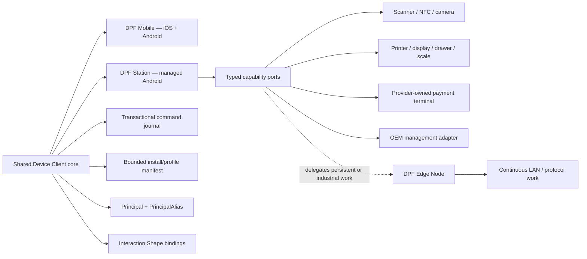

# Attended Device Client & Archetype Hardware Enablement — Design

**Date:** 2026-08-15

**Status:** Proposed architecture; implementation remains backlog-gated

**Epic:** `EP-C1E3EB09` — Attended Device Client & Archetype Hardware Enablement

**Architecture BI:** `BI-EB4D0EC0`

**Keystone:** `BI-DD356A78`

**Decision records:** `DI-D896117E4A03` (successor epic), `DI-0FC0B0C2079E` (React Native + Expo direction)

**Extends:** [Native Mobile — Archetype Persona Apps](2026-06-14-native-mobile-archetype-apps-design.md), [Field Employee Mobile AI & Automation](2026-08-06-field-employee-mobile-ai-automation-design.md), [Operational Twin Framework](2026-07-12-operational-twin-framework-design.md), and [Interaction Shape Graph & design shaping](2026-08-15-interaction-shape-graph-and-design-shaping-design.md)

**Deployment contract:** [Canonical Deployment Contracts, Contract 10](2026-05-09-deployment-contracts.md#10-client-and-api-surfaces)

## 1. Outcome and decision

DPF should release Android for the existing generic Mobile client and create a second, managed Android package called **DPF Station** over the same Device Client core. This is not a new Android codebase and it is not a web portal wrapped in a kiosk shell.

The target product family is:

| Package | Primary use | Operating posture |
|---|---|---|
| **DPF Mobile** | Personal iOS and Android work: approvals, field work, camera, notifications, light scanning | User-owned or organization-managed phone/tablet; App Store and Play distribution |
| **DPF Station** | Shared, fixed, rugged, or dedicated work: restaurant floor, service bay, checkout, kiosk, scan terminal | Android 12+ managed/dedicated device; private or managed distribution; lock-task capable |
| **DPF Edge Node** | Unattended continuous work: discovery, polling, industrial protocols, local automations, persistent LAN services | Headless service or appliance; no human interaction required |

React Native with Expo development builds remains the client framework. Native capability adapters isolate OEM and peripheral APIs at a narrow boundary. Essential operation must not depend on Google Play Services because important payment and purpose-built Android hardware, including Clover devices, uses AOSP-derived environments without the full Google Mobile Services stack.

The hardware program does not prescribe one vendor. It maintains evidence-backed compatibility and reference kits by **interaction profile and archetype need**, with vendor-specific integrations behind typed ports.

## 2. Problem

The browser portal is appropriate for deep administration, analysis, and configuration. It is not the right interaction shape for every operational moment. Checkout, restaurant-floor coordination, service-bay updates, check-in, ticketing, and repeated scan/custody movements need:

- immediate touch feedback and predictable focus;
- persistent authenticated device identity separate from the person using it;
- scanner, NFC, camera, printer, cash-drawer, scale, customer-display, and payment-terminal access;
- durable offline commands and deterministic recovery;
- managed-device enrollment, lock task, reboot recovery, and remote revocation;
- a small job-shaped interface that hides portal complexity;
- hardware guidance grounded in tested evidence, lifecycle, environment, and archetype work.

The first iOS client proves the mobile substrate and should be extended to Android. It does not by itself satisfy the shared-device, peripheral, management, or kiosk contracts. Treating all Android devices as one generic mobile target would mix personal and dedicated-device trust models; building a separate native codebase for every device family would create the opposite problem—fragmentation and vendor lock-in.

## 3. Scope and terminology

**Device Client** is the shared application-layer core: API client, identity binding, install manifest, semantic tokens, bounded native capability model, offline command journal, telemetry, and Interaction Shape bindings.

**Profile** is a bounded interaction and hardware-needs contract, not a separate app or hardware catalog. The initial profiles are Station, Kiosk, Handheld, and Scan Terminal.

**Reference kit** is a versioned, dated combination of device, OS, peripherals, management posture, provider adapter, and verified capability evidence. It is a recommendation tier, not a permanent certification or procurement mandate.

**Managed device** means Android enterprise management or equivalent OEM management controls the device posture. The EMM/MDM remains operator-selected. DPF consumes managed configuration and reports posture; it does not become a replacement EMM.

## 4. Research & benchmarking

### 4.1 Client-framework options

| Option | Evidence and fit | Decision |
|---|---|---|
| **React Native + Expo development builds** | Extends the existing iOS/Android substrate, supports custom native modules through Expo development builds, and keeps shared TypeScript contracts. Expo runtime-version policies provide an explicit JS/native compatibility boundary. | **Adopt.** One shared core, with Mobile and Station packaging. |
| **Native Kotlin / Jetpack Compose Station** | Best direct Android API access and simplest dedicated-device integration, but duplicates navigation, identity, API, offline, tokens, testing, and archetype rendering already owned by the mobile substrate. | Reject as the default. Permit a small native host/module when an OEM SDK cannot be safely bridged. |
| **Flutter** | Mature cross-platform UI and good performance, but introduces Dart, a parallel component system, and no reuse of DPF's existing React Native client. | Reject for this program. |
| **Browser/PWA or generic web wrapper** | Broad device reach and low packaging cost, but weak managed-device/peripheral integration and a portal interaction model that does not meet the repeated, low-latency operational use cases. | Reject for core Station/Kiosk/Scan Terminal work. It remains valid for customer portals and low-frequency browser flows. |

The WWMD decision `DI-0FC0B0C2079E` recommended React Native + Expo over the alternatives with high confidence. This spec applies that decision without widening it into a claim that all hardware can be abstracted equally.

### 4.2 Managed-device and hardware standards

- Android's [dedicated-device guidance](https://developer.android.com/work/dpc/dedicated-devices) and [lock task mode](https://developer.android.com/work/dpc/dedicated-devices/lock-task-mode) define the Station/Kiosk management baseline. DPF adopts the standard device-owner and allowlisted-lock-task model instead of inventing an application-only escape barrier.
- Android Management API documents [dedicated-device policy](https://developers.google.com/android/management/policies/dedicated-devices) and [QR/zero-touch provisioning](https://developers.google.com/android/management/provision-device). DPF adopts interoperable managed configuration and enrollment inputs while leaving the EMM choice to the operator.
- Android [managed configurations](https://developer.android.com/work/managed-configurations) are appropriate for non-secret install URL, organization hint, profile, and environment policy. Secrets and durable device credentials never travel in managed configuration.
- Android [Keystore](https://developer.android.com/privacy-and-security/keystore) is the device-key boundary. [Key attestation](https://developer.android.com/privacy-and-security/security-key-attestation) may raise assurance where the operator validates it off-device; it is not a universal enrollment prerequisite.
- Expo [development builds](https://docs.expo.dev/develop/development-builds/introduction/) and [custom native code](https://docs.expo.dev/workflow/customizing/) provide the supported native-adapter path. [Runtime versions](https://docs.expo.dev/eas-update/runtime-versions/) must track native compatibility.
- React Native's [New Architecture](https://reactnative.dev/blog/2024/10/23/the-new-architecture-is-here) is the forward substrate for native modules. Adapters must be proven on the repository-pinned React Native/Expo versions, not assumed from a vendor sample.

### 4.3 Reference device and payment ecosystems

- Zebra [DataWedge Intent Output](https://techdocs.zebra.com/datawedge/latest/guide/output/intent/) is the preferred first enterprise-scanner integration because it keeps scan delivery behind Android intents rather than embedding a broad OEM SDK in business components. The Zebra TC22/TC27 class is a proof candidate, not a permanent platform dependency.
- Clover documents that [its devices use AOSP and do not include Google Play Services](https://docs.clover.com/dev/docs/clover-devices), and publishes Android SDK and device-lifecycle requirements. Clover therefore requires a separately certified adapter/package assessment; DPF's essential core cannot assume GMS.
- Stripe Terminal documents [reader selection](https://docs.stripe.com/terminal/payments/setup-reader), [mobile readers](https://docs.stripe.com/terminal/mobile-readers), and [offline payment collection](https://docs.stripe.com/terminal/features/operate-offline/collect-card-payments). DPF may orchestrate a payment intent and consume provider results, but the provider-certified reader/SDK owns card data and payment certification.
- Square's [Mobile Payments SDK](https://developer.squareup.com/docs/mobile-payments-sdk) and [React Native plugin](https://developer.squareup.com/docs/mobile-payments-sdk/react-native) are attended-payment references; Square explicitly excludes unattended kiosks, so provider eligibility is profile-specific rather than a generic “supports payments” flag.
- Adyen's [Android Tap to Pay](https://docs.adyen.com/point-of-sale/mobile-android/) and [device requirements](https://docs.adyen.com/point-of-sale/mobile-android/requirements) show why phone-as-terminal capability needs a provider/device/OS eligibility check and cannot be promised from Android version alone.
- Samsung Tab Active and Elo-class Android displays are reference candidates for rugged Station and fixed Kiosk proofs. The evidence record—not the brand name—determines recommendation status.

### 4.4 What DPF adopts and rejects

Adopt Android enterprise management, Keystore-bound keys, provider-certified payment boundaries, intent-first scanning, Expo development builds, native/runtime compatibility versioning, and Android Macrobenchmark/Perfetto evidence.

Reject application-only kiosk locking, remote executable UI, a generic “Android compatible” claim, direct card-data handling, a new DPF-owned EMM, a separate catalog per archetype, and business components importing vendor SDKs.

## 5. Existing substrate and authority map

| Concern | Existing authority | This program's rule |
|---|---|---|
| Mobile app and API client | `apps/mobile`, `/api/v1/**`, Mobile design specs | Extend to Android; refactor shared Device Client core instead of creating a second app architecture. |
| Install-driven design/function | DTCG token projection, activation profile, `OrganizationCapabilityActivation`, bounded Dynamic Form/View renderers | Reuse. A manifest may select compiled capabilities and screens; it may never download executable code. |
| Human-interaction shape | Nav projection, Operational Value Stream stages, route audience, page purpose, and Interaction Shape Graph | Every Station surface binds `spineStage`, `jobLane`, `stepRole`, and `continuesTo`; no parallel navigation graph. |
| Device/service identity | `Principal` and `PrincipalAlias` | A managed Station converges here. Do not create a `StationUser` or identity island. Human session and device principal remain separate. |
| Notification endpoint | `PushDeviceRegistration` | Remains a push-token registration, not fleet identity or enrollment authority. |
| Hardware model identity and lifecycle | `CatalogIdentity(part='h')`, lifecycle milestones, device catalog, asset-intelligence work | Reuse for models and lifecycle. Compatibility evidence projects onto this catalog after the data audit in `BI-E7777798`; no archetype-specific catalog. |
| Customer/installed equipment and finance assets | `CustomerConfigurationItem`, `InventoryEntity`, `FixedAsset` | Preserve their distinct authority. Recommendations may read them but do not merge them. |
| Runtime/build evidence | WorkCapsule and governed execution evidence | Reuse for proof runs. Do not add a private “test results” island. |
| Unattended local work | DPF Edge Node | Keep continuous protocols, polling, discovery, and background automation on Edge. |

This substrate audit is the design constraint. Any build BI proposing a new table, identity, graph, hardware catalog, evidence store, or token system must first prove the mapped authority cannot carry the requirement.

## 6. Target architecture

### 6.1 Packaging

1. Keep `apps/mobile` as the application family and shared-core owner.
2. Release and verify its existing Android target as **DPF Mobile** (`BI-9F415DC6`).
3. Add a separate managed Android application identity for **DPF Station** (`BI-9EFAB9F3`), proposed package `com.dpf.station`, so management policy, private distribution, update rings, and kiosk restrictions do not leak into the consumer Mobile package.
4. Share API, models, validation, token projection, renderers, command journal, telemetry, and most interaction primitives. Keep app identity, permissions, management receiver, lock-task behavior, eligible profiles, and hardware adapters at the package edge.
5. Use Expo development builds and checked-in native configuration. Any native dependency change advances the runtime version/fingerprint and requires a native build; over-the-air JS must never cross an incompatible native runtime.

### 6.2 Compiled capability manifest

The Authority Core returns a signed or authenticated manifest that can select only capabilities compiled into that binary/runtime version. A manifest entry has a stable capability key, version, availability, permission needs, profile eligibility, and adapter state. Unsupported capability requests render an explicit unavailable state and evidence; they do not silently disappear or execute downloaded code.

The initial port families are:

- `scan`: intent scanner, camera barcode, and optional OEM SDK adapters;
- `nfc`: tag read/write or provider-defined tap, with explicit support levels;
- `capture`: camera, signature, and attachment capture;
- `print`: receipt/label/document jobs with status and retry semantics;
- `customerDisplay`: bounded display state, never arbitrary remote HTML;
- `cashDrawer`: open/status under a privileged, audited command;
- `scale`: stable/unstable weight reading with units and calibration evidence;
- `payment`: provider session/result only—no PAN, track, or PIN data;
- `deviceManagement`: managed configuration, policy/posture report, reboot/lock-task observation;
- `edgeBridge`: a governed request to an Edge-owned local capability.

Business screens depend on these ports, never on Zebra, Clover, Stripe, Square, Adyen, Elo, Samsung, or another vendor API directly (`BI-2B4D74EA`, `BI-8EF5A2DD`, `BI-0B24D292`).

### 6.3 Device Client versus Edge Node

| Signal | Device Client owns | Edge Node owns |
|---|---|---|
| Trigger | Active human gesture or attended session | Continuous schedule, event stream, or autonomous rule |
| Primary I/O | Touch, camera, scan trigger, signature, foreground payment, local display | Network discovery, polling, industrial protocols, persistent sockets, local service bridge |
| Lifetime | Foreground/managed app lifecycle | Service/appliance lifecycle |
| Identity | Managed device principal plus optional human principal | Edge machine principal |
| Offline behavior | Local command journal, bounded cached reads, visible recovery | Durable background queues and protocol-specific reconciliation |
| Peripheral rule | Direct adapter when the peripheral belongs to the attended workflow | Own when it must remain available without a foreground user or serves multiple clients |

A printer or payment reader can be physically near a Station without necessarily being Station-owned. The ownership test is lifecycle and authority, not cable length.

## 7. Archetype-aligned profiles and hardware needs

Profiles translate work shape into measurable needs. Archetypes select and specialize profiles through existing activation and Operational Twin data; they do not fork the client.

| Profile | Operational Twin/job examples | Interaction contract | Typical hardware needs | Backlog |
|---|---|---|---|---|
| **Station** | `FLOOR`, `BAYS`, `BOOK`, `ROOMS`, `VENUE` | Shared staff screen; glanceable state; fast repeated touch; optional handoff between people | 10–15 inch touch display/tablet, VESA/counter mount, power/network stability, optional printer/display/drawer/scale | `BI-F4E432A4` |
| **Kiosk** | `COUNTER`; checkout, check-in, ordering, ticketing | Guest/customer self-service; one task path; privacy reset; accessible reach and timeout; escape-resistant | Fixed touch display, managed lock task, payment reader where eligible, receipt option, customer-facing camera/scanner only when required | `BI-3036395A` |
| **Handheld** | `TERRITORY`; inspection, delivery, service, care, field capture | One-hand/short-session interaction; intermittent network; camera/location/notification; daylight and glove considerations | Phone or rugged handheld, camera, GPS, cellular/Wi-Fi, protective rating and replaceable/shift battery where needed | `BI-6CAF6BCA` |
| **Scan Terminal** | `STORE`, `YARD`; warehouse and custody moves | Trigger-first repeated scan; immediate good/bad feedback; minimal typing; batch/offline reconciliation | Integrated 1D/2D imager, physical trigger, loud/haptic feedback, drop rating, glove support, cradle/shift battery | `BI-C5CEC8CB` |

Each profile backlog item must produce an **archetype-shaped hardware-needs record** containing:

- archetype and job/Operational Twin bindings;
- environment: indoor/outdoor, temperature, moisture, dust, cleaning chemicals, light, noise, drop risk;
- interaction: users per device, gloves, accessibility, reach, orientation, mount, one-hand use;
- workload: scans/touches/payments per hour, shift length, offline window, acceptable recovery time;
- connectivity and power constraints;
- required and optional capability ports;
- security/management level and guest-reset behavior;
- evidence thresholds and recommendation tier;
- lifecycle, support, replaceability, and total-cost inputs.

The customer advisor (`BI-5C8296D8`) matches these needs against the canonical hardware catalog and retained proof evidence. It returns a small explainable shortlist: **verified reference**, **compatible with conditions**, **candidate requiring proof**, or **not recommended**. It states evidence date, OS/runtime, adapter/provider, known gaps, and why the customer's archetype and environment change the recommendation.

## 8. Touch-native interaction contract

The Station shell (`BI-6EBB21DA`) is not a shrunk portal. It must:

- open on the next job-shaped action, not an administrative navigation tree;
- bind every surface to the existing Interaction Shape contract and expose no dead end;
- keep one primary action in the first viewport and defer detail;
- use DPF semantic tokens generated from the canonical DTCG source; no parallel native palette;
- meet WCAG 2.2 AA and Android accessibility semantics, including screen reader, switch access, focus, text scaling, and non-color state;
- keep frequent controls reachable with generous touch targets and spacing, and verify them on mounted hardware at the intended viewing distance;
- preserve a stable state region for queued, partial, stale, failed, and recovered operations;
- provide explicit staff handoff and guest/privacy reset where a device is shared;
- avoid modal chains, hover dependence, dense portal tables, and hidden primary actions.

The Interaction Shape Graph remains the source of `spineStage`, `jobLane`, `stepRole`, and `continuesTo`. Native route bindings become another projection/consumer of that contract, not a second graph.

## 9. Identity, enrollment, and security

### 9.1 Identity convergence

A Station enrolls with a short-lived, single-use grant. On-device enrollment creates a non-exportable key in Android Keystore and registers its public key. The server binds the managed device to a `Principal` and one or more `PrincipalAlias` values (`BI-3D6E150B`). Human sign-in, badge/PIN handoff, or guest session is a separate principal/session bound to the device context for the duration of the work.

`PushDeviceRegistration` remains notification delivery state. It must not become the device inventory, management, or trust record.

### 9.2 Management boundary

Managed configuration may carry non-secret bootstrap values such as Authority Core URL, organization hint, profile, update channel, and permitted environment. Device credentials are generated/bound after enrollment and stored in Keystore. DPF reports management posture but does not claim that an app can enforce all EMM policy.

Required controls include:

- device enrollment, renewal, revocation, and replacement;
- server-side device disable independent of human-account disable;
- kiosk allowlist/lock-task and reboot recovery verified through the selected EMM;
- least-privilege Android permissions requested at capability use;
- local data encryption, bounded retention, and guest/session reset;
- signed releases, managed update rings, rollback/freeze procedure, and runtime compatibility checks;
- audit linkage among device principal, human principal, command id, provider/peripheral result, and WorkCapsule evidence;
- optional hardware-backed attestation as an assurance signal, with server-side validation and a documented fallback.

### 9.3 Payment boundary

DPF never handles raw cardholder data. A payment port creates or receives a provider-owned payment session and returns a bounded status/reference/error result. Provider SDK, certified reader, merchant configuration, offline eligibility, geography, and unattended eligibility are part of compatibility evidence. A payment adapter cannot promote a device to “kiosk compatible” when the provider excludes unattended use.

## 10. Offline transaction and recovery contract

The current mobile retry behavior must become one durable transactional command journal shared by Mobile and Station (`BI-2BF98D41`). Every offline-capable mutation carries:

- stable command id and idempotency key;
- organization, device principal, optional human principal, profile, and capability context;
- local creation time and monotonic sequence where ordering matters;
- payload/schema version and native runtime version;
- state: `pending`, `in_flight`, `acknowledged`, `needs_attention`, or terminal rejection;
- retry/backoff metadata and last bounded error;
- server acknowledgement/reference sufficient to prove exactly-once business effect even when transport retries.

The client may optimistically present a local state only when it labels that state and can reconcile it. Payment offline behavior remains provider-owned; the generic command journal must not reinterpret a provider's financial approval semantics.

## 11. Data architecture and normal form

### 11.1 Authority and normalization

The first build step for compatibility evidence (`BI-E7777798`) is a schema/data-authority audit. The expected normalized relationship is:

- one `CatalogIdentity(part='h')` per canonical hardware model/version identity;
- independent lifecycle/evidence occurrences retain source, observation date, version/OS/adapter context, and confidence;
- profiles and archetype needs reference canonical capability keys and need dimensions, not vendor columns;
- recommendation output is a read model derived from customer needs, catalog identity, lifecycle, and proof evidence;
- installed/customer/finance instances stay in `InventoryEntity`, `CustomerConfigurationItem`, and `FixedAsset` respectively;
- execution/proof lineage stays attached to governed WorkCapsule evidence.

Do not create `KioskHardware`, `RestaurantDevice`, `SupportedDevice`, or a recommendation table containing copied manufacturer/model/lifecycle strings. If existing evidence/projection substrate cannot represent the required many-to-many compatibility context without denormalized JSON, the data steward must choose the smallest normalized extension after inspecting live data and existing migrations.

### 11.2 Closed sets

Profile, capability, support level, recommendation tier, command state, and evidence result are closed axes. Any persisted closed axis uses a Prisma enum plus generated TypeScript union. API and manifest versions are explicit; unknown values fail closed or render as unsupported rather than being guessed.

The same rule applies if Station enrollment needs to widen `Principal.kind` or `PrincipalAlias.aliasType`: audit the canonical identity vocabulary and migrate its single generated closed set. Do not introduce a page-, package-, or adapter-local string value.

### 11.3 Evidence freshness

Compatibility is conditional and time-bound. Every recommendation must be reconstructable from:

- hardware catalog identity and lifecycle state;
- OS/build and security-patch level;
- DPF package, Expo runtime, and adapter versions;
- peripheral/provider firmware and configuration;
- EMM policy shape;
- test case, result, measured samples, evidence timestamp, and executor;
- known limitations and expiry/retest trigger.

## 12. Scalability and operability

The design must scale by bounded profiles and capabilities, not by cloning apps or configurations per archetype/customer.

- Enrollment, revocation, posture, and update queries are cursor-paginated and organization-scoped.
- Device clients fetch versioned manifests with conditional requests and delta-friendly cache invalidation; they do not download the full hardware catalog or full organization estate.
- Telemetry is sampled/aggregated at the client and bounded by event type. High-frequency touch/scan timings do not become unbounded row-per-frame storage.
- Command sync uses bounded batches, idempotent acknowledgements, backpressure, and a visible `needs_attention` ceiling rather than infinite retries.
- Reference evidence is keyed by compatibility tuple and freshness; repeat proof can supersede a prior recommendation without overwriting its audit history.
- Hardware lifecycle sweeps extend the existing bounded catalog-enrichment model.
- Fleet views and customer-advisor searches use indexed organization/profile/capability/lifecycle filters and searchable selection; they do not render a vendor catalog into a native control.
- The first capacity gate is documented proof for thousands of managed devices per organization and hundreds of active device models without per-device full-estate synchronization. Load tests must establish actual ceilings before any higher claim.

Operationally, DPF Station requires update rings, a freeze/rollback runbook, remotely visible package/runtime/posture, and a recovery path that does not require leaving kiosk mode permanently.

## 13. Physical proof contract

Research determines candidates; only physical proof can grant a recommendation tier (`BI-EBE0FDF8`). The initial lab matrix should include:

- one mainstream managed Android tablet (Samsung Tab Active class);
- one fixed commercial Android touch display (Elo-class);
- one rugged scan handheld with intent delivery (Zebra TC22/TC27 class);
- one provider-owned smart payment terminal (Stripe reference first);
- one AOSP payment ecosystem assessment (Clover) kept separate until its packaging/certification path is proven.

Every run uses production-signed or release-equivalent bytes, the target mount/peripheral/policy, and retained evidence. At minimum:

| Measure | Pilot acceptance |
|---|---|
| Touch acknowledgement | p95 ≤ 100 ms from input to visible/haptic response |
| Scan to local confirmation | p95 ≤ 150 ms; no missed or duplicated decoded scan in the governed run |
| Local screen transition | p95 ≤ 250 ms for the frequent path |
| Cold launch to usable job surface | ≤ 3 s on the lowest reference device |
| Offline business commands | No lost or duplicated acknowledged business effect across disconnect/restart/retry tests |
| Managed Kiosk | Relaunches after reboot; cannot escape through tested system/navigation paths; remote revoke/recovery works |
| Shift endurance | 12-hour soak at the profile workload without leak, thermal failure, journal starvation, or unusable battery behavior |
| Accessibility | Target task completed with required text scaling and supported assistive input; focus and state remain understandable |

Use Android [Macrobenchmark](https://developer.android.com/topic/performance/benchmarking/benchmarking-overview), its [metrics](https://developer.android.com/topic/performance/benchmarking/macrobenchmark-metrics), Android rendering/vitals guidance, and [Perfetto](https://perfetto.dev/docs/) where they fit. The proof record distinguishes measured, observed, inferred, and vendor-claimed facts.

## 14. Backlog coverage and order

The epic is intentionally a successor rather than an expansion of the original Mobile epic (`DI-D896117E4A03`). Its 19 live items cover the program:

| Phase | Backlog coverage | Exit |
|---|---|---|
| **A — Architecture and contracts** | `BI-EB4D0EC0`, `BI-E8C240BB` | This canonical design and Contract 10 update are reviewed and merged. |
| **B — Shared Android substrate** | `BI-9F415DC6`, `BI-2BF98D41`, `BI-3D6E150B`, `BI-2B4D74EA` | Android Mobile release path, durable journal, converged device identity, and typed adapter contract work together. |
| **C — Managed Station and touch shell** | `BI-9EFAB9F3`, `BI-6EBB21DA` | Managed Station boots into a shape-bound touch workflow and survives policy/reboot tests. |
| **D — Hardware adapters** | `BI-8EF5A2DD`, `BI-0B24D292` | Common peripherals and at least one provider-owned payment path pass bounded recovery/security tests. |
| **E — Archetype profiles** | `BI-F4E432A4`, `BI-3036395A`, `BI-6CAF6BCA`, `BI-C5CEC8CB` | Four reusable need/profile records cover their mapped Operational Twin/jobs without app forks. |
| **F — Evidence and customer guidance** | `BI-EBE0FDF8`, `BI-E7777798`, `BI-5C8296D8`, `BI-FA69F1C1` | Physical evidence projects to the canonical catalog; advisor and playbooks produce dated, explainable recommendations. |
| **Program control** | `BI-DD356A78` | Dependencies, decision gates, and outcome evidence stay coherent across the phases. |

Phases may overlap only where the dependency is explicit. Profile research can begin before Station code, but no device becomes “verified reference” before the physical proof contract passes.

## 15. Acceptance for the epic

The epic is complete when:

1. DPF Mobile is released and verified on iOS and Android from one shared core.
2. DPF Station is a separate managed Android package over that core and operates without an essential GMS dependency.
3. Station identity converges on `Principal`/`PrincipalAlias`; push registrations remain separate.
4. Station/Kiosk surfaces are touch-native, accessible, Interaction-Shape bound, and not portal wrappers.
5. The command journal demonstrates no lost or duplicated acknowledged business effects under the proof protocol.
6. Hardware integrations use typed capability ports; payment certification/card data remain provider-owned.
7. Device Client versus Edge ownership is applied consistently to every peripheral.
8. Station, Kiosk, Handheld, and Scan Terminal profiles have archetype/job/environment needs and measurable acceptance.
9. Compatibility and recommendation evidence uses the existing hardware/data authorities or a data-steward-approved normalized extension.
10. Customer guidance produces a dated, conditional shortlist with lifecycle, fit, evidence, gaps, and retest triggers.
11. The physical proof matrix meets the latency, durability, kiosk, offline, accessibility, and shift-soak gates on reference hardware.
12. Deployment Contract 10, install/operations guidance, user documentation, and release metadata agree with the shipped surfaces.

## 16. Non-goals

- Rebuilding the portal as native screens.
- Replacing iOS with Android.
- Creating one app or hardware catalog per archetype/customer.
- Becoming an EMM/MDM or payment processor.
- Handling raw card data or asserting payment certification outside provider rules.
- Guaranteeing all Android/AOSP devices from an OS-version check.
- Moving continuous discovery or industrial integration out of Edge Node.
- Downloading executable client logic from an install manifest.
- Treating vendor marketing specifications as physical verification.

## 17. Review questions that remain implementation gates

These questions do not block committing this architecture; their owning BIs must resolve them with evidence:

1. Which EMM is the first proof reference while keeping the managed-configuration contract vendor-neutral?
2. Does the current Expo/React Native pin support every first-wave OEM/payment module under the New Architecture, or does one adapter require a bounded native host exception?
3. Which existing evidence model can represent the compatibility tuple without denormalization (`BI-E7777798` data-steward gate)?
4. Which payment provider/geography/use-case combination is the first attended and first unattended proof? Unattended support must be independently eligible.
5. What capacity ceiling is observed for the journal and fleet read models under the documented thousand-device organization target?
