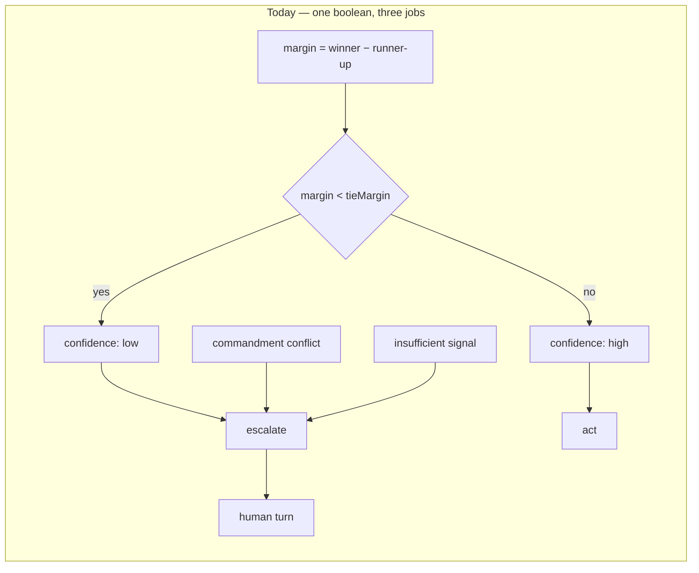
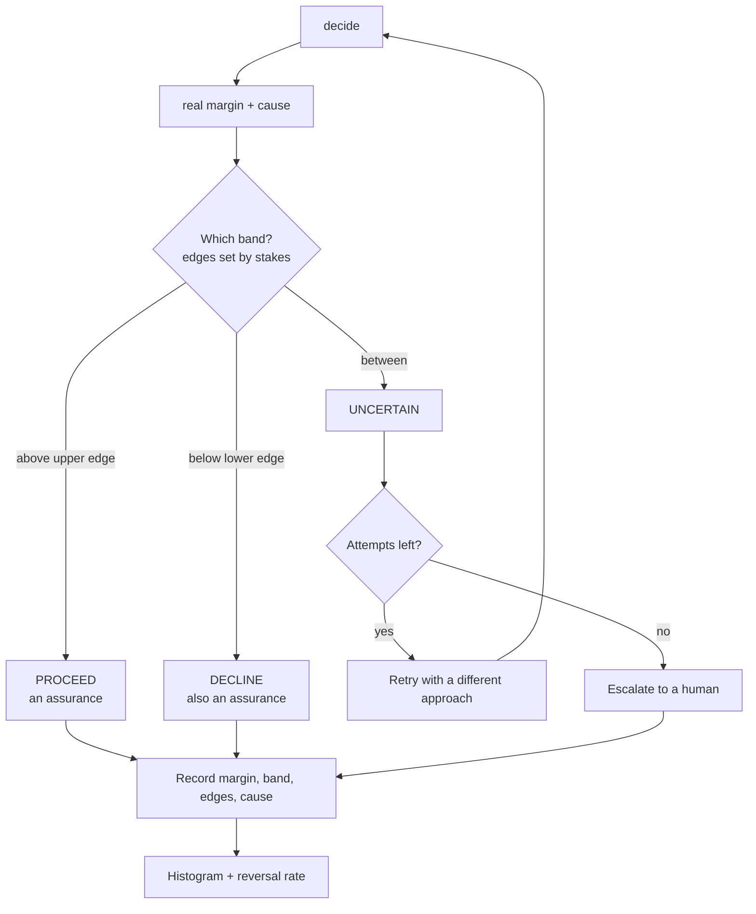

# Three-band decision verdict — making uncertainty the thing we tune

**Umbrella item:** `BI-2107B5D2`
**Epic:** `EP-DECISION-TIER-REBALANCE`
**Date:** 2026-08-21 · **Origin:** operator direction

A gate answers a question. Today it answers with a boolean — high confidence or low —
and that boolean is doing three jobs it was never shaped for. This spec replaces it with
three bands, gives the middle band an exit that is not always a human, and makes the
width of that middle band the thing the system is tuned against.

The operator framing this starts from: **a confident yes and a confident no are both
assurances.** They tell you how to proceed. The maybe is the only place uncertainty
actually lives, and it is where retry, escalation, and tuning belong.

## Where we are

`apps/web/lib/decision/option-scoring.ts:264` declares `confidence: "high" | "low"`.
Line 385 derives it: `margin < tieMargin ? "low" : "high"`, with
`DEFAULT_TIE_MARGIN = 0.2`, forced to `"low"` when coverage or sensitivity checks fail.
`kernel-consult-ledger.ts` then maps the result onto ledger outcomes.

Four problems follow, and they are separable.

**1. The boolean is on the wrong axis.** `margin` is the separation between the winning
option and the runner-up. That is *how clearly A beat B*, which is not *how sure we are
about proceeding*. Two options that are both bad can be well separated; two that are both
excellent can be inseparable. The current type reads the first as confidence and the
second as doubt.

**2. A confident no cannot be said.** The engine picks a winner among the options it was
given. Declining is not an outcome it can return — a "no" appears only as the *absence*
of a recommendation, which is byte-for-byte the same as "this could not be weighed". The
most decisive answer a gate can give is the one the type system cannot express.

**3. `escalate` is three states wearing one label.** From `mapConsultOutcome`:

| Cause | Today | What it actually is |
| --- | --- | --- |
| commandment conflict | `escalate`, 0.3 | a **decline** with a named reason |
| low margin | `escalate`, 0.5 | genuine **uncertainty** |
| insufficient signal | `escalate`, 0 | a **corpus gap** — retrying identically cannot fix it |
| no applicable principles | `defer`, 0 | a **coverage gap** |

Three causes that need three different next steps are routed to one.

**4. The real margin is thrown away.** Those numbers — 0.9, 0.5, 0.3, 0 — are synthetic
constants stamped at the ledger boundary. The computed margin does not survive. Every row
in the decision ledger carries one of four fixed values, so **the distribution needed to
tune the bands does not exist**. The tuning loop this spec exists to enable is, today,
uninstrumentable.

## Where we are going

### 1. Three bands, two of them assurances

The verdict becomes `proceed | uncertain | decline`. Both outer bands are decisive and
carry their own next step; neither costs a human turn. A decline names *why* it declined —
the conflicting commandment, the failing corpus, the crossed boundary — because a decline
without a reason is indistinguishable from a failure to decide, which is the defect we are
removing.

### 2. Band edges come from stakes

The bands are not fixed. A high-consequence decision **widens** the uncertain band: it
demands more separation before it will call anything an assurance. A routine decision
narrows it. `tieMargin` is already a per-call config knob on the scoring path, so the
plumbing exists; what is missing is the stakes-to-edges policy and the recording of the
edges actually used. Both edges must be persisted with the decision, or a later histogram
cannot tell a moved bar from a changed result.

### 3. The uncertain band gets a retry edge

Today the only way out of the middle is a human, so every uncertainty costs an
interruption — and a high-stakes hold can have no release path at all. The middle band
gains a bounded retry: attempt the decision again with a *different approach* (more
evidence, a different corpus, a reframed option set), up to an attempt limit, before
escalating. Two rules keep this honest:

- **Retrying identically is not a retry.** A corpus gap re-run against the same empty
  corpus returns the same nothing. The retry must change an input, and what changed is
  recorded.
- **The attempt count is bounded and visible.** An unbounded retry loop is a hang wearing
  the costume of diligence.

### 4. Record what actually happened

Every decision persists: the real margin, the band it landed in, the effective band edges,
the cause when not `proceed`, and — on a retry — what input changed. This is the smallest
set that makes the tuning loop possible.

## The tuning discipline

The goal is that a tuned system almost always returns an assurance. The way to get there
is to improve corpora and vectors so decisions **separate** — not to narrow the band until
the middle stops firing.

> A band that never fires is trivially achievable and proves nothing. Narrowing the
> uncertain band without improving separation optimizes for the *appearance* of certainty.

So the instrument is two numbers, not one:

- **Margin histogram** — the distribution of real margins across a decision population.
  Tuning is working when mass moves *away from the middle*, toward both ends.
- **Reversal rate per band** — of the confident calls, how many were later overturned by a
  human, a re-verification, or an outcome. A band is well-tuned when it is narrow **and**
  its confident calls stay confident. A falling middle band with a rising reversal rate is
  a regression, not progress, and only this second number can tell you so.

Together they give the shape the operator asked for: tune the corpus and the vectors,
watch the middle empty out, and trust the assurances because their reversal rate says you
can.

## Scope

**In.** The verdict type and derivation; the outcome-cause split; stakes-driven band
edges; the bounded retry edge; margin/band/edges/cause persistence; the histogram and
reversal-rate instrumentation.

**Out.** Changing dimension weights or corpus content — that is the tuning this work
enables, not this work. Also out: the WWWD relevance-normalisation defect
(`BI-F5F2869D`), which is adjacent and must not be duplicated here.

## Substrate to extend, not rebuild

- `apps/web/lib/decision/option-scoring.ts` — the `confidence` type, `DEFAULT_TIE_MARGIN`,
  the coverage and sensitivity forcing.
- `apps/web/lib/decision/kernel-consult-ledger.ts` — `mapConsultOutcome`, where the causes
  are collapsed and the constants are stamped.
- `apps/web/lib/mcp/packs/profession-decision-pack.ts` — WSID stakes tiers already require
  more confidence at higher consequence; that is the stakes signal to drive band edges from.
- `apps/web/lib/work-management/autonomy-envelope.ts` — the decision modes a verdict feeds.

## Acceptance

1. A decline is distinguishable from an uncertainty and from a corpus gap — in the type,
   in the ledger, and in what happens next.
2. A decline names its cause.
3. Band edges vary with stakes, and the effective edges are recorded with the decision.
4. An uncertain verdict retries with a changed input under a bounded attempt count before
   escalating; what changed is recorded; an unchanged retry is refused.
5. Real margins are persisted, so a histogram over a real decision population needs no
   recomputation.
6. Reversal rate is measurable per band, so narrowing a band cannot masquerade as
   improvement.

## Decomposition

1. **Record the truth first.** Persist real margin, band, edges, and cause. Nothing else
   can be evaluated until the data exists.
2. **Split the causes.** Decline / uncertain / corpus-gap / coverage-gap as distinct
   outcomes, each with its next step.
3. **Three-band verdict type** replacing the boolean, with the outer bands as assurances.
4. **Stakes-driven band edges**, sourced from the existing consequence tiers.
5. **Bounded retry edge** out of the uncertain band, with changed-input enforcement.
6. **Instrumentation** — margin histogram and per-band reversal rate.

Slice 1 before everything: the current ledger cannot answer whether any of the rest
helped.

## Related

- [Work shapes and the decision gate](../../architecture/work-shapes-and-the-decision-gate.md) — where this gate sits inside a work shape
- [A Governance Gate on Consequential Tool Use](2026-08-13-wwwd-constitutional-alignment-gate.md) — the gate this verdict is consumed by
