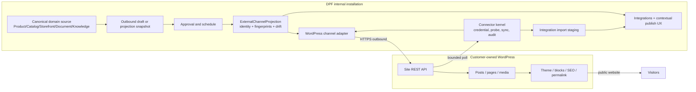
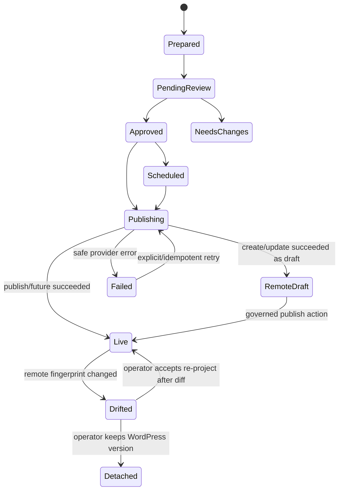

# WordPress channel projection — DPF as the governed operating layer behind an existing website

| Field | Value |
| --- | --- |
| Date | 2026-08-21 |
| Status | Proposed for implementation |
| Epic | `EP-31C5A6C8` — External Website Channels and CMS Interoperability |
| Parent backlog item | `BI-F50B1E46` |
| Workroom | `WC-53A7FA07` |
| Kernel decision | `DI-BC2255C06EC5` / contribution ledger `DI-BC2255C06EC5` |
| Decision | Build a provider-neutral DPF channel-projection boundary, with WordPress as the first provider. Do not build or bundle a general-purpose public CMS. |

## 1. Executive decision

DPF should integrate with WordPress, not become WordPress.

The durable product claim is:

> DPF is the governed business and content operating layer behind the website. It can run a native archetype storefront or publish approved content and structured business facts to an existing WordPress site.

The claim is intentionally narrower than “DPF replaces WordPress.” DPF does not presently own, and does not need to own for this outcome, a public hosting plane, CDN, domain and TLS operations, theme ecosystem, arbitrary block-layout editor, plugin runtime, permalink/SEO implementation, or the ongoing patching burden of a public PHP application. Those remain external channel responsibilities.

DPF does already own the higher-value internal responsibilities: typed business facts, products and catalog, media, documents and revisions, content tasks, AI-assisted drafting, approval, scheduling, audit, credentials, connectors, and transactional fulfillment. The proposed capability joins those assets into an explicit channel-projection contract.

### 1.1 What ships

1. A WordPress connector registered through the unified connector kernel for discovery, credentials, health, bounded incremental reads, and audit.
2. A WordPress outbound-channel adapter for approved posts, pages, and media.
3. A generic external-channel projection binding that gives every local source one stable remote identity and stores fingerprints needed for idempotency and drift detection.
4. Explicit per-resource authority rules. DPF business facts remain authoritative; WordPress presentation remains authoritative.
5. A setup and operations experience in the existing Integrations route family, with contextual publish actions in Marketing and Storefront rather than another dashboard or global-navigation item.
6. Correct absorption-posture matching for providers that span multiple integration categories.

### 1.2 What does not ship

- a WordPress container, PHP runtime, MySQL database, public reverse proxy, public DPF URL, CDN, DNS, certificate, or theme host;
- a clone of Gutenberg, themes, plugins, widgets, menus, or WordPress administration;
- silent two-way synchronization;
- import of arbitrary plugin state into DPF operational models;
- a universal `ContentEntry` model that competes with DPF domain authorities;
- a required WordPress plugin in the first release.

## 2. Why this matters

WordPress is not a niche connector. W3Techs reported on 2026-08-22 that WordPress was used by **40.7% of all websites** and held **58.9% of the known CMS market**. That prevalence makes an existing WordPress site a predictable adoption boundary for internal DPF installations, even when most DPF business models do not immediately need a new public URL or CDN.

The integration addresses three distinct customer situations without forcing one infrastructure model:

| Situation | DPF posture |
| --- | --- |
| The business has no site and needs a simple transaction surface | Use the native archetype Storefront/Portal. |
| The business has a WordPress site it wants to keep | Connect it and project approved DPF content/facts into it. |
| The business needs a highly designed, plugin-heavy, SEO-operated public estate | Keep WordPress and its hosting/agency operating model; let DPF own internal facts, workflow, approval, and evidence. |

This is both a retention feature and an adoption feature. It lowers migration pressure while creating a path for DPF to absorb the internal work that businesses often spread across WordPress plugins: drafting, approvals, scheduling, business catalogs, inquiries, bookings, orders, donations, and operational follow-through.

## 3. How WordPress works at the boundary

WordPress is a distributed application: each site exposes its own REST surface. Core resources include posts, pages, revisions, taxonomies, users, media, templates, and settings. Posts/pages carry status (`draft`, `pending`, `future`, `publish`, `private`), content, excerpt, author, featured media, taxonomies, slug, timestamps, and the public link. Collection reads support pagination and modification filters such as `modified_after` and `orderby=modified`.

WordPress’s extensibility is runtime-oriented. Themes determine presentation; plugins extend behavior; actions and filters allow code to run at core/plugin/theme hook points. That creates extraordinary reach but also means two WordPress sites can expose materially different post types, metadata, permissions, and plugin behavior.

The first integration therefore targets the stable core REST contract and discovers site-specific capabilities before offering them. It must never infer that a plugin, custom post type, custom field, SEO extension, or block is writable merely because a WordPress site is reachable.

For self-hosted WordPress, the primary credential is a dedicated WordPress user plus an Application Password over HTTPS. DPF stores the username and application password through `IntegrationCredential`; it does not ask for the operator’s normal password. WordPress.com’s centralized OAuth/API shape is a separate provider mode and is not smuggled into the self-hosted connector.

## 4. Research and benchmarking

The comparison reads each product’s content and publication model, not only feature lists.

### 4.1 Open-source leaders

| Product | Data and extension model | Transfer to DPF | Boundary DPF should not copy |
| --- | --- | --- | --- |
| [WordPress REST API](https://developer.wordpress.org/rest-api/) | Posts/pages/media/taxonomies are addressable JSON resources; each site owns its API and authorization. Plugins/themes extend core through actions and filters. | Site discovery, stable external IDs/URLs, modification cursors, media-before-post publication, capability probing, adapter isolation. | PHP/plugin runtime, theme/block editor, public hosting operations, arbitrary plugin semantics. |
| [Drupal JSON:API](https://www.drupal.org/docs/core-modules-and-themes/core-modules/jsonapi-module/api-overview) | Entity types and bundles become distinct JSON:API resource types with UUID identity, relationships, pagination, permissions, and CRUD. | Treat external type/schema discovery as evidence and map only explicitly supported resource types. Keep relationships and remote type identity in projection metadata. | Recreating a configurable entity/bundle CMS beside DPF’s typed business domains. |
| [Ghost Admin API](https://docs.ghost.org/admin-api) | A focused publication model around posts/pages, tags, authors, newsletters, members, images, themes, and webhooks; stable API version headers and integration JWTs. | Narrow channel adapters are easier to govern than a universal remote-object adapter; declare version/capabilities and isolate provider serialization. | Expanding WordPress slice one into membership, newsletter, theme, or site-administration parity. |
| [Strapi 5 Document Service](https://github.com/strapi/documentation/blob/main/docusaurus/docs/cms/api/document-service.md) | Stable `documentId` groups draft/published/localized variations; content types generate APIs; backend Document Service is more privileged than sanitized public APIs. | Separate stable content identity from physical versions, and validate/sanitize at the DPF application boundary. | A second generic content-type builder and document database inside DPF. |

### 4.2 Commercial/composable leaders

| Product | Data and workflow model | Transfer to DPF | Boundary DPF should not copy |
| --- | --- | --- | --- |
| [Contentful data model](https://www.contentful.com/developers/docs/concepts/data-model/) | Spaces contain environments; content types define entries and linked assets; locales, roles, releases, preview, scheduled actions, and webhooks surround publication. | Preview before publish, environment/site identity, linked media, release/approval thinking, webhook filtering, explicit locales. | A new author-configurable content schema when DPF already has typed domain models and managed documents. |
| [Sanity documents](https://www.sanity.io/docs/content-lake/documents) | JSON documents have stable `_id`, `_type`, `_rev`, timestamps, references, and draft/version namespaces. The data store itself does not enforce Studio schema validation on API writes. | Store remote revision/fingerprint and validate every outbound projection before the provider call; do not trust remote acceptance as correctness. | A schemaless canonical content lake that weakens DPF’s typed invariants. |
| [Webflow CMS API](https://developers.webflow.com/data/v2.0.0/reference/cms) | Collections define fields; items have staged/live states; API supports granular and bulk publish/unpublish plus webhooks. | Separate “prepare remote draft” from “make public,” support preview/dry-run, and model partial bulk failure explicitly. | Owning the visual designer, site publishing plane, and CDN as part of the DPF internal platform. |

### 4.3 Benchmark conclusion

All seven systems reinforce the same architectural separation:

- stable content identity is distinct from a specific version or publication event;
- content shape is validated before publication;
- media/assets have their own lifecycle;
- draft/preview and publish are separate transitions;
- remote APIs require pagination, versioning, permissions, rate/error handling, and explicit external identity;
- the public experience and the canonical business system do not need to be the same system.

DPF has five of those six capabilities already. The missing piece is a provider-neutral projection identity/drift contract and the WordPress implementation behind it.

## 5. Existing DPF substrate

| Need | Existing authority | Design disposition |
| --- | --- | --- |
| Connection definition, capabilities, auth kind, callback policy, operations, health, sync, resource authority | `apps/web/lib/integrations/kernel/definition.ts` and `docs/architecture/unified-connector-kernel.md` | Extend; register `wordpress-self-hosted`. |
| Credential encryption and audit | `IntegrationCredential`, credential crypto, connector audit | Reuse; one encrypted credential, no provider-specific secret table. |
| Read/import staging | `IntegrationImportBatch`, `IntegrationImportStagedRecord` | Reuse for discovered WordPress inventory and optional operator-reviewed imports. |
| Draft, approval, schedule, external publication receipt | `OutboundDraft`, `OutboundApprovalDecision`, `ScheduledOutboundAction`, `OutboundPublication`, channel adapter contracts | Reuse for editorial publication. Refactor the generic adapter boundary instead of adding WordPress-only workflow. |
| Managed long-form internal artifacts | `Document`, `DocumentVersion`, `KnowledgeArticle`, revisions | Reuse only when the source is actually a managed document/knowledge article. Do not convert all business facts into documents. |
| Products/catalog/storefront | `Product`, `Offering`, `CatalogItem`, `StorefrontConfig`, `StorefrontSection`, `StorefrontItem` | Owning domain records remain canonical; Storefront and WordPress are channel projections. |
| Media | content-addressed media storage and asset metadata | Reuse source asset; create provider-specific media projection/binding. |
| Incumbent replacement posture | `AbsorptionPosture`, `IncumbentCoverageAssessment` | Extend and correct provider/category matching before adding multi-capability WordPress posture rows. |
| Integration UI | `/platform/tools/integrations` and provider detail pages/connect panels | Reuse route family and shared form/report primitives. No new global-nav destination. |
| Generic source-to-remote identity and drift | No persistent model; `OutboundPublication` is event/receipt oriented and `IntegrationImportStagedRecord` is batch scoped | Add one generic `ExternalChannelProjection` model. |

### 5.1 Confirmed architecture gap: provider-only absorption lookup

`AbsorptionPosture` is unique on `(providerName, integrationCategory)`, correctly allowing one provider to have multiple capability postures. Both stage-one and stage-two incumbent assessment currently call `findFirst` by case-insensitive `providerName` alone. For a provider such as WordPress—CMS, publishing channel, forms, commerce, membership, and plugin host—that lookup can select an arbitrary category and therefore an arbitrary verdict.

The defect must be corrected before WordPress is seeded. Assessment identity must resolve in this order:

1. normalized `catalogIdentityId`, when available;
2. normalized provider key plus explicit integration category/capability;
3. provider name only when exactly one authored posture exists;
4. otherwise an evidenced `gap/ambiguous` proposal requiring operator selection—not `findFirst`.

## 6. Requirements

| ID | Requirement |
| --- | --- |
| R1 | DPF must connect to an operator-supplied HTTPS WordPress site without requiring a public inbound DPF URL. |
| R2 | Every external write must originate from an approved/scheduled governed action and produce an audit/tool-execution receipt. |
| R3 | One local source, target connection, resource kind, and locale must resolve to at most one current projection. Known-outcome replays update or return the same result. An ambiguous remote outcome is quarantined for reconciliation and is never blindly retried, because WordPress core offers no universal create idempotency key. |
| R4 | DPF must preview the outbound title/body/excerpt/status/slug/taxonomies/media and identify unsupported fields before the write. |
| R5 | A remote modification after the last DPF publication must become visible drift. DPF must never silently overwrite it. |
| R6 | Authority must be explicit per resource/field family; no global “two-way sync” toggle. |
| R7 | Site discovery and read sync must be bounded, paginated, resumable, idempotent, and incremental. |
| R8 | User-supplied site URLs must be protected against SSRF, DNS rebinding, redirect-to-private-network, credential forwarding across origins, and downgrade from HTTPS. |
| R9 | Imported/rendered provider content and error text must be sanitized and size bounded. Raw secrets and full provider payloads must not enter logs or UI. |
| R10 | Disconnect must stop sync/publication immediately and explain how the operator revokes the WordPress Application Password. It does not delete remote content. |
| R11 | WordPress-specific code must remain behind connector/channel interfaces. A second website provider must not require another approval workflow, credential store, projection identity model, or UX dialect. |
| R12 | Every slice reserves approximately 20% for refactoring/convergence and associated invariant tests. |
| R13 | The UX must meet DPF route budgets, form primitives, theme tokens, 44px mobile targets, honest empty/failure/permission states, and measured UX-fit evidence. |
| R14 | The design/current-state EA mirror must name requirements, interfaces, allocations, authority, and verification evidence; parity drift is not left as prose-only future state. |

## 7. Options and kernel decision

Four architecturally distinct options were scored through the DPF kernel (`DI-BC2255C06EC5`):

| Option | Composite score | Disposition |
| --- | ---: | --- |
| External-only: document that WordPress stays separate | 0.529 | Too little adoption value; leaves DPF unable to govern publication. |
| WordPress-canonical connector: treat WordPress as content authority | 3.401 | Useful for imports but weakens DPF source truth and creates two-way conflict. |
| **DPF-canonical channel projection** | **5.108** | **Selected.** Highest score, high confidence, margin 1.706, autonomy eligible, no commandment conflict. |
| Full native CMS inside DPF | 1.363 | Duplicates a mature ecosystem and imports public-hosting/plugin operational burden. |

## 8. Target architecture



### 8.1 System boundary

The DPF installation only needs outbound HTTPS access to the WordPress site. WordPress is already public (or network-reachable from DPF) and serves visitors itself. This design does not open DPF to the public internet.

Callbacks are `none` in slice one. Polling provides deterministic portability across self-hosted sites. A later thin plugin may add signed webhooks and richer fields, but that is an optimization and capability extension—not a prerequisite.

### 8.2 Canonical source mapping

| User intent | Canonical DPF source | Projection path |
| --- | --- | --- |
| Publish an article/news item | Approved `OutboundDraft`; source may reference a `KnowledgeArticle` or `DocumentVersion` | WordPress post draft/future/publish |
| Publish a stable information page | Approved projection snapshot sourced from a managed document/knowledge record | WordPress page |
| Publish product/service/donation/adoption facts | `Product`/`Offering`/`CatalogItem` plus Storefront projection | Rendered page/post fragment or supported custom type, only after preview |
| Publish image/file | Content-addressed DPF media asset and metadata | WordPress media item, then referenced by post/page |
| Learn what is already on the site | WordPress REST response | Read-only `IntegrationImportStagedRecord`; no automatic operational mutation |

There is no single canonical CMS row. Canonicality follows the owning DPF domain. `OutboundDraft` owns the reviewed publication payload; it does not become the product/catalog authority. The projection snapshot freezes exactly what was approved even if the source changes before execution.

### 8.3 External projection binding

One new generic model is justified:

```text
ExternalChannelProjection
  projectionId             stable semantic id
  connectorKey             wordpress-self-hosted (future providers reuse model)
  connectionId             stable IntegrationCredential.integrationId target
  credentialId?            credential row used for the last operation/audit
  sourceType / sourceRef    governed canonical DPF object kind and identity
  sourceVersion             immutable version/snapshot identity
  resourceKind              post | page | media
  locale                    default und, explicit when projected
  externalRef?              absent while reserved/ambiguous before reconciliation
  externalUrl?
  localFingerprint          hash of approved serialized payload
  remoteFingerprint?        hash of normalized last-read remote payload
  remoteModifiedAt?
  state                     reserved | current | ambiguous | drifted | detached
  lifecycle / lifecycleAt   canonical active/retired record lifecycle
  projectedAt?
  observedAt?
  metadata                  bounded provider metadata; no secrets/full payload
  createdAt / updatedAt

  unique(connectorKey, connectionId, sourceType, sourceRef, resourceKind, locale)
  unique(connectorKey, connectionId, resourceKind, externalRef)
```

`connectionId` is the unique `IntegrationCredential.integrationId`, which the connector kernel already treats as the connection/single-flight identity. Credential rotation updates secret custody without changing the projection target. `credentialId` remains optional audit provenance, matching the existing `OutboundPublication` pointer.

`OutboundPublication` remains the immutable publication receipt and metrics anchor. The projection binding is the current source-to-remote identity and drift read model. Before a non-idempotent create, DPF durably reserves the projection and operation identity. A successful response fills the remote identity and appends the publication/tool/audit receipt. If the call has a known failure, the reservation can safely retry under policy. If the outcome is ambiguous—timeout/connection loss after bytes were sent, process loss before the remote ID was persisted—the projection becomes `ambiguous`, scheduled retries stop, and reconciliation searches bounded candidate evidence (resource type, intended slug/title/time and, when a later plugin supports it, a DPF projection key). An authorized operator attaches the matching remote item or confirms that no item exists before retry. WordPress core cannot guarantee automatic exactly-once create, so the design refuses to fabricate that guarantee.

The implementation BI must run the data-architecture-steward workflow, add a data-impact manifest, migrations, indexes, retention/classification, ERD/EA mirror updates, and schema parity evidence.

### 8.4 Authority matrix

| Resource/field | Authority | Conflict behavior |
| --- | --- | --- |
| Product, offering, catalog identity, price, availability, donation/adoption/service operational facts | DPF | External changes are drift; operator may re-project or deliberately detach. Never import into operational truth automatically. |
| Approved publication body/title/excerpt for a DPF-managed item | DPF-approved snapshot | If WordPress changed after last projection, pause update and show diff/choice. |
| WordPress theme, template, block layout outside the managed content region | WordPress | DPF does not read as canonical or overwrite. |
| Slug/permalink | Shared by explicit policy | Default: WordPress generates first slug and DPF records it. Later DPF slug changes require preview and drift check. |
| Categories/tags | Shared mapping | Map by stable WordPress term ID after initial resolution; create only with explicit permission. Name collisions require selection. |
| Featured media | DPF source asset; WordPress rendition identity | Re-upload only when asset fingerprint changes; preserve remote attachment ID. |
| Comments, plugin data, SEO-plugin metadata, forms, memberships, commerce | WordPress/provider-led in slice one | Discover/report unsupported; no mutation. Provider-specific capability can be added later behind its own contract. |
| Publication status | DPF workflow requests transition; WordPress reports realized state | DPF never claims live until a successful provider response and follow-up observation/URL. |

## 9. Connector and publication contracts

### 9.1 Connector definition

The registered connector key is `wordpress-self-hosted`, not the ambiguous `wordpress`. This distinguishes the per-site REST/Application Password contract from WordPress.com OAuth.

Initial capabilities:

- `website.content.discover`
- `website.content.read`
- `website.content.publish`
- `website.media.publish`
- `website.content.observe-drift`

Auth is the existing `api-key` kernel kind with a typed credential adapter containing `siteUrl`, `username`, and `applicationPassword`. This is a semantic adapter reuse; the user-facing label is “WordPress Application Password,” never “API key.” Callback kind is `none`. Sync is incremental with a compound cursor `(modified_gmt, id)` rather than a timestamp alone, preventing equal-timestamp loss.

The connector definition declares the coarse resource-authority defaults already supported by the kernel:

- `wordpress.managed-content` -> `platform` (only for content carrying a DPF projection binding);
- `wordpress.presentation` -> `source` (theme, template, blocks outside the managed payload, SEO/permalink realization, plugin behavior);
- `wordpress.discovery` -> `source` (unmanaged posts/pages/media/types are evidence, not DPF truth);
- `wordpress.taxonomy-slug` -> `shared` (resolved through explicit mapping/policy and drift checks).

These are data-authority defaults, not human action grants. Existing authority/tool-execution controls still decide who may connect, approve, schedule, or publish. The connection’s draft-versus-live ceiling is a typed connector policy audited through the connector lifecycle; it must not create a second generic authority table. If implementation evidence shows the current connection record cannot persist/query that policy honestly, phase 2 must re-run substrate and data-steward review before extending the schema.

Operations:

| Operation | Retry | Notes |
| --- | --- | --- |
| `wordpress.probe` | bounded | Discover `/wp-json`, site/type endpoints, authenticated user capabilities, namespace/version hints. No content write. |
| `wordpress.read-changes` | idempotent | `modified_after`, `orderby=modified`, ascending pages; checkpoint after durable staging. Overlap window plus fingerprint dedupe handles clock/order edges. |
| `wordpress.upload-media` | idempotency guarded | Check binding/fingerprint first; reserve before create. Upload bytes with bounded size/MIME; update alt/caption. Ambiguous create stops for reconciliation. |
| `wordpress.upsert-post` / `upsert-page` | idempotency guarded | Existing binding -> update; absent binding -> reserve then create remote draft and fill binding. Ambiguous create stops for reconciliation before any retry. |
| `wordpress.observe-projection` | idempotent | Read remote item, normalize, fingerprint, update observed/drift state. |

### 9.2 Publication state machine



An approved item may target `draft`, `future`, or `publish`. The default first-run policy is **create as WordPress draft**, even when the DPF item is approved. Enabling direct public/scheduled transitions is an explicit connection policy with a `ConsequenceNotice` and authority check.

### 9.3 Failure semantics

- `401/403`: credential or WordPress role/capability problem; stop retries, mark attention required, explain dedicated-user/application-password recovery.
- `404` on discovery: REST disabled, rewritten, or unsupported; do not mislabel as bad credentials.
- `409/412` or fingerprint mismatch: drift/conflict; no automatic retry/overwrite.
- `429/5xx/network`: retry only idempotent read or idempotency-guarded operation with bounded exponential backoff and jitter.
- partial media/post failure: retain the successful media binding, do not publish the post, surface the resumable next action.
- timeout/process/local-persistence loss after a create may have reached WordPress: mark the reserved projection `ambiguous`, stop automation, reconcile bounded candidates, and never create blindly.
- unsupported custom fields/post types: report as unsupported capability; never drop silently.

## 10. Security and trust boundaries

The site URL is attacker-influenced network input and creates an SSRF boundary inside an internal platform.

Required controls:

1. Parse and canonicalize URL once; HTTPS only by default. HTTP requires an explicitly non-production development override and never carries credentials across a network boundary.
2. Resolve DNS and reject loopback, link-local, multicast, unspecified, carrier-grade NAT, private RFC1918, metadata-service, and other non-permitted ranges unless an authorized deployment policy explicitly allows a named internal WordPress endpoint.
3. Re-resolve and re-check on each new connection and redirect hop; pin the validated origin for the request. Reject redirects to a different origin or private address and never forward `Authorization` across origins.
4. Bound redirects, response bytes, request/response time, page count, item count, media size, MIME types, and decompression ratio.
5. Store credentials only through encrypted credential custody. Redact username/application password/auth headers from logs, errors, tool receipts, and metadata.
6. Use a dedicated least-privilege WordPress user. Probe actual capabilities; never infer them from role labels alone.
7. Treat WordPress HTML, rendered fields, URLs, filenames, taxonomy names, plugin metadata, and errors as untrusted. Sanitize before portal rendering; retain only bounded forensic metadata.
8. Require approval and user authority for all external mutation. Delete/unpublish is excluded from slice one because it is destructive and semantically different from updating a projection.
9. Disconnect disables scheduling/sync first, then retires the local binding/credential reference. Remote content remains; the operator is instructed to revoke the Application Password in WordPress.
10. Thin-plugin callbacks, if later built, require signature, timestamp, replay/idempotency receipt, narrow event filters, and public callback deployment posture. They are not enabled merely because a plugin is installed.

## 11. UX design and fit review

**UX fit review — WordPress channel projection**

- Decision: **fits-with-guardrails**
- Owning area: **Platform** for connection/health; Marketing and Storefront only receive contextual publish shortcuts.
- Route family: canonical `/platform/tools/integrations/wordpress`; no `/wordpress` product area, no new global nav, no WordPress dashboard.
- Primary persona: founder/operator retaining an existing company website and needing a safe, understandable way to publish DPF-managed work.
- Navigation layer touched: local provider page plus contextual action. The Integrations catalog gains one provider entry; global/section navigation does not change.
- Reuse/convergence: shared integration connection-page pattern, `FormField`/`TextField`/`SubmitButton`/`FormStatus`/`ConsequenceNotice`, report-kit `StatusBadge`, `Notice`, `DataTable`, and `EmptyState`. The implementation must extract/converge repeated provider connection-state presentation instead of creating another copy-pasted connect panel.
- Source truth: connector health/checkpoints/audit; `ExternalChannelProjection` for current remote identity/drift; `OutboundDraft`/approval/schedule/publication for governed writes; owning domain model for source facts.
- Empty/failure behavior: unconfigured shows one “Connect existing site” action and explains that DPF hosting is not required; permissions/REST/credential/drift failures each show one specific recovery; no wall of zero KPIs.
- AI boundary: setup and status cards never send prompts. AI may prepare a draft only through the existing draft/review flow; publish always has preview and explicit confirmation/authority.
- Evidence before merge: route/component tests, mutation/permission/failure tests, route-budget sweep and measured UX-fit manifest, theme/style drift scan, accessibility assertions, desktop and narrow browser tasks, and seeded fresh/connected/drifted fixtures.
- Captured in: this section and the implementation plan.

### 11.1 First-viewport design

The provider page answers four questions without scrolling:

1. **Is my site connected?** Site hostname, connection state, last successful check.
2. **What can DPF do here?** A short capability summary: read posts/pages, create drafts, publish approved posts/pages, upload media; unsupported/plugin capabilities disclosed separately.
3. **Who controls what?** One plain-language authority sentence: “DPF controls approved business content; WordPress controls how the public site looks.”
4. **What is the next action?** Connect, fix access, review drift, or open publication history—exactly one primary action.

Advanced discovery details, namespaces, post types, raw capability names, cursors, and audit identifiers live behind disclosure or a diagnostic table. No metric cards are needed.

### 11.2 Connection flow

Step one contains only:

- WordPress site URL;
- WordPress username;
- Application Password;
- “Check connection” primary action.

On success, step two previews discovered site name, canonical URL, authenticated capabilities, supported resource types, and the proposed authority policy. The operator chooses the initial publish policy: “Create WordPress drafts” (default) or “Allow approved items to go live.” The latter shows a consequence disclosure and requires explicit confirmation.

Credentials are never redisplayed. Editing a connection replaces the Application Password rather than revealing it.

### 11.3 Contextual publish flow

Marketing/Storefront surfaces offer “Publish to website” only when a compatible connection exists and the source is eligible. The action opens a preview containing target site, resource kind, title, excerpt, body summary, media, taxonomy mapping, slug/status, warnings, and remote drift state. The first action is “Create WordPress draft” unless the connection policy permits a public transition.

## 12. Scale and operability

The first release is designed for ordinary company websites, not WordPress.com fleet management or a crawler.

- Per connection, reads use `per_page` within provider limits, a bounded page budget, ascending modified order, and durable checkpoints.
- A small overlap window is re-read and deduplicated by `(externalId, modified_gmt, fingerprint)` to avoid timestamp-edge loss.
- Publication concurrency is bounded per credential/site; media upload and post write form one resumable saga, not one database transaction across the network.
- Health probes use their own cadence and circuit state; a failed site does not block unrelated connectors.
- Metrics include connected sites, successful/failed publications, p50/p95 latency, 401/403/429/5xx classes, duplicate-prevention hits, drift findings, oldest checkpoint age, and time-to-recovery. No content body or secret becomes a metric label.
- Retention keeps compact bindings/publication receipts/audit per DPF policy; raw discovery payloads are staged/bounded and expire. Remote content is not mirrored indefinitely by default.

## 13. SysML v2 and EA architecture note

### 13.1 Requirements and constraints

- Requirements: `R1`–`R14` in §6.
- Constraints: outbound-only initial network posture; no hosted CMS; HTTPS/SSRF protections; per-resource authority; approval before mutation; bounded incremental sync; one stable projection identity.

### 13.2 Interfaces and ports

| Interface | Producer port | Consumer port | Contract |
| --- | --- | --- | --- |
| `IWordPressRest` | WordPress site `/wp-json/wp/v2` | WordPress connector | Authenticated JSON resources, pagination headers, modified filters, media/post/page mutation. |
| `IConnectorExecution` | DPF connector kernel | WordPress adapter | credential session, probe, health, sync cursor/checkpoint, audit, safe errors. |
| `IOutboundChannel` | DPF outbound execution | WordPress channel adapter | validate, publish/upsert, external ID/URL, retryability, metadata. |
| `IProjectionAuthority` | owning DPF domain + projection service | preview/adapter/drift UI | source/version, approved fingerprint, authority mode, conflict disposition. |
| `IIntegrationOperationsView` | connector/projection read models | provider page/contextual actions | honest connection, capability, checkpoint, publication, drift, and recovery state. |

### 13.3 Allocation

- Credential validation/probe/sync -> unified connector kernel and `apps/web/lib/integrations/connectors/wordpress`.
- Publication serialization -> marketing channel adapter boundary, generalized as external outbound execution rather than WordPress route action code.
- Source-to-remote identity -> `ExternalChannelProjection` in integration/data architecture.
- Approval/scheduling/audit -> existing outbound execution and tool authority.
- UI -> existing Platform Integrations route family; contextual actions in Marketing/Storefront.
- Public rendering/SEO/theme/CDN -> customer WordPress deployment, explicitly outside DPF.

### 13.4 Verification cases

| Case | Verifies |
| --- | --- |
| `VC-WP-01` Connect valid dedicated user | R1, credential custody, capability discovery, no public DPF callback. |
| `VC-WP-02` Reject malicious/redirecting site URL | R8, no credential exfiltration. |
| `VC-WP-03` Replay/ambiguous outcome | R3, known replay keeps one remote post; ambiguous create is quarantined and cannot auto-retry until reconciled. |
| `VC-WP-04` Media succeeds, post fails, retry | resumable saga, no duplicate media. |
| `VC-WP-05` Remote editor changes a managed post | R5/R6, drift shown and overwrite paused. |
| `VC-WP-06` Equal modified timestamps across pages | R7, compound cursor/overlap prevents loss. |
| `VC-WP-07` Operator lacks publish permission | honest 403 recovery; no false live state. |
| `VC-WP-08` Disconnect with queued schedule | queue disabled, credential retired, remote content preserved. |
| `VC-WP-09` Provider page at fresh/error/mobile fixtures | R13, one next action, budgets/accessibility/theme fit. |
| `VC-WP-10` Multi-category provider posture | deterministic identity/category assessment; no arbitrary `findFirst`. |

### 13.5 EA/current-state catch-up

Each implementation slice updates the authoritative source plus its architecture mirror in the same PR. The first data slice adds the projection entity/relationships to the Prisma-derived data model and ERD. The connector slice adds the WordPress external interface and allocation. The UX slice adds the authorized surface projection and measured manifest. `check:architecture-parity`, data-impact, route/surface, and doc-index/links gates are named plan evidence, not deferred cleanup.

## 14. Refactoring budget

Approximately 20% of implementation effort is reserved inside—not after—each BI:

1. Replace provider-only absorption `findFirst` with a deterministic provider/category identity resolver and reuse it in both assessment stages.
2. Extract a generic external-channel projection service and binding rather than storing WordPress-only mapping JSON.
3. Converge connector and outbound-channel credential/health/error semantics so the WordPress adapter does not create a second integration kernel.
4. Extract shared connection-page state/presentation from repeated provider panels as the WordPress UI is added.
5. Strengthen closed-set, idempotency, authority, data-impact, and route-budget guards so the refactor removes future duplication pressure.

Refactoring is bounded by the slice’s touched seam. This is not permission for a repository-wide connector/UI rewrite.

## 15. Delivery slices

The independently shippable backlog is recorded in the companion implementation plan. The intended order is:

1. identity/absorption correctness and generic projection binding;
2. WordPress read-only connector and security boundary;
3. governed post/page/media draft publication;
4. drift reconciliation and structured domain/storefront projection;
5. operator UX and contextual actions;
6. EA/docs/claims/adoption evidence;
7. optional thin WordPress plugin only after core adoption evidence justifies it.

No slice is allowed to ship an insecure intermediate: SSRF/credential/sanitization controls ship with the connector, and approval/idempotency ship with the first external write.

## 16. Product claims

Allowed:

- “DPF can operate behind an existing WordPress site.”
- “DPF governs business facts, drafting, approvals, scheduling, publication receipts, and operational follow-through.”
- “DPF includes a native archetype storefront for common transactional needs.”
- “Public hosting, theme, SEO, CDN, and WordPress plugin operations remain with the customer’s website stack.”

Not allowed until separately delivered and evidenced:

- “DPF replaces WordPress.”
- “Full CMS parity.”
- “Two-way WordPress sync.”
- “Works with every WordPress plugin/theme/custom post type.”
- “DPF hosts your public website/CDN.”

## 17. Sources

- [WordPress usage and CMS market share, W3Techs, 2026-08-22](https://w3techs.com/technologies/comparison/cm-wordpress)
- [WordPress REST API Handbook](https://developer.wordpress.org/rest-api/)
- [WordPress posts endpoint](https://developer.wordpress.org/rest-api/reference/posts/)
- [WordPress media endpoint](https://developer.wordpress.org/rest-api/reference/media/)
- [WordPress Application Password endpoint](https://developer.wordpress.org/rest-api/reference/application-passwords/)
- [WordPress hooks](https://developer.wordpress.org/plugins/hooks/)
- [Drupal JSON:API](https://www.drupal.org/docs/core-modules-and-themes/core-modules/jsonapi-module)
- [Ghost Admin API](https://docs.ghost.org/admin-api)
- [Strapi 5 Document Service](https://github.com/strapi/documentation/blob/main/docusaurus/docs/cms/api/document-service.md)
- [Contentful data model](https://www.contentful.com/developers/docs/concepts/data-model/)
- [Contentful domain model](https://www.contentful.com/developers/docs/concepts/domain-model/)
- [Sanity documents](https://www.sanity.io/docs/content-lake/documents)
- [Sanity schema validation and Content Lake](https://www.sanity.io/docs/content-lake/schema-validation-and-the-content-lake)
- [Webflow CMS API](https://developers.webflow.com/data/v2.0.0/reference/cms)
- [Webflow CMS publishing](https://developers.webflow.com/data/docs/working-with-the-cms/publishing)

## 18. Architecture review disposition

**Decision: fits-with-guardrails.** The design extends canonical DPF contracts and adds only the missing persistent projection identity. It does not create a second workflow, credential store, approval ledger, business-content authority, or public runtime.

Findings folded into this revision:

1. **Resolved — connection identity cannot be a credential artifact.** Projection uniqueness now uses stable `IntegrationCredential.integrationId`; credential-row ID remains audit provenance. Secret rotation cannot fork remote identity.
2. **Resolved — WordPress core cannot provide universal exactly-once create.** The contract now reserves before create, distinguishes known from ambiguous outcomes, and quarantines ambiguity for reconciliation instead of blind retry.
3. **Resolved — data authority and action authority were conflated.** Kernel resource-authority defaults are explicit; human grants and the connection’s publish ceiling remain separate governed controls.
4. **Guardrail — one new model remains provisional until pickup re-verifies current main.** If an equivalent stable source/target binding lands first, `BI-93507D83` must extend/converge it and amend the plan rather than add `ExternalChannelProjection` in parallel.
5. **Guardrail — no thin WordPress plugin is pre-authorized by this design.** It earns separate work only from adoption evidence and a new public-callback/security review.
6. **Guardrail — no child may ship a weaker intermediate.** URL/network/secret/sanitization controls land with read connectivity; approval/reservation/ambiguity handling land with the first mutation.
