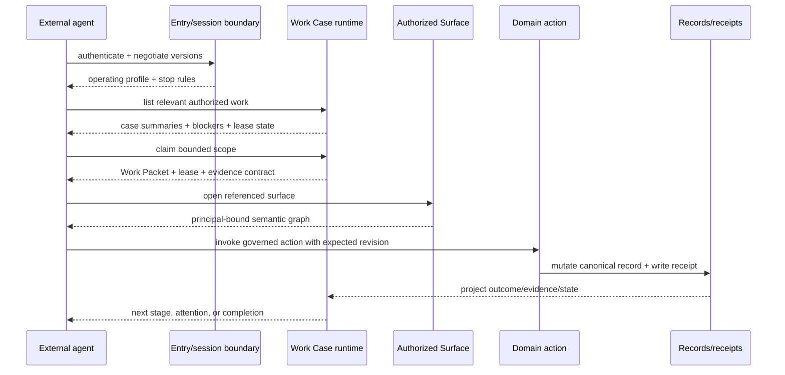
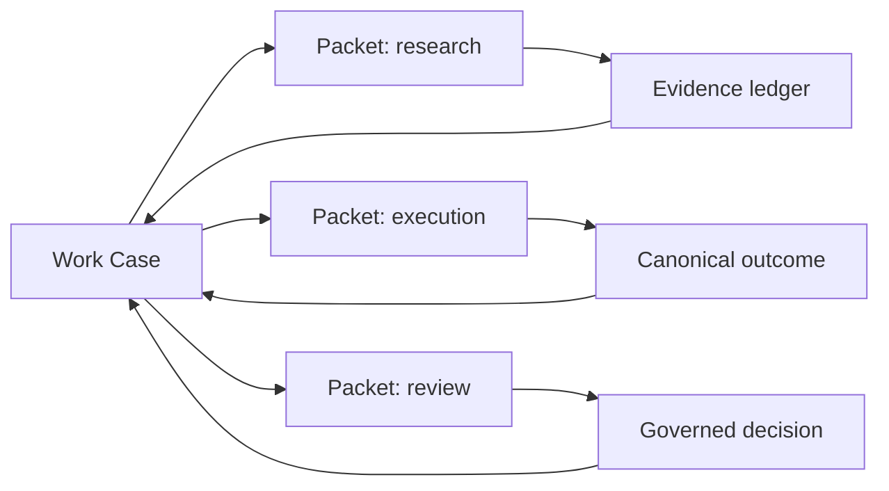

# External Agent Operating Contract Design

**Date:** 2026-08-22

**Status:** Proposed

**Backlog:** `BI-9549EE48` (umbrella); `BI-11D611B3` (source-free entry slice)

**Epic:** `EP-1FABA22D`

**Decision records:** `DI-A60C7D8F35B1`, `DI-C75C83499B57`

## 1. Executive decision

DPF will treat a source-free production installation as a complete agent host. An external AI agent does not need the application repository, contributor `AGENTS.md`, or a browser to operate a business. It does need a governed operating contract that tells it, for the current installation and principal, what the business is trying to accomplish, what work is available, what it may perceive, what it may do, when it must stop, and what evidence closes the work.

The canonical business-operation interaction is:

`dual-principal session → authorized operating profile → Work Case/Packet → Authorized Surface → governed action → canonical business record → receipt/evidence`

Platform development is an alternate, explicitly declared use shape:

`dual-principal session → authorized operating profile → BacklogItem → source-change Workroom → governed worktree/PR → review/gate evidence`

These are not separate agent platforms. They share identity, Workroom, WorkUnit, evidence, lease, and receipt substrate, but they start from different outcomes and resolve decisions in different scopes. Customer installations default to business operation. Development is selected only when `evolve-dpf` is a confirmed primary or secondary installation purpose, and that purpose still grants no source or tool authority.

The contract is a runtime projection over existing DPF authorities. It is not a new database, task bus, agent registry, prompt framework, or business record. MCP is the primary local protocol, A2A is the peer protocol, and a tiny generated install-local `AGENTS.md`/README is only a discovery pointer for clients that inspect files. Chat is an ingress and steering channel; it is never the system of record.

This shape supports a single assistant, several agents working concurrently, headless operating loops, same-organization multi-install work, managed service delivery, sovereign peers, archetype-specific operations, GTM work, and Hive contribution without changing the underlying authority model.

## 2. The claim DPF should make

DPF should not claim that an unconstrained bot can “run the business.” It can support a governed AI workforce that runs bounded business processes while accountable humans retain legal, fiduciary, employment, safety, and irreversible decision responsibility.

“AI-operated” is credible only when the platform can answer all of these questions from durable state:

1. What outcome is this work intended to produce?
2. Which organization, installation, human sponsor, and agent are accountable?
3. Which canonical records and policies govern it?
4. What authority applies to this action now?
5. Which agents are working on it, under what leases, and with what dependencies?
6. Which stage is the work in, why is it blocked, and who must respond?
7. What evidence proves the outcome and which receipt proves the governed transition?
8. What happens after a timeout, policy change, revocation, model failure, or installation outage?

If those answers exist only in a prompt, chat transcript, or agent memory, the scenario is a demonstration rather than a scalable operating model.

## 3. Product principles

1. **Source-free does not mean truth-free.** Source code governs platform evolution. Runtime business records govern business operation.
2. **One business model, many agent clients.** Codex, Claude, Grok-style bots, embedded coworkers, MCP clients, and A2A peers consume the same semantic contracts.
3. **External agents are delegated principals, not impersonators.** Every action records the human subject/sponsor and the acting agent.
4. **Work is explicit.** A task is carried by a WorkUnit and projected as a Work Case; it is not inferred from an open chat.
5. **Actions re-enter canonical domain boundaries.** No agent receives a bypass around policy, validation, audit, idempotency, or confirmation.
6. **Autonomy is a policy closure, not a model attribute.** The same capable model may be autonomous for one reversible action and observed-only for another.
7. **Concurrent agents coordinate through leases, dependencies, proposals, and receipts.** They do not coordinate through shared hidden memory.
8. **Archetypes supply operating meaning, not cloned process engines.** Industry vocabulary, value streams, evidence, and measures specialize the common formula.
9. **Federation preserves sovereignty.** A remote installation proposes or submits work; the owning installation authorizes and mutates its own records.
10. **Progress is legible to an operator.** The canonical UX shows outcome, state, owner, blockers, risk, evidence, and next action without exposing agent internals by default.
11. **Customer operation is the default external-agent posture.** Repository, worktree, PR, CI, and Build Studio concepts remain backstage unless the customer explicitly enters the platform-development shape.
12. **Decision scopes do not blur.** Business choices belong to WWWD, professional craft choices to WSID, and platform-development choices to WWMD. Mixed work decomposes into linked single-scope work.

## 4. Goals and non-goals

### Goals

- Give any supported agent a bounded connect-time orientation before its first business action.
- Make consumer, production, development, and managed installations explicit operating contexts.
- Compile a default and available engagement shape from primary/secondary installation purpose while keeping environment, source capability, and token authority independent.
- Expose business purpose, archetype, GTM perspective, work, surfaces, policy, and evidence through typed projections.
- Support one or many simultaneous agents without duplicate work or lost accountability.
- Reuse Work Cases, WorkUnits, work shapes, TaskRuns, Authorized Surface, federation, A2A, WWWD, and Hive.
- Provide a consistent human view of agent work and intervention needs.
- Fail closed when identity, authority, version, evidence, or canonical ownership is uncertain.
- Preserve an independently reviewable convergence/refactor stream of roughly 20% of delivery capacity.

### Non-goals

- Shipping the source repository or contributor doctrine to production installations.
- Declaring a general-purpose autonomous “CEO agent.”
- Letting a model choose its own authority, sponsor, consequence tier, or completion status.
- Treating MCP tool count as an operating interface.
- Adding an agent-to-agent chat mesh, shared memory database, shadow task store, or per-archetype workflow engine.
- Making Git the operational record for customers, cases, obligations, inventory, finance, or service delivery.
- Replacing human approval where law, fiduciary duty, safety, consent, or platform policy requires it.
- Normalizing vendor-specific bot concepts into canonical DPF persistence.

## 5. Verified substrate and gaps

| Concern | Existing authority | Reuse | Remaining gap |
|---|---|---|---|
| Installation role | `InstallationOperatingIntentV1`, profile snapshot | primary and secondary purpose, environment, topology hints | no agent-facing default/available engagement-shape projection |
| Delegated identity | Headless Employee session, MCP principal, `AuthorityBinding` | human subject plus acting agent | no single connect-time external-agent session handshake |
| Product semantics | Authorized Surface Contract and `surface_*` tools | render-neutral perception and governed actions | catalog is not the full business orientation contract |
| Work | Work Case, WorkUnit adapters, policy/receipt envelopes | durable state, ownership, transitions, evidence | external claim/lease and multi-agent collaboration profile incomplete |
| Durable execution | TaskRun and Durable Agentic Process architecture | journaled/resumable execution | not uniformly bound to Work Case collaboration and completion |
| External development visibility | `work-capsules/external-session-capture.ts` | idempotent provider/session capture into a Workroom | contributor sessions and business operating sessions need distinct entry, decision-scope, and UX policies over one WorkUnit projection |
| Business Workrooms | generalized `Workroom`, `decisionScope`, outcome anchors, activity/portfolio attribution, room shapes, WorkUnit adapters, and Work Case projections | one durable coordination substrate for WWWD/WSID business work and WWMD/WSID source work | external-agent discovery does not yet choose the correct posture; generic `create_workroom` still presents a backlog-management capability boundary, and the current capsule WorkUnit adapter does not project decision scope |
| Agent exchange | A2A Agent Card/tasks, coordination proposals | capability discovery, task lifecycle, proposals | no DPF operating-profile extension and work-packet compatibility contract |
| Cross-install trust | GAID/AIDoc, federation links, issuer/device/token boundaries | sovereignty and scoped trust | topology-specific entry rules need one projection |
| Business judgment | WWWD/org overlay and governed decision gates | organization-specific stances | agents need compact decision-scope references, not copied doctrine |
| Archetypes | operating standard, value streams, operating profiles | industry meaning over common substrate | work packages and first-value proofs remain uneven by archetype |
| GTM | `gtm_fit`, product/marketing workspaces and corpora | market and offer context | GTM intent is not consistently attached to executable work |
| Hive | contribution review, result intake/store, egress | governed learning exchange | external operating contract does not advertise participation policy |
| Operator UX | Workspace, Work/Case views, attention patterns, federation admin | existing navigation and detail surfaces | no unified agent connection/lease/activity projection |

No new Prisma model is justified by this design. The first implementation composes existing records and adds fields or tables only when a child BI proves a durable fact cannot be represented by the owning substrate.

## 6. Canonical model

### 6.1 `ExternalAgentOperatingProfile`

This is a short-lived, principal-bound projection generated on connection or refresh:

```ts
type ExternalAgentOperatingProfile = {
  contractVersion: string;
  contractDigest: string;
  installation: {
    instanceId: string;
    environmentClass: "production" | "development" | "test";
    primaryPurpose:
      | "operate-organization"
      | "evolve-dpf"
      | "deliver-managed-services"
      | "grow-channel"
      | "participate-community";
    secondaryPurposes: Array<
      | "operate-organization"
      | "evolve-dpf"
      | "deliver-managed-services"
      | "grow-channel"
      | "participate-community"
    >;
    topology: "local" | "same-org" | "managed-estate" | "sovereign-peer" | "hive";
  };
  interaction: {
    defaultShape: "business-operations" | "platform-development";
    availableShapes: Array<"business-operations" | "platform-development">;
    decisionRouting: {
      "business-operations": { primary: "wwwd"; craft: "wsid" };
      "platform-development": { primary: "wwmd"; craft: "wsid" };
    };
    developmentSource:
      | "host-governed-worktree"
      | "separate-governed-checkout"
      | "not-declared";
  };
  principal: {
    sessionId: string;
    delegatingUserId: string;
    actingAgentId: string;
    sponsorRef: string;
    tokenTier: "observer" | "employee" | "development" | "admin";
    authorityDigest: string;
    expiresAt: string;
  };
  organization: {
    organizationId: string;
    purposeSummary: string;
    archetypeRef?: string;
    operatingProfileRef?: string;
    decisionProfileRef?: string;
    locale: string;
    timezone: string;
  };
  entry: {
    workCatalogRef: string;
    surfaceCatalogRef: string;
    agentCardRef?: string;
    attentionRef: string;
  };
  policy: {
    defaultMode: "observed" | "supervised" | "autonomous";
    allowedConsequenceTiers: string[];
    confirmationRulesRef: string;
    stopConditions: string[];
    egressPolicyRef?: string;
  };
  compatibility: {
    protocols: Array<"mcp" | "a2a">;
    workPacketVersions: string[];
    surfaceContractVersions: string[];
  };
};
```

The profile contains references and safe summaries, not copied business records, secrets, full policy corpora, or every available tool. It changes when installation purpose, organization context, token tier, authority, or connection topology changes. The P0 design is authoritative for the final V1 field names and digest preimages.

The shape compiler applies these rules:

- `evolve-dpf` as primary purpose makes `platform-development` the default;
- every other current primary purpose makes `business-operations` the default;
- a secondary purpose adds the corresponding alternate shape;
- environment class changes caution, host profile changes source location, and token/grant authority changes available actions; none changes the declared purpose by inference;
- a source-free runtime can coordinate platform development, but source edits happen in a separate governed checkout;
- a Workroom carries one owning decision scope. Cross-scope work uses linked WorkUnits/Workrooms and explicit handoff evidence.

### 6.2 `ExternalAgentSession`

The session binds the operating profile to the existing dual-principal and token authority boundary. It has an expiry, authority digest, installation identity, supported contract versions, and optional federation-link/device identity. Refresh re-resolves authority; it never extends the previous session by assumption.

An external agent must have:

- an identified acting principal;
- a human or organizational sponsor accountable for delegation;
- an installation and organization scope;
- an explicit token tier and grants;
- a purpose-limited work or discovery context;
- a revocation path;
- a stable correlation ID across tool, case, task, and receipt events.

Anonymous discovery may expose only public protocol metadata and public Agent Cards. It cannot expose private work, surfaces, organization doctrine, or capabilities.

### 6.3 `WorkPacket`

The existing Work Case remains the durable company-facing record. A Work Packet is its portable, versioned subset for assignment, A2A exchange, or headless execution:

```ts
type WorkPacket = {
  packetVersion: string;
  packetId: string;
  caseRef: { sourceType: string; sourceId: string; caseId?: string };
  objective: string;
  stage: string;
  workShapeRef?: { key: string; version: string };
  actor: { sponsorRef: string; assigneeRef?: string };
  inputs: Array<{ ref: string; digest?: string }>;
  expectedOutputs: Array<{ kind: string; schemaRef?: string }>;
  policyEnvelopeRef: string;
  surfaceRefs: string[];
  dependencies: Array<{ caseRef: string; state: string }>;
  stopConditions: string[];
  evidenceRequirements: string[];
  lease?: { leaseId: string; holder: string; expiresAt: string; scope: string };
  provenance: { owningInstallationId: string; issuedAt: string; digest: string };
};
```

The packet never grants authority. On every read or action, the receiving runtime intersects the packet with current principal, row, field, token, link, risk, and mode policy. A stale or foreign packet is useful as a proposal or reference, not as authorization.

### 6.4 `AgentWorkLease`

Concurrent work needs a first-class coordination projection. The lease may reuse existing Workroom, WorkItem, TaskRun, or queue ownership state; the contract does not presume a new table.

A lease includes holder, scope, case, work stage, expiry, heartbeat, handoff status, and conflict policy. The scope can be whole-case, stage, action family, or resource set. A lease protects work from duplication; it does not create business authority.

Lease rules:

- one exclusive mutation lease per overlapping scope;
- multiple read/review/proposal leases may coexist;
- a reviewer cannot approve its own high-consequence output when policy requires separation;
- expiry returns the work to attention with preserved journal and evidence;
- a policy or authority change invalidates affected mutation leases;
- handoff carries state and evidence through canonical records, not prose alone.

## 7. Entry and discovery

### 7.1 Canonical served contract

MCP adds one small orientation entry point, exposed before broad progressive tool disclosure:

- `operating_profile_get` — return the current `ExternalAgentOperatingProfile`.
- `work_catalog_list` — list authorized, relevant Work Cases/Packets and continuation cursors.
- Existing `surface_list` begins semantic product discovery after work selection.

The server may expose the profile as an MCP resource as well as a tool result, but one compiler and schema own both. Tool descriptions carry only the instruction to fetch the profile before acting.

The A2A Agent Card advertises the supported profile/work-packet contract versions and a discovery endpoint. It does not publish private organization context or enumerate private work. Authenticated A2A tasks carry Work Packet references and immutable provenance.

### 7.2 Generated local pointer

Consumer installers generate a tiny `AGENTS.md` or README in the install directory for clients that scan local files. It contains only:

- that the directory is a runtime install, not a source repository;
- the local MCP configuration location;
- the command/resource to fetch the current operating profile;
- supported contract version and deployed digest;
- a stop rule: do not infer or mutate when the served contract is unavailable or incompatible;
- a link to operator recovery guidance.

It contains no contributor workflow, business doctrine, static tool catalog, secret, bearer token, customer data, or copied policy. The installer regenerates it atomically from the deployed image. A digest mismatch is visible and repairable; the served contract always wins.

### 7.3 Progressive disclosure

The initial model context stays small and follows the selected interaction shape. A business-purpose customer does not receive development doctrine merely because the client is Codex, Claude, or Grok.

For `business-operations`:

1. identity and installation summary;
2. business purpose, default WWWD scope, relevant WSID profession context, and stop rules;
3. authorized business Work Case/catalog summaries;
4. selected Work Packet;
5. selected Authorized Surface graph;
6. action schemas only when selected;
7. result, receipt, and next transition.

For `platform-development`:

1. identity, installation summary, and source-location rule;
2. WWMD platform scope, relevant WSID engineering context, and stop rules;
3. authorized backlog/source-change Workroom summary;
4. governed checkout/worktree, branch, review, and gate requirements only when the task enters that lifecycle;
5. result, review evidence, PR/merge state, and next transition.

An agent should never receive hundreds of unrelated tools or the complete organization corpus merely because it connected.

## 8. End-to-end interaction

### 8.1 Business operation



The runtime, not the model, decides whether an action is a read, proposal, reversible change, consequential change, irreversible action, or prohibited operation.

A business Workroom is not a development Workroom with different labels. Its outcome anchor points to a Work Case or canonical business record; repository, branch, worktree, PR, and source-scope claims are normally absent. WWWD owns the organization's business choice. WSID supplies the profession's method and quality bar. The room exists when work needs durable coordination, leases, evidence, handoff, review, or recovery; ordinary read-only conversation does not need a synthetic room.

`BI-D4C110BC` owns two concrete convergence fixes before business agents can rely on this path. First, business convening must enter through a domain/case authority facade or a context-aware collaboration capability; the implementation must not grant `manage_backlog` merely so an employee agent can coordinate business work. Second, the Workroom-to-WorkUnit adapter must carry the canonical `decisionScope`, accountable/contributor references, outcome summary, and receipt requirement instead of projecting every room as a coding capsule with null governance. Both changes extend the existing substrate and require no second room or task table.

### 8.2 Platform development

The development shape begins only after the declared purpose and task select it. Its Workroom is anchored to a BacklogItem or build/source outcome and may carry repository, branch, worktree, PR, and change-impact state. WWMD owns platform and architecture decisions; WSID supplies software, data, UX, security, and other craft judgment. If the work also requires a customer business decision, that decision remains a linked WWWD interaction rather than being absorbed into the development room.

On a source-free customer runtime, DPF remains the coordination and evidence plane while the source change occurs in a separate governed checkout. Installed Compose files, scripts, and release assets never become source by implication.

## 9. Use and topology interaction shapes

The use shape and the connection topology are orthogonal:

| Use shape | Default trigger | Primary work | Decision scopes | Primary operator surface |
|---|---|---|---|---|
| Business operations | any primary purpose except `evolve-dpf` | Work Case/Packet, canonical business record, outcome evidence | WWWD for business; WSID for craft | Workspace, My Queue, Inbox, Case detail |
| Platform development | primary `evolve-dpf`; explicit alternate when secondary | BacklogItem, source-change Workroom, governed checkout/worktree, review and gate evidence | WWMD for platform; WSID for craft | Build Studio/contributor lanes and source review surfaces |

Topology then changes how either use shape crosses an installation boundary:

| Shape | Entry | Canonical work owner | Allowed exchange | Key boundary |
|---|---|---|---|---|
| Same-install external employee | MCP session | local installation | Work Packet refs, surface actions | dual principal and local policy |
| Embedded coworker/headless loop | internal MCP/session | local installation | same contracts without network serialization | no privileged internal bypass |
| Same-org companion install | federation + A2A | installation owning the record | delegated task, proposal, evidence | environment and production mutation boundary |
| Managed estate | service-provider link | customer/manager according to contract | scoped packets and receipts | sponsor, entitlement, data residency, exit |
| Sovereign business peer | trusted federation link | each owning installation | proposal/task/artifact, never remote raw writes | local apply and dual approval |
| Channel/GTM network | channel federation profile | upstream/downstream owner | opportunity, enablement, support, evidence | commercial agreement and consent |
| Hive/community | contribution egress/intake | contributor then commons review | redacted contribution/result | curation, provenance, no customer leakage |

All business topology shapes use the same Work Packet and action semantics. Platform development uses the same Workroom/WorkUnit coordination formula but keeps source, review, and promotion evidence specific to development. Topology changes identity proof, visibility, policy intersection, transport, and ownership; it does not turn business operation into source development.

## 10. Archetype and GTM specialization

An archetype package specializes operating meaning over the common work formula. It may contribute:

- value streams and stage labels;
- canonical business subject and resource references;
- WorkUnit definitions and work-shape templates;
- outcome, evidence, quality, safety, and exception requirements;
- role/coworker allocation patterns;
- measures and first-value proofs;
- vocabulary and Authorized Surface entry points.

It may not clone Work Case state, authority, receipts, TaskRun lifecycle, A2A tasks, or federation trust.

GTM is expressed as work context, not a special bot. A GTM Work Packet can reference offer, audience, channel, lifecycle stage, positioning/decision evidence, commercial constraint, and success measure. Actions still write canonical product, marketing, sales, partner, or customer records through their owning domains. `gtm_fit` informs governed platform decisions; organization-specific commercial choices route through the organization's WWWD profile.

An archetype or GTM package is production-ready for agents only when it has at least one verified end-to-end value stream with canonical records, governed actions, exception handling, evidence, and an operator surface. Vocabulary-only overlays do not qualify.

## 11. Simultaneous agents and hive-mind behavior

DPF should enable collective work without pretending that several models form one trustworthy mind.

The supported collaboration roles are:

- **executor:** holds a bounded mutation lease and produces outputs/evidence;
- **researcher:** reads and attaches evidence, with no mutation authority by default;
- **reviewer:** evaluates a stable output or receipt and is independent where policy requires;
- **coordinator:** proposes allocation, dependencies, and sequencing but cannot widen authority;
- **observer:** monitors liveness, drift, or deadlines and raises attention;
- **specialist peer:** receives a portable sub-packet and returns an artifact or proposal.

Coordination occurs through canonical case state:



The coordinator can propose reassignment or decomposition. Consequential changes pass the existing proposal/acknowledgement and human-gate rules. Conflicting outputs stay distinct until a governed resolution action selects or reconciles them. No last-writer-wins agent memory is allowed.

## 12. Authority and safety

The effective action set is:

`human role/row/field scope ∩ agent grants ∩ token tier ∩ AuthorityBinding ∩ Work Packet purpose ∩ lease scope ∩ topology/link policy ∩ consequence policy ∩ current consent`

Rules:

- Discovery applies the same intersection as execution.
- A Work Packet, Agent Card, prompt, model confidence, or remote claim never grants authority.
- Every persistent action uses the existing governed action/receipt envelope and expected revision or idempotency key.
- Organization decisions use WWWD/stance evidence and the governed business-decision route.
- Platform architecture decisions use the founder/platform kernel.
- Consequential outbound, destructive, legal, financial, employment, welfare, privacy, and irreversible actions retain explicit gates.
- Public Agent Cards and Hive artifacts are allow-listed and privacy reviewed.
- Remote input is untrusted data. It cannot override policy or inject instruction into the runtime contract.
- Revocation, quarantine, token expiry, sponsor removal, link degradation, or profile incompatibility immediately removes affected actions and leases.

## 13. Operator experience

### 13.1 Information architecture

Do not add a new global “AI command center.” Use the existing navigation:

- **Workspace:** purpose-aware summary and the highest-priority work/attention item.
- **Workspace My Queue (`/workspace/my-queue`):** canonical queue for human and agent work.
- **Workspace Inbox (`/workspace/inbox`):** approvals, input requests, conflicts, expired leases, policy drift, and failed/recoverable runs.
- **Case detail (`/workspace/cases/[caseKey]`):** objective, stage, actors, active leases, policy mode, timeline, evidence, receipts, blockers, and next governed action.
- **Platform/Federation administration:** external agent connections, token tier, sponsor, version compatibility, link/device trust, revocation, and health.
- **Chat/coworker:** start, explain, steer, or ask about work while linking every material statement to the case/surface/receipt.

Business-operation surfaces are the customer default. Build Studio, contributor lanes, repository identity, worktree state, and CI appear only after the operator enters an available `platform-development` shape. The UI must never lead a business operator from “help run my organization” into a source-development cockpit.

### 13.2 First viewport

An operator should see, in order:

1. the business outcome and current state;
2. whether the work is healthy, blocked, or needs attention;
3. accountable sponsor and active agent(s);
4. the next action and its consequence;
5. supporting evidence and technical detail behind progressive disclosure.

Avoid model-centric metrics such as tokens, chain-of-thought, or agent chatter in the primary view. Show execution cost, latency, and model/provider detail only where they change an operational decision.

### 13.3 Empty and failure states

- No work: explain which business profile is active and how work enters the system.
- No authorized work: distinguish an empty queue from insufficient authority.
- Incompatible contract: block action and provide operator remediation.
- Agent offline: preserve case state and lease expiry; do not imply work continues.
- Needs input: identify the exact human/decision/source blocking progress.
- Conflicting agents: show both outputs, evidence, and the governed resolution action.
- Stale source: show source provenance and safe refresh; never mutate from stale state.

## 14. Failure semantics and recovery

Typed failures include:

- `operating_profile_unavailable`
- `operating_profile_incompatible`
- `external_agent_not_sponsored`
- `external_agent_not_authorized`
- `work_packet_not_found`
- `work_packet_stale`
- `work_lease_conflict`
- `work_lease_expired`
- `work_dependency_blocked`
- `surface_contract_unavailable`
- `action_outside_packet_scope`
- `federation_trust_insufficient`
- `evidence_requirement_unsatisfied`
- `completion_not_governed`

Recovery is deterministic: refresh profile, re-resolve authority, reopen the case, renew or reassign the lease, resume the durable TaskRun from its journal, request required input, or apply the remote proposal locally. Silent fallback to generic chat, broad tools, browser clicking, or inferred completion is prohibited.

## 15. Observability and measures

Correlate session, principal, installation, federation link, case, packet, lease, surface, action, TaskRun, decision, receipt, and evidence IDs.

Operational measures include:

- time from connection to valid profile;
- time from work discovery to claim and first safe action;
- lease contention, expiry, and duplicate-work prevention;
- blocked time by person/system/decision/runtime/source;
- proposal-to-acknowledgement and attention-to-resolution time;
- stale revision and policy invalidation rates;
- successful resume after runtime/model interruption;
- outcomes with complete evidence/receipt coverage;
- first-value and value-stream completion by operating profile and archetype;
- external-agent contract compatibility by client/protocol;
- Hive contribution acceptance, rejection, and local-only classification.

Do not collapse these into one “autonomy score.” Preserve the facets an operator can act on.

## 16. Research and market claims

The vendor pattern is converging on useful interaction surfaces plus control planes, not on ungoverned autonomous companies:

- [xAI Grok Bot](https://x.ai/news/introducing-grok-bot) presents an agent that works through collaboration channels and repositories. Its own [approval and security guidance](https://docs.x.ai/grok-bot/approvals-security-and-privacy) and [skills/routines documentation](https://docs.x.ai/grok-bot/skills-routines-and-automations) make permissions, approvals, and explicit routines material parts of safe operation. This supports chat as ingress, not as the operating record.
- [Salesforce's digital labor framing](https://www.salesforce.com/news/stories/unlocking-digital-labor-opportunity/) depends on agents being grounded in enterprise data, workflows, guardrails, and handoffs.
- [Microsoft Agent 365](https://learn.microsoft.com/en-us/microsoft-agent-365/overview) emphasizes registry, identity, access, governance, observability, and interoperability for an agent workforce.
- [ServiceNow AI Control Tower](https://newsroom.servicenow.com/press-releases/details/2025/ServiceNow-Launches-AI-Control-Tower-a-Centralized-Command-Center-to-Govern-Manage-Secure-and-Realize-Value-From-Any-AI-Agent-Model-and-Workflow/) similarly centralizes governance and value tracking across agents, models, and workflows.
- [Anthropic's agent guidance](https://www.anthropic.com/engineering/building-effective-agents) distinguishes workflows from agents and recommends using the simplest composable pattern that meets the need.
- The [OpenAI Agents SDK run lifecycle](https://openai.github.io/openai-agents-python/running_agents/) and [human-in-the-loop contract](https://openai.github.io/openai-agents-python/human_in_the_loop/) make durable run state, tool boundaries, interruptions, and resumability explicit.
- [Google's A2A protocol](https://developers.googleblog.com/en/a2a-a-new-era-of-agent-interoperability/) provides capability discovery and task/artifact exchange while leaving internal state private.
- [NIST's software-agent identity and authority work](https://www.nist.gov/news-events/news/2026/02/new-concept-paper-identity-and-authority-software-agents) treats identity, authorization, delegation, and accountability as foundational infrastructure.
- The [Finch benchmark](https://arxiv.org/abs/2512.13168) tests end-to-end enterprise workflows against real systems, highlighting the gap between conversational fluency and reliable business execution.

The inference is direct: vendors can credibly automate slices of business work, but larger operating scenarios require durable process, canonical data, identity, policy, evidence, recovery, and human accountability. DPF's opportunity is to make those controls the business substrate rather than bolt a control tower onto an agent sprawl later.

## 17. Alternatives considered

### Static install manual as authority

Rejected. It is discoverable but drifts, cannot be principal/tier/topology aware, and encourages copied policy. Contributor `AGENTS.md` also contains irrelevant source and PR doctrine.

### Served contract only

Viable for standards-compliant MCP/A2A clients, but weak for local agents whose first discovery behavior is filesystem scanning. It creates an avoidable cold-start failure.

### Canonical served contract plus generated pointer

Selected by kernel decision `DI-C75C83499B57` with high confidence. It retains one authority while supporting local and remote discovery. The pointer is generated, digest-bound, non-secret, and explicitly subordinate.

### Chat-first universal bot

Rejected. It hides work state, weakens concurrency, and turns context windows into process memory.

### Git as the business operating system

Rejected. Git remains correct for platform source and curated commons, not transactional business records or live operational authority.

### New generic agent mesh/control tower

Rejected. Existing Work Case, TaskRun, ASC, A2A, federation, and attention substrates already own the necessary facts. A new mesh would create parallel identity, work, and audit models.

## 18. Architectural impact and refactor boundary

The implementation should add one compiler/projection seam for the operating profile and adapters into existing domains. Roughly 20% of delivery capacity is reserved for removing duplication at touched seams:

- converge MCP connect instructions, install-local pointer generation, and A2A capability metadata on one schema/compiler;
- remove static broad-tool orientation where progressive profile-driven disclosure replaces it;
- converge external and embedded agent session construction on one dual-principal context;
- route Workroom/WorkItem/TaskRun external collaboration through WorkUnit/Work Case adapters;
- retire browser-shaped or chat-shaped shortcuts once ASC/Case parity is proven;
- centralize lease, completion, and receipt projection instead of adding carrier-specific variants.

The refactor stream may not become a general rewrite. Each deletion or convergence must be independently tested, reversible, and tied to a behavior delivered by this design.

## 19. Rollout and compatibility

1. Land the operating-profile schema/compiler and connect-time endpoint dark, with no authority changes.
2. Generate the local pointer for new test/consumer installs and add drift detection; existing installs receive it through the normal release upgrade path.
3. Bind profile references to existing Work Case and ASC catalogs in read-only mode.
4. Add external claim/lease and action flows behind policy flags, beginning with reversible supervised work.
5. Add same-install multi-agent collaboration and durable recovery.
6. Enable same-org and managed topology projections only after existing federation/A2A evidence is current.
7. Enable sovereign-peer and Hive exchange only through their existing review/egress gates.
8. Add archetype/GTM packages one verified value stream at a time.
9. Remove compatibility shortcuts only after telemetry and parity tests show supported clients have migrated.

Rollback disables profile consumers and external action modes while retaining canonical cases, domain records, receipts, and federation state. It never deletes business work or widens authority.

## 20. Acceptance criteria

The umbrella design is implemented only when:

1. A fresh source-free production install gives a local Codex/Claude-style client a generated pointer and a current authenticated operating profile before action.
2. A remote MCP client and an A2A peer negotiate the same semantic contract without needing the local file.
3. Observer, employee, development, and admin tiers receive different authorized profiles from one compiler.
4. One external agent can discover, claim, execute, evidence, hand off, and complete a Work Case through governed actions.
5. Two or more agents can collaborate without duplicate mutation, lost ownership, self-approval, or hidden handoff state.
6. Revocation, authority drift, stale state, lease expiry, model interruption, and runtime restart fail closed and recover deterministically.
7. Same-install, same-org, managed-estate, sovereign-peer, and Hive scenarios preserve canonical ownership and receipts.
8. At least one operating value stream in each supported archetype family proves real records, actions, exceptions, evidence, and operator UX; vocabulary alone does not pass.
9. A GTM packet produces a canonical marketing/sales/partner outcome without inventing a separate GTM agent store.
10. Workspace, My Queue, Inbox, Case detail, and connection administration expose the required state with no new global dashboard.
11. Contract, authority, privacy, A2A, federation, and browser/headless parity tests pass.
12. The convergence/refactor stream accounts for approximately 20% of the implementation plan and removes measured duplication.
13. A customer/business-purpose install opens in `business-operations`, discovers WWWD/WSID business work, and completes a governed Work Case without seeing source-development concepts in its primary path.
14. The same customer can opt into `platform-development` only when `evolve-dpf` is declared as a primary or secondary purpose and authority permits it; source-free runtime assets remain non-source and the development Workroom binds a separate governed checkout.

## 21. Design review checklist

- **Canonical contracts:** all durable facts remain with installation intent, identity/authority, Work Case/WorkUnit, TaskRun, domain records, federation, or Hive owners.
- **Data stewardship:** no new persistence is assumed; references carry version/digest/provenance.
- **Kernel alignment:** both architecture and entry-shape decisions have recorded ledgers and no commandment conflict.
- **Standards:** MCP handles local/tool interaction, A2A handles peer capability/task exchange, and GAID/federation handles identity/trust.
- **UX fit:** existing navigation owns work and intervention; technical detail is disclosed progressively.
- **Safety:** discovery is authority-filtered, remote content is untrusted, and high-consequence actions remain gated.
- **Scale:** cursors, deltas, leases, durable runs, and case projections replace full context dumps and shared agent memory.
- **Archetype fit:** specialization occurs through value streams, work definitions, evidence, and vocabulary over the common formula.
- **Operations:** failures are typed, liveness is visible, and recovery does not rely on a model remembering what happened.

## 22. Architecture and UX review outcome

**Architecture:** aligned with guardrails after four important corrections.

- The generated install file is explicitly subordinate to the authenticated served contract and cannot carry copied doctrine, tools, or secrets.
- Work Packets and leases are projections over existing work carriers and never grant business authority; no new persistence is assumed.
- External contributor-session capture and external business operation remain distinct source/policy types while converging on WorkUnit/Work Case projection.
- The plan now requires an EA/SysML catch-up through Parity Engine extractors and conformance issues, not hand-maintained architecture files.

**UX:** `fits-with-guardrails`.

- The existing Workspace, My Queue, Inbox, Case detail, and federation/platform administration areas own the experience.
- No global AI dashboard is added. Business outcome and intervention come before provider/model detail.
- Empty, blocked, incompatible, offline, conflict, stale, and recovery states have distinct meanings and actions.
- UI implementation requires shared primitives, responsive/accessibility verification, and a live UX-fit review in its child PR.
