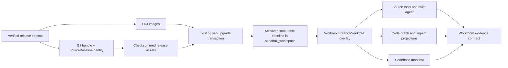

# Source-free install development substrate

**Date:** 2026-08-26; reconciled with `main` 2026-08-27

**Status:** review-ready; implementation requires the normal approval and plan gates

**Delivery items:** BI-48951394, BI-89CD90D4, BI-1BA8F46C, BI-9A353411, BI-705CA714

**Coordinating defects:** BI-86EF5900, BI-6CFC5429, BI-4501D3C8

## Executive decision

A source-free DPF install remains an ordinary release-image install. It does not
become a contributor install, clone `main`, or build the running platform. Each
verified release instead carries a content-addressed **source baseline** for the
exact source revision that produced its image. The baseline is installed through
the existing checksummed release-assets transaction and materialized in the
existing `sandbox_workspace` volume. Build Studio creates a Workroom overlay from
that baseline. Source tools, code graph, codebase manifest, impact projections,
and the build agent all read the same snapshot identity.

The root `AGENTS.md` remains the contributor rulebook. Runtime business agents
receive the existing served operating contract. Platform-development engagements
receive a contributor profile plus the governed Workroom snapshot location. The
choice is made from engagement `decisionScope`, work shape, host profile, token
grants, and current Workroom—not from the incidental presence of source bytes.

The update experience becomes a calm **Platform updates** surface. It shows what
is true now and asks for confirmation only after the operator invokes an update.
Hypothetical failures, raw identifiers, logs, emergency controls, and old failures
are progressively disclosed only when relevant.

## Why the current system fails

The installed runtime has four competing notions of source:

1. The runner image contains selected source under `/app/apps/web-src`,
   `/app/packages-src`, and other runtime paths, but not a complete Git checkout.
2. First boot copies that partial tree into `dpf-source-code`, initializes a new
   repository, commits synthetic bytes, and checks out `my-changes`.
3. Build Studio operates on `sandbox_workspace` and per-build
   `/workspace/.builds/<buildId>` worktrees.
4. Portal source tools use `PROJECT_ROOT`, which has pointed at both stale and
   empty volumes.

That permits a fresh indexing timestamp on old or synthetic bytes. Live evidence
recorded in BI-86EF5900 and BI-6CFC5429 showed a graph reporting `ready` while all
five structural relationship families were zero and the indexed branch was
`my-changes`; `CodebaseManifest` similarly reported zero modules/files. An empty
success was then interpreted as product truth or model weakness.

PR #4711 merged as `fe30d461c` and adds missing boot invokers for knowledge,
portfolio, and doc-impact mirrors. PR #4719 merged as `b88cd81c2` and makes the
code graph index the configured default branch rather than the host checkout's
incidental branch. Both repairs are retained prerequisites. Neither establishes
the release-to-Workroom source identity, cross-projection consistency, or
coverage invariants defined here.

## Authority and compatibility

This design integrates, rather than replaces, the following authorities:

- `2026-08-22-consumer-agent-host-design.md`: host profile, MCP-first instructions,
  and minimal consumer `AGENTS.md` pointer.
- `2026-08-22-external-agent-operating-contract-design.md`: business operating
  profiles, Work Cases/Packets, authorized surfaces, and receipts.
- `2026-08-24-consumer-registry-self-upgrade-design.md`: verification-gated GHCR
  discovery, immutable activation identity, recovery, and rollback.
- `2026-05-13-code-intelligence-graph-adoption-design.md`: exact-snapshot graph
  identity and structural intelligence.
- `2026-08-15-resilient-concurrent-development-process.md`: Workroom as WIP,
  governed worktrees, evidence gates, liveness, and reaping.
- `2026-08-24-workroom-definition-projection.md` and
  `docs/architecture/workroom-vocabulary-boundary.md`: one Workroom concept and
  the existing physical compatibility mapping.
- `docs/architecture/delivery-ia.md`: Delivery is the operator information area;
  route convergence must preserve current links and permissions.

The 2026-03-27 source-lifecycle draft's proposal to treat image-copied source and
a mutable volume as the development authority is superseded by this design. Its
useful requirement—that Build Studio work without an operator clone—is retained.

## Requirements

**OBJ-1:** Bind every source-free release to one verified, offline-capable source
baseline and make it the parent of every development snapshot.

**OBJ-2:** Make Build Studio, source tools, code graph, manifests, and impact
projections truthful and snapshot-consistent.

**OBJ-3:** Serve agent guidance and authority appropriate to the active business-
operation or platform-development engagement.

**OBJ-4:** Make Workroom waiting, completion, abandonment, and reaping durable and
non-destructive.

**OBJ-5:** Replace the warning-heavy self-upgrade arrival with a calm, consistent,
state-specific Platform updates experience.

- **R1 — Exact identity:** image digest, release tag, source commit, Git tree,
  bundle digest, activated baseline, Workroom head, and projection versions are
  independently verifiable and linked.
- **R2 — Offline first start:** a supported source-free install can initialize
  Build Studio without GitHub access or an operator-managed checkout.
- **R3 — One snapshot:** tools, agents, graph, manifests, impact projections,
  tests, and diff calculation use the Workroom's resolved snapshot.
- **R4 — Truthful readiness:** a projection cannot be `ready` when its source is
  absent, its identity differs, required coverage is zero, or reconciliation
  failed. Absence and failure remain distinct.
- **R5 — Immutable baseline, mutable overlay:** release bytes never change in
  place. A Workroom owns a branch/worktree overlay; user changes are never
  overwritten by an upgrade.
- **R6 — One activation transaction:** the source baseline travels through the
  existing `SHA256SUMS` release-assets transaction and rollback boundary.
- **R7 — Engagement-scoped instructions:** business operation and platform
  development receive different projections of one canonical agent contract.
- **R8 — Durable waits:** a waiting Workroom is not dead. Liveness distinguishes
  active, durable wait, finished, merged, abandoned, and invalid states.
- **R9 — Calm updates:** arrival copy describes actual status and the next action;
  risk/recovery details appear at confirmation or in an actual exception state.
- **R10 — Cross-platform:** paths are install-local projections, not hard-coded
  host paths; Windows, macOS, and Linux use the same identity contract.

## Decision ledger

Kernel interaction `DI-3C5CDA9DAB11` compared three architectures:

| Option | Result | Disposition |
|---|---:|---|
| Copy a full mutable source tree into the runtime image | 6.392 | Rejected: conflates runtime and source control and retains synthetic identity. |
| Fetch a separate source artifact after install | 8.753 | Rejected: creates a second availability and activation channel. |
| Ship a Git bundle and identity manifest inside verified release assets | **12.969** | Selected. |

The selected option led by *Research and Use Standards* and *Worktree is
source-control isolation, not runtime isolation*. Margin was 4.216, confidence
was high, no commandment conflict was found, and the decision was autonomy
eligible.

## Canonical architecture



### SourceBaselineIdentity v1

`source-baseline.json` is a release projection, not a database entity:

```json
{
  "schemaVersion": 1,
  "repository": "OpenDigitalProductFactory/opendigitalproductfactory",
  "releaseTag": "vYYYY.MM.DD...",
  "sourceSha": "40-character commit SHA",
  "treeSha": "Git tree SHA",
  "bundlePath": "source/dpf-source.bundle",
  "bundleSha256": "sha256",
  "imageRevision": "matching OCI revision",
  "createdAt": "release publication timestamp"
}
```

The publication gate creates the bundle once and feeds the same artifact to all
architecture builds. It verifies that the bundle contains `sourceSha`, that the
commit resolves to `treeSha`, and that every platform image carries identical
manifest and bundle checksums. Compression reproducibility is therefore not
assumed; byte identity is compared against the single published artifact.

### Activation and storage

The bundle and manifest are added under `/dpf-release-assets/source/` and listed
in the existing `SHA256SUMS`. `install-release-assets.mjs` verifies and copies
them with all other managed assets. Install state advances to schema v3 with a
nullable `sourceBaseline` object containing the activated identity and materialized
volume version; v2 migrates without claiming a baseline.

After asset verification and before an update is considered complete, a
platform-owned reconciler imports the bundle into `sandbox_workspace`, verifies
the commit/tree, and checks out an immutable release baseline. A temporary
directory plus atomic rename prevents partial activation. The previous baseline
remains available through the existing recovery point until health verification
passes. The obsolete `dpf-source-code` synthetic Git bootstrap is read-only
compatibility during migration and is removed only after telemetry proves no
remaining consumer.

No source is mounted into the production app as executable runtime. The portal
may read the sandbox baseline for code intelligence; Build Studio sandboxes own
mutations. Contributor installations continue to use their governed external
checkout and are not rewritten from a release bundle.

### Workroom SourceSnapshotIdentity

`SourceSnapshotIdentity` is a computed projection over existing records:

- baseline release tag, image digest, source SHA, tree SHA, and bundle digest;
- Workroom repository, branch, base SHA, head SHA, and worktree path;
- dirty state and the lease/liveness observation time;
- projection schema versions and the snapshot digest they indexed.

The Workroom is claimed before an overlay exists. Its branch is created from the
activated baseline; its worktree remains under the existing governed workspace
root. Every dispatcher receives the resolved workdir rather than defaulting to
`/workspace`. A resume verifies identity before reusing the overlay.

### Projection readiness

One registry declares each source-derived projection, its reconciler, version,
required coverage, and invalidation inputs. This extends the current graph
projection registry and the merged `refresh-projections` invoker; it is not a
new queue or boot scheduler.

A projection state is one of `pending`, `ready`, `degraded`, `failed`, or
`not-applicable`:

- `ready` requires snapshot-digest equality and its registered invariant.
- `degraded` means usable partial coverage with an explicit limitation.
- `failed` means reconciliation or identity verification failed.
- `not-applicable` is permitted only when the engagement has no source-bearing
  work shape; it cannot masquerade as an empty answer.

Minimum invariants are: checkout sentinels present; manifest file/module counts
non-zero for DPF source; graph indexed files agree within a documented tolerance;
required structural edge families are non-zero; Git branch/head match the
Workroom; and doc/EA/portfolio mirrors disclose their own source/freshness. A
query response always carries identity, state, last success, and limitation.

### Agent operating contract

The platform serves one `AgentEngagementProfile` projection:

| Engagement | Instructions | Source capability |
|---|---|---|
| Operate the organization | External operating contract, organization context, Work Case/Packet, authorized surfaces | None unless the work itself is platform development. |
| Develop the platform | Contributor governance, MCP coordination, Workroom identity, snapshot/worktree locator | Read/write only inside the claimed Workroom and granted tools. |
| Unknown/contradictory | Minimal orientation and safe read tools | Mutation denied until classified. |

The runtime `AGENTS.md` stays a small pointer. The repository root `AGENTS.md`
stays developer-specific. Neither is copied into the other. The projection is
selected from `decisionScope`, work type, host profile, Workroom, principal, and
effective grants; source availability is evidence, never the classification.

### Workroom lifecycle and reaping

The existing liveness service becomes the authority for these transitions:

| Observation | Action |
|---|---|
| Live lease/process | Preserve; renew normally. |
| Authorized durable wait | Preserve state and evidence; do not reap for age alone. |
| Lease expired mid-flight | Mark abandoned or redispatch by policy; then remove only derived overlay. |
| Ready for review/promotion | Surface urgently; never discard finished work. |
| PR merged / terminal evidence accepted | Close Workroom, retain receipts, reap overlay. |
| Identity mismatch or dirty unowned overlay | Quarantine and require explicit recovery; never reset silently. |

The immutable release baseline, canonical evidence, and operator data are never
reaped with a Workroom. This is the implementation boundary of BI-9A353411.
The current classifier's `live`, `lease-expired`, `build-terminal`,
`idle-stale`, `terminal`, and `no-signal` states remain observations; the closed
transition policy adds durable-wait and finished-but-stranded meaning above
those observations rather than creating a second liveness engine.

## Platform updates experience

The user-facing label becomes **Platform updates**. `/ops/self-upgrade` remains a
compatibility route while delivery navigation converges on `/delivery/updates`;
there is no duplicate page or second updater.

### Arrival in Simple and Full modes

Both modes show the same first viewport:

- current state and installed version;
- whether an update is available;
- next automatic update window, when configured;
- a concise, outcome-oriented change summary;
- one primary action, `Install now`, only when a verified target exists.

Full mode may add compact operational facts below the first viewport, but it does
not auto-open logs/history or lead with internals. The following are absent from
arrival: “what could go wrong,” generic recovery prose, emergency override, raw
digests/run IDs, old failures, and open deployment history.

### Confirmation and state-specific disclosure

Selecting `Install now` opens a short confirmation that states the actual
consequence, expected duration, automatic recovery behavior, and the two actions
`Install` and `Not now`. It does not enumerate speculative failures.

Progress shows current phase and a useful time expectation. Success states the
installed version. Actual failure states what happened, whether automatic
recovery succeeded, and the safest next action. Diagnostics are one explicit
disclosure. Emergency override appears only for the small set of blocked states
where it is both authorized and useful. A source-local-change conflict is named
as such and links to the governed resolution path; it is not presented as generic
upgrade brittleness.

## Failure and recovery semantics

- Missing or invalid baseline: installation remains operational, development
  capability is `degraded`, and no source-derived projection reports ready.
- Release/baseline identity mismatch: stop before quiescence or Workroom
  dispatch; do not repair by fetching mutable `main`.
- Baseline materialization failure during upgrade: restore prior assets, install
  state, baseline pointer, and running release through the existing recovery run.
- Dirty Workroom overlay: preserve and quarantine; a new release baseline may be
  installed alongside it, but the overlay is never silently rebased.
- Projection failure: retain last-known identity and time, return qualified
  results if safe, and queue the existing reconciler with bounded retry.
- Disk pressure: reap terminal overlays and caches first; retain the active and
  rollback baselines until their release recovery window closes.

## Security and scale

The bundle contains only Git-tracked release content and passes the existing
release secret/content guards. It contains no credentials, LFS objects not
required by the source contract, dependency caches, or generated outputs. Import
does not execute hooks. Git commands use disabled hooks and safe-directory rules.
All archive paths and object sizes are bounded before extraction.

Storage is one compressed baseline per active/rollback release plus Workroom
overlays. Identical baseline identities deduplicate. Projection reconciliation is
idempotent and keyed by snapshot digest; a boot invocation is allowed, but boot
does not synchronously block portal availability on full indexing.

## Research and benchmarking

- Git bundles are a native, offline transfer mechanism containing refs and Git
  objects, and Git clone supports seeding from a bundle URI. DPF adopts the
  bundle format but activates from its already verified local release asset:
  <https://git-scm.com/docs/git-bundle> and
  <https://git-scm.com/docs/git-clone>.
- ORAS demonstrates distributing arbitrary files as content-addressed OCI
  artifacts. DPF rejects a separate artifact pull for first implementation
  because the verified image already owns release discovery and transactionality:
  <https://oras.land/docs/how_to_guides/pushing_and_pulling/>.
- Sourcegraph distinguishes search-based navigation from precise, uploaded
  indexes tied to repository revisions. DPF adopts explicit revision identity
  and visible precision/readiness rather than treating a recent crawl as truth:
  <https://sourcegraph.com/docs/code-navigation>.
- Nx computes affected work from a base/head relationship. DPF adopts the same
  explicit snapshot pair for Workroom impact, while keeping DPF's graph and
  evidence gates authoritative: <https://nx.dev/docs/features/ci-features/affected>.
- Apple recommends using alerts sparingly for essential, actionable information;
  GOV.UK warning text is for consequences users must understand, and Details is
  for secondary information some users need. DPF applies those patterns at
  invocation and exception time, not as permanent anxiety copy:
  <https://developer.apple.com/design/human-interface-guidelines/alerts>,
  <https://design-system.service.gov.uk/components/warning-text/>, and
  <https://design-system.service.gov.uk/components/details/>.

## UX-fit review

- **Decision:** fits after the required changes below; no new top-level product
  area is justified.
- **Owning area / route:** Delivery / Platform updates; retain
  `/ops/self-upgrade` compatibility and converge navigation toward
  `/delivery/updates` under the existing IA.
- **Primary persona:** owner/operator maintaining an install. Developers and
  support staff use progressively disclosed operational detail.
- **Navigation layer:** contextual delivery operation, not a global warning or
  dashboard.
- **Reuse:** `OwnerReleaseCard`, `SelfUpgradeTriggerControl`, existing release
  summary, run history, confirmation primitives, and shared disclosure/surface
  components.
- **Source of truth:** the same registry candidate, running byte identity,
  readiness, run, and recovery projections used by the orchestrator.
- **States:** checking, current, available, confirmation, queued/in-flight,
  success, actual failure with/without rollback, conflict, and unavailable.
- **AI boundary:** AI may summarize verified changes; it never decides target,
  readiness, confirmation, override eligibility, or success.
- **Required edits:** calm shared arrival, closed state model, invocation-time
  confirmation, collapsed diagnostics/history, state-gated emergency control,
  and compatibility-route/navigation copy.
- **Merge evidence:** desktop/narrow and light/dark captures for every state,
  keyboard/focus and screen-reader checks, copy assertions, and a live N-1
  source-free upgrade exercise.
- **Captured in:** this design; implementation must add the measured
  `docs/ux-fit/2026-08-26-platform-updates.ux-fit.json` artifact.

## Architecture review

**Verdict: fit with required sequencing; no net-new data model approved.**

The design reuses the release-assets transaction, install state, sandbox volume,
Workroom, projection registries, MCP instruction projection, update orchestrator,
and delivery IA. The release identity manifest and engagement/snapshot types are
projections. A new Prisma model, graph store, update queue, source service, or
parallel Workroom concept would be an architecture violation.

Required review findings folded into the design:

1. Generate the bundle once per release and prove cross-architecture byte
   equality; do not assume Git bundle compression is reproducible.
2. Activate the baseline inside the release transaction and retain rollback
   identity; do not let container boot silently advance source.
3. Thread a resolved workdir through every Build Studio dispatcher; changing
   only `PROJECT_ROOT` would leave agents and projections split.
4. Make readiness invariant-driven and identity-bearing; PR #4711's invocation
   fix is necessary but cannot establish freshness by itself.
5. Route agent guidance by engagement scope and authority, not install type.
6. Preserve durable waits and finished work during reaping; deletion applies
   only to derived overlays after evidence is durable.
7. Keep one updater and preserve route compatibility while the Delivery IA
   converges.

Current-`main` reconciliation on 2026-08-27 confirmed the integration seams:
`/dpf-release-assets` and `SHA256SUMS` still own install assets;
`dpf-source-code` plus the synthetic `my-changes` checkout remain compatibility
debt; `refresh-projections` and default-branch graph selection are now landed;
the Workroom liveness classifier still lacks durable-wait/stranded-finished
transitions; agent host instructions still classify source capability separately
from engagement purpose; and the update arrival still renders speculative risk,
pre-action recovery copy, an ordinary emergency override, and auto-open advanced
detail in Full mode. No new store, queue, route family, or Workroom concept is
needed to close those gaps.

## Acceptance and objective measures

| Acceptance | Objective | Statement |
|---|---|---|
| AC-1 | OBJ-1 | A clean consumer install, with network access removed after image pull, materializes the exact release commit and can open a Build Studio Workroom. |
| AC-2 | OBJ-1, OBJ-2 | Image OCI revision, baseline source/tree identity, checkout HEAD, Workroom base, graph snapshot, and manifest snapshot are equal where the contract requires. |
| AC-3 | OBJ-2 | The graph has non-zero registered structural relationship coverage and a known source file is found by file search, graph search, impact analysis, and the build agent from the same Workroom. |
| AC-4 | OBJ-2 | Empty, stale, mismatched, and failed projections never return unqualified success; UI and MCP results state the limitation. |
| AC-5 | OBJ-3 | Business operating sessions do not receive developer doctrine or source-write affordances; platform-development sessions receive only their claimed Workroom. |
| AC-6 | OBJ-4 | A killed session is reconciled according to Workroom state without losing a durable wait or completed evidence. |
| AC-7 | OBJ-5 | Simple and Full update modes share the calm arrival; speculative failure copy and emergency controls are absent, and confirmation appears only after invocation. |
| AC-8 | OBJ-1, OBJ-2, OBJ-4, OBJ-5 | N-1 update, rollback, dirty-overlay conflict, and recovery are proven on the canonical source-free install on Windows and at least one Unix target. |

## Non-goals

- Building or swapping the production runtime from a Workroom.
- Treating a consumer install as a general contributor clone.
- Auto-rebasing or publishing user changes during an update.
- Replacing Postgres graph mirrors, Workrooms, MCP, or the self-upgrade pipeline.
- Exposing internal coordination mechanics to ordinary business users.

## Approval boundary

This package is ready for operator/design-checklist review. Approval ratifies the
architecture and delivery sequence; it does not authorize implementation outside
the backlog, Workroom, PR, and canonical-runtime gates.
