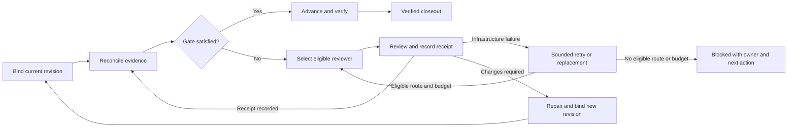

# Local-first agentic delivery throughput

**Date:** 2026-09-03  
**Backlog:** `BI-6E750AD8`  
**Decision:** `DI-2BC1B7E145C0` — extend the canonical Workroom projection; do not create a T3-shaped subsystem or rely on prompt changes alone  
**Primary epic:** `EP-ABB3AC9D` — change-delivery latency  
**Co-owning epics:** `EP-WORK-CONVERGENCE` — work projection; `EP-056D2A5E` — local capacity and contention

## Provider admission delivery slice (2026-09-06)

`BI-06AE6833`, Workroom `WC-27D00458`, implements only the provider-admission
contract in sections 11 and 15.1. The execution/visualization work in
`WC-4A72DC95` retains its existing ownership and scope.

Remove the semantic review wrapper's blanket local-capacity probe. The shared
completion adapter already calls `assertProviderDispatchCapacity` for the selected
provider; verify the primary and fallback paths reach that boundary. Declare
ordinary platform review as internal and retain full payload screening, explicit
residency, provider clearance and export obligations. An external surface alone
does not make a payload public. Do not relax mixed secret or regulated content.

Verify external review while local CI is active, queued or unavailable; local
fallback must still refuse dispatch under those conditions. Preserve independent
specialist branches and infrastructure-inconclusive outcomes. Run the affected
review, provider-capacity, fallback and screening tests; then exercise a real
review on the installed release with eligible external inference. No migration,
new provider setting or second admission policy is needed. Rollback is the scoped
review-wrapper change. Refactoring removes one duplicate admission predicate
rather than introducing a new controller.

## 1. Decision in one paragraph

Make the Workroom the visible delivery rail for Build Studio and every coding client, then run delivery as bounded campaigns whose independently shippable leaves can execute across the two local DPF installations. Keep one backlog, one Workroom identity, one immutable gate identity, and one evidence packet. Add a durable review-tail controller so work ends at verified merge/closeout rather than at PR creation. Measure throughput as verified outcomes per time, token, and human intervention—not PRs or lines changed alone. Keep canonical DPF instructions provider-neutral and apply model/version-specific prompt behavior through evaluated execution profiles. Cloud CI remains the protected safety net and contingency lane; local machines are the chosen capacity investment.

## 2. Why this is an addendum, not a restart

The needed substrate already exists:

- `Workroom` already carries repository, base/head branch, head SHA, worktree, PR, build, task, lease, workspace, and verification links.
- `TaskRun`, asynchronous operation records, events, and Inngest provide durable execution and resume.
- the bounded delivery control plane defines immutable gate identity, proportional evidence lanes, durable waits, coalescing, and truthful projection;
- the unified tracking and delivery-visibility designs already selected Workroom as the cross-surface anchor and defined pipeline, thread, and attention lenses;
- closeout already distinguishes delivered, paused, and abandoned work;
- backlog synchronization and installation pairing already let the two local installations divide demand without inventing a second backlog;
- context-economy metrics already measure per-turn tool surface and selection accuracy.

The present gap is the binding between those parts and the operating loop around them. Existing Workroom list readers still omit most code-carrier facts, PR/review state is incomplete, Build Studio does not coordinate a multi-PR campaign to terminal delivery, paired-install capacity is not a scheduler input, and outcome telemetry does not yet show whether added fan-out creates merged, verified value.

This specification therefore extends these canonical designs rather than duplicating them:

- [`2026-08-30-bounded-delivery-control-plane-design.md`](2026-08-30-bounded-delivery-control-plane-design.md)
- [`2026-08-15-resilient-concurrent-development-process.md`](2026-08-15-resilient-concurrent-development-process.md)
- [`2026-06-19-unified-build-studio-tracking-all-surfaces-design.md`](2026-06-19-unified-build-studio-tracking-all-surfaces-design.md)
- [`2026-06-19-delivery-visibility-and-pr-capture-addendum.md`](2026-06-19-delivery-visibility-and-pr-capture-addendum.md)
- [`2026-06-20-context-economy-eval-metrics-design.md`](2026-06-20-context-economy-eval-metrics-design.md)
- [`2026-09-01-workroom-closeout-lifecycle-design.md`](2026-09-01-workroom-closeout-lifecycle-design.md)

Legacy BI identifiers in the June tracking designs are historical evidence; where they do not exist in the live backlog, the implementation dependencies in section 13 are canonical.

### Options considered

| Option | Result |
| --- | --- |
| Copy T3 Code's thread/PR manager into a new Build Studio subsystem | Rejected: it duplicates Workroom, TaskRun, backlog, and delivery state and would need reconciliation forever. |
| Add model-specific prompt instructions only | Rejected: useful for agent behavior, but cannot create durable ownership, local capacity, PR convergence, or outcome evidence. |
| Extend Workroom with a shared delivery projection, campaign operating loop, paired-install placement, and evaluated execution profiles | **Selected by `DI-2BC1B7E145C0`** with high confidence and no kernel conflicts. It addresses the operating gap while preserving one source of truth. |

## 3. Evidence and confidence

### 3.1 What the transcript supports

The attached transcript is a first-person report, not a controlled benchmark. It supports hypotheses and operating patterns, not DPF acceptance evidence.

| Reported observation | Transcript evidence | Confidence/use |
| --- | --- | --- |
| 89/90 PRs landed in one 24-hour period | lines 13 and 360–368 | Low as a model-only metric: the speaker says the total includes contributor PRs and human merges. Use as an operating-system case study, not a comparable throughput target. |
| Model comparison cohort | lines 375–395 | Medium-low: first 24 hours of Fable 5.1 compared with each other model's selected best window. The Fable cohort had 13 PRs, median 489 LOC, up to four packages, 11 files/PR, 0.4 high-severity findings/kLOC, and 24 post-open commits. Useful dimensions; cohort selection and attribution prevent causal claims. |
| Review/merge tail mattered more than first response | lines 399–403 | Medium as a qualitative lesson. It directly supports measuring PR-open-to-ready/merge and rework, not merely generation speed. |
| Ordered cleanup campaign | lines 337–354 | Medium as an operating pattern: deletion-first ordering, 10 merged PRs across 340 files with net 13K-line reduction; a later seven-PR parallel batch used a separate monitor/takeover agent. The 85–90% speed-up is self-reported and workload-specific. |
| T3 Code links thread↔PR and archives on merge | lines 302–306 and 366–368 | Medium. The public T3 Code repository and issue tracker corroborate worktree/thread management as an active product concern, but not every behavior in the private operating environment. |
| Prompt behavior | lines 256–297 | High where it matches Anthropic's official Fable 5.1 prompting guide; otherwise anecdotal. |

The transcript's headline and detailed cohort have different denominators. DPF must never combine 90 total merges with the 13-PR model cohort as if they describe one experiment.

### 3.2 Primary-source verification

- Anthropic describes Fable 5.1 as a long-horizon reasoning/agentic model with a 1M context window, 128K maximum output, adaptive thinking, high default effort, and $10/$50 per million input/output tokens. It recommends starting at high effort and testing other levels on the customer's own evals: <https://platform.claude.com/docs/en/models/fable-5-1/overview>.
- Anthropic's model-specific prompt guide explicitly covers rendered progress updates, batching independent tools, append-only histories, preserving compaction state, clear completion criteria, scope discipline, targeted edits, and keeping the lead agent productive while subagents run: <https://platform.claude.com/docs/en/build-with-claude/prompt-engineering/prompting-claude-fable-5-1>.
- T3 Code is public source, but it is an evolving product rather than a standard: <https://github.com/pingdotgg/t3code>. Issue 3753 documents demand for moving a thread into a worktree: <https://github.com/pingdotgg/t3code/issues/3753>. The source-pinned second-pass review and design delta are recorded in [`2026-09-04-t3-code-source-delta-review.md`](2026-09-04-t3-code-source-delta-review.md).

### 3.3 Sponsors: useful patterns, not procurement decisions

The sponsor segments are disclosed advertising. Treat their numbers as vendor claims until a DPF-controlled trial.

- **Blacksmith:** the relevant lesson is elastic, cached CI and reduced waiting, not the vendor itself. Its advertised 2× speed and 60% lower runner cost are not DPF facts. Because the owner chose local-machine investment, DPF should first make both local installations useful through proportional gates and resource-aware placement. Blacksmith or another hosted runner is a later contingency experiment if protected-cloud time remains the bottleneck after local improvements.
- **General Translation:** the transferable architecture is code-first localization plus shared terminology/context across projects and agent workflows. This matters to DPF's future outward localization, but it is outside the throughput critical path. Before filing vendor adoption work, perform a separate substrate and localization design review; do not smuggle a sponsor choice into this delivery epic.

## 4. Outcomes and constraints

### Outcomes

1. The operator can see every active delivery, its branch/PR, owner, blocker, next action, and verified result in Build Studio.
2. Build Studio can decompose one bounded objective into independently shippable BIs/PRs and coordinate them to terminal delivery.
3. The two local installations can execute separate ready leaves without duplicate ownership or a shared mutable filesystem.
4. PR checks, review findings, repair, takeover, merge, deployment verification, and closeout form one durable convergence loop.
5. Model and prompt changes are promoted by measured delivery outcomes.
6. Twenty percent of campaign capacity is reserved for evidence-backed refactoring/deletion that reduces future delivery cost.

### Constraints

- One canonical backlog and one Workroom identity `(repository, branch)`.
- One active writer per branch; parallelism comes from independent worktrees and mergeable slices.
- Waiting consumes no model/process/lease capacity.
- Protected checks, approval policy, DCO, evidence, and immutable provenance cannot be weakened.
- A synchronized BI is demand visibility, not authority to mutate the peer installation's owned record.
- Source-free runtime installations never edit source or infer Git truth they cannot verify.
- Local-first does not mean local-only: cloud checks remain a protected safety net and failure/overflow path.
- No metric may reward LOC, PR count, or activity without verified outcome and quality context.

## 5. Operating model: campaign → slices → convergence

A **delivery campaign** is a bounded execution view over existing records, not a new domain entity or backlog.

1. **Frame one outcome.** Record scope, non-goals, risks, terminal condition, objective baseline, and evidence policy on the umbrella BI/design.
2. **Audit and decompose.** Produce a dependency DAG whose leaves are live, independently shippable BIs. Prefer deletion and shared-contract cleanup first when it makes later leaves smaller.
3. **Admit ready leaves.** Create/claim one Workroom and governed worktree per leaf. Respect portfolio and resource-lane WIP; do not start blocked descendants.
4. **Place locally.** Choose an eligible installation from authority, toolchain, repository, resource pressure, data locality, and required evidence lane.
5. **Keep the lead moving.** While workers implement, the campaign lead validates dependencies, prepares later leaves, resolves blockers, and protects scope. It does not idle merely because workers are running.
6. **Converge independently.** A review-tail controller watches PR/check/review events, requests bounded repairs, transfers stalled work when authorized, and closes only on verified merge/acceptance.
7. **Learn.** The scorecard compares the campaign with its baseline and routes durable findings to the backlog/commons.

Twenty percent is a capacity lane, not a mandate to enlarge each feature. Candidate refactors must have evidence of repeated delivery drag, an independent BI, an observable reduction target, and a rollback. Unused refactoring capacity returns to ready outcome work; it does not justify speculative cleanup.

## 6. Canonical delivery rail

Workroom remains the identity. Other records contribute facts:

| Stage | Canonical facts | Plain operator projection |
| --- | --- | --- |
| Requested | BI, outcome, priority, dependencies | What result are we trying to produce? |
| Claimed | Workroom, executor/principal, installation, lease | Who owns the next move and where? |
| Implementing | worktree, branch, head SHA, task progress | What is changing; is it moving? |
| PR open | PR number/URL/head, review and check summaries | Is it ready, waiting, or needs repair? |
| Converging | gate key, findings, attempts, takeover/handoff | What remains before merge? |
| Merged | merge SHA/time, change record | What landed? |
| Verified | served/deployed SHA, acceptance/objective evidence | Did the intended result work? |
| Closed | delivered/paused/abandoned disposition | Is the room safely finished or resumable? |

The delivery rail is a read model over Workroom, WorkItem/WorkCase, TaskRun, build, PR inventory, review/check state, evidence, runtime verification, and closeout. It does not duplicate their write authority. Each fact carries source, observed time, and freshness. Projection conflict renders `Stale` with a recovery action; absence never becomes success.

Worker sessions roll up under the Workroom. Provider, model/profile, installation, role, progress, and result are attributable, but private reasoning is not persisted. Raw tool events and receipts remain expandable audit detail.

Workroom identity is stable while its execution binding is replaceable. Branch,
head SHA, worktree path, installation, executor, provider session, and resume cursor
are binding facts, not alternate identities. Any operation that changes those facts
must compare the complete prior binding, durably record intent, perform the external
Git/runtime step, verify the observed result, and either finalize or compensate. A
database transaction cannot make a filesystem or provider transition atomic.

## 7. Build Studio UI contract

Build Studio becomes the operator's delivery cockpit through three lenses backed by the same projection:

### Pipeline

One compact card or row per Workroom grouped by `Ready`, `Working`, `Waiting`, `Needs attention`, and `Complete`. The first viewport shows outcome, owner, stage, age, branch/PR, blocker/next action, and result. It does not show every worker or tool call as a separate card.

### Thread

One delivery's ordered timeline from request through verified closeout. The stable summary remains visible while evidence, agent sessions, checks, findings, commits, and receipts expand progressively. Branch, PR, Workroom, and BI identifiers are semantic deep links.

### Attention

Only actionable items: open, specific, evidenced, owned, executable, and verifiable. Each action supplies a complete label, destination, and promised outcome. Historical, stale, duplicate, withdrawn, and already-resolved findings remain in audit history and do not create cards.

### Interaction and state requirements

- Use the existing report-kit, status intents, design tokens, loading primitives, and stable queue deep-link contract.
- Keep the primary action on arrival; move technical evidence behind the appropriate disclosure construct.
- Keep confirmed content visible during refresh and mark it stale/partial when some providers fail.
- Support `loading`, `ready`, `empty`, `stale`, `partial`, and `failed` per source. A provider outage never renders an empty success state.
- Keep list order stable while work is active; signal status and unseen completion without moving rows under the operator's pointer. Attention may reorder only on a durable priority change.
- A compact Workroom shell may stay live in a list; full timeline, VCS, PR, and worker detail subscriptions are visibility- and selection-scoped, coalesced, bounded, and cancelled when no consumer needs them.
- Meet keyboard, focus, screen-reader, 44px target, reduced-motion, contrast, light/dark, responsive, and route-budget requirements.
- A campaign view adds dependency status, ready leaves, active/waiting/blocked/merged counts, constrained lane, and next bottleneck. It does not become a graph explorer by default; the DAG is secondary detail.

## 8. PR and review-tail convergence

PR creation is a midpoint. A durable controller owns the tail until one of `verified-delivered`, `deliberately-deferred`, or `blocked-with-owner` is recorded.

1. Link PR to Workroom from the creation result when available. Also run a targeted discovery reconciliation after a turn that may have opened a PR outside the controller. Branch is a discovery hint only: settlement requires repository, PR number, current head ref, and head SHA to agree, so a historical or base-branch PR cannot close unrelated work. Reconcile provider events without a second polling service.
2. Bind checks and semantic review to the immutable head SHA/gate key. A new head supersedes pending older attempts while preserving their receipts as history.
3. Normalize actionable findings by provider/id/head. Every current blocking finding must be fixed, answered with evidence, deliberately rejected under policy, or rendered stale.
4. Request the smallest repair that satisfies the finding. Prevent adjacent scope growth unless it becomes a separate BI.
5. If progress stalls, perform audited Workroom handoff/takeover within the recorded authorization and lease policy. The new executor receives decisions, open issues, evidence digest, next action, branch/head, and current findings. Ownership transfers; two writers do not race. Ask for a decision only when scope or authority must change, not because the original client disappeared.
6. Auto-merge only when repository policy explicitly permits it and required protected checks, reviews, DCO, evidence, and risk/approval rules pass. Model confidence is never a merge authority.
7. Merge/deploy events reconcile Workroom and BI state, then close out the room under the delivered/paused/abandoned rules.

### 8.1 Reviewer recovery and receipt settlement

The same controller owns recovery before PR creation and during the review tail.
Reuse Workroom, TaskRun, AsyncInferenceOp, the initiative reviewer binding, and the
existing receipt writers. Do not add another task ledger, scheduler, or gate table.
The following is target behavior; a shape declaration alone does not implement it.

1. Persist the review identity before dispatch: subject, gate, repository, artifact
   path, commit SHA/blob or revision, digest, policy version, expected baseline,
   reviewer principal, and applicable authorization references. Keep the identity
   stable across provider attempts; keep each attempt's provider/model separate.
2. Read existing receipts before inference. A receipt for different bytes remains
   history and cannot advance the current gate. Fence late writers after a head,
   baseline, or executor change; reconcile races through the existing writers.
3. Select an eligible provider under section 11. An unavailable local model is a
   routing/capacity result, not a semantic finding or a new human decision.
4. Distinguish attempt ended, writer rejected, receipt persisted, gate satisfied,
   and superseded work in the result projection. TaskRun completion alone proves
   none of the latter outcomes. A rejected writer stops that attempt and supplies
   its typed recovery reason; it must not be presented as review approval.
5. Preserve the current three-attempt missing-writer inference limit. On exhaustion,
   the durable controller selects a different eligible provider/reviewer for the
   same packet. Persist attempted routes, successor identity, remaining aggregate
   budget, and next wake condition so switching providers cannot reset the budget
   indefinitely. With no eligible route or budget, stop with an owner and remedy.
6. Exact approved execution is separate from inference retries. Reuse the existing
   approved-call recovery path while its scope, identity, validity, and authority
   still apply. Neither reuse nor provider substitution waives reviewer independence.
7. After receipt commit, reevaluate readiness and advance only satisfied transitions.
   Keep spec approval, baseline, and retention pin atomic in the existing writer.
   A crash between commit and notification must resume from that receipt without
   repeating the assessment. Durable event reconciliation repairs missed wakeups.
8. Repair a failed coverage requirement through its own dependency path. A doc-only
   implementation projection with no unmet gates cannot be the prescribed route
   for obtaining a missing scope baseline. Return the executable baseline-review
   prerequisite without changing the work's classification just to trigger a gate.

### 8.2 Work-shape evolution and encoded boundaries

Extend the existing `pull-request-flow-watch` activity family under `BI-06AE6833`.
Version 1.0.0 only reads and classifies PR health; it does not recover review writers,
repair checks, or complete delivery. Specify the recovery-capable successor as
`pull-request-flow-watch@2.0.0`, with `change-consequential` collaboration, before
implementing and registering it. Do not bind a room to an unavailable version.

| Stage | Accountable role | Evidence and next transition |
| --- | --- | --- |
| Bind current work | Delivery coordinator | Verified subject/repository/head/baseline and authorization; missing identity returns one artifact-owner action |
| Reconcile | Delivery coordinator | Current receipts, checks, persisted events and liveness; satisfied work skips inference |
| Review | Independent reviewer | Screened request and bounded provider attempts; persists a receipt or a typed attempt outcome |
| Recover or repair | Delivery coordinator, then eligible replacement | Same review packet for infrastructure recovery; a code repair creates a new head and supersedes old review |
| Advance | Existing gate owner | Readiness result from current receipts; protected merge/deploy authority remains authoritative |
| Verify and close | Acceptance reviewer / delivery coordinator | Verified-delivered, deliberately-deferred, or blocked-with-owner outcome |

Reuse the closed trigger classes: `claim`, `cadence`, `escalation`, `authority-change`,
and `evidence-decay`. Provider completion/head changes enter the existing durable
event path; do not invent a new trigger enum just to name each provider event.
Waiting releases model execution. Bound each reconciliation page, provider-attempt
chain, retry deadline, and Workroom WIP before activation; inherit section 12's
installation ceiling. Success closes the cycle; unreadable evidence, revoked
authority, unavailable replacement, and exhausted budget each have an owned exit.

**Version and carrier compatibility:** the current registry resolves one version
per key and a room carries one activity-shape reference. Retain v1 resolution until
every v1 claim is deliberately migrated, or provide an explicit governed migration;
never silently reinterpret old claims. Delivery size/risk remains orthogonal to
recovery. Do not replace a `delivery-large` claim with a watch and lose its gates,
or append competing shape entries. The delivery-shape family composes the same
recovery contract at review stages. The implementation must reconcile this with
the [proportional-gates design](2026-09-02-work-shape-taxonomy-and-proportional-gates-design.md).

**Verified binding prerequisite (2026-09-05):** attempting to shape existing
`WC-4D4BB6EC` through `adopt_worktree` returned success but an empty `scopeClaims`
readback. `adopt-worktree-handler.ts` omits `workShape`; `adoptWorktreeCapsule`
neither persists shape claims on create nor updates scope on re-adoption. Its
successful return is not shape activation. Extend the existing adoption contract,
preserve omitted fields and unrelated claims, audit old/new versions, reject
unresolvable references, and verify stored readback. Scope claim/release operations
must also preserve both shape entries. No direct database patch or duplicate room
is a substitute. This prerequisite belongs to `BI-06AE6833`'s external-room coverage.

### 8.3 Visual model and SysML architecture note

Encoding is the existing typed TypeScript `WorkShapeDefinition` registry plus
versioned references in Workroom `scopeClaims`; occurrences and evidence remain
in the existing room-cycle, TaskRun, and receipt records. This is not BPMN XML or
SysML text execution. See the [shape architecture](../../architecture/work-shapes-and-the-decision-gate.md)
and [SysML reference](../../Reference/sysml-v2.md).

- **Operator view:** extend the existing Overview/Details shape projection. Show
  current stage, next action, accountable owner and last progress in a stable row.
  Distinguish “Review recorded; checking readiness” from “Changes required” and
  “Waiting for an eligible reviewer.” Keep receipt IDs, retry history, model choice,
  immutable identities and prior versions in Details. Use tokens, status icons,
  keyboard navigation, visible focus, responsive layout and 44px action targets.
- **BPMN process view:** derive tasks, gateways, retry paths, waits and ownership
  lanes from the registered stages and implemented transition rules. The current
  `process-extract.ts` / `reconcile-process.ts` projects selected state machines;
  recovery-stage/WorkShape extraction is follow-up work, not existing coverage.
- **SysML v2 view:** requirements are exact-revision evidence, bounded recovery,
  eligible external routing, writer fencing and receipt-based advancement. Allocate
  them to the router, TaskRun recovery, receipt writers and Workroom controller;
  link each requirement to the verification cases in section 15.1. APIs/tools,
  provider calls, durable events and receipt transactions are the interface boundary.
- **Data authority and parity:** Postgres/source registries remain authoritative;
  EA, BPMN/SysML and the UI are derived views. Extend the existing Parity Engine
  with stable source keys and versioned extractors. Report missing or conflicting
  projections through `EaConformanceIssue`. Mark this diagram as target-state until
  runtime evidence exists; do not hand-maintain a parallel `.sysml` authority.

This Mermaid sketch communicates the target flow; it is not a BPMN-conformant
model or proof of implementation:

Standards: [OMG BPMN 2.0.2](https://www.omg.org/spec/BPMN/2.0.2) for process
notation and [OMG SysML 2.0](https://www.omg.org/spec/SysML/2.0) for systems
traceability, checked 2026-09-05. Reuse the existing DPF notation/EA stack and its
benchmarking; this amendment adopts no external modeling tool or workflow engine.

## 9. Delivery outcome scorecard

The unit is a verified delivery slice and campaign, not an output token or commit. Preserve raw events and derive a versioned `DeliveryOutcomeObservation` projection.

| Dimension | Measures |
| --- | --- |
| Throughput | verified slices/campaign, cycle p50/p90, claimed→PR, PR→ready, ready→merge, merge→verified |
| Flow | active vs wait time, queue p50/p90, no-progress age, WIP, superseded/abandoned/deferred work |
| Quality | first-pass protected-check rate, blocking findings/kLOC, regression/reopen, acceptance pass, evidence completeness |
| Rework | post-open commits, repeated gates/reviews, scope changes, takeovers, failed attempts |
| Attention | human questions, approvals, interventions, merge clicks, time requiring attention |
| Economy | incremental uncached input, cached input, cache creation, output and reasoning tokens by provider where available; API-equivalent cost and actual billed spend kept distinct; tool calls, non-progress calls, cache savings, and tokens/cost per verified result |
| Capacity | installation/lane utilization, RAM pressure, admission failures, wait time, protected-cloud time |
| Breadth | files/packages/surfaces changed, shown as cohort context rather than a target |

Every number names its cohort, period, source completeness, and uncertainty and links to the underlying Workrooms/PRs. Comparisons stratify by work kind, risk/evidence tier, package breadth, model/effort/profile, installation, and campaign. A larger PR is good only when it completes a coherent outcome with equal or better quality and less rework.

Initial DPF acceptance is improvement against the existing 0.57 protected PR/hour pilot baseline and current wait/non-progress measures, not imitation of the transcript's 90-PR headline. The pilot sets numerical targets only after two weeks of complete local telemetry establish a comparable baseline.

## 10. Two-install local execution fabric

The paired installations form a small federated execution pool. Demand is synchronized; execution authority and mutable state remain installation-aware.

Each installation advertises a versioned capability/pressure snapshot:

- installation identity, environment class, source availability, repository/toolchain readiness;
- permitted work and data authority;
- available CPU/RAM and safety reserve;
- active model-inference footprint;
- lane availability and recent peak working set for documentation, affected-code, host-build, container-build, preview, and model inference;
- last observation and health.

The coordinator assigns only a ready Workroom whose dependencies pass. Placement filters by authority and capability, then minimizes expected completion time using live lane pressure and data locality. It is not round robin. The transaction claims the Workroom/BI before execution so both installations cannot start the same leaf. A source-free install may coordinate or observe but cannot receive source-editing work.

Build execution continues to wrap the canonical `BuildExecutionProvider` contract
from [`2026-05-09-deployment-contracts.md`](2026-05-09-deployment-contracts.md).
Paired-install placement selects an eligible installation/provider; it does not
introduce a deployment-specific execution API or bypass the configured provider's
credential, audit, lifecycle, and data-residency policy.

Worktrees remain local and isolated. Git branch/SHA and the Workroom evidence packet are the handoff boundary; no shared writable network folder is required. If an installation fails, its active writer is fenced, the durable task remains waiting/paused, and an authorized takeover may adopt the remote branch into a new local worktree after the liveness/grace rules permit it.

Client reconnection, server restart, provider restart, provider-instance switch, and
installation takeover are different transitions. Each reports what survived:
Workroom/timeline history, Git state, provider-native context, active process, and
resume cursor. Continuation is attempted only when the target provider declares a
compatible continuation identity and the cursor is verified; otherwise the operator
sees an explicit context downgrade and the new executor receives the bounded handoff
packet. A missing worktree or dead process cannot remain `Working` merely because a
TaskRun or provider session still carries an active identifier.

Cloud execution remains mandatory where protected repository policy requires it and available as fallback when local evidence is inconclusive or capacity is unavailable. Vendor runners are evaluated only after the local scorecard shows protected-cloud time is the limiting stage.

## 11. Model and prompt execution profiles

### Provider eligibility is independent of local execution placement

Local-machine investment in section 10 does not make local inference mandatory.
For authorized nonconfidential DPF development, choose any eligible connected
provider from payload classification, retention/repository authorization, grants,
capability, context capacity and budget. Preserve the existing separation of
`modelTier` and residency and the source-code/authorship-metadata screening rules.
Do not impose a blanket confidential floor on every development review; mixed
payloads containing secrets or regulated records retain their stronger controls.

Apply host-capacity admission at the actual provider boundary on every initial and
fallback call. An active local-CI reservation excludes local model dispatch, not
eligible remote review. Reuse `assertProviderDispatchCapacity` and the existing
fallback chain rather than adding another admission predicate. The explicit
local-only policy remains a hard boundary; provider failure never weakens it.

Split instructions into two layers.

### Canonical invariants

These apply to every provider/model:

- explicit scope, non-goals, evidence obligations, and terminal condition;
- proceed autonomously with reversible in-scope work; stop for destructive actions or genuine scope/authority changes;
- brief user-visible progress during long work and a complete final recap;
- batch independent reads/tool calls while preserving dependency order;
- targeted edits and proportionate tests; nearby improvements become separate demand;
- keep the lead productive while bounded workers run;
- preserve exact IDs, decisions, constraints, file paths, commands/evidence, blockers, and next actions in compaction/handoff;
- own the PR/review tail until the delivery's stated terminal condition.

### Provider/model/version delta

An execution profile records provider, pinned model/version when available, effort, prompt-profile version, tool grant, history/compaction policy, retention/data classification, and feature flags. The Fable 5.1 delta enables rendered progress-update blocks, preserves append-only histories, nudges independent-tool batching, tests low/medium/high and higher effort on DPF cohorts, and budgets room for long outputs. Those settings do not silently rewrite another provider's history or global prompt.

Profiles promote through the delivery scorecard: task success and verified outcome first, then cycle time, review-tail quality, human touches, token/cost, and tool-selection accuracy. A profile can roll back independently of the model or application release. Sensitive workloads must satisfy the provider/data-retention policy; unavailable provenance or cost data stays explicit.

## 12. Failure, security, and scale

- A stale or conflicting projection fails the affected transition with one owner and recovery action.
- Provider events are advisory; durable platform records and protected provider checks remain authoritative.
- Workspace, branch, worktree, process, TaskRun, provider session, and PR liveness are reconciled independently. Contradictions become typed failure states; no one stale `active` flag may prevent repair or reaping indefinitely.
- Destructive worktree/archive/delete actions first fence writers, verify ownership and current binding, then clean up idempotently. Missing resources count as an already-applied cleanup, while a partially applied create/move/delete enters compensating recovery with an orphan inventory entry.
- Every claim, reassignment, finding disposition, retry, gate reuse, merge decision, and override is auditable.
- Access to repository, logs, prompts, and evidence follows existing principal/organization boundaries. The scorecard never stores private reasoning.
- Queries are cursor/time bounded and indexed. Default Build Studio pages do not fetch every PR provider or full activity history.
- Event replay uses monotonic cursors with a bounded replay window and snapshot fallback. Coalescing is permitted only for replaceable progress updates with a stable identity; lifecycle boundaries, approvals, failures, ownership changes, and terminal evidence are never coalesced away.
- Context-window occupancy, provider cumulative usage, incremental attributable usage, API-equivalent price, subscription allocation, and invoiced spend are separate facts. Parent history inherited by a child is not charged again to that child or campaign.
- Backpressure applies per constrained lane and campaign/portfolio WIP. More clients do not create more executable capacity by themselves.
- A failed peer installation degrades to local single-install operation; a failed cloud provider cannot turn required protected evidence into pass.

The first implementation ceiling is one same-organization pair and at most 16
eligible installations in a coordinator view. Capability/pressure exchange is a
bounded latest-snapshot read plus incremental events, O(I) in eligible installs;
Workroom lists and timelines are cursor-bounded, and provider reconciliation is
delta-based. There is no all-to-all install mesh and no full inventory scan per
scheduling decision. `EP-056D2A5E` lifts per-host resource limits;
`EP-ZERO-CONFIG-FEDERATION` and the federated-demand architecture own scale beyond
the same-organization pair, routed discovery, and multi-party revision/conflict
semantics. Crossing the 16-install ceiling requires measured saturation and an
explicit partitioning/introducer design, not a higher silent cap.

### Blast radius

Implementation is expected to touch these existing seams:

- Workroom/WorkCase loaders and presenters, including the fields currently omitted
  by workspace and inventory projections;
- Build Studio pipeline/thread/attention components, route-purpose contracts,
  report-kit composition, UX budgets, and responsive/accessibility tests;
- TaskRun/event notification and durable-resume projections;
- PR inventory/writers, review findings, merge readiness, and Workroom closeout
  reconciliation;
- installation/federation capability projection and nonproduction resource-lane
  admission, without changing peer record ownership;
- prompt assembly/model routing and context-economy telemetry;
- scorecard queries, indexes, retention, redaction, and observability cardinality;
- BuildExecutionProvider wrappers and protected GitHub gate integration.

No implementation slice may change these areas as one release. Each BI must write a
blast-radius report and migration/rollback plan for its own bounded seam before code.

## 13. Backlog and ownership delta

### Existing work updated or reused

| BI | Role after this design |
| --- | --- |
| `BI-7C1F43E3` | Existing bounded delivery control plane: immutable gates, durable waits, proportional evidence, truthful Workroom projection. Active pilot remains independently owned. |
| `BI-8D56F777` | Updated from cloud-first relief to the paired-install local execution fabric, with cloud as protected/fallback capacity. |
| `BI-05D7A0DC` | Updated into the Workroom-aware task hub and cross-page completion/attention experience. |
| `BI-C41AB195` | Updated to roll lead, worker, reviewer, and takeover roles into one attributable Workroom delivery session. |
| `BI-801313EB` | Durable async operation/resume contract used by waiting and review-tail work. |
| `BI-3D4A7063` | Per-work-kind evidence contract that controls proportional verification. |
| `BI-2641F34A` and `BI-2310EEE1` | Claim and projection integrity prerequisites. |
| `BI-9FF39058`, `BI-75565393`, `BI-33E1E5D7`, `BI-154689E7` | Existing Workroom closeout and cleanup slices. |

### New independently shippable work

| BI | Deliverable | Epic |
| --- | --- | --- |
| `BI-9DC43E17` | Operator-visible Workroom delivery rail and pipeline/thread/attention UI | `EP-WORK-CONVERGENCE` |
| `BI-06AE6833` | Resumable PR/review-tail convergence controller | `EP-ABB3AC9D` |
| `BI-1CB9D97B` | Dependency-aware Build Studio campaigns across local installations | `EP-ABB3AC9D` |
| `BI-69803ACC` | Delivery outcome scorecard | `EP-ABB3AC9D` |
| `BI-A472354E` | Versioned model/prompt execution-profile evaluation | `EP-ABB3AC9D` |
| `BI-7E0812E0` | Repair the docs-only `pregate --plan` self-test uncovered while verifying this design | `EP-ABB3AC9D` |

No new epic is required. `EP-ABB3AC9D` owns the throughput investment; `EP-WORK-CONVERGENCE` owns the canonical projection and UX; `EP-056D2A5E` owns safe local capacity. The spec path and these responsibilities are recorded on all three.

The T3 source delta adds acceptance detail to the existing BIs and creates no new BI.
The exact reconciliation is in
[`2026-09-04-t3-code-source-delta-review.md`](2026-09-04-t3-code-source-delta-review.md).

## 14. Investment order

| Order | Investment | Why now | Exit signal |
| ---: | --- | --- | --- |
| 1 | Finish the `BI-7C1F43E3` pilot and repair claim/projection integrity | Parallelism on untruthful state multiplies waste. | Durable waits/coalescing work; Workroom state matches delivery truth. |
| 2 | Scorecard foundation (`BI-69803ACC`) plus Workroom delivery rail (`BI-9DC43E17`) | We need a baseline and one operating view before changing capacity. | Two weeks of complete cohorts; operator can see every active delivery and bottleneck. |
| 3 | Paired-install capacity (`BI-8D56F777`) | Directly uses the owner's existing investment and synchronized backlog. | Both installations deliver separate ready leaves with no duplicate claims and better verified throughput/token. |
| 4 | PR/review-tail convergence (`BI-06AE6833`) | Converts generated work into merged outcomes and reduces attention. | Lower PR→merge p90, rework, and human interventions with protected quality stable. |
| 5 | Campaign mode (`BI-1CB9D97B`) and session rollup (`BI-C41AB195`) | Safe fan-out now has visibility, capacity, and a closing loop. | Bounded multi-PR campaigns complete dependency waves and keep 20% refactoring capacity productive. |
| 6 | Model/profile experiments (`BI-A472354E`) | Isolates model benefit after the delivery system can measure it. | A profile wins a fixed cohort on verified outcome, quality, time, and cost and can roll back. |
| 7 | Hosted runner or localization vendor evaluation | Only if local telemetry or a separate product objective justifies it. | Controlled comparison beats the local/protected baseline or localization architecture review approves adoption. |

## 15. Acceptance for this design

This design is complete when:

- the transcript claims are clearly separated from primary-source facts and DPF baselines;
- the current DPF substrate and existing designs are reconciled without a new queue, backlog, or Workroom ledger;
- the local two-install decision, Workroom delivery rail, campaign loop, PR convergence, scorecard, prompt profiles, 20% refactoring lane, UI, security, failure, and scale contracts are explicit;
- existing epics/BIs carry the delta and every uncovered deliverable has one live BI;
- architecture review confirms the design is actionable, and later implementation plans map their deliverable graphs to these live BIs before code begins.
- the T3 source delta's binding-saga, liveness, PR-identity, continuation, event-pressure, and attributable-cost amendments are included in the relevant existing BI acceptance contracts.

### 15.1 Recovery amendment verification and ownership

| Verification case | Expected result | Existing delivery owner |
| --- | --- | --- |
| Local CI occupied; external provider eligible | External review completes; local dispatch stays fenced; mixed regulated/secret payload remains constrained | `BI-06AE6833`, inference maintainer; profile evaluation in `BI-A472354E` |
| Three omitted writers; duplicate retry event; original client gone | One durable successor attempt, unchanged packet, bounded total budget, independent principal, no repeated routine authorization | `BI-801313EB` + `BI-06AE6833` |
| Writer rejects, or process dies after receipt commit | Rejection is not gate satisfaction; committed receipt is reused; baseline/pin atomicity retained | `BI-801313EB`, initiative-readiness maintainer |
| Head/baseline changes while review is pending | Old receipt remains historical; late attempt cannot advance new work | `BI-06AE6833` |
| Doc-only coverage fails without a baseline | Specific executable prerequisite returned, not a successful empty recovery route | `BI-DC0F14E0`, planning/governance maintainer |
| Existing external room receives a shape; scope is later claimed/released | Stored resolved version matches request, unrelated fields survive, old-version claims remain readable | `BI-06AE6833` |
| Auto-merge enabled with failed checks; author replaced | Failed check produces repair action; stale writer fenced; protected merge still required | `BI-06AE6833` |
| Diagram versus current receipts and registry version | Same owner/state/action, stale projection labeled, missing extractor reported | `BI-9DC43E17`, EA maintainer |

Reserve 20% of implementation capacity for deletion/consolidation: remove the
blanket semantic-review admission path, centralize attempt-result/recovery
projection, and share the shape-field parser/merge/readback contract. Measure
removed duplicate predicates and repeated review calls; do not count new framework
code as refactoring. Ship admission, settlement/recovery, and external-room/UI
coverage as separate rollbackable slices under the owners above.

The separate wiki freshness defect remains with `BI-ED117C82`: compare content or
version rather than vector presence, hydrate doctrine from canonical rows, and
test changed published content with an existing vector. It is not evidence that
review recovery or release `bb94b132` failed. That release's TaskRun settlement and
fallback-profile fixes must be reused; end-to-end recovery still needs the cases
above. This amendment is design evidence, not their passing result.

## 16. Architecture review (advisory)

**Alignment:** well aligned after amendment. The design extends canonical Workroom,
TaskRun, federation, evidence, closeout, and deployment-provider contracts; campaign
and scorecard are projections/operating views rather than new authorities.

The review found three important omissions in the first draft and folded the fixes
into sections 2, 10, and 12: alternatives and the governed decision are explicit;
paired-install dispatch wraps `BuildExecutionProvider`; and the design now names its
bounded-query rules, initial 16-install ceiling, lifting epics, and concrete blast
radius. No unresolved architecture trade-off remains. An independent design-checklist
review is still required before any implementation plan becomes authoritative.
