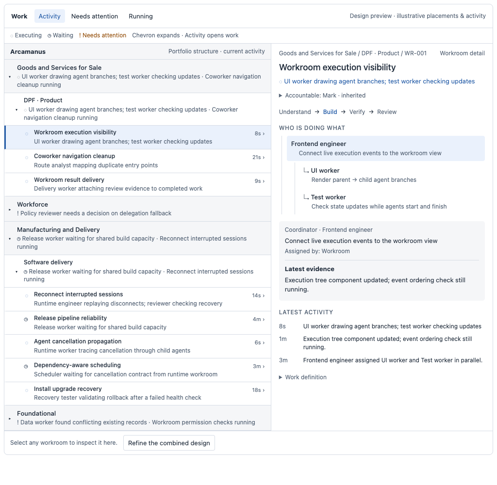

# Portfolio work activity and human accountability

Date: 2026-09-07 · Scope: platform refactoring · Umbrella: BI-8DACBA07

Status: operator accepted visual direction; delivery specification for review. This document does not assert implementation readiness or runtime verification.

## Problem and intended outcome

An operator sees work occurring without being able to tell what the workers are doing. Workrooms, coworker activity and workforce administration have separate entry points. A missing AI coordinator can also look like nobody is accountable for the work.

The operator should recognize the business hierarchy, read concrete activity without opening every room, and inspect any visible activity with one click. Work is defined in workrooms; AI coworkers and humans are assigned to that work. Human accountability starts with the organization's recorded owner or CEO and is delegated explicitly as the organization grows.

## Accepted visual direction

This is an illustrative design study, not a live activity capture. Sample names, placements and activity are fixtures. The requirements below govern implementation. The study establishes compact rows, four portfolio roots, independent expansion and selection, and an adjacent inspector. It is not evidence that the application implements these interactions.

Keep the four existing portfolios. Workforce includes supporting work such as hiring, finance, procurement and administration. Its label stays for this refactoring; renaming is deferred.

## Existing authority and explicit supersession

- [PAAW operating standard](../../architecture/four-portfolio-archetype-ai-workforce-operating-standard.md), sections 4, 6, 9.5 and 10.4, owns portfolio alignment, refinement levels, definition/occurrence and accountability. This design supplies the activity presentation.
- [Workroom vocabulary boundary](../../architecture/workroom-vocabulary-boundary.md) owns Workroom → WorkCase → WorkroomView identity and relationships. No new work ledger or graph store is introduced.
- [Coordinated workrooms](2026-09-03-coordinated-workrooms-design.md) owns the AI coordinator ladder. An inherited human accountable does not satisfy a missing coordinator or authorize execution.
- [Delivery throughput](2026-09-03-local-first-agentic-delivery-throughput-design.md) owns delivery evidence and process inspection. BI-9DC43E17 and PR #5167 already address those surfaces; extend their shared projection and inspector.
- [Portfolio convergence plan](../plans/2026-08-24-workroom-portfolio-convergence.md) remains authoritative for canonical sources and definition/occurrence separation. This design supersedes its separate EA/Ops discovery arrangement with one operator Work entry. EA definition editing and existing canonical detail links remain available in context.

Source review used main `9283441fe7`. Backlog overlap was read through DPF MCP on 2026-09-07 UTC. Historical backlog percentages are not current runtime measurements.

## Requirements

### PWA-01: one recognizable hierarchy

The four peer roots are Goods and Services for Sale, Workforce, Manufacturing and Delivery, and Foundational. Reuse their existing identities (`productsAndServicesSold`, `forEmployees`, `manufactureAndDeliver`, `foundational`) through canonical adapters; do not rename persisted keys.

Expand into the organization's actual portfolio taxonomy and workroom placement. Workroom `contains` relationships form nested rooms below that placement. A portfolio node, room, process stage and worker must have distinct visual semantics. Do not insert a new universal Development/Operations hierarchy, force a fixed number of depths, or treat PAAW R0–R5 as folders. Refinement levels remain linked views of the same architecture.

Cross-portfolio dependencies and contributions are links to one canonical room. A room is counted once per aggregate scope, including when parent and child sources overlap. Cycles, conflicting placements and missing metadata are visible exceptions. Unmapped work appears in a clearly labeled exception group outside the four portfolios until corrected; never silently classify it as Foundational.

### PWA-02: activity at a glance with progressive disclosure

The initial viewport shows compact portfolio rows and representative concrete actions: for example, “Checking invoice matching · Finance worker,” or “Waiting for release review.” Counts supplement those statements. The server selects a bounded set of representative activities per branch: unresolved attention first, then recent execution, then verified completion. Selection does not change structural row order.

A chevron expands a branch without changing selection. A room title or activity opens that exact room in one click in an adjacent inspector. When a branch summary represents a room, it carries that room's destination; clicking it must not require opening every ancestor. Opening a portfolio title can show its scope summary, with an explicit route to its activity.

Preserve expansion, filter, scroll and selected room through refresh and back navigation. Keep structural rows stable while events update their contents. Search and attention/active filters retain ancestor context and report when results are incomplete. Expansion fetches only the requested page. Do not initially render hundreds of rooms or workers.

### PWA-03: inspect the shape of work and its workers

Reuse the canonical Workroom inspector: outcome, effective human accountable, AI coordinator, current stage, concrete latest action, blocker/next action and freshness first. Expand process shape, named workers, delegated subagents and bounded activity/evidence details from there.

Each worker row answers who, doing what, current state and last observed progress. Selecting it opens that worker's room-scoped activity, with its delegating parent when recorded. Distinguish process dependencies from agent delegation; missing parentage stays unknown. A hundred subagents must be inspectable by paging/search and grouped expansion, without creating a hundred navigation destinations or hiding all of them behind a number.

Stage state comes from governed receipts and source evidence. Claimed shape, occupied lease, successful tool call and completed task do not imply verified delivery. Preserve the existing Overview/Details shape graph and its source/version provenance.

### PWA-04: inherited human accountability

Resolve the effective accountable human using existing organization/principal responsibility contracts. The organization's recorded top accountable is the default, including a solo founder. A valid explicit room assignment overrides inherited responsibility; otherwise follow the canonical responsibility lineage to its nearest valid delegated human assignment, ending at that organization's top accountable.

Responsibility lineage must be explicit and acyclic. Portfolio placement alone does not establish a reporting line, and an execution dependency is never an ownership edge. Multiple possible parents or conflicting assignments require correction rather than arbitrary precedence. The implementation must first identify the canonical binding for organization ownership and delegation; this specification does not invent an `Organization.ownerId` column.

Display the effective human and provenance, such as “Alex · inherited from Finance,” with one action to inspect or change delegation under existing authorization. Revocation/departure invalidates the binding and recomputes valid inheritance. Missing or ambiguous top responsibility produces an actionable organization setup state, not a guessed first administrator, requester, creator or signed-in user. Fix onboarding/seed derivation as well as existing-state reconciliation.

### PWA-05: accountability is distinct from execution and access

Human accountable, AI coordinator, executor, requester and lease holder have separate labels and identities. An AI coordinator can be missing while a human remains accountable. Preserve coordinator execution refusals. Deriving accountability grants no extra read/write capability and must never expose another organization's identity or activity.

### PWA-06: truthful symbols, motion and freshness

Use compact symbols with accessible state names. Animate only when fresh source evidence says execution is active. Waiting for a person, queued, blocked, completed, stale and unknown have distinct static states. Lease presence alone is insufficient. Show source timestamp and unavailable/conflicting evidence; disconnected clients must age into stale state rather than spin indefinitely.

Respect reduced motion and screen-reader focus. Use theme tokens and shared primitives. Updates must not steal focus or flood live announcements. Keyboard users can expand, select, inspect and return; compact visual rows retain the platform's required interaction targets. Color and animation never carry meaning alone.

### PWA-07: bounded server projection at scale

The platform owns aggregation, identity, freshness and permission filtering. No client-only guarantee, external-provider fanout on page load, new polling ledger or full history scan. Reuse indexed canonical readers; fetch branch pages and selected-room detail separately. Apply authorization before counts, summaries and representative activity selection so hidden work cannot leak through aggregate text.

Use cursors, deterministic ordering and resumable/coalesced events. Cancel detail subscriptions on selection change, bound retained events and mark gaps requiring refresh. Count unique room identity; worker/task counts are separate metrics. Truncated data must be labeled partial, not presented as a total.

Delivery acceptance targets, to be measured rather than claimed today: 1,000 rooms across four roots with 100 simultaneously active agents; at most 50 room rows per page, three representative activities per collapsed branch and 100 activity entries per detail page. Under a declared shared nonproduction test profile, target p95 branch response below 500 ms and first authorized activity within 2 seconds; record hardware, concurrency, query count and payload sizes. Failing a target keeps the scale acceptance open and requires a measured correction. Larger estates stay cursor-bounded; no unbounded fallback is permitted.

### PWA-08: one home for work, clear supporting administration

Introduce one operator-facing Work navigation entry using the existing `/ops/workrooms` activity destination and canonical `/workspace/cases/[caseKey]` detail. The view can preserve room selection in a URL while a copied deep link opens the same canonical room. Keep EA definition editing under `/ea/workrooms` as a contextual design action.

The coworker directory remains a directory, reached from Work and people-related contexts; it is not another activity dashboard. Current source uses `/workforce` and `/workforce/[agentId]` for operator coworker identity and `/platform/ai` for administration. Keep those identities; remove redundant top-level activity discovery and link administrators to configuration in context. Inventory existing consumers before converting any legacy activity route to a redirect or shared filtered view. Preserve bookmarks, authorization and back navigation.

The Workforce portfolio is a business-work grouping. The coworker directory is a people/agent view across all four portfolios. They must not be conflated. Update route registry, navigation tests and user documentation together; do not scatter path decisions through individual pages.

## Contracts to extend

### C1: portfolio and room identity

Reuse `apps/web/lib/ea/workroom-architecture.ts`, portfolio source manifests and `apps/web/lib/work-management/{source-registry,room-structure,room-relations,workspace-case-loader}.ts`. Preserve Workroom/WorkCase keys and typed relationship semantics from `packages/db/prisma/schema/work-coordination.prisma`. Resolve placement from authoritative source links with provenance. The current architecture reader has a 200-record cap and a Foundational fallback; the new bounded projection must not report either behavior as complete business classification.

### C2: human responsibility

Audit `packages/db/prisma/schema/core-identity.prisma`, canonical organization setup, principal role bindings and `apps/web/lib/work-management/{room-types,room-participant-assignment,room-coordinator}.ts`. Extend their responsibility resolver rather than treating coordinator resolution as human ownership. If existing persisted bindings cannot express delegation, record the exact gap and amend this contract with schema stewardship and migration/backfill acceptance before building that extension.

### C3: execution activity and worker lineage

Compose `room-activity.ts`, `shape-projection.ts`, `work-item-presence.ts`, WorkroomActivity/Participant/Relation and existing task/session evidence. BI-C41AB195 owns unified session correlation. Source timestamps, external identity, parentage and typed state survive projection. New source adapters must fit the existing registry and honor its access controls.

### C4: presentation and navigation

Extend `apps/web/components/ops/workrooms/WorkroomInventory.tsx`, shared components under `apps/web/components/workspace/workroom/`, and `apps/web/lib/navigation/portal-navigation-model.ts`. Reuse coworker record readers and route constants. Do not fork process diagrams, drawer primitives, or ownership logic into page-local utilities.

## Operator flows

### F1: understand the estate

Open Work → see four portfolios and concrete activity → expand one taxonomy branch → inspect a room. A collapsed branch's representative activity can jump directly to that room. Unmapped work is discoverable and repairable without corrupting portfolio totals.

### F2: understand execution

Select activity → inspector shows who is doing what and the current stage → expand workers → select a delegated agent → read bounded evidence and its relationship to the parent. Resume/retry/approval actions use existing governed controls, not new controls inferred from a symbol.

### F3: understand responsibility

Open room → see human accountable and inheritance source alongside AI coordinator → inspect lineage → authorized explicit delegation changes the effective human → descendants with their own overrides keep them. A missing coordinator remains a separate execution problem.

### F4: return to work across views

Follow a coworker to its assigned workroom or an EA definition to current occurrences → arrive at the same canonical room → return without losing the original scope. Old bookmarks preserve identity and authorized destination.

## Verification contracts

### V1: hierarchy and aggregation

Exercise all four roots, real taxonomy depths, nested rooms, cross-portfolio links, cycles, ambiguous/missing placement and filtered access. Assert unique room counts and no unauthorized summary text. Verify every rendered room and representative activity has a resolvable destination. Measure the PWA-07 fixture, including pagination boundaries and partial results.

### V2: activity and interaction

Exercise 100 agents with delegation, waiting, errors, completion, missing lineage and event gaps. One click from a collapsed portfolio's activity must open the right inspector. Verify separate expansion/selection, stable focus/order, cancellation, reconnect/stale state and that receipts—not task completion—control verified stages.

### V3: accountability

Cover solo owner default, multiple delegation levels, room override, revoked/departed delegate, conflicting ancestry, missing owner, two organizations and denied modification. Confirm AI coordinator absence does not erase human accountability or become executable through the fallback. Run migration acceptance against populated and incomplete existing installs if schema changes are needed.

### V4: UX and compatibility

Verify keyboard, screen reader, reduced motion, light/dark themes, 360/736/1024-pixel layouts, empty/loading/partial/failed states and long names. No horizontal page overflow; narrow layouts offer an inspector with a clear return to the preserved tree. Test old activity bookmarks, coworker identity links and EA definition links against the running canonical nonproduction install. Record evidence on the implementing workroom and update user guidance.

## Research & Benchmarking

Reviewed primary documentation on 2026-09-07. These comparisons guide interaction semantics; no external engine is being adopted.

| Open-source reference | Adopt | Reject for this refactoring |
| --- | --- | --- |
| [Argo Workflows DAG](https://argo-workflows.readthedocs.io/en/latest/walk-through/dag/) | Explicit dependency edges and nested execution detail. | Using a DAG as the portfolio/reporting hierarchy or requiring Kubernetes execution. |
| [Apache Airflow UI](https://airflow.apache.org/docs/apache-airflow/stable/ui.html) | Compact overview with task/run drilldown and graph context. | Treating every business workroom as a scheduled DAG run. |
| [LangGraph interrupts](https://docs.langchain.com/oss/python/langgraph/interrupts) | Distinct persisted waiting/resume states and continuity of execution identity. | A second durable execution ledger or engine; DPF already owns its runtime contracts. |

Follow [WAI-ARIA tree view interaction guidance](https://www.w3.org/WAI/ARIA/apg/patterns/treeview/) for expansion, keyboard movement and the distinction between focus and selection. Choose shared disclosure/tree primitives consistent with actual rendered semantics; do not label a complex row as a tree item without implementing its keyboard contract.

## Delivery boundary

The [implementation plan](../plans/2026-09-07-portfolio-work-activity.md) maps independently shippable work to live BIs. This design adds no runtime code, deployment change, schema or new execution engine. Product behavior and performance claims require the implementing workrooms' acceptance evidence. The deferred Workforce rename is outside this delivery.
