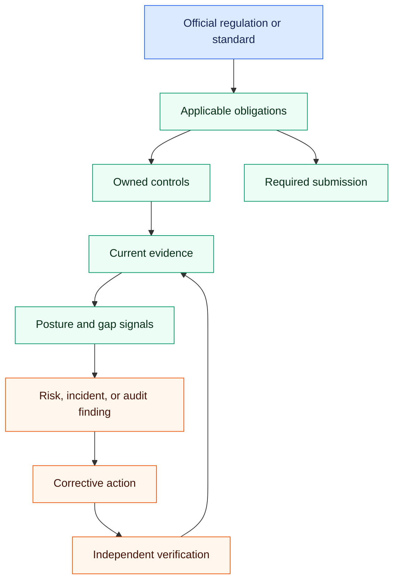

## Overview

The Compliance area connects the external rules that apply to your organization
to the controls, evidence, issues, and submissions used to manage them. Use it
as an operational record of what the organization knows and is doing—not as a
substitute for an official source, regulator direction, or qualified advice.

Text alternative: start from an official source, identify applicable
obligations, connect them to owned controls and current evidence, use posture
and gap signals to find issues, and carry risks, incidents, or audit findings
through corrective action and verification. Required submissions branch from
the obligation record.

## Key Concepts

- **Regulations & Standards** — The external frameworks your organization is subject to (e.g., DORA, ISO 27001, GDPR). Each is onboarded via a guided wizard.
- **Obligations** — The specific requirements that flow from a regulation. Each obligation must be addressed by one or more controls.
- **Controls** — The policies, procedures, and technical measures your organization has in place to satisfy obligations. Evidence is collected against controls.
- **Posture Score** — A calculated score reflecting how well your controls currently satisfy your active obligations. It combines coverage, evidence freshness, and outstanding issues.
- **Gap Assessment** — An analysis of which obligations are not yet covered by sufficient controls or evidence. The starting point for a remediation plan.
- **Licensing Readiness** — A workspace for business licenses, permits, postings, fees, credentials, authority layers, and unresolved readiness questions.

## Before You Change A Record

- Confirm the source, jurisdiction, effective date, and business scope.
- Name an accountable owner and a review or due date where the workflow
  provides them.
- Decide what evidence would let another reviewer verify the claim.
- Use a compliance-management account for changes. View-only access can inspect
  the record but cannot perform managed transitions.

## Choose The Workflow

- [Regulations and obligations](regulations-and-obligations.md) — establish the
  source and the requirements that flow from it.
- [Controls and evidence](controls-and-evidence.md) — show how an obligation is
  addressed and preserve the proof.
- [Posture and gaps](posture-and-gaps.md) — find uncovered or partially covered
  obligations and prioritize remediation.
- [Incidents, risks, and response](incidents-risks-and-response.md) — separate
  immediate response from longer-term mitigation.
- [Audits and corrective actions](audits-and-corrective-actions.md) — move a
  finding through ownership, completion, and verification.
- [Policies and acknowledgements](policies-and-acknowledgements.md) — govern a
  policy version from draft through publication and retirement.
- [Regulatory submissions](regulatory-submissions.md) — prepare and record a
  filing without confusing the platform record with transmission.
- [Licensing readiness](licensing-readiness.md) — track permits, licenses,
  authority layers, credentials, fees, and unresolved questions.

## What The Compliance Coworker Does

**What it does.** Two things, and they are deliberately separate. A daily
**obligation assurance watch** sweeps what you have recorded — obligation
frequencies, control review dates and cadences, and licence requirement
staleness — and raises a finding on the assurance ledger for anything falling
due inside the next 30 days. The **Compliance Officer** coworker then works those
findings: it reviews what came due, drafts the follow-up, and brings you the
decision. It can also onboard a regulation and draft its obligation structure,
run a gap assessment over obligations with no active control, report the posture
score and name its detractors, draft and version policies, and open licensing
readiness issues.

**When it runs.** The sweep runs **daily at 05:40 UTC**, so a finding is waiting
before the working day starts — it is not triggered by you opening a screen. How
often the coworker then reviews those findings follows its Proactivity setting:
weekly at Balanced, daily at Assertive, never at Quiet. Recorded review dates and
frequencies are now read; they are no longer inert.

**How it stays current.** For what you have already recorded, the watch keeps
pace — a date cannot pass unnoticed. For whether the recorded requirement still
matches the law, it cannot: the regulatory-change scan runs only when someone
presses the button on the Regulations screen, and it does not subscribe to any
official source. Re-checking the authority remains yours.

**What it will not do.** The sweep raises findings; it never decides the
response. The coworker does not determine that you are compliant, does not renew
a licence, does not submit a filing, and does not close an obligation on its own.
Deciding what to do about a finding is a governed decision owned by the
accountable compliance owner, and raising Proactivity changes how often the watch
runs — never who answers for the response.

**What you must do.** Own the decision on each finding, and keep re-checking the
official source, because currency of the requirement itself is still a human
responsibility. Treat a quiet ledger as evidence that nothing recorded is due —
not that nothing is wrong.

## Read Posture Carefully

The gap view classifies an active obligation as **covered** when it has at
least one active, implemented control; **partial** when controls exist but none
is implemented; and **uncovered** when it has no active controls. The posture
score combines obligation coverage, control implementation, open incidents,
and overdue corrective actions. These are operational signals. A high score
does not prove legal compliance, evidence quality, or control effectiveness.

## Recovery Rule

Preserve the record. Correct relationships, supersede evidence or regulation
versions when the platform supports it, and document why a status changed.
Avoid deleting history merely to improve a dashboard. If the official
requirement is uncertain, record the uncertainty and assign follow-up rather
than converting an assumption into a compliance claim.
