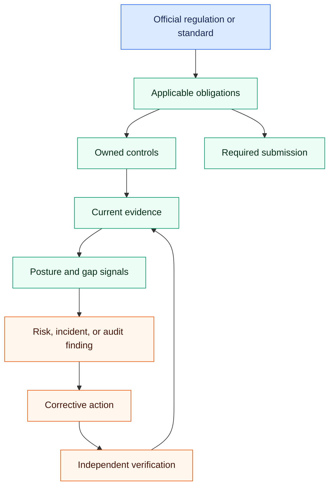

## Overview

The Compliance area connects the external rules that apply to your organization
to the controls, evidence, issues, and submissions used to manage them. Use it
as an operational record of what the organization knows and is doing—not as a
substitute for an official source, regulator direction, or qualified advice.

Text alternative: start from an official source, identify applicable
obligations, connect them to owned controls and current evidence, use posture
and gap signals to find issues, and carry risks, incidents, or audit findings
through corrective action and verification. Required submissions branch from
the obligation record.

## Key Concepts

- **Regulations & Standards** — The external frameworks your organization is subject to (e.g., DORA, ISO 27001, GDPR). Each is onboarded via a guided wizard.
- **Obligations** — The specific requirements that flow from a regulation. Each obligation must be addressed by one or more controls.
- **Controls** — The policies, procedures, and technical measures your organization has in place to satisfy obligations. Evidence is collected against controls.
- **Posture Score** — A calculated score reflecting how well your controls currently satisfy your active obligations. It combines coverage, evidence freshness, and outstanding issues.
- **Gap Assessment** — An analysis of which obligations are not yet covered by sufficient controls or evidence. The starting point for a remediation plan.
- **Licensing Readiness** — A workspace for business licenses, permits, postings, fees, credentials, authority layers, and unresolved readiness questions.

## Before You Change A Record

- Confirm the source, jurisdiction, effective date, and business scope.
- Name an accountable owner and a review or due date where the workflow
  provides them.
- Decide what evidence would let another reviewer verify the claim.
- Use a compliance-management account for changes. View-only access can inspect
  the record but cannot perform managed transitions.

## Choose The Workflow

- [Regulations and obligations](regulations-and-obligations.md) — establish the
  source and the requirements that flow from it.
- [Controls and evidence](controls-and-evidence.md) — show how an obligation is
  addressed and preserve the proof.
- [Posture and gaps](posture-and-gaps.md) — find uncovered or partially covered
  obligations and prioritize remediation.
- [Incidents, risks, and response](incidents-risks-and-response.md) — separate
  immediate response from longer-term mitigation.
- [Audits and corrective actions](audits-and-corrective-actions.md) — move a
  finding through ownership, completion, and verification.
- [Policies and acknowledgements](policies-and-acknowledgements.md) — govern a
  policy version from draft through publication and retirement.
- [Regulatory submissions](regulatory-submissions.md) — prepare and record a
  filing without confusing the platform record with transmission.
- [Licensing readiness](licensing-readiness.md) — track permits, licenses,
  authority layers, credentials, fees, and unresolved questions.

## What The Compliance Coworker Does

**What it does.** The Compliance Officer coworker can onboard a regulation and
draft its obligation structure from a source you point it at, run a gap
assessment over obligations that have no active control, report the posture
score and name its detractors, draft and version policies, capture what your
business does with data so the right regulations apply, and open licensing
readiness issues. It weighs its judgements against its profession corpus and the
organization's own recorded stances rather than deciding unaided.

**When it runs.** Two things now run without being asked, and one still does not.

The **obligation assurance watch** runs daily at 05:40 UTC. It reads the review
dates and frequencies you record on obligations and controls, and the freshness
budget on licence requirement references, and raises a finding for anything
falling due inside the next 30 days or already past. It also reports anything
that declares a recurrence with no date attached, because that reads on screen
as a control in force and behaves as one that is not. You can change its cadence
or run it now from `/admin/scheduled-jobs`.

The **Compliance Officer** then reports those findings to you on its Proactivity
setting — weekly at Balanced, daily at Assertive, not at all at Quiet.

What still does **not** run on a schedule is the regulatory-change scan. It runs
only when someone presses the button on the Regulations screen, and that is
deliberate: it asks a model from recall rather than reading an authoritative
feed, so running it daily would manufacture compliance noise rather than detect
regulatory change.

**How it stays current.** Your recorded dates are watched daily; the outside
world is not. The watch re-reads the records on every run, so correcting a date
is reflected the next morning and a completed review closes its finding. But
nothing subscribes to any official source, and the change scan compares a
regulation only against what it last recorded. Treat *regulatory* currency as a
human responsibility on a calendar you own; the platform now watches whether you
are keeping to that calendar, not whether the calendar is still right.

**What it will not do.** The coworker does not decide that you are compliant,
does not renew a licence, does not submit a filing, and does not change a control
status on its own. Consequential actions require your approval, and low-confidence
or conflicting judgements escalate rather than resolve themselves.

**What you must do.** Set and keep your own review cadence, re-check the official
source before relying on any recorded requirement, and treat an unchanged posture
score as evidence of nothing — it does not move when a deadline passes unnoticed.

## Read Posture Carefully

The gap view classifies an active obligation as **covered** when it has at
least one active, implemented control; **partial** when controls exist but none
is implemented; and **uncovered** when it has no active controls. The posture
score combines obligation coverage, control implementation, open incidents,
and overdue corrective actions. These are operational signals. A high score
does not prove legal compliance, evidence quality, or control effectiveness.

## Recovery Rule

Preserve the record. Correct relationships, supersede evidence or regulation
versions when the platform supports it, and document why a status changed.
Avoid deleting history merely to improve a dashboard. If the official
requirement is uncertain, record the uncertainty and assign follow-up rather
than converting an assumption into a compliance claim.
