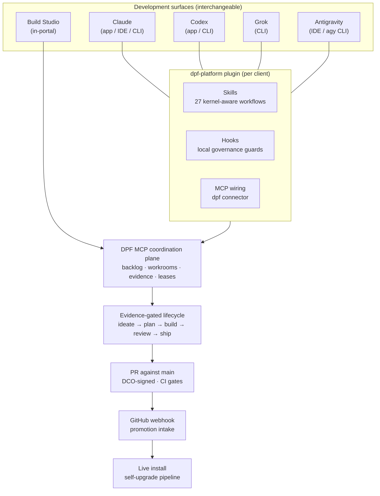
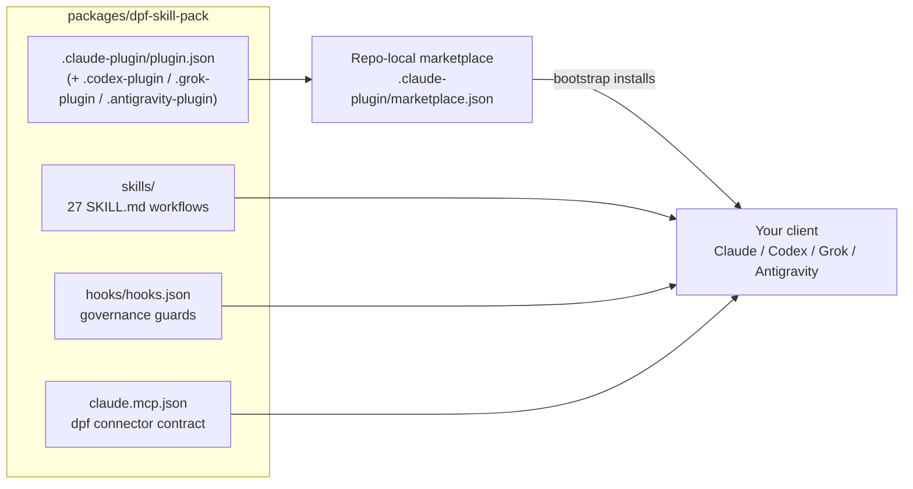
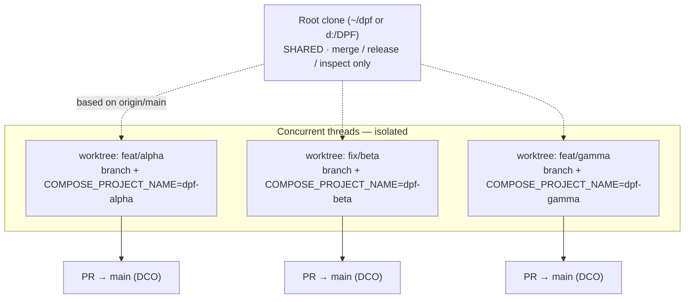
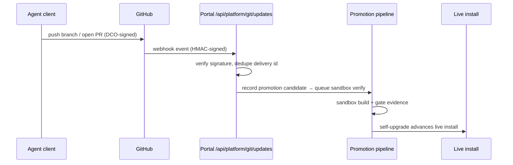

## Agent Development Environments — Claude, Codex, Grok, Antigravity

This guide is for contributors who want to develop the platform with a **dedicated AI coding agent** — Claude, Codex, Grok, or Google Antigravity — instead of (or alongside) the in-portal **Build Studio**. Each agent ships in more than one form, and **all of them are valid options**:

| Agent | Available as | Notes |
| ----- | ------------ | ----- |
| **Claude** | Desktop app (Mac/Windows), IDE extension (VS Code / JetBrains), **or** CLI (Claude Code) | Use whichever client you prefer; they share the same `~/.claude` config |
| **Codex** | Desktop / IDE client app **or** CLI | Both read the same `~/.codex/config.toml` |
| **Grok** | **CLI only** | No GUI client yet — the Grok CLI is the only surface today |
| **Antigravity** (`agy`) | **Agentic IDE + CLI** — opt-in install through the bootstrap | Google's Antigravity. The bootstrap can install `agy` opt-in (`--install-antigravity` / `-InstallAntigravity`) and wire the DPF MCP token; `agy` handles its own Google sign-in (a device-code URL on a headless server). **Host contributor surface only** — supported for external DPF development, but **not** as a Build Studio in-sandbox dispatch engine ([why](../build-studio/sandbox.md#why-google-antigravity-is-not-a-dispatch-engine-yet)). See the [Antigravity onboarding runbook](../../operations/antigravity-cli-onboarding.md). |

Whether you run the **desktop app** or the **CLI**, the DPF setup is the same: install the **`dpf-platform` plugin** (which bundles the **skill pack**, the **DPF MCP server** wiring, and the **governance hooks**), load the **AGENTS.md** operating doctrine, and adjust a few **local client settings** so the agent follows the portal's processes. These agents are the more advanced surface — they let an experienced contributor run **multiple concurrent threads of work** (one branch and one git worktree per thread) while still adhering to every process the portal establishes.

If you only want the guided experience, use [Build Studio](../build-studio/index.md) and stop here. If you want to drive the platform from a full agent client, read on.

> **One process, five surfaces.** Build Studio, Claude, Codex, Grok, and Antigravity are interchangeable adapters behind one contract wherever each surface's host capabilities are available: the evidence-gated lifecycle (`ideate → plan → build → review → ship`), the DPF MCP coordination plane, documentation impact checks, and the worktree/lease isolation model. Governance reads the *evidence*, never *which surface produced it*. See the [Unified Delivery Surfaces spec](https://github.com/OpenDigitalProductFactory/opendigitalproductfactory/blob/main/docs/superpowers/specs/2026-06-05-unified-delivery-surfaces-execution-alignment-design.md) and the [Antigravity first-class support design](https://github.com/OpenDigitalProductFactory/opendigitalproductfactory/blob/main/docs/superpowers/specs/2026-07-17-antigravity-first-class-support-design.md).

### How the pieces fit together

Every surface — the four external agent clients and Build Studio — plugs into the same coordination plane and the same governed lifecycle. The diagram below is the mental model for the rest of this guide:



Three things are worth calling out up front, because they recur throughout this guide:

- The **plugin** is how a client becomes DPF-aware — it delivers skills, hooks, and the MCP connector in one install.
- The **MCP plane** is the single source of truth for coordination. *If it isn't in MCP, it didn't happen.*
- The **webhook** at the bottom is what closes the loop: a pushed branch re-enters the governed promotion pipeline automatically, with no surface hand-advancing the live install.

---

### Why a dedicated agent client instead of Build Studio?

| | Build Studio (in-portal) | Agent clients (Claude / Codex / Grok / Antigravity) |
| --- | --- | --- |
| Audience | Non-technical operators; guided authoring | Experienced contributors comfortable with git |
| Concurrency | One guided build at a time per operator | **Many concurrent threads** — one branch + one worktree each |
| Source access | Governed, abstracted | Direct source edits, debugging, arbitrary tooling |
| Same governance? | **Yes** — identical gates, MCP coordination, PR/DCO, evidence | **Yes** — identical gates, MCP coordination, PR/DCO, evidence |

The headline advantage is **thread management**: several worktrees open at once, each on its own branch and its own isolated Docker Compose project, without their working trees, container names, or HEADs colliding. The rest of this guide is mostly about doing that *without* breaking the processes the portal depends on.

---

### Prerequisites

You need the base developer environment first — see [Developer Setup](developer-setup.md) (pnpm + Docker sidecars) or the [Dev Container Setup](dev-container.md). Then install **at least one** agent client:

| Agent | Where to get it |
| ----- | --------------- |
| **Claude** (desktop app, IDE extension, or Claude Code CLI) | [code.claude.com/docs](https://code.claude.com/docs) |
| **Codex** (desktop/IDE app or CLI) | [developers.openai.com/codex](https://developers.openai.com/codex) |
| **Grok** (CLI — no GUI yet) | xAI Grok Build CLI (`grok`) |
| **Google Antigravity** (IDE and `agy` CLI) | [antigravity.google](https://antigravity.google/) |

You do not have to install all four, or pick one form over another. The setup is symmetric: install whatever you like, run the bootstrap, and add more later by re-running it.

---

### Step 1 — Wire MCP, the plugin, and AGENTS.md (one command)

From the repo root, run the **agent toolchain bootstrap**. It is the single, client-agnostic entry point that connects every installed client — desktop app or CLI — to DPF in one pass:

```bash
# macOS / Linux
bash scripts/dpf-bootstrap-agent-toolchain.sh

# Windows (PowerShell)
.\scripts\dpf-bootstrap-agent-toolchain.ps1
```

The bootstrap is **idempotent** (re-running on a converged install is a no-op) and writes the **shared client configuration that both the desktop app and the CLI read** (`~/.claude`, `~/.codex/config.toml`, `~/.grok/config.toml`, and the Antigravity MCP config it can detect/write). It:

1. **Detects** which of Claude / Codex / Grok / Antigravity are installed — resolving GUI-app and non-PATH install locations, not just `which`.
2. **Mints and persists a legacy DPF MCP token** if one isn't present (a client that speaks the browser flow no longer needs this — see [How a client authenticates](#how-a-client-authenticates-all-clients)) (issued inside the portal container, persisted to `~/.dpf/agent-toolchain.env` and your shell profile, never logged). Default scope is `write` so the agent can use side-effecting MCP tools (backlog, evidence, Build Studio handoff). On macOS it also injects the token via `launchctl` so GUI-launched apps — which don't read your shell profile — still pick it up.
3. **Connects the DPF MCP server** in each client (`.mcp.json` / `.vscode/mcp.json` for Claude, `[mcp_servers.dpf]` in Codex/Grok config, and Antigravity's `mcpServers.dpf` config when available), all referencing `${DPF_MCP_BEARER_TOKEN}`.
4. **Installs the `dpf-platform` plugin** for each client from its local marketplace/registry — this is the single package that carries the shared **skill pack** and the cross-client hook/MCP contracts (see [The plugin](#the-plugin-skills-hooks-and-mcp-in-one-package) below). For Codex, the bootstrap registers and verifies the qualified plugin key `dpf-platform@personal`; copying plugin files alone is not considered installed.
5. **Seeds kernel-tier memory** so the agent is kernel-aware from the first turn, before any MCP retrieval round-trip.
6. **Runs read-only MCP + kernel smoke probes**, checks whether the DPF-native process-spine replacement skills are installed and visible to the current session, and prints a single **readiness banner**. On Grok, this check is **verified** (`grok plugin list --json`, run automatically by the bootstrap before the health check) rather than merely inferred from install state; Codex and Antigravity have no non-interactive way to list actively loaded skills yet, so their exposure stays `unknown` until their CLIs expose one — see the [process-spine skill exposure health design](https://github.com/OpenDigitalProductFactory/opendigitalproductfactory/blob/main/docs/superpowers/specs/2026-07-19-process-spine-skill-exposure-health-design.md).

After it finishes, **restart the client** (desktop app or CLI) so it reloads the MCP connection and the plugin.

> **AGENTS.md is already in the repo.** `AGENTS.md` at the repo root is the canonical rulebook, and the tool-specific pointer files (`CLAUDE.md`, `.cursor/rules/`, `.clinerules/`, `.github/copilot-instructions.md`, `CONVENTIONS.md`, `.continue/rules/`) already point to it — they're checked in. You don't author these; you just make sure your client loads project instructions (most do automatically from the repo root). **Don't duplicate rules into the pointer files** — they are pointers, not copies.

#### Reading the readiness banner

| State | Meaning | Next action |
| ----- | ------- | ----------- |
| `ready` | Client(s) wired, MCP reachable, kernel principle fired | Start working |
| `partial` | One client is ready; another needs setup | Repair toolchain (re-run bootstrap) |
| `missing_cli` | No supported agent detected | Install Claude / Codex / Grok / Antigravity |
| `missing_token` | No DPF MCP token | Issue a development token (Admin → Platform Development → MCP) |
| `needs_refresh` | Token exists but the running client hasn't picked it up | Restart the client / refresh the binding |
| `failed_smoke` | Installed but did not apply a kernel principle | View evidence under `--show-substrate` |

Re-run with `--show-substrate` for plugin/config/memory detail, or `--dry-run` to preview writes. See [docs/operations/install.md](../../operations/install.md) for what each state means in depth.

The readiness record is committed through the same locked, compare-and-swap install-state transaction used by the installer and self-upgrade promoter. A failed state write now stops the bootstrap with an explicit error instead of reporting a misleading ready banner.

The banner reports **DPF-native replacement skills installed** separately from **DPF-native replacement skills loaded/exposed in this session**. That distinction matters: a client can have the `dpf-platform` plugin on disk but still be running with stale skill exposure until restart. If a retired generic process skill such as `superpowers:brainstorming` is visible while its DPF replacement is absent, stop before project work, restart the client, and re-run the bootstrap. Codex may safely disable known competitive plugins through its native config adapter; other clients warn until their native plugin surfaces support the same reconciliation.

---

### The plugin: skills, hooks, and MCP in one package

The bootstrap doesn't rely on loose skill files — it installs one **plugin**, `dpf-platform`, into each client. The shared package owns the skills plus the cross-client hook and MCP contracts. Each client adapter then uses the host's supported registration surfaces. Claude can consume those declarations from its plugin manifest; Codex receives skills through the qualified `dpf-platform@personal` registry entry while the bootstrap wires Codex hooks and MCP in its global config.



The surface manifest (`plugin.json`) ties the package to each host. Manifests declare only capabilities that host supports; the bootstrap adapter owns any remaining global wiring. Codex, Grok, and Antigravity get parallel manifests (`.codex-plugin/plugin.json`, `.grok-plugin/plugin.json`, `.antigravity-plugin/plugin.json`) so the **same source of truth** installs on every surface without pretending their plugin schemas are identical.

> **One file per skill, two surfaces.** Each skill's `SKILL.md` is a superset that feeds **both** the external agent client (as the `dpf-platform:*` plugin namespace) **and** the in-portal coworker (seeded as a `SkillDefinition` row). You never maintain two copies.

#### Skills — the kernel-aware workflows

Skills are the reusable procedures that encode DPF's non-negotiable process into steps an agent can follow. They fire in two ways: you invoke one explicitly (`dpf-platform:dpf-file-backlog-item`), or the agent auto-selects one when your request matches its trigger description. There are **27** in the pack; the ones you'll reach for most:

| Skill | Use it when |
| ----- | ----------- |
| `dpf-worktree-per-session` | Starting or auditing a concurrent session that touches the working tree |
| `dpf-verify-substrate-first` | Tempted to add a new table / type / enum / tool — check it doesn't already exist |
| `dpf-file-backlog-item` | New work needs to enter the backlog before a plan is written |
| `dpf-writing-plans` | A filed BI needs a phased implementation plan |
| `dpf-decision-via-kernel` | An open question has 2+ architecturally-distinct options |
| `dpf-evidence-before-diagnosis` | Diagnosing a failure — gather signals before proposing a cause |
| `dpf-tdd` / `dpf-systematic-debugging` | Test-first implementation; disciplined bug hunts |
| `dpf-local-merge-ci-before-push` | About to push — converge and run CI locally first |
| `dpf-pr-with-dco` | Opening a PR (branch from `origin/main`, sign every commit) |
| `dpf-verify-on-live-install` | Runtime-bound verification against the canonical install |
| `dpf-promote-to-build-studio` | Handing a triaged BI to the Build Studio pipeline |
| `dpf-route-learning-to-commons` | A durable learning needs to reach every agent and install |

The full set spans architecture review, data-architecture stewardship, decision capture, UX-fit review, and the SysML architecture substrate. Because they enforce the same kernel principles that AGENTS.md documents, **using the skill is how you comply by construction** rather than remembering every rule by hand.

#### Hooks — local guardrails (not to be confused with webhooks)

The plugin also ships **hooks**: local, deterministic guards the client runs *before* a tool call, defined in `hooks/hooks.json`. They are how the platform stays safe even when an agent moves fast. Distinguish them from **[webhooks](#webhooks-closing-the-promotion-loop)** (GitHub → portal HTTP callbacks) covered later — hooks run *on your machine, inside the client*; webhooks run *server-side, across machines*.

| Hook | Fires on | What it prevents |
| ---- | -------- | ---------------- |
| `lease-guard` | Bash | Ungoverned dev-server launches (`pnpm/npm/yarn dev`, `next dev`, `turbo dev`) against a shared runtime without a lease |
| `root-clone-guard` | Bash | Mutating the shared root clone from a session that should be in a worktree |
| `compose-guard` | Bash | Ad-hoc `docker compose` / `docker run` against shared singletons |
| `ux-fit-precheck` | Write / Edit | Shipping a UI-impacting change without a UX-fit pass |
| `spec-plan-doc-precheck` | Write / Edit | Code landing ahead of its spec / plan / doc |
| `tool-economy-precheck` | Write / Edit | Adding tool surface that blows the context budget |
| `worktree-create` | WorktreeCreate | A new worktree starting life un-seeded (no MCP, no isolated compose project) |

Don't loosen these. There is one narrow, documented escape hatch — the lease guard only — for a genuine local emergency: prefix the command with `DPF_ALLOW_UNGATED_SERVER=1`. Everything else is meant to hold.

> **Codex, Grok, and Antigravity inherit the same guard contract.** The `dpf-platform` plugin ships `hooks/hooks.json` and surface manifests for the external clients. Where a client's hook plane is not yet proven to enforce a guard, comply **by construction**: claim a lease before launching any shared runtime, claim a Workroom before you start, record evidence as you go.

---

### Step 2 — Adjust local client settings to match DPF's processes

The bootstrap wires the connection, but a few **client-local settings** are not DPF's to set for you. Check these so your agent's defaults don't fight the portal's processes:

#### Turn off "open PRs as draft"

**This is the important one.** Some clients open pull requests as **drafts by default** — Codex's GitHub/cloud integration is known to do this. **DPF does not use draft PRs.** Per [AGENTS.md §4](https://github.com/OpenDigitalProductFactory/opendigitalproductfactory/blob/main/AGENTS.md), *a PR means ready to merge* — there is no draft→final review process to graduate through. A pushed branch is the in-flight handoff artifact; the PR is opened only when the branch is green and ready for merge automation.

In your client's GitHub / PR settings, **disable any "create pull requests as draft" default** so your PRs open **ready for review**. If a PR is opened as a draft by mistake, mark it ready for review immediately (or close it and keep the branch).

#### Confirm the DPF MCP server is connected

After restarting, verify the `dpf` connector is present:
- **Claude** — run `/mcp`; you should see the `dpf` server and its tools.
- **Codex / Grok** — the `[mcp_servers.dpf]` block is in your config; the server appears once the client restarts with the token in its environment.
- **Antigravity** — confirm `agy` can see an MCP server named `dpf`; if not, use the [Antigravity onboarding runbook](../../operations/antigravity-cli-onboarding.md) to let `agy` add the server from the active session.

If it's missing, the token probably isn't in the running client's environment yet — restart the client (GUI apps need a full restart to pick up a freshly minted token), or re-run the bootstrap.

#### Let the client load project instructions

Make sure your client reads repo-root project instructions (`AGENTS.md` via its pointer file). Desktop apps and CLIs generally do this automatically when opened at the repo root; if your client has a "project rules / instructions" setting, point it at the repo root rather than copying rules elsewhere.

#### Be deliberate about auto-run / auto-approve

DPF relies on local guardrails — the pre-commit secret scan + typecheck hook (`git config core.hooksPath .githooks`, auto-set on new clones), and the plugin's `PreToolUse` **hooks** (above). Don't loosen these. If a hook blocks you, the fix is almost always to claim a lease or move into a worktree, not to bypass the guard.

---

### Per-agent specifics

#### Claude

- Desktop app, IDE extension, and Claude Code CLI share `~/.claude`, so one bootstrap covers whichever you run. Installs the `dpf-platform` plugin (skills, `dpf` MCP connector, and the governance hooks in `hooks/hooks.json`) via the repo-local marketplace. `.claude/settings.json` still declares the session-lifecycle hooks (the SessionEnd reaper and transcript snapshot).
- Invoke a skill by its namespaced name, e.g. `dpf-platform:dpf-worktree-per-session`, or let the agent auto-select from the request.

#### Codex

- Desktop/IDE app and CLI both read `~/.codex/config.toml`. The bearer token is referenced via `bearer_token_env_var = "DPF_MCP_BEARER_TOKEN"`, never stored in the file.
- The bootstrap publishes the repo-local package to Codex's personal marketplace, runs the equivalent of `codex plugin add dpf-platform@personal`, and verifies that the registry reports it installed and enabled. The canonical config key is `[plugins."dpf-platform@personal"]`; the bootstrap migrates the older invalid bare key without overriding an explicit user disable.
- Codex's current plugin manifest exposes the skills and default prompts. The bootstrap separately wires the shared governance hooks and DPF MCP server in Codex's global configuration because those fields are not accepted in the Codex plugin manifest schema. **Check the draft-PR default** (above).

#### Grok

- **CLI only — no GUI client yet.** Reads the DPF MCP server block from `~/.grok/config.toml` (HTTP transport, same `${DPF_MCP_BEARER_TOKEN}` pattern); the plugin installs from `.grok-plugin/plugin.json`.
- **Authentication to xAI** is separate from the DPF MCP token. Preferred path is the OAuth **device-code** flow — `grok login --device-auth` opens `accounts.x.ai/oauth2/device`; you sign in with Google / X / Apple and the credential lands in `~/.grok/auth.json`. An `XAI_API_KEY` is the fallback. (Build Studio's containerized Grok dispatch uses the same credential model — see the [Grok device-code OAuth spec](https://github.com/OpenDigitalProductFactory/opendigitalproductfactory/blob/main/docs/superpowers/specs/2026-06-07-grok-device-code-oauth-design.md).)

#### Antigravity

- **IDE plus `agy` CLI.** DPF supports Google Antigravity as a host contributor surface. The bootstrap detects `agy`; if it is missing, opt in to the vendor installer with `--install-antigravity` (macOS/Linux) or `-InstallAntigravity` (Windows). DPF does not silently install it.
- **Authentication to Google** is owned by Antigravity itself. `agy` handles Google sign-in and stores its own credential; DPF only wires the DPF MCP token so Antigravity can see backlog, workroom, evidence, and lease tools.
- **MCP can be session-sensitive.** At the start of an Antigravity thread, confirm `agy` can see the `dpf` MCP server. If it cannot, use the [Antigravity onboarding runbook](../../operations/antigravity-cli-onboarding.md) to add the server from inside `agy` and start a fresh session.
- **Not a Build Studio dispatch engine yet.** Antigravity is supported for external contributor work, but the Build Studio sandbox does not dispatch builds to it until the remaining in-sandbox capability gate is proven.

---

### How a client authenticates (all clients)

**Point the client at the MCP URL and approve it once in your browser.** The client gets a `401` that tells it where to look, discovers this installation's authorization server, and runs the standard OAuth flow. A portal page opens naming the client, this installation, and what it is asking to do; you approve, and the client refreshes its own access from then on. **No environment variable, no copy-paste, no client restart.**

- **Permissions are six plain-language scopes**, not the platform's internal grant names: read your platform, do governed work, run Build Studio, act on business records, operate the platform, administer the platform. You can untick any of them on the approval screen — that grants less, never more.
- **Least privilege is the default.** A client that asks for "everything advertised" gets read access only. Anything beyond read is a separate approval at the moment it is first needed.
- **Needing more mid-task is a prompt, not a dead end.** When a client hits a tool it lacks permission for, it asks you to approve exactly that additional permission and retries. You are never asked to go and mint something by hand.
- **Self-registered clients are labelled.** On a local installation a client may register itself, which means it chose its own display name. The approval screen says so. Approve it only if you started the connection.
- **Revoke any time** in Admin → Platform Development → MCP. Revoking a client immediately revokes everything it holds.

#### Headless callers (CI, cron, containers)

Anything with no browser cannot approve a screen, so an operator grants its permissions once, up front: create a client in Admin → Platform Development, choose its scopes, and give it the client id and secret. It exchanges those for short-lived access at the same endpoint every other client uses. Same permissions vocabulary, same revocation, same audit trail — a different way in, not a different system.

#### The legacy `dpfmcp_` token

Older clients authenticate with a `DPF_MCP_BEARER_TOKEN` environment variable, referenced (never inlined) from each client's config. **This still works and nothing breaks.** It is being retired: new tokens stop being issued when the operator closes issuance, and existing ones keep working until the operator sets a horizon. Prefer connecting a client over the browser flow instead.

- **Scopes.** Coarse `read` / `write` / `admin` plus granular per-tool grants. Default is `read` and cannot call side-effecting tools. Use **Issue write token** in Admin → Platform Development → MCP when an agent must create/update backlog items, evidence, workrooms, or coordination records.
- **Scope escalation.** If a tool returns `insufficient_token_scope`, *stop* — do not fall back to `psql`/Prisma/direct DB edits. Issue a scoped token in the portal, update the client, call `/api/mcp/token/refresh`, and retry through MCP. (A client connected over the browser flow never sees this; it gets the approval prompt described above.)
- **Rotation** (no file edits): set the `DPF_MCP_BEARER_TOKEN` user environment variable to the new value, `POST /api/mcp/token/refresh` with the new token, then retry in the running session.
- **Endpoint trust.** A gate script that falls back to reading the token out of `.mcp.json` checks the endpoint that file names first, and accepts only loopback (`127.0.0.1`, `localhost`, `[::1]`). A config naming any other host stops the run rather than sending your token there — set `DPF_MCP_BEARER_TOKEN` and `DPF_MCP_URL` to reach a portal deliberately fronted off loopback. Full rule: [MCP tool authorization runbook](../../architecture/mcp-tool-authorization-runbook.md).

`.mcp.json` and `.vscode/mcp.json` remain **gitignored credential files** — never commit them. A client connected over the browser flow stores its own credential and needs neither file for authentication.

---

### Marketplaces — two different catalogs

"Marketplace" means two distinct things in DPF. Keep them straight:

| | **Plugin marketplace** (client-side) | **Tool / skill marketplace** (in-portal) |
| --- | --- | --- |
| What it distributes | The `dpf-platform` **plugin** (skills + hooks + MCP wiring) | Governed **MCP tools and skills** an agent or coworker can adopt |
| Where it lives | `.claude-plugin/marketplace.json` in the repo (`dpf-platform-local`) | The portal catalog, reached via MCP (`search_tool_marketplace`) and the in-portal UI |
| Who installs from it | The bootstrap, into your Claude / Codex / Grok / Antigravity client | An agent requesting a capability it doesn't yet have granted |
| When you touch it | Once, at setup (the bootstrap does it for you) | When a thread needs a tool/skill that isn't in its current grant |

The **plugin marketplace** is repo-local and boring by design — a single JSON manifest that names one plugin (`dpf-platform`) and points at `packages/dpf-skill-pack`. The bootstrap runs the equivalent of `claude plugin install dpf-platform@dpf-platform-local --scope local`; you rarely interact with it directly.

The **tool marketplace** is the interesting one for day-to-day work: it's the governed catalog through which an agent discovers and requests additional capabilities rather than reaching for ungoverned tooling. Requests flow through the same evidence/coordination plane — a capability is *granted*, not self-installed — which is what keeps the tool surface auditable. See the [Agent Tool Marketplace spec](https://github.com/OpenDigitalProductFactory/opendigitalproductfactory/blob/main/docs/superpowers/specs/2026-05-01-agent-tool-marketplace-design.md) and the [AI Coworker Skills Marketplace spec](https://github.com/OpenDigitalProductFactory/opendigitalproductfactory/blob/main/docs/superpowers/specs/2026-03-30-ai-coworker-skills-marketplace.md).

---

### Managing multiple threads

This is where the agent clients go beyond Build Studio. The model is simple and strict:

> **One thread = one branch = one git worktree.** Never share a working tree across sessions — that causes index/HEAD collisions and cross-thread file sweeps.



Each worktree is its own branch, its own isolated Docker Compose project, and its own seeded MCP config — so containers, volumes, and HEADs never collide. The root clone is the only shared thing, and you keep it out of the way.

#### Never work in the root clone

The root clone (`~/dpf` on macOS/Linux, `d:\DPF` on Windows) is **shared mutable state**. The self-upgrade loop and other concurrent sessions rewrite its working tree and HEAD without coordinating with your editor — they *will* roll back or discard work that lives only there. Treat the root clone as **merge / release / inspection only**. See the [Collision-Free Dev Workflow](../../dev/collision-free-dev-workflow.md) for the full failure analysis.

#### Spin up an isolated thread

```bash
# macOS / Linux — off the freshest origin/main, MCP + toolchain seeded automatically
./scripts/new-dev-worktree.sh <slug> [branch-prefix]   # default prefix: feat
cd ~/dpf-worktrees/<slug>
```

`new-dev-worktree.sh` resolves the true root clone, bases the new branch on `origin/main`, places the worktree at the canonical sibling base (`~/dpf-worktrees/<slug>` / `D:/DPF-worktrees/<topic>`), and runs the MCP + toolchain seed so the `dpf` connector and an **isolated Docker Compose stack** work immediately. Each worktree gets its own `COMPOSE_PROJECT_NAME=dpf-<topic>` so its containers and volumes can't join the root `dpf` project.

> **`.mcp.json` does not travel with a worktree** — it's gitignored (it carries your local token). The seed step copies it in. If you create a worktree by hand, run `scripts/dpf-bootstrap-agent-toolchain.sh` from inside it, then restart the client.

#### Commit and push fast

The durability boundary is the **remote**, not your disk. Commit and push after every logical step, DCO-signed (`-s`) — the DCO bot blocks merge otherwise:

```bash
git add -A && git commit -s -m "…" && git push -u origin <prefix>/<slug>
```

#### Worktrees are source-control isolation, not runtime isolation

A worktree keeps your code changes off the root clone's HEAD. It is **not** a second DPF install. Runtime-bound verification (production build, UX against the served portal, migration apply) does **not** run inside the worktree — route it through the **shared local-CI convergence sandbox** by claiming a lease:

```
claim_nonprod_environment_lease(environmentKey="local-integration-ci")
```

Harness friction inside a worktree (missing pnpm on PATH, cross-workspace symlinks, missing Prisma client) is a *harness limitation, not a product defect* — verify via the lease. Cheap source-local checks (targeted `vitest`, `pnpm --filter <pkg> typecheck`) are fine in the worktree.

#### Heavy local commands use a shared host-resource lane

Full TypeScript and Vitest runs, Next builds, Docker builds, previews, local inference, and semantic review can each retain several gigabytes of memory. The repository routes these commands through a governed host-resource runner. It measures available memory, preserves operating-system and resident-inference reserves, and admits only the work that fits. Inference is always single-flight.

When capacity is unavailable, the command records its queue position and exits with code `75` instead of leaving a waiting Node process alive. Retry after the active heavyweight command releases its lease. Do not start duplicate copies to race the queue, and do not kill processes based only on a familiar executable name; the runner supervises only the child whose PID and process-start identity it owns.

If memory cannot be measured, heavyweight admission fails closed. Cheap repository guards still run without claiming the lane. For current resource classes, memory floors, queue inspection, and recovery, see [Local CI and host-resource lanes](../../operations/local-ci-sandbox-slots.md).

#### Clean up when merged

```bash
git -C ~/dpf worktree remove ~/dpf-worktrees/<slug>
```

---

### Webhooks — closing the promotion loop

Everything above gets your change into a **pushed branch and a PR**. The last leg — how that pushed work re-enters the governed promotion pipeline — runs on a **webhook**, server-side, and it's the same regardless of which agent produced the branch.

A GitHub webhook posts repository events to the portal at `POST /api/platform/git/updates`. The portal verifies the HMAC signature (`x-hub-signature-256` against `DPF_GIT_WEBHOOK_SECRET`), records a **git promotion candidate**, and — for a push to the default branch — queues it for **sandbox verification** ahead of the self-upgrade pipeline. Deliveries are idempotent (deduplicated on the GitHub delivery id), and events that don't qualify (non-default branch, deleted ref, missing SHA) are recorded as `ignored` rather than acted on.



Two things follow from this design:

- **Webhooks are a platform-level integration, not a per-session setup step.** The operator configures the GitHub repository webhook and `DPF_GIT_WEBHOOK_SECRET` once. As a contributor you don't wire it per thread — you just push, and the loop picks it up.
- **No surface hand-advances the live install.** The webhook feeds the *promotion pipeline*; it does not deploy. Promotion still runs the sandbox verification and the gate evidence before anything reaches the running portal. This is the automated counterpart to the manual rule below (*"the live install advances only via the self-upgrade pipeline"*).

Don't confuse this server-side **webhook** with the client-side **[hooks](#hooks-local-guardrails-not-to-be-confused-with-webhooks)** — hooks guard tool calls on your machine; the webhook carries git events between GitHub and the portal.

---

### Adhering to the portal's processes

The agent surfaces are powerful precisely because they don't get a governance discount. Hold these whichever client you drive:

- **MCP is the coordination plane.** Work tracking, workroom claims, and gate evidence live in the DPF MCP substrate. **If it isn't in the MCP plane, it didn't happen** — a thread that runs without claiming a workroom and recording evidence is invisible to coordination and cannot advance a gate.
- **All changes land via PR against `main`, DCO-signed.** One concern per branch, one concern per PR. **Open the PR only when it's green and ready to merge — no draft PRs**, no parking-place PRs.
- **The build gate is mandatory** (unit tests, production build, UX verification, migration apply) and runtime-bound gates run on the canonical install or the leased sandbox — never a worktree-local harness. "Tests passed" is incomplete without naming **where** it ran.
- **Documentation impact is mandatory.** If a change affects user workflows, AI coworkers, public positioning, setup/install, operations, architecture, prompts, route maps, or external-agent behavior, update the matching docs surface in the same branch. If no docs are needed, record the concrete reason in the plan, PR body, or evidence.
- **The live install advances only via the self-upgrade pipeline.** No surface hand-advances the root clone HEAD or rebuilds the portal to "update."
- **Shared singletons are lease-gated.** No ad-hoc `docker run` / `compose up` against shared runtimes from any surface; claim the lease, heartbeat, release on exit.
- **CI gates are surface-agnostic.** The UX-Fit Gate, Native Dialog Guard, secret scan, and typecheck read the *evidence in the PR*, not which agent produced it.
- **Route durable learnings to the commons** (WWMD / WWWD / WSID / code + AGENTS.md) so every agent and every install inherits them. Local-only knowledge is a defect.

The full operating contract is [AGENTS.md](https://github.com/OpenDigitalProductFactory/opendigitalproductfactory/blob/main/AGENTS.md) — read it before any work. The skill pack enforces the same kernel principles it documents.

---

### Troubleshooting

| Symptom | Fix |
| ------- | --- |
| `/mcp` (or the client's MCP panel) doesn't list `dpf` | Restart the client in the repo root; GUI apps need a full restart to pick up a new token; re-run the bootstrap if still missing |
| Banner shows `missing_token` | Issue a write token in Admin → Platform Development → MCP, then re-run the bootstrap |
| Banner shows `needs_refresh` | Restart the client; if rotated, `POST /api/mcp/token/refresh` with the new token |
| Skills / plugin not showing up | Re-run the bootstrap and inspect `--show-substrate`; on Codex, confirm the qualified `dpf-platform@personal` registry entry is installed and enabled, then restart the client |
| Retired generic process skills are visible but DPF replacements are missing | Stop before project work, restart the client, and re-run the bootstrap; the readiness banner distinguishes plugin files installed from replacement skills loaded in the active session |
| PRs keep opening as drafts | Disable the "create PRs as draft" default in your client's GitHub settings (DPF uses ready-for-review PRs only) |
| Tool returns `insufficient_token_scope` | Issue a scoped token, refresh, retry — do **not** bypass with direct DB edits |
| New worktree has no `dpf` connector | Run `scripts/dpf-bootstrap-agent-toolchain.sh` inside the worktree, then restart |
| Dev-server launch refused (a hook blocked it) | Use a lease for the shared runtime, or run in an isolated worktree compose stack |
| Pushed branch isn't triggering promotion | That's the server-side webhook — confirm the GitHub repo webhook and `DPF_GIT_WEBHOOK_SECRET` are configured (operator task), not a per-session step |
| Codex/Grok/Antigravity missing a hook guard | Expected on some surfaces — comply by construction: claim the lease before launching |

---

### Related

- [Developer Setup](developer-setup.md) — base local environment (pnpm + Docker sidecars)
- [Dev Container Setup](dev-container.md) — fully containerized alternative
- [Development Workspace](../development-workspace.md) — how Build Studio, VS Code, policy states, and validation environments fit together
- [Collision-Free Dev Workflow](../../dev/collision-free-dev-workflow.md) — the one-command worktree workflow and why the root clone eats your work
- [AGENTS.md](https://github.com/OpenDigitalProductFactory/opendigitalproductfactory/blob/main/AGENTS.md) — the canonical agent rulebook
- Specs: [Agent Toolchain Bootstrap](https://github.com/OpenDigitalProductFactory/opendigitalproductfactory/blob/main/docs/superpowers/specs/2026-05-26-agent-toolchain-bootstrap-design.md) · [Unified Delivery Surfaces](https://github.com/OpenDigitalProductFactory/opendigitalproductfactory/blob/main/docs/superpowers/specs/2026-06-05-unified-delivery-surfaces-execution-alignment-design.md) · [First-Class Grok Support](https://github.com/OpenDigitalProductFactory/opendigitalproductfactory/blob/main/docs/superpowers/specs/2026-05-31-grok-first-class-support-design.md) · [Agent Tool Marketplace](https://github.com/OpenDigitalProductFactory/opendigitalproductfactory/blob/main/docs/superpowers/specs/2026-05-01-agent-tool-marketplace-design.md)
