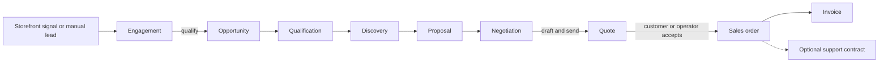

## Use This Guide For

Use **Customer** when you need to answer one of these questions:

- Who needs a response today?
- Which leads are ready to qualify?
- Which opportunities are stalled, overdue, or missing a next step?
- What did we quote, what did the customer accept, and what order or invoice followed?
- What relationship, contact, site, managed-item, and activity evidence do we hold for an account?

The Customer area is the internal relationship and revenue workspace. The public
Storefront receives interest; Customer turns that interest into owned follow-up
and a traceable commercial lifecycle.

For a **Pet Rescue** or **Animal Shelter**, the same records and permissions are
presented around the relationships the organization actually manages. The
section is titled **Adoption & community** and its primary views are **People &
partners**, **Adoption enquiries**, and **Community outreach**. Commercial
pipeline, quote, order, and sales-funnel tabs are hidden because they are not
part of the rescue's normal operating model. **Add person or partner** still
creates the canonical relationship record; it does not create a second kind of
customer database.

## The Customer Lifecycle

**Text alternative:** A storefront signal or manual lead becomes an engagement.
Qualifying an engagement creates an opportunity, which moves through
qualification, discovery, proposal, and negotiation. A sent quote can be
accepted, creating a sales order and invoice. An accepted order can later become
a support contract when that lifecycle applies.

The records are related, but they are not interchangeable. An account describes
the relationship; a contact identifies a person; an engagement records an
inbound or outbound interaction; an opportunity represents qualified commercial
work; a quote states an offer; and a sales order records an accepted commitment.

## Find the Right View

The section navigation is permission-aware:

- **Accounts** (`/customer`) — daily attention summary, revenue posture,
  duplicate review, account list, and account detail.
- **Engagements** (`/customer/engagements`) — acquisition signals, new leads,
  contact attempts, qualification, and disqualification.
- **Pipeline** (`/customer/opportunities`) — open and closed opportunities,
  weighted value, stage age, next steps, and stage exit criteria.
- **Quotes** (`/customer/quotes`) — quote status, validity, line items, acceptance,
  and the resulting order.
- **Orders** (`/customer/sales-orders`) — accepted commercial commitments.
- **Sales Funnel** (`/customer/funnel`) — the pipeline flowing into engagements,
  opportunities, and won work. When a storefront is published, the top of the
  funnel is the last 30 days of storefront interactions; when it is not, the top
  of the funnel is fed by your **direct and reseller leads** (accounts in the
  early prospect/qualified lifecycle stages), so a direct- or channel-sourced
  pipeline is represented without a storefront.
- **Marketing** (`/customer/marketing`) — acquisition strategy, campaigns,
  approval queues, publishing, and proposed automation. This tab requires the
  marketing capability and is covered in [Marketing](marketing.md).

If you do not have the required Customer or Marketing capability, DPF hides the
route rather than exposing a read-only version.

Pet Rescue and Animal Shelter organizations see the bounded relationship views
described above. Other archetypes continue to see the full commercial
navigation in this section.

## Start the Day With Attention, Not the Database

1. Open **Customer** and read the owner-first summary before expanding CRM
   detail. Pending reservations, orders, new inquiries, unworked engagements,
   overdue invoices, and approaching renewals appear as concrete follow-up work.
2. Open the recommended action that represents real customer impact.
3. In full navigation mode, expand **All CRM detail** to review revenue posture,
   duplicates, account attention signals, and the professional data grid.
4. Open an account whose card says it needs attention. The signal explains why:
   an unworked engagement, stale activity, a dormant or aging opportunity, or a
   sent/expired quote that needs a decision.
5. Record the next action in the owning record. Do not clear a warning by moving
   a stage without the corresponding customer evidence.

Simple navigation intentionally emphasizes today's work. Full navigation exposes
the wider CRM structure. A saved grid view still opens the detailed surface
directly.

When you switch Accounts or Pipeline from **List** to **Grid** or **Board**, the
domain's working scope follows you. Accounts show current customers rather than
superseded merge tombstones; Pipeline shows open qualification-through-
negotiation work. Use **All customers** or **All opportunities** beside the view
controls to include history. This scope is separate from personal saved grid
sorting, grouping, and column choices, and remains in the URL.

## Capture and Qualify a Lead

### Manual lead

1. Open **Engagements** and choose **New lead**.
2. Enter first name, email, and company; add the source or useful context in
   **Note**.
3. Create the lead. DPF creates or reuses the company account, creates the
   contact identity, and opens a new engagement together.
4. After the first response, choose **Mark contacted**.
5. Choose **Qualify → opportunity** only when an account is linked and the
   interaction represents real potential work. Choose **Disqualify** when it
   should leave the active follow-up queue.

### Storefront or connected signal

The acquisition-signal router keeps observed Storefront and connection evidence
separate from CRM commitments. Review the source and route a signal into an
engagement when a person should own follow-up. The source reference remains
visible as evidence on the engagement.

> A signal is not automatically a sales opportunity. Qualification is the
> operator's explicit boundary between observed interest and forecast work.

## Work an Opportunity

The Pipeline page groups open work into **Qualification**, **Discovery**,
**Proposal**, and **Negotiation**. Each card shows value, probability, stage age,
and whether the next step is absent or overdue.

1. Select an opportunity to open the stage inspector.
2. Confirm the source engagement, account/contact, expected value, expected
   close, and recent activity.
3. Read the stage exit criteria before changing the stage.
4. Set a concrete next activity date. A stage change without a next action can
   make the board look healthy while the deal is still unattended.
5. Use **Ask Customer Advisor** when you need help interpreting the evidence or
   preparing the next step; the operator remains responsible for the stage.

DPF flags dormant work and “rotting” stages based on stage age. Treat those flags
as review prompts, not automatic proof that a deal is lost. Close an opportunity
won or lost only when the customer outcome is known.

## Quote, Accept, and Fulfil

1. Open the opportunity and choose **Draft quote**.
2. Confirm the line description, quantity, unit price, currency, and the
   automatically proposed 30-day validity window.
3. Open the quote detail and review totals, discount, tax, terms, notes, and the
   related opportunity.
4. Choose **Mark as sent** when the quote has actually left the business. A sent
   quote exposes a customer acceptance link when an acceptance token exists.
5. Use **Accept quote → create order** only with acceptance evidence. Acceptance
   deterministically creates the sales order and generates the invoice; it is
   not a cosmetic status change.
6. Confirm the linked order on the quote and then review **Orders** and the
   invoice in Finance.

An operator can record acceptance when handling an offline confirmation, while a
customer can accept through the public quote link. In either case, preserve who
accepted, when, and through which channel in the activity or quote evidence.

## Maintain the Account Record

Account detail is the relationship history, not just a contact card. It includes:

- contacts, notification preferences, inactive and **Do not contact** status;
- the activity timeline and linked opportunities;
- parent, subsidiary, duplicate-merge, and merge-tombstone relationships;
- prospect-to-active-customer conversion;
- accepted orders that can become support contracts;
- customer sites, nested sublocations, and managed configuration items;
- lifecycle attention, evidence source, renewal/end-of-support dates, and
  archetype-specific charge models;
- the account's **value-stream position** — where the relationship sits in the
  operational value stream (Capture → Qualify → Deliver → Retain), shown next to
  its status. Opening an opportunity moves a prospect to *qualified*, and winning
  a deal activates the account; you can always override the status from **Edit**;
- for active, recurring customers, a **Retain** panel — recurring revenue
  (MRR/ARR), a churn-risk health signal, and the next renewal date, with a prompt
  to reach out before an at-risk account churns. The revenue cockpit rolls the
  same recurring revenue and at-risk count up across the workspace;
- approved billable-time economics where the selected business profile enables
  that workflow.

Merge duplicate accounts from the account page only after comparing contacts,
history, and the intended surviving record. A merged account is retained as a
superseded tombstone and excluded from normal lists; **Unmerge** is available
when the merge itself was wrong.

### Correct or Retire an Account

You can keep the record truthful from the account page itself, without touching
the database:

- **Edit** — change the account name, status, industry, website, and notes. Use
  the status field to reclassify a mislabelled record — for example move an
  account that was set to **Active** in error back to **Prospect**.
- **Archive** — retire an account with no surviving successor. It is hidden from
  active account lists but keeps its full history and stays reachable by direct
  link, so you can change its status back later. Nothing is deleted.
- **Remove an opportunity** — strip a fabricated or erroneous opportunity
  entirely, with a confirm step. If the opportunity already has quotes, void
  those quotes first and then remove it.
- **Cancel a support contract** — cancel a subscription from the contract card
  when the deal it represents is not real.

Every one of these actions is recorded on the account timeline, so a correction
is auditable rather than silent.

## Evidence and Recovery Checklist

Before advancing a customer record, confirm:

- **Identity:** correct company and contact; duplicate review complete.
- **Source:** the storefront event, note, call, email, meeting, or connected
  signal that explains why the record exists.
- **Ownership:** assigned operator and a dated next step.
- **Commercial basis:** expected value and probability are estimates, while
  quote totals, acceptance, orders, and invoices are commitments.
- **Communication constraints:** preferred channel and **Do not contact** status
  are respected.
- **Lifecycle evidence:** renewal, support, version, and managed-item decisions
  cite their source instead of relying on an unexplained status.

If the pipeline looks wrong, work backward through the chain: order → quote →
opportunity → engagement → source signal. Correct the earliest inaccurate record
and then reconcile downstream statuses. Do not create replacement records merely
to make a dashboard count look right.

## Market Intelligence — research a prospect on request

The **Market Research Analyst** coworker (on the **Opportunities** page, and
summonable from anywhere) researches a prospect or market segment on request: the
software tools they likely use, what those tools cost, and which of them the
platform could replace. It reads your CRM opportunities and accounts (read-only)
to ground the brief, researches the public web, and returns a **cited** brief tied
to a specific opportunity.

Ask it things like "research the likely software stack for this prospect and what
we can replace," or "size the replaceable spend for my strongest opportunity." It
never presents an unsourced number as fact — every figure is cited to a source it
retrieved, or clearly labelled as an estimate range. Use it to size the core
pitch (how many tools the platform consolidates) before a sales conversation.

## Related Guides

- [Marketing](marketing.md)
- [Storefront setup and launch](../storefront/setup-and-launch.md)
- [Storefront inbox and enquiries](../storefront/inbox-and-enquiries.md)
- [Accounts receivable](../finance/accounts-receivable.md)
- [Reporting and close](../finance/reporting-and-close.md)
