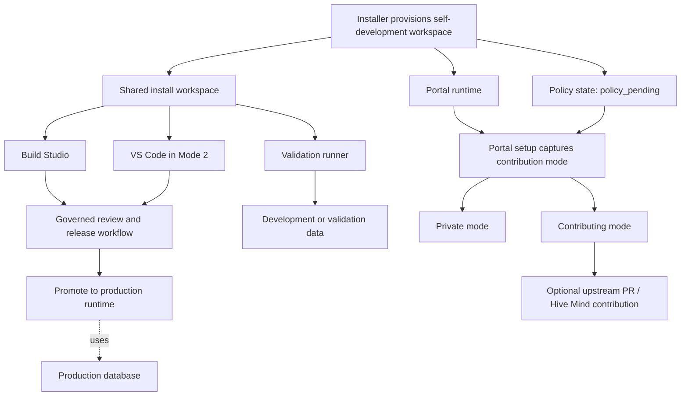

## Overview

Digital Product Factory uses one shared development workspace per install.

That means:

- Build Studio and portal-governed workflows always work from the same local codebase
- in customizable installs, VS Code works from that same codebase too
- production remains a separate runtime
- validation runners remain disposable environments for preview, build, tests, and migration rehearsal

The platform is designed so that authoring can happen in more than one interface without creating multiple drifting source trees.

## Mode 1 vs Mode 2

Both install modes support self-development and later contribution choices in the portal.

The difference is the interface surface:

- **Mode 1: Ready to go**
  - use Build Studio as the guided authoring surface
  - no direct VS Code workflow is assumed
- **Mode 2: Customizable**
  - use Build Studio and VS Code together
  - both work from the same shared workspace and install branch

Contribution policy is configured later in the portal for both modes.

## Policy States

Every self-developing install begins in `policy_pending`.

### `policy_pending`

- editing and validation are allowed
- production promotion is blocked
- upstream contribution is blocked

### `private`

- governed promotion to this install's production runtime is allowed
- upstream contribution stays disabled

### `contributing`

- governed promotion to this install's production runtime is allowed
- governed upstream contribution is allowed
- local backlog items, epics, and platform issue reports can be mirrored upstream as GitHub Issues on the Hive Mind repo — useful for users who don't run Build Studio and would rather have items addressed by the project team

This lets people begin working before they have decided how their install should participate in the Hive Mind.

Contributions carry a **stable pseudonym** (`dpf-agent-<shortId>`) that is the same across every commit, PR, and issue raised by the install. Real identity (name, email, hostname) stays on the local install and never reaches the upstream repository. The pseudonym lets the community recognize repeat contributors without exposing anyone's personal identity. Admins can see their install's pseudonym on the Platform Development page.

## Shared Workspace

The shared workspace is the local code truth for the installation.

It is:

- the codebase Build Studio reads and writes
- the codebase VS Code reads and writes in customizable installs
- the source used to seed validation runners
- the place where the install's durable branch lives

The recommended branch pattern is:

- one durable branch per install, such as `install/<install-slug>`
- short-lived export branches only when preparing an upstream PR

## Production, Development, And Validation Data

One shared codebase does not mean one shared mutable database.

- **Production runtime**
  - live portal and live production database
- **Shared development data**
  - production-like, sanitized or safely cloned data for realistic debugging
- **Validation data**
  - transient clone or resettable environment for tests, previews, and migration rehearsal

This keeps debugging realistic without corrupting production records.

## Build Studio And VS Code

### Build Studio is responsible for

- guided feature development
- regulated review and evidence capture
- portal-governed production promotion
- portal-governed upstream contribution

### VS Code is responsible for

- advanced editing and debugging
- direct source access
- developer tooling that Build Studio does not yet fully replace

The key point is that these are two interfaces over one workspace, not two development systems.

## Architecture Diagram

## Related

- [Build Studio](build-studio/index)
- [Build Studio Sandbox](build-studio/sandbox)
