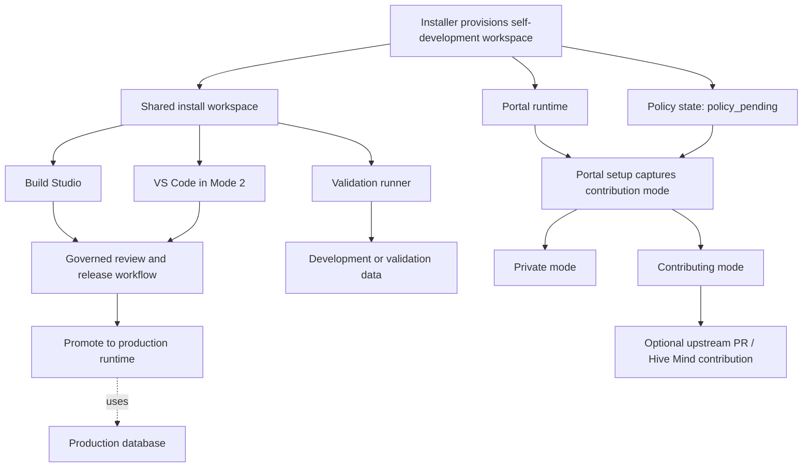

## Overview

Digital Product Factory uses one shared development workspace per install.

That means:

- Build Studio and portal-governed workflows always work from the same local codebase
- in customizable installs, VS Code works from that same codebase too
- production remains a separate runtime
- validation runners remain disposable environments for preview, build, tests, and migration rehearsal

The platform is designed so that authoring can happen in more than one interface without creating multiple drifting source trees.

## Mode 1 vs Mode 2

Both install modes support self-development and later contribution choices in the portal.

The difference is the interface surface:

- **Mode 1: Ready to go**
  - use Build Studio as the guided authoring surface
  - no direct VS Code workflow is assumed
- **Mode 2: Customizable**
  - use Build Studio and VS Code together
  - both work from the same shared workspace and install branch

Contribution policy is configured later in the portal for both modes.

## Policy States

Every self-developing install begins in `policy_pending`.

### `policy_pending`

- editing and validation are allowed
- production promotion is blocked
- upstream contribution is blocked

### `private`

- governed promotion to this install's production runtime is allowed
- upstream contribution stays disabled

### `contributing`

- governed promotion to this install's production runtime is allowed
- governed upstream contribution is allowed
- local backlog items, epics, and platform issue reports can be mirrored upstream as GitHub Issues on the Hive Mind repo — useful for users who don't run Build Studio and would rather have items addressed by the project team

This lets people begin working before they have decided how their install should participate in the Hive Mind.

Contributions carry a **stable pseudonym** (`dpf-agent-<shortId>`) that is the same across every commit, PR, and issue raised by the install. Real identity (name, email, hostname) stays on the local install and never reaches the upstream repository. The pseudonym lets the community recognize repeat contributors without exposing anyone's personal identity. Admins can see their install's pseudonym on the Platform Development page.

## Shared Workspace

The shared workspace is the local code truth for the installation.

It is:

- the codebase Build Studio reads and writes
- the codebase VS Code reads and writes in customizable installs
- the source used to seed validation runners
- the place where the install's durable branch lives

The recommended branch pattern is:

- one durable branch per install, such as `install/<install-slug>`
- short-lived export branches only when preparing an upstream PR

## Platform Updates And Notifications

The portal has two related update paths, and they answer different questions.

### Shared-workspace update banner

The banner at the top of the portal is the operator-facing signal that a newer platform image is present but the install's shared workspace still needs attention.

On portal bootstrap, the runtime compares:

- the running image version from `/app/.dpf-image-version`
- the shared workspace version from `/workspace/.dpf-version`

If the versions match, nothing is shown. If the image is newer and the shared workspace has no user changes, the bootstrap refreshes the managed source workspace from the image and clears the pending-update flag.

If the image is newer and the shared workspace has local/source changes, the bootstrap does not overwrite them. Instead it writes `PlatformDevConfig.updatePending = true` and stores the image version in `PlatformDevConfig.pendingVersion`. Users with `manage_platform` see a portal banner that links to **Admin > Platform Development**, where the **Apply update** panel merges the new platform source into the install's `my-changes` branch.

The apply action preserves customisations. A clean merge writes the new `.dpf-version` value and clears the banner. If Git reports conflicts, the merge pauses in the shared workspace and the panel lists the conflicted files for review instead of guessing a resolution.

This banner is not a browser polling loop. It reflects the latest server-side platform-development state whenever the shell renders. The state is normally changed by bootstrap/redeploy work, or by the apply action clearing a completed update.

### Governed self-upgrade runner

The operations self-upgrade path is separate from the shared-workspace banner. It lives at `/ops/self-upgrade` and records `SelfUpgradeRun` history for governed portal upgrades.

When scheduled Inngest functions are enabled for the install and `PlatformConfig["self_upgrade"].enabled` is true, the `ops/self-upgrade-scheduled` function runs hourly. Each run checks the configured target branch, skips when the install is disabled, outside its maintenance window, already up to date, missing a target, or already running an upgrade, and otherwise runs the same quiescence, promotion, health, and rollback path used by manual self-upgrade requests.

The manual operation uses the `ops/self-upgrade.run` event and the same runner. This path answers "can the running portal upgrade itself under governed operations controls?" The shared-workspace banner answers "does the local install workspace need to merge newer platform source?"

## Production, Development, And Validation Data

One shared codebase does not mean one shared mutable database.

- **Production runtime**
  - live portal and live production database
- **Shared development data**
  - production-like, sanitized or safely cloned data for realistic debugging
- **Validation data**
  - transient clone or resettable environment for tests, previews, and migration rehearsal

This keeps debugging realistic without corrupting production records.

## Build Studio And VS Code

### Build Studio is responsible for

- guided feature development
- regulated review and evidence capture
- portal-governed production promotion
- portal-governed upstream contribution

### VS Code is responsible for

- advanced editing and debugging
- direct source access
- developer tooling that Build Studio does not yet fully replace

The key point is that these are two interfaces over one workspace, not two development systems.

## Architecture Diagram

```mermaid
flowchart TD
    installer[Installer provisions self-development workspace] --> workspace[Shared install workspace]
    installer --> portal[Portal runtime]
    installer --> pending[Policy state: policy_pending]

    workspace --> bs[Build Studio]
    workspace --> vscode[VS Code in Mode 2]

    workspace --> validate[Validation runner]
    validate --> devdb[Development or validation data]

    portal --> setup[Portal setup captures contribution mode]
    pending --> setup
    setup --> private[Private mode]
    setup --> contributing[Contributing mode]

    bs --> review[Governed review and release workflow]
    vscode --> review

    review --> prod[Promote to production runtime]
    contributing --> pr[Optional upstream PR / Hive Mind contribution]

    prod -. uses .-> proddb[Production database]
```

## Related

- [Build Studio](build-studio/index.md)
- [Build Studio Sandbox](build-studio/sandbox.md)
- [Agent Development Environments](contributing/agent-dev-environments.md) — Claude, Codex, and Grok (desktop apps or CLI) as governed coding agents: MCP, skill pack, AGENTS.md, local settings, and managing multiple concurrent threads
