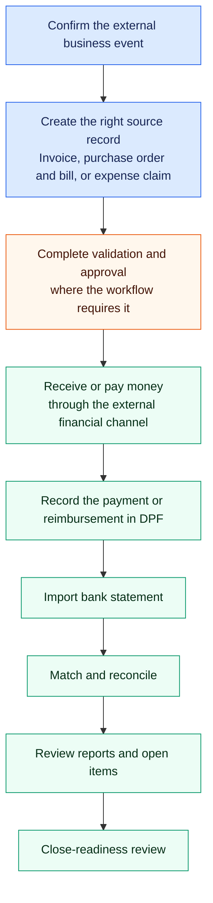

## Overview

The Finance area handles your organization's core financial operations: billing customers, managing supplier relationships, and processing purchases. It is not a full accounting system, but covers the transactional layer that connects to your products and services.

Text alternative: confirm the external event, create the right source record,
complete any required validation or approval, move money through the external
financial channel, and record the payment or reimbursement in DPF. Then import
bank activity, reconcile it, review reports and open items, and complete a
close-readiness review. The source record is an invoice for a receivable, a
purchase order and bill for a payable, or a claim for an employee expense.

## Key Concepts

- **Invoice** — A billable document sent to a customer for products or services delivered. Invoices track their own status through draft, sent, and paid states.
- **Supplier** — An external party your organization purchases goods or services from. Supplier records hold contact details, payment terms, and transaction history.
- **Bill** — An incoming payable from a supplier. Bills are matched against purchase orders where applicable.
- **Purchase Order (PO)** — A formal request to a supplier to deliver goods or services at an agreed price. POs can be raised before the work starts and matched to the resulting bill.
- **Payment** — DPF's record that money was received or paid. Creating this
  record does not initiate a transfer, charge a card, or confirm bank
  settlement.
- **Reconciliation** — The explicit match between an imported bank transaction
  and a recorded payment.

## What You Can Do

- Create, send, and mark invoices as paid
- Manage your supplier directory and update payment terms
- Record incoming bills and match them to purchase orders
- Raise purchase orders and track their fulfillment status
- Review outstanding payables and receivables at a glance
- Sort your captured drives and see what the business owes you for them
- Monitor AI providers as finance-owned suppliers, including draft contracts, open setup work items, and linked billing/usage pages
- Review committed AI spend and setup gaps from the dedicated `/finance/spend/ai` workspace

## Burn, Revenue, and Runway

The finance overview carries a money-health row: **Monthly Burn**, **Monthly
Revenue**, **Runway**, and **Money Health**. These are computed from what is
actually recorded — paid bills and expenses over the trailing 90 days plus
known supplier-contract commitments for burn, paid invoices for revenue, and
bank balances for runway.

When nothing is recorded, the cards say **Unknown** or **Not recorded** and
link to the place to record it. An empty book is never shown as a healthy
$0.00, and "all up to date" appears only when there are real invoices to be up
to date on. When money is going out with no revenue recorded, Money Health
flags **Pre-revenue** so a shrinking cash position is said plainly. The Finance
Controller coworker reviews the same state on a schedule and tells you what to
record or watch.

## Before You Record Money Movement

- Confirm the real event in the bank, processor, payroll, or supplier/customer
  evidence.
- Check direction, amount, currency, date, counterparty, reference, and the
  invoice, bill, claim, or contract being settled.
- Resolve required approvals first. A status change affects queues and reports
  even when no external money moved.
- Preserve source documents and approval evidence. DPF is an operational
  finance layer, not the only evidence source or a replacement for qualified
  accounting judgment.

## Choose The Workflow

- [Accounts receivable](accounts-receivable.md) — invoice customers, record
  receipts, and preserve the collection evidence chain.
- [Accounts payable](accounts-payable.md) — manage suppliers, purchase orders,
  bill approvals, and recorded payments.
- [Expense workflows](expense-workflows.md) — submit, review, and record
  employee reimbursement.
- [Banking and reconciliation](banking-and-reconciliation.md) — import statement
  activity and match it to recorded payments.
- [Reporting and close](reporting-and-close.md) — understand report basis,
  caveats, and close-readiness without implying a period lock.
- [Controls and automation](controls-and-automation.md) — govern recurring
  invoices, dunning, tax, currency, approvals, and payment runs.
- [AI spend](ai-spend.md) — manage provider supplier bridges, contracts,
  allowances, and subscription-payment records.

## Owner-first overview (food & hospitality)

For restaurants, bakeries, and caterers (the **food-hospitality** archetype), the `/finance` overview opens with **"what money needs attention today?"** instead of an accountant-shaped dashboard, and the money jobs it shows are matched to your specific business.

**Restaurant**

- **Deposits & event balances** — booking deposits and private-dining balances still to collect
- **Order & ticket payments** — money coming in from table orders, tickets, and covers
- **Overdue payments** — guest and private-dining payments past their due date
- **Supplier bills** — food, drink, and supplier bills waiting to be paid
- **Payouts & reconciliation** — card payouts landing in the bank, matched back to sales
- **No-show & cancellation fees** — charge a fee when a guest no-shows or cancels late

**Catering**

- **Event deposits & balances** — deposits securing dates, and balances due after events are delivered
- **Event payments received** — money in from catering jobs and events
- **Overdue event payments** — corporate and event invoices past their due date
- **Ingredient & staffing bills** — food, drink, and staffing costs for upcoming events
- **Payouts & reconciliation**
- **Quote a catering job** — price a corporate, wedding, or private event before you commit

**Bakery**

- **Custom order deposits & balances** — deposits and balances on celebration and wedding cakes
- **Counter & order takings** — money in from counter sales and collected orders
- **Overdue order payments** — custom and wholesale orders past their due date
- **Ingredient & supplier bills** — flour, dairy, packaging, and supplier bills
- **Payouts & reconciliation**
- **Bill a custom order** — take a deposit on a celebration or wedding cake

A food-hospitality business that isn't one of those three sees a neutral food/drink set of the same jobs.

Accounting internals — VAT/tax remittance, dunning reminders, payment runs, ledger and P&L reports, bank rules, and AI spend — are kept one tap away under a collapsed **"Accounting & admin"** section. Every other business type keeps the standard finance overview.

### Readiness notes

**Draft readiness note** asks the Finance Specialist coworker to write up the position shown on the overview: 3–5 bullets covering what needs attention, why it matters, and the safest next action. The note is drafted from the figures on screen — the coworker is instructed not to invent numbers, and to omit anything it has no figure for.

It is a **draft for you to review**. Nothing is sent to anyone, no action is taken on your behalf, and the note will not claim money has been paid or moved — recording a payment in DPF is not a bank transfer. If your finances aren't set up yet, the note explains what to set up first instead.

## Recording a payment run

A payment run (`/finance/payment-runs`) **records the selected approved bills as paid in DPF** and writes a matching outbound payment. It is **not a draft** and does **not** initiate a real bank transfer — pay your suppliers through your bank as usual, then use a payment run to keep your books settled. The action is labelled **"Record as Paid"** to make this explicit.

## Mileage

If you drive for work, the mobile app can record your drives so you do not keep a
paper log. Drives show up at `/finance/mileage`.

**Turn it on first.** The app asks before it records anything. Nothing is captured
until you agree, and you can turn it off at any time. Personal drives stay yours —
only the ones you mark business are ever claimed.

**Sort each drive.** Every drive is business, personal, or commute. Tap once to
choose. You can change your mind until the drive is claimed.

**What you are owed.** A drive is priced at the rate in force on the day you drove
it, not today's rate. A drive that has not been priced yet says so, rather than
showing zero — no amount yet is not the same as nothing owed.

**Driving abroad.** Your phone knows which country it is in, so you are never asked
to pick one. If your company has set a rate for the country you drove in, that rate
is used. If it has not, you are paid at your own country's rate — the country on
your employee record. A drive that crosses a border is paid at the rate for the
country you set off from.

If your phone could not work out the country — no signal, or you did not give it
permission — you are still paid, at your own country's rate. You never lose a
drive over it.

**Getting paid.** Someone with finance permission turns a month of business drives
into an expense claim. That claim can be paid on its own or added to your pay as a
reimbursement, which is not taxed because it repays money you already spent.

Mileage appears in the mobile app only on installs that use it. A business whose
staff do not drive to customers will not see it.

## Reporting And Close Boundaries

Current profit-and-loss and finance-period summaries are cash-basis: paid
invoices count as income, while paid bills and paid expense claims count as
expense. Open receivables, payables, and claims are shown as gaps or pending
work rather than paid totals. Multi-currency summaries can contain raw,
unconverted sums and explicitly flag that limitation.

`/finance/close` is a readiness hub. It does not lock a period, prevent later
edits, post a close journal, or certify results. Complete the organization's
authoritative accounting close and retain its reviewer evidence separately.

## Route Guide

- `/finance` — Finance overview workspace
- `/finance/invoices` and `/finance/payments` — customer billing and recorded receipts
- `/finance/suppliers`, `/finance/purchase-orders`, and `/finance/bills` — supplier commitments and payables
- `/finance/expense-claims` and `/finance/my-expenses` — reviewer and employee expense workflows
- `/finance/mileage` — your own captured drives, sorted business or personal
- `/finance/banking` — statement import, rules, and reconciliation
- `/finance/reports` and `/finance/close` — reporting and close-readiness
- `/finance/spend` — spend hub for suppliers, bills, expenses, and AI spend summary
- `/finance/spend/ai` — dedicated AI supplier spend and utilization workspace
- `/finance/suppliers/[id]` — supplier detail, including AI finance context when the supplier is linked to a provider
