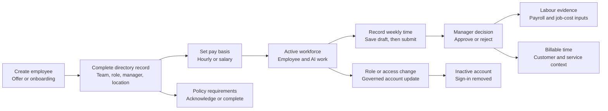

## What the People Area Owns

Open **People** at `/employee` to maintain the workforce record and see how employees and AI coworkers contribute to the business. The page combines six views:

- **Directory** — employee identity, organization placement, lifecycle dates, contact details, addresses, and pay basis
- **Grid** — the same employee records in the shared workbook-style grid
- **Workforce** — current work, concerns that need an operator, and a unified employee/AI roster
- **Org Chart** — reporting lines and employees who do not yet have a manager
- **Timesheets** — weekly time entry, manager approval, and optional customer/service billing context
- **My Policies** — policy acknowledgements and requirements assigned to the signed-in user

The page leads with staffing readiness and work that needs attention. Role IDs, oversight levels, service-level targets, and user access remain available under **Role governance & access** in full navigation mode.

## Workforce Operating Loop

## Start With the Daily Attention View

Use **Workforce** when you need to answer “who or what needs attention?” before editing records.

1. Review **Needs you** for unowned service-level commitments, approvals, and open handoffs.
2. Address **Act now** concerns before lower-severity watch items.
3. Review **Workforce at work** to see active builds and engagements, their phase, and whether an employee, AI coworker, or nobody owns them.
4. Use the roster below the activity view to inspect employee and AI members together.
5. For an AI coworker, check its work role, employee-role parity, approval/interface owner, oversight level, provider/model, and token budget before changing responsibility elsewhere.

This view is an operating projection, not a substitute for the underlying build, engagement, employee, or agent record.

## Create an Employee Record

From **Directory**, select **New Employee**.

1. Enter the employee’s first and last name. Add a display name if the everyday name should differ.
2. Add work and personal email plus work, mobile, and emergency phone details as appropriate.
3. Choose an initial status:
   - **Offer** for a person who has not started onboarding
   - **Onboarding** for a person completing start activities
   - **Active** only when they should count as current workforce
4. Set the start date when it is known.
5. Assign the department, position, employment type, work location, and manager.
6. Create the employee and confirm the card appears in the directory with the expected status and reporting line.

The employee profile and the platform user account are related but distinct records. Creating an employee does not silently create credentials, set a password, or grant platform access.

### Check Organization Placement

Use the directory’s **Group by manager** option to find missing or unexpected reporting lines. The **Org Chart** provides a tree view and a separate unassigned section. Treat “No manager,” “Unassigned,” and “Unset” as data-quality signals when the person should already have an established placement.

The directory’s detail panels show lifecycle dates, contact information, organization assignment, reference coverage, and recent append-only lifecycle events. Use the event history as evidence of what changed; do not rewrite prior events to make the current record look cleaner.

## Set Compensation Inputs

The **Pay** panel on the Directory view stores how a person is paid:

- **Hourly** requires a positive hourly rate.
- **Salary** requires a positive annual salary and a positive number of periods per year.

Select the employee, choose the pay type, enter the value, and select **Save pay**. The stored basis feeds labour costing and payroll-earnings calculations.

> **Important:** saving Pay does not run payroll, create a bank payment, file taxes, or pay the employee. It records calculation inputs. Use the relevant finance, banking, and statutory processes for actual disbursement and remittance.

Changing the pay type leaves the other type’s prior stored value in place; the selected pay type determines which value is active. Verify the displayed result after every change.

## Record and Approve Time

Open **Timesheets** while signed in as a user linked to an employee profile.

### Employee workflow

1. Use the week arrows to choose the correct week.
2. Enter hours by day.
3. Where billable time is enabled for the organization’s financial profile, choose the customer and service for billable entries.
4. Select **Save Draft** while the week is incomplete.
5. Review the total and billing context, then submit.

A draft or rejected timesheet can be edited. A submitted timesheet waits for a manager decision. An approved timesheet is locked, and entries already attached to an invoice keep their billing fields locked.

### Manager workflow

Managers see submitted periods in the pending-approval panel.

1. Confirm the employee, week, total hours, and any billable context.
2. **Approve** only when the time is complete and correctly classified.
3. **Reject** with a useful reason when the employee must correct it.
4. Ask the employee to edit the rejected period and resubmit it.

Do not approve time merely to clear the queue. Approval turns the period into downstream evidence for payroll, labour economics, job costing, and—when enabled—customer billing.

If Timesheets reports that no employee profile is linked to the account, establish that link before treating the page as a time-recording surface.

## Complete Personal Policy Work

Open **My Policies** for the signed-in user’s own requirements.

- Acknowledge a policy after reading the published policy it references.
- Complete an assigned requirement only after the required action is actually done.
- Use the completed section as evidence of prior acknowledgement or completion.

An acknowledgement records receipt; it does not prove competence, legal advice, or completion of a separate training requirement.

## Manage Roles and Account Access

In full navigation mode, open **Role governance & access** below the People views.

- Review each platform role’s ID, description, minimum oversight level, service-level target, and assignment count.
- Treat an unassigned role as a coverage signal, not automatically as a hiring request.
- In **HR user lifecycle**, select a platform user, choose the role, and set the account active or inactive.
- Save the change and confirm the result message.

Deactivating a user removes sign-in access. It does not delete the employee profile or historical evidence, and it is reversible by reactivating the account. Password setup and reset remain under **Admin**, not People. Superuser accounts require a superuser to change.

For an exit, coordinate the employee status and end-date evidence, account deactivation, ownership handoffs, outstanding time, and any offboarding tasks. Do not use account deactivation alone as proof that the full exit process is complete.

## What Is Not Yet a People-Page Workflow

The platform contains service logic and reusable components for leave requests, onboarding/offboarding checklists, and performance reviews, but the current `/employee` tab set does not expose those as complete operator workflows. Do not tell employees to look for a Leave or Reviews tab, and do not treat those capabilities as operational until a routed screen and its permissions have been verified.

Similarly, the lifecycle timeline is visible evidence, but the current page does not provide a general-purpose control for manually appending every possible lifecycle event.

## Evidence and Recovery Checklist

After a workforce change, confirm the relevant evidence:

- directory status, department, position, manager, and location
- org-chart placement or intentional lack of a manager
- compensation basis and currency
- timesheet state, approver, approval date, or rejection reason
- customer/service context for billable hours
- policy acknowledgement or requirement completion
- platform role, HITL tier, and active/inactive account state
- append-only lifecycle event and effective date where one was produced

If a change is wrong, prefer the supported corrective action: edit a draft or rejected timesheet, reject a submitted period with a reason, restore an account’s active state, or make a new governed lifecycle correction. Preserve the prior audit evidence.
