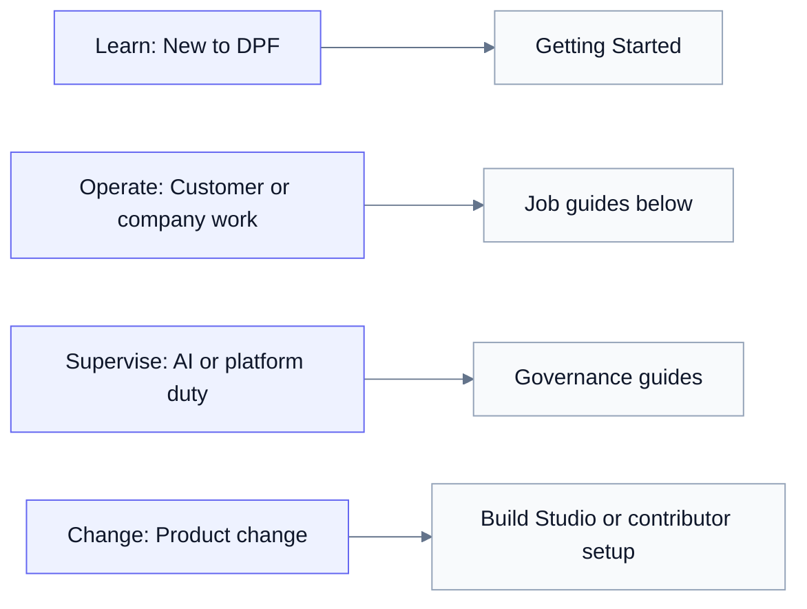

The User Guide is the day-to-day operating manual for everyone who works in Open Digital Product Factory (DPF). These pages are bundled into the portal's in-app help, so the guidance in the repository and the guidance available from the product stay together.

DPF is a local-first operating environment for one organization. Use this guide to understand the job you are doing, the part of the platform that supports it, and where to go next. If you are brand new, begin with [Getting Started](getting-started/index.md).

## Choose your path

**Text alternative:** New users start with Getting Started. Day-to-day operators use the job guides below. People supervising AI or platform services use the governance guides. People changing DPF use Build Studio or the contributor setup.

### Find a guide quickly

Use **Search docs** in the guide sidebar when you know the task or outcome but
not its area. Search ranks page titles first, then the page summary, then the
workflow body. Results show a short description so you can choose the right
page before opening it. Terms from later sections such as recovery,
verification, or evidence are searchable too; they are not limited to the
opening paragraph.

### Quick paths by responsibility

- **Owner or operator:** start with [Getting Started](getting-started/index.md),
  then use [Business Operations](workspace/index.md), [Storefront](storefront/index.md),
  [Customers](customers/index.md), and [Finance](finance/index.md).
- **Team, product, or architecture lead:** begin in [Business Operations](workspace/index.md), then move to [Product Inventory](products/index.md), [Portfolios](portfolios/index.md), [Enterprise Architecture](architecture/index.md), or the domain guide for the work you own.
- **Administrator or AI supervisor:** use [AI Workforce](ai-workforce/index.md), [Platform](platform/index.md), [Security Operations](security/index.md), and [Admin](admin/index.md).
- **Builder or contributor:** choose [Build Studio](build-studio/index.md) for the governed intake-to-ship workflow, or [Contributing & Dev Setup](contributing/index.md) when working directly with source control and an external development environment.

## Start here

- [Getting Started](getting-started/index.md) — understand what DPF does for your business, choose your business type, orient yourself during the first hour, and find your AI coworker.
- [Market Archetypes and Coworkers](market-archetypes.md) — see how the selected business type shapes the portal, workspace, vocabulary, coworkers, voice, and marketing posture.
- [Setup and First Login](getting-started/setup-and-first-login.md) — follow the first-run setup and sign-in walkthrough.
- [AI Coworker](getting-started/ai-coworker.md) — learn how to work with the context-aware assistant available throughout the platform.
- [Roles and Access](getting-started/roles-and-access.md) — understand the platform roles and the access each one provides.

Changing DPF's own source code is a separate job with a separate setup. Use [Contributing & Dev Setup](contributing/index.md) for the complete contributor path and [Development Workspace](development-workspace.md) for the worktree, branch, and verification model.

## Serve customers and deliver work

Use these guides when the work begins with a customer need and ends with a delivered product, service, or operating outcome.

- [Business Operations](workspace/index.md) — manage current work, documents,
  and activity, then use Performance for authorized owner/manager trends.
- [Customers](customers/index.md) — work with customer accounts, the sales pipeline, and marketing.
- [Platform Operations](operations/index.md) — manage the delivery backlog,
  infrastructure discovery, and value-stream operations.
- [Storefront](storefront/index.md) — configure the public-facing storefront, catalog, inbox, fulfilment, and operating settings.

## Run the company

Use these guides for the internal systems that keep the organization healthy, accountable, and investable.

- [Finance](finance/index.md) — handle invoicing, accounts payable and receivable, banking and reconciliation, AI spend, controls, automation, and reporting.
- [HR & Workforce](hr/index.md) — manage employees, roles, and lifecycle foundations.
- [Portfolios](portfolios/index.md) — track portfolios, health metrics, investment, and strategic direction.
- [Product Inventory](products/index.md) — manage products, lifecycle stages, and business-model roles.
- [Enterprise Architecture](architecture/index.md) — model business, application, and technology structure; processes and workflows; system requirements; and the value streams they support.
- [Compliance](compliance/index.md) — manage regulations, controls, evidence, audits, incidents, and regulatory submissions.

## Supervise the platform

Use these guides when you are responsible for AI behavior, platform services, access, security, or governed knowledge.

- [AI Workforce](ai-workforce/index.md) — configure providers, understand model-routing lifecycle and decision perspective, and govern AI cost.
- [Priority, Outcomes & Calibration](ai-workforce/priority-and-outcomes.md) — set a cost / quality / time priority in plain terms, see what actually ran against it, and let the platform propose a better-fitted default.
- [How Governed Work Actually Runs](ai-workforce/how-governed-work-runs.md) — one pass end to end: the room, the shape that bounds it, the pace it sets, the corpus it consults, the gate on the tool, and the receipt you review.
- [Platform](platform/index.md) — operate AI services, Edge Nodes, identity and access, authority and audit, tools, and integrations.
- [Security Operations](security/index.md) — use the built-in AI security operations center for sources, detections, cases, governed response, compliance, and MSP federation.
- [Admin](admin/index.md) — configure administrator-only platform settings.
- [Platform Wiki](wiki/index.md) — work with governed platform knowledge, founder-kernel pages, principles, and citations.

## Change the platform

DPF supports more than one governed development surface. Choose the path that matches the work rather than treating any one interface as mandatory.

- [Build Studio](build-studio/index.md) — use the guided intake, design, build, review, and ship pipeline when Build Studio is the right executor.
- [Contributing & Dev Setup](contributing/index.md) — prepare a direct contribution from a supported external development environment.
- [Development Workspace](development-workspace.md) — understand worktree isolation, branches, verification environments, and the path from local work to a pull request.

## Architecture and standards

The [Enterprise Architecture guide](architecture/index.md) explains how operators model their own organization inside DPF. For DPF's runtime architecture, Trusted AI Kernel (TAK), Global AI Agent Identification & Governance (GAID) standard, and platform conformance assessment, continue to the [contributor Architecture section](../architecture/platform-overview.md). Those pages explain the platform's design and governance; they are not required for ordinary day-to-day operation.

## Specifications and plans

Long-form design specs, audits, and implementation plans are kept in the source repository under [`docs/superpowers/`](https://github.com/OpenDigitalProductFactory/opendigitalproductfactory/tree/main/docs/superpowers). They are historical records of how each capability was built, not onboarding material. Use them when you need the rationale behind a design decision; you do not need them to operate the platform.

## Documentation freshness

Documentation is part of DPF's delivery definition of done. Build Studio and external Claude, Codex, and Grok implementation threads update the user guide, public site, architecture docs, `AGENTS.md`, or implementation history when a change affects those audiences. When a change does not need documentation, the build or pull request records a concrete reason.
