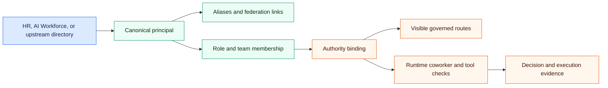

## Use This Doc For

- `/platform/identity`
- `/platform/identity/agents`
- `/platform/identity/applications`
- `/platform/identity/authorization`
- `/platform/identity/directory`
- `/platform/identity/federation`
- `/platform/identity/groups`
- `/platform/identity/principals`

## Read The Identity Model

DPF uses one principal spine to connect a person, AI coworker, or service
identity to aliases, groups, route access, and governed authority. Upstream
directories can supply identity facts, but DPF retains local control over
platform roles, route bundles, coworker associations, and tool execution.

**Your install is the directory.** People, AI coworkers and service accounts are
published as one tree that ordinary directory tools can read over a secure
connection, so existing software can look up who works here without a separate
identity product. The tree is built from the principal spine and is read-only:
you change identity in DPF, and the directory follows. Its address is derived
from your organization, so it reads as your namespace rather than a generic one.

**Serving it is a choice you make.** The directory is off until you turn it on,
because an install should not start answering an identity protocol just because
it was upgraded. **Platform → Identity → Directory** tells you which of three
things is true: it is serving, it is not served, or it was turned on and failed
to start — with the reason. Turning it on needs your organization's own CA,
because the connection is secured with your certificate and there is no
self-signed fallback. See [serving the directory](../../install/serve-the-directory.md).

**Two consequences worth knowing.** Disabling a principal now ends its ability to
sign in immediately, rather than waiting for a sync — authority and sign-in can
no longer drift apart. And people sign in with a password, while AI coworkers and
service accounts identify with a certificate from your organization's own
authority: they have no password to steal, guess or leak.

Text alternative: identity facts enter through HR, AI Workforce, or an
upstream directory and resolve to one canonical principal. Aliases and group
membership connect that principal to authority bindings. Bindings shape route
visibility, while runtime checks decide whether a particular coworker or tool
action may execute and record the result for audit.

## Choose The Right Surface

| Surface | Use it to answer |
| --- | --- |
| **Principals** | Which canonical employee or coworker identity does this record represent, and which aliases point to it? |
| **Groups** | Which platform role, business group, team membership, or coworker ownership connects this principal to work? |
| **Authorization** | Which shared binding gives a subject access to a governed resource, with what status and evidence? |
| **Directory** | What identity and group state can DPF project for directory-compatible consumers? |
| **Federation** | Which upstream authority is connected, and which facts remain upstream versus locally governed? |
| **Applications** | Which relying parties or future LDAP/SCIM consumers can inherit published identity and group state? |
| **AI Coworker Identity** | Which workforce identities have principal coverage and portable identity metadata? |

## Change Access Deliberately

1. Start with the principal you need to explain or change. Resolve duplicate or
   ambiguous aliases before changing access around them.
2. Inspect role, group, and team membership. A group change can affect several
   routes or coworker relationships at once.
3. Open **Authorization** and filter by subject, resource, coworker, or status.
   Treat the authority binding as the shared record of who may access which
   governed surface.
4. Open the binding detail and review its evidence before editing. Only users
   with `manage_platform` can write or bootstrap bindings.
5. Validate the downstream effect on route visibility, tool grants, delegated
   scope, and coworker authority. Use **Governance & Audit → Authority** for the
   corresponding audit-first view.
6. After a directory or federation change, verify both sides: the upstream
   identity fact and DPF's local binding. A connected directory is not itself a
   DPF authorization grant.

Coworker actions are re-evaluated when the tool actually runs. The platform
intersects the current employee authority, coworker grant, delegated scope,
record scope, connection state, data sensitivity, and oversight policy. A denial is
returned as a plain-language explanation; an action that needs judgment pauses
the originating task and creates one approval envelope. Approving that envelope
does not approve a different task or changed action.

## Recovery And Evidence

- If access is unexpectedly missing, trace principal → aliases → membership →
  authority binding before adding a new role.
- If access is unexpectedly broad, remove or narrow the binding that grants it;
  do not hide the route while leaving effective authority intact.
- If federation is in error or expired, preserve local authorization and repair
  the upstream connection. Do not replace a canonical principal merely to make
  a connector look healthy.
- Record why an authority binding changed and keep its evidence legible to a
  later reviewer. Use the Action Ledger and Capability Journal to distinguish
  an approved action from the tool execution that followed it.

## What To Watch

- direct fixes that bypass the canonical identity model
- role changes that accidentally widen access
- drift between directory records and effective authorization
- duplicate aliases that appear to represent separate people or coworkers
- a connected upstream authority being mistaken for a local access grant
- assuming a prompt, model fallback, or cheaper provider can widen authority
- approving a coworker action without checking the named action and record scope
