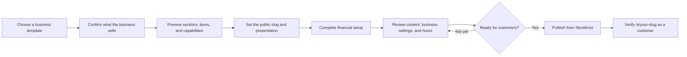

## Use This Doc For

- `/storefront/setup`
- `/admin/storefront/setup`
- `/storefront`
- `/s/{your-slug}`

## Before You Start

Storefront setup turns the business model you select into a working customer
experience. It creates the starting sections and items, selects the customer
interaction model (booking, purchase, inquiry, or donation), and connects that
model to the rest of the platform.

Use the closest built-in template when one fits. A template is more than a
visual theme: it carries the archetype, vocabulary, capabilities, operational
value stream, and starting public content. If none fits, choose **Can't find
your business?** to define a custom operating model, customer interaction, and
offerings.

Only create the storefront after the organization and its business basics are
correct. Setup can be run once. After a storefront exists,
`/storefront/setup` redirects to the Storefront dashboard.

## From Setup To A Live Portal

## Complete The Guided Setup

1. Open **Storefront → Setup** and search for the business template that best
   matches how customers interact with you. Review any suggested template;
   suggestions are a starting point, not an automatic selection.
2. Under **What does your business sell?**, confirm the main product line. The
   suggested line is selected by default and can be renamed without changing
   its identity. Select an adjacent line only when customers genuinely buy that
   different kind of good or service. Use **Add product line** for a line that
   is not suggested. A salon might confirm **Salon services** and optionally
   **Hair-care products**; a restaurant might confirm **Dining** and optionally
   **Private events**.
3. Review the template preview. It names the sections and items that will be
   created and shows which platform modules and workspace experience the
   archetype activates. Answer any capability questions shown for that
   template.
4. Set the **URL slug**. The public path shown below the field is
   `/s/{your-slug}`. Choose a short, durable value that represents the
   organization. Also add the tagline and an externally reachable hero-image
   URL if they are ready.
5. Select **Create Portal**. The platform creates the storefront, its starting
   sections and items, the confirmed product-line and product hierarchy, the
   matching default commercial offerings and catalog items, the matching
   archetype compositions, and the corresponding business and operational
   architecture. Storefront items are channel presentations of those shared
   catalog items, not a second commercial source of truth. The organization is
   the provider. Setup does not
   invent product teams, business units, subscribers, entitlements, or
   customers; consumer context appears only after real customer, booking,
   order, subscription, or fulfilment evidence exists. Booking-oriented
   templates also receive starter provider availability and booking
   configuration.
6. Complete the financial setup step. Confirm the currency and the
   archetype-matched financial choices. Regulated financial-services setups
   continue to the licensing workspace; other setups return to Storefront.

The new portal is deliberately **unpublished**. Until you publish it, the
customer-facing content path returns 404. This is a launch gate, not a setup
failure.

## Launch Readiness Check

Before publishing, review the Storefront dashboard's setup-status steps and
open each relevant workspace:

| Check | Where | Confirm |
| --- | --- | --- |
| Public identity | **Settings → Portal** | slug, tagline, description, contact details, and hero image |
| Business truth | **Settings → Your Business** | mission, market, address, jurisdictions, payment handling, and risk posture |
| Product mix | **Products / Portfolio** | the main and adjacent product lines match what the organization actually sells |
| Customer content | **Sections** and **Items** | only intended sections are visible; names, descriptions, prices, calls to action, and images are accurate |
| Fulfilment | **Team**, **Tables & Capacity**, or **Units** when shown | the people or resources that receive work exist and have the right capacity |
| Time and availability | **Settings → Operating Hours** | timezone and every open/closed day are correct |
| Customer response | **Inbox** | the team knows where inquiries, bookings, orders, or donations arrive |

Select **Publish now** on the Storefront dashboard only after these checks.
Publishing makes the portal available immediately at `/s/{your-slug}`.

If an older item shows **Needs setup link**, DPF could not find real
product-line evidence for it during upgrade reconciliation. The item remains
usable through the compatibility path, but it is not silently attached to a
guessed product. Confirm the business's product mix before treating that item
as catalog-backed.

Setup also derives the ordinary customer route from real storefront evidence:
booking items book a time, purchase items buy directly, rental items reserve,
and quote-required items request a quote. Setup does not guess a route for an
ambiguous inquiry. After launch, use an item's contextual **Manage packaging
and sales options** action only when it needs packages, seasonal prices,
reusable configurations, or another verified route. Those controls are
collapsed by default so a simple one-line business keeps the ordinary
one-item/one-price workflow.

## Verify The Customer Experience

Use **View Live** to open the public URL in a new tab. Verify it as a customer,
not only from the management view:

1. Confirm the organization name, branding, tagline, and contact information.
2. Open each visible section and active item.
3. Exercise the applicable call to action: check booking dates, begin an order,
   open the inquiry form, or start a donation.
4. Check the page at both desktop and narrow/mobile width.
5. Confirm that public hours and trust information match the business.

If the portal is not ready, select **Unpublish** on the Storefront dashboard.
The public content path returns 404 again while the internal configuration and
submitted records remain available. Fix the content, recheck the public path,
and publish again.

## What To Watch

- partial setup being treated as launch-ready
- choosing an archetype for its appearance when its customer interaction and
  operating model do not match the business
- selecting suggested adjacent product lines that the business does not
  actually sell
- treating an unpublished portal's 404 as a broken route
- publishing starter sections, prices, or availability without reviewing them
- using a temporary URL slug and then distributing or bookmarking it
- launch decisions being made without an end-to-end public-path check

## Related

- [Storefront](./index.md) — concepts, setup status, service lines, and generated-content recovery.
- [Settings: Business And Operations](./settings-business-and-operations.md) — what each settings area changes and how to verify it.
